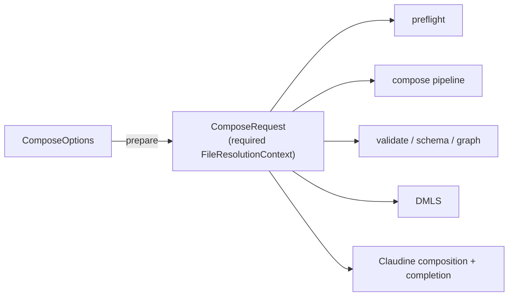

# File References Resolve From One Prepared Context

## Problem

File references are supposed to mean the same thing everywhere: biscuit-file's
grammar (`./`, bare, `&`, `^`, `@`, `~`, absolute) picks the roots, and the
request's `FileResolutionContext` supplies them. Two defects show that nothing
enforces this, and that it fails silently when it breaks.

### Incident 1: `&` and `^` fail in `md compose`

From `claudine/` in this repository:

```text
$ md compose docs/use-claudine/SKILL.md
TransclusionError: file reference failure
`^` repository reference requires a repository containing reference CWD
`…/feat-schema-enhancement/claudine/docs/use-claudine`
```

The document contains `::file ^claudine/docs/cli/index.md`, which exists. It
fails the same way with `&`, in a linked worktree or a plain repository.

The CLI runs **preflight** (`compose_preflight`,
`darkmatter/lib/src/markdown/compose/preflight/mod.rs`, then
`collect_effects` in `preflight/collect.rs`) before the compose pipeline.
Only the pipeline (`run_compose_pipeline`, `compose/pipeline/mod.rs`) calls
`ComposeOptions::establish_repository_observation` and
`ensure_file_resolution_context`. Preflight's transclusion options therefore
carry no context, and the resolver's `document_resolution_context(.., None)`
(`compose/util.rs`) falls back to `FileResolutionContext::new(base_dir)`. That
context has no repository root, so every `&` and `^` reference, and every bare
reference that only exists at the repository root, fails before the pipeline
is reached.

The regression dates from `267c6dde3` (2026-08-27), which moved repository
discovery from each reference to the request boundary but added the boundary
setup to the pipeline only. No test transcludes an `&` or `^` target, and the
library tests enter through the pipeline, so nothing caught it.

### Incident 2: `file(match(...))` ignores reference prefixes

A `match()` pattern is meant to use the same grammar. In an external
repository, launched from its root:

```yaml
$schema:
    - spec: file(required;eager;match(^**/*spec*.md))
```

`compose ~/.claudine/prompts/implement.md spec=ts-review<TAB>` offers nothing,
although `fixes/2026-09-29-ts-review-improvements/spec.md` exists.
`FileMatchGlobs::compile`
(`darkmatter/lib/src/markdown/schemas/file_match.rs`) strips only `!` and
hands the rest to `globset`, which reads `^**/…` as a literal `^`. Claudine's
candidate walk (`claudine/cli/src/completion/schema_completion/candidates.rs`)
walks only the launch directory (`scopes::property_value_root`), and
validation (`admits` in `file_match.rs`) judges files against a fixed anchor
list unrelated to the pattern. The pattern compiles without complaint, so the
author gets an empty list and no diagnostic.

### The shared cause

Both incidents are the same design gap:

1. **The prepared context is optional.** Darkmatter has about 52
   `Option<FileResolutionContext>` / `Option<&FileResolutionContext>`
   signatures and 35 non-test `FileResolutionContext::new` calls, and only one
   caller of `ensure_file_resolution_context`. Every entry point must remember
   the setup; forgetting it compiles, works for `./` paths, and fails only for
   repository-anchored references.
2. **Prefix-plus-glob is reimplemented.** `find_files()`
   (`compose/expression/functions/mod.rs`) already splits `&`, `^`, `@` from a
   glob and resolves the root through biscuit-file. `match()` and
   `::file-links <glob>` (`compose/file_links/discovery.rs`, "relative to the
   containing document") each have their own, prefix-unaware version.
3. **No test holds entry points to one answer.** Each entry point is tested
   through its own path fixtures, so a path that resolves differently in one
   of them goes unnoticed.

## Expected Behavior

Three changes remove the gap. Each makes the category of defect above a
compile error or a failing matrix cell rather than a user report.

### 1. A prepared request is a type

`ComposeOptions` gains a single preparation step that returns a
`ComposeRequest` (name to be settled in planning). Preparation performs what
`establish_repository_observation` and `ensure_file_resolution_context` do
today, and the result holds a **required** `FileResolutionContext` (with its
repository scope catalog and magic paths applied).

```rust
let request = ComposeRequest::prepare(options)?;
compose_preflight(&request, …)?;
run_compose_pipeline(&request, …)?;
```

- Every entry point that resolves file references takes `&ComposeRequest`
  (or the context it owns), not `&ComposeOptions`: the compose pipeline,
  preflight, the `md` CLI routes (compose, validate, schema, hash, graph),
  DMLS request handling, and Claudine's composition and completion. Planning
  enumerates the full list from the call graph; the rule is that an entry
  point cannot obtain a context any other way.
- `establish_repository_observation` and `ensure_file_resolution_context`
  stop being callable on their own; preparation is the only caller.
- Magic paths are applied once, during preparation. Today the transclusion
  resolver applies `options.magic_paths` only on the no-context branch; with
  a required context that branch disappears, and planning must confirm magic
  paths are not dropped for any source.



### 2. No silent fallback context

- `document_resolution_context`, `TransclusionOptions`, and every other
  holder of a request context take `&FileResolutionContext` (or an owned one),
  never `Option`. The compiler then lists every site that was getting by on a
  bare context.
- Code with no request, such as a standalone library call on a string,
  obtains its context from the same preparation step. A new
  `FileResolutionContext::new(base_dir)` inside Darkmatter's request path is
  a defect; the remaining constructions are limited to preparation itself and
  tests.
- Nested sources keep using `for_source` / `for_base` on the request context,
  so they inherit the repository catalog instead of rediscovering it.

### 3. `GlobReference` in biscuit-file

A caller knows whether it wants one file or a set of files, and says so by
the type it constructs. `FileReference` stays the single-file type and never
interprets glob syntax: `[`, `]`, `*`, and `?` are legal file-name characters
(`pages/[id].md` is common, and only Windows forbids `*` and `?`), so only
the caller can say whether `[id]` is a literal name or a character class.
biscuit-file gains a `GlobReference` for callers that want globs:

```rust
// One file, never a glob: `[id].md` is a literal name.
FileReference::new("^pages/[id].md")?.resolve_in_context(&ctx)?;

// One or more patterns; the same prefix grammar and roots.
let globs = GlobReference::new(["^**/*spec*.md", "!&**/_completed/**"])?;
globs.list_files(&ctx)?;     // every match, in precedence order
globs.take_first(&ctx)?;     // the first element of that order
globs.matches(&path, &ctx);  // membership of one existing file
globs.roots(&ctx);           // ordered roots, for callers that walk themselves
```

- **One prefix grammar.** `GlobReference` reuses `FileReference`'s prefix
  parsing and sigil-to-roots mapping inside biscuit-file; only the text
  after the prefix is read differently (literal path vs glob). It is the only
  implementation of prefix-plus-glob in the repository, and `find_files()`'s
  current splitter is folded into it.
- **Patterns.** Each pattern is `[!][reference-prefix]glob`. `!` marks an
  exclusion and is meaningful only in `GlobReference`; in `FileReference` it
  remains the reserved, removed sigil. A pattern without glob
  metacharacters is valid and matches that one path.
- **Which API a consumer uses:**

  | Consumer                                                         | Type             | Call                                  |
  |------------------------------------------------------------------|------------------|---------------------------------------|
  | `::file`, `::code`, `::toc-linking <filename>`, `proxy`, schema `file` values | `FileReference`  | `resolve_in_context`                  |
  | `::file-links <glob>`, `find_files()`                            | `GlobReference`  | `list_files`                          |
  | `file(match(...))`                                               | `GlobReference`  | `roots` (completion), `matches` (validation) |
  | a single-file consumer that deliberately accepts a glob          | `GlobReference`  | `take_first`                          |

- **Hint on a literal miss.** When a `FileReference` finds nothing and its
  text contains glob metacharacters, the error suggests the glob-accepting
  form (for example `::file-links`).

| Pattern                    | Roots the glob runs under                                  |
|----------------------------|------------------------------------------------------------|
| `**/*spec*.md` (bare)      | Base directory, then repository root (implicit relative)   |
| `./docs/**/*.md`, `../x/*` | Base directory only                                        |
| `&fixes/**/spec.md`        | Repository root only                                       |
| `^**/*spec*.md`            | Package root, package-area root, repository root           |
| `@prompts/*.md`            | The `@` magic chain, in biscuit-file's tier order          |
| `~/notes/**/*.md`          | Home directory                                             |
| `/abs/dir/*.md`            | Used verbatim                                              |

- **Roots come from the context.** The roots for a prefix are exactly the
  ones `FileReference` resolution uses for that sigil. Literal directory
  segments before the first glob metacharacter narrow the root.
- **"Base directory"** is the launch directory for a caller-supplied value
  (compose, completion, choosers) and the document's directory for a value or
  directive authored in a document (frontmatter validation, `::file-links`).
- **Nearest-root judgment.** For each pattern, a file is judged by exactly
  one relative path: its path (in `/` spelling) relative to the **first** of
  that pattern's roots, in precedence order, that contains it. A file under
  none of the roots is outside the pattern. Later roots only reach files the
  earlier roots do not contain, mirroring first-candidate-wins resolution. The
  existing "a pattern without `/` also matches at any depth" rule and
  file-name matching apply to that relative path.
- **Negation composes.** `!` comes first and takes its own prefix, as in
  `!&**/_completed/**`, and is judged by the same rule against its own roots.
  Judging by any containing root would let a negation be bypassed: launched
  from `darkmatter/` with `match(**/*spec*.md, !fixes/**)`,
  `darkmatter/fixes/x/spec.md` is `fixes/x/spec.md` from the launch directory
  (rejected) but `darkmatter/fixes/x/spec.md` from the repository root (not
  rejected). Under nearest-root judgment only the first view exists.

#### Result order: local first

`list_files` returns matches in one defined order, and `take_first` is its
first element. The principle is the one single-file resolution already
follows: **the most local root wins.** "Local" is the root precedence order
for the prefix (the table above), not path length. A package root is more
local than the repository root that contains it, even though its path is
longer.

1. **Root precedence.** The glob is run under each root in precedence
   order, producing one result list per root. For `^path/to/file*.md`:
   1. `{package-root}/path/to/file*.md`
   2. `{package-area-root}/path/to/file*.md`
   3. `{repository-root}/path/to/file*.md`
2. **Chaining and ownership.** The per-root lists are chained in that order.
   A file belongs to the first root that contains it: a later root skips
   every file under an earlier root, whether the earlier root included or
   excluded it. Deduplicating only earlier *included* results is not enough:
   with `["^**/*spec*.md", "!x/**"]` in package `claudine/pkg`,
   `{pkg}/x/spec.md` is excluded in the package pass (`x/spec.md`), and the
   repository pass would then include it (`claudine/pkg/x/spec.md` does not
   match `!x/**`). Paths are compared canonically, so symlinked spellings of
   one file (`/var` vs `/private/var`) are one file.
3. **Within one root: shallowest first.** Matches under the same root are
   ordered by the number of path components relative to that root, fewest
   first.
4. **Tie-break: lexical.** Matches at the same depth under the same root are
   ordered by their `/`-spelled relative path.

`take_first` stops at the first root that yields a match and never walks
later roots.
- **Rejected prefixes.** `%` (recursive search), `vault:`, `http(s)://`, and
  `{{VAR}}` interpolation are errors inside a `GlobReference`. The glob is
  already recursive, and remote or vault roots are not walkable.
- **Diagnostics, never silence.** A rejected prefix, a malformed prefix, or
  an invalid glob is a typed error. In `match()` it is a schema definition
  error naming the property and pattern, reported wherever schema definitions
  are checked today; it is never "no candidates" or "admit everything".

#### Consumers

- **`file(match(...))`.** `FileMatchGlobs` becomes a thin wrapper over
  `GlobReference`. Claudine's `file_candidates` walks `roots()` in precedence
  order, applying the same ownership rule (each file visited once, under its
  most local root), instead of `property_value_root`; walk filters (hidden,
  gitignored, `_`-prefixed, `SKIP_DIRS`) and the substring filter on the
  typed partial are unchanged. `admits` / `admits_path` drop the fixed anchor
  list and call `matches`, and `file_match_admits` (Claudine's root-union arm
  selection) follows.
- **`find_files()`.** Calls `list_files`. It gains `./`, bare two-root
  search, `~`, absolute, negation, and the diagnostics above, and its results
  follow the local-first order (today they are sorted lexically within one
  directory).
- **`::file-links <glob>`.** The glob form accepts reference prefixes; a bare
  glob keeps searching from the containing document first, and now also the
  repository root. `--dir` mode is unchanged.

#### Directive targets

Single-file directive targets already parse as `FileReference`: `::file`,
`::code`, and `::toc-linking <filename>` (including each `|` alternative).
They resolve through the transclusion resolver and therefore inherit
Incident 1: in preflight they had no repository root. Changes 1 and 2 fix
them without directive-specific code; each is a consumer row in the parity
matrix so that stays true.

#### Rendering completion candidates

A candidate under the launch directory is rendered relative to it, as today.
A candidate outside it is rendered as an absolute path, so resolving the
inserted value from the launch directory always lands on the file the walk
found.

### Entry-point parity matrix

One L1 fixture repository (a small monorepo with a package area and a
package) contains a document at each of three depths and a target for each
reference form:

| Form                       | Example target                         |
|----------------------------|----------------------------------------|
| explicit relative          | `./sibling.md`                         |
| bare, beside the document  | `beside.md`                            |
| bare, only at repo root    | `root-only.md`                         |
| repository root            | `&root-only.md`                        |
| repository scoped          | `^area-doc.md` (package → area → repo) |
| magic                      | `@magic-doc.md` (configured magic path) |
| home                       | `~/…` (under a fixture `HOME`)         |
| `GlobReference`            | `^**/*spec*.md`, `!&**/_completed/**`  |

Every entry point from change 1 runs the same references and must produce
the same resolved files (or the same typed error): compose pipeline,
preflight, the `md` CLI through `CliProcessFixture`, schema validation, DMLS,
and Claudine composition and completion. Within compose, each reference
form is exercised through every consumer: `::file`, `::code`,
`::toc-linking`, `::file-links`, `find_files()`, and `file(match(...))`.
The matrix is a table the test iterates, so a new entry point, consumer, or
reference form is one row, and the test fails if an entry point listed in
change 1 is missing from it.

## Scope

In scope:

- **biscuit-file:** `GlobReference`, its parser, root resolution, ordering, and
  nearest-root judgment.
- **darkmatter:** `ComposeRequest` preparation; removing `Option` contexts
  and the `document_resolution_context` fallback; preflight, pipeline, CLI,
  schema, and DMLS entry points; `FileMatchGlobs`, `find_files()`, and
  `::file-links` on `GlobReference`.
- **claudine / claudine-cli:** composition and completion on the prepared
  context; `file_candidates` walking `GlobReference` roots.
- **Tests:** the parity matrix, plus regression tests for both incidents.
- **Docs:** `biscuit-file/docs/topics/file-references.md` (`GlobReference`,
  its ordering, and when to choose it over `FileReference`);
  `darkmatter/docs/topics/schemas/definition.md` (`file` row and
  `match(globs)` section, one example per prefix);
  `darkmatter/docs/inline/file-links.md`; the `find_files()` expression docs;
  the `darkmatter`, `biscuit-file`, and `claudine` skills; and any Claudine
  topic page describing `match()` completion.

Out of scope:

- Completion with a `~/`-spelled prompt path. Claudine's
  `resolve_prompt_path` does not expand `~`, so
  `compose ~/.claudine/prompts/x.md spec=<TAB>` finds no prompt and offers no
  schema candidates. That is a separate Claudine fix.
- `::toc-linking` `filter=` / `keep=` globs (`compose/toc_linking/filter.rs`).
  They match heading text, not paths, and a leading `^` already means
  "case-sensitive" there (`darkmatter/docs/inline/toc-linking.md`). They stay
  plain globs; parsing them as `GlobReference` patterns would change the
  meaning of
  `^` in existing documents. The directive's `<filename>` target is in scope
  (see Directive targets).
- Schema trigger patterns (`schemas/triggers/matcher.rs`). They match globs
  against paths the caller already has, rather than naming roots to search;
  see Open Questions.

## Decisions

1. **Bare patterns follow implicit-relative rules** (2026-09-30). A bare glob
   searches the base directory, then the repository root, exactly as a bare
   file reference does; `./` confines it to the base directory. Launched from
   a subdirectory, `match(**/*spec*.md)` therefore also offers
   repository-wide specs. Nearest-root judgment keeps negations correct across
   the two roots.
2. **Candidates outside the launch directory render as absolute paths**
   (2026-09-30). Sigil-prefixed rendering (`&fixes/…`) is shorter but can
   resolve to a different file when a closer root shadows the path (`^`,
   `@`).
3. **The three structural changes are the core of this fix** (2026-09-30).
   Fixing preflight alone, or `match()` alone, would leave the category open.
4. **`::file-links <glob>` adopts `GlobReference`** (2026-09-30).
5. **Callers choose single-file or glob by type** (2026-09-30).
   `FileReference` never interprets glob syntax; `GlobReference` is the only
   glob-aware reference.
6. **`GlobReference` results are local-first** (2026-09-30): root
   precedence, then shallowest under a root, then lexical. "Local" is root
   precedence, not path length. A file belongs to its most local root.
7. **`::toc-linking` heading filters stay plain globs** (2026-09-30). They
   match heading text, where `^` means case-sensitive. Only the directive's
   file target is a reference.

## Open Questions

1. **Schema triggers.** Should trigger glob patterns also parse as glob
   references (prefix selects what the path is made relative to), or stay
   plain globs over already-known paths?
2. **`%` recursive search.** `%name.md` is effectively
   `take_first` on `**/name.md`, but today picks the global lexical winner.
   Should it move onto `GlobReference` and local-first ordering, in this fix
   or a follow-up?
3. **Sequencing.** Change 2 touches about 50 signatures. Planning may land
   change 1 with the preflight regression test first, then change 2, then
   change 3 and its consumers, as separate commits within this fix.

## Acceptance Criteria

1. **Incident 1.** `md compose docs/use-claudine/SKILL.md` from `claudine/`
   succeeds, and a CLI test in a temporary git repository composes a document
   containing `::file &target.md` and `::file ^target.md` from a nested
   directory.
2. **Incident 2.** In a fixture with
   `fixes/2026-09-29-ts-review-improvements/spec.md`, launched from the
   repository root, completing `spec=ts-review` against
   `file(match(^**/*spec*.md))` yields exactly
   `spec='fixes/2026-09-29-ts-review-improvements/spec.md'`.
3. **Required context.** No function on Darkmatter's request path accepts
   `Option<FileResolutionContext>` or `Option<&FileResolutionContext>`, and
   `FileResolutionContext::new` appears only in preparation and tests.
4. **Single preparation.** `establish_repository_observation` and
   `ensure_file_resolution_context` (or their successors) have exactly one
   caller, the preparation step.
5. **Parity matrix.** Every entry point in change 1 resolves every form in
   the matrix to the same file or the same typed error, and the test fails
   when an entry point is not represented.
6. **One glob implementation.** `match()`, `find_files()`, and
   `::file-links <glob>` all parse through biscuit-file's `GlobReference`;
   no other code in the repository splits a reference prefix from a glob.
7. From a nested package directory, a `^**/*spec*.md` or `&**/*spec*.md`
   pattern still offers a repository-root spec, and `./**/*spec*.md` offers it
   only when it lies under the launch directory.
8. `!&**/_completed/**` excludes a file that a positive `^` pattern would
   otherwise admit.
9. **Nearest-root judgment.** Launched from a nested directory `pkg/`, with
   `match(**/*spec*.md, !fixes/**)`, neither `pkg/fixes/x/spec.md` nor the
   repository root's `fixes/y/spec.md` is offered or admitted, while
   `other/z/spec.md` outside `pkg/` is offered (as an absolute path) and
   admitted.
10. Root-union arm selection (`file_match_admits`) and the
    `x-darkmatter-match` validator accept and reject the same files the
    candidate walk offers, for every prefix.
11. `match(%**/*.md)`, `match(vault:x/*.md)`, and an invalid glob each produce
    a schema definition error naming the property and pattern.
12. Existing bare-pattern tests (`*.png`, `src/**/*.rs`, `!_*.md`) pass
    unchanged when launched from the repository root. Existing
    `find_files()` tests pass unchanged except where they assert an order
    that local-first ordering changes; each such change is listed in the
    implementation log.
13. **Local-first order.** In a fixture package `pkg` inside area `area`,
    `GlobReference::new(["^**/intro.md"]).list_files()` returns, in order:
    `{pkg}/intro.md`, `{pkg}/a/b/intro.md`, `{area}/intro.md`,
    `{repo}/intro.md`, `{repo}/z/intro.md`, each exactly once, although
    the repository pass also reaches the package's and area's files.
    `take_first()` returns `{pkg}/intro.md` without walking the area or
    repository roots.
14. **Tie-break.** Under one root, `b/intro.md` and `a/intro.md` list as
    `a/intro.md` then `b/intro.md`, and both follow `intro.md`.
15. **Ownership with exclusion.** With
    `GlobReference::new(["^**/*spec*.md", "!x/**"])` in package
    `claudine/pkg`, `{pkg}/x/spec.md` is not returned by `list_files` and
    `matches` rejects it, although the repository-relative path
    `claudine/pkg/x/spec.md` does not match `!x/**`.
16. **Literal brackets.** `FileReference::new("pages/[id].md")` resolves the
    file literally named `[id].md`, while `GlobReference::new(["pages/[id].md"])`
    treats `[id]` as a character class.
17. Behavior is identical on macOS, Linux, and Windows: roots and relative
    paths are compared in `/` spelling, including through symlinked temporary
    directories.
