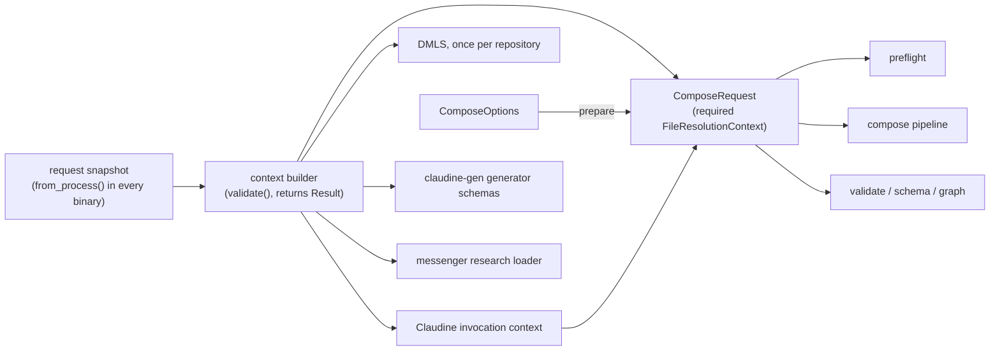
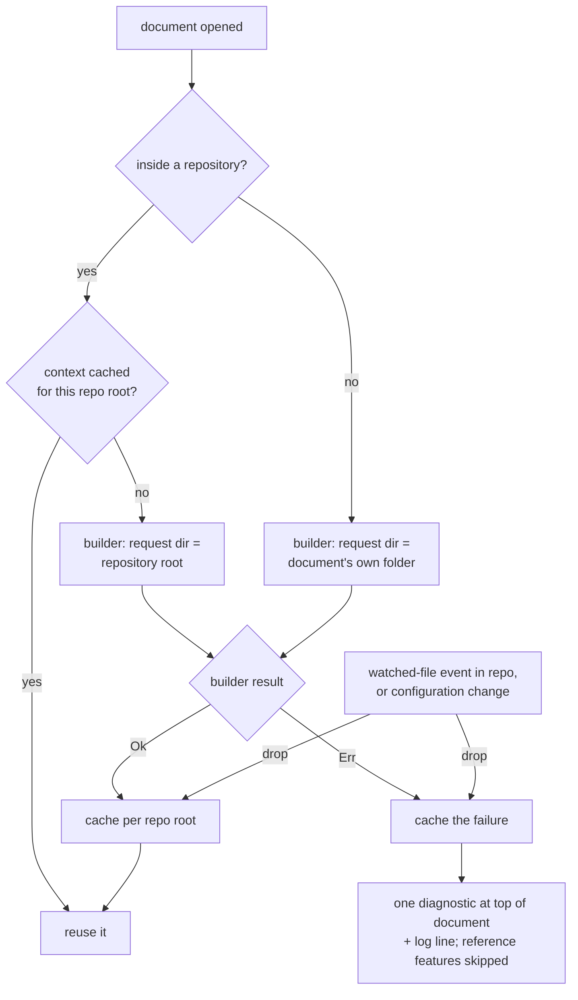

# File References Resolve From One Prepared Context

## Problem

File references are supposed to mean the same thing everywhere: biscuit-file's
grammar (`./`, bare, `&`, `^`, `@`, `~`, absolute) picks the roots, and the
request's `FileResolutionContext` supplies them. The incident below shows that
nothing enforces this, and that it fails silently when it breaks.

### Incident 1: `&` and `^` fail in `md compose`

From `claudine/` in this repository:

```text
$ md compose docs/use-claudine/SKILL.md
TransclusionError: file reference failure
`^` repository reference requires a repository containing reference CWD
`…/feat-schema-enhancement/claudine/docs/use-claudine`
```

The document contains `::file ^claudine/docs/cli/index.md`, which exists. It
fails the same way with `&`, in a linked worktree or a plain repository.

The CLI runs **preflight** (`compose_preflight`,
`darkmatter/lib/src/markdown/compose/preflight/mod.rs`, then
`collect_effects` in `preflight/collect.rs`) before the compose pipeline.
Only the pipeline (`run_compose_pipeline`, `compose/pipeline/mod.rs`) calls
`ComposeOptions::establish_repository_observation` and
`ensure_file_resolution_context`. Preflight's transclusion options therefore
carry no context, and the resolver's `document_resolution_context(.., None)`
(`compose/util.rs` ~81) falls back to `FileResolutionContext::new(cwd)`. That
context has no repository root, so every `&` and `^` reference, and every bare
reference that only exists at the repository root, fails before the pipeline
is reached.

The regression dates from `267c6dde3` (2026-08-27), which moved repository
discovery from each reference to the request boundary but added the boundary
setup to the pipeline only. No test transcludes an `&` or `^` target, and the
library tests enter through the pipeline, so nothing caught it.

A second defect found at the same time, `file(match(...))` ignoring
reference prefixes (Incident 2), has a different cause: prefix-plus-glob is
reimplemented without the reference grammar. It is written up and fixed by
the feature `2026-09-30-glob-reference`, which depends on this fix and is
implemented right after it on the same branch (Decision 16); this fix does
not change `match()`.

### The shared cause

Incident 1 is one instance of a design gap:

1. **The prepared context is optional.** Darkmatter has about 52
   `Option<FileResolutionContext>` / `Option<&FileResolutionContext>`
   signatures and 35 non-test `FileResolutionContext::new` calls, and only one
   caller of `ensure_file_resolution_context`. Every entry point must remember
   the setup; forgetting it compiles, works for `./` paths, and fails only for
   repository-anchored references.
2. **Every consumer builds its own context.** Outside darkmatter the same
   setup is repeated by hand, each copy deciding for itself which parts of
   the repository catalog and magic paths to apply (see
   [The context builder](#the-context-builder)). The `md` CLI's copy omits the
   package catalog, so `^` there cannot see package roots. DMLS builds no
   context at all, so `&`, `^`, and `@` do not work in the editor.
3. **Ambient process state leaks in.** Several request paths read the
   process's current directory instead of the request's, and
   `FileResolutionContext::new` silently snapshots `HOME` and the environment.
   Both make a result depend on where and how the process was started rather
   than on the request.
4. **No test holds entry points to one answer.** Each entry point is tested
   through its own path fixtures, so a path that resolves differently in one
   of them goes unnoticed.

## Expected Behavior

The preflight regression is fixed first, directly, so the user-visible
defect does not wait on the refactor. Two structural changes then remove the
gap. Each makes the category of defect above a compile error or a failing
matrix cell rather than a user report.

### 0. Preflight regression fix

Preflight obtains the same prepared context the pipeline uses, so `&`, `^`,
and repository-root bare references resolve in preflight as they do in the
pipeline. It lands with a regression test (Acceptance Criterion 1) as the
first commit, before changes 1 and 2 reshape the code around it.

### 1. A prepared request is a type

`ComposeOptions` gains a single preparation step that returns a
`ComposeRequest` (name to be settled in planning). Preparation performs what
`establish_repository_observation` and `ensure_file_resolution_context` do
today, and the result holds a **required** `FileResolutionContext` (with its
repository scope catalog and magic paths applied), built through
[the context builder](#the-context-builder).

```rust
let request = ComposeRequest::prepare(options)?;
compose_preflight(&request, …)?;
run_compose_pipeline(&request, …)?;
```

- Every entry point that resolves file references takes `&ComposeRequest`
  (or the context it owns), not `&ComposeOptions`: the compose pipeline,
  preflight, the `md` CLI routes (compose, validate, schema, hash, graph),
  DMLS (see [DMLS](#dmls)), and Claudine's composition and completion.
  Planning enumerates the full list from the call graph; the rule is that an
  entry point cannot obtain a context any other way.
- `establish_repository_observation` and `ensure_file_resolution_context`
  stop being callable on their own; their work moves into preparation and
  the builder.
- Magic paths are applied once, by the builder. Today the transclusion
  resolver applies `options.magic_paths` only on the no-context branch; with
  a required context that branch disappears, and planning must confirm magic
  paths are not dropped for any source.



#### Terms

biscuit-file's context, after `2026-09-30-reusable-path`, has three
directories. This fix uses the code's names for them:

| Term | Code | Meaning |
|------|------|---------|
| request directory | `request_cwd()`, `LaunchMagicScope`, `ContextAnchor::RequestDirectory` | Where the request is anchored: where `@` magic searches begin and where caller-supplied values resolve |
| `cwd` | `cwd()` | Where `./`, `../`, and bare references start; a document's own folder once a context is derived for it |
| `base_dir` | `base_dir()`, `base_dir_origin()`, `base_dir_is_boundary()` | The root of the file tree and the boundary relative references must stay inside; its origin is Repository, Explicit, Vault, Home or Environment, or Fallback |

Earlier drafts said "base directory" for what is now the request directory.
`base_dir` now means only the tree root, and the feature
`2026-09-30-glob-reference` calls a value's own starting directory its
`cwd`, so none of the three names collide.

#### The context builder

Darkmatter publishes **one** public context builder, the successor to
`capture_file_resolution_context` and `ensure_file_resolution_context` (name
settled in planning). It is the only way a request path obtains a
`FileResolutionContext`.

- **Inputs.** One small, explicit **request snapshot** struct. It wraps
  biscuit-file's `FileResolutionContext::from_snapshot(cwd, home, env)`
  (`biscuit-file/lib/src/file_reference/context.rs` ~684), whose first
  argument becomes the request directory, and adds what biscuit-file has no
  slot for: extra `@` magic roots supplied by the caller, and the reference
  that opened the source document (so a document opened as `~/notes/x.md`
  keeps `~` as its tree root). Nothing is read from the process: there is no
  implicit current directory, home directory, or environment. A library call
  with no request names its request directory. (Today
  `ensure_file_resolution_context` falls back to `std::env::current_dir()`,
  and `FileResolutionContext::new(cwd)` (`context.rs` ~729) snapshots `HOME`
  and the environment itself.)
- **Process snapshot.** A `from_process()`-style constructor fills the
  snapshot from the running process. Only binaries call it, and every binary
  entry point that resolves file references does: `md`, `claudine`, `dmls`,
  `claudine-gen`, and `messenger` (whose `research` commands drive the
  research loader). Planning confirms the list from the call graph.
  Libraries receive a snapshot from their caller. Claudine already builds
  from explicit values (`FileResolutionContext::from_snapshot` in
  `build_file_resolution_context`, `claudine/lib/src/invocation_context.rs`
  ~2130), so its inputs map directly onto the snapshot.
- **Work.** Repository discovery from the request directory, then the
  repository scope catalog (package, package area, repository) and the magic
  paths.
- **Expression context.** The same snapshot feeds the `ctx.*` expression
  values that describe the process, such as its environment variables. They
  come from the request snapshot, not from a second read of the process
  (today `RuntimeContext::capture`, `compose/context/runtime.rs` ~160, and
  the context capture in `compose/context/capture/mod.rs` ~131 each call
  `std::env::vars()`), so an expression and a `{{VAR}}` file reference in
  the same request see one environment.
- **Tracing.** The builder emits one `tracing::debug!` event naming the
  chosen request directory and the `base_dir` origin, so a "file not found"
  report can be traced to the context that produced it.
- **Validation.** The builder calls `validate()` on the context it built and
  returns a `Result`. An invalid context (a relative directory, a request
  directory outside its tree, a conflicting explicit root) is an error at
  the builder and never flows downstream to fail later as a missing file.
- **Owner.** Darkmatter, not biscuit-file. biscuit-file owns
  `FileResolutionContext` but still provides no builder or snapshot type, and
  the package catalog comes from sniff, which depends on biscuit-file; a
  biscuit-file builder would be a dependency cycle.

A snapshot, rather than ambient state, is what lets the parity matrix's `~/`
rows use a fixture `HOME` without mutating the test process's environment.

**Derivations stay.** Building a context and deriving one are different
things. A nested source derives its context from the request's with the
derivations biscuit-file already ships: `for_source`, `for_cwd`,
`for_source_reference`, and the trusted-external forms
(`for_trusted_external_source`, `for_trusted_external_cwd`,
`for_trusted_external_source_reference`). Darkmatter's `SourceOpening` and
`source_file_context` (`darkmatter/lib/src/markdown/compose/context/options.rs`
~72–110) choose among them, and so do the `md` CLI
(`darkmatter/cli/src/commands/compose.rs` ~250 and ~297) and Claudine's
`derive_composition_source` (`invocation_context.rs` ~1177). Derivations
inherit the repository catalog instead of rediscovering it, and none of them
is replaced by the builder.

Its callers and the construction sites it replaces:

| Caller | Today | After |
|--------|-------|-------|
| `ComposeRequest::prepare` | `ensure_file_resolution_context` | calls the builder |
| Claudine | builds contexts itself: `build_file_resolution_context` in `claudine/lib/src/invocation_context.rs` (~2130), `claudine/lib/src/composition/resolve.rs` (~74, ~147), `composition/sequence/source.rs` (~95), `harness/resolve.rs` (~187), `system_prompt/resolve.rs` (~289), and `claudine/cli/src/completion/scopes.rs` (~240) | calls the builder, adding its own extra `@` prompt roots, and passes the result in. Part of its cross-repository source handling now lives in biscuit-file's trusted-external derivations and in `derive_composition_source`; Claudine keeps only its policy on top, and planning settles the exact split |
| claudine-gen | `generator_schemas` in `claudine/gen/src/inputs.rs` (~255) discovers the repository and builds a context with `FileResolutionContext::new` | calls the builder |
| DMLS | builds no `FileResolutionContext`. Schema validation passes only the document directory (`with_file_ref_fallback_dir`, `darkmatter/dmls/src/overlay/schema.rs` ~961); document links, the link graph, go-to-definition, and code actions join paths textually (`normalize_join`), so `&`, `^`, and `@` do not work in the editor | calls the builder once per repository, lazily, and every feature resolves through that context (see [DMLS](#dmls)) |
| `md` CLI | hand-built launch context in `darkmatter/cli/src/commands/compose.rs` (~211), without the package catalog; a second context rebuilt with `from_snapshot` and its own sniff discovery for a source in another repository (~281) | calls the builder for both; the derivations at ~250 and ~297 stay |
| messenger | `Loader::new` in `messenger/lib/src/research/load.rs` (~122) builds a context and supplies it to darkmatter | receives a builder result from the `messenger` binary |
| `::file-links` boundary | `resolve_boundary` (`darkmatter/lib/src/markdown/compose/file_links/discovery.rs` ~76) runs its own git discovery and falls back to `std::env::current_dir()` (~79) | **handed off** to `2026-09-30-glob-reference`, which deletes `resolve_boundary` and takes the boundary from the prepared context (Decision 16). This fix leaves it unchanged |

Planning confirms the complete site list from the call graph.

#### DMLS

DMLS resolves every file reference through a prepared context. It builds one
context per **repository**, lazily:

- On the first document it sees in a repository, DMLS discovers the
  repository from the document's directory and caches one context for that
  repository root. Later documents in the same repository reuse it, each
  deriving its own `cwd` from it.
- **The request directory is always the repository root.** The request
  directory is where `@` magic searches begin (package, package area, local
  root, then the home tiers, from biscuit-file's `LaunchMagicScope`) and
  where caller-supplied values resolve. DMLS uses the repository root even
  when the editor's workspace folder is somewhere else, so an `@` reference
  in the editor gives the same result as `md` run from the repository root.
  A workspace folder above the repository (such as `~/coding`) could not be
  used anyway: `validate()` rejects a request directory outside its tree.
- A document inside no repository gets a context whose request directory is
  the document's own folder.
- An **untitled buffer** (no file path) has no folder to start from. When
  the editor's workspace folders lie in exactly one repository, the buffer
  uses that repository's context, and its `cwd` is the repository root.
  Otherwise it has no context and gets the
  [context failure diagnostic](#when-a-context-cannot-be-built). Picking one
  of several repositories would make the same buffer resolve differently
  depending on which documents happened to be opened first. "Exactly one
  repository" is counted across all of the editor's workspace folders
  together (Decision 20).
- DMLS uses the darkmatter builder and reads only local files, so it stays
  passive.

Every DMLS feature moves onto that context in this fix: schema validation and
diagnostics, document links, the link graph, go-to-definition, and code
actions. `with_file_ref_fallback_dir` and the textual `normalize_join` of
reference targets stop being how any of them resolve a reference.

**The environment is the editor's.** DMLS fills its request snapshot with
`from_process()` once, at startup, from the environment the editor launched
it with. That is not always the user's shell environment: GUI editors on
macOS, started from the Dock or Finder, often lack variables set in shell
profiles. This affects `{{VAR}}` references, the `@` home tiers, and (with
`2026-09-30-glob-reference`) the `SCHEMAS_DIR` schema root. `HOME` and the
environment are fixed for the server's lifetime; restart the server to pick
up a change to them. The DMLS docs say so.

**Invalidation.** A cached context goes stale when the repository's layout
or the server's configuration changes. DMLS already receives both signals
(`workspace/didChangeWatchedFiles` through its watcher registration in
`darkmatter/dmls/src/workspace/watch.rs`, and
`workspace/didChangeConfiguration`, both dispatched in
`darkmatter/dmls/src/router.rs`):

- any watched-file event for a path inside a repository drops that
  repository's cached context;
- a configuration change drops every cached context;
- a dropped context is rebuilt lazily, the next time a document in that
  repository needs it.

DMLS watches its configured include globs and `**/schemas/*.yaml|yml`, and
this fix adds the package manifest file names that sniff uses to detect
packages (for example `Cargo.toml` and `package.json`; planning settles the
exact list from sniff's package detection) (Decision 19). Adding, removing,
or editing a manifest is therefore a watched event, so adding a package
drops the repository's cached context and the next request sees the new
package root. In server-rescan mode (clients without a reliable watcher), a
change the rescan detects, a manifest included, counts as a watched event.

##### When a context cannot be built

The builder returns a typed error (Decision 12), for example when a
directory it was given is relative or lies outside its tree. DMLS never
falls back to a weaker context. It:

- publishes **one error diagnostic** at the top of the document (line 0,
  column 0), whose message names the typed failure, including which
  directory was invalid, under a dedicated diagnostic code (working name
  `dm.context.build_failure`, settled in planning);
- writes the same failure to its log;
- skips the reference-dependent features for that document (document links,
  go-to-definition, and validation of file values) until the cached result
  is dropped as described above. Features that need no file resolution keep
  working.

The failure is cached in the context's place, so DMLS does not rebuild on
every keystroke, and the same events drop it.



### 2. No silent fallback context

- `document_resolution_context`, `TransclusionOptions`, and every other
  holder of a request context take `&FileResolutionContext` (or an owned one),
  never `Option`. The compiler then lists every site that was getting by on a
  bare context.
- Code with no request, such as a standalone library call on a string,
  obtains its context from the builder, naming its request directory. A new
  `FileResolutionContext::new(cwd)` or `from_snapshot` on a request path is a
  defect; the remaining constructions are limited to the builder itself and
  tests. Derivations from a built context are not constructions (see
  [The context builder](#the-context-builder)).
- No request path reads the process's current directory. The reads this fix
  removes, besides the builder's own:
  - `ensure_file_resolution_context` (`compose/context/options.rs` ~786);
  - `document_resolution_context`'s fallback to
    `FileResolutionContext::new(cwd)` (`compose/util.rs` ~81);
  - the `resolved_from` diagnostic in `schemas/format.rs` (~425);
  - `RuntimeContext::capture` and `capture_minimal` in
    `compose/context/runtime.rs` (~140 and ~182).

  Two reads are **handed off** to `2026-09-30-glob-reference`, which deletes
  the code that holds them (Decision 16):
  - `resolve_boundary` in `compose/file_links/discovery.rs` (~79);
  - `admits` in `darkmatter/lib/src/markdown/schemas/file_match.rs` (~185),
    when its `base_dir` argument is `None` (replaced by
    `GlobReference::matches`).

  Both specs are implemented on one branch and reach `main` together, so
  `main` never holds either read.
- `PortablePath` without `with_ctx` captures the working directory, home, and
  environment itself and discovers the repository. Darkmatter callers always
  pass the request's context (today link normalization,
  `compose/link_normalization.rs` ~194, skips `with_ctx` when it has none).

#### Guard tests

The rules of changes 1 and 2 are held by source-scan guard tests, not by
review. They follow the style of `darkmatter/cli/tests/l1/spawn_site_guard.rs`
and `darkmatter/lib/tests/l1/semantic_results_never_persist.rs`: production
`.rs` files are scanned with comments, string literals, and `#[cfg(test)]`
items blanked by the shared sanitizer (`cli/tests/common/source_scan.rs`),
identifiers match on identifier boundaries, and each allowlist names exact
files with exact occurrence counts. A new site, a moved count, or an entry
that matches no live site fails the guard. Planning names the tests; the
working name is `context_construction_guard.rs`. It holds three gates:

| Gate | Rejects | Allowlist |
|------|---------|-----------|
| Construction | `FileResolutionContext::new` and `FileResolutionContext::from_snapshot` | the builder only |
| Optional context | `Option<FileResolutionContext>` and `Option<&FileResolutionContext>` on a request path | empty |
| Ambient process state | `std::env::current_dir`, `std::env::var`, `std::env::vars`, and `std::env::home_dir` (and the `dirs`/`home` crate equivalents) | the process-snapshot constructor, plus each read that does not feed file resolution or `ctx.*` (rendering flags, for example), seeded from a census when the guard lands, each with a one-line reason |

The ambient-state gate rejects `std::env::var` and `std::env::vars`
outright rather than only the reads that feed file resolution, so its
allowlist is long: every legitimate environment read is an explicit, exact
entry (Decision 21). A long allowlist is accepted; it is the record of every
place a binary or library reads the process environment, and a new read
cannot slip in unreviewed.

The gates cover every package in this fix's scope. A test that scans another
package's source declares that package's source paths in
`[package.metadata.ci.tests] source-inputs`, as `docs/cicd/test-inputs.md`
requires; planning decides whether that is one test or one per package.
While the feature is still unimplemented on the branch, the
ambient-state allowlist carries `resolve_boundary` and `admits`, each marked
as handed off; the feature deletes both entries.

#### Directive targets

Single-file directive targets already parse as `FileReference`: `::file`,
`::code`, and `::toc-linking <filename>` (including each `|` alternative).
They resolve through the transclusion resolver and therefore inherit
Incident 1: in preflight they had no repository root. Changes 1 and 2 fix
them without directive-specific code; each is a consumer row in the parity
matrix so that stays true.

### Entry-point parity matrix

One L1 fixture repository (a small monorepo with a package area and a
package) contains a document at each of three depths and a target for each
single-file reference form:

| Form                        | Example target                                   | Runs at |
|-----------------------------|--------------------------------------------------|---------|
| explicit relative           | `./sibling.md`                                   | every entry point |
| bare, beside the document   | `beside.md`                                      | every entry point |
| bare, only at repo root     | `root-only.md`                                   | every entry point |
| repository root             | `&root-only.md`                                  | every entry point |
| repository scoped           | `^area-doc.md` (package → area → repo)           | every entry point |
| magic                       | `@magic-doc.md` (configured magic path)          | every entry point |
| home                        | `~/…` (under a fixture `HOME`)                   | every entry point |
| tree escape                 | `../` past the repository root                   | every entry point |
| (a) document opened through `~` | `./beside.md` and `../../outside.md` in a document opened as `~/notes/doc.md` | only where a `~` spelling reaches the library: a `::file ~/notes/doc.md` transclusion through the compose pipeline and preflight, and a quoted `md` argument (`md compose '~/notes/doc.md'`) |
| (b) the same document opened by its absolute path | the same two references in `{HOME}/notes/doc.md` | every entry point, including DMLS and Claudine |

The tree-escape row expects the failure class `InvalidReference` (biscuit-file
reports `RelativeTreeEscape`). The fixture places `outside.md` above the
fixture `HOME` and outside any repository, so the `~` rows differ only in how
the document was opened:

- **(a)** The opening reference makes the document's tree root the fixture
  `HOME` (origin Home, a boundary). `./beside.md` resolves beside the
  document, and `../../outside.md` climbs above `HOME` and expects
  `RelativeTreeEscape` (class `InvalidReference`).
- **(b)** Opened by an absolute path, the document's `base_dir` origin is
  Fallback, which is not a boundary. `./beside.md` resolves as in (a), and
  `../../outside.md` resolves to `outside.md`: no boundary error.

Row (a) cannot run everywhere because most entry points never see a `~`
spelling of a document. DMLS receives documents only as absolute paths
(file URIs). Claudine's `resolve_prompt_path` does not expand `~`. On a shell
command line an unquoted `~` is expanded by the shell, so `md compose
~/notes/doc.md` arrives as an absolute path, and only the quoted form keeps
the `~`. The editor and a `::file ~/…` compose of the same document therefore
legitimately disagree about `../../outside.md`: that is the design of
`2026-09-30-reusable-path`, which makes a document's tree root depend on how
it was opened. Row (b) holds every entry point to one answer for the
absolute-path case, and row (a) holds the `~`-capable ones to theirs.

The fixture `HOME` and environment reach every entry point through the
request snapshot; the test never mutates its own process environment.

The matrix is two tables the test iterates. A new entry point, consumer,
launch directory, or reference form is one row. **Missing entry points** are
caught by the compiler: the test declares an `EntryPoint` enum with one
variant per entry point of change 1, and builds both tables' rows from an
exhaustive `match` over it (no `_` arm), so a new variant without rows does
not compile. A companion assertion checks that every variant yields at least
one row in Table 1 or Table 2.

**Table 1: document-authored references.** Each form appears in a document
at each depth and runs through every entry point. The launch directory is
fixed at the fixture repository root, which is also DMLS's request directory
(Decision 10). Each cell's expected result depends only on the form, the
document's depth, and how the document was opened (rows (a) and (b) above),
so every entry point a row runs at must produce the same one. The quoted
`md` argument of row (a) is a caller-supplied value and runs in Table 2.

| Entry point                                       | Consumers                                                             |
|---------------------------------------------------|-----------------------------------------------------------------------|
| compose pipeline                                  | `::file`, `::code`, `::toc-linking <filename>`, schema `file` values  |
| preflight                                         | `::file`, `::code`, `::toc-linking <filename>`, schema `file` values  |
| `md` CLI routes, through `CliProcessFixture`      | the consumers each route reaches                                      |
| schema validation                                 | schema `file` values                                                  |
| DMLS schema validation and diagnostics            | schema `file` values                                                  |
| DMLS document links                               | directive and link targets                                            |
| DMLS link graph                                   | directive and link targets                                            |
| DMLS go-to-definition                             | directive and link targets                                            |
| DMLS code actions                                 | directive and link targets                                            |
| Claudine composition                              | `::file`, `::code`, `::toc-linking <filename>`, schema `file` values  |

**Table 2: caller-supplied values.** Each form is supplied as a value by the
caller, not written in a document, and runs from two launch directories: the
fixture repository root and a nested package. Each cell's expected result
depends only on the form and the launch directory.

| Entry point          | Value                                        |
|----------------------|----------------------------------------------|
| Claudine completion  | a schema `file` property value               |
| `md` arguments       | the document path and file-valued arguments  |

**Comparing results.** A cell expects either one resolved file or one
failure class.

- **Files.** Both sides are canonicalized with biscuit-file's
  `canonicalize_simplified` and then compared as `PathIdentity` values;
  `PathIdentity` alone is lexical and does not resolve symlinks (`/tmp` and
  `/private/tmp` differ on macOS). Reports spell paths with
  `to_portable_string`.
- **Errors.** Errors compare by biscuit-file's `ResolutionFailure`
  (`InvalidReference`, `MissingContext`, `NoMatch`, `Io`,
  `UnsupportedRemote`), never by message text, by the error type that wraps
  them, or by Darkmatter's `FileRefFailure`. `FileRefFailure` folds the new
  tree-boundary errors and a missing or invalid context into `NotFound`, so
  comparing by it would let Incident 1 pass as an ordinary miss.

The feature `2026-09-30-glob-reference` adds its glob form and consumers to
these same two tables, as rows and, where it adds an entry point, as
`EntryPoint` variants.

## Scope

In scope:

- **darkmatter:** the preflight fix; the public context builder, its request
  snapshot, and its validation; `ComposeRequest` preparation; removing
  `Option` contexts and the `document_resolution_context` fallback;
  preflight, pipeline, and schema entry points; removing every
  current-directory read listed in change 2 except the two handed off to
  `2026-09-30-glob-reference`; `ctx.*` process values from the snapshot;
  passing the context to every `PortablePath`.
- **darkmatter-cli:** every `md` route on the prepared request; both
  hand-built contexts replaced by the builder; the process snapshot.
- **dmls:** one context per repository, built lazily through the builder with
  the repository root as request directory; schema validation and
  diagnostics, document links, the link graph, go-to-definition, and code
  actions resolved through it; watching package manifest file names;
  dropping a cached context on a watched-file (manifests included, and
  rescan-detected changes) or configuration change; the context failure
  diagnostic; untitled
  buffers; the process snapshot.
- **claudine / claudine-cli:** the invocation context, composition, and
  completion call the builder instead of constructing contexts; the process
  snapshot in the `claudine` binary.
- **claudine-gen:** `generator_schemas` calls the builder; the process
  snapshot in its binary.
- **messenger / messenger-cli:** the research loader takes a built context;
  the `messenger` binary takes the process snapshot.
- **Tests:** the preflight regression test, the parity matrix, the
  source-scan guard tests, and the DMLS invalidation and failure tests.
- **Docs:** the darkmatter topic pages that describe request preparation and
  the library's file-resolution entry points (including that a library call
  names its request directory and passes a request snapshot), any DMLS page
  describing file references, its request directory, its environment
  (the editor's, fixed for the server's lifetime), cache invalidation, and
  the context failure diagnostic, and the `darkmatter` and `claudine`
  skills.

Out of scope:

- `GlobReference`, and `file(match(...))`, `find_files()`, and
  `::file-links <glob>` on it, including Incident 2. These belong to the
  feature `2026-09-30-glob-reference`.
- The current-directory reads in `resolve_boundary` and `admits`, handed off
  to that feature, which deletes both (Decision 16).
- The bare-reference fallback root. A bare reference keeps searching its
  `cwd`, then the repository root; whether a non-repository tree root should
  replace the repository root there is the unscheduled biscuit-file fix
  `bare-fallback-base-dir`.

## Decisions

1. **Split glob handling into a feature** (2026-09-30). This reverses the
   earlier decision that all three structural changes were the core of this
   fix. This fix keeps the preflight fix, the prepared request type, and the
   required context; `GlobReference` and its consumers move to
   `2026-09-30-glob-reference`. Reason: the context changes stand alone and
   fix Incident 1; the glob work is a new capability that builds on them.
2. **Commit order** (2026-09-30): the preflight fix with its regression test,
   then change 1, then change 2. Reason: the user-visible regression is
   fixed before about 50 signatures change.
3. **Darkmatter owns one public context builder** (2026-09-30). Every
   consumer, in and outside darkmatter, gets its context from it. Reason:
   biscuit-file cannot own it, since sniff (which supplies package
   detection) depends on biscuit-file.
4. **No implicit current directory** (2026-09-30). A library call with no
   request names its request directory, and no request path reads the
   process's current directory. Reason: an ambient CWD is the kind of silent
   fallback this fix removes. (Since Decision 16, two of the reads are
   removed by `2026-09-30-glob-reference` on the same branch; the rule holds
   for what reaches `main`.)
5. **Claudine keeps its own rules on top of the builder** (2026-09-30): its
   extra `@` prompt roots are passed in, and its cross-repository source
   policy stays in Claudine. Reason: those are Claudine policy, not
   file-reference grammar. (Since 2026-09-30-reusable-path, part of the
   cross-repository handling lives in biscuit-file's trusted-external
   derivations; planning settles what remains in Claudine.)
6. **DMLS builds one context per repository, lazily** (2026-09-30). On the
   first document in a repository it discovers the repository from the
   document's directory and caches one context per repository root; a
   document in no repository gets a context for its own directory. This
   replaces the earlier "once per workspace root" decision. Reason: a
   workspace folder can hold several repositories or sit inside one, and the
   repository is what `&` and `^` are anchored to. The clause "the request
   directory is the enclosing workspace folder, else the repository root" is
   **superseded by Decision 10**.
7. **Every DMLS feature moves onto the context in this fix** (2026-09-30):
   schema validation and diagnostics, document links, the link graph,
   go-to-definition, and code actions. Reason: moving only some would leave
   the editor giving different answers for the same reference.
8. **The parity matrix is two tables, compared by failure class**
   (2026-09-30): document-authored references from a fixed launch directory,
   and caller-supplied values from two launch directories. Reason: the two
   kinds of value have different starting directories, and messages and
   wrapper types differ legitimately between entry points. The clause
   "errors compare by `FileRefFailure` class" is **superseded by
   Decision 11**.
9. **The builder takes an explicit request snapshot** (2026-09-30): request
   directory, `HOME`, environment variables, and extra `@` roots; "base
   directory" is renamed "request directory" throughout this fix (the name
   the code now uses). Reason: `HOME` and the environment are ambient state
   just like the CWD, and the matrix's `~/` row needs a fixture `HOME` without
   mutating the process environment. The clause "a process constructor called
   only in the `md`, `claudine`, and `dmls` binaries" is **superseded by
   Decision 12**.
10. **DMLS's request directory is always the repository root** (2026-10-01),
    amending Decision 6. A document in no repository uses its own folder.
    Reason: `validate()` rejects a request directory outside the tree, which
    a workspace folder above the repository would be, and one rule is
    simplest; editor `@` results then equal `md` run from the repository
    root.
11. **Errors compare by `ResolutionFailure`** (2026-10-01), superseding the
    `FileRefFailure` clause of Decision 8; the matrix gains a `../`
    tree-escape row and a `~`-opened-document row. Reason: `FileRefFailure`
    maps boundary errors and a missing context to `NotFound`, which would
    hide Incident 1. The clause "a `~`-opened-document row" (checked at
    every entry point) is **superseded by Decision 13**.
12. **The builder validates, wraps `from_snapshot`, and is fed by every
    binary** (2026-10-01), superseding the process-constructor clause of
    Decision 9. The builder calls `validate()` and returns a `Result`; the
    request snapshot wraps `FileResolutionContext::from_snapshot(cwd, home,
    env)` and adds extra `@` roots and the source-opening reference;
    `from_process()` is called in every binary entry point (`md`, `claudine`,
    `dmls`, `claudine-gen`, `messenger`). Reason: an invalid context must
    fail where it is built, biscuit-file still has no builder or snapshot
    type, and a fixed list of three binaries missed two.
13. **The `~`-opened row splits by how the document was opened**
    (2026-10-01), superseding the `~`-opened-row clause of Decision 11. Row
    (a), opened through `~`, runs only where a `~` spelling reaches the
    library (`::file ~/…`, a quoted `md` argument, the pipeline, and
    preflight) and expects `RelativeTreeEscape` for a `../` above `HOME`;
    row (b), the absolute-path twin, runs at every entry point and expects
    no boundary error (origin Fallback). Reason: DMLS, Claudine, and a
    shell-expanded argument only ever see the absolute path, so the two
    answers legitimately differ by design of `2026-09-30-reusable-path`.
14. **DMLS drops a repository's context on a watched-file or configuration
    change** (2026-10-01) and rebuilds it lazily; `HOME` and the environment
    are fixed for the server's lifetime (restart to pick up a change).
    Reason: DMLS already receives both notifications, and dropping is
    simpler and safer than patching a context in place.
15. **Windows evidence by cross-check** (2026-10-01). `just cross-check
    <pkg> --os windows` is pre-authorized for every affected package; done
    means Linux and macOS green on the pull request, a Windows cross-check
    pass recorded in the implementation log, and the post-merge push to
    `main` watched. `ci:all-os` stays not pre-authorized. Reason: pull
    requests prove only Linux and macOS, and a cross-check gives Windows
    evidence before merge without a full-OS CI run.
16. **One branch, fix first, one merge** (2026-10-01). This fix and
    `2026-09-30-glob-reference` are implemented on `fix/magic-globs`, this
    fix first and the feature immediately after; nothing reaches `main`
    until both are done. The current-directory reads in `resolve_boundary`
    and `admits` are handed off to the feature, which deletes the code that
    holds them; the combined branch must satisfy both specs. Reason: both
    sites are rewritten by the feature anyway, and fixing them here would be
    throwaway work that `main` never sees.
17. **A failed DMLS context build is a diagnostic, never a silent
    degradation** (2026-10-01): one error diagnostic at the top of the
    document naming the typed failure, a log line, and reference-dependent
    features skipped for that document until the cached result drops.
    Untitled buffers use the workspace's repository context when the
    workspace lies in exactly one repository, and otherwise get the same
    diagnostic. Reason: an editor that quietly resolves less is the
    Incident 1 failure mode in another form.
18. **Rules are held by source-scan guards and an exhaustive entry-point
    enum** (2026-10-01). Acceptance Criteria 2, 3, and 5 are each checked by
    a guard test with an exact allowlist, and the parity matrix detects a
    missing entry point at compile time. Reason: a rule that only review
    enforces regrows, which is how Incident 1 happened.
19. **DMLS also watches package manifest file names** (2026-10-01): the
    manifest names sniff uses to detect packages (for example `Cargo.toml`
    and `package.json`; planning settles the exact list), so adding a
    package drops the repository's cached context. A change detected in
    server-rescan mode counts as a watched event. Reason: a new package
    changes `^` resolution, and waiting for an unrelated event or a restart
    would leave the editor resolving against a stale catalog.
20. **The untitled-buffer rule is accepted as written** (2026-10-01): an
    untitled buffer uses the repository-root context when exactly one
    repository is open across the editor's workspace folders, and otherwise
    gets the context-build-failure diagnostic. Reason: any other choice
    would make the same buffer resolve differently depending on what else
    happens to be open.
21. **The ambient-state guard rejects `std::env::var` and `vars` with an
    exact allowlist** (2026-10-01), even when that allowlist is long.
    Reason: the allowlist is the point; it records every environment read,
    so a new one is a deliberate, reviewed entry rather than a silent leak.

## Open Questions

None. No ruling remains for the author. Planning settles the names of the
prepared request type, the builder, the request snapshot, its process
constructor, the DMLS context failure diagnostic code, and the guard tests,
and the exact list of watched manifest file names (Decision 19).

## Pre-authorizations

Granted by the author on 2026-10-01. The implementer may, without pausing
to ask:

- create throwaway git fixture repositories and a fixture `HOME` in
  temporary directories;
- edit `docs/` topic pages and the `biscuit-file`, `darkmatter`, and
  `claudine` skills under `.claude/skills/`, as the drift rules require;
- modify messenger, messenger-cli, and claudine-gen so they obtain their
  context from the builder;
- run local L1 and L2 tests across every affected package area;
- run `just cross-check <pkg> --os windows` for every package in
  `packages`.

Not pre-authorized: adding the `ci:all-os` label or any extra CI cell. Ask
first.

## Acceptance Criteria

1. **Incident 1.** `md compose docs/use-claudine/SKILL.md` from `claudine/`
   succeeds, and a CLI test in a temporary git repository composes a document
   containing `::file &target.md` and `::file ^target.md` from a nested
   directory. This test lands in the first commit.
2. **Required context.** No function on Darkmatter's request path accepts
   `Option<FileResolutionContext>` or `Option<&FileResolutionContext>`. The
   optional-context gate of the [guard tests](#guard-tests) enforces this
   with an empty allowlist.
3. **One builder.** No request path in darkmatter, darkmatter-cli, dmls,
   claudine, claudine-cli, claudine-gen, messenger, or messenger-cli
   constructs a `FileResolutionContext` (with `new` or `from_snapshot`)
   except through the builder. Deriving from a built context is allowed:
   `for_source`, `for_cwd`, `for_source_reference`,
   `for_trusted_external_source`, `for_trusted_external_cwd`, and
   `for_trusted_external_source_reference`, including through Darkmatter's
   `SourceOpening` / `source_file_context` (`compose/context/options.rs`
   ~72–110), the `md` CLI's document derivations (`compose.rs` ~250 and
   ~297), and Claudine's `derive_composition_source`. Tests are excepted.
   The construction gate of the [guard tests](#guard-tests) enforces this:
   its allowlist names the builder and nothing else.
4. **Single preparation.** `establish_repository_observation`,
   `ensure_file_resolution_context`, and `capture_file_resolution_context`
   are replaced by the builder and `ComposeRequest::prepare`; none remains
   callable on its own.
5. **No ambient process state.** The builder takes its request directory,
   `HOME`, environment, extra `@` roots, and source-opening reference from
   the request snapshot and reads none of them from the process, and the
   `ctx.*` expression values that describe the process (its environment
   variables, for example) come from the same snapshot. No request path
   reads the process's current directory, including every site listed in
   change 2, and every Darkmatter `PortablePath` is given the context with
   `with_ctx`. Only the process-snapshot constructor reads process state, and
   only binary entry points call it; each binary that resolves file
   references (`md`, `claudine`, `dmls`, `claudine-gen`, `messenger`) does.
   The ambient-state gate of the [guard tests](#guard-tests) enforces this:
   it rejects every `std::env::current_dir`, `std::env::var`,
   `std::env::vars`, and `std::env::home_dir` read outside an explicit,
   exact allowlist in which each entry carries a one-line reason, however
   long that list is (Decision 21). **Handed off** to `2026-09-30-glob-reference`
   (Decision 16): `resolve_boundary`
   (`darkmatter/lib/src/markdown/compose/file_links/discovery.rs`) and the
   `match()` validator `admits`
   (`darkmatter/lib/src/markdown/schemas/file_match.rs`). Until the feature
   lands on the branch they are allowlist entries marked as handed off; the
   branch reaches `main` only after the feature has deleted both.
6. **Validated context.** The builder returns an error, not a context, when
   `validate()` fails; a test gives it a relative request directory and a
   request directory outside an explicit tree root and checks both are
   rejected at the builder. Every successful build emits a
   `tracing::debug!` event naming the request directory and the `base_dir`
   origin.
7. **Package catalog in the CLI.** From inside a package, `md compose` of a
   document containing `::file ^pkg-only.md`, where the file exists only at
   the package root, resolves it.
8. **DMLS per repository.** DMLS builds a context the first time it sees a
   document in a repository and reuses it for later documents in that
   repository; the context's request directory is the repository root, also
   when the editor's workspace folder is above the repository. A document in
   no repository resolves against its own folder.
9. **DMLS features.** An `&`, a `^`, and an `@` target each resolve to the
   same file as `md compose` run from the repository root does, in DMLS
   schema validation and diagnostics, document links, the link graph,
   go-to-definition, and code actions.
10. **Parity matrix.** For every cell of Table 1 (entry point × consumer ×
    form × document depth) and of Table 2 (entry point × form × launch
    directory), the entry point yields the cell's expected file, or an error
    whose biscuit-file `ResolutionFailure` is the cell's expected class;
    messages, wrapper error types, and `FileRefFailure` are not compared. The
    `../` tree-escape row yields `InvalidReference` at every entry point.
    Row (a), the document opened through `~`, runs at the `::file ~/…`
    transclusion through the pipeline and preflight and at a quoted `md`
    argument; its `./beside.md` resolves and its `../../outside.md` yields
    `RelativeTreeEscape` (class `InvalidReference`). Row (b), the same
    document opened by its absolute path, runs at every entry point,
    including DMLS and Claudine, and its `../../outside.md` resolves to
    `outside.md`. Entry points are an `EntryPoint` enum whose rows come from
    an exhaustive `match`, so a variant without rows does not compile, and an
    assertion checks that every variant has at least one row.
11. Behavior is identical on macOS, Linux, and Windows: files are compared
    by `canonicalize_simplified` followed by `PathIdentity`, so a symlinked
    temporary directory (`/var` and `/private/var`) names one file, and
    paths are reported in `/` spelling with `to_portable_string`.
12. **DMLS invalidation.** DMLS's watcher registration includes the package
    manifest file names settled in planning (at least `Cargo.toml` and
    `package.json`). In a DMLS test, a document's `^pkg-only.md` reference
    fails to resolve until a package is added to the fixture repository.
    After the test sends `workspace/didChangeWatchedFiles` naming only the
    new package's manifest, the next request rebuilds the context and the
    reference resolves. In server-rescan mode, adding the same manifest
    with no notification has the same effect once the rescan detects it. A
    `workspace/didChangeConfiguration` notification likewise drops every
    cached context. A change of `HOME` or the environment after startup is
    not observed.
13. **DMLS context failure.** When the builder returns an error for a
    document (a test forces one, for example an invalid directory), DMLS
    publishes exactly one error diagnostic at line 0, column 0 of that
    document, with the context-failure code and a message naming the typed
    failure and the directory, and logs the failure. Document links,
    go-to-definition, and file-value validation return nothing for that
    document, and no reference is resolved against a fallback context. After
    the cached failure is dropped and the cause fixed, the diagnostic clears
    and the features return.
14. **Untitled buffers.** With exactly one repository open across all of
    the editor's workspace folders, an untitled buffer's `&root-only.md` resolves against that repository's
    context. With workspace folders in two repositories, or in none, the
    buffer gets the context failure diagnostic and no reference resolves.

## Definition of Done

This fix is done when all of the following hold. The feature
`2026-09-30-glob-reference` follows on the same branch, and the branch
merges to `main` only when both specs are done (Decision 16).

- Every acceptance criterion above is met, with the two handed-off sites of
  Acceptance Criterion 5 deleted by the feature before the merge.
- The spec's status is "implementation complete, ready for review". An
  agent never moves the spec to `_completed` and never runs `just complete`;
  the author does that after the review cycle closes.
- The implementation log lists every changed output and every departure
  from this spec.
- `docs/` topic pages and the affected skills under `.claude/skills/`
  describe the new behavior.
- Linux and macOS are green on the pull request; a passing
  `just cross-check <pkg> --os windows` for each affected package is
  recorded in the implementation log; the post-merge push to `main` (which
  adds Windows) is watched to completion.
- Every commit is signed, and `git verify-commit` passes for each.
