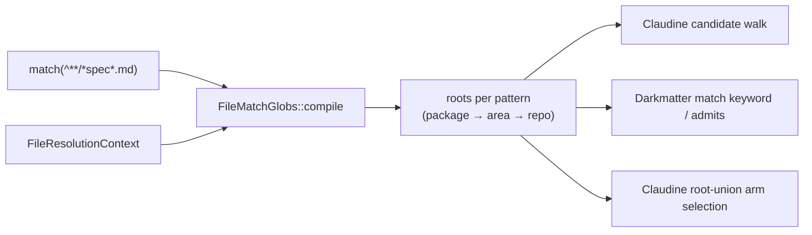

# `file(match(...))` Patterns Use File-Reference Roots

## Problem

A `file(match(...))` pattern is meant to follow the same file-reference
grammar as every other file path in Darkmatter and Claudine: biscuit-file's
sigils (`./`, bare, `&`, `^`, `@`, `~`, absolute) pick the root directories,
and the glob runs under them. Today it does not. Each pattern is passed
verbatim to `globset` and compared against a path relative to the launch
directory, so a sigil becomes a literal character that no path starts with.

Observed in an external repository (`s1`), launched from its root, with a
prompt whose schema declares:

```yaml
$schema:
    - spec: file(required;eager;match(^**/*spec*.md))
```

`compose ~/.claudine/prompts/implement.md spec=ts-review<TAB>` offers nothing,
although `fixes/2026-09-29-ts-review-improvements/spec.md` exists and matches
`**/*spec*.md`. The pattern compiles without complaint (`globset` reads
`^**/…` as a literal `^` followed by `*/…`), so the author gets an empty
candidate list and no diagnostic.

### Root causes

1. **`FileMatchGlobs::compile`** in
   [`file_match.rs`](../../lib/src/markdown/schemas/file_match.rs) strips only
   the `!` negation and hands the rest to `Glob::new`. It has no notion of a
   root.
2. **Claudine's candidate walk** (`file_candidates` in
   `claudine/cli/src/completion/schema_completion/candidates.rs`) walks one
   root, `scopes::property_value_root`, which is always the launch directory.
3. **Validation** (`admits` in `file_match.rs`) judges a resolved file
   against a fixed anchor list (fallback, launch directory, base directory,
   repository root) that has nothing to do with what the pattern says.
4. **Silent failure.** A pattern that can match nothing is never reported,
   and an uncompilable pattern makes `compile` return `None`. Completion then
   offers nothing, and validation admits every value.

## Expected Behavior

A `match()` pattern is `[!][reference-prefix]glob`:

| Pattern                    | Roots the glob runs under                                  |
|----------------------------|------------------------------------------------------------|
| `**/*spec*.md` (bare)      | Base directory, then repository root (implicit relative)   |
| `./docs/**/*.md`, `../x/*` | Base directory only                                        |
| `&fixes/**/spec.md`        | Repository root only                                       |
| `^**/*spec*.md`            | Package root, package-area root, repository root           |
| `@prompts/*.md`            | The `@` magic chain, in biscuit-file's tier order          |
| `~/notes/**/*.md`          | Home directory                                             |
| `/abs/dir/*.md`            | Used verbatim                                              |

- **Roots come from biscuit-file**, not from a second implementation. The
  roots for a prefix are the ones `FileReference` resolution (and
  `FileReference::complete_partial`) already uses for that sigil, computed
  from the same `FileResolutionContext`. Any directory segments before the
  first glob metacharacter narrow the root, the same way a literal path would.
- **"Base directory"** has the meaning it has for the value: the launch
  directory for a caller-supplied value (compose, completion, choosers) and
  the document's directory when a document's own frontmatter is validated.
- **Nearest-root judgment.** For each pattern, a file is judged by exactly
  one relative path: its path (in `/` spelling) relative to the **first** of
  that pattern's roots, in biscuit-file's search order, that contains it. A
  file under none of the pattern's roots is outside that pattern. This mirrors
  value resolution, where the first existing candidate wins, and later roots
  only reach files the earlier roots do not contain. The existing "a pattern
  without `/` also matches at any depth" rule and file-name matching still
  apply to that relative path.
- **Negation composes.** `!` comes first and is followed by its own prefix,
  as in `!&**/_completed/**`. A negative pattern is judged by the same
  nearest-root rule against its own roots, and rejects the file when it
  matches.

  Judging by any containing root instead would let a negation be bypassed.
  Launched from `darkmatter/`, with `match(**/*spec*.md, !fixes/**)`, the file
  `darkmatter/fixes/x/spec.md` is `fixes/x/spec.md` relative to the launch
  directory (rejected) but `darkmatter/fixes/x/spec.md` relative to the
  repository root (not rejected). Under the nearest-root rule only the first
  view exists, so the file is rejected.
- **Rejected prefixes.** `%` (recursive search), `vault:`, `http(s)://`, and
  `{{VAR}}` interpolation are schema definition errors inside `match()`. The
  glob is already recursive, and remote or vault roots are not walkable
  candidates.

### One comparison, three consumers

`FileMatchGlobs` stays the single place that defines what a pattern admits.
It gains the roots each pattern runs under, given a `FileResolutionContext`,
and every consumer uses that:



- **Completion (Claudine).** `file_candidates` walks the union of the positive
  patterns' roots, deduplicated and nested-root-aware so a file is visited
  once, instead of walking `property_value_root`. The walk filters (hidden,
  gitignored, `_`-prefixed, `SKIP_DIRS`) and the case-insensitive substring
  filter on the typed partial are unchanged. The partial is matched against
  the rendered candidate text.
- **Rendering.** A candidate under the launch directory is rendered relative
  to it, as today. A candidate outside it is rendered as an absolute path, so
  resolving the inserted value from the launch directory always lands on the
  file the walk found.
- **Validation (Darkmatter).** `admits` / `admits_path` judge the resolved
  file against each pattern's own roots and drop the fixed anchor list.
  `file_match_admits`, which Claudine's arm selection calls, follows
  automatically.

### Diagnostics

A `match()` pattern with a rejected prefix, a malformed reference prefix, or
an invalid glob is a schema definition error, reported wherever schema
definitions are checked today (with the property name and the offending
pattern). It is never treated as "no candidates" or "admit everything".

## Scope

In scope:

- `darkmatter/lib/src/markdown/schemas/file_match.rs` (grammar split, roots,
  judgment) and the simplified-grammar parse of `match(...)` for the new
  diagnostics.
- `claudine/cli/src/completion/schema_completion/candidates.rs` and
  `scopes.rs`: walk the pattern roots. This is a consumer change only; the
  semantics live in Darkmatter.
- Docs: `darkmatter/docs/topics/schemas/definition.md` (the `file` row and the
  `match(globs)` section, with an example per prefix), the `darkmatter` skill,
  and any Claudine topic page that describes `match()` completion.

Out of scope:

- Completion with a `~/`-spelled prompt path. `resolve_prompt_path` in
  Claudine's schema completion does not expand `~`, so
  `compose ~/.claudine/prompts/x.md spec=<TAB>` finds no prompt and offers no
  schema candidates for any pattern. That is a separate Claudine fix.
- DMLS. It surfaces `CompletionKind::File` patterns but does not walk them.

## Decisions

1. **Bare patterns follow implicit-relative rules** (decided 2026-09-30). A
   bare pattern searches the base directory, then the repository root, exactly
   as a bare file reference does; `./` is the way to confine a pattern to the
   base directory. Launched from a subdirectory, `match(**/*spec*.md)`
   therefore also offers repository-wide specs, rendered as absolute paths.
   That is accepted as the documented meaning of a bare path, and the typed
   partial narrows it. The nearest-root judgment above keeps negations
   correct across the two roots.
2. **Candidates outside the launch directory render as absolute paths**
   (decided 2026-09-30). Sigil-prefixed rendering (`&fixes/…`) is shorter but
   can resolve to a different file when a closer root shadows the path (`^`,
   `@`); an absolute path always names the file the walk found. Candidates
   under the launch directory keep their relative spelling.

## Acceptance Criteria

1. In a repository fixture with `fixes/2026-09-29-ts-review-improvements/spec.md`,
   launched from the repository root, completing
   `spec=ts-review` against `file(match(^**/*spec*.md))` yields exactly
   `spec='fixes/2026-09-29-ts-review-improvements/spec.md'`.
2. The same fixture launched from a nested package directory still offers
   that file for `^**/*spec*.md` and `&**/*spec*.md`, and offers it for
   `./**/*spec*.md` only when it lies under the launch directory.
3. `@`, `~`, and absolute prefixes each have an L1 test proving the walk
   starts at biscuit-file's roots for that sigil.
4. `!&**/_completed/**` excludes a file that a positive `^` pattern would
   otherwise admit.
5. Nearest-root judgment: launched from a nested directory `pkg/`, with
   `match(**/*spec*.md, !fixes/**)`, neither `pkg/fixes/x/spec.md` (judged as
   `fixes/x/spec.md` from the launch directory) nor the repository root's
   `fixes/y/spec.md` is offered or admitted, while `other/z/spec.md` outside
   `pkg/` is offered (as an absolute path) and admitted.
6. Root-union arm selection (`file_match_admits`) and the
   `x-darkmatter-match` validator accept and reject the same files the
   candidate walk offers, for every prefix above.
7. `match(%**/*.md)`, `match(vault:x/*.md)`, and an invalid glob each produce
   a schema definition error naming the property and pattern.
8. Existing bare-pattern tests (`*.png`, `src/**/*.rs`, `!_*.md`) pass
   unchanged when launched from the repository root.
9. Behavior is identical on macOS, Linux, and Windows: roots and relative
   paths are compared in `/` spelling, including through symlinked temp
   directories.
