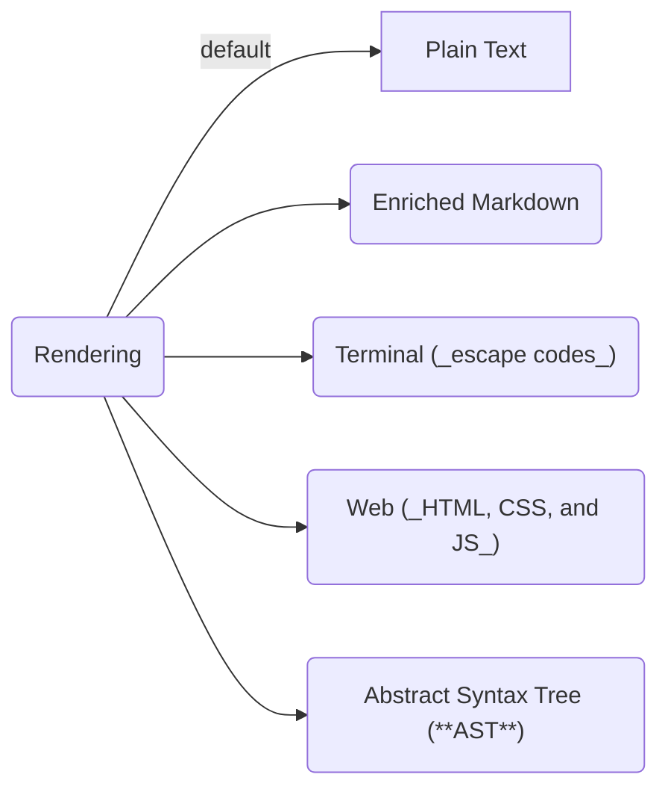

# Darkmatter Library

Markdown parsing, rendering, and Mermaid diagram support for terminal and HTML output.

## Features

- **Rendering**
    - **Multi-format output**: Terminal (ANSI), HTML, [MDAST](https://github.com/syntax-tree/mdast) JSON, and Regular or Enriched Markdown
    - **Syntax highlighting**: 200+ languages via `syntect` and `two-face` with curated theme pairs
    - **Inline formatting extensions**: `==highlighted==` (mark) and `⌄dimmed⌄` (faint/dim) syntax beyond standard CommonMark/GFM
    - **Mermaid Diagrams:** Render [Mermaid](https://mermaid.js.org/) code blocks as interactive client-side diagrams in HTML (injected ESM bootstrap), inline images or code in the terminal, and an unchanged `mermaid` fence in Markdown
    - **Visualization of Graph Structures:** Render [DOT](https://graphviz.org/doc/info/lang.html) based graph schemas as vector or raster based images.
    - **Tables:** Richly formatted tables with dynamic sizing and business logic; renders to both HTML and Terminal
    - **Inline TOC:** Render an inline table of contents linking to the various sections of a page
    - **YouTube Embeddings (future):** Embed a YouTube video player for sharable YouTube video references
    - **Disclosure Blocks:** Show only a summary line initially, but click to expand to full prose.
    - **Popovers:** Prompted links reveal a hover/focus-reachable prompt in the browser via CSS-only progressive enhancement (see [Prompted Links](../docs/rendering/popover.md)).
    - **Columnar Support (future):** Provides first class primitives for using columns to better utilize horizontal design space
- **Composition**
    - **Frontmatter support**: YAML parsing with typed access, merge strategies, and insertion-order preservation
    - **Interpolation:** interpolate frontmatter, ENV vars, and context variables into Markdown body
    - **Frontmatter Shell Expansion:** execute top-level `$(...)` frontmatter values before effective-state construction, storing trimmed `stdout` back into frontmatter
    - **Normalization:** fix heading hierarchy violations, re-level documents
    - **Link Normalization:** convert absolute paths back to portable forms (relative, `~/`, or `${ENV}`)
    - **TOC Linking:** hyperlink to each of the headings of another page as a strategy for progressive disclosure
    - **Text Replacement:** Dictionary replacement of terms on a page
    - **Conditional Block Rendering:** Conditionally render parts of a Markdown document based on frontmatter, ENV, and context
    - **Transclusion:** 
        - **Local Documents:** compose your Markdown by transcluding local Markdown files into the structure of a base document in real time (automatic heading rationalization built in)
        - **Shell Expansion:** provide dynamic content from body `::shell` commands with a built-in security solution
        - **Document Summarization (future):** summarize a Markdown, PDF, or word document into a section of a Markdown document
        - **Website Summarization (future):** summarize the contents of a particular website and inject into a section of a Markdown document
        - **Website PPT (future):** identify the people, places, and things on a particular website
- **Utilities**
    - **TOC Visualizer:** report out the table-of-contents to the terminal with well designed layout
    - **Hashing:** context aware hashing of both frontmatter and markdown prose
    - **Delta:** semantic and visual diff'ing tools for Markdown documents
    - **Cleaning:** cleanup a Markdown file to ensure standard based, and consistently using indentation, vertical spacing, etc.
    - **Link Validation (planned):** validate that all links (both file and images) are pointing at valid and accessible locations
    - **Graph Visualizer:** view the full compositional graph of files from a specified base document

## Quick Start

### Rendering 

The most _grokkable_ feature that Darkmatter provides is a well designed **rendering engine** which supports multiple output formats.

The `Markdown` struct is a central player in how we interact with **Darkmatter** and here is a simple example of using the `Markdown` struct along with `TerminalOptions` to output markdown to the terminal:

```rust
use darkmatter::markdown::{Markdown, output::{TerminalOptions, write_terminal}};

let md: Markdown = "# Hello\n\nWorld".into();
let mut stdout = std::io::stdout();
write_terminal(&mut stdout, &md, TerminalOptions::default())?;
```

### Composition

Composition is probably the most powerful feature that Darkmatter has to offer. Darkmatter provides a small **DSL** that sits on top of the [CommonMark](https://commonmark.org/) + [GFM](https://github.github.com/gfm/) Markdown standards which are supported in Darkmatter as well. 

The types of composition each Darkmatter document employs varies considerably but in _all cases_ we run the Markdown through the same well defined Markdown pipeline which will:

- **Inline Pre** prepares the document by mutating the body based on "state" or some external and measurable property
    - _this includes frontmatter interpolation, frontmatter shell expansion, text replacement, page blocks, interpolation, body shell expansion, and **link resolve** (absolute path conversion)_
- Perform **Transclusions**
    - _there are many types of transclusions a document can employ with directives_
    - _however, the key consistency of transclusion operations regardless of the variant employed, is that transclusion is a **recursive** action!_
        - If the base document, transcludes documents A, B, and C then all three documents can in turn transclude their own set of external resources.
- **Inline Post** normalizes the fully combined markdown
- **Finalization** performs root-only adjustments
    - _this includes **link normalization** (converting absolute paths back to portable forms)_
- and **Render** the combined document parts as a single document
    - by default rendering during the **compose** operation will return regular Markdown as plain text (no ANSI escape codes, no HTML/CSS, minimal to no inline HTML)
    - but of course that plain text Markdown can then be immediately transformed into any of the other output formats by leveraging Darkmatter's 

Here's a simple example of using tiny bit of **interpolation** and a wee bit of **transclusion**. We will compose a set of fictional Markdown documents called:


`main.md`

~~~md
---
name: "Bob"
---
# Example

Hi, my name is {{name}} and I'd like to share a few things with you.

## My Favorite Things

::file favorites.md
~~~

`favorite.md`

~~~md
{{name}}'s favorite sports.


## Football
- [NFL](https://pittsburgh.steelers.com)
- [Premier League](https://queens-park-rangers.com) 
  - ok so they're no longer in the premier league
  - I'm still counting them tough

## Racket Sports

- [Tennis](https://tennis.com)
- [Pickleball](https://is-not-a-real-sport.com)
~~~

We can then use a small amount of Rust code to compose the `main.md` document:

```rust
use darkmatter::markdown::Markdown;
use darkmatter::markdown::compose::ComposeOptions;

let md = Markdown::try_from(std::path::Path::new("main.md"))?;
let options = ComposeOptions::new()
    .with_source_file("main.md");

let (composed, report) = md.compose_with(options)?;
println!("{}", composed.content());
```

This results in a document which:

- Replaces all Markdown body references of `{{name}}` to the static text `Bob`
    - this replacement will happen not only in the `main.md` file but all child files too (unless these children redefine the `name` property)
- In the `main.md` file's "My Favorite Things" section we use a `::file` reference which interpolates the content from the external file `favorites.md`, before this external content is brought in, however, the child document(s) will first be run through the Markdown pipeline itself. This results in:
    - The document is "cleaned up", in this particular case it will:
        - add a **blank line** after `## Football` as all heading lines should have blank lines above and below them
        - changed the nested list to have an **indentation** of 4 spaces (this is the default Darkmatter uses but you can configure Darkmatter to use whatever you like, the key is in being consistent)
        - because `main.md` injects the `favorites.md` file into a section defined by an **H2** heading, the injected content will be _normalized_ to have it's headings start at **H3**
    - Were the `favorites.md` file to have it's own `::file` reference then the recursive process would continue.

## Composition Lifecycle

- The [composition](../docs/topics/what-is-composition.md) lifecycle goes through three major **stages**: inline mutation, transclusion, and finally rendering. 
- Each of these stages has numerous operations which are executed
- These stages, the operations within these stages, along with concerns like ordering, concurrency and more are covered in detail in the [Darkmatter Composition Pipeline](../docs/darkmatter-compose-pipeline.md) document.
- Shell expansion details are split across [body shell expansion](../docs/inline/shell-expansion.md) and [frontmatter shell expansion](../docs/inline/fm-shell-expansion.md).


### Rendering Details

The final stage of the composition process is _rendering_ and by default we typically just return the plain text Markdown "as is" but in cases where we want to present this to a user in a terminal, a browser, or even into a static analysis process we will lean on the rendering cycle to do that. The rendering output targets are:



For the non-AST variants, there are a set of "features" which we try to employ across each of the output targets but since the target's capabilities vary greatly we will not always be able to be consistent. Some targets might be fully missing some features, other target's may have a reduced functionality variant.

For each of these rendering features there are detailed documents which will describe the functionality as well as clarify the support across the different output targets.

- **Page Layout:**

    - The `DarkmatterPage` primitive provides page-level layout control for terminal and browser output
    - Margins, padding, page background, max-width, line numbers, and per-component alignment/fill are all configurable via a builder API
    - Defaults preserve the existing `for_terminal` behavior; with no builder calls the output is byte-for-byte equivalent
    - For details read the [`darkmatter::layout`](https://docs.rs/darkmatter/latest/darkmatter/layout/index.html) API docs

- **Table Rendering:**

    - Being able to render tables, have control over alignment, column width, and other layout features are always going to be nice-to-haves but in Markdown they have no means to be defined (note: the CommonMark spec doesn't have any direct support for tables, that only comes with GFM support)
    - Darkmatter supports the basics while allowing additional capabilities to be added in as "hints" to the renderer. 
        - a Darkmatter renderer _will_ understand what to do with these hints, but 
        - a normal Markdown renderer will not understand the semantics but it will still be "valid Markdown" and be able to render the document
    - For details on this feature read [Table Rendering in Darkmatter](../docs/rendering/table-rendering.md)

- **Code Highlighting:**

    - Markdown is often used for technical documentation where a document is interspersed with code examples placed into **code blocks**
    - In order to make the code be visually information rich and intuitive to a human reader it's very useful to parse the code and _colorize_ it in a way similar to how an editor would style it.
    - **Darkmatter** provides rich support for this and you can find out more at [Code Highlighting](../docs/rendering/code-highlighting.md)

- **Mermaid Rendering:**

    - Mermaid charts/visualizations and Markdown documents are a form of ying and yang (aka, very complimentary and meant to be used together).
    - A Mermaid chart/visualization is to added to a Markdown document's content as a _code block_ with the language set to `mermaid`.
    - **Darkmatter** will see these code blocks as a special use case and pass it to our Mermaid rendering engine described in [Mermaid Rendering](../docs/rendering/mermaid.md).

- **Graph Expression Visualization:**

    - Being able to render a graph structure as a visualization can be done in a similar manner to Mermaid visualizations.
    - The exact parameters and the underlying technical solution, however, are completely separate and distinct.
    - The [Graph Visualization](../docs/rendering/graph-rendering.md) goes into more details on both.

- **YouTube Embedding:**

    - Being able to quickly reference a YouTube video's share link and have a visually compelling preview card linked to the video (or an embedded player on output targets which support that) is a quality of life feature which **Darkmatter** provides.
    - More details are found in the [YouTube Embedding](../docs/rendering/youtube-embedding.md) document.

- **Popovers:**

    - A **Popover effect** is something many are familiar with on the web and it presents most commonly as a part of the page which when _hovered over_ (or sometimes clicked on, etc.), makes an small informational dialog box above (or at least not masking) the linked part of the page appear.
    - This can be a useful UI pattern for allowing people to "inspect but not commit" to more information on a given topic while not overwhelming the user with all the content being rendered immediately but instead only when a user expresses interest.
    - **Darkmatter** implements this for prompted links as a CSS-only progressive enhancement (no JavaScript): the prompt is reachable by hover and keyboard focus and degrades to an ordinary navigable link. More detail on how this is implemented, its accessibility contract, and cross-browser behavior is found in the [Prompted Links](../docs/rendering/popover.md) document.

- **Disclosure Blocks:**

    - A disclosure block has some overlap in UI design with a popover but enough distinctions to be it's own thing
    - People familiar with the HTML `<detail>` and `<summary>` tags will already have a good idea what this looks like because "disclosure blocks" are now natively supported in modern browsers by these tags.
    - Because Markdown is a _superset_ of HTML, you could just use these tags in any Markdown document as inner-HTML blocks but doing that is awkward and doesn't meet the "notational velocity" vibe of Markdown authoring
    - More detail on how **disclosure blocks** are made available via **Darkmatter**'s DSL can be found in the [disclosure](../docs/rendering/disclosure.md) document.

- **List Expansion:**

    - Being able to _expand_ or _contract/hide_ a list of items in Markdown is NOT supported in standard Markdown but is a desirable feature because it allows the reader how much detail they want to see. 
    - Most note taking solutions which use Markdown add this feature in because of it's utility and **Darkmatter**'s DSL provides the syntax to do the same
    - For more details on setting up List Expansion, read the [List Expansion](../rendering/list-expansion.md) document.

- **Smart Images:**

    - Large images (in file size) are one of the top reasons web pages are slow
    - Being able to ensure that the image being rendered is size-appropriate and size-optimized for a rendering target is only really available for the Web but if that's what you're targeting then **Darkmatter** has an elegant solution for you in **Smart Images**.
    - For more details on Smart Images, read the [Smart Images](../rendering/smart-images.md) document

- **Column Support:**

    - Markdown is great but, by default, it can be somewhat _horizontally_ challenged
    - In typesetting a major tool to help with this the use of columns
    - Sure if you're using GFM you can use tables but Markdown tables do **not** lend themselves well to many tasks where a real column solution would be so much more graceful.
    - **Darkmatter** provides a more useful solution to solve this, to find out more read [Column Support](../rendering/column-support.md).

- **Audio Content:**

    - Hey, who loves multi-modality? The spoken word? Well if you're someone who raised their hand when they heard that question you'll be happy to know that **Darkmatter** has some primitives which can help you integrate audio content into your Markdown documents.
    - For more information read the [Audio Content](../docs/rendering/audio-content.md) document.

- **TOC Generation:**

    - For longer documents it's not uncommon to want to have a document lead with a table of contents so users can see the structure of the document and quickly move to the section they are most interested in.
    - This kind of feature is a standard plugin to most Markdown parsing libraries and Darkmatter is no different in it's desire to provide this feature. However, because composition can lead to a dynamic document structure the TOC functionality that Darkmatter provides is "composable aware"
    - For more details on this read the [TOC Generation](../docs/rendering/toc-generation.md) document.

- **Person Card:**

    - FUTURE
    - Darkmatter provides the `::person` block directive as well as the `person::*` inline directive to allow you to show information about a person with pizazz
    - If you want more information see the [Person Card](../docs/rendering/person-card.md) document.

- **Place Card:**

    - FUTURE

- **Product Card:**

    - FUTURE


### Utilities

The Darkmatter library also exposes some useful utilities for callers to be aware of including:

- **Delta:**
    - Darkmatter will provide a variety of ways of dissecting what has changed in a document
    - It can provide a semantic/structural overview of changes
    - It can provide visual reporting on distinct text changes in Markdown prose or frontmatter
    - More details can be found in the [Delta Utility](../docs/utilities/delta.md) document
- **Link Checking:**
    - Darkmatter can traverse a compose pipeline's file graph and validate that all of the links point to valid resources
    - More details can be found at [Link Checking](../docs/utilities/link-checking.md)
- **FileTree:**
    - A `Renderable` terminal component that visualizes a Markdown file's dependency surface
    - Shows references above the file line and transclusions below, with optional recursive expansion and validation overlays
    - Used by the `md graph` CLI command
- **YamlBlock:**
    - A validated, renderable YAML payload that produces syntax-highlighted `yaml` code blocks in both terminal and browser output
    - Construct from raw YAML strings, YAML files, or Markdown frontmatter
    - Reuses the same `syntect` / `two-face` highlighting pipeline as Markdown `yaml` fences

## Darkmatter Dependencies

### Monorepo Dependencies

The Darkmatter Library uses the following libraries from this monorepo to achieve some of it's outcomes:

- [`biscuit-hash`](../../biscuit-hash/README.md)
    - leverages the **xxHash** hasher as well some of the "context-aware" features to help detect false positives on non-semantic file changes
- [`biscuit-terminal`](../../biscuit-terminal/README.md)
    - Terminal Detection (`Terminal` struct)
    - Terminal Image Rendering (`TerminalImage` struct)
- [`biscuit-visualized`](../../biscuit-visualized/README.md)
    - Mermaid rendering
    - Graph Structure rendering
- [`biscuit-file`](../../biscuit-file/README.md)
    - File reference lookups (`FileReference` struct)
        - provides relative and absolute path resolution, magic multipath resolution, and even glob finding resolution strategies
    - Conversion of common config and frontmatter formats (JSON, JSON5, YAML, TOML)
- [`sniff`](../../sniff/README.md)
    - Runtime context capture for the compose pipeline — OS, hardware, git repo structure, monorepo package discovery, document inventory, and file-change tracking

> **Note:** each of these libraries above has an **Agent Skill** by the same name you can use to gain deep insights into these libraries.

### Key External Crates

The following crates play an important role in Darkmatter providing it's current feature set:

- `pulldown-cmark` - _a blazingly fast pulldown parser for Markdown files_
- `syntect` & `two-face` - _provide a rich set of themes and code parsing for the purpose of code highlighting_
- `tokio` - _for IO bound async including all remote requests_
- `reqwest` - _for 
- `this-error` & `tracing` - _provide error definition support and reporting_

### Development Dependencies

- `chromiumoxide` & `futures-util` - _drive a real headless Chrome (Chrome DevTools Protocol) for browser-render tests (`tests/browser_render.rs`) that assert on browser-computed styles of the HTML output, plus the `examples/html_to_png.rs` screenshot helper. Tests skip cleanly when no Chrome/Chromium is found._ See the `rust-testing` skill's [Browser Render Testing](../../.claude/skills/rust-testing/browser-testing.md) topic.


## Modules

| Module | Description |
|--------|-------------|
| `markdown` | Core `Markdown` type with frontmatter, rendering, and manipulation |
| `diff` | Visual diff utilities for strings and files |
| `mermaid` | Mermaid diagram theming (terminal rendering via biscuit-terminal) |
| `render` | Hyperlink rendering utilities (OSC 8 terminal hyperlinks) |
| `terminal` | ANSI code generation and color depth constants |
| `testing` | Test utilities for terminal output verification |

## API Reference

### The Markdown Type

```rust
use darkmatter::markdown::Markdown;

// Create from string
let md: Markdown = "# Title\n\nContent".into();

// Load from file
let md = Markdown::try_from(Path::new("README.md"))?;

// Load from URL (async)
let md = Markdown::from_url(&url).await?;
```

### Frontmatter Operations

Frontmatter is stored as an `IndexMap` to preserve key insertion order through parsing, mutation, and serialization.

```rust
let content = r#"---
title: Hello
author: Alice
---
# Document"#;

let mut md: Markdown = content.into();

// Typed access
let title: Option<String> = md.fm_get("title")?;

// Insert values (appended at end, preserving existing order)
md.fm_insert("version", "1.0")?;

// Merge with strategy
md.fm_merge_with(json!({"tags": ["rust"]}), MergeStrategy::ErrorOnConflict)?;

// Set defaults (document wins)
md.fm_set_defaults(json!({"draft": false}))?;

// Direct map access for removal or iteration
let fm = md.frontmatter_mut().as_map_mut();
fm.shift_remove("draft");
```

> **Note:** while there is **not** a strict _semantic_ reason to preserve the order of the frontmatter properties, humans (at the very least) intuitively expect order preservation and it helps them to quickly find the data they are looking for.

## Frontmatter Parsing and TOC Reliability

Some Markdown producers emit YAML frontmatter with tab-indented block scalar content. That can be valid in source systems, but strict YAML parsers may reject it.

### What failed before

- Tab-indented YAML frontmatter could fail parsing in strict YAML parser behavior.
- On parse failure, the full document remained in markdown body content.
- TOC extraction then interpreted frontmatter delimiters/content as markdown structure, which could produce a mangled first TOC entry.

### What is fixed now

- Frontmatter parsing now retries with indentation normalization for **leading tabs only**.
- Successful fallback parsing strips frontmatter from body content before TOC extraction.
- TOC output now reflects real headings from the document body.

### What is intentionally unchanged

- The fix only adds frontmatter indentation recovery (leading-tab normalization during fallback parse).
- Invalid YAML that remains invalid after normalization still fails parsing and follows existing call-site fallback behavior.

### Safety and compatibility notes

- Non-frontmatter content is untouched.
- Non-leading tabs are not rewritten.
- Existing typed frontmatter access APIs (`fm_get`, `fm_insert`, `fm_merge_with`, `fm_set_defaults`, `as_map_mut`) are unchanged.

### Example: Tab-Indented Frontmatter Still Produces Correct TOC

```rust
use darkmatter::markdown::Markdown;

let content = "---\n\
prompt: |-\n\
\tLine one\n\
\tLine two\n\
last_updated: 2026-02-27\n\
---\n\
# macOS Audio\n\
\n\
## Getting Started\n";

let md: Markdown = content.into();
let toc = md.toc();

let prompt: Option<String> = md.fm_get("prompt").unwrap();
assert_eq!(prompt, Some("Line one\nLine two".to_string()));
assert_eq!(toc.structure[0].title, "macOS Audio");
assert_eq!(toc.structure[0].children[0].title, "Getting Started");
```

### Output Formats During Rendering

The `render`  functionality in Darkmatter will render for the **terminal** by default. This means that it will look to leverage the terminal's capabilities to add font weights, colors, and other ornamentations through escape codes.

Though the terminal is the _default_ target for rendering, it is not the **only** target. The full output target list is:

- **Terminal**

    As already discussed, this is the _default_ output target and leverages the terminal's capabilities (_which are dynamically detected_) to render as full fidelity a representation as is possible in the terminal.

- **HTML**

    A big part of the world is rendered in HTML (along with CSS and Javascript). This platform provides a much richer medium for controlled rendering than Markdown alone. It is worth noting, however, that Markdown is -- _strictly speaking_ -- a functional **superset** of HTML not a **subset** as many people imagine. 

    While Markdown _can_ include any amount of inline HTML as part of it's content you will quickly loose the lightweight writing benefits of Markdown (sometimes referred to as "notational velocity") when you do. Still there are occasions where inline HTML makes sense even in the authoring stage and far more cases where we can leverage conventions, directives, and metadata to produce even more refined HTML than was present in the underlying Markdown content.

- **Enriched Markdown**

    Enriched Markdown takes advantage of a _subset_ of the conventions and features that the HTML target leverages but provides a much richer output and interactive character then normal Markdown but at the cost of that Markdown being less "editable" (aka, the "notational velocity" of working this file has been reduced to make it look nicer). 

    Use this output for sharing content which you've authored to other parties, targeting Markdown viewers which support the inline-HTML features that the Markdown standard does allow for.

- **AST**

    Darkmatter can convert Markdown to a JSON based AST called [**MDAST**](https://github.com/syntax-tree/mdast). **MDAST** has grown in its formality as well as the tools which support it in recent years. It's center of gravity is still in the JS/TS ecosystem but it now get's strong support from the `markdown-rs` crate in Rust too (this is what Darkmatter uses internally to produce the AST).

    Having an AST format is helpful in cases where you need to apply advanced transforms of the Markdown or extract aspects of a document where **regex** is not really strong enough to do the job.

> **Note:** the _rendering_ functionality is the default command provided by the [**Darkmatter CLI**](../cli/README.md) and you can specify the output format you want with the `--output <format>` CLI switch


#### Terminal Output

```rust
use darkmatter::markdown::output::{TerminalOptions, write_terminal, for_terminal};

let options = TerminalOptions {
    include_line_numbers: true,
    mermaid_mode: MermaidMode::Image,
    ..Default::default()
};

// Write to stdout
write_terminal(&mut std::io::stdout(), &md, options)?;

// Get as string
let output = for_terminal(&md, options)?;
```

#### HTML Output

```rust
use darkmatter::markdown::output::{HtmlOptions, as_html};

let options = HtmlOptions::default();
let html = as_html(&md, options)?;
```

#### MDAST JSON

```rust
let ast = md.as_ast()?;
let json = serde_json::to_string_pretty(&ast)?;
```

#### Plain String

```rust
let output = md.as_string();  // Includes frontmatter if present
```

### Document Cleanup

Cleanup normalizes markdown formatting: blank lines between block elements, table alignment, list marker preservation, and list item spacing.

```rust
let mut md: Markdown = content.into();
md.cleanup();              // Normal mode (default)
md.cleanup_compact();      // Compact mode
md.cleanup_loose();        // Loose mode
md.cleanup_with_indent(4); // Any mode + forced 4-space list indentation
```

#### List Spacing Modes

The cleanup module provides three list spacing modes via `ListSpacingMode`:

| Mode | Behavior |
|------|----------|
| **Normal** (default) | Blank lines only at indentation level transitions — when a list enters or leaves a sub-list. Same-level items remain tight. |
| **Compact** | No blank lines between any list items. Tightest possible output. |
| **Loose** | Blank lines between all list items regardless of level changes. |

All three modes preserve the standard markdown rule that a blank line must separate a list from following prose content.

```rust
use darkmatter::markdown::cleanup::{cleanup_content, cleanup_content_compact, cleanup_content_loose, ListSpacingMode};

// Freestanding functions
let normal  = cleanup_content(input);
let compact = cleanup_content_compact(input);
let loose   = cleanup_content_loose(input);

// Via the compose pipeline
use darkmatter::markdown::compose::ComposeOptions;

let options = ComposeOptions::new()
    .with_list_spacing(ListSpacingMode::Compact);
let (composed, report) = md.compose_with(options)?;
```

### Compose Pipeline (Stage 1 + Stage 2)

```rust
use darkmatter::markdown::compose::ComposeOptions;

let md = darkmatter::markdown::Markdown::try_from(std::path::Path::new("docs/root.md"))?;
let options = ComposeOptions::new()
    .with_source_file("docs/root.md");

let (composed, report) = md.compose_with(options)?;
println!("{}", report.summary());
println!("{}", composed.content());
```

Stage 2 includes:

- `::file` markdown transclusion with recursive processing
- `::code` code/text transclusion with fenced block generation
- `when=\"...\"` conditions
- `prologue` / `epilogue` frontmatter transclusion
- cycle detection and depth limits

### Table of Contents

```rust
let toc = md.toc();
println!("Heading count: {}", toc.heading_count());
println!("Root level: {:?}", toc.root_level());
println!("Title: {:?}", toc.title);
```

### Document Comparison

```rust
let original: Markdown = old_content.into();
let updated: Markdown = new_content.into();

let delta = original.delta(&updated);

if !delta.is_unchanged() {
    println!("Classification: {:?}", delta.classification);
    println!("{}", delta.summary());
}
```

### Visual Diff (Strings or Files)

Darkmatter uses this visual diff renderer in the Markdown CLI for frontmatter and body comparisons, but the module itself is Markdown-agnostic and works directly with any strings or files.

```rust
use darkmatter::diff::visual::{render_visual_diff_str, VisualDiffOptions};

let original = "Hello\nWorld";
let updated = "Hello\nUniverse";

let output = render_visual_diff_str(original, updated, &VisualDiffOptions::default());
println!("{}", output);
```

### YamlBlock

`YamlBlock` validates YAML at construction time and renders it as a syntax-highlighted `yaml` code block through the same terminal and browser paths used by Markdown fences.

```rust
use darkmatter::markdown::YamlBlock;

// From raw YAML
let block = YamlBlock::new("foo: 1\nbar: 2")?;
println!("{}", block.yaml());

// From a YAML file
let block = YamlBlock::from_yaml_file("config.yaml")?;

// From Markdown frontmatter (body is ignored)
let block = YamlBlock::from_markdown_content("---\ntitle: Hello\n---\n# Body")?;
// block.yaml() contains "title: Hello" only

// From a Markdown file on disk
let block = YamlBlock::from_markdown_file("README.md")?;
```

Once constructed, `YamlBlock` renders through both the terminal and browser pipelines via the [`biscuit-terminal`](../../biscuit-terminal/) traits:

```rust
use biscuit_terminal::components::renderable::{BrowserRenderable, Renderable};
use biscuit_terminal::terminal::Terminal;
use darkmatter::markdown::YamlBlock;

let block = YamlBlock::new("foo: 1\nbar: 2")?;

// Terminal rendering — ANSI-highlighted `yaml` code block, styled identically
// to a Markdown ```yaml fence under the same theme/color-mode.
let term = Terminal::default();
print!("{}", Renderable::render(&block, &term));

// Browser rendering — <pre><code class="language-yaml">…</code></pre>
// inside the standard darkmatter <div class="code-block"> wrapper.
let html = BrowserRenderable::render_to_browser(&block);
assert!(html.contains("language-yaml"));
```

`YamlBlock` stores the raw YAML text after validation. It does not retain the parsed `serde_yaml_ng::Value`, keeping the public API small.

### Heading Normalization

```rust
use darkmatter::markdown::HeadingLevel;

// Validate structure
let validation = md.validate_structure();
if !validation.is_well_formed() {
    println!("Issues: {:?}", validation.issues);
}

// Normalize to H1 root
let (normalized, report) = md.normalize(Some(HeadingLevel::H1))?;

// Re-level for embedding as subsection
let (releveled, adjustment) = md.relevel(HeadingLevel::H2)?;
```

### Mermaid Diagrams

For browser output, render a `lang="mermaid"` fence through Darkmatter's
full-page browser path (`DarkmatterPage::render_to_browser`). The default is
interactive Mermaid: the body carries `<pre class="mermaid">…</pre>` and the
`DarkmatterFeatureResolver` injects the shared CSS + inline ESM bootstrap once
per page. Delivery requires network access and a Content Security Policy that
permits the `cdn.jsdelivr.net` (primary) and `unpkg.com` (fallback) origins and
inline modules.

```rust
use biscuit_terminal::terminal::Terminal;
use darkmatter::layout::DarkmatterPage;
use darkmatter::markdown::Markdown;

let md = Markdown::from("```mermaid\nflowchart LR\n    A --> B\n```\n");
let term = Terminal::new_optimistic(80);
let html = DarkmatterPage::new(&term).render_to_browser(&md).unwrap();
assert!(html.contains(r#"<pre class="mermaid">"#));
```

For terminal output, use biscuit-terminal's `MermaidDiagram`:

```rust
use biscuit_terminal::components::mermaid::MermaidDiagram;
use biscuit_terminal::terminal::Terminal;

let diagram = MermaidDiagram::new("flowchart LR\n    A --> B");
let term = Terminal::new();
match diagram.try_render(&term) {
    Ok(result) => print!("{}", result.output),
    Err(_) => println!("{}", diagram.fallback_code_block()),
}
```

## Syntax Highlighting

### Theme Pairs

Themes come in light/dark pairs with automatic mode detection:

| Theme | Light | Dark |
|-------|-------|------|
| `Github` | GitHub Light | GitHub Dark |
| `OneHalf` | One Half Light | One Half Dark |
| `Gruvbox` | Gruvbox Light | Gruvbox Dark |
| `Solarized` | Solarized Light | Solarized Dark |
| `Base16Ocean` | Base16 Ocean Light | Base16 Ocean Dark |
| `Nord` | One Half Light | Nord |
| `Dracula` | One Half Light | Dracula |
| `Monokai` | One Half Light | Monokai Extended |
| `VisualStudioDark` | GitHub Light | VS Dark |

Each `ThemePair` is a (light theme, dark theme) couple. Several pairs use the
same theme in their light slot: `Nord`, `Dracula`, and `Monokai` use One Half
Light, and `VisualStudioDark` uses GitHub Light.

### Color Mode Detection

```rust
use biscuit_terminal::terminal::Terminal;

let mode = Terminal::color_mode();  // Light, Dark, or Unknown
```

Terminal metadata also includes repository context. In monorepos, `package_root` reports the package containing the current working directory (or the repo root when run at the root).

## Terminal Options

```rust
pub struct TerminalOptions {
    pub code_theme: ThemePair,        // Theme for code blocks
    pub prose_theme: ThemePair,       // Theme for prose
    pub color_mode: ColorMode,        // Light or Dark
    pub include_line_numbers: bool,   // Show line numbers in code
    pub color_depth: Option<ColorDepth>,  // Auto-detect if None
    pub image_mode: TerminalImageMode, // Auto, Never, Force
    pub base_path: Option<PathBuf>,   // For relative image paths
    pub italic_mode: ItalicMode,      // Auto, Always, Never
    pub max_width: Option<u16>,       // Text wrapping width
    pub mermaid_mode: MermaidMode,    // Off, Image, Text
    pub hyperlink_mode: HyperlinkMode, // Auto, Always, Never
    pub code_block_mode: CodeBlockMode, // Inverse (default), Dark, Light, Same
}
```

Code blocks invert their theme variant relative to the page/terminal for contrast by default (a light code panel on a dark terminal, and vice versa). This is configurable via `code_block_mode` (`CodeBlockMode::{Inverse, Dark, Light, Same}`) on `TerminalOptions`, or `DarkmatterPage::with_code_block_mode(...)` for page layout.

## CLI

For command-line usage, see the [darkmatter-cli](../cli/) package which provides the `md` binary.

## Dependencies

- **pulldown-cmark**: CommonMark parsing with GFM extensions
- **syntect**: Syntax highlighting engine
- **two-face**: Theme loading with bat-curated themes
- **biscuit-terminal**: Terminal detection, image rendering, mermaid diagrams, table rendering
- **biscuit-hash**: Content hashing (xxHash) for TOC, delta, and mermaid caching
- **serde**: Frontmatter serialization
- **chrono**: Date/time handling for expression validators (reused; no new dependency added)
- **sniff**: System detection for runtime context capture — timezone info, OS/hardware detection, git repo structure, monorepo package discovery, document inventory, and file-change tracking
