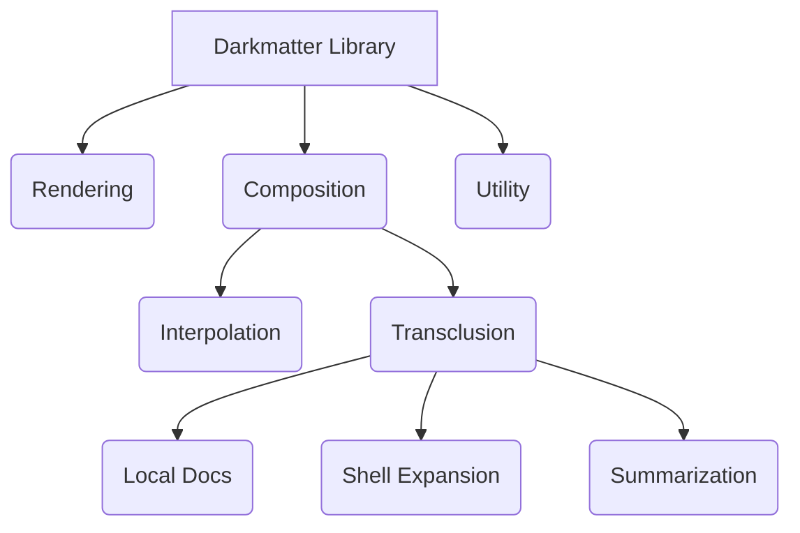

# Darkmatter Library

Markdown parsing, rendering, and Mermaid diagram support for terminal and HTML output.

## Features



- **Rendering**
    - **Multi-format output**: Terminal (ANSI), HTML, MDAST JSON, Enriched Markdown
    - **Syntax highlighting**: 200+ languages via syntect with curated theme pairs
    - **Mermaid Diagrams:** Render mermaid documents into both HTML (using dynamic runtime engine) and Markdown (as inline images)
    - **Tables:** Richly formatted tables with dynamic sizing and business logic; renders to both HTML and Terminal
    - **Inline TOC:** Render an inline table of contents linking to the various sections of a page
    - **YouTube Embeddings (future):** Embed a YouTube video player for sharable YouTube video references
    - **Disclosure Blocks (future):** Show only a heading initially, but click to expand to full prose.
    - **Popovers (future):**
    - **Columnar Support (future):** Provides first class primitives for using columns to better utilize horizontal design space
- **Composition**
    - **Frontmatter support**: YAML parsing with typed access, merge strategies, and insertion-order preservation
    - **Interpolation:** interpolate frontmatter, ENV vars, and context variables into Markdown body
    - **Normalization:** fix heading hierarchy violations, re-level documents
    - **TOC Linking:** hyperlink to each of the headings of another page as a strategy for progressive disclosure
    - **Text Replacement:** Dictionary replacement of terms on a page
    - **Conditional Block Rendering:** Conditionally render parts of a Markdown document based on frontmatter, ENV, and context
    - **Transclusion:** 
        - **Local Documents:** compose your Markdown by transcluding local Markdown files into the structure of a base document in real time (automatic heading rationalization built in)
        - **Shell Expansion:** provide dynamic content from shell commands with a built-in security solution
        - **Document Summarization (future):** summarize a Markdown, PDF, or word document into a section of a Markdown document
        - **Website Summarization (future):** summarize the contents of a particular website and inject into a section of a Markdown document
        - **Website PPT (future):** identify the people, places, and things on a particular website
- **Utilities**
    - **TOC Visualizer:** report out the table-of-contents to the terminal with well designed layout
    - **Hashing:** context aware hashing of both frontmatter and markdown prose
    - **Delta:** semantic and visual diff'ing tools for Markdown documents
    - **Cleaning:** cleanup a Markdown file to ensure standard based, and consistently using indentation, vertical spacing, etc.
    - **Link Validation:** validate that all links (both file and images) are pointing at valid and accessible locations
    - **Graph Visualizer:** 

## Dependencies

### Monorepo Dependencies

The Darkmatter Library uses the following libraries from this monorepo to achieve some of it's outcomes:

- `biscuit-hash`
    - leverages the **xxHash** hasher as well some of the "context-aware" features to help detect false positives on non-semantic file changes
- `biscuit-terminal`
    - Terminal Detection (`Terminal` struct)
    - Terminal Image Rendering (`TerminalImage` struct)
    - Mermaid Rendering to inline image 
- `biscuit-file`
    - File reference lookups (`FileReference` struct)
        - provides relative and absolute path resolution, magic multipath resolution, and even glob finding resolution strategies
    - Conversion of common config and frontmatter formats (JSON, JSON5, YAML, TOML)

> **Note:** each of these libraries above has an **Agent Skill** by the same name you can use to better navigate these libraries.

### Key External Crates

The following crates play an important role in Darkmatter providing it's current feature set:

- `pulldown-cmark` - _a blazingly fast pulldown parser for Markdown files_
- `syntect` & `two-face` - _provide a rich set of themes and code parsing for the purpose of code highlighting_
- `tokio` - _for IO bound async including all remote requests_
- `reqwest` - _for 
- `this-error` & `tracing` - _provide error definition support and reporting_
- 


## Quick Start

### Rendering 

The most _grokkable_ feature that Darkmatter provides is a well designed **rendering** into multiple output formats.

The `Markdown` struct is a central player in how we interact with **Darkmatter** and _rendering_ is most easily understand utility of the Darkmatter library:

```rust
use darkmatter::markdown::{Markdown, output::{TerminalOptions, write_terminal}};

let md: Markdown = "# Hello\n\nWorld".into();
let mut stdout = std::io::stdout();
write_terminal(&mut stdout, &md, TerminalOptions::default())?;
```

### Composition

Composition is probably the most powerful feature that Darkmatter has to offer. The types of composition each documents employ vary considerably but in all cases we run the Markdown through the same Markdown pipeline which will:

- **Prepare** document
    - _this includes operations like "text replacement", "interpolation", "TOC linking", "normalization" and more_
- Perform **Transclusions**
    - _there are many types of transclusions a document can employ with directives_
    - _however, the key consistency of transclusion operations regardless of the variant employed, is that transclusion is a **recursive** action!_
- and if an _output_ other than the default output has been specified then we will transform to that output format


Here's a simple example of using tiny bit of **interpolation** and a wee bit of **transclusion**. We will compose a fictional Markdown document called `main.md`:

~~~md
---
name: "Bob"
---
# Example

Hi, my name is {{name}} and I'd like to share a few things with you.

## My Favorite Things

::file favorites.md

## What I'm Avoiding

::file avoid.md
~~~

Now the imaginary `favorites.md` is defined as:

~~~md
## Sports

::file sports.md

## Gadgets

:: file gadgets.md
~~~


```rust
// TODO: show a code example
```


## Modules

| Module | Description |
|--------|-------------|
| `markdown` | Core `Markdown` type with frontmatter, rendering, and manipulation |
| `diff` | Visual diff utilities for strings and files |
| `mermaid` | Mermaid diagram theming (terminal rendering via biscuit-terminal) |
| `render` | Hyperlink rendering utilities (OSC 8 terminal hyperlinks) |
| `terminal` | ANSI code generation and color depth constants |
| `testing` | Test utilities for terminal output verification |

## API Reference

### The Markdown Type

```rust
use darkmatter::markdown::Markdown;

// Create from string
let md: Markdown = "# Title\n\nContent".into();

// Load from file
let md = Markdown::try_from(Path::new("README.md"))?;

// Load from URL (async)
let md = Markdown::from_url(&url).await?;
```

### Frontmatter Operations

Frontmatter is stored as an `IndexMap` to preserve key insertion order through parsing, mutation, and serialization.

```rust
let content = r#"---
title: Hello
author: Alice
---
# Document"#;

let mut md: Markdown = content.into();

// Typed access
let title: Option<String> = md.fm_get("title")?;

// Insert values (appended at end, preserving existing order)
md.fm_insert("version", "1.0")?;

// Merge with strategy
md.fm_merge_with(json!({"tags": ["rust"]}), MergeStrategy::ErrorOnConflict)?;

// Set defaults (document wins)
md.fm_set_defaults(json!({"draft": false}))?;

// Direct map access for removal or iteration
let fm = md.frontmatter_mut().as_map_mut();
fm.shift_remove("draft");
```

Note that there is **not** a strict semantic reason to preserve the order of the frontmatter properties but for humans (at the very least) preserving order is helpful as people tend to expect the order they've setup to be preserved and they may hold some semantic idea of grouping or ordering that the Markdown standard doesn't strictly care about.

## Frontmatter Parsing and TOC Reliability

Some Markdown producers emit YAML frontmatter with tab-indented block scalar content. That can be valid in source systems, but strict YAML parsers may reject it.

### What failed before

- Tab-indented YAML frontmatter could fail parsing in strict YAML parser behavior.
- On parse failure, the full document remained in markdown body content.
- TOC extraction then interpreted frontmatter delimiters/content as markdown structure, which could produce a mangled first TOC entry.

### What is fixed now

- Frontmatter parsing now retries with indentation normalization for **leading tabs only**.
- Successful fallback parsing strips frontmatter from body content before TOC extraction.
- TOC output now reflects real headings from the document body.

### What is intentionally unchanged

- The fix only adds frontmatter indentation recovery (leading-tab normalization during fallback parse).
- Invalid YAML that remains invalid after normalization still fails parsing and follows existing call-site fallback behavior.

### Safety and compatibility notes

- Non-frontmatter content is untouched.
- Non-leading tabs are not rewritten.
- Existing typed frontmatter access APIs (`fm_get`, `fm_insert`, `fm_merge_with`, `fm_set_defaults`, `as_map_mut`) are unchanged.

### Example: Tab-Indented Frontmatter Still Produces Correct TOC

```rust
use darkmatter::markdown::Markdown;

let content = "---\n\
prompt: |-\n\
\tLine one\n\
\tLine two\n\
last_updated: 2026-02-27\n\
---\n\
# macOS Audio\n\
\n\
## Getting Started\n";

let md: Markdown = content.into();
let toc = md.toc();

let prompt: Option<String> = md.fm_get("prompt").unwrap();
assert_eq!(prompt, Some("Line one\nLine two".to_string()));
assert_eq!(toc.structure[0].title, "macOS Audio");
assert_eq!(toc.structure[0].children[0].title, "Getting Started");
```

### Output Formats During Rendering

The `render`  functionality in Darkmatter will render for the **terminal** by default. This means that it will look to leverage the terminal's capabilities to add font weights, colors, and other ornamentations through escape codes.

Though the terminal is the _default_ target for rendering, it is not the **only** target. The full output target list is:

- **Terminal**

    As already discussed, this is the _default_ output target and leverages the terminal's capabilities (_which are dynamically detected_) to render as full fidelity a representation as is possible in the terminal.

- **HTML**

    A big part of the world is rendered in HTML (along with CSS and Javascript). This platform provides a much richer medium for controlled rendering than Markdown alone. It is worth noting, however, that Markdown is -- _strictly speaking_ -- a functional **superset** of HTML not a **subset** as many people imagine. 

    While Markdown _can_ include any amount of inline HTML as part of it's content you will quickly loose the lightweight writing benefits of Markdown (sometimes referred to as "notational velocity") when you do. Still there are occasions where inline HTML makes sense even in the authoring stage and far more cases where we can leverage conventions, directives, and metadata to produce even more refined HTML than was present in the underlying Markdown content.

- **Enriched Markdown**

    Enriched Markdown takes advantage of a _subset_ of the conventions and features that the HTML target leverages but provides a much richer output and interactive character then normal Markdown but at the cost of that Markdown being less "editable" (aka, the "notational velocity" of working this file has been reduced to make it look nicer). 

    Use this output for sharing content which you've authored to other parties, targeting Markdown viewers which support the inline-HTML features that the Markdown standard does allow for.

- **AST**

    Darkmatter can convert Markdown to a JSON based AST called [**MDAST**](https://github.com/syntax-tree/mdast). **MDAST** has grown in its formality as well as the tools which support it in recent years. It's center of gravity is still in the JS/TS ecosystem but it now get's strong support from the `markdown-rs` crate in Rust too (this is what Darkmatter uses internally to produce the AST).

    Having an AST format is helpful in cases where you need to apply advanced transforms of the Markdown or extract aspects of a document where **regex** is not really strong enough to do the job.

> **Note:** the _rendering_ functionality is the default command provided by the [**Darkmatter CLI**](../cli/README.md) and you can specify the output format you want with the `--output <format>` CLI switch


#### Terminal Output

```rust
use darkmatter::markdown::output::{TerminalOptions, write_terminal, for_terminal};

let options = TerminalOptions {
    include_line_numbers: true,
    mermaid_mode: MermaidMode::Image,
    ..Default::default()
};

// Write to stdout
write_terminal(&mut std::io::stdout(), &md, options)?;

// Get as string
let output = for_terminal(&md, options)?;
```

#### HTML Output

```rust
use darkmatter::markdown::output::{HtmlOptions, as_html};

let options = HtmlOptions::default();
let html = as_html(&md, options)?;
```

#### MDAST JSON

```rust
let ast = md.as_ast()?;
let json = serde_json::to_string_pretty(&ast)?;
```

#### Plain String

```rust
let output = md.as_string();  // Includes frontmatter if present
```

### Document Cleanup

Cleanup normalizes markdown formatting: blank lines between block elements, table alignment, list marker preservation, and list item spacing.

```rust
let mut md: Markdown = content.into();
md.cleanup();              // Normal mode (default)
md.cleanup_compact();      // Compact mode
md.cleanup_loose();        // Loose mode
md.cleanup_with_indent(4); // Any mode + forced 4-space list indentation
```

#### List Spacing Modes

The cleanup module provides three list spacing modes via `ListSpacingMode`:

| Mode | Behavior |
|------|----------|
| **Normal** (default) | Blank lines only at indentation level transitions — when a list enters or leaves a sub-list. Same-level items remain tight. |
| **Compact** | No blank lines between any list items. Tightest possible output. |
| **Loose** | Blank lines between all list items regardless of level changes. |

All three modes preserve the standard markdown rule that a blank line must separate a list from following prose content.

```rust
use darkmatter::markdown::cleanup::{cleanup_content, cleanup_content_compact, cleanup_content_loose, ListSpacingMode};

// Freestanding functions
let normal  = cleanup_content(input);
let compact = cleanup_content_compact(input);
let loose   = cleanup_content_loose(input);

// Via the transform pipeline
use darkmatter::markdown::transform::TransformOptions;

let options = TransformOptions::new()
    .with_list_spacing(ListSpacingMode::Compact);
let (transformed, report) = md.transform_with(options)?;
```

### Transform Pipeline (Stage 1 + Stage 2)

```rust
use darkmatter::markdown::transform::TransformOptions;

let md = darkmatter::markdown::Markdown::try_from(std::path::Path::new("docs/root.md"))?;
let options = TransformOptions::new()
    .with_source_file("docs/root.md");

let (transformed, report) = md.transform_with(options)?;
println!("{}", report.summary());
println!("{}", transformed.content());
```

Stage 2 includes:

- `::file` markdown transclusion with recursive processing
- `::code` code/text transclusion with fenced block generation
- `when=\"...\"` conditions
- `prologue` / `epilogue` frontmatter transclusion
- cycle detection and depth limits

### Table of Contents

```rust
let toc = md.toc();
println!("Heading count: {}", toc.heading_count());
println!("Root level: {:?}", toc.root_level());
println!("Title: {:?}", toc.title);
```

### Document Comparison

```rust
let original: Markdown = old_content.into();
let updated: Markdown = new_content.into();

let delta = original.delta(&updated);

if !delta.is_unchanged() {
    println!("Classification: {:?}", delta.classification);
    println!("{}", delta.summary());
}
```

### Visual Diff (Strings or Files)

Darkmatter uses this visual diff renderer in the Markdown CLI for frontmatter and body comparisons, but the module itself is Markdown-agnostic and works directly with any strings or files.

```rust
use darkmatter::diff::visual::{render_visual_diff_str, VisualDiffOptions};

let original = "Hello\nWorld";
let updated = "Hello\nUniverse";

let output = render_visual_diff_str(original, updated, &VisualDiffOptions::default());
println!("{}", output);
```

### Heading Normalization

```rust
use darkmatter::markdown::HeadingLevel;

// Validate structure
let validation = md.validate_structure();
if !validation.is_well_formed() {
    println!("Issues: {:?}", validation.issues);
}

// Normalize to H1 root
let (normalized, report) = md.normalize(Some(HeadingLevel::H1))?;

// Relevel for embedding as subsection
let (releveled, adjustment) = md.relevel(HeadingLevel::H2)?;
```

### Mermaid Diagrams

For HTML output, use darkmatter's theming:

```rust
use darkmatter::mermaid::{Mermaid, MermaidTheme};

let diagram = Mermaid::new("flowchart LR\n    A --> B")
    .with_title("My Flowchart")
    .with_footer("Generated 2026-01-29");

// HTML output with theme
let html = diagram.render_for_html();
println!("<head>{}</head><body>{}</body>", html.head, html.body);
```

For terminal output, use biscuit-terminal's `MermaidRenderer`:

```rust
use biscuit_terminal::components::mermaid::MermaidRenderer;

let renderer = MermaidRenderer::new("flowchart LR\n    A --> B");
match renderer.render_for_terminal() {
    Ok(()) => {},
    Err(_) => println!("{}", renderer.fallback_code_block()),
}
```

## Syntax Highlighting

### Theme Pairs

Themes come in light/dark pairs with automatic mode detection:

| Theme | Light | Dark |
|-------|-------|------|
| `Github` | GitHub Light | GitHub Dark |
| `OneHalf` | One Half Light | One Half Dark |
| `Gruvbox` | Gruvbox Light | Gruvbox Dark |
| `Solarized` | Solarized Light | Solarized Dark |
| `Base16Ocean` | Base16 Ocean Light | Base16 Ocean Dark |
| `Nord` | Nord | Nord |
| `Dracula` | Dracula | Dracula |
| `Monokai` | Monokai | Monokai |
| `VisualStudioDark` | VS Dark | VS Dark |

### Color Mode Detection

```rust
use biscuit_terminal::terminal::Terminal;

let mode = Terminal::color_mode();  // Light, Dark, or Unknown
```

Terminal metadata also includes repository context. In monorepos, `package_root` reports the package containing the current working directory (or the repo root when run at the root).

## Terminal Options

```rust
pub struct TerminalOptions {
    pub code_theme: ThemePair,        // Theme for code blocks
    pub prose_theme: ThemePair,       // Theme for prose
    pub color_mode: ColorMode,        // Light or Dark
    pub include_line_numbers: bool,   // Show line numbers in code
    pub color_depth: Option<ColorDepth>,  // Auto-detect if None
    pub image_mode: TerminalImageMode, // Auto, Never, Force
    pub base_path: Option<PathBuf>,   // For relative image paths
    pub italic_mode: ItalicMode,      // Auto, Always, Never
    pub max_width: Option<u16>,       // Text wrapping width
    pub mermaid_mode: MermaidMode,    // Off, Image, Text
    pub hyperlink_mode: HyperlinkMode, // Auto, Always, Never
}
```

## CLI

For command-line usage, see the [darkmatter-cli](../cli/) package which provides the `md` binary.

## Dependencies

- **pulldown-cmark**: CommonMark parsing with GFM extensions
- **syntect**: Syntax highlighting engine
- **two-face**: Theme loading with bat-curated themes
- **biscuit-terminal**: Terminal detection, image rendering, mermaid diagrams, table rendering
- **biscuit-hash**: Content hashing (xxHash) for TOC, delta, and mermaid caching
- **serde**: Frontmatter serialization
