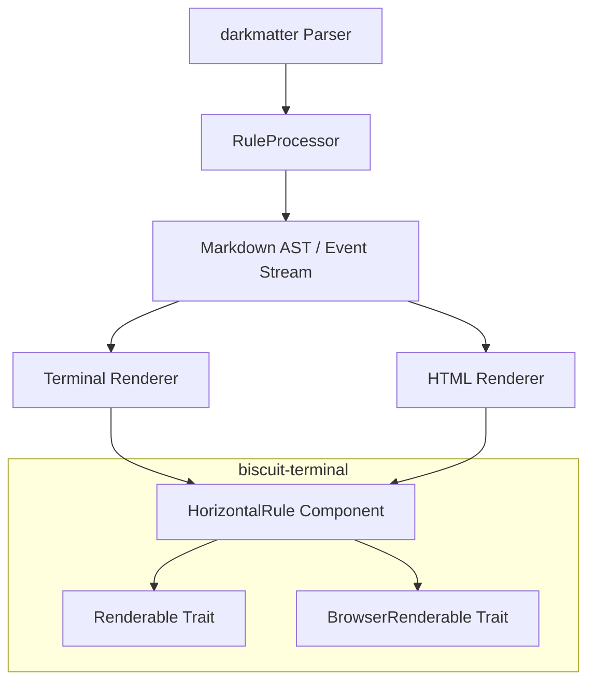

# Technical Design: Horizontal Rule Component

This document outlines the technical implementation for the Horizontal Rule (HR) feature in the Darkmatter monorepo. The feature provides rich, customizable horizontal rules for both terminal and browser environments, with progressive enhancement for restricted terminal environments.

## Architecture Overview

The implementation is split between `biscuit-terminal` (low-level rendering component) and `darkmatter` (markdown parsing and orchestration).



## 1. biscuit-terminal: The Core Component

### 1.1 BrowserRenderable Trait

Introduce a new trait in `biscuit-terminal/lib/src/components/renderable.rs` to support browser-based targets.

```rust
pub trait BrowserRenderable {
    /// Renders the component to an HTML/SVG string.
    fn render_to_browser(&self) -> String;

    /// Renders with inline CSS variables for instance-specific overrides.
    fn render_to_browser_with_inline_variables(
        &self, 
        variables: std::collections::HashMap<String, String>
    ) -> String;
}
```

### 1.2 HorizontalRule Component

Create `biscuit-terminal/lib/src/components/horizontal_rule.rs`.

#### Data Structures

```rust
#[derive(Debug, Clone, PartialEq, Default)]
pub enum RuleStyle {
    #[default]
    Dashes,
    Dots,
    Waves,
    LineStar,
    LineCircle,
    InsetLine,
    CurtainRod,
}

#[derive(Debug, Clone, PartialEq, Default)]
pub enum RulePlacement {
    #[default]
    Full,
    Centered,
    Left,
    Right,
}

#[derive(Debug, Clone, PartialEq, Default)]
pub enum RuleWeight {
    Thin,
    #[default]
    Medium,
    Thick,
}

pub struct HorizontalRule {
    pub style: RuleStyle,
    pub placement: RulePlacement,
    pub weight: RuleWeight,
    pub width: String, // e.g., "50%", "100px"
    pub color: Option<String>,
    pub layout: Layout,
}
```

#### Terminal Rendering (Progressive Enhancement)

Implement `Renderable` for `HorizontalRule`:

1.  **Tier 1 (Image):** If `Terminal::image_support` is available, render the style's SVG to a PNG (using `resvg`) and output using `TerminalImage`.
2.  **Tier 2 (Unicode):** Fallback to Unicode characters if images are unavailable (e.g., `≋≋≋≋` for `waves`).
3.  **Tier 3 (ASCII):** Final fallback for restricted environments (e.g., `~~~~` for `waves`).

#### Browser Rendering

Implement `BrowserRenderable` for `HorizontalRule`:

- Generate an SVG string based on the `style`.
- Use `stroke="currentColor"` to inherit text color.
- Use CSS variables for scaling (e.g., `var(--hr-line-weight)`).

## 2. darkmatter: Integration

### 2.1 Parsing Attributes

Horizontal rules with attributes (`--- { ... }`) are not standard CommonMark. We will implement a `RuleProcessor` iterator adapter in `darkmatter/lib/src/markdown/inline/mod.rs` (or a similar location for block-level processing).

The `RuleProcessor` will:
1.  Intercept `Event::Start(Tag::Paragraph)`.
2.  Inspect the following `Event::Text`.
3.  Match patterns like `^([\\-\\_\\*]{3,})\\s*\\{(.*)\\}\\s*$`.
4.  If matched, parse the JSON-like attributes in the braces.
5.  Emit a custom `InlineEvent::HorizontalRule(attrs)` and skip the corresponding `End(Tag::Paragraph)`.

### 2.2 Event Model Extension

Update `darkmatter/lib/src/markdown/inline/types.rs`:

```rust
pub enum InlineEvent<'a> {
    Standard(Event<'a>),
    Start(InlineTag),
    End(InlineTag),
    /// New variant for block-level horizontal rules with attributes
    HorizontalRule(HorizontalRuleAttrs),
}

#[derive(Debug, Clone, PartialEq, Default)]
pub struct HorizontalRuleAttrs {
    pub style: Option<String>,
    pub placement: Option<String>,
    pub weight: Option<String>,
    pub width: Option<String>,
    pub color: Option<String>,
}
```

### 2.3 Rendering Integration

#### Terminal Renderer
Update `darkmatter/lib/src/markdown/output/terminal.rs`:
- Handle `InlineEvent::HorizontalRule(attrs)`.
- Map `HorizontalRuleAttrs` to `biscuit_terminal::HorizontalRule`.
- Render using `rule.render(&term)`.

#### HTML Renderer
Update `darkmatter/lib/src/markdown/output/html.rs`:
- Handle `InlineEvent::HorizontalRule(attrs)`.
- Render using `rule.render_to_browser()`.

## 3. Visual Styles Implementation

| Style | SVG Primitive | Unicode Fallback | ASCII Fallback |
|-------|---------------|------------------|----------------|
| `dashes` | `<line stroke-dasharray="8,4" ...>` | `╌╌╌╌╌╌╌╌` | `----` |
| `dots` | `<line stroke-dasharray="2,6" stroke-linecap="round" ...>` | `········` | `....` |
| `waves` | `<path d="M0 20 Q 10 10 20 20 T 40 20 ..." ...>` | `≋≋≋≋≋≋≋≋` | `~~~~` |
| `line-circle` | `<line ...><circle cx="50%" ...>` | `────●────` | `---(o)---` |
| `line-star` | `<line ...><path d="STAR_PATH" ...>` | `────★────` | `---[*]---` |
| `inset-line` | `<line x1="10%" x2="90%" ...>` | `  ──────  ` | `  ----  ` |

## 4. Abstract Styling Mapping

The `HorizontalRule` component translates abstract units into target-specific values.

| Abstract Unit | Browser (CSS/SVG) | Terminal (Tier 1: Image) | Terminal (Tier 2/3) |
|---------------|-------------------|--------------------------|---------------------|
| `weight="thin"` | `stroke-width: 2px` | 2px stroke in generated PNG | Single-line chars |
| `weight="medium"` | `stroke-width: 4px" | 4px stroke in generated PNG | Single-line chars |
| `weight="thick"` | `stroke-width: 8px` | 8px stroke in generated PNG | Double-line/Heavy chars |
| `width="50%"` | `width: 50%` | Width = `term_width * 0.5` columns | Width = `term_width * 0.5` chars |
| `placement="centered"`| `margin: 0 auto` | Center-aligned block | Center-aligned string |

## 5. Documentation & Maintenance

### 5.1 New Documentation Files
- `darkmatter/docs/topics/horizontal-rules.md`: Usage guide for authors.
- `biscuit-terminal/docs/components/horizontal-rule.md`: Component API documentation.
- `biscuit-terminal/docs/components/browser-renderable-trait.md`: Trait documentation.

### 5.2 Agent Skill Updates
Update `.claude/skills/darkmatter` and `.claude/skills/biscuit-terminal` to include the new capability.

## 6. Testing Strategy

- **Unit Tests (`biscuit-terminal`):** Verify `HorizontalRule` rendering for all tiers (Image, Unicode, ASCII).
- **Unit Tests (`darkmatter`):** Verify attribute parsing from various markdown markers (`---`, `***`, `___`).
- **Integration Tests:** Verify that `darkmatter` correctly orchestrates the rendering of a horizontal rule through to terminal output.
- **Snapshot Tests:** Maintain SVG and ANSI output snapshots for visual consistency.
