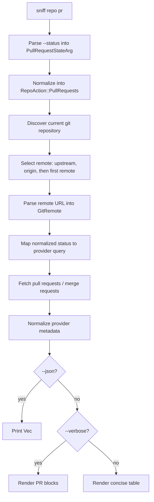

# Technical Design: `sniff repo pr`

This document is the engineering companion to the functional specification at
[`sniff/features/_unscheduled/repo-pr/spec.md`](../../../sniff/features/_unscheduled/repo-pr/spec.md).
The spec defines the user-facing behavior for listing pull requests and merge
requests from the current repository. This design maps that behavior onto the
existing `sniff` package area.

## 1. Scope

### In scope

- Add `sniff repo pr [--status <status>]`.
- Default to open pull requests.
- Support normalized statuses: `open`, `closed`, `merged`, `draft`, and `all`.
- Resolve the current Git repository's upstream remote automatically.
- Fetch PR/MR data through `sniff/lib/src/remote`.
- Expand `PullRequestInfo` with `labels` and `body`.
- Render table, verbose block, and JSON output.
- Provide actionable errors for missing remotes, unsupported providers,
  authentication failures, rate limits, and network failures.

### Out of scope

- Creating, editing, closing, or merging PRs.
- Fetching comments, reviews, CI checks, review decisions, or changed files.
- Interactive authentication setup.
- Adding new hosting providers.
- Exhaustive pagination across every page. The first implementation should
  request the provider's largest practical page size where generated clients
  support it and document first-page behavior where they do not.

## 2. Existing System

The feature fits in the existing `sniff` area:

- `sniff/lib/src/remote/types.rs` contains normalized remote data structures,
  including `PullRequestInfo`.
- `sniff/lib/src/remote/provider.rs` defines `RemoteRepoProvider`.
- `sniff/lib/src/remote/mod.rs` delegates `GitRemote` calls to concrete
  providers.
- `sniff/lib/src/remote/{github,gitlab,gitea,bitbucket}.rs` implement provider
  adapters over schematic-generated clients.
- `sniff/cli/src/args.rs` defines `RepoSubcommand` and normalizes it into
  `RepoAction`.
- `sniff/cli/src/commands.rs` handles repo actions that do not require full
  filesystem detection as early returns.
- `sniff/cli/src/output/remote.rs` already renders remote reports and contains
  a compact PR table for `sniff repo remote`.

The current provider trait already has `list_pull_requests(owner, repo)` but it
always means "open PRs" by convention. The new command requires an explicit
state filter.

## 3. Target Flow



## 4. Public Library Changes

### 4.1 `PullRequestState`

Add a normalized enum in `sniff/lib/src/remote/types.rs`:

```rust
#[derive(Debug, Clone, Copy, PartialEq, Eq, Hash, Serialize, Deserialize)]
#[serde(rename_all = "snake_case")]
pub enum PullRequestState {
    Open,
    Closed,
    Merged,
    Draft,
    All,
}
```

Add small helpers:

```rust
impl PullRequestState {
    pub const fn as_str(self) -> &'static str {
        match self {
            Self::Open => "open",
            Self::Closed => "closed",
            Self::Merged => "merged",
            Self::Draft => "draft",
            Self::All => "all",
        }
    }
}
```

Do not derive clap traits in the library. CLI parsing stays in
`sniff/cli/src/args.rs`.

### 4.2 `PullRequestInfo`

Extend `PullRequestInfo` in `sniff/lib/src/remote/types.rs`:

```rust
pub struct PullRequestInfo {
    pub number: u64,
    pub title: String,
    pub state: String,
    pub author: String,
    pub draft: bool,
    pub source_branch: Option<String>,
    pub target_branch: Option<String>,
    pub labels: Vec<String>,
    pub body: Option<String>,
    pub created_at: String,
    pub updated_at: Option<String>,
    pub merged_at: Option<String>,
    pub html_url: String,
}
```

Keep `state: String` for compatibility with existing JSON consumers. Provider
implementations should normalize values to `open`, `closed`, `merged`, `draft`,
or `unknown` where enough metadata exists.

## 5. Provider Trait Changes

Change `RemoteRepoProvider::list_pull_requests` in
`sniff/lib/src/remote/provider.rs`:

```rust
async fn list_pull_requests(
    &self,
    owner: &str,
    repo: &str,
    state: PullRequestState,
) -> Result<Vec<PullRequestInfo>, SniffError>;
```

Update all call sites:

- `RemoteRepoProvider::fetch_report` should call with
  `PullRequestState::Open` to preserve current report behavior.
- `GitRemote` in `sniff/lib/src/remote/mod.rs` should delegate the state
  argument to each concrete provider.
- Existing tests in `sniff/lib/tests/remote_providers.rs` should pass
  `PullRequestState::Open` unless they are specifically testing state mapping.

This is a workspace-internal `0.1.0` API, so a breaking trait signature change
is acceptable.

## 6. Provider Mapping

Each provider maps the normalized state to the closest provider query and then
normalizes returned objects into `PullRequestInfo`.

| Normalized state | GitHub query | GitLab query | Gitea query | Bitbucket query |
| --- | --- | --- | --- | --- |
| `Open` | `open` | `opened` | `open` | `OPEN` |
| `Closed` | `closed` | `closed` | `closed` | `DECLINED` |
| `Merged` | `closed`, then filter | `merged` | `closed`, then filter | `MERGED` |
| `Draft` | `open`, then filter | `opened`, then filter | `open`, then filter | return empty |
| `All` | `all` | omit state | omit state if no `all` support | omit state |

### 6.1 GitHub

File: `sniff/lib/src/remote/github.rs`

- Use `ListPullRequestsRequest::with_state(String)` if the generated request
  exposes it.
- For `Merged`, query `closed` and filter `merged_at.is_some()`.
- For `Draft`, query `open` and filter `draft == true`.
- Populate `body` from the generated PR summary body field when present.
- Populate `labels` if labels are present on the PR response type. Do not add
  an issue API request per PR for labels in the first implementation.

### 6.2 GitLab

File: `sniff/lib/src/remote/gitlab.rs`

- Use `ListMergeRequestsRequest::with_state(String)` for `opened`, `closed`,
  and `merged`.
- Omit the state query for `All` if that is the generated client's existing
  all-states behavior.
- For `Draft`, query `opened` and filter `mr.draft || mr.work_in_progress`.
- Populate `body` from `description`.
- Populate `labels` from the merge request labels field.

### 6.3 Gitea and Forgejo

File: `sniff/lib/src/remote/gitea.rs`

- Use the generated state query for `open` and `closed`.
- For `Merged`, query `closed` and filter using returned merge metadata if the
  generated type exposes it. If no merge marker exists, keep the state as
  `closed` and document that Gitea cannot distinguish closed from merged with
  the current generated model.
- For `Draft`, query `open` and filter `draft == true` when available.
- Populate `body` if the generated PR summary exposes it.
- Populate `labels` only if present on the PR summary.

### 6.4 Bitbucket

File: `sniff/lib/src/remote/bitbucket.rs`

- Use Bitbucket state values `OPEN`, `DECLINED`, and `MERGED` where generated
  requests support state filtering.
- Return an empty vector for `Draft`; Bitbucket Cloud does not expose a draft
  pull request state compatible with the normalized model.
- Populate `body` from `description`.
- Leave `labels` empty.

## 7. CLI Design

### 7.1 Argument parsing

Add a CLI-local parser enum in `sniff/cli/src/args.rs`:

```rust
#[derive(Debug, Clone, Copy, clap::ValueEnum)]
pub enum PullRequestStateArg {
    Open,
    Closed,
    Merged,
    Draft,
    All,
}

impl From<PullRequestStateArg> for sniff::remote::PullRequestState {
    fn from(value: PullRequestStateArg) -> Self {
        match value {
            PullRequestStateArg::Open => Self::Open,
            PullRequestStateArg::Closed => Self::Closed,
            PullRequestStateArg::Merged => Self::Merged,
            PullRequestStateArg::Draft => Self::Draft,
            PullRequestStateArg::All => Self::All,
        }
    }
}
```

Add a `RepoSubcommand` variant:

```rust
#[command(name = "pr")]
Pr {
    /// Filter pull requests by normalized status.
    #[arg(long, default_value_t = PullRequestStateArg::Open)]
    status: PullRequestStateArg,
}
```

Add a normalized action:

```rust
RepoAction::PullRequests {
    status: sniff::remote::PullRequestState,
}
```

`-v/--verbose` and `--json` are already global CLI flags, so the `pr`
subcommand should not duplicate them.

### 7.2 Dispatch

Handle `RepoAction::PullRequests` as an early return in
`sniff/cli/src/commands.rs`, alongside `RepoAction::Remote`. This command only
needs local Git remote discovery plus a remote API call, not full system
detection.

Recommended shape:

```rust
crate::args::RepoAction::PullRequests { status } => {
    let result = handle_repo_pull_requests(
        *status,
        base_dir.as_deref(),
        cli.json,
        cli.plain,
        cli.verbose,
        &perf,
    )
    .await;
    perf.emit_stdout(None);
    return result;
}
```

Add `RepoAction::PullRequests` to `is_scriptable_repo_action` as `false` if it
prints rich text by default and uses `--json` for machine-readable output. If a
future plain output mode is designed for pipelines, revisit this classification.

## 8. Remote Resolution

`sniff repo pr` should target the current repository's configured upstream.
Use this precedence:

1. `upstream`
2. `origin`
3. first configured remote name

Add a helper near the existing `resolve_remote_name` helper in
`sniff/cli/src/commands.rs`:

```rust
fn resolve_default_pr_remote(base_dir: Option<&Path>) -> Result<String, String> {
    let dir = base_dir.unwrap_or_else(|| Path::new("."));
    let repo = git2::Repository::discover(dir)
        .map_err(|e| format!("Not a git repository: {}", e))?;

    let remotes = repo
        .remotes()
        .map_err(|e| format!("Could not read git remotes: {}", e))?;

    // upstream -> origin -> first remote
}
```

Return the remote URL string, not a provider. The existing remote URL parser and
`GitRemote::from_url` should remain the authoritative provider detection path.

If no remotes exist, return:

```text
No git remotes found for this repository.
```

## 9. Fetching

Add a focused handler in `sniff/cli/src/commands.rs`:

```rust
async fn handle_repo_pull_requests(
    status: PullRequestState,
    base_dir: Option<&Path>,
    json: bool,
    plain: bool,
    verbose: bool,
    perf: &PerfTracker,
) -> Result<(), Box<dyn std::error::Error>> {
    let remote_url = resolve_default_pr_remote(base_dir)?;
    let parsed = GitRemote::parse_url(&remote_url)?;
    let remote = GitRemote::from_url(&remote_url)?;
    let prs = remote
        .list_pull_requests(&parsed.owner, &parsed.repo, status)
        .await
        .map_err(format_pull_request_error)?;

    if json {
        output::remote::print_pull_requests_json(&prs)?;
    } else if verbose {
        output::emit_text(&output::remote::render_pull_request_blocks(&prs, plain));
    } else {
        output::emit_text(&output::remote::render_pull_request_table(&prs, plain));
    }

    perf.mark("repo-pr");
    Ok(())
}
```

The exact error type can follow existing command helpers, but errors should be
formatted before leaving the handler so users get credential guidance instead
of raw provider failures.

## 10. Output

Extend `sniff/cli/src/output/remote.rs` unless it becomes too large; a later
split into `output/pr.rs` is fine but not required.

Recommended exported functions:

```rust
pub fn render_pull_request_table(prs: &[PullRequestInfo], plain: bool) -> String;
pub fn render_pull_request_blocks(prs: &[PullRequestInfo], plain: bool) -> String;
pub fn print_pull_requests_json(prs: &[PullRequestInfo]) -> serde_json::Result<()>;
```

### 10.1 Default table

Columns:

- `ID`
- `Title`
- `Author`
- `State`

Behavior:

- Show all returned PRs unless the table renderer needs an explicit truncation
  policy. The existing remote report table can keep its current top-10 summary.
- Render `#123` for numeric IDs.
- Render draft state as `open [draft]` or `draft` consistently with verbose
  output.
- When no PRs match, print a short empty state such as:

```text
No pull requests found.
```

### 10.2 Verbose blocks

Each block should follow the spec mockup:

```text
#123: Feature: Add repo pr command
---------------------------------
Author:  @username
Status:  open [draft]
Branch:  feature/repo-pr -> main
Labels:  enhancement, cli
Created: 2024-03-20

Description:
This PR adds the `sniff repo pr` subcommand to list...
```

Omit optional lines when absent:

- omit `Branch` if both branch names are absent;
- omit `Labels` if `labels` is empty;
- omit `Description` if `body` is `None` or blank.

### 10.3 JSON

Print the raw `Vec<PullRequestInfo>` with `serde_json::to_string_pretty`. This
keeps the command focused and satisfies the spec's "all available metadata"
requirement.

## 11. Error Handling

Use existing `SniffError` variants where possible. Format errors at the CLI
boundary for command-specific guidance.

| Case | User-facing message guidance |
| --- | --- |
| Not a git repository | `Not a git repository: <path or git2 error>` |
| No remotes | `No git remotes found for this repository.` |
| Unsupported provider | Mention the remote URL and supported providers: GitHub, GitLab, Gitea/Forgejo, Bitbucket. |
| Missing credentials | Mention anonymous access failed and list provider env vars. |
| Invalid credentials | Mention the token was rejected and list provider env vars. |
| Rate limited | Mention the provider rate limit and credential env vars. |
| Network/API failure | Include provider, status when present, and the original message. |

Credential guidance:

| Provider | Environment variables |
| --- | --- |
| GitHub | `GITHUB_TOKEN` or `GH_TOKEN` |
| GitLab | `GITLAB_TOKEN` or `GITLAB_PRIVATE_TOKEN` |
| Gitea/Forgejo | `GITEA_TOKEN`; Codeberg may use `CODEBERG_TOKEN` |
| Bitbucket | `BITBUCKET_USERNAME` and `BITBUCKET_APP_PASSWORD` |

Provider constructors should continue to allow anonymous clients. If a
schematic client returns `MissingCredential` before making a public request,
the provider setup should be adjusted so anonymous public reads are attempted
first.

## 12. Testing Plan

### 12.1 Library unit tests

Add or update tests in `sniff/lib/tests/remote_providers.rs` and provider-local
test modules:

- `PullRequestState::as_str` returns normalized names.
- Provider query mapping for every normalized state.
- GitHub `Merged` filters `merged_at.is_some()`.
- GitHub `Draft` filters `draft == true`.
- GitLab `Draft` filters `draft || work_in_progress`.
- Bitbucket `Draft` returns an empty vector.
- `PullRequestInfo` JSON includes `labels` and `body`.
- Existing remote report tests still fetch open PRs by default.

### 12.2 CLI parser tests

Add tests in `sniff/cli/src/args.rs`:

- `sniff repo pr` produces `RepoAction::PullRequests { status: Open }`.
- `sniff repo pr --status merged` produces `Merged`.
- Invalid status fails with clap's valid value list.
- `sniff repo pr --help` includes `--status`.

### 12.3 CLI command tests

Use existing `assert_cmd` style tests if present, or add focused tests around
helper functions:

- Temporary repo with `upstream` and `origin` chooses `upstream`.
- Temporary repo with only `origin` chooses `origin`.
- Temporary repo with neither uses the first remote.
- Temporary repo with no remotes returns the clear no-remotes error.
- Non-repository directory returns the clear not-a-repository error.
- `--json` prints a JSON array.
- `--verbose` includes description and labels when present.

### 12.4 Provider HTTP tests

Avoid live network calls in the default test suite. Use existing `wiremock`
fixtures where the generated clients support configurable base URLs:

- unauthenticated public response succeeds;
- 401 maps to credential guidance;
- 403 or 429 maps to rate-limit guidance when applicable;
- body and labels fields are preserved when present in provider JSON.

## 13. Documentation

Update alongside implementation:

- `sniff/cli/README.md`: add `sniff repo pr`, status examples, JSON example,
  and credential guidance.
- `sniff/lib/src/remote/provider.rs`: document the new state argument.
- `sniff/lib/src/remote/types.rs`: document `PullRequestState`, `labels`, and
  `body`.
- `.claude/skills/sniff/SKILL.md`: add the new CLI command and mention the
  state-filtered provider method if the skill catalog is kept current with
  public workflows.

No dependency documentation update is expected unless implementation adds a new
crate. The design should be achievable with existing dependencies.

## 14. Implementation Order

1. Add `PullRequestState` and expand `PullRequestInfo`.
2. Change the provider trait signature and update `GitRemote` delegation.
3. Update `fetch_report` to request `PullRequestState::Open`.
4. Implement provider-specific query mapping and client-side filters.
5. Add CLI parser enum, `RepoSubcommand::Pr`, and `RepoAction::PullRequests`.
6. Add default remote resolution.
7. Add the command handler and error formatter.
8. Add table, verbose, and JSON output functions.
9. Update tests.
10. Update README and skill documentation.

## 15. Open Questions

- Should `sniff repo pr` grow `--remote <name>` later? The spec asks for
  automatic upstream detection, so this design omits it for the first pass.
- Should `--status closed` exclude merged PRs? This design excludes merged PRs
  when the provider exposes enough metadata to distinguish them. If consumers
  expect provider-native semantics, this can be revisited.
- Should JSON include remote provenance such as provider, owner, repo, and
  remote URL? The first version prints only `Vec<PullRequestInfo>` for a small,
  scriptable surface.
