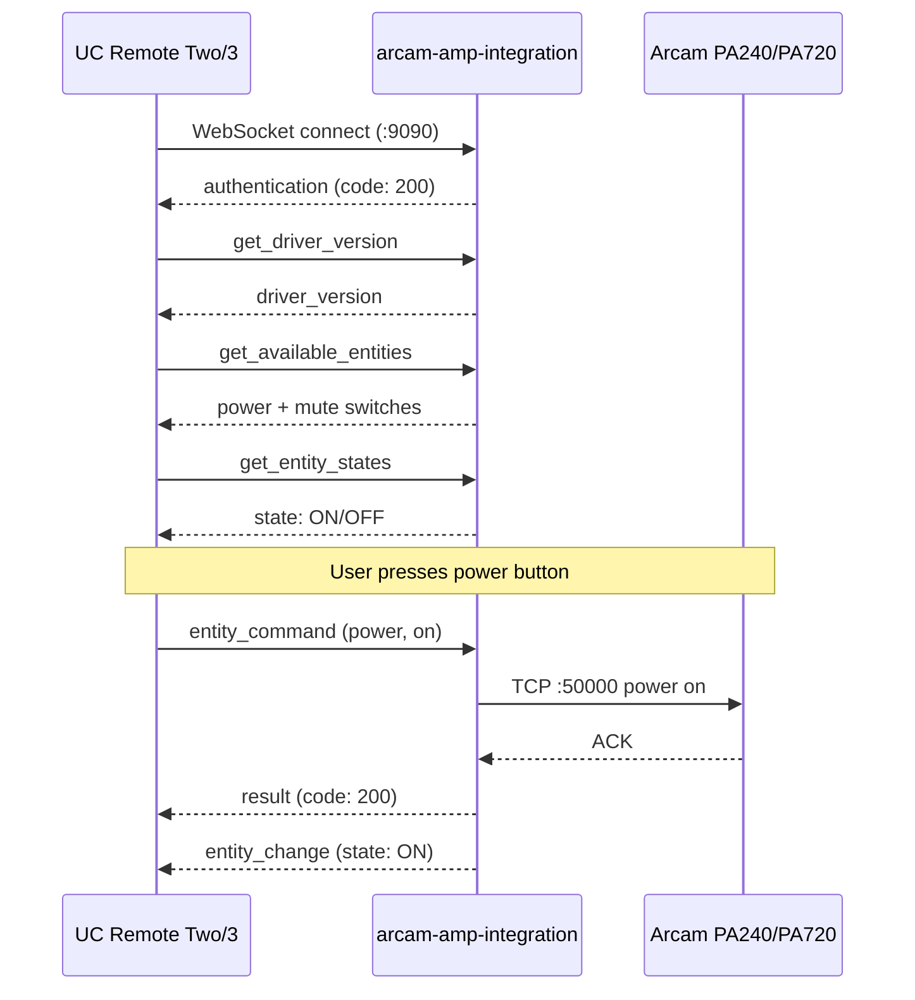

# arcam-amp-integration

Unfolded Circle integration driver for Arcam PA-series amplifiers (PA240, PA410, PA720).

## What It Does

This is a standalone WebSocket server that speaks the [Unfolded Circle Integration protocol](https://unfoldedcircle.github.io/core-api/integration/). When a UC Remote Two or Remote 3 connects, the driver exposes Arcam amplifiers as switch entities for power and mute control.

The driver also implements the configurator metadata flow (`get_driver_version` and `get_driver_metadata`) including `setup_data_schema`, so a fresh Remote can configure an amplifier through the integration protocol instead of relying on startup-only host seeding. The setup schema follows the UC field contract (`select` with `options` and `value`) and falls back to host/name text inputs when discovery has no candidates yet.

### Entities

| Entity ID | Type | Features | Commands |
|-----------|------|----------|----------|
| `arcam.{name}.power` | switch | on_off | on, off, toggle |
| `arcam.{name}.mute` | switch | on_off | on, off, toggle |

The `{name}` comes from the configured device instance. `--device-name` is only a seed default for CLI-driven hints. Entity state is `ON`, `OFF`, or `UNKNOWN` while the amplifier is unreachable.

### How It Works



## Running as an External Integration

Run the integration on any machine that can reach both the UC Remote and the Arcam amplifier on your network. This is the easiest way to get started.

```bash
# Build
cargo build -p arcam-amp-integration --release

# Run
arcam-amp-integration --host 192.168.1.102 --device-name office
```

### CLI Options

| Flag | Default | Description |
|------|---------|-------------|
| `--listen` | `0.0.0.0:9090` | WebSocket listen address |
| `--host` | *(optional seed hint)* | Arcam amplifier IP or hostname |
| `--port` | `50000` | Arcam TCP port |
| `--device-name` | `amp` | Name used in entity IDs |
| `--timeout` | `5` | Arcam TCP operation timeout (seconds) |
| `--poll-interval` | `5` | Background poll interval in seconds |
| `--mdns` | `false` | Advertise `_uc-integration._tcp.local.` for UC auto-discovery |

### Authentication

Set the `UCR_INTEGRATION_TOKEN` environment variable to require token-based authentication on the WebSocket connection. The Remote sends this token in the `auth-token` header during the WebSocket upgrade.

```bash
UCR_INTEGRATION_TOKEN=my-secret arcam-amp-integration --host 192.168.1.102
```

### Registering on the Remote

In the UC Web Configurator:

1. Go to **Integrations & Docks** > **+** > **Add external integration**
2. Enter the IP and port where the driver is running (e.g., `192.168.1.50:9090`)
3. If using authentication, enter the token
4. The Remote opens the setup flow, validates or discovers the amplifier, and then binds the power/mute switch entities to that Remote

### mDNS Auto-Discovery

If you start the driver with `--mdns`, it advertises itself via `_uc-integration._tcp.local.` so the configurator can discover it automatically on the local subnet.

```bash
arcam-amp-integration --host 192.168.1.102 --device-name office --mdns
```

Important behavior:

- mDNS discovery only publishes presence and connection coordinates
- the visible discovery label and developer line come from the mDNS TXT record, so publishing only the raw driver ID or omitting the developer TXT field will show `arcam-amplifier` and `Unknown developer`
- the configurator still requires a valid `driver_metadata` response after opening the WebSocket session
- the `setup_data_schema` inside `driver_metadata` must use the documented UC field shapes; an invalid setup schema can cause the integration tile to open with a `Resource not found` style error before setup begins
- `setup_driver` must be acknowledged before the driver spends time scanning the LAN or validating a device; otherwise the configurator can time out before it receives the discovery selector
- if the integration is visible in discovery but cannot be opened, treat `get_driver_metadata` compatibility as part of the debugging path
- multicast filtering or VLAN boundaries can prevent discovery even though manual host/port registration still works

## Running with Docker

The Docker packaging uses a two-stage build: Rust-on-Alpine for compilation, then a small Alpine runtime with an entrypoint that maps environment variables to the integration's CLI flags.

### Docker Compose (Recommended)

The simplest way to run the integration in a container. The checked-in [docker-compose.yaml](docker-compose.yaml) uses `network_mode: host` so the container can reach the Arcam on your LAN and the UC Remote can connect to the WebSocket server.

```bash
cd homelab/arcam-amp-integration

# Minimum -- just set the Arcam IP
ARCAM_HOST=192.168.1.102 docker compose up -d

# With all options
ARCAM_HOST=192.168.1.102 \
  DEVICE_NAME=office \
  LISTEN_PORT=9090 \
  ARCAM_PORT=50000 \
  UCR_INTEGRATION_TOKEN=my-secret \
  RUST_LOG=debug \
  docker compose up -d
```

| Variable | Default | Description |
|----------|---------|-------------|
| `ARCAM_HOST` | *(required)* | Arcam amplifier IP or hostname |
| `ARCAM_PORT` | `50000` | Arcam TCP port |
| `LISTEN_PORT` | `9090` | WebSocket listen port |
| `DEVICE_NAME` | `amp` | Name used in entity IDs |
| `TIMEOUT` | `5` | Arcam TCP timeout (seconds) |
| `POLL_INTERVAL` | `5` | Background poll interval (seconds) |
| `UCR_INTEGRATION_TOKEN` | *(empty)* | Auth token for UC Remote |
| `RUST_LOG` | `info,mdns_sd::service_daemon=off` | Log filter override |

To enable mDNS in Docker, pass `--mdns` as an extra argument because the entrypoint forwards trailing args to the binary:

```bash
docker compose run --service-ports arcam-amp-integration --mdns
```

or set a `command: ["--mdns"]` override in your compose file.

### Docker Build Only

Build the image directly and run it yourself:

```bash
# Recommended from the integration directory
just build-image

# Or manually from the monorepo root
docker build -f homelab/arcam-amp-integration/Dockerfile -t arcam-amp-integration .

# Run with host networking and env-based entrypoint defaults
docker run --rm --network host arcam-amp-integration \
  -e ARCAM_HOST=192.168.1.102 \
  -e DEVICE_NAME=office
```

## Validation

From `homelab/arcam-amp-integration/`:

```bash
just install
just build-image
just sanity-test
just sanity-test-mutate
```

`sanity-test` requires `ARCAM_REAL_HOST` and optionally `ARCAM_REAL_PORT`. `sanity-test-mutate` additionally requires `ARCAM_REAL_ALLOW_DESTRUCTIVE=1`.

## State Synchronization

- Startup no longer blindly activates every persisted device. Devices are activated lazily when a Remote has assigned them through setup or when a CLI seed hint is later assigned.
- `get_entity_states` runs a fresh power + mute query against the amplifier and updates the cache before responding.
- A background poll loop diffs refreshed state against the cache and broadcasts `entity_change` to subscribed clients when power or mute changes outside the UC Remote.
- `device_state` reflects actual amplifier reachability, not just configuration presence. When the amplifier cannot be queried, cached entity states move to `UNKNOWN` and the integration emits a `DISCONNECTED` device-state event.

## Setup Notes

- Setup discovery now probes previously known devices plus the local IPv4 LAN instead of only revalidating registry entries.
- On very large subnets the scan is intentionally clamped to the interface's local `/24` slice so setup remains responsive.
- The initial setup screen stays valid even when network discovery returns no Arcam candidates. In that case the configurator shows only manual host and device-name inputs instead of an empty selector.
- The dynamic setup screen sends initialized `setup_data` for every rendered field so manual host entry remains valid when no device is selected.
- When discovery finds candidates, the selector uses the documented UC `select` field shape with `options` and `value`, not custom dropdown keys.

## Key Dependencies

- `homelab` -- Arcam TCP protocol implementation (power, mute, system status)
- `schematic-schema` -- UC Integration WebSocket host (`WsHandler`, shared event hub, auth, connection management)
- `unfolded-integration-helper` -- shared UC envelope builders, keyed cache, subscriptions, and protocol fixtures
- `tokio` -- Async runtime
- `clap` -- CLI argument parsing

## Lessons Learned

- The UC Integration protocol requires the **driver to be the WebSocket server** and the Remote to be the client. This is the opposite of most hub-based protocols.
- `entity_command` returns a synchronous UC `result` envelope. Actual state changes are pushed later through `entity_change` events when the cache changes.
- mDNS discovery is not a replacement for the protocol handshake. A discoverable driver still needs `driver_metadata` for the configurator to render integration details.
- Default logs suppress noisy malformed-packet messages from unrelated LAN mDNS traffic; re-enable `mdns_sd::service_daemon` in `RUST_LOG` only when actively debugging discovery.
