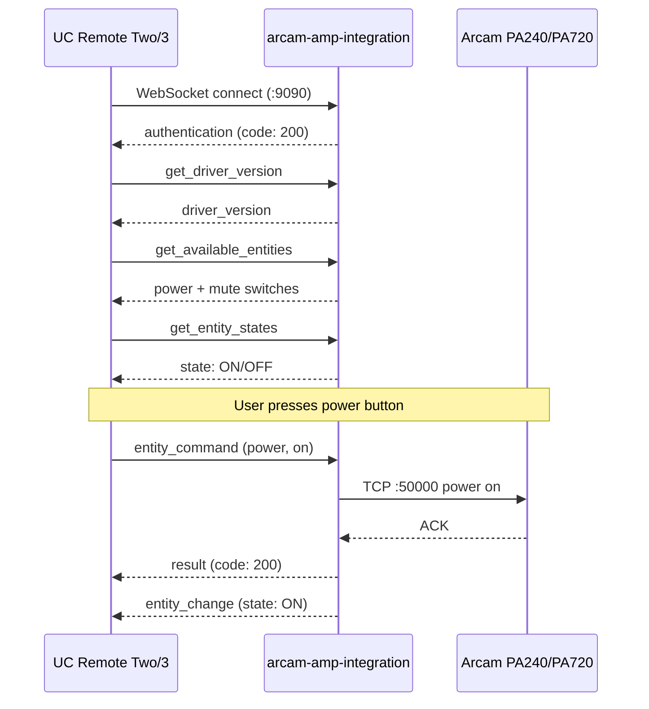

# arcam-amp-integration

Unfolded Circle integration driver for Arcam PA-series amplifiers (PA240, PA410, PA720).

## What It Does

This is a standalone WebSocket server that speaks the [Unfolded Circle Integration protocol](https://unfoldedcircle.github.io/core-api/integration/). When a UC Remote Two or Remote 3 connects, the driver exposes Arcam amplifiers as switch entities for power and mute control.

### Entities

| Entity ID | Type | Features | Commands |
|-----------|------|----------|----------|
| `arcam.{name}.power` | switch | on_off, toggle | on, off, toggle |
| `arcam.{name}.mute` | switch | on_off, toggle | on, off, toggle |

The `{name}` comes from the `--device-name` flag (default: `amp`). Entity state is `ON`, `OFF`, or `UNKNOWN` while the amplifier is unreachable.

### How It Works



## Running as an External Integration

Run the integration on any machine that can reach both the UC Remote and the Arcam amplifier on your network. This is the easiest way to get started.

```bash
# Build
cargo build -p arcam-amp-integration --release

# Run
arcam-amp-integration --host 192.168.1.102 --device-name office
```

### CLI Options

| Flag | Default | Description |
|------|---------|-------------|
| `--listen` | `0.0.0.0:9090` | WebSocket listen address |
| `--host` | *(required)* | Arcam amplifier IP or hostname |
| `--port` | `50000` | Arcam TCP port |
| `--device-name` | `amp` | Name used in entity IDs |
| `--timeout` | `5` | Arcam TCP operation timeout (seconds) |
| `--poll-interval` | `5` | Background poll interval in seconds |

### Authentication

Set the `UCR_INTEGRATION_TOKEN` environment variable to require token-based authentication on the WebSocket connection. The Remote sends this token in the `auth-token` header during the WebSocket upgrade.

```bash
UCR_INTEGRATION_TOKEN=my-secret arcam-amp-integration --host 192.168.1.102
```

### Registering on the Remote

In the UC Web Configurator:

1. Go to **Integrations & Docks** > **+** > **Add external integration**
2. Enter the IP and port where the driver is running (e.g., `192.168.1.50:9090`)
3. If using authentication, enter the token
4. The Remote connects and discovers the power/mute switch entities

## Running with Docker

The Dockerfile uses a four-stage build (toolchain, dependency cache, compile, scratch runtime) to produce a minimal image (~10 MB) containing only the statically-linked binary.

### Docker Compose (Recommended)

The simplest way to run the integration in a container. Uses `network_mode: host` so the container can reach the Arcam on your LAN and the UC Remote can connect to the WebSocket server.

```bash
cd homelab/arcam-amp-integration

# Minimum -- just set the Arcam IP
ARCAM_HOST=192.168.1.102 docker compose up -d

# With all options
ARCAM_HOST=192.168.1.102 \
  DEVICE_NAME=office \
  LISTEN_PORT=9090 \
  ARCAM_PORT=50000 \
  UCR_INTEGRATION_TOKEN=my-secret \
  RUST_LOG=debug \
  docker compose up -d
```

| Variable | Default | Description |
|----------|---------|-------------|
| `ARCAM_HOST` | *(required)* | Arcam amplifier IP or hostname |
| `ARCAM_PORT` | `50000` | Arcam TCP port |
| `LISTEN_PORT` | `9090` | WebSocket listen port |
| `DEVICE_NAME` | `amp` | Name used in entity IDs |
| `TIMEOUT` | `5` | Arcam TCP timeout (seconds) |
| `UCR_INTEGRATION_TOKEN` | *(empty)* | Auth token for UC Remote |
| `RUST_LOG` | `info` | Log level (`debug`, `info`, `warn`, `error`) |

### Docker Build Only

Build the image directly and run it yourself:

```bash
# Build from the monorepo root (required for workspace context)
docker build -f homelab/arcam-amp-integration/Dockerfile -t arcam-amp-integration .

# Run with host networking
docker run --rm --network host arcam-amp-integration \
  --host 192.168.1.102 --device-name office
```

## State Synchronization

- The driver performs a startup refresh before it begins serving the WebSocket API, so the first `get_entity_states` call is not a hard-coded all-`OFF` guess.
- `get_entity_states` runs a fresh power + mute query against the amplifier and updates the cache before responding.
- A background poll loop diffs refreshed state against the cache and broadcasts `entity_change` to subscribed clients when power or mute changes outside the UC Remote.
- `device_state` reflects actual amplifier reachability, not just configuration presence. When the amplifier cannot be queried, cached entity states move to `UNKNOWN` and the integration emits a `DISCONNECTED` device-state event.

## Key Dependencies

- `homelab` -- Arcam TCP protocol implementation (power, mute, system status)
- `schematic-schema` -- UC Integration WebSocket host (`WsHandler`, shared event hub, auth, connection management)
- `unfolded-integration-helper` -- shared UC envelope builders, keyed cache, subscriptions, and protocol fixtures
- `tokio` -- Async runtime
- `clap` -- CLI argument parsing

## Lessons Learned

- The UC Integration protocol requires the **driver to be the WebSocket server** and the Remote to be the client. This is the opposite of most hub-based protocols.
- `entity_command` returns a synchronous UC `result` envelope. Actual state changes are pushed later through `entity_change` events when the cache changes.
