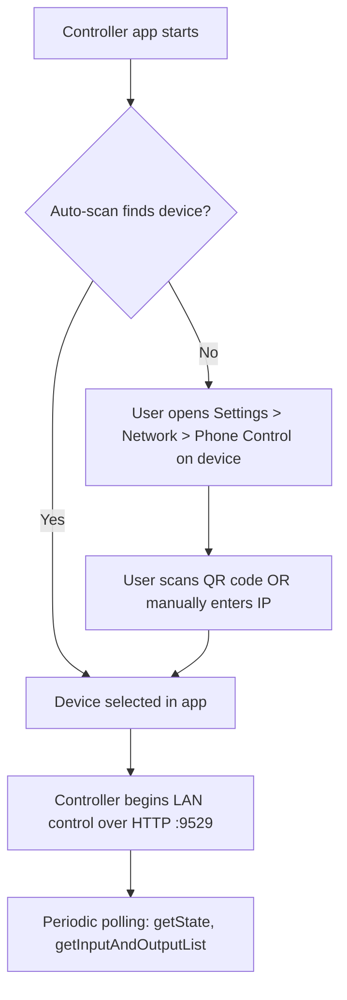
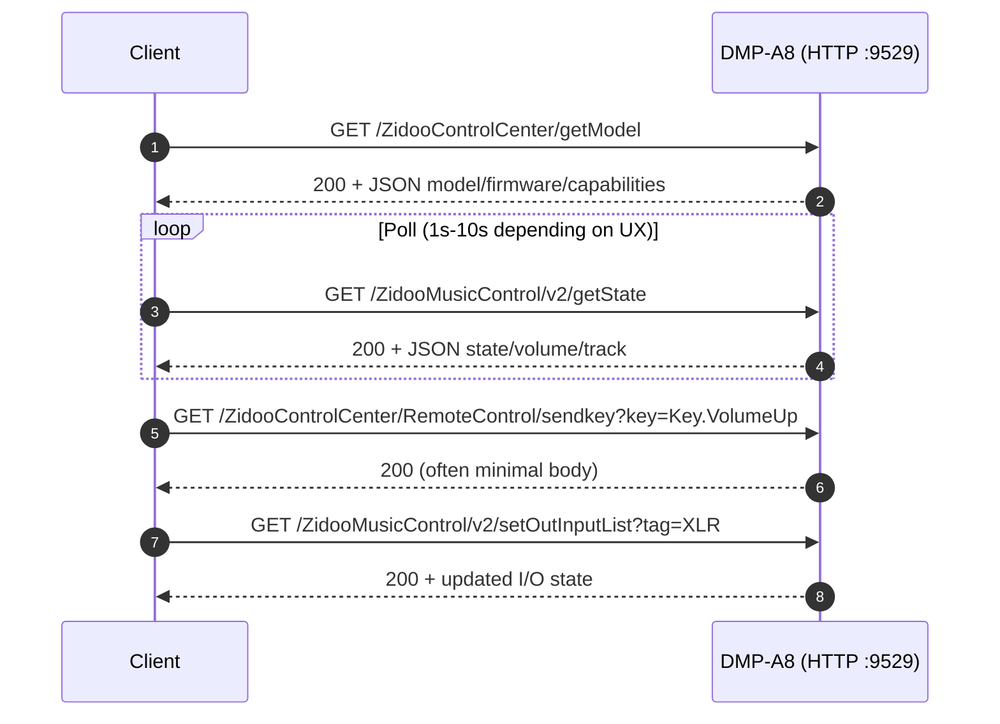

# TCP/IP Control API Deep Research Report for the Eversolo DMP-A8

## Executive summary

The "TCP/IP API" exposed by the **Eversolo DMP-A8** is, in practice, a **local-network HTTP control surface over TCP** — most consistently observed on **port 9529** with a base such as `http://<device-ip>:9529/…` rather than any raw TCP socket protocol. Official Eversolo materials show simple, unauthenticated HTTP GET examples (not TLS) and list remote-control key injection commands, but do **not** publish a full DMP-A8-specific protocol spec. [^1] [^2] [^3]

A much more complete, structured "open API" documentation set is available under **Zidoo's network open API** site (the device family appears to share an API lineage: endpoints such as `/ZidooControlCenter/...` and `/ZidooMusicControl/v2/...` show up in Eversolo's own developer snippet and in community integrations). This Zidoo doc set covers: model/identity (`getModel`), now-playing state (`getState`), playback controls, power options, input/output enumeration and selection, and a Wake-on-LAN description. [^2]

Community implementations (notably a Home Assistant custom integration, and an Unfolded Circle Remote integration) materially extend practical coverage with additional working endpoints (e.g., absolute volume set, mute/unmute, brightness controls, VU/spectrum mode controls) and real-world "gotchas," including content-type quirks, path inconsistencies, screen on/off behavior, and model/firmware feature gating. [^18] [^21]

Wake-on-LAN (WOL) is officially supported on the DMP-A8, but official guidance is **operational** (wired Ethernet + same LAN, wait after sending) rather than protocol-specific; Zidoo's WOL doc explicitly calls out **broadcast port 9517** and use of the wired MAC address, which is a strong hint but should be packet-captured in your environment before you hard-code it. [^4] [^15]

## Official documentation and protocol baseline

### Transport, security posture, and the key implication for developers

Across the official Eversolo "Developer Platform" page and the Zidoo Open API doc, the control protocol is explicitly **HTTP** (not HTTPS), with examples using a plain `http://<ip>:9529/...` base and no authentication material shown (no tokens, no cookies, no signatures). [^1] [^2]

That combination implies two practical realities:

1. **Anyone on the same L2/L3 network segment can potentially control the device** if they can reach TCP/9529 (unless you add network segmentation or firewalling yourself). [^2]
2. You should treat the API as **LAN-scoped**: Eversolo's pairing/WOL guidance repeatedly asserts "same local area network," consistent with an expectation of trusted-LAN operation. [^5] [^6]

### Physical context of "LAN only" requirements

Eversolo's DMP-A8 user manual and WOL guide specify that WOL requires **wired Ethernet**, and that the controller (phone/app) and the device must be on the **same LAN**; they also caution you not to resend WOL repeatedly and to expect compatibility variance across network gear. [^4] [^5]

### Official Eversolo developer snippet: minimal API surface

Eversolo's Developer Platform page provides:

- A `getModel` example on port 9529 under a `/ZidooControlCenter/getModel` path and showing device identity fields (status, model, MACs, firmware, etc.). [^1]
- A "Remote control" pattern using `/ZidooControlCenter/RemoteControl/...` with `sendkey` and `inputtext`, plus a long list of `Key.*` constants (volume, playback, navigation, power, etc.). [^1]

This is official, but it is **not a complete protocol reference** for music playback state, queues, I/O, volume scaling, etc. [^1]

### Official "Eversolo TCP" PDF: legacy but still useful for keycodes

A short official PDF titled "Eversolo TCP" (published for DMP-A6 but widely referenced by the community) documents:

- "TCP" as "HTTP," with base URL on port **9529**. [^3]
- The `sendkey` endpoint and a command table including: Poweroff/Reboot, media play/pause/next/prev, mute, volume up/down, output selection keys, and screen display keys. [^3]

A major developer "gotcha" is visible even in this minimal PDF: it presents `/ControlCenter/RemoteControl/sendkey` as the base, but the example uses `/ZidooControlCenter/RemoteControl/sendkey`, implying multiple historical/alias base paths or a documentation inconsistency. [^3]

### Zidoo Open API documentation: the most complete primary protocol spec

Zidoo's "network open API" documentation (v1.0.1) is explicit about:

- **Fixed port: 9529**
- **Base address: `http://IP:9529`**
- HTTP GET examples for the endpoints and JSON response structures. [^2]

While branded as Zidoo, this doc is highly relevant because:

- Eversolo's official developer snippet uses the same `/ZidooControlCenter/...` naming style [^1]
- Community code for Eversolo devices calls `/ZidooMusicControl/v2/...` endpoints described in this Zidoo doc set. [^18] [^9] [^12]

Key endpoints and message shapes from Zidoo's documentation that are directly useful:

**Device identity**

- `GET /ZidooControlCenter/getModel` (no params), returning identity, firmware, and capability flags (e.g., `ableRemoteBoot`, `hasEqSetting`, etc.). [^2]

**Remote key injection**

- `GET /ZidooControlCenter/RemoteControl/sendkey?key=<Key.*>` returning (in the doc) a JSON object with `{"status": 200}`, and listing many `Key.*` names including power modes, navigation, volume, media keys, etc. [^8]
- Note the doc shows this as `text/plain` in the response metadata (a content-type quirk that matters for strict JSON clients). [^8]

**Now-playing / state**

- `GET /ZidooMusicControl/v2/getState`, returning a large JSON payload: playback state, position/duration, metadata (including non-ASCII), and a nested `volumeData` structure with max/current volume, mute state, and a displayed dB string. [^9]

**Power options and power action**

- `GET /ZidooMusicControl/v2/getPowerOption` returns supported power operations (tags like `poweroff`, `reboot`, `timeshutdown`, etc.). [^10]
- `GET /ZidooMusicControl/v2/setPowerOption?tag=<tag>` executes the operation. [^10]

**Playback controls**

- `GET /ZidooMusicControl/v2/playNext`, `/playLast`, `/playOrPause`, and `/seekTo?time=<ms>` each return a small success payload (`{"status": 200}` in examples). [^11] [^16]

**Input/output enumeration & switching**

- `GET /ZidooMusicControl/v2/getInputAndOutputList` returns:
  - `inputData[]` items (name, tag, icons, sorted index)
  - `outputData[]` items (name, tag, enable flag, icons)
  - `outputInfo` with detailed format/support info (especially for HDMI-like outputs) [^12]
- `GET /ZidooMusicControl/v2/setInputList?tag=<inputTag>` both sets the input and returns the updated I/O state payload. [^13]
- `GET /ZidooMusicControl/v2/setOutInputList?tag=<outputTag>` sets output and returns the updated I/O state payload. [^14]

**Wake-on-LAN detail (Zidoo doc)**

Zidoo's WOL page is unusually specific: it describes WOL as requiring the wired MAC address, broadcasting to `255.255.255.255`, and it lists **broadcast port 9517**. [^15]

This is not repeated in Eversolo's DMP-A8 WOL guide (which is operational rather than protocol-level), so you should treat 9517 as a strong hint, not a guarantee for the DMP-A8, until confirmed by capture. [^15] [^5] [^4]

### Firmware-related functional differences that can affect control behavior

Eversolo's DMP-A8 firmware release notes include device-specific items (e.g., "Optimized room correction function," "Optimized IIS output mode settings"), implying that **available inputs/outputs and their behavior can change across firmware**. [^7]

Separately, Eversolo's DMP-A8 Settings Menu guide documents that some audio behaviors (e.g., "Volume passthrough mode") require minimum firmware versions (e.g., v1.2.70+ for passthrough mode). Even if the API endpoints remain stable, this can change the meaning of "set volume" or the ability to adjust volume at all on certain outputs. [^24]

## Unofficial and community implementations

### Home Assistant custom component: a practical endpoint map (aiohttp-centric)

A widely used community reference is the [`hchris1/Eversolo`](https://github.com/hchris1/Eversolo) custom integration for Home Assistant, which documents supported entities (power on/off, reboot, screen control, brightness, output selection, playback, etc.) and explicitly states it's tested primarily on DMP-A6, but it is still one of the clearest real-world protocol maps. [^17]

Its API client:

- Uses default port **9529** and a **1-second default update interval**, indicating that frequent polling is feasible on LAN in at least some setups. [^19]
- Calls Zidoo-documented endpoints such as:
  - `/ZidooMusicControl/v2/getState` (state)
  - `/ZidooMusicControl/v2/getInputAndOutputList`
  - `/ZidooMusicControl/v2/getPowerOption` [^18] [^9] [^12] [^10]
- Also calls additional endpoints that are **not found in the crawlable Zidoo API pages** but are evidently functional in practice:
  - `/ZidooMusicControl/v2/setDevicesVolume?volume=…` (absolute volume set)
  - `/ZidooMusicControl/v2/setMuteVolume?isMute=0|1`
  - `/ZidooMusicControl/v2/changVUDisplay?openType=…`
  - `/SystemSettings/displaySettings/getScreenBrightness` and `setScreenBrightness?index=…`
  - `/SystemSettings/displaySettings/getKnobBrightness` and `setKnobBrightness?index=…`
  - `/SystemSettings/displaySettings/getVUModeList` and `setVUMode?index=…`
  - `/SystemSettings/displaySettings/getSpPlayModeList` and `setSpPlayModeList?index=…` [^18] [^21]

Two particularly important implementation details from this integration:

- It parses JSON with `response.json(content_type=None)` (aiohttp), a deliberate workaround for inconsistent/missing content-type headers from the device. [^18] [^8]
- It determines "screen on/off" state via a heuristic: it calls `getPowerOption` and looks for a `tag == "screen"` option whose localized name contains "Screen off" (or translations). This suggests the API does **not** expose a direct "screen is on" boolean, at least not in the documented endpoints. [^18] [^10]

### Unfolded Circle Remote integration: operational guidance + polling model

The `mase1981/uc-intg-eversolo` integration (for Unfolded Circle Remote 2/3) provides additional pragmatic guidance:

- Confirms **HTTP API on port 9529**, "same local network," and recommends static IP/DHCP reservation; it also describes "periodic polling for state updates." [^20]
- Its accompanying discovery analysis report (for DMP-A6 and DMP-A10, firmware v1.5.46) enumerates additional **SystemSettings** endpoints (brightness, display modes) and notes behavioral quirks:
  - "Display Off/On Behavior": "Display Off just dims … instead of turning screen completely off" and recommends using remote keys `Key.Screen.OFF/ON` instead of brightness APIs.
  - Model-specific "Knob brightness … doesn't work" on a model without hardware support.
  - Output items that exist but are disabled unless hardware is connected (e.g., "USB DAC output … enable: false"). [^21] [^12]

Although that discovery run did not include the DMP-A8, it is still valuable evidence that (a) API surface expands beyond Zidoo's published pages and (b) **feature gating is real**, so you should design around capability discovery at runtime. [^21] [^2] [^12]

### Reported DMP-A8 integration failure: "reachable via HTTP GET but integration says unknown"

A concrete DMP-A8-related failure report exists in the Unfolded Circle integration issue tracker: users report that raw HTTP GET calls work (for power off, etc.), yet the integration setup shows "state unknown" / "not reachable." This is evidence of practical failure modes likely tied to polling assumptions, endpoint differences, firmware differences, or HTTP parsing differences. [^22] [^20]

### An alternate (non-IP) fallback: learned IR codes

The Unfolded Circle repo also includes learned IR codes (CSV) for common keys (power, play/pause, volume, mute, etc.). While not TCP/IP, it represents a practical "workaround path" if IP control is blocked by network segmentation or firmware quirks. [^23]

## Developer gotchas and recommended mitigations

### Path inconsistencies and endpoint aliasing

**Symptom:** Different documents and implementations use **different base prefixes**:

- `/ZidooControlCenter/...` (Eversolo developer snippet; Zidoo sendkey doc) [^1] [^8]
- `/ControlCenter/...` (Eversolo TCP PDF base; Home Assistant `getModel`) [^3] [^18]
- The DMP-A6 PDF even mixes both within the same doc (base says `/ControlCenter`, example uses `/ZidooControlCenter`). [^3]

**Mitigation pattern:** implement a "base-path fallback" strategy:

- For model: try `GET /ZidooControlCenter/getModel`, then `GET /ControlCenter/getModel`.
- For remote keys: try `GET /ZidooControlCenter/RemoteControl/sendkey?...` first (most consistently documented). [^8] [^1] [^3]

### Unauthenticated, unencrypted HTTP

**Risk:** Because the API is HTTP on a fixed LAN port with no described authentication, it is susceptible to on-path sniffing and unauthorized control by any host with network reachability. [^2] [^1] [^3]

**Mitigations:**

- Restrict TCP/9529 to a trusted VLAN/subnet at the router/firewall.
- If you must control across networks, prefer a VPN (WireGuard/Tailscale-style) rather than port-forwarding.
- Avoid exposing `9529/tcp` to the public internet.

### Content-type / JSON parsing quirks

**Evidence:**
- Zidoo's `sendkey` doc shows a `text/plain` response type even though the body is shaped like JSON (`{"status": 200}`). [^8]
- The Home Assistant client explicitly parses JSON with aiohttp using `content_type=None`, bypassing content-type checks. [^18]

**Mitigation:** Always parse responses leniently:
- Accept JSON with wrong/missing content-type.
- Accept empty `{}` bodies for "command" endpoints (many Zidoo endpoints show `{}` as success). [^10] [^16]
- Use timeouts and retries for LAN flakiness rather than assuming server misbehavior.

### Output "enable" and tag normalization

**Evidence:**
- `getInputAndOutputList` returns `outputData[].enable` and tags such as `SPDIF`, `XLRRCA`, etc. [^12]
- Community code strips `/` from tags and labels, implying some tags can contain `/` in practice (or at least defensively). [^18]

**Mitigation:** Don't assume:
- `enable` is strictly boolean vs integer (treat truthy/falsey).
- tags are identifier-safe as file keys / entity IDs; normalize them for storage/display but retain the raw tag for API calls.

### "Absolute volume" vs "step volume" vs firmware settings

**Evidence:**
- `getState`'s `volumeData` includes `maxVolume` (example: 200) and `currenttVolume`, suggesting a device-native integer scale plus a displayed dB string. [^9]
- Community integration uses both:
  - Step-based volume via `sendkey?key=Key.VolumeUp|Down` and
  - Absolute volume set via `/ZidooMusicControl/v2/setDevicesVolume?volume=…`. [^18] [^8]
- Firmware/UI options such as "volume passthrough mode" can make volume non-adjustable for outputs, and these features are firmware-gated (documented for DMP-A8 settings). [^24]

**Mitigation:**
- Always read `getState.volumeData` first; respect flags like `isVolumeEnable` where available. [^9]
- Prefer absolute volume set when you need determinism, but clamp to `[minVolume, maxVolume]` from state and be prepared for certain outputs to reject changes. [^9] [^18]
- Treat "output selection" and "volume set" as a coupled system: selecting a different output can change max volume, mute semantics, or whether volume control is enabled. [^12] [^24]

### Screen control is surprisingly non-trivial

**Evidence:**
- Community discovery reports that "Display Off" via brightness can behave like dimming, and recommends using `Key.Screen.OFF/ON` remote keys instead. [^21] [^8]
- Home Assistant implements both brightness-based control (`setScreenBrightness?index=…`) and explicit key-based screen on/off. [^18] [^21]

**Mitigation:** implement screen state and control with a two-layer approach:
- Use `Key.Screen.OFF/ON` for "hard" screen toggle semantics.
- Use brightness endpoints for dimming/UX polish only.
- Don't assume there is a single canonical "screen is on" boolean; you may have to infer it (as Home Assistant does via `getPowerOption`). [^18] [^10]

### WOL timing, port uncertainty, and "don't spam"

**Evidence:**
- DMP-A8 manual and WOL guide: wired Ethernet required; same LAN; wait after sending; compatibility issues possible; don't send multiple times. [^4] [^5]
- Zidoo WOL doc: broadcast `255.255.255.255`, port **9517**, use wired MAC. [^15] [^2]
- Generic WOL references: magic packet structure (6x`0xFF` + 16xMAC) and Wireshark has a WOL protocol/dissector/filter. [^25] [^26]

**Mitigation:**
- Implement WOL as "send once -> wait (e.g., 30-90s) -> start HTTP probing with backoff."
- Make the UDP port configurable (default candidates: 9517 per Zidoo doc; also common 9/7).
- Packet-capture your phone app's WOL packet to confirm destination port and addressing on your network before you bake assumptions into code. [^5] [^15] [^26]

## Source comparison

| Source | URL | Reliability | Notes |
|---|---|---:|---|
| Eversolo "Developer Platform" | https://eversolo.com/Support/developer/ | High | Official minimal API intro: `getModel` example + `sendkey` key list; shows HTTP on 9529 and `/ZidooControlCenter/...` naming |
| "Eversolo TCP" PDF (DMP-A6) | https://music.eversolo.com/dmp/instruction/Eversolo_DMP-A6_TCP_en_v1.0.pdf | High | Official keycode table + base URL hints; contains path inconsistency (`/ControlCenter` vs `/ZidooControlCenter`) |
| DMP-A8 User Manual (PDF) | https://music.eversolo.com/dmp/instruction/EVERSOLO-DMP-A8-User-Manual-v1.0.pdf | High | Official operational constraints: phone control, WOL requirements & cautions; not a protocol spec |
| DMP-A8 WOL guide | https://shop.zidoo.tv/a/support/basic-settings/eversolo-dmp-a8-wake-on-lanwol-guide | High | Official: WOL operation flow, "don't resend," same LAN, wired Ethernet |
| Eversolo pairing guide | https://shop.zidoo.tv/a/support/basic-settings/eversolo-mobile-tablet-control-app-pairing-guide | High | Official: "auto-scan," QR pairing, manual IP fallback; highlights permissions (local network, Bluetooth, camera) |
| DMP-A8 firmware changelog page | https://www.eversolo.com/Support/downloadList/target/uXoirEESmeVKKmVViAFMcQ%3D%3D.html | High | Official: firmware changes; indicates evolving behavior (IIS output mode settings, room correction) |
| Zidoo Open API "doc + getModel example" | https://apidoc.zidoo.tv/319438933e0 | High | Primary structured protocol reference: fixed port 9529, base `http://IP:9529`, JSON examples |
| Zidoo Open API `sendkey` page | https://apidoc.zidoo.tv/319428206e0 | High | Key list + request/response; shows `text/plain` response type in doc |
| Zidoo Open API `getState` page | https://apidoc.zidoo.tv/319551899e0 | High | Detailed now-playing payload including `volumeData` |
| Zidoo Open API `getInputAndOutputList` page | https://apidoc.zidoo.tv/319490384e0 | High | Full I/O enumeration payload with tags + `outputInfo` |
| Zidoo Open API WOL page | https://apidoc.zidoo.tv/319460467e0 | Medium-High | WOL broadcast port 9517 and address; likely applicable but should be confirmed on DMP-A8 |
| Home Assistant custom integration (`hchris1/Eversolo`) | https://github.com/hchris1/Eversolo | Medium-High | Widely used implementation; reveals undocumented endpoints (absolute volume, mute, SystemSettings) and parsing workarounds |
| Unfolded Circle Remote integration (`uc-intg-eversolo`) | https://github.com/mase1981/uc-intg-eversolo | Medium | Operational requirements, polling model, model-specific feature matrix |
| Discovery analysis file (A6/A10) | https://raw.githubusercontent.com/mase1981/uc-intg-eversolo/main/DISCOVERY_ANALYSIS.md | Medium | Concrete endpoint list + observed quirks (screen off vs dim, disabled outputs) and firmware tag |
| DMP-A8 "state unknown" issue report | https://github.com/mase1981/uc-intg-eversolo/issues/1 | Medium | Evidence of DMP-A8 reachability mismatch: HTTP GET works but integration fails |
| Learned IR codes CSV | https://raw.githubusercontent.com/mase1981/uc-intg-eversolo/main/Custom%20-%20learned%20IR%20codes_Eversolo%20DMP-A6_codeset_2026-02-04.csv | Medium | Non-IP workaround path for key controls |

## Reported issues with evidence and mitigations

### WOL intermittently fails or requires retries

**Evidence:** Official docs warn about WOL compatibility issues and explicitly recommend waiting and not repeating the command. [^4] [^5]

**Likely causes:** broadcast filtering, VLAN segmentation, Wi-Fi vs Ethernet mismatch, NIC power state, or destination-port differences across sender implementations. [^5] [^15] [^25]

**Mitigations:**
Implement WOL with:
- configurable UDP port (start with 9517 per Zidoo doc; optionally also try 9/7)
- exponential backoff HTTP probing after sending
- optional directed broadcast (e.g., `192.168.1.255`) instead of `255.255.255.255` if your router blocks limited broadcast
- capture WOL packets to confirm (Wireshark `wol` display filter). [^15] [^26] [^25]

### API client breaks due to wrong/missing content-type

**Evidence:** Zidoo `sendkey` is documented as returning `text/plain` despite JSON-like bodies, and Home Assistant bypasses aiohttp's content-type checks. [^8] [^18]

**Mitigation:** Always parse JSON leniently (aiohttp: `resp.json(content_type=None)`), tolerate `{}` and small status bodies, and treat HTTP 200 as primary success. [^18] [^16] [^8]

### "Screen off" is inconsistent: dims vs off

**Evidence:** Community discovery notes "Display Off just dims … use remote keys instead," and Home Assistant directly uses `Key.Screen.OFF/ON`. [^21] [^18] [^8]

**Mitigation:** Prefer `sendkey?key=Key.Screen.OFF|ON` for "hard" behavior; keep brightness endpoints for dimming. [^21] [^18]

### Feature presence is model/firmware dependent

**Evidence:** Firmware notes mention A8-specific output-mode changes; community discovery shows disabled outputs that depend on hardware connection (USB DAC). [^7] [^21] [^12]

**Mitigation:** Use capability discovery at runtime:
- call `getModel` and record `firmware`
- call `getInputAndOutputList` and drive UI/entities from returned `inputData/outputData`
- treat output selection and volume constraints as dynamic per output. [^2] [^12] [^9]

### DMP-A8 integration "reachable via HTTP GET" but ecosystem integration fails (state unknown)

**Evidence:** A DMP-A8 user reports HTTP GET works for power off, but the Unfolded Circle integration shows "unknown/not reachable." [^22]

**Likely causes (hypotheses):**
- integration assumes an endpoint path variant not present on that firmware (`/ControlCenter` vs `/ZidooControlCenter`) [^3] [^1] [^18]
- JSON parsing differences (content-type / encoding) [^18] [^8]
- polling too aggressive or timing-related during device power states [^19] [^5]

**Mitigation:** In your own implementation, add:
- fallback base-path probing at startup
- a "health endpoint" (`getModel`) plus "core endpoint" (`getState`) test
- configurable poll interval and timeouts
- structured error logging and raw-response dumps to diagnose. [^2] [^9] [^18]

## Detailed findings: endpoints, ports, formats, and example code

### Canonical ports and addressing

- **HTTP control:** TCP **9529**, base `http://<ip>:9529` [^2] [^20] [^3]
- **WOL (likely):** UDP broadcast, port **9517** (Zidoo doc) but not explicitly confirmed for DMP-A8; must validate by capture. [^15] [^5]

### Common request patterns

The API is heavily GET-oriented, including state changes (power, playback, set output). [^10] [^8] [^12] [^9]

Typical call shape:

- `GET /ZidooMusicControl/v2/<verb>` (music control)
- `GET /ZidooControlCenter/RemoteControl/sendkey?key=<Key.*>` (remote injection)
- `GET /SystemSettings/...` (display settings, in community implementations)

### Example curl requests

```bash
# Device identity
curl -sS "http://$IP:9529/ZidooControlCenter/getModel"

# Now playing / state (big JSON)
curl -sS "http://$IP:9529/ZidooMusicControl/v2/getState"

# Send a remote key (e.g., VolumeUp)
curl -sS "http://$IP:9529/ZidooControlCenter/RemoteControl/sendkey?key=Key.VolumeUp"

# Next track
curl -sS "http://$IP:9529/ZidooMusicControl/v2/playNext"

# Inputs/outputs enumeration
curl -sS "http://$IP:9529/ZidooMusicControl/v2/getInputAndOutputList"

# Switch input by tag (example tag from list: XMOS)
curl -sS "http://$IP:9529/ZidooMusicControl/v2/setInputList?tag=XMOS"

# Switch output by tag (example: XLR)
curl -sS "http://$IP:9529/ZidooMusicControl/v2/setOutInputList?tag=XLR"

# Power off (tag must exist in getPowerOption)
curl -sS "http://$IP:9529/ZidooMusicControl/v2/setPowerOption?tag=poweroff"
```

The endpoint names and example payloads are directly documented in Zidoo's Open API pages. [^2] [^9] [^8] [^14] [^1]

### Python (requests) example: robust "probe + call" client

```python
import json
import time
from typing import Any, Dict, Optional
import requests

class EversoloClient:
    def __init__(self, host: str, port: int = 9529, timeout_s: float = 5.0):
        self.base = f"http://{host}:{port}"
        self.timeout_s = timeout_s
        # Prefer /ZidooControlCenter but keep fallback aliases
        self.model_paths = [
            "/ZidooControlCenter/getModel",
            "/ControlCenter/getModel",
        ]

    def _get_json(self, path: str, params: Optional[Dict[str, Any]] = None) -> Any:
        # Cache-bust to avoid weird intermediary caching on some networks
        params = dict(params or {})
        params.setdefault("_t", int(time.time() * 1000))

        url = f"{self.base}{path}"
        r = requests.get(url, params=params, timeout=self.timeout_s)
        r.raise_for_status()

        # Many endpoints return JSON with non-standard content-type; requests doesn't care.
        # Some endpoints may return empty {} or bytes; handle both.
        if not r.content:
            return None
        try:
            return r.json()
        except Exception:
            # Fall back to text -> json
            return json.loads(r.text)

    def get_model(self) -> Dict[str, Any]:
        last_err = None
        for p in self.model_paths:
            try:
                data = self._get_json(p)
                if isinstance(data, dict) and data.get("status") in (200, "200", None):
                    return data
                return data
            except Exception as e:
                last_err = e
        raise RuntimeError(f"getModel failed on all known paths: {last_err}")

    def get_state(self) -> Dict[str, Any]:
        return self._get_json("/ZidooMusicControl/v2/getState")

    def send_key(self, key: str) -> Any:
        return self._get_json("/ZidooControlCenter/RemoteControl/sendkey", params={"key": key})

    def play_pause(self) -> Any:
        return self._get_json("/ZidooMusicControl/v2/playOrPause")

    def next_track(self) -> Any:
        return self._get_json("/ZidooMusicControl/v2/playNext")

    def set_output(self, tag: str) -> Any:
        # Some implementations also pass index; tag alone is documented.
        return self._get_json("/ZidooMusicControl/v2/setOutInputList", params={"tag": tag})

if __name__ == "__main__":
    c = EversoloClient("192.168.1.50")
    print(c.get_model())
    print(c.get_state().get("playingMusic", {}))
    c.send_key("Key.VolumeUp")
```

This code is aligned with the documented endpoint families (Zidoo Open API, Eversolo developer snippet) but includes defensive handling for the aliasing observed in official/community docs. [^2] [^1] [^3] [^18]

### Python (aiohttp) example: async polling + tolerant JSON parsing

```python
import asyncio
import time
from typing import Any, Dict, Optional

import aiohttp

class AsyncEversoloClient:
    def __init__(self, host: str, port: int = 9529):
        self.base = f"http://{host}:{port}"

    async def _get(self, session: aiohttp.ClientSession, path: str, params: Optional[Dict[str, Any]] = None,
                   parse_json: bool = True) -> Any:
        params = dict(params or {})
        params.setdefault("_t", int(time.time() * 1000))
        url = f"{self.base}{path}"

        async with session.get(url, params=params, timeout=aiohttp.ClientTimeout(total=10)) as resp:
            resp.raise_for_status()
            if not parse_json:
                return await resp.read()
            # Critical: ignore content-type to survive incorrect headers
            return await resp.json(content_type=None)

    async def get_state(self, session: aiohttp.ClientSession) -> Dict[str, Any]:
        return await self._get(session, "/ZidooMusicControl/v2/getState")

    async def send_key(self, session: aiohttp.ClientSession, key: str) -> Any:
        return await self._get(session, "/ZidooControlCenter/RemoteControl/sendkey", params={"key": key})

async def main():
    client = AsyncEversoloClient("192.168.1.50")
    async with aiohttp.ClientSession() as session:
        # Poll loop (tune interval to your UX needs)
        for _ in range(5):
            st = await client.get_state(session)
            print("state=", st.get("state"), "pos=", st.get("position"), "title=", (st.get("playingMusic") or {}).get("title"))
            await asyncio.sleep(1.0)

        # Example command
        await client.send_key(session, "Key.VolumeDown")

if __name__ == "__main__":
    asyncio.run(main())
```

The `content_type=None` pattern is directly supported by the Home Assistant integration's client and reflects real-world behavior for these endpoints. [^18] [^8]

## Suggested test plan and troubleshooting steps

### A developer-oriented validation sequence

Establish a repeatable test sequence that records both **firmware** and **API outputs** (store JSON snapshots) so you can compare across firmware updates.

1. **Network prerequisites**
   - Confirm the DMP-A8 is on wired Ethernet if you plan to use WOL. [^4] [^5]
   - Assign a static IP or DHCP reservation; Eversolo documents a static IP configuration flow. [^29] [^20]

2. **Health check**
   - `GET /ZidooControlCenter/getModel` (fallback `/ControlCenter/getModel`) and record:
     - model name, firmware string, MAC addresses, capability flags. [^2] [^18] [^1]

3. **State read**
   - `GET /ZidooMusicControl/v2/getState`; verify:
     - metadata encoding (non-ASCII titles)
     - position/duration progression
     - volume scale and mute state. [^9]

4. **Remote key injection sanity**
   - Send `Key.VolumeUp` (audible change or observe `volumeData.currenttVolume` change).
   - Send `Key.Screen.OFF` and then `Key.Screen.ON` (confirm behavior). [^8] [^18] [^21]

5. **I/O enumeration**
   - `GET /ZidooMusicControl/v2/getInputAndOutputList`; verify:
     - expected input count and tags (A8 has IIS, multiple analog/digital inputs per its product role)
     - output enable flags correspond to physical connections. [^12] [^7]

6. **I/O switching**
   - Set input: `setInputList?tag=<tag-from-inputData>`.
   - Set output: `setOutInputList?tag=<tag-from-outputData>`.
   - Re-read I/O list and `getState` to confirm the change is reflected. [^13] [^14] [^12]

7. **Playback controls**
   - `playOrPause`, `playNext`, `playLast`, and `seekTo?time=<ms>` (if applicable to current source). [^11] [^16]

8. **Volume absolute set (unofficial but widely used)**
   - If you choose to use `setDevicesVolume` / `setMuteVolume`, treat them as "soft-undocumented":
     - test on your firmware
     - clamp ranges based on `getState.volumeData`
     - fall back to key-based volume if rejected. [^18] [^9] [^8]

### Packet capture: exact commands and filters

Because discovery/WOL transport details can vary, capture traffic while pairing and waking.

#### Capture HTTP control traffic (TCP/9529)

On a Linux workstation on the same LAN:

```bash
sudo tcpdump -i <iface> -s 0 -w eversolo_9529.pcap "host <DMP_A8_IP> and tcp port 9529"
```

This is a standard tcpdump pattern (capture full packets, write to pcap).

To view HTTP-like payloads directly in terminal (quick triage), many workflows use `-A` ASCII printing; if you need only a pcap for Wireshark, prefer `-w`.

#### Capture WOL and discovery candidates (UDP)

Given uncertainty, capture multiple likely UDP ports during pairing and wake attempts:

```bash
sudo tcpdump -i <iface> -s 0 -w eversolo_discovery_wol.pcap \
  "host <DMP_A8_IP> or (udp port 9517 or udp port 9 or udp port 7 or udp port 1900 or udp port 5353)"
```

- UDP/9517 is specifically referenced by the Zidoo WOL doc. [^15]
- UDP/1900 is SSDP (UPnP discovery). [^27]
- UDP/5353 is mDNS (zeroconf). (Not confirmed for Eversolo control discovery; include to observe.)

In Wireshark:
- Use display filter `wol` to find magic packets. [^26]
- Use `ssdp` for SSDP. [^27]
- Use `http && tcp.port == 9529` to focus on control. (HTTP dissector applies because it's plain HTTP, not TLS.) [^2]

#### Validate WOL packet structure

The "magic packet" structure (6x`0xFF` then 16xMAC) is documented in `wakeonlan` man pages and Wireshark WOL documentation. [^25] [^26]

### Device-side diagnostics: capturing logs for vendor escalation

If you need to escalate to Eversolo support, Eversolo's official log capture guide instructs installing a "Realtek Debug" tool APK and collecting the `rtk_dump` folder to share with support. [^28]

## Mermaid diagrams for discovery and control flows

### Discovery and pairing flow (as observed/expected, with unknowns flagged)



This flow is consistent with Eversolo's pairing guide ("auto search," QR scan, manual IP entry) but the exact transport used for "auto-scan" is **unspecified in official docs** and should be confirmed via capture (SSDP/mDNS/broadcast probe are candidates). [^6] [^5]

### Control and state polling sequence



Endpoints and response structures are taken from the documented Zidoo Open API pages and Eversolo's own developer snippet (same port and naming patterns). [^2] [^9] [^8] [^14] [^1]

<!-- References -->

[^1]: [Eversolo Developer Platform](https://eversolo.com/Support/developer/)
[^2]: [Zidoo Open API — getModel](https://apidoc.zidoo.tv/319438933e0)
[^3]: [Eversolo TCP PDF (DMP-A6)](https://music.eversolo.com/dmp/instruction/Eversolo_DMP-A6_TCP_en_v1.0.pdf)
[^4]: [DMP-A8 User Manual (PDF)](https://music.eversolo.com/dmp/instruction/EVERSOLO-DMP-A8-User-Manual-v1.0.pdf)
[^5]: [DMP-A8 WOL Guide](https://shop.zidoo.tv/a/support/basic-settings/eversolo-dmp-a8-wake-on-lanwol-guide)
[^6]: [Eversolo Pairing Guide](https://shop.zidoo.tv/a/support/basic-settings/eversolo-mobile-tablet-control-app-pairing-guide)
[^7]: [DMP-A8 Firmware Changelog](https://www.eversolo.com/Support/downloadList/target/uXoirEESmeVKKmVViAFMcQ%3D%3D.html)
[^8]: [Zidoo Open API — sendkey](https://apidoc.zidoo.tv/319428206e0)
[^9]: [Zidoo Open API — getState](https://apidoc.zidoo.tv/319551899e0)
[^10]: [Zidoo Open API — getPowerOption](https://apidoc.zidoo.tv/319478932e0)
[^11]: [Zidoo Open API — Playback Controls](https://apidoc.zidoo.tv/319483283e0)
[^12]: [Zidoo Open API — getInputAndOutputList](https://apidoc.zidoo.tv/319490384e0)
[^13]: [Zidoo Open API — setInputList](https://apidoc.zidoo.tv/319511079e0)
[^14]: [Zidoo Open API — setOutInputList](https://apidoc.zidoo.tv/319515898e0)
[^15]: [Zidoo Open API — WOL](https://apidoc.zidoo.tv/319460467e0)
[^16]: [Zidoo Open API — seekTo / Playback](https://apidoc.zidoo.tv/319618644e0)
[^17]: [Home Assistant Eversolo Integration](https://github.com/hchris1/Eversolo)
[^18]: [HA Eversolo — api.py](https://raw.githubusercontent.com/hchris1/Eversolo/main/custom_components/eversolo/api.py)
[^19]: [HA Eversolo — const.py](https://raw.githubusercontent.com/hchris1/Eversolo/main/custom_components/eversolo/const.py)
[^20]: [Unfolded Circle Remote Integration](https://github.com/mase1981/uc-intg-eversolo)
[^21]: [Discovery Analysis (A6/A10)](https://raw.githubusercontent.com/mase1981/uc-intg-eversolo/main/DISCOVERY_ANALYSIS.md)
[^22]: [DMP-A8 "State Unknown" Issue](https://github.com/mase1981/uc-intg-eversolo/issues/1)
[^23]: [Learned IR Codes CSV](https://raw.githubusercontent.com/mase1981/uc-intg-eversolo/main/Custom%20-%20learned%20IR%20codes_Eversolo%20DMP-A6_codeset_2026-02-04.csv)
[^24]: [DMP-A8 Settings Menu Introduction](https://shop.zidoo.tv/a/support/basic-settings/dmp-a8-settings-menu-introduction)
[^25]: [wakeonlan(1) Man Pages](https://man.archlinux.org/man/extra/wakeonlan/wakeonlan.1.en)
[^26]: [Wireshark WOL Wiki](https://wiki.wireshark.org/WakeOnLAN)
[^27]: [Wireshark SSDP Wiki](https://wiki.wireshark.org/SSDP)
[^28]: [Eversolo Log Capture Guide](https://shop.zidoo.tv/a/support/tools/how-to-capture-logs-on-eversolo-streamers)
[^29]: [Eversolo Static IP Configuration Guide](https://www.eversolo.com/Support/support_guide/guide_target/Un8zElY1uQneq7k9e%5Bld%5D3ulg%3D%3D.html)
