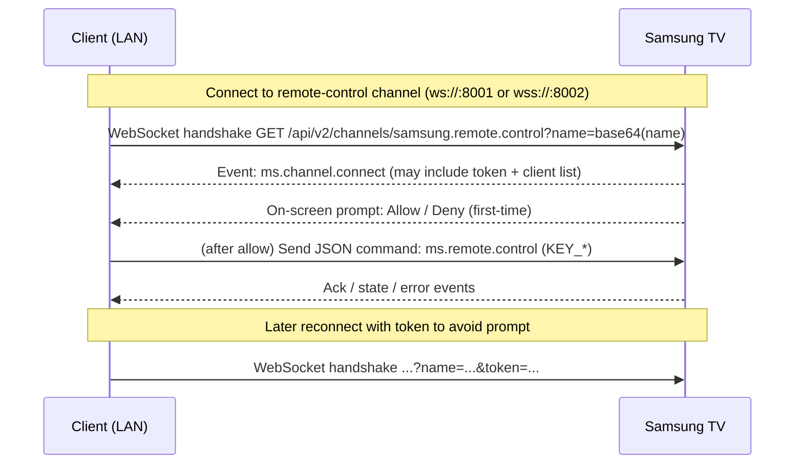
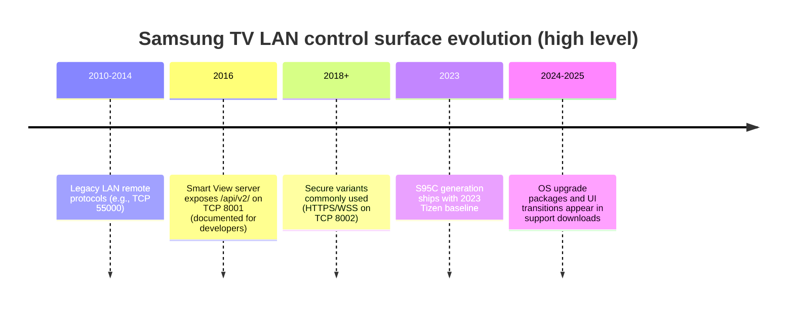

# Samsung Smart TV TCP/IP API Surface with Focus on S95C

## Executive summary

Modern Samsung smart TVs expose multiple *local-network* control and discovery surfaces that fall into a few recurring "API families": (a) a Smart View / "TV server" HTTP interface (commonly on TCP 8001) with a corresponding HTTPS interface (TCP 8002), (b) a WebSocket remote-control channel (typically under `/api/v2/channels/samsung.remote.control`), (c) UPnP/DLNA (SSDP discovery + SOAP control, often on UDP 1900 plus one or more TCP ports), (d) optional DIAL (Discovery And Launch) semantics built on SSDP + HTTP, and (e) mDNS/DNS-SD for ecosystems like AirPlay that rely on Bonjour. <sup>1</sup>

For the 2023 Samsung S95C, *model-specific* public documentation about the exact LAN port map is limited; the most defensible position is that S95C is in the "modern Tizen" family (2016+ lineage) and therefore is **very likely** to expose the Smart View `/api/v2/` endpoint and WebSocket remote channel when relevant settings permit, but the presence/behavior of additional ports (e.g., ancillary HTTP on 8080, specific UPnP services) can vary by firmware, region, and feature set. <sup>2</sup>

Authentication differs sharply by family and era: legacy TVs used a proprietary remote-control service (documented by researchers as being on TCP 55000) with an on-TV access prompt and protocol-level authentication weaknesses; modern TVs use a token-based approval model for the WebSocket remote control channel (user accepts on the TV, then the client reuses a token to avoid repeated prompts). Development tooling introduces another high-impact control plane (Smart Development Bridge, "sdb") that uses TCP 26101 by default and is gated by "Developer Mode" configuration on the TV. <sup>3</sup>

From an engineering standpoint, you should treat all *LAN control endpoints* as **unstable**: firmware updates have historically changed WebSocket behavior ("invalid opcode" / compatibility breaks), and even within a given year the routable endpoints for app launching can differ (e.g., `/api/v2/applications/<id>` vs `/ws/apps/<name>`). <sup>4</sup>

## Endpoint and port inventory

### Scope notes for S95C

Samsung's official Smart TV developer documentation describes the Smart View SDK "TV server" debug surface and explicitly calls out `http://TV_IP:8001/api/v2/` and `http://TV_IP:8001/logs/` (after enabling development mode). That documentation is not S95C-specific, but it is the closest *official* statement of a LAN endpoint family that plausibly applies to most modern Samsung TVs including S95C. <sup>5</sup>

Where S95C-specific data is unavailable (e.g., definitive port scans for S95C across current firmware), this report marks items as **general** or **observed on other models** and suggests discovery techniques that work without assuming fixed endpoints.

### High-confidence endpoints and mechanisms (modern Tizen family)

**Smart View "TV server" HTTP interface (general; modern Tizen TVs)**
The Smart View SDK debugging guide states that TV information can be retrieved by browsing to `http://TV_IP:8001/api/v2/` on the same network. It also notes that `http://TV_IP:8001/logs/` can be used to capture messages once development mode is enabled. <sup>6</sup>

**Smart View service URI format (general; confirmed in Samsung Smart View sample material)**
Samsung's own Smart View SDK example material shows discovered services as `uri=http://<tv-ip>:8001/api/v2/` and uses SDK calls that map to application management and device information retrieval. <sup>7</sup>

**HTTPS variant on TCP 8002 (general; observed and described by security research)**
Security research on a Samsung Q60R notes that TCP 8002 is essentially the HTTPS variant of the HTTP endpoint served on TCP 8001. <sup>8</sup>

### WebSocket remote control channel family

While Samsung's official Smart View debugging page does not document the remote-control WebSocket channel by name, the ecosystem of integrations and reverse-engineering has converged on a common endpoint pattern on modern TVs:

- `ws://<tv-ip>:8001/api/v2/channels/samsung.remote.control?name=<base64>`
- `wss://<tv-ip>:8002/api/v2/channels/samsung.remote.control?name=<base64>`

The "name" parameter is typically base64. Community reverse-engineering discussions explicitly show the base64-encoded `name=` usage and the `channels/samsung.remote.control` path. <sup>9</sup>

### UPnP/DLNA surface (SSDP + SOAP)

Security research enumerating a Samsung Q60R reports multiple UPnP services and identifies three TCP ports labeled as UPnP-related by scanning: 7678 ("nservice"), 9119 ("screen_sharing"), and 9197 ("dmr"). The same research ties "dmr" to DLNA Digital Media Renderer concepts and underscores that SSDP discovery occurs via multicast traffic to 239.255.255.250:1900. <sup>8</sup>

Because UPnP service *paths* (device description URL, control URL, event subscriptions) are discoverable from the device's UPnP metadata, the most robust approach is not to assume fixed control URLs; instead, discover them at runtime via SSDP responses and the device description XML. <sup>8</sup>

### DIAL discovery and launch

The DIAL project defines a discovery-and-launch model built on SSDP and HTTP. The DIAL project materials emphasize that DIAL is only discovery and launch and does **not** define a protocol for subsequent app-to-app communication, and the FAQ explicitly addresses that pairing/authentication is not part of its scope. <sup>10</sup>

In practice, whether a given Samsung TV firmware exposes a distinct DIAL REST surface (e.g., `/apps/<AppName>`) versus a Samsung-specific "launch app" endpoint (e.g., `/ws/apps/<name>`) varies; community reports for Samsung TVs cite both `/api/v2/applications/<appId>` and `/ws/apps/<appName>` patterns for launching apps. <sup>11</sup>

### mDNS/DNS-SD (Bonjour)

Multicast DNS (mDNS) is standardized in RFC 6762 and uses UDP port 5353 and link-local multicast addressing (IPv4 224.0.0.251; IPv6 FF02::FB). <sup>12</sup>

Bonjour-based ecosystems (notably AirPlay) advertise service types such as `_airplay._tcp` and `_raop._tcp`. Third-party AirPlay receiver documentation explicitly notes that AirPlay uses Bonjour for advertisement and lists these service types. Separately, Cisco's Bonjour documentation includes built-in service PTR examples such as `_airplay._tcp.local`. <sup>13</sup>

Samsung's own support content confirms that many Samsung TVs are AirPlay-compatible (feature availability depends on model/region), but does not enumerate the underlying mDNS details. <sup>14</sup>

### Samsung development/debug control plane (SDB)

Two official documents anchor the SDB story:

- Tizen Studio's Smart Development Bridge ("sdb") supports `connect <host>[:<port>]` and uses TCP port **26101 by default** if no port is specified. <sup>15</sup>
- Samsung's TV device setup documentation notes that port **26101 is an internal device port and cannot be opened separately**, and also describes the on-TV Developer Mode enabling flow (including entering "12345" in the Apps panel). <sup>16</sup>

These documents are not S95C-specific but are directly applicable to modern Samsung TV development workflows and therefore matter for the LAN attack/control surface.

### Consolidated "known ports" table

The table below summarizes endpoints that are documented by Samsung, standardized by protocol specs, or observed in reputable security research; "S95C applicability" is necessarily probabilistic unless you validate against a specific S95C firmware build.

| Family | Transport | Port(s) | Discovery | Representative endpoints | Auth pattern | S95C applicability |
|---|---|---:|---|---|---|---|
| Smart View TV server | HTTP | 8001 | Manual or via LAN scan; sometimes surfaced by Smart View SDK discovery | `/api/v2/`, `/logs/` | Dev mode required for some debug surfaces; behavior may vary | Likely (modern Tizen family) <sup>1</sup> <sup>7</sup> |
| Smart View TV server | HTTPS | 8002 | Same as above | same paths over TLS | TLS; cert trust varies by client | Likely (modern Tizen); confirmed on Q60R <sup>8</sup> |
| Remote control | WebSocket | 8001 / 8002 | Typically built on known path | `/api/v2/channels/samsung.remote.control` | On-TV approval → token reuse | Likely (modern Tizen), but firmware-dependent <sup>18</sup> |
| UPnP/DLNA | SSDP (UDP) | 1900 | Multicast M-SEARCH | N/A | Usually none at SSDP layer | Likely (common across smart TVs); observed on Samsung Q60R <sup>8</sup> |
| UPnP/DLNA services | HTTP + SOAP | varies (e.g., 7678/9119/9197 observed) | SSDP + device description | service control URLs in XML | varies by service; often none | Possible; varies by model/firmware <sup>8</sup> |
| DIAL | SSDP + HTTP | UDP 1900 + HTTP port (device-specific) | SSDP search target `urn:dial-multiscreen-org:service:dial:1` | typically `/apps/<AppName>` in DIAL model | No pairing in core spec | Unknown on S95C; depends on firmware/app stack <sup>19</sup> |
| mDNS / DNS-SD | UDP | 5353 | Multicast DNS queries | PTR/SRV/TXT records; e.g. `_airplay._tcp` | Ecosystem-specific (AirPlay pairing/ACL, etc.) | Likely where AirPlay enabled <sup>20</sup> |
| SDB (dev) | TCP | 26101 | Manual | sdb protocol | gated by Developer Mode config | Present when dev features enabled; high-risk <sup>21</sup> |
| Legacy remote | TCP | 55000 | Manual or scan | proprietary | on-TV prompt; protocol weaknesses reported | Not typical on modern (2016+) TVs; legacy sets <sup>22</sup> |

## Authentication and security model

### Modern WebSocket remote control: approval + token reuse

The dominant model for modern Samsung TV remote control over LAN is:

1. Client connects to a known WebSocket URL (often on 8001 or 8002). <sup>23</sup>
2. TV displays an "Allow/Deny" prompt (or relies on a device-connection-manager setting) and, upon approval, supplies an authorization token that can be reused to prevent repeated prompts. <sup>24</sup>
3. Subsequent connections include `token=<token>` in the query string to skip prompts. <sup>25</sup>

A concrete symptom of missing/invalid authorization is the `ms.channel.unauthorized` error reported by clients attempting to use the channel without appropriate approval/token state. <sup>26</sup>

Mermaid flow for tokenized WebSocket control:



The "connect" event structure is visible in debug logs from real integrations; one captured response shows `event:"ms.channel.connect"` and a `data.clients` array with per-client attributes. <sup>27</sup>

### Developer mode and sdb: distinct trust boundary

Developer tooling introduces a *separate* authentication/trust model:

- Samsung's TV device guide explicitly instructs you to enable Developer Mode by navigating to the Apps panel and entering "12345", then setting Developer Mode "On" and configuring an IP address for the development PC. <sup>16</sup>
- Tizen's sdb documentation states that `sdb connect <host>[:<port>]` defaults to port 26101. <sup>15</sup>

From a security perspective, this is a materially different posture than "remote control over WebSocket," because sdb is designed for application deployment/debugging and has historically been a high-value target in smart TV security research. <sup>28</sup>

### Legacy remote protocol (pre-modern era)

A Virus Bulletin 2014 paper describes a remote control service on TCP 55000, notes that its protocol is undocumented, and explains that it enables remote-controller key presses over the network. It also calls out a design weakness in the authentication process and includes packet-level discussion. <sup>29</sup>

While modern TVs (2016+ family) primarily use the WebSocket model, the existence of the legacy protocol matters if you are building a "universal" controller library that spans multiple model years. <sup>30</sup>

### Firmware variability in auth behavior

Even within the modern WebSocket family, firmware updates have historically changed the WebSocket protocol enough to break third-party implementations. A prominent example is a samsungctl issue reporting that a firmware update (1250) changed behavior and led to "Invalid opcode" errors, suggesting a protocol change or strictness increase. <sup>31</sup>

Samsung's own support download listings for S95C-class products show firmware artifacts with explicit version numbers (e.g., "Upgrade File(USB type),MAIN" with version `2000.2`, and a separate "OS Upgrade file(USB type)" with version `0080-2024.0`), reinforcing that "firmware/OS upgrade" is a major moving part for behavior. <sup>32</sup>

## Protocol details, formats, and error semantics

### Smart View TV server: HTTP resources and behavior

**Documented endpoints (official Samsung docs)**
Samsung's Smart View SDK debugging page documents:

- `GET http://TV_IP:8001/api/v2/` (TV information)
- `GET http://TV_IP:8001/logs/` (server logging, after enabling development mode) <sup>6</sup>

The same document cautions that 404/500 responses may indicate the Smart View server is not working and suggests rebooting. <sup>6</sup>

**Representative curl trace**

```bash
# TV information (Smart View server)
curl -v http://TV_IP:8001/api/v2/

# Server logs (requires dev mode per Samsung docs)
curl -v http://TV_IP:8001/logs/
```

The semantics of the JSON payload returned by `/api/v2/` are not fully specified in Samsung's public doc; treat it as an introspection endpoint whose fields can change, and parse defensively (unknown fields allowed).

### WebSocket remote channel: JSON message schema

A commonly used command schema for keypress emulation looks like:

```json
{
  "method": "ms.remote.control",
  "params": {
    "Cmd": "Click",
    "DataOfCmd": "KEY_VOLUP",
    "Option": "false",
    "TypeOfRemote": "SendRemoteKey"
  }
}
```

This structure is shown in community discussions and troubleshooting threads, and aligns with what many open-source integrations send. <sup>33</sup>

**Error events**
Observed error patterns include:

- `ms.channel.unauthorized` when authorization/token state is invalid or approval was not granted. <sup>26</sup>
- `ms.error` events with messages like "unrecognized method value : ms.remote.control" when clients send unsupported method names or connect to an endpoint/version mismatch. <sup>34</sup>

These errors are not formally specified in Samsung's public docs; you must design your client to handle unknown events and surface them for diagnostics.

### App launching: two observed HTTP patterns

Community reverse-engineering highlights at least two patterns that may work depending on app/firmware:

- `POST http://TV_IP:8001/api/v2/applications/<APP_ID>` <sup>35</sup>
- `POST http://TV_IP:8001/ws/apps/<APP_ID or APP_NAME>` (some report a `/ws/apps/` launcher path) <sup>35</sup>

Example curl commands (representative):

```bash
# Pattern A (app ID)
curl -v -X POST "http://TV_IP:8001/api/v2/applications/MCmYXNxgcu.DisneyPlus"

# Pattern B (app name)
curl -v -X POST "http://TV_IP:8001/ws/apps/Netflix"
```

Because these patterns are not described in official Samsung docs, treat them as best-effort fallbacks and always validate on the target firmware.

### Smart View SDK application management: error codes

Samsung's Smart View SDK sample material shows explicit handling of a 404 error code as "application not installed," followed by an installation flow that brings up an installation page on the TV (requiring user confirmation). <sup>7</sup>

This illustrates an important boundary: even where a LAN API triggers an install flow, the user may still be required to confirm actions on the TV UI.

### SSDP/UPnP discovery: wire format

Security research on Samsung smart TVs describes issuing an SSDP "M-Search" request to multicast address 239.255.255.250 on UDP port 1900 to discover UPnP devices. <sup>8</sup>

Representative SSDP request (for general UPnP discovery):

```text
M-SEARCH * HTTP/1.1
HOST: 239.255.255.250:1900
MAN: "ssdp:discover"
MX: 1
ST: ssdp:all
```

The same mechanism applies when using DIAL's SSDP search target (`urn:dial-multiscreen-org:service:dial:1`) per the DIAL project's protocol materials; DIAL rides on SSDP + HTTP. <sup>36</sup>

### mDNS/DNS-SD: addressing and typical AirPlay service types

RFC 6762 specifies that mDNS uses UDP port 5353 and link-local multicast addressing (224.0.0.251 for IPv4), and describes query/response behavior on that port. <sup>12</sup>

AirPlay discovery is commonly described as using Bonjour/mDNS and advertising `_airplay._tcp` and `_raop._tcp` service types; third-party AirPlay receiver vendor documentation lists these records explicitly, and Cisco's Bonjour policy documentation references `_airplay._tcp.local` as a built-in Bonjour service PTR. <sup>13</sup>

## Rust async code examples for discovery, auth, and control

The code below emphasizes: async/await (`tokio`), defensive parsing, explicit timeouts, and TLS knobs appropriate for *LAN devices that often present self-signed certificates*.

### Dependencies

```toml
# Cargo.toml
[package]
name = "samsung_tv_lan"
version = "0.1.0"
edition = "2021"

[dependencies]
tokio = { version = "1.37", features = ["full"] }
reqwest = { version = "0.12", features = ["json", "rustls-tls"] }
tokio-tungstenite = { version = "0.21", features = ["rustls-tls-webpki-roots"] }
tungstenite = "0.21"
serde = { version = "1.0", features = ["derive"] }
serde_json = "1.0"
thiserror = "1.0"
base64 = "0.22"
url = "2.5"
quick-xml = { version = "0.31", features = ["serialize"] }
```

### Shared error type

```rust
use thiserror::Error;

#[derive(Debug, Error)]
pub enum TvError {
    #[error("http error: {0}")]
    Http(#[from] reqwest::Error),

    #[error("websocket error: {0}")]
    Ws(#[from] tungstenite::Error),

    #[error("url parse error: {0}")]
    Url(#[from] url::ParseError),

    #[error("io error: {0}")]
    Io(#[from] std::io::Error),

    #[error("timeout")]
    Timeout,

    #[error("unexpected response: {0}")]
    Unexpected(String),
}
```

### SSDP discovery (UPnP and DIAL)

```rust
use tokio::{net::UdpSocket, time::{timeout, Duration}};
use std::net::{SocketAddrV4, Ipv4Addr};

#[derive(Debug, Clone)]
pub struct SsdpHit {
    pub from: std::net::SocketAddr,
    pub st: Option<String>,
    pub usn: Option<String>,
    pub location: Option<String>,
    pub server: Option<String>,
    pub raw: String,
}

fn parse_ssdp_response(resp: &str, from: std::net::SocketAddr) -> SsdpHit {
    let mut st = None;
    let mut usn = None;
    let mut location = None;
    let mut server = None;

    for line in resp.lines() {
        let (k, v) = match line.split_once(':') {
            Some((k, v)) => (k.trim().to_ascii_lowercase(), v.trim().to_string()),
            None => continue,
        };
        match k.as_str() {
            "st" => st = Some(v),
            "usn" => usn = Some(v),
            "location" => location = Some(v),
            "server" => server = Some(v),
            _ => {}
        }
    }

    SsdpHit { from, st, usn, location, server, raw: resp.to_string() }
}

/// Discover devices via SSDP M-SEARCH.
/// - `st` examples:
///   - "ssdp:all"
///   - "urn:schemas-upnp-org:device:MediaRenderer:1"
///   - "urn:dial-multiscreen-org:service:dial:1"
pub async fn ssdp_discover(st: &str, mx_secs: u8, listen_ms: u64) -> Result<Vec<SsdpHit>, TvError> {
    let bind_addr = SocketAddrV4::new(Ipv4Addr::UNSPECIFIED, 0);
    let socket = UdpSocket::bind(bind_addr).await?;

    let mcast = SocketAddrV4::new(Ipv4Addr::new(239, 255, 255, 250), 1900);

    let req = format!(
        "M-SEARCH * HTTP/1.1\r\n\
         HOST: 239.255.255.250:1900\r\n\
         MAN: \"ssdp:discover\"\r\n\
         MX: {mx}\r\n\
         ST: {st}\r\n\
         \r\n",
        mx = mx_secs,
        st = st
    );

    socket.send_to(req.as_bytes(), mcast).await?;

    let mut hits = Vec::new();
    let mut buf = vec![0u8; 8192];

    let deadline = Duration::from_millis(listen_ms);
    let start = tokio::time::Instant::now();

    loop {
        let remaining = deadline.checked_sub(start.elapsed()).unwrap_or(Duration::from_secs(0));
        if remaining.is_zero() { break; }

        match timeout(remaining, socket.recv_from(&mut buf)).await {
            Ok(Ok((n, from))) => {
                let text = String::from_utf8_lossy(&buf[..n]).to_string();
                if text.starts_with("HTTP/1.1 200") {
                    hits.push(parse_ssdp_response(&text, from));
                }
            }
            Ok(Err(e)) => return Err(TvError::Io(e)),
            Err(_) => break,
        }
    }

    Ok(hits)
}
```

### Smart View `/api/v2/` system info

```rust
use serde_json::Value;

pub async fn smartview_device_info(ip: &str, timeout_secs: u64) -> Result<Value, TvError> {
    let url = format!("http://{ip}:8001/api/v2/", ip = ip);

    let client = reqwest::Client::builder()
        .timeout(std::time::Duration::from_secs(timeout_secs))
        .build()?;

    let v: Value = client.get(url).send().await?.error_for_status()?.json().await?;
    Ok(v)
}
```

### WebSocket remote control: connect + send key

This example supports both ws:// and wss://. Many TVs present non-public/embedded TLS certificates; for development you may need to disable certificate validation. **Do not ship "accept invalid certs" in production**—prefer trust-on-first-use (TOFU) pinning of the TV certificate fingerprint.

```rust
use base64::{engine::general_purpose::STANDARD as B64, Engine as _};
use futures_util::{SinkExt, StreamExt};
use serde_json::json;
use tokio_tungstenite::{connect_async, tungstenite::Message};
use url::Url;

pub struct RemoteWs {
    pub ws_url: Url,
    stream: tokio_tungstenite::WebSocketStream<tokio_tungstenite::MaybeTlsStream<tokio::net::TcpStream>>,
}

impl RemoteWs {
    /// `secure=true` => wss://IP:8002/, otherwise ws://IP:8001/
    pub async fn connect(ip: &str, client_name: &str, token: Option<&str>, secure: bool) -> Result<Self, TvError> {
        let name_b64 = B64.encode(client_name.as_bytes());

        let scheme = if secure { "wss" } else { "ws" };
        let port = if secure { 8002 } else { 8001 };

        let mut url = Url::parse(&format!(
            "{scheme}://{ip}:{port}/api/v2/channels/samsung.remote.control?name={name}",
            scheme = scheme,
            ip = ip,
            port = port,
            name = urlencoding::encode(&name_b64),
        ))?;

        if let Some(t) = token {
            url.query_pairs_mut().append_pair("token", t);
        }

        let (stream, _resp) = connect_async(url.clone()).await?;
        Ok(Self { ws_url: url, stream })
    }

    pub async fn read_until_connect(&mut self, max_wait_secs: u64) -> Result<Option<String>, TvError> {
        let deadline = tokio::time::Instant::now() + Duration::from_secs(max_wait_secs);

        while tokio::time::Instant::now() < deadline {
            if let Some(msg) = self.stream.next().await {
                let msg = msg?;
                if let Message::Text(txt) = msg {
                    // Many TVs emit an ms.channel.connect event; token may appear in payload.
                    if txt.contains("\"ms.channel.connect\"") || txt.contains("\"event\":\"ms.channel.connect\"") {
                        return Ok(Some(txt));
                    }
                }
            }
        }
        Ok(None)
    }

    pub async fn send_key(&mut self, key: &str) -> Result<(), TvError> {
        let payload = json!({
            "method": "ms.remote.control",
            "params": {
                "Cmd": "Click",
                "DataOfCmd": key,
                "Option": "false",
                "TypeOfRemote": "SendRemoteKey"
            }
        });

        self.stream.send(Message::Text(payload.to_string())).await?;
        Ok(())
    }
}
```

### App launch helper: try `/api/v2/applications` then fallback to `/ws/apps`

```rust
pub async fn launch_app(ip: &str, app_id_or_name: &str) -> Result<(), TvError> {
    let client = reqwest::Client::builder()
        .timeout(std::time::Duration::from_secs(3))
        .build()?;

    // Pattern A: /api/v2/applications/<id>
    let url_a = format!("http://{ip}:8001/api/v2/applications/{app}", ip = ip, app = app_id_or_name);
    let resp_a = client.post(&url_a).send().await;

    if let Ok(r) = resp_a {
        if r.status().is_success() {
            return Ok(());
        }
        // Some TVs respond 404 or 405; fall through.
    }

    // Pattern B: /ws/apps/<name>
    let url_b = format!("http://{ip}:8001/ws/apps/{app}", ip = ip, app = app_id_or_name);
    let r = client.post(&url_b).send().await?.error_for_status()?;
    let _ = r.bytes().await?; // drain
    Ok(())
}
```

### DLNA/UPnP media playback: generic SOAP call pattern

Because control URLs are discovered from the device description, the code below assumes you have already discovered `control_url` and `service_type` (e.g., `urn:schemas-upnp-org:service:AVTransport:1`) from UPnP.

```rust
#[derive(Debug, Clone)]
pub struct UpnpService {
    pub control_url: String,
    pub service_type: String,
}

/// Minimal SOAP envelope builder for UPnP actions.
fn soap_envelope(service_type: &str, action: &str, inner_xml: &str) -> String {
    format!(
        r#"<?xml version="1.0" encoding="utf-8"?>
<s:Envelope xmlns:s="http://schemas.xmlsoap.org/soap/envelope/"
            s:encodingStyle="http://schemas.xmlsoap.org/soap/encoding/">
  <s:Body>
    <u:{action} xmlns:u="{st}">
      {inner}
    </u:{action}>
  </s:Body>
</s:Envelope>"#,
        action = action,
        st = service_type,
        inner = inner_xml
    )
}

pub async fn upnp_soap_action(svc: &UpnpService, action: &str, inner_xml: &str) -> Result<String, TvError> {
    let body = soap_envelope(&svc.service_type, action, inner_xml);

    // SOAPAction header format is standardized for UPnP services.
    let soap_action = format!("\"{}#{}\"", svc.service_type, action);

    let client = reqwest::Client::builder()
        .timeout(std::time::Duration::from_secs(5))
        .build()?;

    let resp = client
        .post(&svc.control_url)
        .header("Content-Type", "text/xml; charset=\"utf-8\"")
        .header("SOAPAction", soap_action)
        .body(body)
        .send()
        .await?
        .error_for_status()?
        .text()
        .await?;

    Ok(resp)
}
```

## Firmware and model variability, limitations, and mitigations

### Practical variability map

A defensible way to think about Samsung TV LAN APIs is by *generational strata* rather than by marketing model name:

- **Legacy remote era**: Proprietary remote-control service on TCP 55000, with protocol weaknesses discussed in 2014 security literature. <sup>22</sup>
- **Modern Tizen era (2016+)**: Smart View server at `:8001/api/v2/` and related debug surfaces, plus WebSocket remote control on `:8001` / `:8002` with tokenized approval. <sup>37</sup>
- **Modern firmware churn**: WebSocket behavior can change after updates, breaking unofficial clients. <sup>31</sup>
- **2023+ OS upgrades and UI transitions**: Public reporting indicates 2023 TVs run a 2023 Tizen baseline and later received One UI/Tizen updates; Samsung support listings show discrete "Upgrade File" versions and separate "OS Upgrade" packages. <sup>38</sup>

Mermaid timeline (conceptual; validate on target firmware):



### Known limitations

DIAL's scope is discovery and launch only; it explicitly does not provide a generic channel for deeper interaction after the first-screen app is launched. <sup>19</sup>

mDNS/Bonjour discovery is link-local by design; enterprise networks often require an mDNS gateway/reflector to span VLANs, and documentation from major network vendors describes this limitation. <sup>39</sup>

Some Smart View debugging facilities require Developer Mode to be enabled on the TV; Samsung's debugging guide labels this requirement explicitly. <sup>5</sup>

### Security mitigations and hardening recommendations

Because these services can become an unintended control plane, treat them like you would treat any "local admin interface":

- **Disable Developer Mode and avoid exposing sdb**: Developer Mode is a prerequisite for routine SDK workflows; leaving it enabled unnecessarily increases attack surface. Samsung's own guidance frames Developer Mode as a deliberate configuration step and notes that port 26101 is an internal device port used for development connectivity. <sup>28</sup>
- **Segment the TV into an IoT VLAN and restrict east-west access**: SSDP (UDP 1900) and mDNS (UDP 5353) are multicast heavy; if you must allow them, scope them narrowly and consider an mDNS gateway rather than flat L2. <sup>40</sup>
- **Lock down LAN control services when not needed**: If you do not use Smart View / remote-control integrations, firewalling TCP 8001/8002 and other observed service ports (UPnP-related ports vary by model) is a reasonable mitigation, recognizing that it may break casting/phone integration features. Evidence from security research shows that multiple UPnP services can be exposed on non-obvious ports and should be included in your threat model. <sup>8</sup>
- **Pin trust when using WSS**: For production tools, prefer certificate fingerprint pinning (TOFU) rather than disabling TLS verification, because TVs often use self-signed or device-local certificates on 8002. (Public Samsung docs confirm HTTPS is present, but do not specify cert strategy.) <sup>41</sup>
- **Expect breakage across firmware**: Maintain protocol feature detection (e.g., test `/api/v2/` availability; attempt ws then wss; retry with/without token) and provide user instructions for re-approving the controller on the TV when tokens are invalidated. Firmware-driven incompatibilities are documented in the field. <sup>42</sup>

### Comparative matrix across model eras and firmware

| Dimension | Legacy TVs (pre-modern) | Modern Tizen (2016+) | 2018+ typical secure usage | 2023 S95C family (best-effort) |
|---|---|---|---|---|
| Primary control channel | TCP 55000 proprietary | WebSocket remote channel under `/api/v2/channels/...` | WSS on 8002 increasingly preferred | Likely WebSocket + Smart View `/api/v2/` |
| Auth experience | On-TV approval; protocol weaknesses reported | On-TV approval → token reuse (`token=` query) | Same, with TLS | Same, firmware-dependent |
| App launch endpoints | Varies | `/api/v2/applications/<id>` and/or `/ws/apps/<name>` observed | Same | Same; validate per firmware |
| Discovery | UPnP common | UPnP + (sometimes) Smart View discovery + mDNS for ecosystems | UPnP + mDNS | UPnP + mDNS (AirPlay if enabled) |
| Key risk | Unofficial protocol & weak auth | Token management, exposure of debug surfaces | TLS trust and cert handling | Firmware/OS upgrade churn; endpoint changes |
| Representative sources | <sup>22</sup> | <sup>43</sup> | <sup>41</sup> | <sup>44</sup> |

## Source provenance and prioritization notes

The most authoritative sources for the **Smart View / developer-facing LAN endpoints** are Samsung's own developer documentation (Smart View SDK debugging; TV device/developer mode guidance). <sup>5</sup>

For **port-level network enumeration and non-documented services**, reputable security research provides higher confidence than casual forum posts; the WithSecure Labs analysis is particularly valuable because it ties observed ports to UPnP services and to Samsung's own developer documentation. <sup>45</sup>

For **standards-based discovery layers**, this report relies on primary protocol specifications (RFC 6762 for mDNS) and vendor networking documentation for Bonjour scaling constraints. <sup>46</sup>

For **WebSocket remote-control message formats and app-launch endpoints**, the overall picture is necessarily informed by reverse-engineering and integration ecosystems; those details are widely corroborated but not comprehensively documented by Samsung publicly, and should be validated empirically against the specific S95C firmware you target. <sup>47</sup>

## References

1. Samsung Smart View SDK — Receiver Apps Debugging: https://developer.samsung.com/smarttv/develop/extension-libraries/smart-view-sdk/receiver-apps/debugging.html
2. Rtings — Samsung S95C OLED Review: https://www.rtings.com/tv/reviews/samsung/s95c-oled
3. Virus Bulletin 2014 — Smart Home Appliance Security and Malware: https://www.virusbulletin.com/virusbulletin/2014/12/paper-smart-home-appliance-security-and-malware
4. samsungctl GitHub Issue #93: https://github.com/Ape/samsungctl/issues/93
5. Samsung Smart View SDK — Receiver Apps Debugging: https://developer.samsung.com/smarttv/develop/extension-libraries/smart-view-sdk/receiver-apps/debugging.html
6. Samsung Smart View SDK — Receiver Apps Debugging: https://developer.samsung.com/smarttv/develop/extension-libraries/smart-view-sdk/receiver-apps/debugging.html
7. Samsung DForum — SmartViewSDK HowTo Article (How to get information data): https://raw.githubusercontent.com/SamsungDForum/SmartViewSDK-HowTo-Article/master/How%20to%20get%20infomation%20data/README.md
8. WithSecure Labs — Opening Up the Samsung Q60 Series Smart TV: https://labs.withsecure.com/publications/samsung-q60r-smart-tv-opening-up-the-samsung-q60-series-smart-tv
9. SamyGO Forum — Samsung TV WebSocket/API discussion (topic 12384): https://forum.samygo.tv/viewtopic.php?t=12384
10. DIAL (Discovery And Launch) — Official Site: https://www.dial-multiscreen.org/
11. SmartThings Community — Samsung Smart TV Control with SmartThings webCoRE: https://community.smartthings.com/t/samsung-smart-tv-control-with-smartthings-webcore/166506/12
12. RFC 6762 — Multicast DNS: https://www.rfc-editor.org/rfc/rfc6762.html
13. AirServer Support — How can I verify if AirPlay is correctly advertised on the network: https://support.airserver.com/support/solutions/articles/43000610850-how-can-i-verify-if-airplay-is-correctly-advertised-on-the-network-
14. Samsung Support — AirPlay Troubleshoot (TSG10000917): https://www.samsung.com/us/support/troubleshoot/TSG10000917/
15. Tizen Docs — Smart Development Bridge: https://docs.tizen.org/application/tizen-studio/common-tools/smart-development-bridge/
16. Samsung Developer — Getting Started / Using SDK / TV Device: https://developer.samsung.com/smarttv/develop/getting-started/using-sdk/tv-device.html
17. Samsung Smart View SDK — Receiver Apps Debugging: https://developer.samsung.com/smarttv/develop/extension-libraries/smart-view-sdk/receiver-apps/debugging.html
18. Hubitat Community — Samsung TV Integration Question (Driver Info, page 4): https://community.hubitat.com/t/samsung-tv-integration-question-driver-info-starting-post-127/8341?page=4
19. DIAL — FAQ: https://www.dial-multiscreen.org/dial/faq
20. RFC 6762 — Multicast DNS: https://www.rfc-editor.org/rfc/rfc6762.html
21. Tizen Docs — Smart Development Bridge: https://docs.tizen.org/application/tizen-studio/common-tools/smart-development-bridge/
22. Virus Bulletin 2014 — Smart Home Appliance Security and Malware: https://www.virusbulletin.com/virusbulletin/2014/12/paper-smart-home-appliance-security-and-malware
23. SamyGO Forum — Samsung TV WebSocket/API discussion (topic 12384): https://forum.samygo.tv/viewtopic.php?t=12384
24. Hubitat Community — Samsung TV Integration Question (Driver Info, page 4): https://community.hubitat.com/t/samsung-tv-integration-question-driver-info-starting-post-127/8341?page=4
25. Hubitat Community — Samsung TV Integration Question (Driver Info, page 4): https://community.hubitat.com/t/samsung-tv-integration-question-driver-info-starting-post-127/8341?page=4
26. samsungctl GitHub Issue #139: https://github.com/Ape/samsungctl/issues/139
27. samsung-tv-ws-api GitHub Issue #130: https://github.com/xchwarze/samsung-tv-ws-api/issues/130
28. Samsung Developer — Getting Started / Using SDK / TV Device: https://developer.samsung.com/smarttv/develop/getting-started/using-sdk/tv-device.html
29. Virus Bulletin 2014 — Smart Home Appliance Security and Malware: https://www.virusbulletin.com/virusbulletin/2014/12/paper-smart-home-appliance-security-and-malware
30. samsungctl — GitHub Repository: https://github.com/Ape/samsungctl
31. samsungctl GitHub Issue #93: https://github.com/Ape/samsungctl/issues/93
32. Samsung Canada Support — Model QN65S95CAFXZC: https://www.samsung.com/ca/support/model/QN65S95CAFXZC/
33. Reddit r/crestron — Samsung TV via WebSockets API: https://www.reddit.com/r/crestron/comments/vx9ak4/samsung_tv_via_websockets_api/
34. Reddit r/crestron — Samsung TV via WebSockets API: https://www.reddit.com/r/crestron/comments/vx9ak4/samsung_tv_via_websockets_api/
35. SmartThings Community — Samsung Smart TV Control with SmartThings webCoRE: https://community.smartthings.com/t/samsung-smart-tv-control-with-smartthings-webcore/166506/12
36. DIAL — Sample Implementations: https://www.dial-multiscreen.org/dial-code/sample-implementations
37. Samsung Smart View SDK — Receiver Apps Debugging: https://developer.samsung.com/smarttv/develop/extension-libraries/smart-view-sdk/receiver-apps/debugging.html
38. Rtings — Samsung S95C OLED Review: https://www.rtings.com/tv/reviews/samsung/s95c-oled
39. Cisco — mDNS Gateway Configuration Guide: https://www.cisco.com/c/en/us/td/docs/wireless/controller/9800/17-13/config-guide/b_wl_17_13_cg/m_mdns_gateway.html
40. IETF Datatracker — RFC 6762 (Multicast DNS): https://datatracker.ietf.org/doc/html/rfc6762
41. WithSecure Labs — Opening Up the Samsung Q60 Series Smart TV: https://labs.withsecure.com/publications/samsung-q60r-smart-tv-opening-up-the-samsung-q60-series-smart-tv
42. Samsung Smart View SDK — Receiver Apps Debugging: https://developer.samsung.com/smarttv/develop/extension-libraries/smart-view-sdk/receiver-apps/debugging.html
43. Samsung Smart View SDK — Receiver Apps Debugging: https://developer.samsung.com/smarttv/develop/extension-libraries/smart-view-sdk/receiver-apps/debugging.html
44. Rtings — Samsung S95C OLED Review: https://www.rtings.com/tv/reviews/samsung/s95c-oled
45. WithSecure Labs — Opening Up the Samsung Q60 Series Smart TV: https://labs.withsecure.com/publications/samsung-q60r-smart-tv-opening-up-the-samsung-q60-series-smart-tv
46. IETF Datatracker — RFC 6762 (Multicast DNS): https://datatracker.ietf.org/doc/html/rfc6762
47. SamyGO Forum — Samsung TV WebSocket/API discussion (topic 12384): https://forum.samygo.tv/viewtopic.php?t=12384
