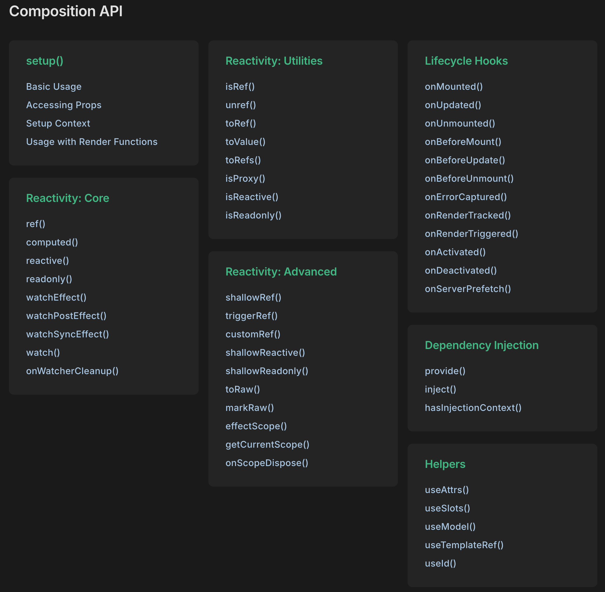

# Homelab Server's Frontend

The Homelab server exposes an endpoint at `/` which provides a nice but very simple UI for showing the current status of the configured devices we've setup. The plan is to continue to grow the number of devices we support and in order to make sure we have the ability to grow and develop the Frontend (aka, `GET /` route), we need to refactor this route as a VueJS single-page application.

## Tech Stack

- We will use VueJS to create a Single Page App (SPA)
- this app will use the latest version of VueJS and will use the composition API
- the styling will be done with [UnoCSS](https://unocss.dev/)
    - will support both a light and dark themes
- routing will be provided by [Vue Router](https://router.vuejs.org/) via the [Unplugin Vue Router](https://uvr.esm.is/)
- we will always consider the utilities in [Vue Use](https://vueuse.org/) library when solving new frontend problems
- if we need a robust frontend state management solution we will use [Pinia](https://pinia.vuejs.org/)
- all animations will use the [Motion](https://motion.dev/) library
    - [Example of a Loading Spinner](https://motion.dev/tutorials/vue-loading-circle-spinner) with VueJS
    - [Example of Scroll-Triggered Animations](https://motion.dev/examples/vue-scroll-triggered?platform=vue) with VueJS
- We will use the following VueJS unplugin libraries (all loaded as dev dependencies):
    - `unplugin-auto-import`
    - `unplugin-vue-components`
    - `unplugin-vue-macros`
    - `unplugin-vue-markdown`
- We will use `vite` for building the frontend
- We will use the following plugins to `vite`:
    - `vite-bundle-visualizer`
    - `vite-plugin-inspect`
    - `vite-plugin-pwa`
    - `vite-plugin-vue-devtools`
    - `vite-ssg`
    - `@vitejs/plugin-vue`
- Icons
    - When we want to use icons we will use iconify
        - to start we'll use the `@iconify-json/carbon` icon set but we can add others where appropriate
- Linting
    - instead of using eslint we will use eslint rules with [oxlint](https://oxc.rs/docs/guide/usage/linter.html)
- Testing
    - we will use Vitest for unit testing (including some use of browser mode)
    - we will supplement a few critical frontend integration tests with Playwright

## Composition API



- We will use the Composition API and _composables_ for business logic where possible.
- Script Setup and SFC:
    - We will use Single File Components (SFC) to define most pages in the SPA and we will use the newer `<script setup lang="ts"></script>` blocks instead of the `<script lang="ts"></script>` blocks.
- We will ALWAYS use **Typescript** over Javascript

## Reference Site

The starter template [Vitesse](https://github.com/antfu-collective/vitesse) is a great reference site for how to use many of these technologies. We do want a few clear variances:

- **oxlint** not eslint
- Different lint rules (see below)
- probably a few more things

Still it represents a good place to refer to if you want to get a starting config file or look at any design patterns which are used.

## Lint Rules

**oxlint.json**

```json
{
    "$schema": "./node_modules/oxlint/configuration_schema.json",
    "plugins": [
        "unicorn",
        "typescript",
        "import",
        "promise",
        "oxc"
    ],
    "rules": {
        "no-unused-vars": [
            "deny",
            {
                "varsIgnorePattern": "^_",
                "argsIgnorePattern": "^_"
            }
        ],
        "typescript/explicit-function-return-type": "off",
        "typescript/no-use-before-define": "warn",
        "typescript/ban-ts-comment": ["error", {
            "allow-with-description": true,
            "minimumDescriptionLength": 4
        }],
        "eslint/array-callback-return": "warn",
        "eslint/valid-typeof": "warn",
        "eslint/no-console": "off",
        "eslint/no-new": "off",
        "eslint/no-alert": "off",
        "eslint/no-case-declarations": "off",
        "eslint/no-irregular-whitespace": "warn",
        "import/no-self-import": "error",
        "unicorn/error-message": "warn"
    }
}
```
