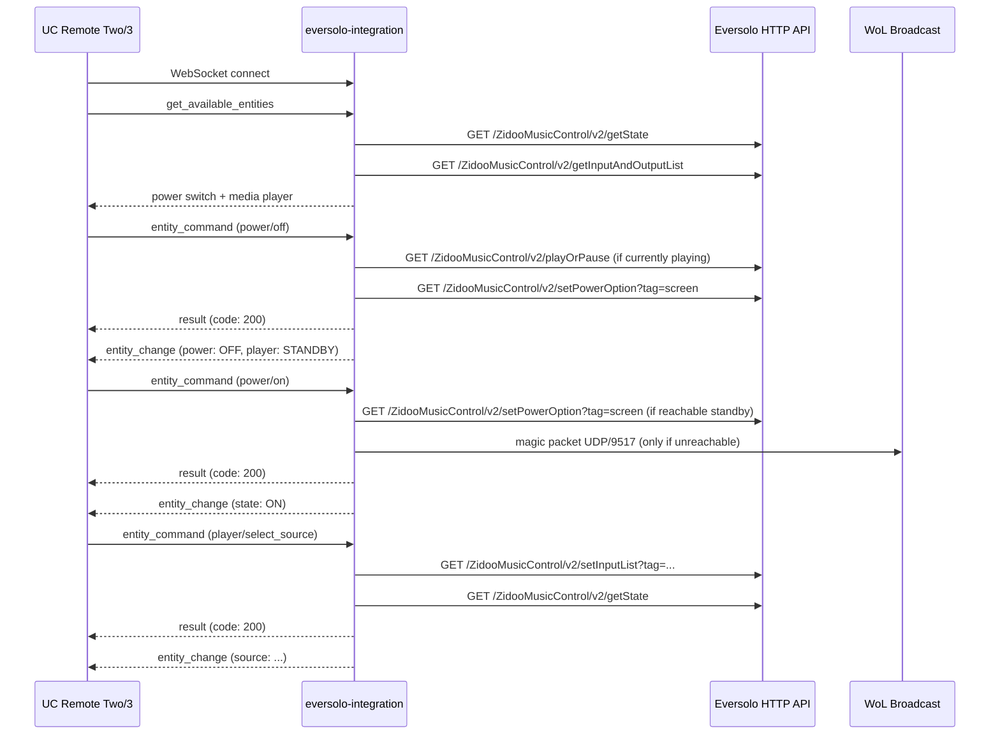

# eversolo-integration

Unfolded Circle integration driver for Eversolo streamers that expose the local HTTP API on port `9529` (DMP-A8 is the primary target).

## What It Does

This is a standalone WebSocket server that speaks the [Unfolded Circle Integration protocol](https://unfoldedcircle.github.io/core-api/integration/). When a UC Remote Two or Remote 3 connects, the driver exposes an Eversolo device as:

- a user-facing power switch where `off` enters effective standby and `on` wakes standby or falls back to Wake-on-LAN when the device is truly off
- a media player entity for playback, volume, mute, metadata, input selection, and effective standby detection

The integration also answers the configurator metadata flow (`get_driver_version` and `get_driver_metadata`) including `setup_data_schema`, so discovery or manual registration can lead directly into a Remote-driven setup flow. The schema follows the UC field contract (`dropdown` with `items`, item `id`, and selected `value`) and degrades to host/name entry when discovery has not found any candidates yet.

## Entity Model

| Entity ID | Type | Features | Commands |
|-----------|------|----------|----------|
| `eversolo.{name}.power` | switch | on_off | on, off, toggle |
| `eversolo.{name}.player` | media_player | volume, volume_up_down, mute, unmute, mute_toggle, play_pause, next, previous, select_source, media_duration, media_position, media_title, media_artist, media_album | volume_set, volume_up, volume_down, mute, unmute, mute_toggle, play_pause, next, previous, select_source |

The `{name}` comes from the configured device instance. `--device-name` is only a seed default and defaults to `streamer`.

### State Attributes

| Entity | Attributes |
|--------|------------|
| `power` | `state` = `ON`, `OFF`, or `UNKNOWN` |
| `player` | `state`, `volume`, `muted`, `source`, `media_position`, `media_duration`, `media_title`, `media_artist`, `media_album` |

The power switch is inferred as:

- `ON` while the streamer is reachable and active
- `OFF` while the streamer is in effective standby or truly unreachable

The player state is inferred as:

- `PLAYING` while media is actively playing
- `PAUSED` while paused with the display still on
- `STANDBY` when media is not actively playing and the front-panel display is off
- `ON` for other reachable idle states
- `OFF` when the device is unreachable

### Power Commands

- `power/off` pauses playback if needed and turns the front-panel screen off so the device enters effective standby instead of full shutdown
- `power/on` wakes effective standby with the Eversolo `screen` power option when the device is still reachable
- `power/on` falls back to Wake-on-LAN only when the streamer is no longer reachable over HTTP

### Source Selection

The media player's `select_source` command uses the current Eversolo input list returned by `getInputAndOutputList`. The integration advertises the human-readable input names in `source_list` and resolves the selected name back to the device tag at command time.

## Architecture



The integration follows the house pattern used by the Arcam and Sony drivers:

- `main.rs` parses CLI args, sets up tracing, and starts the WebSocket host
- `dispatch.rs` owns HTTP and WoL operations against the device
- `handler.rs` translates UC requests into domain operations
- `homelab/unfolded-integration-helper` owns shared UC envelope builders, keyed cache logic, subscriptions, and fixtures
- `types.rs` owns entity and command mapping

## Running as an External Integration

Run the integration on any machine that can reach both the UC Remote and the Eversolo device on your network.

```bash
# Build
cargo build -p eversolo-integration --release

# Run
UCR_INTEGRATION_TOKEN=my-secret \
eversolo-integration \
  --host 192.168.1.140 \
  --mac AA:BB:CC:DD:EE:FF \
  --device-name music
```

### CLI Options

| Flag | Default | Description |
|------|---------|-------------|
| `--listen` | `0.0.0.0:9092` | WebSocket listen address |
| `--host` | *(optional seed hint)* | Eversolo IP or hostname |
| `--port` | `9529` | Eversolo HTTP API port |
| `--device-name` | `streamer` | Name used in entity IDs |
| `--mac` | *(optional but recommended)* | Wired MAC used for Wake-on-LAN power on |
| `--wol-broadcast` | `255.255.255.255` | WoL broadcast address |
| `--wol-port` | `9517` | WoL UDP port |
| `--timeout` | `10` | HTTP operation timeout in seconds |
| `--poll-interval` | `5` | Background poll interval in seconds |
| `--mdns` | `false` | Advertise `_uc-integration._tcp.local.` for UC auto-discovery |

### Authentication

`schematic_schema::unfolded_circle_integration_ws::UnfoldedCircleIntegrationWsHost` only requires the `auth-token` WebSocket header when `UCR_INTEGRATION_TOKEN` is set. If that environment variable is unset, the driver accepts unauthenticated connections and immediately returns a successful `authentication` response to the Remote.

```bash
UCR_INTEGRATION_TOKEN=my-secret eversolo-integration --host 192.168.1.140
```

This is a repo-level optional runtime control, not an Eversolo protocol feature.

### Registering on the Remote

In the UC Web Configurator:

1. Go to **Integrations & Docks** > **+** > **Add external integration**
2. Enter the host and port where the driver is running, for example `192.168.1.50:9092`
3. If you set `UCR_INTEGRATION_TOKEN`, enter the same token on the Remote; otherwise leave auth unset
4. Save the integration, complete the setup flow, and let the Remote bind the discovered streamer entities to that Remote

### mDNS Auto-Discovery

If you start the driver with `--mdns`, it advertises itself via `_uc-integration._tcp.local.` so the UC configurator can discover it without manually entering host and port.

```bash
UCR_INTEGRATION_TOKEN=my-secret \
eversolo-integration \
  --host 192.168.1.140 \
  --mac AA:BB:CC:DD:EE:FF \
  --device-name music \
  --mdns
```

What to expect:

- mDNS makes the driver discoverable on the local subnet
- the configurator list view uses the mDNS TXT record for the visible integration name and developer, so the advertisement must publish a human-facing `name` and `developer`, not only the driver ID
- the configurator still opens the WebSocket connection and asks for `get_driver_metadata`
- the `setup_data_schema` inside `driver_metadata` must use the documented UC field shapes; invalid setup fields can surface as a `Resource not found` style configurator failure before any setup request is logged
- the setup flow can then validate a manual host or reuse discovered/known devices without restarting the process
- `setup_driver` and `set_driver_user_data` must be acknowledged before slow discovery or validation work begins, or the configurator can time out while waiting for the next setup screen
- if discovery works but metadata is missing or invalid, the integration can appear in the list but fail to open
- mDNS does not cross VLANs or multicast-restricted network boundaries without additional network support

## Running with Docker

The Docker packaging uses a two-stage build: Rust-on-Alpine for compilation, then a small Alpine runtime with an entrypoint that maps environment variables to the integration's CLI flags.

### Docker Compose (Recommended)

The checked-in [docker-compose.yaml](docker-compose.yaml) uses `network_mode: host` so the container can reach the streamer on your LAN and the UC Remote can connect back to the WebSocket server.

```bash
cd homelab/eversolo-integration

# Minimum
EVERSOLO_HOST=192.168.1.140 docker compose up -d

# With Wake-on-LAN support
EVERSOLO_HOST=192.168.1.140 \
  EVERSOLO_MAC=AA:BB:CC:DD:EE:FF \
  DEVICE_NAME=music \
  WOL_BROADCAST=255.255.255.255 \
  WOL_PORT=9517 \
  UCR_INTEGRATION_TOKEN=my-secret \
  RUST_LOG=debug \
  docker compose up -d
```

| Variable | Default | Description |
|----------|---------|-------------|
| `EVERSOLO_HOST` | *(required)* | Eversolo IP or hostname |
| `EVERSOLO_PORT` | `9529` | Eversolo HTTP API port |
| `LISTEN_PORT` | `9092` | WebSocket listen port |
| `DEVICE_NAME` | `streamer` | Name used in entity IDs |
| `EVERSOLO_MAC` | *(empty)* | Optional MAC used to enable Wake-on-LAN power on |
| `WOL_BROADCAST` | `255.255.255.255` | WoL broadcast address |
| `WOL_PORT` | `9517` | WoL UDP port |
| `TIMEOUT` | `10` | Eversolo HTTP timeout (seconds) |
| `POLL_INTERVAL` | `5` | Background poll interval (seconds) |
| `UCR_INTEGRATION_TOKEN` | *(empty)* | Auth token for UC Remote |
| `RUST_LOG` | `info,mdns_sd::service_daemon=off` | Log filter override |

If you want Docker deployment with mDNS enabled, pass `--mdns` as an extra container argument because the entrypoint forwards trailing args to the binary:

```bash
docker compose run --service-ports eversolo-integration --mdns
```

or set a `command: ["--mdns"]` override in your compose file.

## Validation

From `homelab/eversolo-integration/`:

```bash
just install
just build-image
just sanity-test
just sanity-test-mutate
```

`sanity-test` requires `EVERSOLO_REAL_HOST` and optionally `EVERSOLO_REAL_PORT`. `sanity-test-mutate` additionally requires `EVERSOLO_REAL_ALLOW_DESTRUCTIVE=1`.

If you want to build or run the binary directly while iterating:

```bash
just build-image

cargo run -p eversolo-integration -- \
  --host 192.168.1.140 \
  --mac AA:BB:CC:DD:EE:FF
```

## Polling Behavior

The driver runs a background poll loop per configured device. Each loop refreshes:

- connection reachability
- power-switch state for active vs standby/off
- effective standby inference for the media-player entity
- media player attributes such as playback state, metadata, volume, mute, and source
- dynamic source list metadata used by `select_source`

This means front-panel changes, mobile-app commands, or other API clients can be reflected in the driver's cached state without waiting for a UC command path through this integration. When a client has successfully called `subscribe_events`, poll diffs are broadcast as `entity_change` / `device_state` events over the WebSocket host.

## Setup Notes

- Setup discovery now probes previously known devices plus the local IPv4 LAN instead of waiting for the registry to already contain candidates.
- On very large subnets the scan is intentionally clamped to the interface's local `/24` slice so setup stays responsive on home networks.
- Startup no longer globally activates every persisted device. The integration keeps configured devices in the registry and activates them lazily when a Remote assigns them or when a CLI seed hint is later bound through setup.
- The initial setup metadata stays valid when discovery finds no Eversolo candidates by omitting the selector entirely and leaving manual host/device-name entry available.
- The dynamic setup screen must follow the AsyncAPI settings-page contract so manual host entry still works even when the selector is empty or unused.
- When candidates exist, the selector uses the documented UC `dropdown` field shape with `items`, item `id`, and selected `value`.

## mDNS and Logging Notes

- The integration uses `mdns-sd` only for advertisement. It does not depend on parsing third-party AirPlay, printer, or IoT advertisements correctly.
- Busy LANs often emit malformed or truncated mDNS packets from unrelated devices. Those messages are not specific to Eversolo or UC discovery.
- The default log filter now suppresses `mdns_sd::service_daemon` parser noise. Set `RUST_LOG=mdns_sd::service_daemon=debug,...` if you need to inspect raw discovery behavior while debugging.

## Limitations

- The `power` switch is intentionally user-facing rather than a strict true-power indicator. `OFF` means either effective standby or unreachable/truly off; the `player` entity carries the finer `STANDBY` vs `OFF` distinction.
- A network outage is still observationally indistinguishable from true power-off. On poll failure the integration marks the device disconnected and applies a stable offline schema with `OFF` power/player state plus cleared playback metadata.
- Power on from true off still depends on Wake-on-LAN. If `--mac` is not configured, `power on` and `power toggle` from an unreachable state return a UC `400` result.
- Output switching, screen controls, brightness, and VU/spectrum display modes are intentionally not exposed in this first pass. The protocol research shows those endpoints exist, but this repo does not yet have an established UC entity pattern for them.
- Installed/local-mode packaging is not included. This package currently targets external deployment only.
