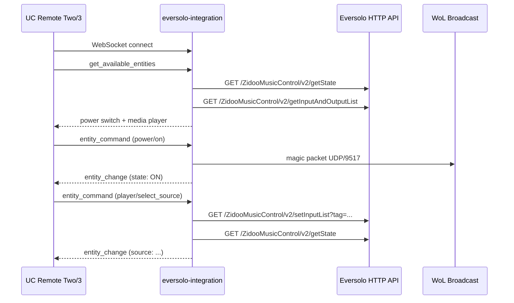

# eversolo-integration

Unfolded Circle integration driver for Eversolo streamers that expose the local HTTP API on port `9529` (DMP-A8 is the primary target).

## What It Does

This is a standalone WebSocket server that speaks the [Unfolded Circle Integration protocol](https://unfoldedcircle.github.io/core-api/integration/). When a UC Remote Two or Remote 3 connects, the driver exposes an Eversolo device as:

- a coarse power switch backed by HTTP `poweroff` plus Wake-on-LAN for power on
- a media player entity for playback, volume, mute, metadata, and input selection

## Entity Model

| Entity ID | Type | Features | Commands |
|-----------|------|----------|----------|
| `eversolo.{name}.power` | switch | on_off, toggle | on, off, toggle |
| `eversolo.{name}.player` | media_player | volume, volume_up_down, mute, unmute, mute_toggle, play_pause, next, previous, select_source, media_duration, media_position, media_title, media_artist, media_album | volume_set, volume_up, volume_down, mute, unmute, mute_toggle, play_pause, next, previous, select_source |

The `{name}` comes from `--device-name` and defaults to `streamer`.

### State Attributes

| Entity | Attributes |
|--------|------------|
| `power` | `state` = `ON`, `OFF`, or `UNKNOWN` |
| `player` | `state`, `volume`, `muted`, `source`, `media_position`, `media_duration`, `media_title`, `media_artist`, `media_album` |

### Source Selection

The media player's `select_source` command uses the current Eversolo input list returned by `getInputAndOutputList`. The integration advertises the human-readable input names in `source_list` and resolves the selected name back to the device tag at command time.

## Architecture



The integration follows the house pattern used by the Arcam and Sony drivers:

- `main.rs` parses CLI args, sets up tracing, and starts the WebSocket host
- `dispatch.rs` owns HTTP and WoL operations against the device
- `handler.rs` translates UC requests into domain operations
- `responses.rs` builds protocol JSON payloads
- `types.rs` owns entity and command mapping

## Running as an External Integration

Run the integration on any machine that can reach both the UC Remote and the Eversolo device on your network.

```bash
# Build
cargo build -p eversolo-integration --release

# Run
UCR_INTEGRATION_TOKEN=my-secret \
eversolo-integration \
  --host 192.168.1.140 \
  --mac AA:BB:CC:DD:EE:FF \
  --device-name music
```

### CLI Options

| Flag | Default | Description |
|------|---------|-------------|
| `--listen` | `0.0.0.0:9092` | WebSocket listen address |
| `--host` | *(required)* | Eversolo IP or hostname |
| `--port` | `9529` | Eversolo HTTP API port |
| `--device-name` | `streamer` | Name used in entity IDs |
| `--mac` | *(optional but recommended)* | Wired MAC used for Wake-on-LAN power on |
| `--wol-broadcast` | `255.255.255.255` | WoL broadcast address |
| `--wol-port` | `9517` | WoL UDP port |
| `--timeout` | `10` | HTTP operation timeout in seconds |
| `--poll-interval` | `5` | Background poll interval in seconds |

### Authentication

`schematic_schema::unfolded_circle_integration_ws::UnfoldedCircleIntegrationWsHost` currently enforces the `auth-token` WebSocket header. In practice that means this driver requires `UCR_INTEGRATION_TOKEN` to be set on the server side and configured on the UC Remote.

```bash
UCR_INTEGRATION_TOKEN=my-secret eversolo-integration --host 192.168.1.140
```

This is a repo-level runtime constraint, not an Eversolo protocol feature.

### Registering on the Remote

In the UC Web Configurator:

1. Go to **Integrations & Docks** > **+** > **Add external integration**
2. Enter the host and port where the driver is running, for example `192.168.1.50:9092`
3. Enter the same token configured in `UCR_INTEGRATION_TOKEN`
4. Save the integration and let the Remote query entities

## Validation

From the monorepo root:

```bash
just -f homelab/justfile build --package eversolo-integration
just -f homelab/justfile test --package eversolo-integration
```

If you want to run the binary directly while iterating:

```bash
cargo run -p eversolo-integration -- \
  --host 192.168.1.140 \
  --mac AA:BB:CC:DD:EE:FF
```

## Polling Behavior

The driver runs a background poll loop per configured device. Each loop refreshes:

- connection reachability
- power state inference
- media player attributes such as playback state, metadata, volume, mute, and source
- dynamic source list metadata used by `select_source`

This means front-panel changes, mobile-app commands, or other API clients can be reflected in the driver's cached state without waiting for a UC command path through this integration.

## Limitations

- The background poller updates the driver's cache, but it still does not proactively push `entity_change` events over the WebSocket connection. `subscribe_events` returns success, but the current `UnfoldedCircleIntegrationWsHost` only writes messages while directly handling inbound requests.
- Power state is coarse. If the HTTP API is reachable the device is treated as `ON`; if it is not reachable, the integration marks the device disconnected and coerces the power/player entities to `OFF`. That handles normal standby/off cases well, but a network outage is observationally indistinguishable from power-off.
- Power on depends on Wake-on-LAN. If `--mac` is not configured, `power on` and `power toggle` from an offline state return a UC `400` result.
- Output switching, screen controls, brightness, and VU/spectrum display modes are intentionally not exposed in this first pass. The protocol research shows those endpoints exist, but this repo does not yet have an established UC entity pattern for them.
- Installed/local-mode packaging is not included. This package currently targets external deployment only.
