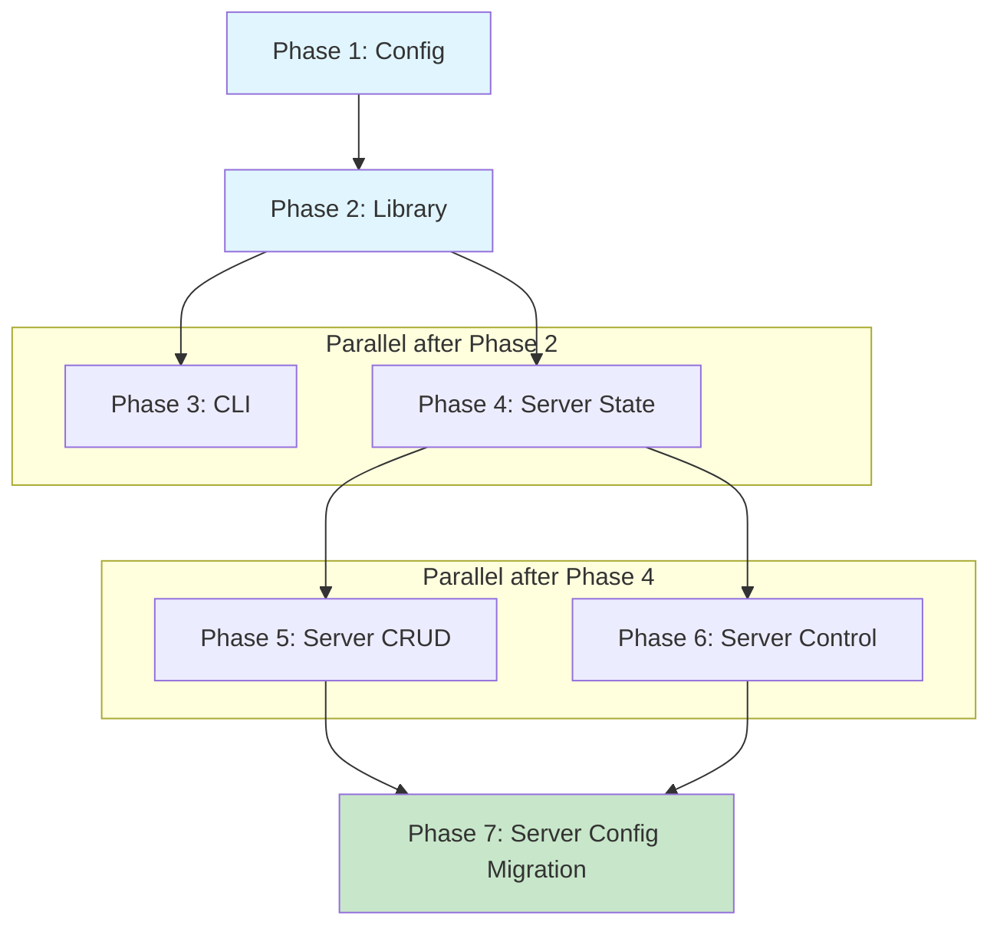

## Plan

### Dependency Graph



**Critical Path:** P1 → P2 → P4 → P5 → P7 (5 sequential steps; P3 parallel with P4, P5||P6)

---

### Phase 1: Config — Add `EversoloService` to `HomeyConfig`
**Agent:** `rust-developer` | **Skills:** rust, serde, homelab | **Complexity:** Low
**Deps:** None | **Parallel:** No

**Goal:** Extend the shared config to support Eversolo devices with backward-compatible deserialization.

**Deliver:**

1. **homelab/lib/src/config.rs** — Add `EversoloService` struct and `eversolo_devices` field:

   ```rust
   /// Configuration for an Eversolo DMP-A8 music streamer.
   #[derive(Debug, Clone, Serialize, Deserialize, PartialEq)]
   pub struct EversoloService {
       /// Hostname or IP address of the Eversolo
       pub host: String,

       /// Port number (default: 9529)
       #[serde(default = "default_eversolo_port")]
       pub port: u16,
   }

   fn default_eversolo_port() -> u16 {
       9529
   }
   ```

   Add to `HomeyConfig`:
   ```rust
   /// Eversolo DMP-A8 music streamer configurations keyed by device name
   #[serde(default)]
   pub eversolo_devices: HashMap<String, EversoloService>,
   ```

2. **Tests** — Add to existing `config.rs` tests:
   - `test_eversolo_default_port` — deserialize without port gets 9529
   - `test_config_backward_compat` — existing JSON without `eversolo_devices` deserializes to empty map
   - `test_config_with_eversolo` — round-trip with eversolo devices

**Pass when:**
- [ ] `cargo test -p homelab` passes with new tests
- [ ] Existing config tests still pass (backward compat)

**If failed:**
- Check `#[serde(default)]` on the new field
- Verify `fn default_eversolo_port` returns `9529`

---

### Phase 2: Library — Create `homelab/lib/src/eversolo.rs`
**Agent:** `rust-developer` | **Skills:** rust, thiserror, schematic, homelab | **Complexity:** Medium
**Deps:** Phase 1 | **Parallel:** No

**Goal:** Create the `Eversolo` wrapper struct that provides a homelab-native interface over the generated schematic client.

**Deliver:**

1. **homelab/lib/Cargo.toml** — Add dependency:
   ```toml
   schematic-schema = { path = "../../schematic/schema" }
   ```

2. **homelab/lib/src/eversolo.rs** — New file with:

   ```rust
   use schematic_schema::eversolo::{
       Eversolo as EversoloClient,
       DeviceGetModelRequest, MusicGetStateRequest, MusicPlayOrPauseRequest,
       MusicPlayNextRequest, MusicPlayLastRequest, MusicSeekToRequest,
       MusicGetInputOutputListRequest, MusicSetInputRequest, MusicSetOutputRequest,
       MusicSetVolumeRequest, MusicSetMuteRequest, PowerGetOptionsRequest,
       PowerSetOptionRequest, RemoteSendKeyRequest, RemoteInputTextRequest,
       SystemGetScreenBrightnessRequest, SystemSetScreenBrightnessRequest,
       SystemGetKnobBrightnessRequest, SystemSetKnobBrightnessRequest,
       SystemGetVuModeListRequest, SystemSetVuModeRequest,
       SystemGetSpectrumModeListRequest, SystemSetSpectrumModeRequest,
       SystemChangeVuDisplayRequest,
   };

   // Re-export response types for consumers
   pub use schematic_definitions::eversolo::*;

   pub const DEFAULT_PORT: u16 = 9529;

   #[derive(Debug, thiserror::Error)]
   pub enum EversoloError {
       #[error("Eversolo API error: {0}")]
       Api(#[from] schematic_schema::SchematicError),
   }

   pub struct Eversolo {
       client: EversoloClient,
       host: String,
       port: u16,
   }
   ```

   Constructor:
   ```rust
   impl Eversolo {
       pub fn new(host: impl Into<String>, port: u16) -> Self {
           let host = host.into();
           let base_url = format!("http://{}:{}", host, port);
           Self {
               client: EversoloClient::with_base_url(base_url),
               host,
               port,
           }
       }
       pub fn host(&self) -> &str { &self.host }
       pub fn port(&self) -> u16 { self.port }
   }
   ```

   Method groups — each delegates to `self.client.request::<ResponseType>(RequestType)`:

   **Device:**
   - `get_model() -> Result<GetModelResponse, EversoloError>`

   **Music Control:**
   - `get_state() -> Result<GetStateResponse, EversoloError>`
   - `play_or_pause() -> Result<StatusResponse, EversoloError>`
   - `play_next() -> Result<StatusResponse, EversoloError>`
   - `play_previous() -> Result<StatusResponse, EversoloError>`
   - `seek_to(time_ms: i64) -> Result<StatusResponse, EversoloError>`

   **Audio:**
   - `get_inputs_outputs() -> Result<InputOutputListResponse, EversoloError>`
   - `set_input(tag: &str) -> Result<InputOutputListResponse, EversoloError>`
   - `set_output(tag: &str) -> Result<InputOutputListResponse, EversoloError>`
   - `set_volume(level: i64) -> Result<StatusResponse, EversoloError>`
   - `set_mute(muted: bool) -> Result<StatusResponse, EversoloError>` — converts `bool` to `0`/`1`

   **Power:**
   - `get_power_options() -> Result<PowerOptionsResponse, EversoloError>`
   - `set_power_option(tag: &str) -> Result<StatusResponse, EversoloError>`

   **Remote:**
   - `send_key(key: &str) -> Result<StatusResponse, EversoloError>`
   - `input_text(text: &str) -> Result<StatusResponse, EversoloError>`

   **Display:**
   - `get_screen_brightness() -> Result<BrightnessResponse, EversoloError>`
   - `set_screen_brightness(index: i64) -> Result<StatusResponse, EversoloError>`
   - `get_knob_brightness() -> Result<BrightnessResponse, EversoloError>`
   - `set_knob_brightness(index: i64) -> Result<StatusResponse, EversoloError>`
   - `get_vu_modes() -> Result<DisplayModeListResponse, EversoloError>`
   - `set_vu_mode(index: i64) -> Result<StatusResponse, EversoloError>`
   - `get_spectrum_modes() -> Result<DisplayModeListResponse, EversoloError>`
   - `set_spectrum_mode(index: i64) -> Result<StatusResponse, EversoloError>`
   - `change_vu_display(open_type: i64) -> Result<StatusResponse, EversoloError>`

3. **homelab/lib/src/lib.rs** — Add `pub mod eversolo;`

**Pass when:**
- [ ] `cargo check -p homelab` succeeds
- [ ] `cargo doc -p homelab --no-deps` generates docs for `eversolo` module
- [ ] All 24 methods compile

**If failed:**
- Check import paths from `schematic_schema::eversolo`
- Verify `SchematicError` is re-exported at `schematic_schema::SchematicError`
- Check `EndpointSpec` trait bounds — the generated client uses `.request::<T>(req)` where `req: impl Into<EversoloRequest>`

---

### Phase 3: CLI — Add `eversolo` Subcommand
**Agent:** `rust-developer` | **Skills:** rust, clap, color-eyre, biscuit-terminal, homelab | **Complexity:** High
**Deps:** Phase 2 | **Parallel:** Yes (with Phase 4)

**Goal:** Full CLI subcommand with grouped actions, host resolution, human + JSON output.

**Deliver:**

1. **homelab/cli/src/main.rs** — Add `Eversolo` variant to `Commands` enum:

   ```rust
   /// Eversolo DMP-A8 music streamer control
   Eversolo {
       /// Device name from ~/homey.json
       #[arg(long)]
       name: Option<String>,

       /// Eversolo host IP or DNS name (overrides config)
       #[arg(long, env = "EVERSOLO")]
       host: Option<String>,

       #[command(subcommand)]
       action: EversoloAction,
   },
   ```

2. **Action hierarchy** — 6 subcommand groups:

   ```rust
   #[derive(Subcommand)]
   enum EversoloAction {
       /// Device information and identity
       #[command(subcommand)]
       Device(EversoloDeviceAction),
       /// Music playback control
       #[command(subcommand)]
       Music(EversoloMusicAction),
       /// Audio routing and volume
       #[command(subcommand)]
       Audio(EversoloAudioAction),
       /// Power management
       #[command(subcommand)]
       Power(EversoloPowerAction),
       /// Display settings (screen, knob, VU meter, spectrum)
       #[command(subcommand)]
       Display(EversoloDisplayAction),
       /// Remote control key commands
       #[command(subcommand)]
       Remote(EversoloRemoteAction),
   }
   ```

   See design doc sections 2 (lines 204–323) for full enum definitions including:
   - `EversoloDeviceAction { Info }`
   - `EversoloMusicAction { Status, PlayPause, Next, Previous, Seek { seconds } }`
   - `EversoloAudioAction { Volume, SetVolume { level }, Mute, Unmute, Routing, SetInput { tag }, SetOutput { tag } }`
   - `EversoloPowerAction { Options, Set { action: PowerActionTag } }` with `PowerActionTag` as `ValueEnum`
   - `EversoloDisplayAction { ScreenBrightness, SetScreenBrightness { index }, KnobBrightness, SetKnobBrightness { index }, VuModes, SetVuMode { index }, SpectrumModes, SetSpectrumMode { index } }`
   - `EversoloRemoteAction { Key { key }, Text { text } }`

3. **Host resolution** — `resolve_eversolo()` following the existing 4-priority pattern:
   - Explicit `--host` flag (or `EVERSOLO` env var)
   - `--name` lookup in `config.eversolo_devices`
   - Auto-select if exactly 1 device configured
   - Error with helpful message listing available devices

4. **Handler functions** — `handle_eversolo()` dispatching to group-specific handlers:
   - `handle_eversolo_device()` — Prose-styled device info or JSON
   - `handle_eversolo_music()` — State display with track info, position, or JSON
   - `handle_eversolo_audio()` — Volume display, routing table, or JSON
   - `handle_eversolo_power()` — Power options list or JSON
   - `handle_eversolo_display()` — Brightness/mode lists or JSON
   - `handle_eversolo_remote()` — Status confirmation or JSON

5. **Output formatting** — Follow existing patterns:
   - Human mode: `styled()` via `Prose`, `Table` for lists, device suffix
   - JSON mode: `serde_json::to_string_pretty()`
   - Seek command converts seconds → milliseconds before calling API

6. **Match arm** in `run()`:
   ```rust
   Commands::Eversolo { action, name, host } => handle_eversolo(name, host, action, json).await,
   ```

**Pass when:**
- [ ] `cargo check -p homey` succeeds
- [ ] `homey eversolo --help` shows 6 action groups
- [ ] `homey eversolo music --help` shows all music actions
- [ ] `homey eversolo power set --help` shows ValueEnum options
- [ ] `homey eversolo device info` without host shows error message
- [ ] Shell completions (`COMPLETE=bash homey`) include eversolo hierarchy

**If failed:**
- Check `use homelab::eversolo::{Eversolo, DEFAULT_PORT, EversoloError}`
- Check `use homelab::config::HomeyConfig` for resolve function
- Verify `device_names()` generic works with `EversoloService`

---

### Phase 4: Server State — Extend `AppState` with Eversolo
**Agent:** `rust-developer` | **Skills:** rust, tokio, homelab, axum | **Complexity:** Medium
**Deps:** Phase 2 | **Parallel:** Yes (with Phase 3)

**Goal:** Add Eversolo device storage and CRUD helpers to `AppState`.

**Deliver:**

1. **homelab/server/src/state.rs** — Add to `AppState`:
   ```rust
   /// Multi-device: Eversolo devices keyed by name (connections created per-request)
   pub eversolo_devices: Arc<RwLock<HashMap<String, EversoloService>>>,
   ```

   Import `EversoloService` from config.

2. **Initialize** in both `from_env()` and `from_config()`:
   - `from_env()`: `eversolo_devices: Arc::new(RwLock::new(HashMap::new()))`
   - `from_config()`: populate from `config.eversolo_devices`

3. **CRUD methods** on `AppState`:
   ```rust
   pub async fn get_eversolo(&self, name: &str) -> Option<(String, u16)> {
       let devices = self.eversolo_devices.read().await;
       devices.get(name).map(|s| (s.host.clone(), s.port))
   }

   pub async fn add_eversolo(&self, name: String, service: EversoloService) -> Result<(), ConfigError> { ... }
   pub async fn remove_eversolo(&self, name: &str) -> Result<bool, ConfigError> { ... }
   pub async fn rename_eversolo(&self, old: &str, new: String) -> Result<bool, ConfigError> { ... }
   ```

   All use the clone-mutate-save pattern matching `add_arcam()` / `remove_arcam()` / `rename_arcam()`.

4. **homelab/server/src/error.rs** — Add Eversolo error variant:
   ```rust
   /// Eversolo music streamer error
   Eversolo(homelab::eversolo::EversoloError),
   ```

   Add `Display` arm, `source()` arm, `From<EversoloError>` impl, and status code mapping:
   ```rust
   ServerError::Eversolo(_) => (StatusCode::BAD_GATEWAY, "EVERSOLO_ERROR"),
   ```

5. **homelab/server/src/config.rs** — Add re-export:
   ```rust
   pub use homelab::config::{
       ArcamAmpService, ConfigError, EversoloService, HomeyConfig,
       SonyReceiverService, is_valid_device_name, parse_host_port,
   };
   ```

**Pass when:**
- [ ] `cargo check -p homelab-server` succeeds
- [ ] Existing state tests still pass
- [ ] `from_config()` populates eversolo devices from config
- [ ] `get_eversolo("nonexistent")` returns `None`

**If failed:**
- Check all `from_env()` and `from_config()` initializers include the new field
- Check `EversoloService` is imported in state.rs

---

### Phase 5: Server CRUD Routes — List/Create/Update/Delete/Rename
**Agent:** `rust-developer` | **Skills:** rust, axum, serde, homelab | **Complexity:** Medium
**Deps:** Phase 4 | **Parallel:** Yes (with Phase 6)

**Goal:** REST CRUD endpoints for Eversolo device configuration management.

**Deliver:**

1. **homelab/server/src/handlers/crud.rs** — Add Eversolo CRUD:

   DTOs:
   ```rust
   #[derive(Debug, Clone, Deserialize, ToSchema)]
   pub struct EversoloRequest {
       pub host: String,
       #[serde(default = "default_eversolo_port")]
       #[schema(default = 9529)]
       pub port: u16,
   }
   fn default_eversolo_port() -> u16 { 9529 }

   #[derive(Debug, Clone, Serialize, ToSchema)]
   pub struct EversoloResponse {
       pub name: String,
       pub host: String,
       pub port: u16,
   }
   ```

   Route builder:
   ```rust
   pub fn eversolo_crud_routes() -> OpenApiRouter<AppState> {
       OpenApiRouter::new()
           .routes(routes!(list_eversolo_devices, create_eversolo_device))
           .routes(routes!(update_eversolo_device, delete_eversolo_device))
           .routes(routes!(rename_eversolo_device))
   }
   ```

   5 handler functions following the exact Arcam CRUD pattern:
   ```
   GET    /                  — list_eversolo_devices
   POST   /                  — create_eversolo_device (body: EversoloRequest, query: name)
   PUT    /{name}            — update_eversolo_device
   DELETE /{name}            — delete_eversolo_device
   PATCH  /{name}/rename     — rename_eversolo_device (plain-text body)
   ```

   All tagged with `tag = "eversolo"` in `#[utoipa::path]`.

**Pass when:**
- [ ] `cargo check -p homelab-server` succeeds
- [ ] All 5 CRUD routes have utoipa annotations
- [ ] `eversolo_crud_routes()` builds an `OpenApiRouter`

---

### Phase 6: Server Control Routes — Device Command Endpoints
**Agent:** `rust-developer` | **Skills:** rust, axum, serde, homelab | **Complexity:** High
**Deps:** Phase 4 | **Parallel:** Yes (with Phase 5)

**Goal:** REST endpoints for Eversolo device control (playback, volume, power, display, remote).

**Deliver:**

1. **homelab/server/src/handlers/eversolo.rs** — New file:

   Helper to create client from state:
   ```rust
   async fn create_eversolo_by_name(
       state: &AppState,
       name: &str,
   ) -> Result<homelab::eversolo::Eversolo, ServerError> {
       let (host, port) = state.get_eversolo(name).await
           .ok_or_else(|| ServerError::DeviceNotFound(name.to_string()))?;
       Ok(homelab::eversolo::Eversolo::new(host, port))
   }
   ```

   `routes_with_name()` function returning `OpenApiRouter<AppState>`.

   Endpoints (all tagged `"eversolo"`, all with `#[utoipa::path]`):
   ```
   GET  /{name}/info           — get_info_by_name
   GET  /{name}/state          — get_state_by_name
   PUT  /{name}/play-pause     — play_pause_by_name
   PUT  /{name}/next           — next_by_name
   PUT  /{name}/previous       — previous_by_name
   GET  /{name}/volume         — get_volume_by_name (extracts from get_state)
   PUT  /{name}/volume         — set_volume_by_name (body: { "level": i64 })
   PUT  /{name}/mute           — set_mute_by_name (body: { "muted": bool })
   GET  /{name}/routing        — get_routing_by_name
   PUT  /{name}/input          — set_input_by_name (body: { "tag": String })
   PUT  /{name}/output         — set_output_by_name (body: { "tag": String })
   GET  /{name}/power-options  — get_power_options_by_name
   PUT  /{name}/power          — set_power_by_name (body: { "tag": String })
   GET  /{name}/brightness     — get_brightness_by_name (screen + knob)
   PUT  /{name}/brightness     — set_brightness_by_name (body: { "target": "screen"|"knob", "index": i64 })
   GET  /{name}/display-modes  — get_display_modes_by_name (VU + spectrum)
   PUT  /{name}/display-mode   — set_display_mode_by_name (body: { "target": "vu"|"spectrum", "index": i64 })
   ```

   Request body DTOs (with `ToSchema`):
   ```rust
   #[derive(Deserialize, ToSchema)]
   pub struct VolumeRequest { pub level: i64 }

   #[derive(Deserialize, ToSchema)]
   pub struct MuteRequest { pub muted: bool }

   #[derive(Deserialize, ToSchema)]
   pub struct TagRequest { pub tag: String }

   #[derive(Deserialize, ToSchema)]
   pub struct BrightnessSetRequest { pub target: String, pub index: i64 }

   #[derive(Deserialize, ToSchema)]
   pub struct DisplayModeSetRequest { pub target: String, pub index: i64 }
   ```

2. **homelab/server/src/handlers/mod.rs** — Add `pub mod eversolo;`

3. **homelab/server/src/lib.rs** — Wire routes:

   Add OpenAPI tag:
   ```rust
   (name = "eversolo", description = "Eversolo DMP-A8 music streamer management and control"),
   ```

   Add nest in `build_router()`:
   ```rust
   .nest(
       "/eversolo",
       handlers::crud::eversolo_crud_routes()
           .merge(handlers::eversolo::routes_with_name()),
   )
   ```

**Pass when:**
- [ ] `cargo check -p homelab-server` succeeds
- [ ] All 17 control endpoints have utoipa annotations
- [ ] OpenAPI spec at `/explore` includes Eversolo section
- [ ] `routes_with_name()` compiles and builds router

**If failed:**
- Check `EversoloError` → `ServerError` conversion via `From` impl
- Verify `with_timeout()` wrapping pattern from arcam.rs
- Check that response types implement `Serialize` (they do — from schematic_definitions)

---

### Phase 7: Server Config Migration — `EVERSOLO` Env Var
**Agent:** `rust-developer` | **Skills:** rust, homelab | **Complexity:** Low
**Deps:** Phase 5, Phase 6 | **Parallel:** No

**Goal:** Auto-migrate `EVERSOLO` environment variable to config on server startup.

**Deliver:**

1. **homelab/server/src/config.rs** — Add migration block to `migrate_from_env()`:

   ```rust
   // Migrate EVERSOLO if present and no devices configured
   if config.eversolo_devices.is_empty()
       && let Ok(host) = std::env::var("EVERSOLO")
       && !host.is_empty()
   {
       let name = generate_petname();
       let (host, port) = parse_host_port(&host, 9529);
       config.eversolo_devices.insert(name, EversoloService { host, port });
       modified = true;
   }
   ```

2. **Tests** — Add to existing config test module:
   - `test_migrate_from_env_eversolo` — `EVERSOLO=192.168.1.50` creates device with port 9529
   - `test_migrate_from_env_eversolo_with_port` — `EVERSOLO=192.168.1.50:9530` preserves custom port
   - `test_migrate_skips_if_eversolo_configured` — existing eversolo devices block migration

**Pass when:**
- [ ] `cargo test -p homelab-server` passes with new tests
- [ ] Existing migration tests still pass
- [ ] `EVERSOLO=192.168.1.50` migration produces valid device name and port 9529

---

## Risks

| Level | Category | Description | Affected | Mitigation |
|-------|----------|-------------|----------|------------|
| HIGH | dependency | `schematic-schema` is excluded from workspace — may need explicit build | P2 | Test with `cargo check -p homelab` early; add `--manifest-path` if needed |
| MEDIUM | api | Generated client `request()` method signature may differ from expected | P2 | Verify `EndpointSpec` trait and `EversoloClient::request::<T>()` pattern |
| MEDIUM | types | Response types from `schematic_definitions::eversolo` may not implement `ToSchema` for utoipa | P6 | Use wrapper types with `#[derive(ToSchema)]` or `Json(serde_json::Value)` |
| MEDIUM | scope | 24 library methods + 17 server endpoints + full CLI — large surface area | P2-P6 | Each phase is independently testable; build incrementally |
| LOW | config | Backward compatibility with existing `homey.json` files | P1 | `#[serde(default)]` ensures missing field deserializes to empty map |
| LOW | naming | `PowerActionTag` ValueEnum may need exact string matching with API | P3 | Use `strum` or manual `Display` impl to map variants to API strings |

---

## Not in Scope

Per design doc section 5:
- Dashboard widget on `GET /`
- Heartbeat/polling for Eversolo
- Remote control key name constants (freeform strings for now)
- Seek-by-percentage (only absolute millisecond seek)
