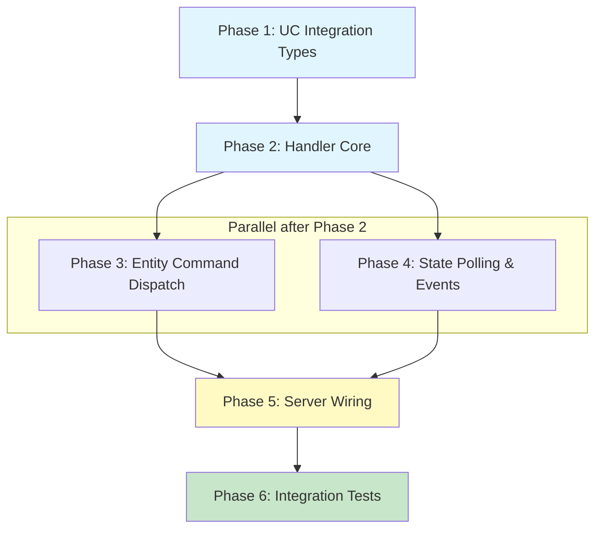

## Plan: Arcam Amplifier — Unfolded Circle External Integration

### Overview

Build an external integration driver endpoint (`/arcam-integration`) in homelab-server that speaks the Unfolded Circle Integration WebSocket protocol. When the UC Remote connects, our driver authenticates, advertises Arcam entities (power switch, mute switch), responds to commands by proxying to the Arcam TCP protocol, and pushes state-change events back to the Remote.

### Architecture

```
┌─────────────────────┐         WebSocket          ┌─────────────────────────────┐
│  UC Remote Two/3    │ ◄──────────────────────────►│  homelab-server             │
│                     │   /arcam-integration        │                             │
│  (discovers via     │   UC Integration WS API     │  ArcamIntegrationHandler    │
│   mDNS or manual)   │                             │  ├─ entity registry         │
└─────────────────────┘                             │  ├─ state cache             │
                                                    │  └─ Arcam TCP proxy         │
                                                    │         │                   │
                                                    └─────────┼───────────────────┘
                                                              │ TCP :50000
                                                    ┌─────────▼───────────────────┐
                                                    │  Arcam PA240/PA720          │
                                                    │  Binary protocol            │
                                                    └─────────────────────────────┘
```

### Entity Model

The Arcam PA-series are power amplifiers (no volume control, no source selection). The entities we expose:

| Entity ID | Type | Features | Attributes | Commands |
|-----------|------|----------|------------|----------|
| `arcam.{name}.power` | `switch` | `on_off`, `toggle` | `state: ON\|OFF` | `on`, `off`, `toggle` |
| `arcam.{name}.mute` | `switch` | `on_off`, `toggle` | `state: ON\|OFF` | `on`, `off`, `toggle` |

Entity IDs use the config device name (e.g., `arcam.office.power`) which is stable across restarts since names come from `~/homey.json`.

### Dependency Graph



**Critical Path:** P1 → P2 → P3 → P5 → P6 (5 sequential steps; P4 parallel with P3)

---

### Phase 1: UC Integration Types — Domain types for Arcam ↔ UC mapping

**Agent:** `rust-developer` | **Skills:** rust, serde, homelab, schematic | **Complexity:** Low
**Deps:** None | **Parallel:** No

**Goal:** Define the Rust types that bridge Arcam device state to UC entity representation, plus constants and helpers for the UC protocol messages. These are pure data types with no IO.

**Deliver:**

1. **homelab/server/src/handlers/arcam_integration/types.rs** — UC ↔ Arcam bridge types:

   ```rust
   use serde::{Deserialize, Serialize};
   use std::collections::HashMap;

   /// Driver metadata constants
   pub const DRIVER_ID: &str = "arcam-amplifier";
   pub const DRIVER_VERSION: &str = env!("CARGO_PKG_VERSION");
   pub const MIN_CORE_API: &str = "0.14.0";

   /// UC device connection states
   #[derive(Debug, Clone, Copy, PartialEq, Eq, Serialize)]
   #[serde(rename_all = "SCREAMING_SNAKE_CASE")]
   pub enum DeviceState {
       Connecting,
       Connected,
       Disconnected,
       Error,
   }

   /// UC entity types we expose
   #[derive(Debug, Clone, Serialize, Deserialize)]
   pub struct ArcamEntity {
       pub entity_id: String,
       pub entity_type: String,  // always "switch"
       pub name: HashMap<String, String>,
       pub features: Vec<String>,
   }

   /// Current state of an Arcam entity
   #[derive(Debug, Clone, Serialize, Deserialize)]
   pub struct ArcamEntityState {
       pub entity_id: String,
       pub entity_type: String,
       pub attributes: HashMap<String, serde_json::Value>,
   }

   /// Build the available entities for a given Arcam device config name
   pub fn build_entities(device_name: &str) -> Vec<ArcamEntity> { ... }

   /// Build initial entity states (all OFF/unknown until polled)
   pub fn build_initial_states(device_name: &str) -> Vec<ArcamEntityState> { ... }

   /// Map an entity_id + cmd_id to an Arcam operation
   pub enum ArcamOperation {
       PowerOn,
       PowerOff,
       PowerToggle,
       MuteOn,
       MuteOff,
       MuteToggle,
   }

   pub fn resolve_command(entity_id: &str, cmd_id: &str) -> Option<ArcamOperation> { ... }
   ```

2. **homelab/server/src/handlers/arcam_integration/responses.rs** — UC WS response builders:

   ```rust
   use serde_json::{json, Value};

   /// Build a `driver_version` response
   pub fn driver_version_response(req_id: u64) -> Value { ... }

   /// Build a `device_state` event
   pub fn device_state_event(state: &str) -> Value { ... }

   /// Build an `available_entities` response
   pub fn available_entities_response(req_id: u64, entities: &[ArcamEntity]) -> Value { ... }

   /// Build an `entity_states` response
   pub fn entity_states_response(req_id: u64, states: &[ArcamEntityState]) -> Value { ... }

   /// Build a `result` response (success or error)
   pub fn result_response(req_id: u64, code: u16) -> Value { ... }

   /// Build an `entity_change` event
   pub fn entity_change_event(entity_id: &str, attributes: &HashMap<String, Value>) -> Value { ... }

   /// Build an `authentication` response (for no-auth mode)
   pub fn authentication_response(req_id: u64) -> Value { ... }
   ```

3. **Tests** — Unit tests for all builders:
   - `test_build_entities` — correct entity_ids, types, features for a device named "office"
   - `test_build_initial_states` — all states start as OFF
   - `test_resolve_command_power_on` — maps `("arcam.office.power", "on")` → `PowerOn`
   - `test_resolve_command_invalid` — returns `None` for unknown entity/cmd
   - `test_driver_version_response` — correct JSON structure
   - `test_device_state_event` — correct JSON structure
   - `test_entity_change_event` — correct JSON structure
   - `test_authentication_response` — `req_id: 0`, `code: 200`

---

### Phase 2: Handler Core — Implement `WsHandler` for Arcam

**Agent:** `rust-developer` | **Skills:** rust, homelab, schematic, tokio, serde | **Complexity:** Medium-High
**Deps:** Phase 1 | **Parallel:** No

**Goal:** Implement the `WsHandler` trait (from `schematic_schema::unfolded_circle_integration_ws`) that handles all incoming UC WS messages by routing to the appropriate handler method. This is the central orchestrator.

**Deliver:**

1. **homelab/server/src/handlers/arcam_integration/handler.rs** — Core handler:

   ```rust
   use schematic_schema::unfolded_circle_integration_ws::WsHandler;
   use super::types::*;
   use super::responses::*;
   use std::collections::HashMap;
   use std::sync::Arc;
   use tokio::sync::RwLock;

   /// Arcam integration handler implementing the UC WsHandler trait.
   ///
   /// Holds references to the Arcam device configs (from AppState) and
   /// maintains entity state caches per device.
   pub struct ArcamIntegrationHandler {
       /// Arcam device configs: name → (host, port)
       devices: HashMap<String, (String, u16)>,
       /// Entity registry: entity_id → ArcamEntity
       entities: Vec<ArcamEntity>,
       /// Cached entity states
       states: Arc<RwLock<Vec<ArcamEntityState>>>,
       /// Request timeout for Arcam TCP operations
       request_timeout: std::time::Duration,
   }

   impl ArcamIntegrationHandler {
       pub fn new(
           devices: HashMap<String, (String, u16)>,
           request_timeout: std::time::Duration,
       ) -> Self {
           // Build entities and initial states for all configured Arcam devices
           ...
       }

       /// Refresh entity states by querying actual Arcam devices
       pub async fn refresh_states(&self) -> Vec<ArcamEntityState> { ... }
   }

   impl WsHandler for ArcamIntegrationHandler {
       async fn handle_message(
           &self,
           message: serde_json::Value,
       ) -> Option<serde_json::Value> {
           // Parse envelope: check "kind" and "msg" fields
           // Route to appropriate handler method
           // For "req" kind messages:
           //   "get_driver_version" → driver_version_response(id)
           //   "get_device_state" → probe Arcam devices, return device_state event
           //   "get_available_entities" → available_entities_response(id, &self.entities)
           //   "subscribe_events" → result_response(id, 200) (note: events pushed via separate mechanism)
           //   "get_entity_states" → refresh + entity_states_response(id, states)
           //   "entity_command" → dispatch to Arcam, return result, (entity_change pushed separately)
           // Unknown messages → result_response(id, 400)
           ...
       }
   }
   ```

   **Key design decisions:**

   - The `WsHandler::handle_message` returns `Option<Value>` — synchronous response only. For the `entity_command` flow, we return the `result` response immediately after sending the TCP command. The `entity_change` event is NOT returned here (it would require a separate push mechanism; see Phase 4).
   - For `get_device_state`, we attempt a quick heartbeat to each Arcam device and return `CONNECTED` or `DISCONNECTED` accordingly.
   - For `get_entity_states`, we query each Arcam's status and populate the states cache before responding.

2. **On first WS connection (handled in Phase 5 wiring):**
   - Immediately send `authentication` response with `req_id: 0`, `code: 200` (no-auth mode for external integration — auth is handled at the HTTP/WS upgrade level via `UCR_INTEGRATION_TOKEN` env var, which the generated `UnfoldedCircleIntegrationWsHost` already validates).

3. **Tests** — Unit tests for the handler message routing:
   - `test_handle_get_driver_version` — returns correct driver_version response
   - `test_handle_get_device_state_no_devices` — returns DISCONNECTED when no Arcam devices configured
   - `test_handle_get_available_entities` — returns all entities for configured devices
   - `test_handle_subscribe_events` — returns result 200
   - `test_handle_unknown_message` — returns result 400
   - `test_handle_non_req_message` — returns None for event/resp messages

   Note: Tests for `entity_command` and `get_entity_states` that require Arcam TCP are in Phase 3 and Phase 6.

---

### Phase 3: Entity Command Dispatch — Proxy UC commands to Arcam TCP

**Agent:** `rust-developer` | **Skills:** rust, homelab, tokio | **Complexity:** Medium
**Deps:** Phase 2 | **Parallel with:** Phase 4

**Goal:** Implement the `entity_command` handling path: parse the UC command, create an Arcam TCP connection, execute the operation, and return the result. Also update the internal state cache.

**Deliver:**

1. **homelab/server/src/handlers/arcam_integration/dispatch.rs** — Command execution:

   ```rust
   use homelab::arcam::Arcam;
   use homelab::network::parse_host;
   use super::types::{ArcamOperation, ArcamEntityState};

   /// Execute an Arcam operation and return the updated entity state.
   ///
   /// Creates a fresh TCP connection to the Arcam device, executes the
   /// command, and returns the new state attributes.
   pub async fn execute_operation(
       host: &str,
       operation: ArcamOperation,
       timeout: std::time::Duration,
   ) -> Result<HashMap<String, serde_json::Value>, ArcamIntegrationError> {
       let arcam_host = parse_host(host)
           .map_err(|e| ArcamIntegrationError::InvalidHost(e.0))?;
       let arcam = Arcam::new(arcam_host);

       let result = tokio::time::timeout(timeout, async {
           match operation {
               ArcamOperation::PowerOn => {
                   arcam.power_on().await?;
                   Ok(power_state_attrs(true))
               }
               ArcamOperation::PowerOff => {
                   arcam.power_off().await?;
                   Ok(power_state_attrs(false))
               }
               ArcamOperation::PowerToggle => {
                   let current = arcam.request_power_state().await?;
                   if current {
                       arcam.power_off().await?;
                       Ok(power_state_attrs(false))
                   } else {
                       arcam.power_on().await?;
                       Ok(power_state_attrs(true))
                   }
               }
               ArcamOperation::MuteOn => {
                   arcam.mute_on().await?;
                   Ok(mute_state_attrs(true))
               }
               ArcamOperation::MuteOff => {
                   arcam.mute_off().await?;
                   Ok(mute_state_attrs(false))
               }
               ArcamOperation::MuteToggle => {
                   let current = arcam.get_mute_status().await?;
                   if current {
                       arcam.mute_off().await?;
                       Ok(mute_state_attrs(false))
                   } else {
                       arcam.mute_on().await?;
                       Ok(mute_state_attrs(true))
                   }
               }
           }
       }).await;

       match result {
           Ok(Ok(attrs)) => Ok(attrs),
           Ok(Err(e)) => Err(ArcamIntegrationError::Arcam(e)),
           Err(_) => Err(ArcamIntegrationError::Timeout),
       }
   }

   fn power_state_attrs(on: bool) -> HashMap<String, serde_json::Value> {
       let mut attrs = HashMap::new();
       attrs.insert("state".to_string(), json!(if on { "ON" } else { "OFF" }));
       attrs
   }

   fn mute_state_attrs(muted: bool) -> HashMap<String, serde_json::Value> {
       let mut attrs = HashMap::new();
       attrs.insert("state".to_string(), json!(if muted { "ON" } else { "OFF" }));
       attrs
   }
   ```

2. **homelab/server/src/handlers/arcam_integration/error.rs** — Integration error type:

   ```rust
   #[derive(Debug, thiserror::Error)]
   pub enum ArcamIntegrationError {
       #[error("Arcam device error: {0}")]
       Arcam(#[from] homelab::arcam::ArcamError),
       #[error("Invalid host: {0}")]
       InvalidHost(String),
       #[error("Operation timed out")]
       Timeout,
       #[error("Unknown entity: {0}")]
       UnknownEntity(String),
       #[error("Unknown command: {0}")]
       UnknownCommand(String),
   }

   impl ArcamIntegrationError {
       /// Map to UC error code
       pub fn uc_error_code(&self) -> u16 {
           match self {
               Self::UnknownEntity(_) => 404,
               Self::UnknownCommand(_) => 400,
               Self::Timeout => 503,
               Self::Arcam(_) | Self::InvalidHost(_) => 503,
           }
       }
   }
   ```

3. **Integrate into handler** — Update `handle_message` in `handler.rs` to call `execute_operation` for `entity_command` messages, returning `result_response(id, 200)` on success or `result_response(id, error_code)` on failure.

4. **Tests** — Unit tests (these test the pure logic, not TCP):
   - `test_power_state_attrs_on` — produces `{"state": "ON"}`
   - `test_power_state_attrs_off` — produces `{"state": "OFF"}`
   - `test_mute_state_attrs` — same pattern
   - `test_error_uc_codes` — each error variant maps to expected UC code
   - `test_resolve_command_integration` — end-to-end from entity_id+cmd_id → ArcamOperation

---

### Phase 4: State Polling & Entity Change Events

**Agent:** `rust-developer` | **Skills:** rust, tokio, homelab | **Complexity:** Medium
**Deps:** Phase 2 | **Parallel with:** Phase 3

**Goal:** Implement periodic state polling of Arcam devices and a mechanism to push `entity_change` events to connected UC Remotes. Since the `WsHandler` trait only supports request→response, we need a side-channel for proactive events.

**Deliver:**

1. **homelab/server/src/handlers/arcam_integration/poller.rs** — Background state poller:

   ```rust
   use tokio::sync::broadcast;

   /// Polls all configured Arcam devices periodically and broadcasts
   /// entity_change events when state differs from cached values.
   pub struct ArcamStatePoller {
       devices: HashMap<String, (String, u16)>,
       states: Arc<RwLock<Vec<ArcamEntityState>>>,
       event_tx: broadcast::Sender<serde_json::Value>,
       poll_interval: std::time::Duration,
       request_timeout: std::time::Duration,
   }

   impl ArcamStatePoller {
       pub fn new(
           devices: HashMap<String, (String, u16)>,
           states: Arc<RwLock<Vec<ArcamEntityState>>>,
           event_tx: broadcast::Sender<serde_json::Value>,
           poll_interval: std::time::Duration,
           request_timeout: std::time::Duration,
       ) -> Self { ... }

       /// Run the polling loop. Spawned as a background tokio task.
       pub async fn run(&self) {
           loop {
               tokio::time::sleep(self.poll_interval).await;
               self.poll_and_broadcast().await;
           }
       }

       /// Query each Arcam device, compare with cached state, and
       /// broadcast entity_change events for any differences.
       async fn poll_and_broadcast(&self) {
           for (name, (host, _port)) in &self.devices {
               let arcam_host = match parse_host(host) {
                   Ok(h) => h,
                   Err(_) => continue,
               };
               let arcam = Arcam::new(arcam_host);

               // Query power and mute with timeout
               if let Ok(Ok(status)) = tokio::time::timeout(
                   self.request_timeout,
                   arcam.get_system_status(),
               ).await {
                   self.update_and_notify(name, "power", status.power).await;
                   self.update_and_notify(name, "mute", status.muted).await;
               }
           }
       }

       async fn update_and_notify(&self, device_name: &str, kind: &str, new_value: bool) {
           let entity_id = format!("arcam.{device_name}.{kind}");
           let new_state = if new_value { "ON" } else { "OFF" };

           let mut states = self.states.write().await;
           if let Some(state) = states.iter_mut().find(|s| s.entity_id == entity_id) {
               let old_state = state.attributes.get("state")
                   .and_then(|v| v.as_str())
                   .unwrap_or("");
               if old_state != new_state {
                   state.attributes.insert(
                       "state".to_string(),
                       serde_json::json!(new_state),
                   );
                   // Broadcast entity_change event
                   let _ = self.event_tx.send(
                       entity_change_event(&entity_id, &state.attributes)
                   );
               }
           }
       }
   }
   ```

2. **Event forwarding in WS connection handler** — When wiring the WS endpoint (Phase 5), each connection will subscribe to the broadcast channel and forward events to the WS write half. This is done outside the `WsHandler` trait since the trait only handles request→response.

3. **Tests:**
   - `test_update_and_notify_state_change` — broadcasts when state changes
   - `test_update_and_notify_no_change` — does NOT broadcast when state is same
   - `test_poller_builds_correct_entity_ids` — entity IDs match naming convention

---

### Phase 5: Server Wiring — Mount the WS endpoint on homelab-server

**Agent:** `rust-developer` | **Skills:** rust, axum, tokio, homelab, schematic | **Complexity:** Medium-High
**Deps:** Phase 3, Phase 4 | **Parallel:** No

**Goal:** Wire the `ArcamIntegrationHandler` into the homelab-server router as a WebSocket endpoint at `/arcam-integration`. Handle the WS lifecycle including authentication, event forwarding, and graceful shutdown.

**Deliver:**

1. **homelab/server/src/handlers/arcam_integration/mod.rs** — Module structure:

   ```rust
   mod dispatch;
   mod error;
   mod handler;
   mod poller;
   mod responses;
   mod types;

   pub use handler::ArcamIntegrationHandler;
   pub use poller::ArcamStatePoller;
   pub use types::*;
   ```

2. **homelab/server/src/handlers/arcam_integration/ws_endpoint.rs** — Axum WS handler:

   Instead of using `UnfoldedCircleIntegrationWsHost::serve()` (which binds its own TCP listener), we integrate with axum's WebSocket upgrade since we're adding to an existing HTTP server. This means we implement the WS upgrade ourselves using `axum::extract::ws::WebSocketUpgrade`:

   ```rust
   use axum::{
       extract::{State, ws::{WebSocket, WebSocketUpgrade, Message}},
       response::IntoResponse,
   };
   use futures_util::{SinkExt, StreamExt};

   /// Axum handler for WebSocket upgrade at /arcam-integration
   pub async fn arcam_integration_ws(
       ws: WebSocketUpgrade,
       State(state): State<AppState>,
   ) -> impl IntoResponse {
       ws.on_upgrade(move |socket| handle_arcam_ws(socket, state))
   }

   async fn handle_arcam_ws(socket: WebSocket, state: AppState) {
       let (mut sender, mut receiver) = socket.split();

       // 1. Send authentication response immediately (no-auth external mode)
       let auth = authentication_response(0);
       if sender.send(Message::Text(serde_json::to_string(&auth).unwrap().into())).await.is_err() {
           return;
       }

       // 2. Build handler from current Arcam device configs
       let devices = build_device_map(&state).await;
       let handler = ArcamIntegrationHandler::new(devices.clone(), state.request_timeout);

       // 3. Subscribe to state-change broadcast channel
       let mut event_rx = state.arcam_integration_events.subscribe();

       // 4. Message loop: handle incoming WS messages + forward broadcast events
       loop {
           tokio::select! {
               // Incoming message from UC Remote
               msg = receiver.next() => {
                   match msg {
                       Some(Ok(Message::Text(text))) => {
                           if let Ok(request) = serde_json::from_str::<serde_json::Value>(&text) {
                               if let Some(response) = handler.handle_message(request).await {
                                   let resp_text = serde_json::to_string(&response).unwrap();
                                   if sender.send(Message::Text(resp_text.into())).await.is_err() {
                                       break;
                                   }
                               }
                           }
                       }
                       Some(Ok(Message::Close(_))) | None => break,
                       Some(Err(_)) => break,
                       _ => {} // Ping/Pong handled by axum
                   }
               }
               // Outbound entity_change events from poller
               event = event_rx.recv() => {
                   if let Ok(event_value) = event {
                       let text = serde_json::to_string(&event_value).unwrap();
                       if sender.send(Message::Text(text.into())).await.is_err() {
                           break;
                       }
                   }
               }
           }
       }
   }

   async fn build_device_map(state: &AppState) -> HashMap<String, (String, u16)> {
       let hosts = state.arcam_hosts.read().await;
       hosts.iter().map(|(name, svc)| (name.clone(), (svc.host.clone(), svc.port))).collect()
   }
   ```

3. **homelab/server/src/state.rs** — Add broadcast channel to AppState:

   ```rust
   // Add to AppState:
   pub arcam_integration_events: tokio::sync::broadcast::Sender<serde_json::Value>,
   ```

   Initialize in `from_config()`:
   ```rust
   let (integration_tx, _) = tokio::sync::broadcast::channel(64);
   // ... in the Self { ... }:
   arcam_integration_events: integration_tx,
   ```

4. **homelab/server/src/lib.rs** — Register the WS route:

   ```rust
   // Add to build_router(), after the .split_for_parts() block:
   .route("/arcam-integration", get(handlers::arcam_integration::ws_endpoint::arcam_integration_ws))
   ```

5. **homelab/server/src/main.rs** — Spawn the state poller:

   ```rust
   // After spawn_arcam_keepalive(app_state.clone()):
   spawn_arcam_integration_poller(app_state.clone());

   fn spawn_arcam_integration_poller(state: AppState) {
       tokio::spawn(async move {
           let devices = {
               let hosts = state.arcam_hosts.read().await;
               hosts.iter().map(|(n, s)| (n.clone(), (s.host.clone(), s.port))).collect()
           };
           // Share the same state cache that the handler reads
           // ... build poller and run
       });
   }
   ```

6. **homelab/server/Cargo.toml** — Add dependency:

   ```toml
   schematic-schema = { path = "../../schematic/schema" }
   futures-util = "0.3"
   ```

   Note: `axum` already provides WebSocket support. `tokio-tungstenite` is pulled transitively. We only need `futures-util` for `SinkExt`/`StreamExt`.

7. **Tests:**
   - `test_ws_route_exists` — integration test verifying the route responds to WS upgrade
   - `test_build_device_map` — correctly maps from AppState

---

### Phase 6: Integration Tests — End-to-end WS protocol tests

**Agent:** `feature-tester-rust` | **Skills:** rust-testing, tokio, homelab, serde | **Complexity:** Medium
**Deps:** Phase 5 | **Parallel:** No

**Goal:** Comprehensive integration tests that connect to the server via WebSocket and exercise the full UC Integration protocol. Since we can't connect to a real Arcam device in CI, these tests verify:
- WS connection and authentication flow
- Protocol message routing (all 6 required messages)
- Error handling for invalid messages
- Entity listing correctness

**Deliver:**

1. **homelab/server/tests/arcam_integration_tests.rs** — Integration test suite:

   ```rust
   use axum_test::TestServer;
   use homelab_server::{build_router, config::HomeyConfig, state::AppState};
   use tokio_tungstenite::tungstenite::Message;

   // Helper: create state with a mock Arcam device configured
   // (uses an unreachable host — tests only verify protocol, not TCP)
   fn state_with_arcam() -> AppState {
       let mut config = HomeyConfig::new();
       config.arcam_amps.insert("test-amp".to_string(), ArcamAmpService {
           host: "192.168.99.99".to_string(),  // unreachable
           port: 50000,
       });
       AppState::from_config(config, None)
   }
   ```

   **Test cases:**

   a. **Connection & Authentication:**
   - `test_ws_connect_receives_auth` — connect to `/arcam-integration`, verify first message is `authentication` with `code: 200`

   b. **Protocol Messages:**
   - `test_get_driver_version` — send `get_driver_version` request, verify response contains driver name and version
   - `test_get_available_entities` — send request, verify response lists power and mute entities for "test-amp"
   - `test_subscribe_events` — send request, verify `result` response with `code: 200`
   - `test_get_entity_states_unreachable` — send request to server with unreachable Arcam, verify graceful handling (entities returned with last known state)

   c. **Entity Commands (with unreachable device):**
   - `test_entity_command_unreachable` — send power on command, verify error response (503)
   - `test_entity_command_unknown_entity` — send command for nonexistent entity, verify 404
   - `test_entity_command_unknown_cmd` — send command with invalid cmd_id, verify 400

   d. **Error Handling:**
   - `test_malformed_json` — send invalid JSON, verify connection stays open
   - `test_unknown_message_type` — send unknown msg type, verify 400 response

   e. **No Devices Configured:**
   - `test_no_arcam_devices` — connect with empty config, verify `get_available_entities` returns empty list
   - `test_device_state_no_devices` — verify `DISCONNECTED` state

2. **homelab/server/tests/arcam_integration_unit_tests.rs** — Additional unit tests that exercise the handler directly (without WS):

   ```rust
   use homelab_server::handlers::arcam_integration::*;

   #[tokio::test]
   async fn test_handler_full_protocol_flow() {
       // Create handler with mock device config
       let handler = ArcamIntegrationHandler::new(...);

       // Simulate the full UC connection flow:
       // 1. get_driver_version
       // 2. subscribe_events
       // 3. get_available_entities
       // 4. get_entity_states
       // Verify each response
   }
   ```

---

### Risks & Mitigations

| Risk | Severity | Mitigation |
|------|----------|------------|
| **UC protocol compliance** — subtle requirements like `req_id: 0` for auth, `kind: event` vs `kind: resp` for device_state | High | Exhaustive integration tests for each message type; reference the [UC AsyncAPI spec](https://unfoldedcircle.github.io/core-api/integration/) |
| **Arcam TCP timeouts during entity_command** — slow or unresponsive device blocks the WS handler | Medium | All Arcam TCP calls wrapped in `tokio::time::timeout`; return UC error code 503 on timeout |
| **Concurrent WS connections** — multiple UC Remotes connecting simultaneously | Medium | Handler is stateless per-request (shared state via Arc+RwLock); broadcast channel for events handles multiple subscribers |
| **Entity ID stability** — IDs must not change across server restarts | Low | IDs derived from config device name (e.g., `arcam.office.power`) which is stable in `~/homey.json` |

### New Dependencies

| Crate | Version | Purpose |
|-------|---------|---------|
| `schematic-schema` | workspace | UC Integration WS types (already exists in workspace) |
| `futures-util` | `0.3` | `SinkExt` / `StreamExt` for axum WS |

Note: `schematic-schema` is already a workspace member but not currently a dependency of `homelab-server`. We add it as a path dependency. `futures-util` is likely already pulled transitively but should be declared explicitly.

### Files Created/Modified Summary

| File | Action | Description |
|------|--------|-------------|
| `homelab/server/src/handlers/arcam_integration/mod.rs` | **New** | Module root |
| `homelab/server/src/handlers/arcam_integration/types.rs` | **New** | Entity types, constants, command mapping |
| `homelab/server/src/handlers/arcam_integration/responses.rs` | **New** | UC WS response/event JSON builders |
| `homelab/server/src/handlers/arcam_integration/handler.rs` | **New** | `WsHandler` implementation |
| `homelab/server/src/handlers/arcam_integration/dispatch.rs` | **New** | Arcam TCP command execution |
| `homelab/server/src/handlers/arcam_integration/error.rs` | **New** | Integration error type |
| `homelab/server/src/handlers/arcam_integration/poller.rs` | **New** | Background state polling |
| `homelab/server/src/handlers/arcam_integration/ws_endpoint.rs` | **New** | Axum WS upgrade handler |
| `homelab/server/src/handlers/mod.rs` | **Modified** | Add `pub mod arcam_integration;` |
| `homelab/server/src/state.rs` | **Modified** | Add broadcast channel field |
| `homelab/server/src/lib.rs` | **Modified** | Register `/arcam-integration` route |
| `homelab/server/src/main.rs` | **Modified** | Spawn integration poller |
| `homelab/server/Cargo.toml` | **Modified** | Add `schematic-schema`, `futures-util` deps |
| `homelab/server/tests/arcam_integration_tests.rs` | **New** | WS integration tests |
