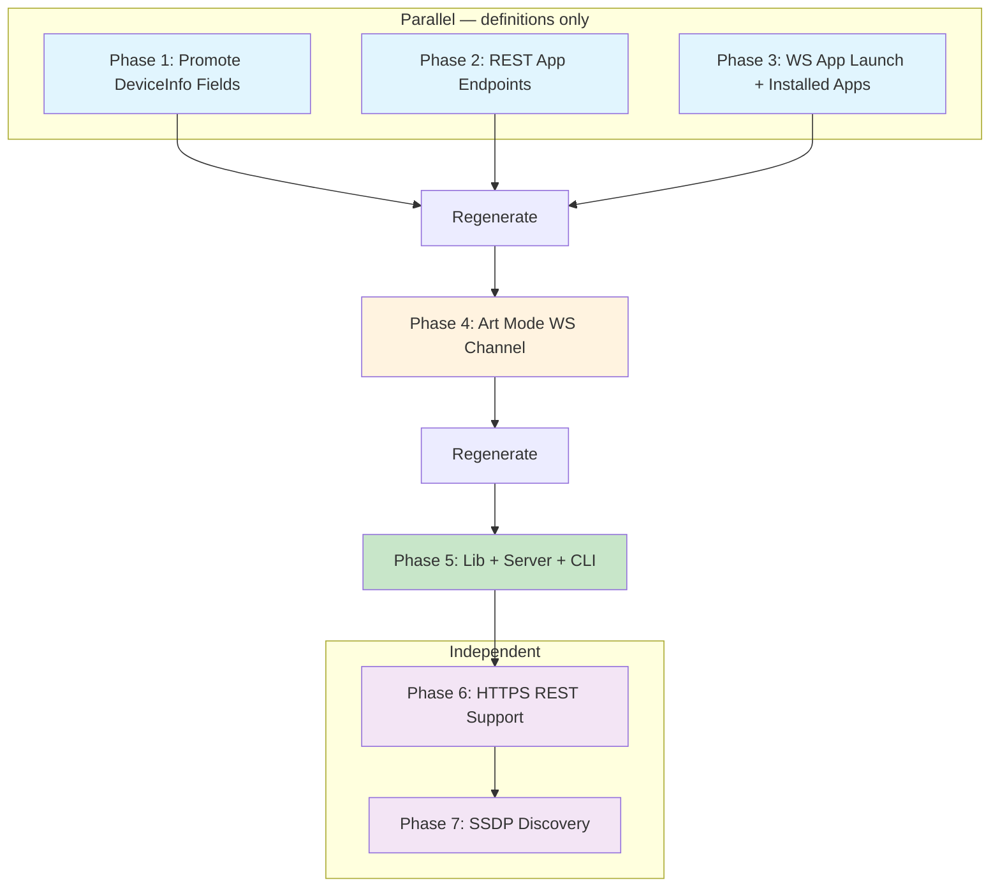

## Context

The current Samsung TV API surface is minimal: 4 REST endpoints (device info, logs, two app launch variants) and 1 WebSocket channel (remote key sending). The research docs (`homelab/docs/samsung/samsung-s95-tcp-api.md` and `samsung-smart-tv-ip-apis.md`) document significantly more capability including app lifecycle management, deep-link launching, Art Mode control, and SSDP discovery. This plan fills those gaps across all layers of the stack.

## Dependency Graph



**Critical path:** P1+P2+P3 (parallel) -> regenerate -> P4 -> regenerate -> P5 -> P6 -> P7

## Plan

### Phase 1: Promote DeviceInfo Fields (Priority #4)

Add typed fields to `SamsungDeviceInfo` for commonly-present properties that currently land in the `extra` BTreeMap.

**Files:**
- `schematic/definitions/src/samsung_smart_tv/types.rs`

**Add to `SamsungDeviceInfo`** (all `Option<String>`, `skip_serializing_if`):

| Rust field | Wire name | Why typed |
|---|---|---|
| `frame_tv_support` | `FrameTVSupport` | Art Mode capability detection |
| `ip` | `ip` | TV's own IP |
| `wifi_mac` | `wifiMac` | Wake-on-LAN |
| `firmware_version` | `firmwareVersion` | Version tracking |
| `manufacturer` | `manufacturer` | Device ID |
| `country_code` | `countryCode` | Region behavior |
| `duid` | `duid` | Unique device ID |

**Tests to update:**
- `device_info_response_preserves_unknown_fields` — `wifiMac` now typed, adjust assertion
- `device_info_roundtrips_through_serde` — add `None` for new fields in struct literal
- Add `device_info_promotes_frame_tv_support` test

---

### Phase 2: REST App Lifecycle Endpoints (Priority #1)

Add GET/DELETE/PUT on `/api/v2/applications/{app_id}` for app status, close, and install.

**Files:**
- `schematic/definitions/src/samsung_smart_tv/types.rs` — new `SamsungAppStatusResponse`
- `schematic/definitions/src/samsung_smart_tv/mod.rs` — 3 new endpoints + registry

**New type** — `SamsungAppStatusResponse`:
```rust
pub struct SamsungAppStatusResponse {
    pub visible: Option<bool>,
    pub running: Option<bool>,
    pub version: Option<String>,
    pub name: Option<String>,
    pub id: Option<String>,
    #[serde(flatten)]
    pub extra: BTreeMap<String, serde_json::Value>,
}
```

**New endpoints** in `build_samsung_smart_tv_endpoints()`:

| ID | Method | Path | Response |
|---|---|---|---|
| `GetAppStatus` | GET | `/api/v2/applications/{app_id}` | `json_type("SamsungAppStatusResponse")` |
| `CloseApp` | DELETE | `/api/v2/applications/{app_id}` | `Empty` |
| `InstallApp` | PUT | `/api/v2/applications/{app_id}` | `Empty` |

**Registry:** Add `.register::<SamsungAppStatusResponse>("SamsungAppStatusResponse")`

**Tests to update:**
- `api_has_four_endpoints` -> `api_has_seven_endpoints`
- `openapi_registry_contains_samsung_rest_types` — check count = 3
- Add endpoint-specific tests for each new endpoint
- Add serde test for `SamsungAppStatusResponse`

---

### Phase 3: WS App Launch + Installed Apps + Connect Data (Priority #2 + #6 partial)

Add typed messages for `ms.channel.emit` commands (app launch, installed apps) and enrich the connect event data.

**Files:**
- `schematic/definitions/src/samsung_smart_tv/remote_ws/types.rs` — new types
- `schematic/definitions/src/samsung_smart_tv/remote_ws/mod.rs` — 2 new messages

**New types in `remote_ws/types.rs`:**

App launch types:
- `SamsungAppLaunchActionType` enum: `DEEP_LINK`, `NATIVE_LAUNCH`
- `SamsungAppLaunchData` struct: `action_type`, `app_id` (rename `appId`), `meta_tag` (rename `metaTag`, optional)
- `SamsungAppLaunchParams` struct: `event`, `to`, `data`
- `SamsungAppLaunchCommand` struct: `method`, `params`

Installed apps types:
- `SamsungInstalledAppsParams` struct: `event`, `to`
- `SamsungInstalledAppsCommand` struct: `method`, `params`
- `SamsungInstalledApp` struct: `app_id` (rename `appId`), `name`, `app_type`, `extra`

Connect data enrichment — update `SamsungRemoteConnectData`:
- Add `id: Option<String>` — client ID from TV
- Add `clients: Option<Vec<SamsungConnectedClient>>`

New type:
- `SamsungConnectedClient` struct: `id`, `device_name` (rename `deviceName`), `is_host` (rename `isHost`), `extra`

**New messages** in RemoteControl endpoint:

| Name | Direction | Schema |
|---|---|---|
| `AppLaunchCommand` | Client | `SamsungAppLaunchCommand` |
| `InstalledAppsCommand` | Client | `SamsungInstalledAppsCommand` |

**Tests to update:**
- `remote_control_has_five_messages` -> `remote_control_has_seven_messages`
- Add serialization tests for new command types
- Add test for enriched `SamsungRemoteConnectData` with `id` + `clients`

---

### Regeneration Checkpoint 1

Run `just generate` from `schematic/` after Phases 1-3. This produces:
- Updated `SamsungDeviceInfo` / `SamsungDeviceInfoResponse` with promoted fields
- `GetAppStatusRequest`, `CloseAppRequest`, `InstallAppRequest` in REST client
- Updated WS message re-exports

Verify: `just test && just lint` in `schematic/`

---

### Phase 4: Art Mode WebSocket Channel (Priority #3)

Add a second WebSocket endpoint (`com.samsung.art-app`) to the existing `SamsungSmartTvRemote` API, following the Unfolded Circle multi-endpoint pattern.

**Files:**
- `schematic/definitions/src/samsung_smart_tv/remote_ws/types.rs` — art mode types
- `schematic/definitions/src/samsung_smart_tv/remote_ws/mod.rs` — ArtMode endpoint

**New types in `remote_ws/types.rs`:**

```rust
// Art mode request discriminant
pub enum SamsungArtModeRequest {
    GetApiVersion, GetArtModeStatus, SetArtModeStatus,
    GetCurrentArtwork, GetContentList, SelectImage, SendImage,
    GetBrightness, SetBrightness,
}

// Inner data payload (before double-encoding)
pub struct SamsungArtModeData {
    pub request: SamsungArtModeRequest,
    pub id: String,
    pub request_id: String,
    #[serde(flatten)]
    pub extra: BTreeMap<String, serde_json::Value>,
}

// Emit params with double-encoded data string
pub struct SamsungArtModeEmitParams {
    pub event: String,  // always "art_app_request"
    pub to: String,     // always "host"
    pub data: String,   // JSON-encoded SamsungArtModeData
}

// Top-level command
pub struct SamsungArtModeCommand {
    pub method: SamsungRemoteMethod,
    pub params: SamsungArtModeEmitParams,
}

// Response event (generic — data is double-encoded)
pub struct SamsungArtModeEvent {
    pub event: Option<String>,
    pub method: Option<String>,
    pub data: Option<String>,  // JSON-encoded response data
}

// Parsed inner response types
pub struct SamsungArtModeStatus { pub value: Option<String> }
pub struct SamsungArtworkItem { pub content_id: Option<String>, pub category: Option<String>, extra }
```

**Key design note:** Art Mode uses **double-encoded JSON** — the `data` field in `ms.channel.emit` params is a JSON string, not a nested object. The lib layer handles encoding/decoding.

**New event variant** in `SamsungRemoteKnownEvent`:
- `ArtAppRequest` (rename `"art_app_request"`)

**New endpoint** — add to `endpoints` vec in `define_samsung_smart_tv_remote_ws_api()`:

| ID | Path | Connection Params | Messages |
|---|---|---|---|
| `ArtMode` | `/api/v2/channels/com.samsung.art-app` | `name` (required), `token` (optional) | ArtModeCommand (Client), ArtModeEvent (Server), ChannelConnectEvent (Server), ChannelEnvelope (Bidirectional) |

**Tests:**
- `ws_api_has_one_endpoint` -> `ws_api_has_two_endpoints`
- Add `art_mode_endpoint_metadata` test
- Add `art_mode_command_serialization` test verifying double-encoding
- Add `art_mode_request_variants_serialize` test

---

### Regeneration Checkpoint 2

Run `just generate` from `schematic/`. This produces:
- `ArtModeClient` with `connect_art_mode()` on `SamsungSmartTvRemoteWs`
- `ArtModeConnectionParams`

Verify: `just test && just lint` in `schematic/`

---

### Phase 5: Homelab Lib + Server + CLI Integration

Propagate all new capabilities through the homelab stack.

**Files:**
- `homelab/lib/src/samsung_tv.rs` — new methods + re-exports
- `homelab/lib/Cargo.toml` — add `uuid` dependency (art mode request IDs)
- `homelab/server/src/handlers/samsung_tv.rs` — new handlers
- `homelab/server/src/state.rs` — update `get_samsung_tv` if needed
- `homelab/cli/src/main.rs` — new subcommands

#### Lib additions (`samsung_tv.rs`)

**New re-exports:** `SamsungAppStatusResponse`, `SamsungAppLaunchCommand`, `SamsungAppLaunchData`, `SamsungAppLaunchActionType`, `SamsungInstalledApp`, `SamsungArtModeCommand`, `SamsungArtModeData`, `SamsungArtModeRequest`, `SamsungArtModeStatus`, `SamsungArtworkItem`, `SamsungConnectedClient`

**New REST methods on `SamsungTv`:**
- `get_app_status(&self, app_id: &str) -> Result<SamsungAppStatusResponse>`
- `close_app(&self, app_id: &str) -> Result<()>`
- `install_app(&self, app_id: &str) -> Result<()>`

**New WS methods on `SamsungTv`:**
- `launch_app_ws(&self, app_id: &str, meta_tag: Option<&str>) -> Result<()>` — deep-link via WS
- `get_installed_apps(&self) -> Result<Vec<SamsungInstalledApp>>` — WS emit + event read

**New Art Mode methods on `SamsungTv`:**
- `connect_art_mode_inner(&self, token: Option<&str>) -> Result<ArtModeClient>`
- `get_art_mode_status(&self) -> Result<SamsungArtModeStatus>`
- `set_art_mode(&self, on: bool) -> Result<()>`
- `get_current_artwork(&self) -> Result<serde_json::Value>`
- `get_artwork_list(&self) -> Result<Vec<SamsungArtworkItem>>`
- `select_artwork(&self, content_id: &str) -> Result<()>`
- `get_art_brightness(&self) -> Result<serde_json::Value>`
- `set_art_brightness(&self, level: u8) -> Result<()>`

**Builder helpers (private):**
- `build_app_launch_command(app_id, meta_tag) -> SamsungAppLaunchCommand`
- `build_installed_apps_command() -> SamsungInstalledAppsCommand`
- `build_art_mode_command(request, extra) -> SamsungArtModeCommand` — handles double-encoding

#### Server handlers

**New routes** (add to `routes_with_name()`):

| Method | Path | Handler | Body |
|---|---|---|---|
| GET | `/{name}/app/{app_id}` | `get_app_status_by_name` | — |
| DELETE | `/{name}/app/{app_id}` | `close_app_by_name` | — |
| PUT | `/{name}/app/{app_id}/install` | `install_app_by_name` | — |
| POST | `/{name}/app/ws` | `launch_app_ws_by_name` | `{app_id, meta_tag?}` |
| GET | `/{name}/app/list` | `list_installed_apps_by_name` | — |
| GET | `/{name}/art/status` | `get_art_status_by_name` | — |
| PUT | `/{name}/art/status` | `set_art_status_by_name` | `{on: bool}` |
| GET | `/{name}/art/current` | `get_art_current_by_name` | — |
| GET | `/{name}/art/list` | `get_art_list_by_name` | — |
| PUT | `/{name}/art/select` | `select_art_by_name` | `{content_id}` |
| GET | `/{name}/art/brightness` | `get_art_brightness_by_name` | — |
| PUT | `/{name}/art/brightness` | `set_art_brightness_by_name` | `{level: u8}` |

**New DTOs:** `WsAppLaunchRequest`, `ArtStatusRequest`, `ArtSelectRequest`, `ArtBrightnessRequest`

#### CLI additions

Extend `SamsungAppAction`:
- `Status { id: String }` — get app status
- `Close { id: String }` — close app
- `Install { id: String }` — install app
- `LaunchWs { id: String, #[arg(long)] meta_tag: Option<String> }` — WS deep-link launch
- `List` — installed apps

Add `SamsungArtAction` subcommand group:
- `Status` — get art mode status
- `Set { on: bool }` — enable/disable art mode
- `Current` — show current artwork
- `List` — list artwork
- `Select { content_id: String }` — select artwork
- `Brightness` — get brightness
- `SetBrightness { level: u8 }` — set brightness (0-100)

Wire into `SamsungAction` enum as `Art(SamsungArtAction)`.

**Verify:** `just test && just lint` in `homelab/`

---

### Phase 6: HTTPS REST Support (Priority #5)

Add HTTPS support for REST API on port 8002 with self-signed cert acceptance.

**Files:**
- `homelab/lib/src/samsung_tv.rs` — `with_https()` constructor
- `homelab/lib/src/config.rs` — `use_https` field on `SamsungTvService`
- `homelab/server/src/handlers/samsung_tv.rs` — pass HTTPS flag
- `homelab/server/src/state.rs` — update `get_samsung_tv` to return `use_https`
- `homelab/cli/src/main.rs` — `--https` flag

**Lib change:**
```rust
impl SamsungTv {
    pub fn with_https(host, rest_port, ws_port, use_https: bool) -> Self {
        // scheme = if use_https { "https" } else { "http" }
        // if use_https: danger_accept_invalid_certs(true) on reqwest builder
    }
}
```

**Config change** — add to `SamsungTvService`:
```rust
#[serde(default)]
pub use_https: bool,
```

**Server change** — `create_samsung_by_name` reads `use_https` from service config, passes to `SamsungTv::with_https()`.

**CLI change** — add `--https` flag, pass to `SamsungTv::with_https()`.

**Verify:** `just test && just lint` in `homelab/`

---

### Phase 7: SSDP Discovery (Priority #6)

Standalone addition — does NOT go through schematic (UDP multicast isn't REST/WS).

**Files:**
- New: `homelab/lib/src/samsung_tv_discovery.rs`
- `homelab/lib/src/lib.rs` — add `pub mod samsung_tv_discovery;`
- `homelab/cli/src/main.rs` — add `Discover` subcommand

**Discovery function:**
- Send M-SEARCH to `239.255.255.250:1900` with `ST: urn:samsung.com:device:RemoteControlReceiver:1`
- Also try `ST: ssdp:all` and filter by Samsung server strings as fallback
- Parse LOCATION, SERVER, USN from responses
- Return `Vec<DiscoveredSamsungTv>` with host, location URL, server string

**Return type:**
```rust
pub struct DiscoveredSamsungTv {
    pub host: String,
    pub location: String,
    pub server: Option<String>,
    pub usn: Option<String>,
}
```

**CLI subcommand:**
```
homelab samsung discover [--timeout 3]
```

**Tests:** Unit test for SSDP response parsing (no network needed).

**Verify:** `just test && just lint` in `homelab/`

## Verification (end-to-end)

After all phases:
```bash
cd schematic && just test && just lint && just generate
cd ../homelab && just test && just lint && just build
```

Manual validation (requires TV on network):
- `homelab samsung device info` — verify new typed fields appear
- `homelab samsung app status --id <app_id>` — check app status
- `homelab samsung art status` — check Art Mode support
- `homelab samsung discover` — find TV via SSDP
