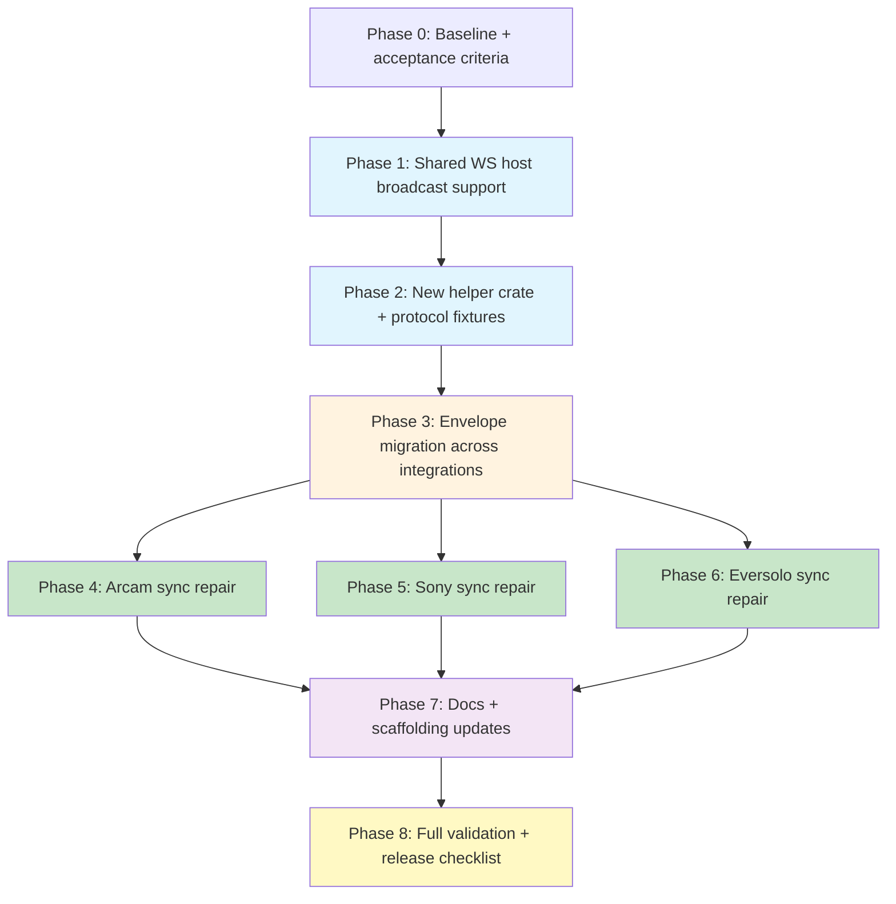

## Context

The current Unfolded Circle integrations all pass their existing tests, but they share three structural problems:

1. The shared WebSocket host only supports request-response traffic while reading a client frame, so no integration can emit true unsolicited `entity_change` or `device_state` events.
2. All three integrations use spec-inconsistent envelopes by reading inbound `req_id`, burying `code` inside `msg_data`, and returning synchronous `entity_change` payloads for `entity_command`.
3. The same broken handler, response-builder, and cache patterns are duplicated in Arcam, Sony, and Eversolo.

The review recommends fixing the substrate first, then moving the integrations onto a shared helper layer, then repairing device-specific synchronization gaps. This plan follows that order so protocol correctness is solved once and reused everywhere.

## Success Criteria

By the end of this work:

- `subscribe_events` creates a real event subscription path backed by the shared host
- integrations parse inbound request `id` and emit top-level `req_id` plus top-level `code`
- `entity_command` returns an acknowledgement/result envelope, with `entity_change` sent separately when state actually changes
- Arcam, Sony, and Eversolo all maintain truthful connectivity state and durable entity caches
- external device changes can be detected, reflected in cache, and broadcast to subscribed clients
- shared test fixtures cover protocol-envelope correctness so future integrations cannot silently reintroduce the same mistakes
- docs and scaffolding explain the corrected model honestly

## Dependency Graph

**Critical path:** Phase 1 -> Phase 2 -> Phase 3 -> Phase 4/5/6 -> Phase 7 -> Phase 8

**Parallel work after Phase 3:** Arcam, Sony, and Eversolo refactors can proceed independently as long as the helper crate APIs are stable.

## Plan

### Phase 0: Baseline and acceptance criteria

**Goal:** Lock the protocol contract and implementation order before touching runtime code.

**Files to inspect or update:**

- `homelab/docs/state-sync-review.md`
- `schematic/definitions/src/unfolded_circle/integration_ws/types.rs`
- `schematic/schema/src/unfolded_circle_integration_ws.rs`

**Tasks:**

1. Translate the review into explicit acceptance criteria for:
   - request parsing (`id` inbound)
   - response envelopes (`req_id` and top-level `code`)
   - asynchronous event delivery after `subscribe_events`
   - separation of `result` responses from `entity_change` and `device_state`
2. Confirm which parts of the UC protocol are already represented correctly in `schematic/definitions` and which parts are integration-local mistakes.
3. Capture a short protocol note inside the helper crate docs so every refactor phase shares the same source of truth.

**Acceptance criteria:**

- No implementation phase relies on ambiguous envelope semantics
- Every later test can be tied back to a single protocol rule

---

### Phase 1: Shared WebSocket host broadcast support

**Goal:** Upgrade the shared host so integrations can emit unsolicited events without waiting for an inbound frame.

**Primary files:**

- `schematic/schema/src/unfolded_circle_integration_ws.rs`

**Likely new responsibilities inside the host:**

1. Track active connections instead of treating each connection as a read loop with a private writer.
2. Introduce an async send path that integrations can use outside `handle_message(...)`.
3. Track event subscriptions per connection after `subscribe_events`.
4. Cleanly remove disconnected clients and avoid stalled writers blocking the host.

**Implementation tasks:**

1. Refactor `UnfoldedCircleIntegrationWsHost::handle_connection(...)` so reads and writes are decoupled.
2. Add per-connection sender handles, likely via `tokio::sync::mpsc` or `broadcast` plus connection-local filtering.
3. Introduce a small host-side context object or trait surface that lets handlers:
   - register interest in a connection
   - mark a connection as subscribed
   - send `entity_change`
   - send `device_state`
4. Keep normal request-response behavior intact for `handle_message(...)`.
5. Add host tests covering:
   - request-response still works
   - `subscribe_events` enables event delivery
   - unsolicited messages reach all subscribed clients
   - unsubscribed or disconnected clients do not receive events

**Design constraints:**

- Do not break the current `serve` and `serve_addr` entry points unless there is a very clear migration path.
- Avoid a design that requires every integration to manage raw writer handles directly.
- Keep the host generic enough that Arcam, Sony, and Eversolo can share it without device-specific knowledge.

**Acceptance criteria:**

- A handler can broadcast an `entity_change` without a currently active inbound request
- Connection teardown does not panic or leak senders
- Existing request/response flows still pass

---

### Phase 2: Create `homelab/unfolded-integration-helper`

**Goal:** Extract the repeated UC integration scaffolding into a reusable crate so protocol fixes land once.

**New crate:**

- `homelab/unfolded-integration-helper/Cargo.toml`
- `homelab/unfolded-integration-helper/src/lib.rs`

**Workspace plumbing:**

- `Cargo.toml`
- `homelab/justfile`

**Suggested module layout:**

- `src/envelope.rs`
- `src/subscriptions.rs`
- `src/state_cache.rs`
- `src/router.rs`
- `src/test_fixtures.rs`
- `src/connectivity.rs`

**Implementation tasks:**

1. Add the new crate to the root workspace and to `homelab/justfile` build/test/lint recipes.
2. Implement a shared envelope parser that:
   - reads top-level request `id`
   - validates `kind == "req"`
   - exposes typed accessors for `msg`, `msg_data`, and optional params
3. Implement shared envelope builders for:
   - `driver_version`
   - `available_entities`
   - `entity_states`
   - `result`
   - `device_state`
   - `entity_change`
4. Centralize the spec rule that `code` belongs at the top level for responses.
5. Add a reusable subscriber registry abstraction that bridges helper code to the upgraded shared host.
6. Add a small keyed state-cache abstraction to replace the repeated `Vec` plus linear scans:
   - keyed by `entity_id`
   - supports replace vs merge semantics
   - supports diff detection for broadcasting only changed state
7. Add a connectivity tracker abstraction:
   - `Unknown`
   - `Connected`
   - `Disconnected`
   - `Error`
   - last-success and last-failure timestamps if useful
8. Add shared test fixtures that build valid spec-shaped UC requests and expected response/event envelopes.

**Why this phase comes before the integration repairs:**

- It prevents fixing the same envelope and cache bug three times.
- It gives Arcam, Sony, and Eversolo a common test vocabulary.
- It creates a default path for future integrations and for `.claude/commands/create-integration.md`.

**Acceptance criteria:**

- The helper crate can build and parse every envelope shape needed by all three integrations
- The helper crate includes tests proving the `id` -> `req_id` mapping and top-level `code` behavior
- No integration after migration needs to hand-build protocol JSON ad hoc

---

### Phase 3: Migrate all integrations to the shared protocol layer

**Goal:** Put Arcam, Sony, and Eversolo on the same corrected request/response model before device-specific behavior changes.

**Primary files:**

- `homelab/arcam-amp-integration/src/handler.rs`
- `homelab/arcam-amp-integration/src/responses.rs`
- `homelab/eversolo-integration/src/handler.rs`
- `homelab/eversolo-integration/src/responses.rs`
- `homelab/sony-receiver-integration/src/handler.rs`
- `homelab/sony-receiver-integration/src/responses.rs`
- integration `Cargo.toml` files

**Implementation tasks:**

1. Replace inbound `req_id` parsing with shared parsing of inbound request `id`.
2. Replace package-local response builders with helper crate envelope builders.
3. Change `entity_command` success paths from synchronous `entity_change` responses to:
   - immediate success/result acknowledgement
   - zero or more async `entity_change` events when state truly changes
4. Route `subscribe_events` through the new subscriber registry rather than returning a hollow success.
5. Remove or shrink package-local `responses.rs` modules if they become thin wrappers around shared builders.
6. Add shared protocol fixture tests in each integration to prove the handler accepts spec-shaped requests.

**Acceptance criteria:**

- All three handlers accept requests containing `id`
- All three handlers emit top-level `req_id` and top-level `code`
- `entity_change` is never used as a fake synchronous command reply

---

### Phase 4: Repair Arcam synchronization end to end

**Goal:** Move Arcam from speculative cache behavior to truthful refresh-based synchronization.

**Primary files:**

- `homelab/arcam-amp-integration/src/main.rs`
- `homelab/arcam-amp-integration/src/handler.rs`
- `homelab/arcam-amp-integration/src/dispatch.rs`
- `homelab/arcam-amp-integration/src/types.rs`
- `homelab/arcam-amp-integration/README.md`

**Implementation tasks:**

1. Add a real refresh helper in `dispatch.rs` that queries:
   - `request_power_state()`
   - `get_mute_status()`
2. Run that refresh on startup before the host begins serving so the initial cache is not hard-coded to all `OFF`.
3. Run the same refresh inside `get_entity_states`.
4. Track connectivity based on actual query success rather than configuration existence.
5. If the host broadcast phase is complete, add a polling or refresh loop that:
   - diffs refreshed state against cached state
   - emits `entity_change` only for changed entities
   - emits `device_state` when connectivity transitions
6. Migrate Arcam state storage from `Vec<ArcamEntityState>` to the helper crate keyed state cache.
7. Decide whether to keep `types.rs` entity state structs or simplify them behind shared cache adapters.
8. Update README sections that currently imply `entity_change` is the direct response to `entity_command`.
9. Resolve packaging doc drift:
   - either add the real `driver.json`
   - or remove the installed-mode section until it exists

**Arcam-specific tests to add:**

- startup refresh populates real power and mute state
- `get_entity_states` performs a live refresh
- external drift overwrites stale cached state
- connectivity loss flips `device_state`
- reconnect restores `device_state` and cache coherently
- handler accepts inbound request `id`

**Acceptance criteria:**

- Arcam no longer serves a hard-coded all-`OFF` snapshot on first connect
- `device_state` reflects actual TCP reachability
- external front-panel or third-party changes can be reflected after refresh/poll

---

### Phase 5: Repair Sony synchronization end to end

**Goal:** Make Sony state refresh truthful for connectivity and source selection, and avoid stale related entities after commands.

**Primary files:**

- `homelab/sony-receiver-integration/src/handler.rs`
- `homelab/sony-receiver-integration/src/dispatch.rs`
- `homelab/sony-receiver-integration/src/types.rs`
- `homelab/sony-receiver-integration/README.md`

**Implementation tasks:**

1. Extend `fetch_receiver_state(...)` so it refreshes:
   - power
   - volume
   - mute
   - current input/source
2. Map the current Sony input URI back to the advertised `source` value used by the UC entity.
3. Add explicit connectivity tracking driven by refresh success/failure.
4. Update `get_device_state` to report actual reachability instead of mere configuration presence.
5. Decide and implement stale-state behavior for repeated refresh failures:
   - mark device disconnected
   - optionally mark entity state `UNKNOWN` or otherwise stale
   - do not silently present old cached state as fresh
6. After successful power commands, fetch and apply a full receiver snapshot so both `power` and `receiver` stay aligned.
7. If the host broadcast phase is complete, add a warm cache / poll-diff loop so source or volume drift can be pushed asynchronously.
8. Migrate Sony cache mutation onto the helper crate keyed state cache to avoid ad hoc attribute merging bugs.

**Sony-specific tests to add:**

- `get_entity_states` refresh updates power, volume, mute, and source together
- refresh failure pairs stale/unknown semantics with disconnected device state
- power transition repairs both the `power` and `receiver` entities
- external source drift is repaired on refresh and broadcast after polling support exists
- handler accepts inbound request `id` and emits top-level `code`

**Acceptance criteria:**

- Sony `device_state` stops reporting `CONNECTED` for offline receivers
- the advertised `source` attribute becomes part of the real refresh model
- power commands do not leave the media-player entity stale

---

### Phase 6: Repair Eversolo synchronization end to end

**Goal:** Preserve Eversolo's existing poller advantage while fixing stale multi-entity updates and making the fresh cache observable remotely.

**Primary files:**

- `homelab/eversolo-integration/src/main.rs`
- `homelab/eversolo-integration/src/handler.rs`
- `homelab/eversolo-integration/src/dispatch.rs`
- `homelab/eversolo-integration/src/types.rs`
- `homelab/eversolo-integration/README.md`

**Implementation tasks:**

1. Keep the existing polling architecture, but wire it into the shared broadcast path.
2. Use helper cache diffing so a poll only emits `entity_change` for actual changes.
3. Emit separate events for all changed entities after power transitions instead of selecting a single returned entity.
4. Fix stale metadata on power transitions by choosing one of two explicit models:
   - replace the entire attribute map on shape-changing transitions
   - or explicitly clear/null fields that no longer apply
5. Define and document a stable offline player schema instead of collapsing to `{state: OFF}` with an abrupt attribute shape change.
6. Move `states`, `catalogs`, and `connectivity` toward a clearer per-device cache model if that materially simplifies refresh reasoning.
7. Update command success handling so it produces result acknowledgements plus later events rather than returning direct `entity_change`.

**Eversolo-specific tests to add:**

- `refresh_device` success updates cache, catalog, and connectivity together
- `refresh_device` failure applies the documented offline schema and disconnected state
- power on/off updates both entities and clears stale metadata
- poll diffing only broadcasts changed attributes
- reconnect/resync restores both `device_state` and coherent entity state

**Acceptance criteria:**

- Eversolo keeps its fresh internal cache advantage and now exposes it to the remote
- multi-entity state changes do not leave the companion entity stale
- offline schema behavior is explicit, stable, and documented

---

### Phase 7: Documentation and scaffolding updates

**Goal:** Align docs and code generation scaffolding with the corrected protocol and shared helper path.

**Primary files:**

- `homelab/arcam-amp-integration/README.md`
- `homelab/eversolo-integration/README.md`
- `homelab/sony-receiver-integration/README.md`
- `homelab/unfolded-integration-helper/README.md` or crate docs
- `.claude/commands/create-integration.md`

**Implementation tasks:**

1. Update each integration README to describe:
   - cached versus live state
   - whether unsolicited updates are implemented
   - when `device_state` changes
   - how polling or refresh works
2. Remove examples that show `entity_change` as the direct response to `entity_command`.
3. Document the helper crate as the default path for new UC integrations.
4. Update `.claude/commands/create-integration.md` so new integrations:
   - use `homelab/unfolded-integration-helper`
   - parse/build correct envelopes
   - treat `device_state` and `entity_change` distinctly
   - avoid claiming installed-mode packaging unless real assets exist
5. If `driver.json` is added for Arcam or other integrations, document the actual packaging layout and install flow.

**Acceptance criteria:**

- READMEs no longer normalize broken synchronous event behavior
- the integration-creation command steers future work onto the shared helper crate
- package docs match the files that actually exist

---

### Phase 8: Validation, regression net, and release checklist

**Goal:** Prove protocol correctness, device-sync correctness, and repo plumbing before considering the work complete.

**Validation commands:**

- `just -f schematic/justfile test`
- `just -f schematic/justfile generate`
- `cargo check --manifest-path schematic/schema/Cargo.toml`
- `just -f homelab/justfile test`
- `just -f homelab/justfile lint`
- targeted package tests during each phase:
  - `cargo test -p arcam-amp-integration`
  - `cargo test -p sony-receiver-integration`
  - `cargo test -p eversolo-integration`
  - `cargo test -p unfolded-integration-helper`

**Release checklist:**

1. Helper crate is in the root workspace and included in homelab build/test/lint automation.
2. Shared host fan-out tests pass.
3. Each integration has spec-envelope tests using request `id`.
4. Each integration has drift, reconnect, and refresh-failure coverage matching the review.
5. Generated `schematic/schema` code still compiles after any definition changes.
6. Docs and command scaffolding have been updated in the same change.

**Acceptance criteria:**

- The narrow package tests pass during development and the package-area test/lint commands pass at the end.
- The new regression net would fail if an integration reverted to:
  - inbound `req_id`
  - nested `msg_data.code`
  - direct `entity_change` command replies
  - stale connectivity or drift-blind cache behavior

## Suggested Execution Order Inside the Workstream

1. Land Phase 1 first in a focused change, because every real-time sync improvement depends on it.
2. Land Phase 2 next and treat it as the migration target for the three integrations.
3. Land Phase 3 immediately after to normalize envelopes before changing device logic.
4. Tackle Arcam first, since it currently has the weakest resync story.
5. Tackle Sony next, since its stale `source` and misleading `device_state` are the next most user-visible correctness problems.
6. Tackle Eversolo last, because its internal poller already gives it the strongest starting point.
7. Finish with docs, command scaffolding, and full validation.

## Notes and Open Decisions

- The helper crate should prefer stable, minimal abstractions. It should not become a second host implementation.
- If the host API requires a breaking signature change to expose broadcasts cleanly, contain that change in one migration rather than layering compatibility shims indefinitely.
- For offline entity schemas, favor stable attribute shapes when practical because UC remotes usually behave better with predictable attributes than with abrupt schema collapse.
- Keep generated versus manual ownership clear:
  - `schematic/definitions` owns protocol definitions
  - `schematic/schema` owns generated protocol clients plus the manually maintained host
  - `homelab/unfolded-integration-helper` owns integration-side runtime helpers and fixtures
