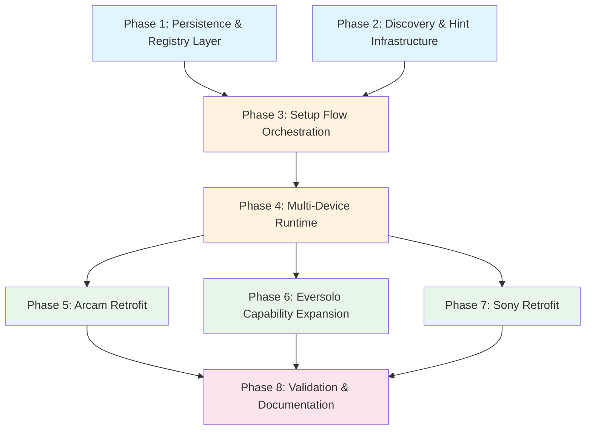

## Context

The integration quality review (`homelab/docs/integration-quality-review.md`) identified that all three UC integrations share a fundamental architectural flaw: they require a device host at startup and can only manage one device per process. The correct model for Unfolded Circle external integrations is remote-driven configuration where the integration starts empty, the Remote drives setup, and one process manages multiple devices for multiple Remotes.

Additionally, the Eversolo integration is significantly under-modeled (only power + media player) relative to the DMP-A8's actual API surface, and the Arcam integration over-promotes toggle operations.

This plan assumes the state-sync improvements plan (`2026-03-07`) has been completed first, meaning protocol envelopes, broadcast support, and the helper crate extraction are already done.

## Success Criteria

By the end of this work:

- All integrations start without required `--host`; CLI host args become optional seed hints
- The UC Remote can configure devices through the setup flow without restarting the process
- A single integration process manages multiple physical devices simultaneously
- Multiple Remotes can connect and each get their own device assignments
- Device identity is persisted across restarts (no lost configuration on reboot)
- Eversolo exposes routing, brightness, VU/spectrum modes, power options, and device metadata
- Arcam uses discrete on/off as primary; toggle is demoted or removed
- Sony follows the same runtime model as Arcam and Eversolo
- Entity IDs are derived from stable device identity, not ephemeral startup order

## Dependency Graph



**Parallel opportunities:** Phases 1 and 2 are independent. Phases 5, 6, and 7 are independent after Phase 4.

---

## Phase 1: Persistence & Registry Layer

**Goal:** Add persistent storage for device and remote assignment state to the helper crate.

**Why first:** Every subsequent phase depends on being able to persist and load device/remote state.

### 1.1 Define Registry Data Model

Add to `homelab/unfolded-integration-helper/src/registry.rs`:

```rust
/// A device the server has discovered, validated, or been told about.
/// Not necessarily assigned to any Remote.
pub struct KnownDevice {
    /// Stable identity (e.g., MAC address, serial, or model+host fingerprint)
    pub device_id: String,
    /// How this device was found
    pub source: DiscoverySource,
    /// Transport address
    pub host: String,
    pub port: u16,
    /// Device metadata resolved during validation
    pub metadata: DeviceMetadata,
    /// When this device was last successfully validated
    pub last_validated: Option<DateTime<Utc>>,
}

pub enum DiscoverySource {
    /// Operator passed --host or a seed file
    CliHint,
    /// Found via network scan
    NetworkScan,
    /// Configured through Remote setup flow
    RemoteSetup,
    /// Loaded from persisted state
    Persisted,
}

/// Resolved device identity and capabilities.
pub struct DeviceMetadata {
    pub model: Option<String>,
    pub friendly_name: Option<String>,
    pub firmware: Option<String>,
    pub mac_address: Option<String>,
    /// Integration-specific extra fields (e.g., ableRemoteBoot, wif_mac)
    pub extras: HashMap<String, Value>,
}

/// A concrete device instance the server can poll and control.
pub struct ConfiguredDevice {
    pub device_id: String,
    pub device_name: String,
    pub host: String,
    pub port: u16,
    pub metadata: DeviceMetadata,
    /// Integration-specific config (e.g., WOL params for Eversolo)
    pub driver_config: HashMap<String, Value>,
}

/// A binding between a Remote and configured device instances.
pub struct RemoteAssignment {
    pub remote_id: String,
    pub device_ids: Vec<String>,
}
```

### 1.2 Implement Persistent Registry

Add `homelab/unfolded-integration-helper/src/persistent_registry.rs`:

- **Storage format:** JSON file at a configurable path (default: `$XDG_DATA_HOME/<driver-id>/registry.json` or `/data/<driver-id>/registry.json` for Docker)
- **Operations:**
  - `load()` — Read from disk, return empty registry if file missing
  - `save()` — Atomic write (write to tmp, rename)
  - `add_known_device(device)` — Upsert by device_id
  - `remove_known_device(device_id)`
  - `add_configured_device(device)` — Upsert by device_id
  - `remove_configured_device(device_id)` — Also removes from all assignments
  - `assign_device(remote_id, device_id)` — Fails if already assigned to that Remote
  - `unassign_device(remote_id, device_id)`
  - `get_configured_devices()` → Vec<ConfiguredDevice>
  - `get_assigned_devices(remote_id)` → Vec<ConfiguredDevice>
  - `is_assigned(remote_id, device_id)` → bool
- **Concurrency:** Wrap in `Arc<RwLock<>>` for async access
- **Migration:** If no registry file exists but `--host` was passed, auto-create a seed entry

### 1.3 Add Data Path CLI Argument

All integration binaries gain:
- `--data-dir <PATH>` — Override default persistence directory
- Default: platform-appropriate data dir derived from driver ID

### 1.4 Tests

- Round-trip: save → load preserves all fields
- Duplicate assignment prevention: assign same device to same remote twice fails
- Remove configured device cascades to assignments
- Empty registry loads cleanly
- Atomic write: interrupted save does not corrupt existing file

---

## Phase 2: Discovery & Hint Infrastructure

**Goal:** Add bounded async device discovery that works across all integrations.

**Why parallel with Phase 1:** Discovery is independent of persistence; they converge in Phase 3.

### 2.1 Discovery Trait

Add to `homelab/unfolded-integration-helper/src/discovery.rs`:

```rust
#[async_trait]
pub trait DeviceDiscovery: Send + Sync {
    /// Probe a single host and validate device identity.
    /// Returns None if the host is not a valid device of this type.
    async fn validate_host(
        &self,
        host: &str,
        port: u16,
        timeout: Duration,
    ) -> Option<DeviceMetadata>;

    /// Scan a list of candidate addresses.
    /// Returns validated devices found.
    async fn scan_candidates(
        &self,
        candidates: Vec<(String, u16)>,
        timeout: Duration,
        max_concurrent: usize,
    ) -> Vec<KnownDevice>;
}
```

### 2.2 Device-Specific Discovery Implementations

**Eversolo discovery** (`eversolo-integration/src/discovery.rs`):
- Probe TCP 9529
- Validate with `GET /ZidooControlCenter/getModel`
- Extract: model, firmware, ip, net_mac, wif_mac, ableRemoteBoot

**Arcam discovery** (`arcam-amp-integration/src/discovery.rs`):
- Probe TCP 50000
- Validate with system-status query
- Extract: model, friendly_name, ip, amplifier_mode

**Sony discovery** (`sony-receiver-integration/src/discovery.rs`):
- Probe TCP 10000 and/or HTTP 80
- Validate with JSON-RPC `getSystemInformation` or native web status
- Extract: model, serial, mac

### 2.3 Candidate Generation

Add to `homelab/unfolded-integration-helper/src/discovery.rs`:

```rust
/// Build a candidate list from multiple sources, ordered by priority.
pub fn build_candidate_list(
    persisted_known: &[KnownDevice],
    cli_hints: &[(String, u16)],
    explicit_cidrs: &[IpNetwork],
    include_local_subnet: bool,
) -> Vec<(String, u16)>
```

Priority order:
1. Previously validated persisted devices (fastest — just re-validate)
2. CLI hint addresses
3. Explicit CIDR scans
4. Local subnet scan (only if `include_local_subnet` is true)

### 2.4 Bounded Scan Helper

```rust
/// Scan candidates with concurrency limit and total timeout.
pub async fn bounded_scan<D: DeviceDiscovery>(
    discovery: &D,
    candidates: Vec<(String, u16)>,
    per_host_timeout: Duration,
    total_timeout: Duration,
    max_concurrent: usize,
) -> Vec<KnownDevice>
```

- Uses `tokio::time::timeout` for total bound
- Uses `futures::stream::iter(...).buffer_unordered(max_concurrent)` for concurrency
- Gracefully returns partial results if total timeout fires

### 2.5 Tests

- Validate host returns None for non-responding address
- Scan with 0 candidates returns empty
- Total timeout cancels in-progress scans
- Candidate list deduplicates addresses from multiple sources

---

## Phase 3: Setup Flow Orchestration

**Goal:** Implement the UC setup_data_schema and setup flow so Remotes can configure devices.

**Depends on:** Phase 1 (registry) and Phase 2 (discovery).

### 3.1 Setup Data Schema Builder

Add to `homelab/unfolded-integration-helper/src/setup.rs`:

```rust
/// Build setup_data_schema for device selection/entry.
pub fn device_selection_schema(
    discovered_devices: &[KnownDevice],
    configured_devices: &[ConfiguredDevice],
    remote_id: &str,
    assignments: &[RemoteAssignment],
) -> Value
```

The schema should present:
- **Dropdown:** List of discovered + previously known devices (excluding already-assigned to this Remote)
- **Manual entry field:** Host address for devices not in the list
- **Device name field:** User-facing name override

### 3.2 Setup Flow State Machine

```rust
pub enum SetupState {
    /// Waiting for Remote to initiate setup
    WaitingForSetup,
    /// Discovery running, will present candidates
    Discovering,
    /// Showing device selection to user
    DeviceSelection { candidates: Vec<KnownDevice> },
    /// Validating user's selection
    Validating { host: String, port: u16 },
    /// Setup complete
    Complete,
    /// Setup failed
    Error(String),
}
```

Handle UC messages:
- `setup_driver` with `state: SETUP` → Begin discovery, transition to Discovering
- `setup_driver` with `state: WAIT_USER_ACTION` + user data → Validate selection
- `setup_driver` with `state: OK` → Persist configured device + assignment, transition to Complete

### 3.3 Setup Flow Message Handlers

Add to helper envelope module:

- `setup_data_schema_response(id, schema)` — Return setup form definition
- `setup_progress_event(state)` — Notify Remote of setup progress
- `setup_complete_event()` — Signal setup finished
- `setup_error_event(message)` — Signal setup failure

### 3.4 Integration Handler Wiring

Each integration's `handle_message` gains:
- `get_driver_metadata` → Include `setup_data_schema` in response
- `setup_driver` → Route to setup flow state machine
- After setup completes: register new device in runtime, start polling it, advertise its entities

### 3.5 Tests

- Full setup flow: initiate → discover → select → validate → complete
- Setup with manual address entry
- Setup rejects already-assigned device for same Remote
- Setup persists device and assignment
- Setup failure does not corrupt existing state
- Multiple Remotes can independently set up devices

---

## Phase 4: Multi-Device Runtime

**Goal:** Refactor integration handlers to manage multiple devices dynamically.

**Depends on:** Phase 3.

### 4.1 Device Manager Abstraction

Add to `homelab/unfolded-integration-helper/src/device_manager.rs`:

```rust
pub struct DeviceManager<D: DeviceDriver> {
    registry: Arc<RwLock<PersistentRegistry>>,
    devices: Arc<RwLock<HashMap<String, ActiveDevice<D>>>>,
    connectivity: Arc<RwLock<ConnectivityTracker>>,
    states: Arc<RwLock<StateCache>>,
    subscriptions: SubscriptionRegistry,
}

/// Per-device runtime state.
struct ActiveDevice<D: DeviceDriver> {
    config: ConfiguredDevice,
    driver: D,
    poll_handle: JoinHandle<()>,
}

/// Integration-specific device driver.
#[async_trait]
pub trait DeviceDriver: Send + Sync + 'static {
    type Config: Send + Sync;

    /// Build entities for this device.
    fn build_entities(&self, device: &ConfiguredDevice) -> Vec<Entity>;

    /// Fetch current device state.
    async fn fetch_snapshot(&self, config: &Self::Config, timeout: Duration)
        -> Result<Vec<EntityUpdate>>;

    /// Execute a command against the device.
    async fn execute_command(
        &self,
        config: &Self::Config,
        entity_kind: &str,
        cmd_id: &str,
        params: Option<Value>,
        timeout: Duration,
    ) -> Result<Vec<EntityUpdate>>;
}
```

### 4.2 Dynamic Device Lifecycle

`DeviceManager` methods:
- `add_device(config)` — Create driver, start polling, register entities
- `remove_device(device_id)` — Stop polling, remove entities, update connectivity
- `refresh_device(device_id)` — On-demand refresh
- `handle_entity_command(entity_id, cmd_id, params)` — Route to correct device by entity_id prefix
- `get_all_entities()` — Aggregate from all active devices
- `get_all_states()` — Aggregate from all device state caches

Entity ID format: `{driver}.{device_name}.{entity_kind}` — unchanged from current pattern, but `device_name` comes from `ConfiguredDevice.device_name` instead of CLI arg.

### 4.3 Startup Flow Refactor

All integrations change from:
```
parse --host → build one device → start polling → serve
```
To:
```
parse optional --host/--data-dir → load registry → start devices from persisted config
→ if --host provided and not in registry, add as seed → serve (accept setup requests)
```

### 4.4 Per-Device Connectivity

Extend `ConnectivityTracker` (or replace):
- Track state per `device_id`, not per arbitrary key
- `aggregate_state()` remains: CONNECTED if any device connected
- Add `device_states()` → HashMap<device_id, ConnectivityState> for setup UI

### 4.5 Make `--host` Optional

All three integration CLIs:
- `--host` becomes `Option<String>` instead of required
- If provided, treated as a seed hint: validate → add to known devices → auto-configure if valid
- If not provided, start with zero devices (purely remote-configured)

### 4.6 Tests

- Start with zero devices, add one via `add_device`, verify entities appear
- Add two devices, verify both polled independently
- Remove device, verify polling stops and entities removed
- Entity command routes to correct device
- `--host` seed: starts with one pre-configured device
- No `--host`: starts empty, serves metadata, accepts setup

---

## Phase 5: Arcam Retrofit

**Goal:** Migrate Arcam to the new runtime and fix toggle promotion.

**Depends on:** Phase 4. **Parallel with:** Phases 6 and 7.

### 5.1 Implement ArcamDeviceDriver

Create `arcam-amp-integration/src/driver.rs` implementing `DeviceDriver`:

- `build_entities()` — Power switch + mute switch (from current `types.rs`)
- `fetch_snapshot()` — Query power + mute state (from current `dispatch.rs`)
- `execute_command()` — Route to power/mute operations (from current `dispatch.rs`)

### 5.2 Implement ArcamDiscovery

Wire up the discovery trait from Phase 2 with the TCP probe + system-status validation.

### 5.3 Demote Toggle

- Remove `toggle` from the `features` list of both power and mute switch entities
- Keep the toggle code path in `execute_command` as a fallback only if the UC UI sends `toggle` anyway
- Primary features: `on_off` only

### 5.4 Add Identity Metadata

Add a read-only sensor or resource entity per device:
- Entity ID: `arcam.{name}.info`
- Entity type: `sensor` (string type)
- Attributes: model, friendly_name, ip_address, amplifier_mode
- Updated on each refresh cycle

### 5.5 Migrate main.rs

- Replace static device map with `DeviceManager<ArcamDeviceDriver>`
- Route `handle_message` through DeviceManager
- `--host` optional, `--data-dir` added

### 5.6 Tests

- Driver builds correct entities for a configured device
- Toggle removed from feature lists
- Discrete on/off remain functional
- Identity metadata populated from system-status response
- Multi-device: two Arcam amps, independent state

---

## Phase 6: Eversolo Capability Expansion

**Goal:** Migrate Eversolo to the new runtime and expose the full API surface.

**Depends on:** Phase 4. **Parallel with:** Phases 5 and 7.

### 6.1 Implement EversoloDeviceDriver

Create `eversolo-integration/src/driver.rs` implementing `DeviceDriver`:

- `build_entities()` — All entities (expanded, see 6.3)
- `fetch_snapshot()` — Partial-domain refresh (see 6.4)
- `execute_command()` — Route to all operations (expanded)

### 6.2 Auto-Resolve MAC and Wake Metadata

During discovery/validation (`validate_host`):
- Call `GET /ZidooControlCenter/getModel`
- Store `net_mac`, `wif_mac`, `ableRemoteBoot` in `DeviceMetadata.extras`
- WOL config auto-derived: use `net_mac` unless `wif_mac` is non-zero and net_mac is absent
- `--mac` CLI arg becomes expert override only (stored in `driver_config`)

### 6.3 Expanded Entity Model

Per configured device, expose these entities:

| Entity ID | Type | Features | Notes |
|-----------|------|----------|-------|
| `eversolo.{name}.power` | switch | on_off | Discrete only, no toggle |
| `eversolo.{name}.player` | media_player | volume, volume_up_down, mute, unmute, mute_toggle, play_pause, next, previous, select_source, media_duration, media_position, media_title, media_artist, media_album | Existing, improved state mapping |
| `eversolo.{name}.input` | select | select_source | Input routing selector |
| `eversolo.{name}.output` | select | select_source | Output routing selector (respects enabled/disabled) |
| `eversolo.{name}.screen_brightness` | light | on_off, dim | Numeric range from device |
| `eversolo.{name}.knob_brightness` | light | on_off, dim | Numeric range from device |
| `eversolo.{name}.vu_mode` | select | select_source | 14 VU modes as enumeration |
| `eversolo.{name}.spectrum_mode` | select | select_source | 4 spectrum modes as enumeration |
| `eversolo.{name}.info` | sensor | (read-only) | Model, firmware, IP, MAC |

**Power options** (poweroff, reboot, screen, timeshutdown):
- Expose as `button` entities: `eversolo.{name}.poweroff`, `eversolo.{name}.reboot`, `eversolo.{name}.screen_toggle`, `eversolo.{name}.sleep_timer`
- Each is a press-to-execute action

### 6.4 Partial-Domain Refresh

Split `fetch_snapshot` into independent domains that degrade separately:

```rust
pub struct EversoloSnapshot {
    pub identity: Result<IdentityData>,
    pub playback: Result<PlaybackData>,
    pub volume: Result<VolumeData>,
    pub routing: Result<RoutingData>,
    pub display: Result<DisplayData>,
}
```

Each domain failure updates only its own entities to error/unknown state. Other domains remain current.

### 6.5 Improved Playback State Mapping

Research and codify Eversolo state values:
- `state: 0` — Stopped/idle (not playing, not paused)
- `state: 1` — Playing
- `state: 2` — Paused
- Map to UC: `STANDBY`/`ON` (0), `PLAYING` (1), `PAUSED` (2)
- Keep metadata separate from transport state (don't collapse to generic ON)

### 6.6 Volume Debounce

Add a per-device volume debounce layer:
- Coalesce rapid `volume_set` commands within a configurable window (default: 100ms)
- Only send the final value to the device
- Skip state refetch during active slider movement (use optimistic state)
- Resume normal refresh after debounce window expires

### 6.7 Output Routing

- Fetch output list from `getInputAndOutputList`
- Build `select` entity with available outputs
- Respect `enable` field — only offer enabled outputs
- Handle `setOutput` command

### 6.8 Brightness Controls

- Fetch current values from `getScreenBrightness` / `getKnobBrightness`
- Model as `light` entity with dim feature
- Range: 0-100 (map from device's actual range)
- Commands: `setBrightness` / `setKnobBrightness`

### 6.9 VU and Spectrum Mode Controls

- Fetch mode lists from `getVUModeList` / `getSpPlayModeList`
- Model as `select` entities
- Options populated dynamically from device response
- Commands: `setVUMode` / `setSpPlayMode`

### 6.10 Tests

- Partial refresh: playback failure does not affect routing entities
- Auto MAC resolution from getModel response
- All new entity types build correctly
- Volume debounce: rapid commands coalesced
- Output list respects enabled/disabled filter
- Brightness mapped to/from device range
- State mapping: 0→STANDBY, 1→PLAYING, 2→PAUSED

---

## Phase 7: Sony Retrofit

**Goal:** Migrate Sony to the same runtime model.

**Depends on:** Phase 4. **Parallel with:** Phases 5 and 6.

### 7.1 Implement SonyDeviceDriver

Create `sony-receiver-integration/src/driver.rs` implementing `DeviceDriver`:
- Reuse existing dispatch logic
- `build_entities()` from current `types.rs`
- `fetch_snapshot()` from current `dispatch.rs`
- `execute_command()` from current `dispatch.rs`

### 7.2 Implement SonyDiscovery

- Probe TCP 10000 (JSON-RPC) and/or HTTP 80 (native API)
- Validate with `getSystemInformation`
- Extract: model, serial, MAC

### 7.3 Migrate main.rs

- Same pattern as Arcam: `DeviceManager<SonyDeviceDriver>`
- `--host` optional, `--data-dir` added
- Startup loads from registry

### 7.4 Tests

- Driver builds correct entities
- Discovery validates Sony device
- Multi-device: two Sony receivers, independent state
- Setup flow end-to-end

---

## Phase 8: Validation & Documentation

**Goal:** End-to-end validation and documentation updates.

**Depends on:** Phases 5, 6, and 7.

### 8.1 Integration Tests

For each integration, write end-to-end WebSocket tests:
- Connect → get_driver_metadata (includes setup_data_schema) → verify schema
- Setup flow: initiate → select device → validate → complete → verify entities appear
- Multi-device: configure two devices, verify both have entities and independent state
- Multi-remote: two WebSocket clients, each sets up different devices
- Entity commands: verify routing to correct device
- Reconnect: restart integration, verify persisted devices auto-resume

### 8.2 Real-Device Smoke Tests

Update `just sanity-test` recipes:
- Fix the test filter issue noted in the quality review (destructive test name matching)
- Add registry-based smoke tests (configure real device via setup flow)
- Verify expanded Eversolo entities against live DMP-A8

### 8.3 Documentation Updates

- Update each integration's README with new CLI args and setup flow description
- Update `create-integration` command template to use new runtime pattern
- Update helper crate README with registry, discovery, and setup flow documentation
- Update `homelab/docs/integration-quality-review.md` with completion notes

### 8.4 Justfile Updates

- Add `just setup-test` recipes for setup flow validation
- Ensure `just test` covers all new unit tests
- Ensure `just lint` passes with expanded codebase

---

## Risk Mitigations

### High Risk

**Multi-device concurrency:** Multiple devices polled and commanded simultaneously could create state races.
- *Mitigation:* Each device gets its own `ActiveDevice` with independent state. No shared mutable state between devices except the aggregate `StateCache` (which is per-entity-id, naturally partitioned).

**Persistence migration:** Existing deployments have no registry file.
- *Mitigation:* If `--host` is provided and no registry exists, auto-seed. If neither exists, start empty. Never fail to start due to missing persistence.

**Setup flow protocol compliance:** UC setup flow has specific state machine expectations.
- *Mitigation:* Test against the `uc_api` crate's type definitions. Reference `homelab/docs/unfolded-circle/integrations.md` and `api-model-rs.md` for exact message formats. Build a shared test harness that simulates the Remote's side of the setup conversation.

### Medium Risk

**Discovery timing:** Network scans may be slow or unreliable on routed networks.
- *Mitigation:* Total timeout bound. Persisted devices validated first (fast path). Manual entry always available. Discovery never blocks serving.

**Entity ID stability:** Changing from CLI device name to registry device name could break existing Remote configs.
- *Mitigation:* If `--host` seed creates a device, use the existing `--device-name` as the device_name. For new devices via setup flow, derive from model+host.

**Eversolo API edge cases:** Some endpoints may behave differently across firmware versions.
- *Mitigation:* Partial-domain refresh means one failing endpoint doesn't collapse everything. Log warnings for unexpected responses.

**Remote dedup semantics:** The exact "already assigned" check needs to match UC Remote expectations.
- *Mitigation:* Start strict (same device_id → reject). Relax if UC protocol allows re-binding.
