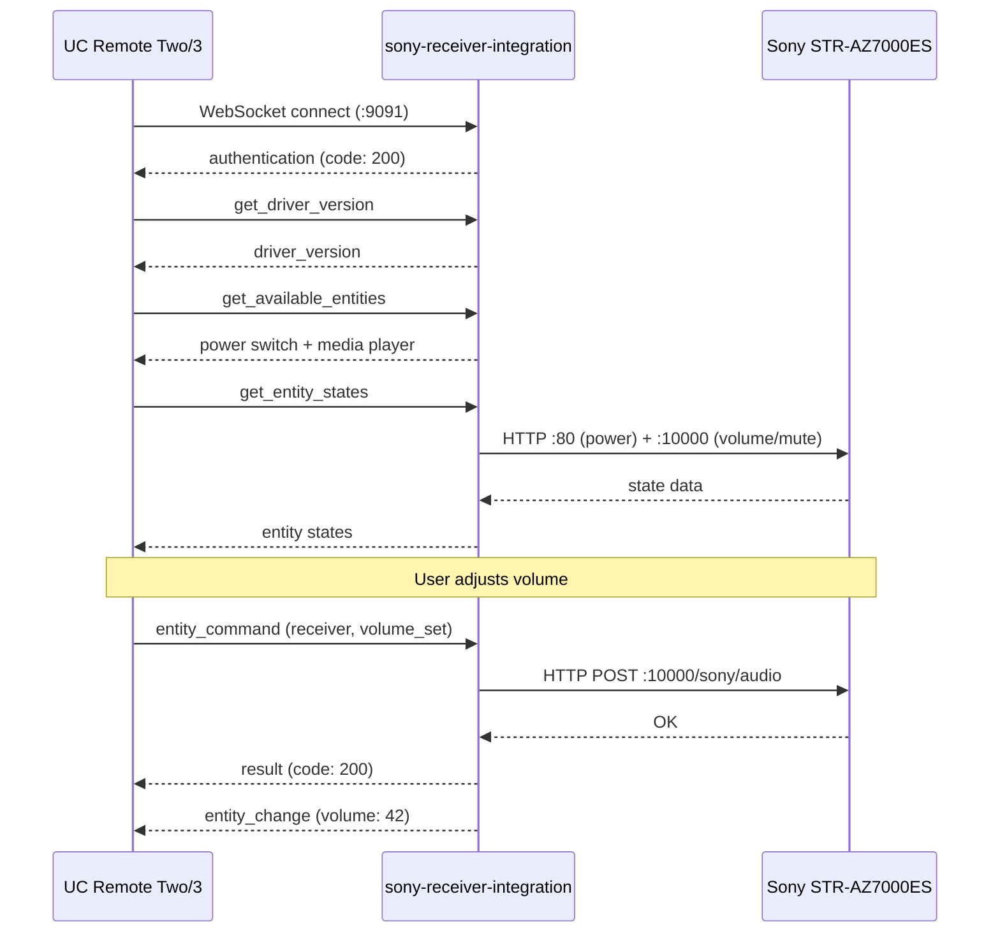

# sony-receiver-integration

Unfolded Circle integration driver for Sony ES AV receivers (STR-AZ7000ES and similar models with the JSON-RPC and Native Web APIs).

## What It Does

This is a standalone WebSocket server that speaks the [Unfolded Circle Integration protocol](https://unfoldedcircle.github.io/core-api/integration/). When a UC Remote Two or Remote 3 connects, the driver exposes a Sony receiver as a power switch and a media player entity with volume, mute, and input source selection.

### Entities

| Entity ID | Type | Features | Commands |
|-----------|------|----------|----------|
| `sony.{name}.power` | switch | on_off, toggle | on, off, toggle |
| `sony.{name}.receiver` | media_player | volume, volume_up_down, mute, mute_toggle, select_source | volume_set, volume_up, volume_down, mute, unmute, mute_toggle, select_source |

The `{name}` comes from the `--device-name` flag (default: `receiver`).

### Source Categories

The media player's `select_source` command accepts these categories, which map to the receiver's native input configuration:

| Category | Default Name | Description |
|----------|-------------|-------------|
| `GAME` | GAME | Gaming input |
| `STB` | MEDIA BOX | Set-top box / streaming device |
| `BD` | BD/DVD | Blu-ray / DVD player |
| `SAT` | SAT/CATV | Satellite / cable TV |
| `VIDEO` | VIDEO | Generic video input |
| `AUX` | AUX | Auxiliary input |
| `TV` | TV | Television (ARC/eARC) |
| `CD` | SA-CD/CD | Audio disc player |

Categories are resolved to HDMI URIs at runtime by querying the receiver's native input configuration.

### How It Works



### Transport

The integration uses **two** Sony HTTP APIs:

- **JSON-RPC** (port 10000): Volume, mute, input switching, power on/off
- **Native Web API** (port 80): Accurate power status, input configuration

The JSON-RPC `getPowerStatus` is broken when Network Standby is enabled (always returns "active"). The Native Web API on port 80 correctly reports power state. See the [Sony receiver docs](../docs/sony-receiver/sony-str-az7000es.md) for details.

## Running as an External Integration

Run the integration on any machine that can reach both the UC Remote and the Sony receiver on your network.

```bash
# Build
cargo build -p sony-receiver-integration --release

# Run
sony-receiver-integration --host 192.168.1.120 --device-name living
```

### CLI Options

| Flag | Default | Description |
|------|---------|-------------|
| `--listen` | `0.0.0.0:9091` | WebSocket listen address |
| `--host` | *(required)* | Sony receiver IP or hostname |
| `--port` | `10000` | Sony JSON-RPC port |
| `--device-name` | `receiver` | Name used in entity IDs |
| `--timeout` | `10` | HTTP operation timeout (seconds) |
| `--poll-interval` | `5` | Background poll interval in seconds |

### Authentication

Set the `UCR_INTEGRATION_TOKEN` environment variable to require token-based authentication on the WebSocket connection.

```bash
UCR_INTEGRATION_TOKEN=my-secret sony-receiver-integration --host 192.168.1.120
```

### Registering on the Remote

In the UC Web Configurator:

1. Go to **Integrations & Docks** > **+** > **Add external integration**
2. Enter the IP and port where the driver is running (e.g., `192.168.1.50:9091`)
3. If using authentication, enter the token
4. The Remote connects and discovers the power switch and media player entities

## Key Dependencies

- `homelab` -- Sony receiver JSON-RPC and Native Web API implementation
- `schematic-schema` -- UC Integration WebSocket host (`WsHandler` trait, auth, connection management)
- `tokio` -- Async runtime
- `clap` -- CLI argument parsing

## State Synchronization

- `get_entity_states` refreshes power, volume, mute, and the advertised UC `source` value together before responding.
- A background poll loop diffs the refreshed snapshot against the keyed cache and emits `entity_change` for subscribed clients when those attributes change outside the UC Remote.
- `device_state` is driven by refresh success or failure. If the receiver cannot be queried, the integration marks it disconnected and updates cached entity states to a stable `UNKNOWN` schema instead of continuing to present stale data as fresh.
- Power commands are followed by a full receiver refresh so the `power` switch and `receiver` media-player entity stay aligned.

## Limitations

- **Single connection**: The Sony receiver only accepts one concurrent TCP connection per API port. The integration opens and closes connections per request to avoid blocking other clients.
- **Power status quirk**: Uses the Native Web API (port 80) for power status because the JSON-RPC API is unreliable with Network Standby enabled.
- **Volume step size**: Volume up/down increments by 1 unit per command. The receiver's volume range is 0-100.

## Lessons Learned

- The UC Integration protocol requires the **driver to be the WebSocket server** and the Remote to be the client.
- `entity_command` returns a synchronous UC `result` envelope. Cache diffs are pushed separately as `entity_change` events.
- Sony receivers need `pool_max_idle_per_host(0)` to prevent connection conflicts.
