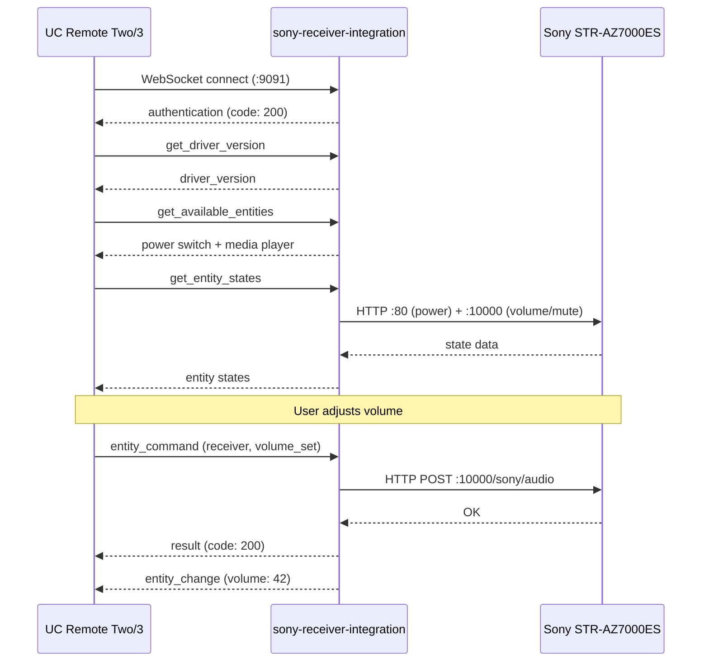

# sony-receiver-integration

Unfolded Circle integration driver for Sony ES AV receivers (STR-AZ7000ES and similar models with the JSON-RPC and Native Web APIs).

## What It Does

This is a standalone WebSocket server that speaks the [Unfolded Circle Integration protocol](https://unfoldedcircle.github.io/core-api/integration/). When a UC Remote Two or Remote 3 connects, the driver exposes a Sony receiver as a power switch and a media player entity with volume, mute, and input source selection.

The integration also answers the configurator metadata flow (`get_driver_version` and `get_driver_metadata`) including `setup_data_schema`, so a Remote can configure the receiver through the integration protocol after discovery.

### Entities

| Entity ID | Type | Features | Commands |
|-----------|------|----------|----------|
| `sony.{name}.power` | switch | on_off | on, off, toggle |
| `sony.{name}.receiver` | media_player | volume, volume_up_down, mute, mute_toggle, select_source | volume_set, volume_up, volume_down, mute, unmute, mute_toggle, select_source |

The `{name}` comes from the configured device instance. `--device-name` is only a seed default for CLI hints (default: `receiver`).

### Source Categories

The media player's `select_source` command advertises only categories that resolve against the receiver's current native input configuration:

| Category | Default Name | Description |
|----------|-------------|-------------|
| `GAME` | GAME | Gaming input |
| `STB` | MEDIA BOX | Set-top box / streaming device |
| `BD` | BD/DVD | Blu-ray / DVD player |
| `SAT` | SAT/CATV | Satellite / cable TV |
| `VIDEO` | VIDEO | Generic video input |
| `AUX` | AUX | Auxiliary input |
| `TV` | TV | Television (ARC/eARC) |
| `CD` | SA-CD/CD | Audio disc player |

Categories are resolved to HDMI URIs at runtime by querying the receiver's native input configuration.

### How It Works



### Transport

The integration uses **two** Sony HTTP APIs:

- **JSON-RPC** (port 10000): Volume, mute, input switching, power on/off
- **Native Web API** (port 80): Accurate power status, input configuration

The JSON-RPC `getPowerStatus` is broken when Network Standby is enabled (always returns "active"). The Native Web API on port 80 correctly reports power state. See the [Sony receiver docs](../docs/sony-receiver/sony-str-az7000es.md) for details.

## Running as an External Integration

Run the integration on any machine that can reach both the UC Remote and the Sony receiver on your network.

```bash
# Build
cargo build -p sony-receiver-integration --release

# Run
sony-receiver-integration --host 192.168.1.120 --device-name living
```

### CLI Options

| Flag | Default | Description |
|------|---------|-------------|
| `--listen` | `0.0.0.0:9091` | WebSocket listen address |
| `--host` | *(optional seed hint)* | Sony receiver IP or hostname |
| `--port` | `10000` | Sony JSON-RPC port |
| `--device-name` | `receiver` | Name used in entity IDs |
| `--timeout` | `10` | HTTP operation timeout (seconds) |
| `--poll-interval` | `5` | Background poll interval in seconds |
| `--mdns` | `false` | Advertise `_uc-integration._tcp.local.` for UC auto-discovery |

### Authentication

Set the `UCR_INTEGRATION_TOKEN` environment variable to require token-based authentication on the WebSocket connection.

```bash
UCR_INTEGRATION_TOKEN=my-secret sony-receiver-integration --host 192.168.1.120
```

### Registering on the Remote

In the UC Web Configurator:

1. Go to **Integrations & Docks** > **+** > **Add external integration**
2. Enter the IP and port where the driver is running (e.g., `192.168.1.50:9091`)
3. If using authentication, enter the token
4. The Remote completes the setup flow and binds the power switch and media player entities for the selected receiver

### mDNS Auto-Discovery

If you start the driver with `--mdns`, it advertises `_uc-integration._tcp.local.` so the UC configurator can discover it on the local subnet.

```bash
sony-receiver-integration --host 192.168.1.120 --device-name living --mdns
```

Discovery notes:

- mDNS makes the integration visible to the configurator
- the configurator still opens the WebSocket session and asks for `driver_metadata`
- a driver can therefore appear in the discovery list but still fail to open if its metadata flow is incomplete
- multicast-restricted networks may require manual host/port registration even though the integration itself is healthy

## Running with Docker

The Docker packaging uses a two-stage build: Rust-on-Alpine for compilation, then a small Alpine runtime with an entrypoint that maps environment variables to the integration's CLI flags.

### Docker Compose (Recommended)

The checked-in [docker-compose.yaml](docker-compose.yaml) uses `network_mode: host` so the container can reach the receiver on your LAN and the UC Remote can connect back to the WebSocket server.

```bash
cd homelab/sony-receiver-integration

# Minimum
SONY_HOST=192.168.1.120 docker compose up -d

# With all options
SONY_HOST=192.168.1.120 \
  DEVICE_NAME=living \
  LISTEN_PORT=9091 \
  SONY_PORT=10000 \
  TIMEOUT=10 \
  POLL_INTERVAL=5 \
  UCR_INTEGRATION_TOKEN=my-secret \
  RUST_LOG=debug \
  docker compose up -d
```

| Variable | Default | Description |
|----------|---------|-------------|
| `SONY_HOST` | *(required)* | Sony receiver IP or hostname |
| `SONY_PORT` | `10000` | Sony JSON-RPC port |
| `LISTEN_PORT` | `9091` | WebSocket listen port |
| `DEVICE_NAME` | `receiver` | Name used in entity IDs |
| `TIMEOUT` | `10` | Sony HTTP timeout (seconds) |
| `POLL_INTERVAL` | `5` | Background poll interval (seconds) |
| `UCR_INTEGRATION_TOKEN` | *(empty)* | Auth token for UC Remote |
| `RUST_LOG` | `info,mdns_sd::service_daemon=off` | Log filter override |

To enable mDNS in Docker, pass `--mdns` as an extra argument because the entrypoint forwards trailing args to the binary:

```bash
docker compose run --service-ports sony-receiver-integration --mdns
```

or set a `command: ["--mdns"]` override in your compose file.

### Docker Build Only

```bash
# Recommended from the integration directory
just build-image

# Or manually from the monorepo root
docker build -f homelab/sony-receiver-integration/Dockerfile -t sony-receiver-integration .

# Run with host networking and env-based entrypoint defaults
docker run --rm --network host sony-receiver-integration \
  -e SONY_HOST=192.168.1.120 \
  -e DEVICE_NAME=living
```

## Validation

From `homelab/sony-receiver-integration/`:

```bash
just install
just build-image
just sanity-test
just sanity-test-mutate
```

`sanity-test` requires `SONY_REAL_HOST` and optionally `SONY_REAL_PORT`. `sanity-test-mutate` additionally requires `SONY_REAL_ALLOW_DESTRUCTIVE=1`.

## Key Dependencies

- `homelab` -- Sony receiver JSON-RPC and Native Web API implementation
- `schematic-schema` -- UC Integration WebSocket host (`WsHandler` trait, auth, connection management)
- `tokio` -- Async runtime
- `clap` -- CLI argument parsing

## State Synchronization

- `get_entity_states` refreshes power, volume, mute, and the advertised UC `source` value together before responding.
- A background poll loop diffs the refreshed snapshot against the keyed cache and emits `entity_change` for subscribed clients when those attributes change outside the UC Remote.
- `device_state` is driven by refresh success or failure. If the receiver cannot be queried, the integration marks it disconnected and updates cached entity states to a stable `UNKNOWN` schema instead of continuing to present stale data as fresh.
- Power commands are followed by a full receiver refresh so the `power` switch and `receiver` media-player entity stay aligned.

## Limitations

- **Single connection**: The Sony receiver only accepts one concurrent TCP connection per API port. The integration opens and closes connections per request to avoid blocking other clients.
- **Power status quirk**: Uses the Native Web API (port 80) for power status because the JSON-RPC API is unreliable with Network Standby enabled.
- **Volume step size**: Volume up/down increments by 1 unit per command. The receiver's volume range is 0-100.

## Setup Notes

- Setup discovery now probes previously known devices plus the local IPv4 LAN instead of only revalidating registry entries.
- On very large subnets the scan is intentionally clamped to the interface's local `/24` slice so setup remains responsive.
- Startup no longer activates every persisted device at process start. Configured receivers stay in the registry and are activated lazily when a Remote assigns them or when setup binds a seed hint.
- The initial setup metadata stays valid when discovery returns no Sony candidates by omitting the selector and leaving manual host/device-name entry available.
- The dynamic setup screen sends initialized `setup_data` for every rendered field so manual host entry remains valid when no device is selected.
- When candidates exist, the selector uses the documented UC `select` field shape with `options` and `value`.

## Lessons Learned

- The UC Integration protocol requires the **driver to be the WebSocket server** and the Remote to be the client.
- `entity_command` returns a synchronous UC `result` envelope. Cache diffs are pushed separately as `entity_change` events.
- Sony receivers need `pool_max_idle_per_host(0)` to prevent connection conflicts.
- mDNS discovery and configurator compatibility are separate concerns. Discovery advertises the driver; `driver_metadata` is what lets the configurator open it cleanly.
- Default logs suppress malformed-packet noise from unrelated mDNS traffic on the LAN; restore `mdns_sd::service_daemon` logging in `RUST_LOG` only when debugging discovery.
