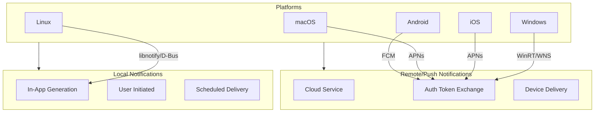
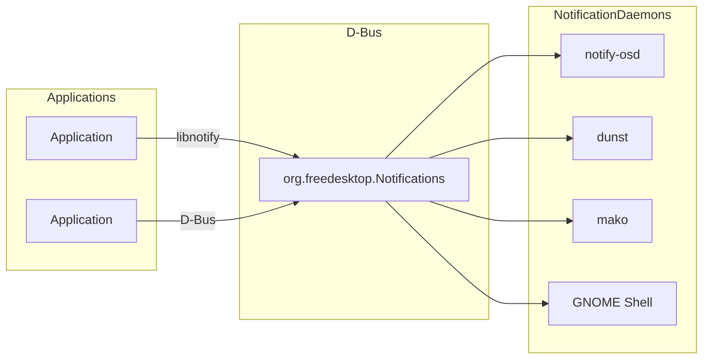
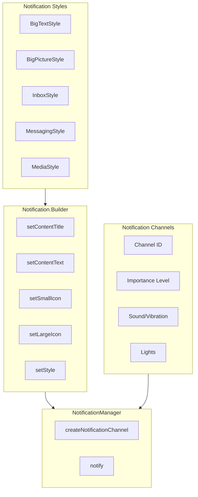
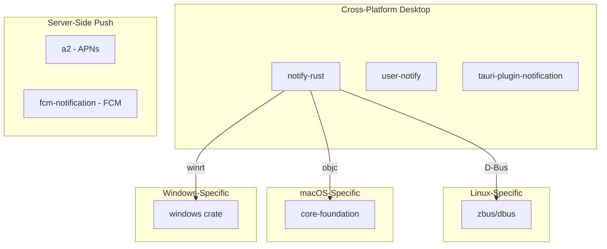

# Operating System Notification Systems: A Comprehensive Deep Dive

A detailed examination of notification APIs, authentication requirements, metadata capabilities, and Rust integration options across five major operating systems: macOS, Linux, Windows, iOS, and Android.

---

## Table of Contents

1. [Overview](#overview)
2. [macOS](#macos)
3. [Linux](#linux)
4. [Windows](#windows)
5. [iOS](#ios)
6. [Android](#android)
7. [Rust Crate Summary](#rust-crate-summary)
8. [Cross-Platform Comparison](#cross-platform-comparison)

---

## Overview

Modern operating systems provide sophisticated notification systems that allow applications to communicate with users in a non-intrusive manner. Each platform has evolved its own notification architecture, API design, and security model. Understanding these differences is crucial for developers building cross-platform applications or system-level tools.



---

## macOS

### API Overview

macOS provides two primary mechanisms for notifications, with the modern framework being the recommended approach:

| Framework                                                    | Status     | Introduced      | Use Case                                       |
| ------------------------------------------------------------ | ---------- | --------------- | ---------------------------------------------- |
| **User Notifications Framework** (`UserNotifications.framework`) | Active     | macOS 10.14+    | Primary API for local and remote notifications |
| **NSUserNotification**                                       | Deprecated | macOS 10.8-11.0 | Legacy API (removed in macOS 11+)              |

The [User Notifications framework](https://developer.apple.com/documentation/usernotifications) is the unified API that Apple introduced to provide consistent notification handling across iOS, macOS, watchOS, and tvOS. This framework allows developers to define notification types, configure custom actions, and handle user interactions with notifications.

The deprecated `NSUserNotification` class was previously the standard for macOS desktop notifications. Applications targeting modern macOS versions must migrate to the User Notifications framework, as `NSUserNotification` was completely removed in macOS 11.0 (Big Sur). The transition requires significant code changes because the new framework uses a different architecture based on request/response patterns rather than the old delegate-based model.

### Authentication Requirements

#### Local Notifications

Local notifications on macOS require minimal authentication. The application must request user authorization through `UNUserNotificationCenter.requestAuthorization(options:completionHandler:)`. The user can grant or deny permissions for various notification capabilities including alerts, sounds, and badge updates. This authorization model ensures user privacy by requiring explicit consent before an application can display notifications.

#### Remote Notifications (Push)

For remote notifications via Apple Push Notification service (APNs), macOS applications require authentication credentials configured through the Apple Developer portal. There are two authentication methods available for developers to establish secure connections with APNs:

**Token-Based Authentication (Recommended):**

- Uses a p8 private key file generated in the Apple Developer portal
- Requires Key ID and Team ID from the developer account
- Creates stateless JWT tokens for authentication
- Supports multiple apps with a single key
- Keys can be revoked and regenerated without app re-submission
- More scalable for server-side implementations

**Certificate-Based Authentication (Legacy):**

- Uses a .p12 certificate file exported from Keychain
- Requires annual renewal through Apple Developer portal
- Tied to specific app IDs
- More complex to manage across development teams

The [token-based connection](https://developer.apple.com/documentation/usernotifications/establishing-a-token-based-connection-to-apns) is now the preferred method due to its stateless nature and simplified key management workflow.

### Notification Properties and Metadata

#### System-Provided Properties

The notification system in macOS automatically provides several metadata properties that applications can access:

| Property                                | Type                  | Description                            |
| --------------------------------------- | --------------------- | -------------------------------------- |
| `date`                                  | Date                  | When the notification was delivered    |
| `request.identifier`                    | String                | Unique identifier for the notification |
| `response.actionIdentifier`             | String                | Identifier of the action user selected |
| `response.notification.request.content` | UNNotificationContent | The notification content               |

#### Developer-Configurable Properties

Developers have extensive control over notification content through the `UNMutableNotificationContent` class:

| Property             | Type                            | Description                                                  |
| -------------------- | ------------------------------- | ------------------------------------------------------------ |
| `title`              | String                          | Primary notification title (bold text)                       |
| `subtitle`           | String                          | Secondary title below the main title                         |
| `body`               | String                          | Main message content                                         |
| `badge`              | NSNumber                        | App icon badge count                                         |
| `sound`              | UNNotificationSound             | Custom or default sound                                      |
| `launchImageName`    | String                          | Launch image for app activation                              |
| `userInfo`           | Dictionary                      | Custom key-value data payload                                |
| `attachments`        | [UNNotificationAttachment]      | Media attachments                                            |
| `categoryIdentifier` | String                          | Category for action buttons                                  |
| `threadIdentifier`   | String                          | Groups related notifications                                 |
| `summaryArgument`    | String                          | Text for notification grouping summary                       |
| `interruptionLevel`  | UNNotificationInterruptionLevel | Delivery priority (.passive, .active, .timeSensitive, .critical) |

#### Image Support

macOS supports rich media attachments through `UNNotificationAttachment`. The system can display images, audio files, and short video clips directly in the notification banner. Supported formats include:

- **Images**: JPEG, GIF, PNG, HEIF (up to 10MB)
- **Audio**: AIFF, WAV, MP3, M4A (up to 5MB)
- **Video**: MPEG, MPG, AVI, MP4, QuickTime (up to 50MB)

For remote notifications, images must be downloaded using a Notification Service Extension. The extension intercepts the notification payload, downloads the media from a remote URL, and attaches it before display. This requires setting `mutable-content: 1` in the APNs payload and implementing the `UNNotificationServiceExtension` class.

#### Sound Effects

The notification system supports both default and custom sounds:

- **Default sound**: `UNNotificationSound.default`
- **Custom sounds**: `UNNotificationSound(named: UNNotificationSoundName)` for bundled sound files
- **System preference**: Users can disable notification sounds in System Preferences

Custom sounds must be bundled with the application and should be in AIFF, WAV, or CAF format. The sound file should be located in the app's bundle or the Library/Sounds directory of the app's container.

### Action Buttons and Categories

macOS supports interactive notifications with custom action buttons defined through `UNNotificationCategory` and `UNNotificationAction`. This enables users to respond to notifications without opening the application, providing a streamlined user experience for common actions.

```swift
// Define actions
let acceptAction = UNNotificationAction(identifier: "ACCEPT",
                                        title: "Accept",
                                        options: .foreground)
let declineAction = UNNotificationAction(identifier: "DECLINE",
                                          title: "Decline",
                                          options: .destructive)

// Create category with actions
let category = UNNotificationCategory(identifier: "INVITE",
                                      actions: [acceptAction, declineAction],
                                      intentIdentifiers: [],
                                      options: [])

// Register category
UNUserNotificationCenter.current().setNotificationCategories([category])
```

### Rust Crates for macOS Notifications

| Crate                         | Platform Support                    | Notes                                                        |
| ----------------------------- | ----------------------------------- | ------------------------------------------------------------ |
| **notify-rust**               | macOS, Linux, BSD                   | Uses native macOS APIs; cross-platform desktop notifications |
| **user-notify**               | macOS, Linux, Windows               | Simple library inspired by macOS UserNotifications           |
| **tauri-plugin-notification** | macOS, Windows, Linux, iOS, Android | Full Tauri plugin for notifications                          |

---

## Linux

### API Overview

Linux desktop notifications follow the [freedesktop.org Desktop Notifications Specification](https://specifications.freedesktop.org/notification/latest/protocol.html), a standardized protocol that ensures cross-desktop-environment compatibility. This specification defines a D-Bus interface that applications use to communicate with notification daemons.



The architecture consists of three main components:

1. **libnotify**: A desktop-independent library that provides a high-level API for sending notifications. It abstracts the D-Bus communication details, making it easy for developers to integrate notifications without understanding the underlying protocol.

2. **D-Bus**: The inter-process communication (IPC) system that handles message passing between applications and the notification daemon. The session bus is used for user-space notifications.

3. **Notification Daemons**: Desktop environment-specific services that receive notification requests via D-Bus and display them to the user. Different desktop environments have their own daemons (GNOME Shell, KDE Plasma, XFCE, etc.), and users can install alternative daemons like `dunst` or `mako` for customized notification experiences.

### Authentication Requirements

Linux notifications have no authentication requirements for local notifications. Any application running in the user's session can send notifications via D-Bus. This permissive model reflects the Unix philosophy of user-controlled systems, where the user has full authority over their session.

However, some notification daemons provide configuration options to:

- Filter notifications by application name
- Set per-application urgency levels
- Block specific notification types
- Configure display duration and position

The lack of authentication is intentional, as notifications are considered a session-level resource rather than a privileged system service. Security is achieved through user-controlled daemon configuration rather than application-level authentication.

### Notification Properties and Metadata

#### Standard Properties (freedesktop.org Specification)

The Desktop Notifications Specification defines the following parameters that can be included in a notification:

| Parameter        | Type       | Description                                               |
| ---------------- | ---------- | --------------------------------------------------------- |
| `app_name`       | String     | Name of the application sending the notification          |
| `replaces_id`    | UInt32     | ID of existing notification to replace                    |
| `app_icon`       | String     | Icon name or path for the notification                    |
| `summary`        | String     | Brief title/heading of the notification                   |
| `body`           | String     | Detailed notification content (supports HTML-like markup) |
| `actions`        | Array      | Action buttons for user interaction                       |
| `hints`          | Dictionary | Additional metadata hints                                 |
| `expire_timeout` | Int32      | Timeout in milliseconds (-1 for default, 0 for never)     |

#### Hints (Extended Metadata)

Hints provide additional metadata to notification servers. While servers are not required to implement all hints, they provide a way to specify platform-specific behaviors:

| Hint             | Type    | Description                                                  |
| ---------------- | ------- | ------------------------------------------------------------ |
| `urgency`        | Byte    | 0=low, 1=normal, 2=critical                                  |
| `category`       | String  | Notification category (e.g., "im.received", "email.arrived") |
| `desktop-entry`  | String  | Desktop file name for the application                        |
| `image-data`     | Binary  | Raw image data for notification icon                         |
| `image-path`     | String  | Path to image file                                           |
| `sound-file`     | String  | Path to sound file to play                                   |
| `sound-name`     | String  | Theme sound name                                             |
| `suppress-sound` | Boolean | Prevent sound from playing                                   |
| `resident`       | Boolean | Keep notification in history after action                    |
| `transient`      | Boolean | Don't store notification in history                          |
| `action-icons`   | Boolean | Use action names as icon names                               |

#### Image Support

Images in Linux notifications can be specified in several ways according to the specification:

1. **Named Icon**: Use a freedesktop.org icon name in the `app_icon` parameter
2. **Image Path**: Use the `image-path` hint with an absolute file path or URI
3. **Image Data**: Use the `image-data` hint with raw pixel data

The specification supports image data with the following format:

- Width and height in pixels
- Row stride (bytes per row)
- Bits per sample (typically 8)
- Channels (4 for RGBA)
- Raw pixel data in RGBA format

Different notification daemons may have varying levels of support for images. GNOME Shell and KDE Plasma have excellent image support, while some minimal daemons may only display icons.

#### Sound Effects

Sound support in Linux notifications is daemon-dependent:

- **Sound file**: The `sound-file` hint specifies an absolute path to a sound file
- **Sound name**: The `sound-name` hint uses a themed sound name (e.g., "message-new-instant")
- **Suppress sound**: The `suppress-sound` hint can silence a notification

Many modern notification daemons do not play sounds by default, delegating sound handling to the desktop environment's sound theme system or requiring explicit configuration.

### Notification Capabilities

Notification servers advertise their capabilities, which clients can query to determine supported features:

| Capability        | Description                             |
| ----------------- | --------------------------------------- |
| `action-icons`    | Supports using icons for action buttons |
| `actions`         | Supports action buttons                 |
| `body`            | Supports body text                      |
| `body-hyperlinks` | Supports hyperlinks in body text        |
| `body-images`     | Supports images in body text            |
| `body-markup`     | Supports HTML markup in body text       |
| `icon-multi`      | Supports multiple icons                 |
| `icon-static`     | Supports static icons                   |
| `persistence`     | Notifications persist until dismissed   |
| `sound`           | Supports sound hints                    |

### Rust Crates for Linux Notifications

| Crate           | Platform Support      | Notes                                            |
| --------------- | --------------------- | ------------------------------------------------ |
| **notify-rust** | Linux, BSD, macOS     | Pure Rust D-Bus client; primary choice for Linux |
| **user-notify** | Linux, macOS, Windows | Cross-platform with Linux D-Bus support          |
| **dbus**        | Linux                 | Low-level D-Bus crate for custom implementations |
| **zbus**        | Linux                 | Modern D-Bus crate with async support            |

The `notify-rust` crate is the recommended choice for most use cases, providing a pure Rust implementation of the D-Bus notification protocol without requiring external C libraries.

---

## Windows

### API Overview

Windows provides multiple notification APIs depending on the application type and deployment model:

| API                                          | Application Type | Notes                                       |
| -------------------------------------------- | ---------------- | ------------------------------------------- |
| **WinRT API** (`Windows.UI.Notifications`)   | UWP, WinUI 3     | Modern, recommended API                     |
| **Desktop Bridge**                           | Packaged Win32   | Uses WinRT APIs with package identity       |
| **Raw XML Toasts**                           | Any Win32 app    | Low-level approach without package identity |
| **Windows Push Notification Services (WNS)** | Remote/Push      | Cloud-based push notification service       |

The [Windows Push Notification Services (WNS)](https://learn.microsoft.com/en-us/windows/apps/develop/notifications/push-notifications/wns-overview) enables cloud services to send toast, tile, badge, and raw updates to Windows applications. WNS handles the complexity of maintaining a persistent connection to devices and provides a reliable delivery mechanism for time-sensitive notifications.

### Authentication Requirements

#### Local Notifications

For packaged applications (MSIX), local notifications require only that the application has the appropriate manifest declarations. The application must be signed with a valid certificate and have package identity.

For unpackaged Win32 applications, sending notifications requires:

- An App User Model ID (AUMID) registration
- A shortcut in the Start Menu with the AUMID
- The shortcut must be installed to the Start Menu for notifications to work

#### Remote Notifications (WNS)

Remote notifications via WNS require OAuth 2.0 authentication:

1. **Register the application** in the Microsoft Partner Center to obtain:

   - Package Security Identifier (SID)
   - Client Secret

2. **Obtain an access token** by POSTing credentials to the WNS endpoint:

   ```
   POST https://login.live.com/accesstoken.srf
   Content-Type: application/x-www-form-urlencoded
   
   grant_type=client_credentials&client_id={SID}&client_secret={secret}&scope=notify.windows.com
   ```

3. **Send notifications** using the access token in the Authorization header

The access token is valid for a limited time and must be refreshed periodically. Applications should implement token caching and refresh logic to maintain reliable notification delivery.

### Notification Properties and Metadata

Windows toast notifications use an XML schema that provides extensive customization options. The schema supports adaptive layouts that adjust to different screen sizes and notification contexts.

#### XML Structure

```xml
<toast launch="app-defined-string" activationType="foreground">
    <visual>
        <binding template="ToastGeneric">
            <text>Notification Title</text>
            <text>Notification body text</text>
            <image placement="appLogoOverride" src="icon.png"/>
            <image placement="hero" src="hero-image.png"/>
        </binding>
    </visual>
    <actions>
        <action content="Accept" arguments="accept" activationType="foreground"/>
        <action content="Decline" arguments="decline" activationType="background"/>
    </actions>
    <audio src="ms-winsoundevent:Notification.Default"/>
</toast>
```

#### Developer-Configurable Properties

| Property         | Element | Description                                   |
| ---------------- | ------- | --------------------------------------------- |
| `launch`         | toast   | Arguments passed to app on activation         |
| `activationType` | toast   | foreground, background, protocol, system      |
| `duration`       | toast   | short or long (for important notifications)   |
| `scenario`       | toast   | default, alarm, reminder, incomingCall        |
| `text`           | binding | Up to 3 text lines (title, body, attribution) |
| `image`          | binding | Icon, hero image, inline images               |
| `actions`        | toast   | Buttons, text inputs, selection menus         |
| `audio`          | toast   | Sound configuration                           |

#### Image Support

Windows toast notifications support multiple image placements:

| Placement         | Size    | Location                                 |
| ----------------- | ------- | ---------------------------------------- |
| `appLogoOverride` | 48x48   | Notification icon area                   |
| `hero`            | 364x180 | Large banner image (top of notification) |
| `inline`          | 364x180 | Inline image within notification body    |

Images can be specified using:

- Local file paths (packaged apps)
- `ms-appx://` URIs for packaged resources
- HTTP/HTTPS URLs (downloaded and cached)
- `ms-appdata://` URIs for local app data

#### Sound Effects

Windows supports system sounds and custom audio:

- **System sounds**: `ms-winsoundevent:Notification.Default`, `ms-winsoundevent:Notification.IM`, `ms-winsoundevent:Notification.Reminder`, `ms-winsoundevent:Notification.Looping.Alarm`, etc.
- **Custom sounds**: Can specify `.wav` or `.mp3` files from app package
- **Looping**: `loop="true"` for alarm-style notifications
- **Silent**: `silent="true"` to suppress sound

### Action Buttons and Inputs

Windows provides sophisticated interactivity through the actions system:

- **Buttons**: Up to 5 action buttons with custom icons
- **Text input**: Single-line or multi-line text fields
- **Selection menu**: Dropdown selection items
- **Snooze/dismiss**: Built-in system actions for reminders

```xml
<actions>
    <input id="reply" type="text" placeHolderContent="Type a reply..."/>
    <action content="Reply" arguments="reply" hint-inputId="reply"/>
    <action content="Dismiss" arguments="dismiss"/>
</actions>
```

### Rust Crates for Windows Notifications

| Crate                         | Platform Support | Notes                                   |
| ----------------------------- | ---------------- | --------------------------------------- |
| **windows**                   | Windows          | Official Microsoft crate for WinRT APIs |
| **winrt-notification**        | Windows          | Simple toast notification wrapper       |
| **notify-rust**               | Windows          | Uses winrt-notification internally      |
| **tauri-plugin-notification** | Windows          | Cross-platform Tauri plugin             |

The official `windows` crate provides complete access to the WinRT notification APIs, allowing for the most control over notification behavior:

```rust
use windows::{
    Data::Xml::Dom::XmlDocument,
    UI::Notifications::ToastNotificationManager,
};

fn send_toast() -> Result<()> {
    let xml = r#"<toast><visual><binding template="ToastText01">
        <text>Hello from Rust!</text>
    </binding></visual></toast>"#;
    
    let doc = XmlDocument::new()?;
    doc.LoadXml(&xml.into())?;
    
    let notifier = ToastNotificationManager::CreateToastNotifier()?;
    let toast = ToastNotification::CreateToastNotification(&doc)?;
    notifier.Show(&toast)?;
    
    Ok(())
}
```

---

## iOS

### API Overview

iOS notifications are handled through the [User Notifications framework](https://developer.apple.com/documentation/usernotifications), which provides a unified API for both local and remote notifications. This framework, introduced in iOS 10, consolidated the previously separate local and remote notification APIs into a single, coherent interface.

| Component                  | Purpose                                      |
| -------------------------- | -------------------------------------------- |
| `UNUserNotificationCenter` | Central notification management              |
| `UNNotificationRequest`    | Request to schedule/deliver notification     |
| `UNNotificationContent`    | Notification data (title, body, attachments) |
| `UNNotificationTrigger`    | Conditions for notification delivery         |
| `UNNotificationAction`     | User-actionable button                       |
| `UNNotificationCategory`   | Group of actions for a notification type     |

### Authentication Requirements

#### Local Notifications

iOS requires explicit user authorization before displaying notifications. The authorization request must specify the desired options:

```swift
UNUserNotificationCenter.current().requestAuthorization(
    options: [.alert, .badge, .sound]
) { granted, error in
    if granted {
        // Permission granted
    }
}
```

The user can grant partial permissions (e.g., sound but not alerts), and these preferences can change at any time through Settings. Applications should check authorization status before attempting to schedule notifications.

#### Remote Notifications (APNs)

Remote notifications require both device registration and server-side authentication:

1. **Device Registration**: App registers for remote notifications, receives device token
2. **Token Delivery**: Device token sent to developer's server
3. **Server Authentication**: Server authenticates with APNs using p8 key or certificate
4. **Push Delivery**: Server sends notification to APNs with device token

The device token is unique per device per application and can change between app reinstalls or system restores. Servers should handle token updates gracefully.

### Notification Properties and Metadata

#### System-Provided Properties

iOS notifications include metadata that the system manages:

| Property                                         | Description                                                  |
| ------------------------------------------------ | ------------------------------------------------------------ |
| `date`                                           | Delivery timestamp                                           |
| `request.identifier`                             | Unique identifier                                            |
| `response.actionIdentifier`                      | Selected action (or `UNNotificationDefaultActionIdentifier`) |
| `response.notification.request.content.userInfo` | Custom data payload                                          |

#### Developer-Configurable Properties

| Property             | Type                            | Description                     |
| -------------------- | ------------------------------- | ------------------------------- |
| `title`              | String                          | Main title (bold)               |
| `subtitle`           | String                          | Secondary text below title      |
| `body`               | String                          | Message content                 |
| `badge`              | NSNumber                        | App icon badge number           |
| `sound`              | UNNotificationSound             | Default or custom sound         |
| `launchImageName`    | String                          | Launch image for app activation |
| `userInfo`           | [AnyHashable: Any]              | Custom data dictionary          |
| `attachments`        | [UNNotificationAttachment]      | Media attachments               |
| `categoryIdentifier` | String                          | Action category                 |
| `threadIdentifier`   | String                          | Notification grouping           |
| `summaryArgument`    | String                          | Group summary text              |
| `interruptionLevel`  | UNNotificationInterruptionLevel | Delivery priority               |

#### Image Support

iOS supports rich media attachments via `UNNotificationAttachment`:

- **Images**: JPEG, GIF, PNG, HEIF (up to 10MB)
- **Audio**: AIFF, WAV, MP3, M4A (up to 5MB)
- **Video**: MPEG, MPG, AVI, MP4, QuickTime (up to 50MB)

For remote notifications with images, a Notification Service Extension is required to download and attach media:

```swift
class NotificationService: UNNotificationServiceExtension {
    override func didReceive(_ request: UNNotificationRequest, 
                            withContentHandler contentHandler: @escaping (UNNotificationContent) -> Void) {
        let content = request.content.mutableCopy() as! UNMutableNotificationContent
        
        // Download image from URL in userInfo
        if let imageURLString = content.userInfo["image-url"] as? String,
           let imageURL = URL(string: imageURLString) {
            // Download and create attachment
            // ...
        }
        
        contentHandler(content)
    }
}
```

The extension has approximately 30 seconds to process the notification before display. Large media files should be optimized for quick download.

#### Sound Effects

iOS supports default and custom notification sounds:

- **Default**: `UNNotificationSound.default`
- **Custom**: Bundled audio files (up to 30 seconds)
- **Critical alerts**: Can bypass Do Not Disturb (requires special entitlement)

Custom sounds must be in the app's bundle in AIFF, WAV, or CAF format. For remote notifications, the sound is specified in the APNs payload:

```json
{
  "aps": {
    "alert": "New message",
    "sound": "custom_sound.caf"
  }
}
```

### Action Buttons and Categories

iOS supports actionable notifications with custom buttons defined through categories:

```swift
let replyAction = UNTextInputNotificationAction(
    identifier: "REPLY",
    title: "Reply",
    options: [],
    textInputButtonTitle: "Send",
    textInputPlaceholder: "Type message..."
)

let category = UNNotificationCategory(
    identifier: "MESSAGE",
    actions: [replyAction],
    intentIdentifiers: [],
    options: []
)

UNUserNotificationCenter.current().setNotificationCategories([category])
```

Action types include:

- **UNNotificationAction**: Simple button tap
- **UNTextInputNotificationAction**: Text input with button
- **Foreground vs Background**: Actions can launch app or run in background

### Rust Crates for iOS Notifications

| Crate                         | Platform Support | Notes                                                   |
| ----------------------------- | ---------------- | ------------------------------------------------------- |
| **tauri-plugin-notification** | iOS              | Tauri plugin with iOS support                           |
| **a2**                        | Server-side      | APNs client for sending notifications from Rust servers |

For client-side iOS notifications, Swift/Objective-C interop is typically required. The `a2` crate is excellent for server-side Rust services that need to send APNs notifications.

---

## Android

### API Overview

Android notifications have evolved significantly, with the most important modern feature being **Notification Channels** (introduced in Android 8.0, API level 26). Channels allow users to control notification behavior by category, providing fine-grained control over which notifications they receive and how they appear.



The core components are:

| Component              | Purpose                                   |
| ---------------------- | ----------------------------------------- |
| `NotificationManager`  | System service for posting notifications  |
| `NotificationChannel`  | Category with user-configurable behavior  |
| `Notification.Builder` | Constructs notification content           |
| `NotificationCompat`   | Backward-compatible builder (recommended) |

### Authentication Requirements

#### Local Notifications

Local notifications require runtime permissions on Android 13+ (API level 33):

```kotlin
if (Build.VERSION.SDK_INT >= Build.VERSION_CODES.TIRAMISU) {
    requestPermissions(
        arrayOf(Manifest.permission.POST_NOTIFICATIONS),
        REQUEST_CODE_NOTIFICATIONS
    )
}
```

The permission request shows a dialog asking the user to allow notifications. If denied, the app cannot post notifications (they are silently dropped). Users can change this permission in Settings at any time.

Notification channels must also be created before posting notifications to them:

```kotlin
val channel = NotificationChannel(
    "channel_id",
    "Channel Name",
    NotificationManager.IMPORTANCE_DEFAULT
)
notificationManager.createNotificationChannel(channel)
```

#### Remote Notifications (FCM)

Firebase Cloud Messaging (FCM) requires:

1. **Firebase project setup**: Create project and add Android app
2. **google-services.json**: Add configuration file to app
3. **FCM dependencies**: Add Firebase dependencies to build.gradle
4. **Service implementation**: Extend `FirebaseMessagingService` for token handling

Server-side authentication for FCM uses OAuth 2.0:

- **Legacy**: Server API key (deprecated, no longer recommended)
- **HTTP v1 API**: Google service account with OAuth token (required for new projects)

The HTTP v1 API requires a service account JSON key file and generates short-lived OAuth tokens for authentication.

### Notification Properties and Metadata

#### Developer-Configurable Properties

| Property    | Method                        | Description                                  |
| ----------- | ----------------------------- | -------------------------------------------- |
| Small Icon  | `setSmallIcon()`              | Required status bar icon (vector drawable)   |
| Large Icon  | `setLargeIcon()`              | Large icon shown in notification             |
| Title       | `setContentTitle()`           | Primary title text                           |
| Text        | `setContentText()`            | Body text                                    |
| Subtext     | `setSubText()`                | Small text above title                       |
| Big Text    | `setStyle(BigTextStyle())`    | Expanded text content                        |
| Big Picture | `setStyle(BigPictureStyle())` | Large image in expanded view                 |
| Progress    | `setProgress()`               | Progress bar for ongoing tasks               |
| Badge       | `setNumber()`                 | Notification count on launcher icon          |
| Category    | `setCategory()`               | System category for ranking                  |
| Priority    | `setPriority()`               | Importance (pre-Oreo, use channels on Oreo+) |
| Auto Cancel | `setAutoCancel()`             | Dismiss on tap                               |
| Ongoing     | `setOngoing()`                | Cannot be swiped away                        |
| Timeout     | `setTimeoutAfter()`           | Auto-dismiss after duration                  |

#### Image Support

Android supports images in several ways:

**Large Icon**: A small image displayed in the notification body, typically used for contact photos or app icons.

**Big Picture Style**: A large image displayed when the notification is expanded:

```kotlin
val notification = NotificationCompat.Builder(context, channelId)
    .setSmallIcon(R.drawable.ic_notification)
    .setContentTitle("Photo shared")
    .setContentText("Check out this image")
    .setStyle(
        NotificationCompat.BigPictureStyle()
            .bigPicture(bitmap)
            .largeIcon(largeIcon)
    )
    .build()
```

**Media Style**: For media playback notifications with album art.

#### Sound Effects

Sounds are configured at the channel level on Android 8.0+:

```kotlin
val channel = NotificationChannel(
    "messages",
    "Messages",
    NotificationManager.IMPORTANCE_HIGH
)
channel.setSound(
    Uri.parse("android.resource://com.app/raw/custom_sound"),
    AudioAttributes.Builder()
        .setContentType(AudioAttributes.CONTENT_TYPE_SONIFICATION)
        .setUsage(AudioAttributes.USAGE_NOTIFICATION)
        .build()
)
```

Pre-Android 8.0, sounds are set on individual notifications using `setSound()`. Custom sounds must be placed in `res/raw/` directory.

### Action Buttons and Direct Reply

Android provides sophisticated notification actions:

**Basic Actions**: Buttons that trigger intents when tapped

```kotlin
val action = NotificationCompat.Action.Builder(
    R.drawable.ic_reply,
    "Reply",
    pendingIntent
).build()

notificationBuilder.addAction(action)
```

**Direct Reply**: Text input directly in the notification (Android 7.0+)

```kotlin
val remoteInput = RemoteInput.Builder("reply_text")
    .setLabel("Type your reply...")
    .build()

val replyAction = NotificationCompat.Action.Builder(
    R.drawable.ic_reply,
    "Reply",
    replyPendingIntent
).addRemoteInput(remoteInput).build()
```

**Smart Reply**: Suggested responses generated by the system (Android 10+)

### Rust Crates for Android Notifications

| Crate                         | Platform Support | Notes                                                  |
| ----------------------------- | ---------------- | ------------------------------------------------------ |
| **tauri-plugin-notification** | Android          | Tauri plugin with Android support                      |
| **fcm-notification**          | Server-side      | FCM client for sending notifications from Rust servers |

For native Android development with Rust, JNI (Java Native Interface) bindings would be required to interact with the Android notification APIs. Most Rust-Android notification work is done server-side using FCM.

---

## Rust Crate Summary

### Desktop Notification Crates

| Crate                         | Platforms                  | Key Features                                    |
| ----------------------------- | -------------------------- | ----------------------------------------------- |
| **notify-rust**               | Linux, BSD, macOS, Windows | Pure Rust, cross-platform, most popular         |
| **user-notify**               | macOS, Linux, Windows      | Simple API, inspired by macOS UserNotifications |
| **tauri-plugin-notification** | All desktop + mobile       | Full Tauri integration, FCM/APNs support        |

### Server-Side Push Notification Crates

| Crate                | Platform | Key Features                         |
| -------------------- | -------- | ------------------------------------ |
| **a2**               | APNs     | Async Apple Push Notification client |
| **fcm-notification** | FCM      | Firebase Cloud Messaging client      |
| **wps**              | WNS      | Windows Push Notification Service    |

### Platform-Specific Integration



### Recommended Crate Selection

| Use Case                      | Recommended Crate           |
| ----------------------------- | --------------------------- |
| Desktop app notifications     | `notify-rust`               |
| Tauri application             | `tauri-plugin-notification` |
| Server sending iOS/macOS push | `a2`                        |
| Server sending Android push   | `fcm-notification`          |
| Maximum control on Windows    | `windows` (official WinRT)  |
| Maximum control on Linux      | `zbus` (D-Bus)              |

---

## Cross-Platform Comparison

### Feature Matrix

| Feature                 | macOS    | Linux | Windows | iOS      | Android |
| ----------------------- | -------- | ----- | ------- | -------- | ------- |
| **Local Notifications** | ✅        | ✅     | ✅       | ✅        | ✅       |
| **Remote Push**         | ✅ (APNs) | ❌     | ✅ (WNS) | ✅ (APNs) | ✅ (FCM) |
| **Images**              | ✅        | ✅     | ✅       | ✅        | ✅       |
| **Custom Sounds**       | ✅        | ✅*    | ✅       | ✅        | ✅       |
| **Action Buttons**      | ✅        | ✅     | ✅       | ✅        | ✅       |
| **Text Input**          | ❌        | ❌     | ✅       | ✅        | ✅       |
| **Grouping/Threading**  | ✅        | ❌     | ✅       | ✅        | ✅       |
| **Critical Alerts**     | ✅        | ❌     | ✅       | ✅*       | ✅       |
| **Channels/Categories** | ✅        | ❌     | ✅       | ✅        | ✅       |

*Requires special entitlement or daemon configuration

### Authentication Complexity

| Platform    | Local Auth         | Remote Auth  | Complexity |
| ----------- | ------------------ | ------------ | ---------- |
| **macOS**   | User permission    | APNs p8/cert | Medium     |
| **Linux**   | None               | N/A          | Low        |
| **Windows** | Package identity   | WNS OAuth    | High       |
| **iOS**     | User permission    | APNs p8/cert | Medium     |
| **Android** | Runtime permission | FCM OAuth    | Medium     |

### Image Support Comparison

| Platform    | Max Size     | Formats              | Position Options        |
| ----------- | ------------ | -------------------- | ----------------------- |
| **macOS**   | 10MB (img)   | JPEG, GIF, PNG, HEIF | Attachment              |
| **Linux**   | Varies       | Icon spec + raw RGBA | Icon, image-data        |
| **Windows** | Unspecified  | PNG, JPEG, GIF       | Hero, icon, inline      |
| **iOS**     | 10MB (img)   | JPEG, GIF, PNG, HEIF | Attachment              |
| **Android** | Memory-bound | PNG, JPEG            | Large icon, big picture |

### Sound Support Comparison

| Platform    | System Sounds | Custom Sounds        | Looping |
| ----------- | ------------- | -------------------- | ------- |
| **macOS**   | ✅             | ✅ (bundled)          | ❌       |
| **Linux**   | ✅*            | ✅*                   | ❌       |
| **Windows** | ✅             | ✅ (bundled/HTTP)     | ✅       |
| **iOS**     | ✅             | ✅ (bundled, 30s max) | ❌       |
| **Android** | ✅             | ✅ (res/raw)          | ❌       |

*Daemon-dependent

---

## Key Takeaways

1. **Authentication varies significantly**: Linux has no authentication, while Windows requires OAuth for remote notifications. Mobile platforms require user permission grants.

2. **Image support is universal but implementation differs**: All platforms support images, but the API, size limits, and positioning options vary considerably.

3. **Action buttons are widely supported**: All platforms allow notification actions, though the complexity and input types supported vary.

4. **Sound is the most inconsistent feature**: Linux daemon support varies, macOS has limitations, and Windows offers the most flexibility with looping and remote audio.

5. **Rust ecosystem is mature**: The `notify-rust` crate provides excellent cross-platform desktop support, while `a2` and `fcm-notification` handle server-side push notifications.

6. **Mobile platforms share constraints**: iOS and Android both require runtime permissions, use push services for remote notifications, and support rich media through platform-specific extension mechanisms.

---

## References

- [Apple User Notifications Documentation](https://developer.apple.com/documentation/usernotifications)
- [freedesktop.org Desktop Notifications Specification](https://specifications.freedesktop.org/notification/latest/protocol.html)
- [Microsoft Windows Notifications Documentation](https://learn.microsoft.com/en-us/windows/apps/develop/notifications/)
- [Android Notifications Guide](https://developer.android.com/develop/ui/views/notifications)
- [Firebase Cloud Messaging Documentation](https://firebase.google.com/docs/cloud-messaging)
- [notify-rust crate documentation](https://docs.rs/notify-rust)
- [a2 crate (APNs)](https://docs.rs/a2)

