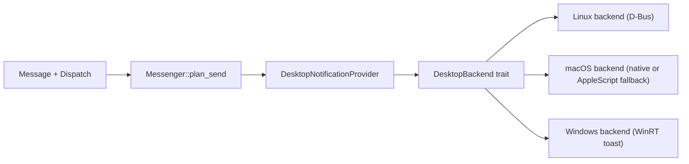

# OS Notifications Design for `messenger`

## Summary

Add operating system notifications as a first-class delivery target in the `messenger` library and CLI.

Phase 1 focuses on local desktop notifications on:

- macOS
- Linux
- Windows

iOS and Android are explicitly designed for as a future extension, but they should not block the desktop implementation. The CLI remains centered on `messenger send`; notifications become another provider instead of a separate command family.

## Goals

- Let library users send a local OS notification through the same `Message` plus `Dispatch` flow used for Slack, Discord, Signal, WhatsApp, and Telegram.
- Let CLI users send local notifications with `messenger send --provider desktop ...`.
- Support macOS, Linux, and Windows with a common portable API and platform-specific best-effort enrichment.
- Reuse existing `messenger` patterns: typed targets, typed receipts, `CapabilitySet`, `Dispatch`, normalization, strict vs best-effort compatibility.
- Preserve room for richer platform features later without making the public API platform-specific from day one.

## Non-Goals

- Do not add scheduled notifications in v1.
- Do not add notification action callbacks or inline reply handling in v1.
- Do not add badge counts, progress notifications, alarms, or reminder scenarios in v1.
- Do not try to make iOS and Android look like "local desktop notifications" inside the CLI.
- Do not turn OS notifications into side effects of sends to other providers. This feature is a new destination, not a post-send alert.

## Why This Belongs In `messenger`

`messenger` already models "portable content plus delivery-specific routing and compatibility." Local OS notifications fit that model well:

- `Message` remains the portable content container.
- `Dispatch` remains the delivery-behavior container.
- a new provider adapter translates the portable message into the host OS notification API.

This is a better fit than a standalone helper because:

- library users can fan out to chat providers and local notifications using the same abstractions
- the CLI already has route storage, typed provider config, and receipt persistence
- the existing validation and normalization pipeline already solves most of the compatibility story

## Research-Driven Constraints

The notification API research in `notification-apis.md` leads to a few hard constraints:

| OS | Native API | Auth / permission | Key constraint for `messenger` |
| --- | --- | --- | --- |
| macOS | `UserNotifications.framework` | user authorization for native local notifications | plain CLI binaries are a poor fit for the fully native path unless we ship a bundled helper or fallback strategy |
| Linux | freedesktop.org notifications over D-Bus | none for local notifications | easiest platform; best foundation for v1 |
| Windows | WinRT toast notifications | AUMID plus Start Menu shortcut for unpackaged desktop apps | requires app identity bootstrapping for the CLI |
| iOS | `UserNotifications.framework` plus APNs for remote | user authorization and app lifecycle | not a CLI target |
| Android | `NotificationManager` plus channels, `POST_NOTIFICATIONS`, FCM for remote | runtime permission and app lifecycle | not a CLI target |

Two design consequences follow from that:

1. Desktop local notifications should be one provider: `desktop`.
2. Mobile support should be a later, separate push-oriented extension, not part of the first desktop provider implementation.

## High-Level Design



The provider model stays intact:

- `ProviderKind::Desktop` identifies the local notification provider.
- `Target::Desktop` represents "deliver to the current host OS notification center."
- `DesktopNotificationProvider` owns runtime backend selection.
- platform backends are internal implementation details.

## Public Library API

### New Provider

Add a new optional library feature:

- `desktop`

The CLI enables `desktop` by default. The library keeps it opt-in, like Signal, WhatsApp, and Telegram today.

### New Target Variant

Add a new target helper:

```rust
let dispatch = Dispatch::to(Target::desktop());
```

This target intentionally carries no channel or recipient. The destination is always the current host OS notification center.

### Message Model Changes

Notifications need a summary/title. The existing `Message` type does not have one, so add:

```rust
pub struct Message {
    pub title: Option<String>,
    pub body: Option<MessageBody>,
    pub attachments: Vec<Attachment>,
    pub location: Option<Location>,
    pub metadata: BTreeMap<String, String>,
}
```

Builder additions:

```rust
impl Message {
    pub fn title(mut self, title: impl Into<String>) -> Self;
}
```

Why `title` belongs on `Message` instead of `Dispatch`:

- it is content, not routing
- it is portable to future email or push providers
- it lets the CLI expose `--title` consistently

Title rules:

- if `message.title` is set, use it
- else if the desktop route config has `default_title`, use that
- else derive a title from the provider/app name

### Capability Model Changes

The current attachment capability is too coarse for notifications because desktop notifications can usually show an image but not a generic file attachment.

Replace:

- `supports_attachments`

With:

- `supports_image_attachments`
- `supports_file_attachments`

That improves the existing model beyond notifications:

- Discord: images and files
- desktop: images only
- Slack / Signal / WhatsApp / Telegram: none for now

Desktop provider capabilities in v1:

- `supports_markdown_rendering = false`
- `supports_reply = false`
- `supports_image_attachments = true`
- `supports_file_attachments = false`
- `supports_location = false`
- `supports_silent_delivery = true`
- `supports_link_preview_control = false`

Markdown behavior follows current best-effort rules:

- best-effort: render Markdown down to plain text and emit a warning
- strict: fail if rich Markdown rendering is required in the future

### Desktop Overrides

Add a new provider-specific override:

```rust
pub enum ProviderOverrides {
    None,
    Desktop(DesktopOverrides),
    ...
}
```

Proposed shape:

```rust
pub struct DesktopOverrides {
    pub subtitle: Option<String>,
    pub app_name: Option<String>,
    pub category: Option<String>,
    pub urgency: Option<NotificationUrgency>,
    pub timeout_ms: Option<u32>,
    pub icon: Option<NotificationIcon>,
    pub replace_id: Option<String>,
}
```

Portable enums:

```rust
pub enum NotificationUrgency {
    Low,
    Normal,
    Critical,
}

pub enum NotificationIcon {
    Named(String),
    Path(PathBuf),
}
```

These are intentionally small. They cover the common desktop surface without pretending the platforms are identical.

### Receipt Model

Add:

```rust
pub enum MessageRef {
    ...
    Desktop {
        platform: DesktopPlatform,
        notification_id: String,
    }
}
```

and:

```rust
pub enum DesktopPlatform {
    MacOS,
    Linux,
    Windows,
}
```

Receipt behavior:

- Linux: use the D-Bus notification ID returned by the daemon
- macOS native path: use the request identifier
- macOS AppleScript fallback: generate a UUID locally and mark fallback delivery in receipt metadata
- Windows: use a stable generated ID if the wrapper does not expose a native toast identifier cleanly

The receipt exists even if v1 does not yet expose "dismiss" or "replace" operations. It preserves forward compatibility.

## Provider Implementation

### Public Type

Add:

```rust
pub struct DesktopNotificationProvider {
    config: DesktopConfig,
    backend: Box<dyn DesktopBackend>,
}
```

and:

```rust
pub struct DesktopConfig {
    pub app_name: String,
    pub default_title: Option<String>,
    pub category: Option<String>,
    pub urgency: NotificationUrgency,
    pub timeout_ms: Option<u32>,
    pub icon: Option<NotificationIcon>,
    pub windows: WindowsDesktopConfig,
    pub macos: MacOsDesktopConfig,
    pub linux: LinuxDesktopConfig,
}
```

Nested platform config keeps the public shape typed instead of stuffing everything into metadata.

Suggested platform additions:

```rust
pub struct WindowsDesktopConfig {
    pub app_id: Option<String>,
}

pub struct MacOsDesktopConfig {
    pub bundle_id: Option<String>,
    pub strategy: MacOsNotificationStrategy,
}

pub enum MacOsNotificationStrategy {
    Auto,
    NativeUserNotifications,
    AppleScript,
}

pub struct LinuxDesktopConfig {
    pub desktop_entry: Option<String>,
}
```

### Internal Backend Trait

Use an internal trait to isolate platform complexity and keep unit testing cheap:

```rust
#[async_trait::async_trait]
trait DesktopBackend: Send + Sync {
    fn platform(&self) -> DesktopPlatform;
    async fn send(
        &self,
        request: DesktopNotificationRequest,
    ) -> Result<DesktopNotificationReceipt, MessengerError>;
}
```

This gives the library three benefits:

- platform code is isolated behind `cfg(target_os = "...")`
- the provider can be tested with a fake backend
- fallback logic does not leak into the generic provider interface

### Request Construction

The provider converts `Message + Dispatch + DesktopConfig + DesktopOverrides` into a normalized `DesktopNotificationRequest`.

Portable mapping:

| Portable field | Desktop request field |
| --- | --- |
| `message.title` | notification title |
| `message.body` | notification body |
| first image attachment | image / hero / attachment |
| `dispatch.options.silent` | suppress sound |
| `DesktopOverrides::category` | category / thread / desktop hint |
| `DesktopOverrides::urgency` | urgency / scenario / interruption mapping |
| `DesktopOverrides::timeout_ms` | expiry / duration when supported |
| `DesktopOverrides::replace_id` | replace existing notification when supported |

Normalization rules:

- generic file attachments are dropped in best-effort mode and fail in strict mode
- locations are dropped in best-effort mode and fail in strict mode
- multiple image attachments are reduced to the first image in best-effort mode
- markdown is rendered as plain text

## Platform Backends

### Linux

Recommended backend:

- `notify-rust` with the `zbus`-based path

Reasons:

- aligns with the freedesktop.org D-Bus model from the research doc
- no auth or permission flow for local notifications
- returns a native notification ID
- supports urgency, timeout, app name, icons, categories, and silent hints reasonably well

Mapping notes:

- `title` -> `summary`
- `body` -> `body`
- `app_name` -> `app_name`
- `icon` -> icon name or absolute path
- `urgency` -> `urgency` hint
- `category` -> `category` hint
- `timeout_ms` -> `expire_timeout`
- `silent` -> `suppress-sound` hint
- first image -> image hint when supported

### Windows

Recommended backend:

- `winrt-notification` for v1

Reasons:

- pragmatic wrapper for WinRT toasts from a desktop app
- enough surface for title, body, images, sound, duration, and app ID
- lower implementation cost than building raw XML against `windows` in the first pass

Constraints from the research doc matter here:

- unpackaged Win32 apps need an App User Model ID
- notifications work best when a Start Menu shortcut is installed with that AUMID

Design decision:

- `DesktopConfig.windows.app_id` defaults to a stable value such as `RustyBiscuit.Messenger`
- the CLI performs one-time bootstrap for the shortcut during `setup desktop` and lazily on first send if needed
- if bootstrap fails, return a `MessengerError::MissingConfiguration` or `Transport` with direct remediation text

Mapping notes:

- `title` -> toast title
- `body` -> first body text lines
- first image -> hero or inline image
- `silent` -> `sound(None)`
- `timeout_ms` -> best-effort mapping to toast duration; exact millisecond control is not portable on Windows
- `category` and `replace_id` map to tag or group later, but are optional in v1

If `winrt-notification` becomes too limiting for replacement, actions, or richer metadata, move the Windows backend to the official `windows` crate without changing the provider-facing API.

### macOS

Recommended backend strategy:

- long-term native path: `UserNotifications.framework` via `objc2-user-notifications`
- short-term CLI compatibility path: AppleScript `display notification` via `osascript`

This split is deliberate.

The research doc points to `UserNotifications.framework` as the correct API, but plain CLI binaries are awkward on macOS because:

- user authorization is tied to app identity
- bundled and signed apps behave much better than an ad hoc command-line executable

Design decision:

- `MacOsNotificationStrategy::Auto` is the default
- in `Auto`, use native `UserNotifications.framework` when the process is running with a usable bundle identity
- otherwise fall back to AppleScript for the CLI path

Why accept AppleScript as a fallback:

- this repo already uses `osascript` for notification helpers in `justfile`s
- it gives the CLI a working path now
- it keeps the native API path available for future packaged apps or helper-bundle work

Mapping notes:

- native path:
  - `title` -> `title`
  - `subtitle` -> `subtitle`
  - `body` -> `body`
  - `silent` -> omit sound
  - first image -> attachment
  - `category` -> `categoryIdentifier`
  - urgency may later map to `interruptionLevel`
- AppleScript fallback:
  - `title` -> title
  - `body` -> body
  - no reliable typed receipt from the OS
  - limited support for images and advanced metadata

The fallback should be visible in receipt metadata so callers know whether native delivery semantics were available.

## CLI Design

### Provider Addition

Add a new route provider:

- `desktop`

The CLI stays on the existing command:

```bash
messenger send --provider desktop "Deploy finished"
messenger send --provider desktop --title "Build" --image ./status.png "Green across the board"
messenger send --route desktop.local "Nightly job completed"
```

No separate `notify` subcommand is needed in v1.

### New Send Flags

Add:

- `--title <text>`
- `--subtitle <text>` for desktop only
- `--icon <name-or-path>`
- `--category <name>`
- `--urgency <low|normal|critical>`
- `--timeout-ms <ms>`

Existing flags reused:

- `--image`
- `--silent`
- `--strict`
- `--plain`

Notes:

- `--file` remains unsupported for desktop notifications and follows strict vs best-effort rules
- `--channel` is not required for `--provider desktop`

### Route Resolution Change

Today, `--provider` requires `--channel`. That must become provider-specific.

Add a helper:

```rust
impl RouteProvider {
    pub fn requires_target(self) -> bool;
}
```

Behavior:

- `desktop` returns `false`
- all current chat providers return `true`

This is the minimal compatible change. No CLI-wide rename from `--channel` to `--target` is required in v1.

### Config Shape

Add a typed route variant:

```json
{
  "provider": "desktop",
  "app_name": "Messenger",
  "default_title": "Messenger",
  "icon": "dialog-information",
  "category": "im.received",
  "urgency": "normal",
  "timeout_ms": 5000,
  "windows": {
    "app_id": "RustyBiscuit.Messenger"
  },
  "macos": {
    "bundle_id": "com.rustybiscuit.messenger",
    "strategy": "auto"
  },
  "linux": {
    "desktop_entry": "messenger"
  }
}
```

Keep platform blocks optional. Most users should only need:

- `app_name`
- `default_title`
- maybe `icon`

### Interactive Setup

`messenger setup desktop` should prompt for:

1. route name
2. app name
3. default title
4. icon name or path
5. urgency
6. timeout
7. platform-specific optional data

Platform-specific prompts:

- Windows: optional App ID, with a note that the CLI may create a Start Menu shortcut
- macOS: optional bundle ID plus strategy choice; explain that native notifications may require a bundled app identity
- Linux: optional desktop entry

### CLI Output

Continue the existing receipt pattern:

- receipt saved under `~/.messenger/receipts/`
- stderr prints provider, raw ID, and receipt path

Example:

```text
Sent via desktop (id: 4d4f8a6e-...)
Receipt: /Users/alice/.messenger/receipts/1712345678000-desktop.json
```

## Markdown, Images, and Compatibility Rules

### Markdown

Desktop notifications should treat Markdown the same way Signal and WhatsApp currently do:

- render to plain text
- warn in best-effort mode
- fail in strict mode only if the requested feature cannot be safely represented after normalization

This avoids pretending the three desktop platforms have a common rich-text notification format.

### Images

Use the first image attachment as the notification image.

Rules:

- image attachment supported
- file attachment unsupported
- multiple images collapse to the first image in best-effort mode

That keeps the user-facing API small:

- library users keep calling `message.image(...)`
- CLI users keep using `--image`

### Title and Body

Desktop notifications require both fields to feel native.

Rules:

- title defaults from message or route config
- body is taken from `Message::body`
- if the message only contains an image and no body, use the title alone
- if normalization removes all deliverable content, return `InvalidMessage`

## Error Handling

Stay inside the existing `MessengerError` model where possible.

Expected mappings:

- missing Windows App ID bootstrap -> `MissingConfiguration`
- macOS native permission denied -> `Authentication` is misleading; use `Provider` with a clear message or add a new `PermissionDenied` variant if this appears in more than one backend
- D-Bus unavailable on Linux -> `Transport`
- AppleScript execution failure -> `Transport`

If notification permission denial becomes common across multiple platforms, add:

```rust
PermissionDenied {
    provider: ProviderKind,
    message: String,
}
```

That is cleaner than overloading `Authentication`.

## Testing Strategy

### Library Tests

- unit tests for `Target::desktop()` provider resolution
- unit tests for title defaulting
- unit tests for image vs file attachment normalization
- unit tests for strict vs best-effort behavior
- unit tests for receipt serialization with `MessageRef::Desktop`
- provider tests using a fake `DesktopBackend`

### CLI Tests

- config round-trip for `RouteConfig::Desktop`
- route resolution with `--provider desktop` and no `--channel`
- `--title`, `--urgency`, and `--timeout-ms` parsing
- setup flow output and persistence

### Platform Verification

Do not make CI depend on live desktop notification centers.

Instead:

- unit test translation into backend request structs
- optionally add ignored smoke tests for each OS
- run those manually on release platforms

## Documentation Changes

This design should ship with doc updates in the same change set:

- `messenger/README.md`
- `messenger/lib/README.md`
- `messenger/cli/README.md`
- a new provider/platform note: `messenger/docs/platforms/desktop.md`

The desktop provider doc should explain:

- Linux D-Bus path
- Windows AUMID requirement
- macOS native vs AppleScript strategy

## Rollout Plan

### Phase 1

- add `ProviderKind::Desktop`, `Target::desktop()`, and typed desktop receipts
- add `Message::title(...)`
- split attachment capabilities into image vs file
- implement Linux backend
- implement Windows backend
- implement macOS `Auto` strategy with AppleScript fallback
- wire the CLI provider, flags, config, and setup flow

### Phase 2

- improve macOS native delivery via `UserNotifications.framework`
- add replacement and dismissal APIs using `MessageRef::Desktop`
- expose richer categories and grouping where portable

### Phase 3

- support actions and callbacks for packaged app integrations
- support notification replacement/update in the CLI

### Phase 4

- add separate mobile push providers:
  - `apns`
  - `fcm`

These should not be aliases of `desktop`. They have different auth, targets, delivery guarantees, and operational concerns.

## Alternatives Considered

### Use `notify-rust` Everywhere

Rejected as the primary design.

Reason:

- strong fit for Linux
- weaker fit for macOS and Windows
- the current crate documentation explicitly describes macOS and Windows support as secondary compared to Linux

It is still a good Linux backend.

### Use `user-notify` as the Single Cross-Platform Backend

Not recommended for v1.

Reason:

- LGPL license may be undesirable for this repo
- macOS support still assumes an app bundle and signing story
- the abstraction is broader than what `messenger` needs for the first release

### Add a Separate `messenger notify` Command Instead of a Provider

Rejected.

Reason:

- duplicates existing route, receipt, and config logic
- breaks the library and CLI symmetry already established in `messenger`
- makes multi-provider fan-out less coherent

## Recommended Decision

Implement desktop local notifications as a new `desktop` provider in both the library and CLI.

Use:

- Linux: `notify-rust`
- Windows: `winrt-notification`
- macOS: `objc2-user-notifications` when native delivery is viable, with AppleScript fallback for the CLI path

Keep the public API small:

- `Message::title(...)`
- `Target::desktop()`
- `ProviderKind::Desktop`
- `ProviderOverrides::Desktop`
- typed desktop route config and receipts

Treat iOS and Android as a future push-provider project, not as part of the desktop provider scope.
