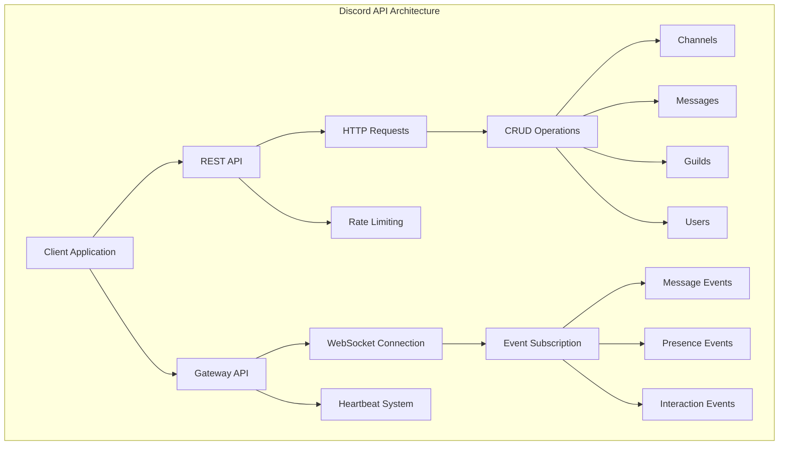
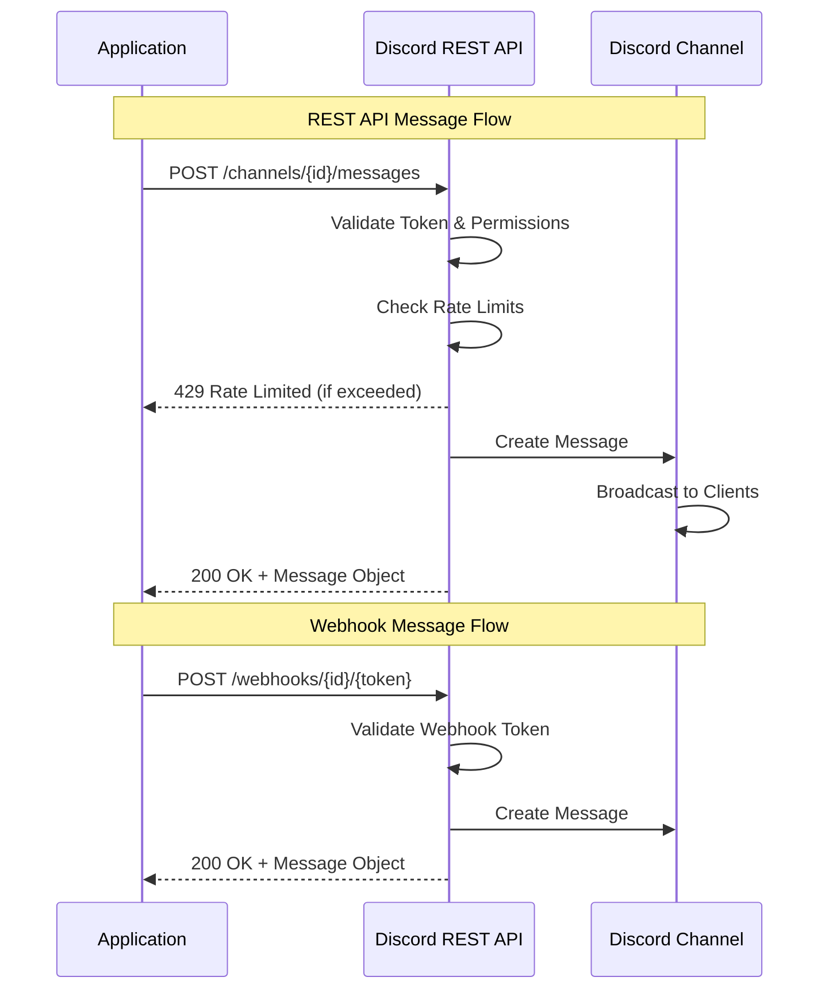
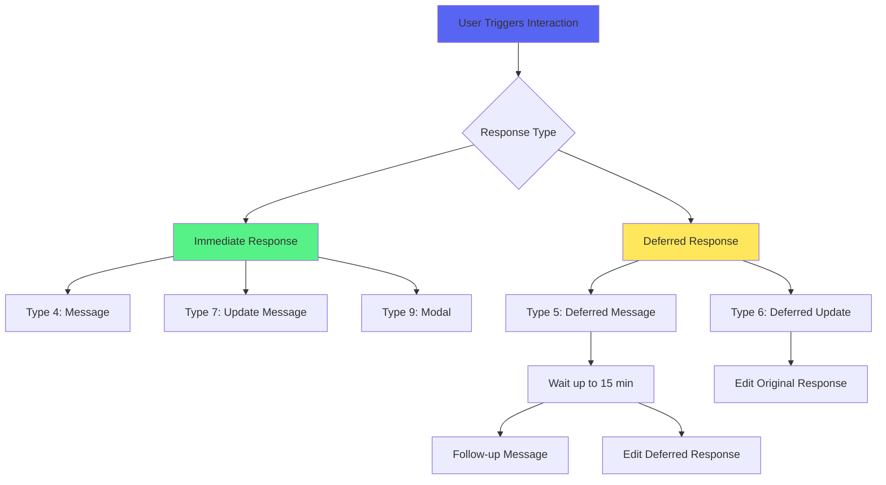
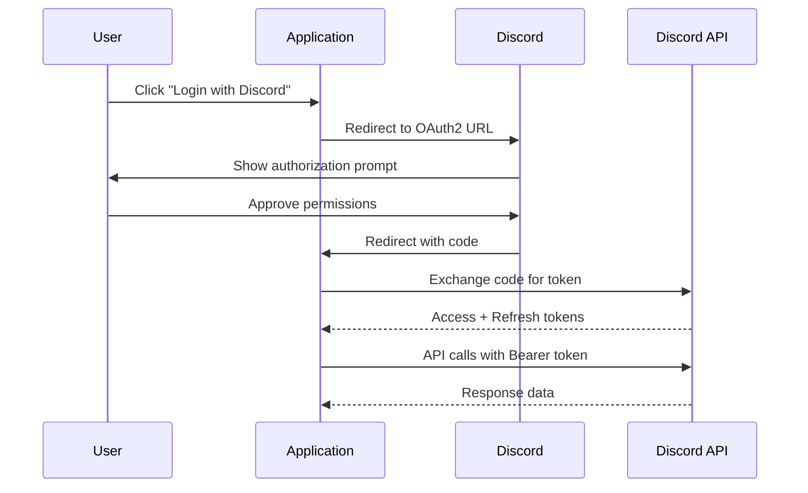
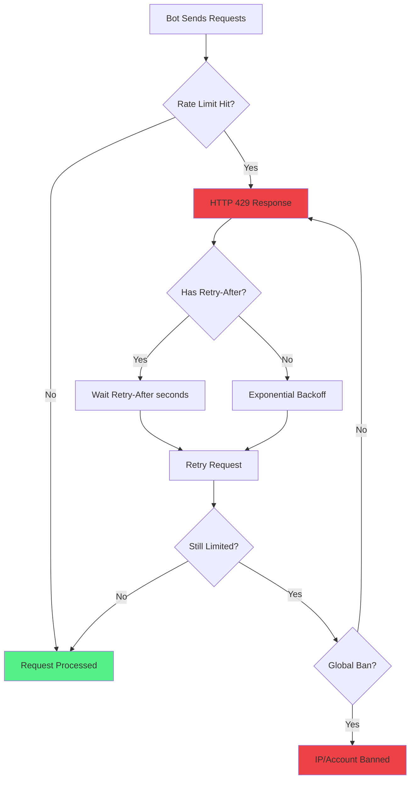
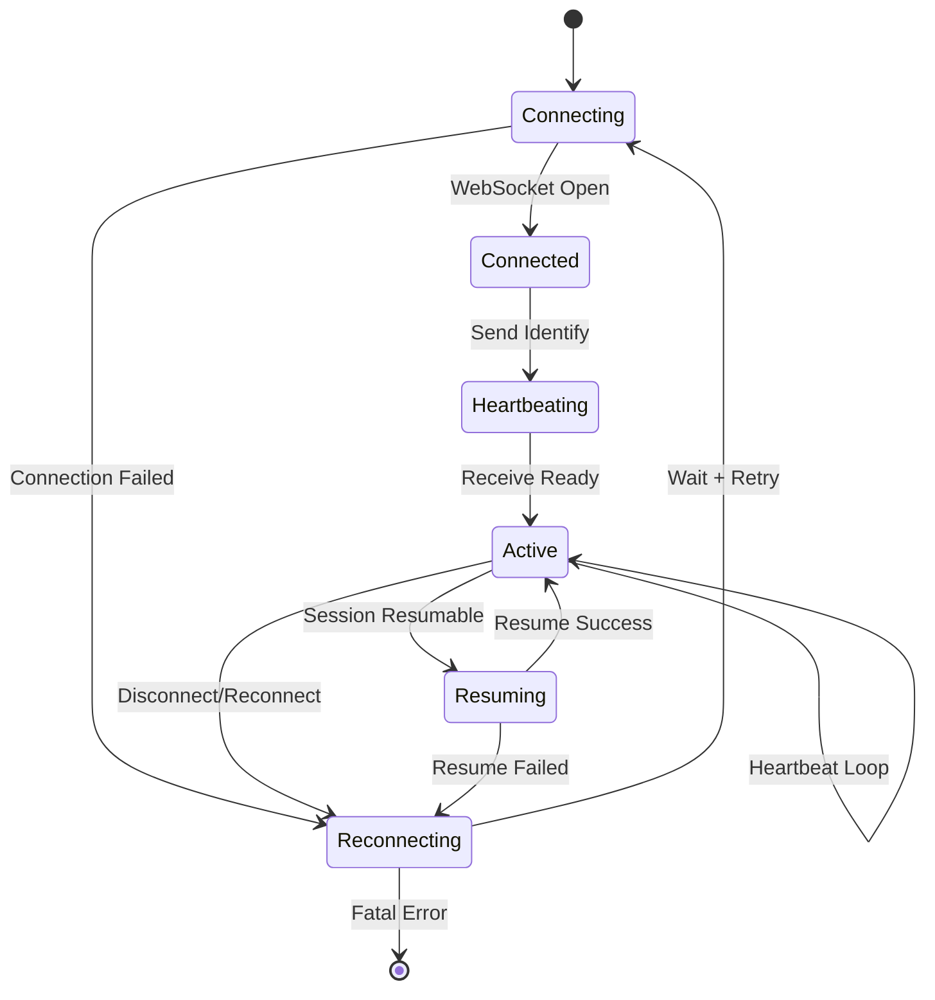

# Discord Messaging Platform API Deep Dive

## Executive Summary

Discord provides a robust, multi-layered API ecosystem that enables developers to build sophisticated messaging applications. The platform offers two primary APIs—the REST API for standard HTTP operations and the Gateway API for real-time WebSocket-based communication. For Rust developers, the ecosystem provides mature libraries such as Serenity and Twilight, each with distinct architectural philosophies and use cases. This document provides a comprehensive technical analysis of Discord's API capabilities, authentication mechanisms, Rust integration options, and common development challenges.

---

## API Overview

### Primary APIs Provided

Discord exposes two complementary APIs that work together to provide complete platform integration capabilities:

#### 1. REST API (HTTP API)

The Discord REST API serves as the primary interface for performing CRUD operations on Discord resources. It follows standard RESTful principles and supports all major HTTP methods (GET, POST, PUT, PATCH, DELETE) for resource manipulation.

| Attribute           | Details                                              |
| ------------------- | ---------------------------------------------------- |
| **Base URL**        | `https://discord.com/api/v10`                        |
| **Protocol**        | HTTPS                                                |
| **Data Format**     | JSON (primary), multipart/form-data for file uploads |
| **Current Version** | v10                                                  |

**Core Capabilities:**

- Channel management (create, modify, delete channels)
- Message operations (send, edit, delete, pin messages)
- Guild (server) management
- User and member management
- Role and permission management
- Emoji and sticker management
- Webhook operations
- Application command (slash command) registration and management

#### 2. Gateway API (WebSocket API)

The Gateway API provides a persistent, bidirectional WebSocket connection for receiving real-time events from Discord. This is essential for bots that need to respond to user actions immediately.

| Attribute       | Details                                        |
| --------------- | ---------------------------------------------- |
| **Endpoint**    | `wss://gateway.discord.gg/?v=10&encoding=json` |
| **Protocol**    | WebSocket over TLS                             |
| **Encoding**    | JSON or ETF (Erlang Term Format)               |
| **Compression** | zlib-based payload compression supported       |

**Core Capabilities:**

- Real-time event delivery (message creation, updates, deletions)
- Presence updates (user status changes)
- Guild events (member joins/leaves, role changes)
- Voice state updates
- Interaction events (slash commands, button clicks)



---

### API Documentation Resources

#### Official Documentation

| Resource                  | URL                                                |
| ------------------------- | -------------------------------------------------- |
| **Developer Portal**      | https://discord.com/developers/docs                |
| **API Reference**         | https://docs.discord.com/developers/reference      |
| **Gateway Documentation** | https://docs.discord.com/developers/events/gateway |
| **GitHub Repository**     | https://github.com/discord/discord-api-docs        |

#### OpenAPI Specification

Discord provides an official OpenAPI 3.1 specification for their API:

| Resource                  | URL                                                          | Notes                                 |
| ------------------------- | ------------------------------------------------------------ | ------------------------------------- |
| **Official OpenAPI Spec** | https://github.com/discord/discord-api-spec                  | OpenAPI 3.1 specification for API v10 |
| **Raw Spec File**         | `https://raw.githubusercontent.com/discord/discord-api-spec/main/openapi.json` | Machine-readable JSON                 |

> **Note:** The OpenAPI specification is currently in "public preview" status and covers the most recent API version (v10). This specification can be used to generate client SDKs in various programming languages using tools like OpenAPI Generator.

---

## API Capabilities for Messaging

### Sending Messages (Originating Messages)

Discord provides multiple mechanisms for sending messages, each suited to different use cases.

#### 1. REST API Message Creation

The primary method for sending messages uses the `POST /channels/{channel.id}/messages` endpoint.

**Request Structure:**

```http
POST /api/v10/channels/{channel_id}/messages
Authorization: Bot {bot_token}
Content-Type: application/json

{
  "content": "Hello, World!",
  "tts": false,
  "embeds": [
    {
      "title": "Embed Title",
      "description": "Embed description text",
      "color": 16711680
    }
  ],
  "allowed_mentions": {
    "parse": ["users", "roles"]
  }
}
```

**Key Parameters:**

| Parameter          | Type      | Description                                |
| ------------------ | --------- | ------------------------------------------ |
| `content`          | string    | Message text content (max 2000 characters) |
| `tts`              | boolean   | Whether to use text-to-speech              |
| `embeds`           | array     | Rich embed objects (max 10)                |
| `allowed_mentions` | object    | Control mention parsing behavior           |
| `components`       | array     | Interactive component rows                 |
| `files`            | multipart | File attachments                           |
| `sticker_ids`      | array     | Sticker IDs to include                     |

#### 2. Webhook-Based Messaging

Webhooks provide a simplified method for sending messages without requiring a full bot implementation.

**Advantages:**

- No OAuth2 flow required
- Simple HTTP POST requests
- No Gateway connection needed
- Ideal for notifications and alerts

**Webhook Endpoint:**

```http
POST /api/v10/webhooks/{webhook_id}/{webhook_token}
Content-Type: application/json

{
  "content": "Notification from external service",
  "username": "Custom Username",
  "avatar_url": "https://example.com/avatar.png",
  "embeds": [...]
}
```



### Responding to Messages

Discord offers multiple approaches for responding to existing messages.

#### 1. Message Reply (REST API)

The standard reply mechanism creates a message that references another message, displaying the "reply" UI in Discord clients.

```http
POST /api/v10/channels/{channel_id}/messages
Authorization: Bot {bot_token}
Content-Type: application/json

{
  "content": "This is a reply to your message",
  "message_reference": {
    "message_id": "123456789012345678",
    "channel_id": "123456789012345678",
    "guild_id": "123456789012345678"
  }
}
```

**Message Reference Fields:**

| Field                | Required    | Description                                          |
| -------------------- | ----------- | ---------------------------------------------------- |
| `message_id`         | Yes         | ID of the message being replied to                   |
| `channel_id`         | Conditional | Channel ID (required for cross-channel)              |
| `guild_id`           | Conditional | Guild ID (required for cross-guild)                  |
| `fail_if_not_exists` | Optional    | Whether to error if referenced message doesn't exist |

#### 2. Interaction Responses

Interactions (slash commands, buttons, select menus) provide structured response mechanisms with unique capabilities.

**Response Types:**

| Type                                      | Value | Description                             |
| ----------------------------------------- | ----- | --------------------------------------- |
| `PONG`                                    | 1     | ACK a ping                              |
| `CHANNEL_MESSAGE_WITH_SOURCE`             | 4     | Respond with a message                  |
| `DEFERRED_CHANNEL_MESSAGE_WITH_SOURCE`    | 5     | ACK with loading state, follow up later |
| `DEFERRED_UPDATE_MESSAGE`                 | 6     | ACK without updating component          |
| `UPDATE_MESSAGE`                          | 7     | Update the message component            |
| `APPLICATION_COMMAND_AUTOCOMPLETE_RESULT` | 8     | Autocomplete suggestions                |
| `MODAL`                                   | 9     | Show a modal form                       |

**Time Constraints:**

- Initial response must be sent within **3 seconds**
- Interaction tokens are valid for **15 minutes**
- Follow-up messages can be sent within the token validity window

```http
POST /api/v10/interactions/{interaction_id}/{interaction_token}/callback
Content-Type: application/json

{
  "type": 4,
  "data": {
    "content": "Response to slash command",
    "flags": 64
  }
}
```

**Ephemeral Messages:**
Setting `flags: 64` (or `flags: 1 << 6`) creates an ephemeral response visible only to the user who triggered the interaction.



---

## Authentication and Authorization

Discord uses OAuth 2.0 as its primary authentication and authorization framework, with different flows for different application types.

### Authentication Methods

#### 1. Bot Token Authentication

Bot tokens are the most common authentication method for autonomous bot applications.

**Acquisition Process:**

1. Create an application in the Developer Portal
2. Navigate to the "Bot" section
3. Click "Add Bot" to create a bot user
4. Copy the generated token

**Usage:**

```http
Authorization: Bot MTk4NjIyNDgzNDcOTY3MDUy.DkXVqQ.F3dP3yJ6pEZXYz-MfFvLlHkTBQI
```

**Token Characteristics:**

- Starts with base64-encoded user ID
- Contains a timestamp and cryptographic signature
- Should be treated as a sensitive credential (never commit to version control)

#### 2. OAuth2 Flows

Discord supports multiple OAuth2 grant types:

| Grant Type            | Use Case                  | Requires Client Secret |
| --------------------- | ------------------------- | ---------------------- |
| Authorization Code    | Server-side applications  | Yes                    |
| Implicit (deprecated) | Client-side applications  | No                     |
| Client Credentials    | Bot-to-bot operations     | Yes                    |
| Device Code           | CLI/Terminal applications | No                     |

**Authorization Code Flow:**



**OAuth2 Scopes for Bots:**

| Scope                   | Description                     |
| ----------------------- | ------------------------------- |
| `bot`                   | Add bot to servers              |
| `applications.commands` | Register slash commands         |
| `identify`              | Access user identity            |
| `email`                 | Access user email               |
| `guilds`                | Access user's servers list      |
| `messages.read`         | Read messages (user OAuth only) |

### Authorization Model

#### Bot Permissions

Bots use a permission system based on Discord's role permission model:

**Common Permission Flags:**

| Permission           | Bit Position | Value              |
| -------------------- | ------------ | ------------------ |
| Send Messages        | 11           | `0x800` (2048)     |
| Embed Links          | 14           | `0x4000` (16384)   |
| Attach Files         | 15           | `0x8000` (32768)   |
| Read Message History | 16           | `0x10000` (65536)  |
| Mention Everyone     | 17           | `0x20000` (131072) |
| Use External Emojis  | 18           | `0x40000` (262144) |
| Add Reactions        | 6            | `0x40` (64)        |
| Administrator        | 3            | `0x8` (8)          |

#### Privileged Intents

Certain Gateway intents require explicit approval in the Developer Portal:

| Intent            | Purpose                          | Verification Required      |
| ----------------- | -------------------------------- | -------------------------- |
| `GUILD_MEMBERS`   | Receive member join/leave events | Yes (for 100+ server bots) |
| `GUILD_PRESENCES` | Receive user status updates      | Yes (for 100+ server bots) |
| `MESSAGE_CONTENT` | Access message content in events | Yes (for 100+ server bots) |

> **Important:** Bots in fewer than 100 servers can enable privileged intents without verification. Bots in 100+ servers require Discord's verification process to access these intents.

---

## Rust Crates for Discord Integration

The Rust ecosystem provides several well-maintained libraries for Discord integration, each with different architectural approaches and target use cases.

### Crate Comparison Matrix

| Crate        | Latest Version | Architecture         | Async Runtime | Active Maintenance |
| ------------ | -------------- | -------------------- | ------------- | ------------------ |
| **Serenity** | 0.12.5         | Monolithic           | Tokio         | High               |
| **Twilight** | 1.x (Dec 2025) | Modular              | Tokio         | High               |
| **Poise**    | 0.6.x          | Framework (Serenity) | Tokio         | High               |

### 1. Serenity (Recommended for Most Use Cases)

**Repository:** https://github.com/serenity-rs/serenity  
**Documentation:** https://docs.rs/serenity  
**Crates.io:** https://crates.io/crates/serenity

Serenity is the most popular and feature-complete Rust library for Discord. It provides a synchronous-looking API built on async foundations, making it approachable for developers new to async Rust.

**Key Features:**

- Full coverage of Discord's REST and Gateway APIs
- Built-in command framework with derive macros
- Comprehensive type system modeling Discord entities
- Automatic rate limit handling
- Voice support via integration with `songbird`
- Cache system for storing Discord state

**Architecture Philosophy:**
Serenity follows a "batteries included" philosophy, providing a monolithic crate with optional feature flags for reducing compilation time and binary size.

```rust
// Basic Serenity example
use serenity::prelude::*;
use serenity::model::prelude::*;
use serenity::framework::standard::{macros::command, Args, CommandResult};

struct Handler;

#[async_trait]
impl EventHandler for Handler {
    async fn message(&self, ctx: Context, msg: Message) {
        if msg.content == "!ping" {
            if let Err(why) = msg.channel_id.say(&ctx.http, "Pong!").await {
                println!("Error sending message: {:?}", why);
            }
        }
    }
}

#[tokio::main]
async fn main() {
    let token = std::env::var("DISCORD_TOKEN").expect("token");
    let intents = GatewayIntents::GUILD_MESSAGES | GatewayIntents::MESSAGE_CONTENT;
    
    let mut client = Client::builder(&token, intents)
        .event_handler(Handler)
        .await
        .expect("Error creating client");
    
    client.start().await.expect("Error starting client");
}
```

**Feature Flags:**

| Feature              | Description                       |
| -------------------- | --------------------------------- |
| `default`            | Full feature set                  |
| `framework`          | Command framework                 |
| `standard_framework` | Standard command framework macros |
| `voice`              | Voice support                     |
| `cache`              | Built-in cache                    |
| `http`               | HTTP client only                  |
| `gateway`            | Gateway client only               |

**When to Choose Serenity:**

- Getting started with Discord bot development in Rust
- Want comprehensive documentation and community examples
- Prefer a single dependency over multiple crates
- Need both REST and Gateway functionality
- Building a general-purpose bot with mixed functionality

---

### 2. Twilight (Recommended for Large-Scale Applications)

**Repository:** https://github.com/twilight-rs/twilight  
**Documentation:** https://twilight.rs  
**Crates.io:** https://crates.io/crates/twilight

Twilight is a modular, lower-level ecosystem of crates designed for maximum flexibility and performance. It's particularly well-suited for large-scale bots and applications that need fine-grained control.

**Ecosystem Components:**

| Crate                     | Purpose                               |
| ------------------------- | ------------------------------------- |
| `twilight-model`          | Discord API models (serde structures) |
| `twilight-http`           | REST API client                       |
| `twilight-gateway`        | WebSocket Gateway client              |
| `twilight-cache-inmemory` | In-memory cache implementation        |
| `twilight-standby`        | Event future utility                  |
| `twilight-util`           | Helper utilities                      |
| `twilight-interactions`   | Interaction parsing (third-party)     |

**Architecture Philosophy:**
Twilight separates concerns into individual crates, allowing developers to pick only the components they need. The API is lower-level and more explicit, providing greater control at the cost of verbosity.

```rust
// Basic Twilight example
use std::env;
use twilight_gateway::{Event, Events, Intents, Shard};
use twilight_http::Client;

#[tokio::main]
async fn main() -> Result<(), Box<dyn std::error::Error>> {
    let token = env::var("DISCORD_TOKEN")?;
    let client = Client::new(token.clone());
    
    let intents = Intents::GUILD_MESSAGES | Intents::MESSAGE_CONTENT;
    let (shard, events) = Shard::new(token, intents);
    
    shard.start().await?;
    
    process_events(events, client).await;
    
    Ok(())
}

async fn process_events(mut events: Events, client: Client) {
    while let Some(event) = events.next_event().await {
        match event {
            Event::MessageCreate(msg) if msg.content == "!ping" => {
                client
                    .create_message(msg.channel_id)
                    .content("Pong!")?
                    .exec()
                    .await
                    .ok();
            }
            _ => {}
        }
    }
}
```

**When to Choose Twilight:**

- Building large-scale, high-performance bots
- Need to minimize dependencies and compile times
- Want fine-grained control over caching strategy
- Building specialized components (e.g., HTTP-only services)
- Require strict API version control
- Working with memory-constrained environments

---

### 3. Poise (Recommended for Command-Heavy Bots)

**Repository:** https://github.com/serenity-rs/poise  
**Documentation:** https://docs.rs/poise

Poise is an opinionated command framework built on Serenity, designed specifically for slash commands and user commands. It provides excellent developer ergonomics with compile-time command registration.

**Key Features:**

- Single function for both slash and prefix commands
- Automatic command registration via derive macros
- Rich autocomplete support
- Built-in help generation
- Edit tracking for command responses
- Context menu command support

```rust
use poise::serenity_prelude as serenity;
use poise::FrameworkContext;

type Error = Box<dyn std::error::Error + Send + Sync>;
type Context<'a> = poise::Context<'a, Data, Error>;

struct Data {}

/// Ping command - responds with Pong!
#[poise::command(slash_command, prefix_command)]
async fn ping(ctx: Context<'_>) -> Result<(), Error> {
    ctx.say("Pong! 🏓").await?;
    Ok(())
}

/// Greet a user by name
#[poise::command(slash_command)]
async fn greet(
    ctx: Context<'_>,
    #[description = "The user to greet"] user: serenity::User,
) -> Result<(), Error> {
    ctx.say(format!("Hello, {}! 👋", user.name)).await?;
    Ok(())
}

#[tokio::main]
async fn main() {
    let token = std::env::var("DISCORD_TOKEN").expect("token");
    
    let framework = poise::Framework::builder()
        .options(poise::FrameworkOptions {
            commands: vec![ping(), greet()],
            ..Default::default()
        })
        .token(token)
        .intents(serenity::GatewayIntents::non_privileged())
        .setup(|ctx, _ready, framework| {
            Box::pin(async move {
                poise::builtins::register_globally(ctx, &framework.options().commands).await?;
                Ok(Data {})
            })
        });
    
    framework.run().await.unwrap();
}
```

**When to Choose Poise:**

- Building bots with primarily slash commands
- Want rapid development with minimal boilerplate
- Need automatic command documentation
- Building interactive bots with complex argument types
- Prefer compile-time command validation

---

### Other Notable Crates

#### Songbird

**Repository:** https://github.com/serenity-rs/songbird

A voice library designed for Serenity and Twilight. Use this when building bots that need to:

- Play audio in voice channels
- Stream music or audio content
- Implement voice recording features

```rust
// Songbird integrates with Serenity for voice support
use songbird::SerenityInit;

let client = Client::builder(&token, intents)
    .register_songbird()  // Registers voice support
    .await
    .expect("Error creating client");
```

#### Discord-API-Spec Generated Clients

Using the OpenAPI specification, you can generate a custom Rust client:

```bash
openapi-generator-cli generate \
    -i https://raw.githubusercontent.com/discord/discord-api-spec/main/openapi.json \
    -g rust \
    -o ./discord-client
```

**When to use generated clients:**

- Need the absolute latest API features not yet in Serenity/Twilight
- Building minimal HTTP-only applications
- Require strict OpenAPI compliance

---

## Common "Gotchas" and Solutions

### 1. Rate Limiting

Discord implements aggressive rate limiting that can catch developers off guard.

**Rate Limit Types:**

| Type                | Scope        | Behavior                        |
| ------------------- | ------------ | ------------------------------- |
| Global Rate Limit   | Account-wide | Max 50 requests/second globally |
| Route Rate Limit    | Per-endpoint | Varies by endpoint              |
| Resource Rate Limit | Per-resource | E.g., per-channel, per-guild    |

**Common Rate Limit Issues:**



**Solution: Implement Proper Rate Limit Handling**

```rust
// Serenity handles rate limits automatically, but for custom implementations:
use std::time::{Duration, Instant};
use tokio::sync::RwLock;
use std::collections::HashMap;

struct RateLimiter {
    route_limits: RwLock<HashMap<String, (u32, Instant)>>,
    global_limit: RwLock<Option<Instant>>,
}

impl RateLimiter {
    async fn check_and_wait(&self, route: &str) {
        // Check global rate limit first
        if let Some(until) = self.global_limit.read().await.as_ref() {
            let now = Instant::now();
            if now < *until {
                tokio::time::sleep(until - now).await;
            }
        }
        
        // Check route-specific limit
        // ... implementation details
    }
}
```

**Best Practices:**

1. Always respect the `Retry-After` header
2. Implement request queuing per-route
3. Use library-provided rate limit handling (Serenity/Twilight handle this)
4. Monitor `X-RateLimit-Scope: shared` errors (indicates shared limits)

---

### 2. Gateway Intents and Message Content

Since late 2022, Discord requires explicit intent declaration for accessing message content and member data.

**The Problem:**

```rust
// This will silently fail to receive message content without proper intents
let intents = GatewayIntents::GUILD_MESSAGES;  // Missing MESSAGE_CONTENT!
```

**The Solution:**

```rust
// For bots that need to read message content:
let intents = GatewayIntents::GUILD_MESSAGES 
    | GatewayIntents::MESSAGE_CONTENT 
    | GatewayIntents::DIRECT_MESSAGES;

// Enable MESSAGE_CONTENT intent in:
// 1. Developer Portal > Bot > Privileged Gateway Intents
// 2. Your code (as shown above)
```

**Consequences of Missing Intents:**

- `MESSAGE_CREATE` events have empty `content` field
- `MEMBER_JOIN` events don't fire
- Presence updates not received

---

### 3. Snowflake ID Precision

Discord uses 64-bit "snowflake" IDs that can cause precision loss in some environments.

**The Problem:**

```javascript
// JavaScript/JSON parsing issue
const id = "12345678901234567890";
JSON.parse('{"id": ' + id + '}');  // Precision lost!
// Result: { id: 12345678901234568000 }  // Wrong!
```

**The Solution:**
Always treat IDs as strings in JSON parsing:

```rust
// Rust handles this correctly with u64 or String
use serde::{Deserialize, Deserializer};

#[derive(Deserialize)]
struct Message {
    #[serde(deserialize_with = "deserialize_snowflake")]
    id: u64,
}

// Or simply use String type for safety
#[derive(Deserialize)]
struct MessageSafe {
    id: String,  // No precision issues
}
```

---

### 4. Interaction Response Timeouts

Interactions must be acknowledged within 3 seconds.

**The Problem:**

```rust
// This will fail if operation takes > 3 seconds
async fn handle_command(ctx: Context<'_>) -> Result<(), Error> {
    let data = slow_database_query().await;  // Takes 5 seconds
    ctx.say(format!("Result: {:?}", data)).await?;  // Timeout!
    Ok(())
}
```

**The Solution:**

```rust
async fn handle_command(ctx: Context<'_>) -> Result<(), Error> {
    // Defer immediately (shows "thinking..." state)
    ctx.defer().await?;
    
    // Now we have 15 minutes for follow-up
    let data = slow_database_query().await;
    
    // Edit the deferred response
    ctx.edit(|b| b.content(format!("Result: {:?}", data))).await?;
    Ok(())
}
```

---

### 5. Partial Objects and Cache Inconsistency

Gateway events may contain partial objects, and cache state can become stale.

**The Problem:**

```rust
// This may panic or return unexpected None
async fn handle_message(ctx: Context, msg: Message) {
    let guild = msg.guild(&ctx.cache).unwrap();  // May be None!
    let member = guild.members.get(&msg.author.id).unwrap();  // May be missing!
}
```

**The Solution:**

```rust
async fn handle_message(ctx: Context, msg: Message) {
    // Use pattern matching or Option methods
    if let Some(guild) = msg.guild(&ctx.cache) {
        if let Some(member) = guild.members.get(&msg.author.id) {
            // Safe to use member
        } else {
            // Fetch member via REST API
            let member = guild.member(&ctx.http, &msg.author.id).await.ok();
        }
    }
}

// Or use Twilight's approach with explicit None handling
match msg.guild_id {
    Some(guild_id) => { /* handle guild message */ }
    None => { /* handle DM */ }
}
```

---

### 6. Embed Limits and Validation

Discord enforces strict limits on embeds that can cause silent failures.

**Embed Limits:**

| Field            | Maximum                      |
| ---------------- | ---------------------------- |
| Title            | 256 characters               |
| Description      | 4096 characters              |
| Fields           | 25 fields                    |
| Field Name       | 256 characters               |
| Field Value      | 1024 characters              |
| Footer Text      | 2048 characters              |
| Author Name      | 256 characters               |
| Total Characters | 6000 characters (sum of all) |

**The Problem:**

```rust
// This silently fails if limits exceeded
let embed = CreateEmbed::new()
    .title(&very_long_title)  // Over 256 chars
    .description(&huge_description);  // Over 4096 chars
```

**The Solution:**

```rust
fn truncate_for_embed(s: &str, max: usize) -> String {
    if s.len() <= max {
        s.to_string()
    } else {
        format!("{}...", &s[..max.saturating_sub(3)])
    }
}

let embed = CreateEmbed::new()
    .title(truncate_for_embed(&title, 256))
    .description(truncate_for_embed(&description, 4096));
```

---

### 7. Bot Token Security

Exposing bot tokens is a common security issue.

**Common Mistakes:**

```rust
// NEVER do this!
const DISCORD_TOKEN: &str = "MTk4NjIyNDgzNDc...";
```

**Best Practice:**

```rust
use std::env;

fn main() {
    let token = env::var("DISCORD_TOKEN")
        .expect("Expected DISCORD_TOKEN environment variable");
    
    // Use .env file in development
    // Use secure environment variable injection in production
}
```

**If Token is Compromised:**

1. Immediately regenerate in Developer Portal
2. Review audit logs for unauthorized actions
3. Check for added malicious integrations
4. Update all deployed instances

---

### 8. Gateway Disconnection and Reconnection

Gateway connections require proper handling of disconnects and resumes.

**Connection Lifecycle:**



**Implementation Pattern:**

```rust
// Serenity handles this automatically, but for manual implementations:
use twilight_gateway::{connect, EventTypeFlags, Intents, Shard};

async fn manage_connection(token: String, intents: Intents) {
    loop {
        let shard = Shard::new(token.clone(), intents);
        
        match shard.start().await {
            Ok(events) => {
                process_events(events).await;
            }
            Err(e) => {
                eprintln!("Connection error: {:?}", e);
                tokio::time::sleep(Duration::from_secs(5)).await;
            }
        }
    }
}
```

---

## Summary Recommendations

### Choosing a Rust Crate

| Use Case                       | Recommended Crate        | Rationale                                               |
| ------------------------------ | ------------------------ | ------------------------------------------------------- |
| First Discord bot in Rust      | **Serenity**             | Comprehensive docs, large community, batteries included |
| Slash command-focused bot      | **Poise (on Serenity)**  | Ergonomic command framework, automatic registration     |
| High-scale production bot      | **Twilight**             | Modular, performant, fine-grained control               |
| HTTP-only service              | **Twilight HTTP**        | Minimal dependencies, no Gateway overhead               |
| Voice/music bot                | **Serenity + Songbird**  | Integrated voice support                                |
| Memory-constrained environment | **Twilight (selective)** | Pick only needed components                             |

### Key Takeaways

1. **Use library rate limiting** - Serenity and Twilight handle this automatically; never implement naive request loops
2. **Declare intents explicitly** - Both in code and Developer Portal
3. **Handle interaction timeouts** - Always defer long-running operations
4. **Treat IDs as strings** - Avoid precision loss with 64-bit snowflakes
5. **Validate embed limits** - Truncate content before sending
6. **Secure your tokens** - Use environment variables, never commit to source control
7. **Implement graceful reconnection** - Gateway connections will drop; handle resume/reconnect
8. **Test with rate limits in mind** - Use Discord's test environments and monitor your request patterns

---

## Appendix: Useful Resources

### Official Resources

- [Discord Developer Portal](https://discord.com/developers/applications)
- [Discord API Documentation](https://discord.com/developers/docs)
- [Discord API OpenAPI Spec](https://github.com/discord/discord-api-spec)
- [Discord API Docs GitHub](https://github.com/discord/discord-api-docs)

### Rust Resources

- [Serenity GitHub](https://github.com/serenity-rs/serenity)
- [Serenity Documentation](https://docs.rs/serenity)
- [Twilight Book](https://twilight.rs)
- [Twilight GitHub](https://github.com/twilight-rs/twilight)
- [Poise GitHub](https://github.com/serenity-rs/poise)

### Community Resources

- [Discord API Server](https://discord.gg/discord-api) - Official community for API support
- [Rust Community Server](https://discord.gg/rust-lang) - Rust language community

### Tools

- [Postman Discord Collection](https://www.postman.com/discord-api/discord-api/documentation/0d7xls9/discord-rest-api)
- [Discord Permissions Calculator](https://discordapi.com/permissions.html)
