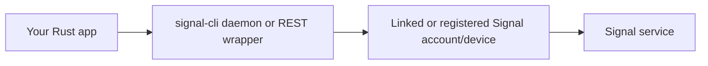

# Signal Messaging Platform Deep Dive

## Bottom line

If you need a **supported public developer API** in the Slack/Discord/Telegram sense, Signal is a weak fit. As of **March 9, 2026**, I could not find a public first-party “build bots/apps on Signal” program, nor a publicly published stable OpenAPI spec for Signal’s own service API. The practical integration story is usually:



The main official materials are the protocol/spec docs and the open-source server/client code. The most practical way to send and receive Signal messages from Rust is usually to sit on top of `signal-cli`, not to talk to Signal’s private service API directly.

## API surfaces

| Surface | Official? | OpenAPI schema? | Docs / definition | Notes |
|---|---:|---|---|---|
| Signal service API (`chat.signal.org`) | Yes | No public published schema URL that I could find | [Signal docs](https://signal.org/docs/), [Signal-Server](https://github.com/signalapp/Signal-Server), [OpenAPI generator config](https://github.com/signalapp/Signal-Server/blob/main/api-doc/src/main/resources/openapi/openapi-configuration.yaml) | Official clients use this, but Signal does not appear to publish it as a public third-party app API. |
| `signal-cli` CLI / JSON-RPC / HTTP events | No | No OpenAPI | [README](https://github.com/AsamK/signal-cli), [CLI man page](https://github.com/AsamK/signal-cli/blob/master/man/signal-cli.1.adoc), [JSON-RPC man page](https://github.com/AsamK/signal-cli/blob/master/man/signal-cli-jsonrpc.5.adoc) | Most common practical automation layer. |
| `signal-cli-rest-api` | No | Yes | [Swagger UI](https://bbernhard.github.io/signal-cli-rest-api/), [swagger.json](https://raw.githubusercontent.com/bbernhard/signal-cli-rest-api/master/src/docs/swagger.json) | Dockerized REST wrapper around `signal-cli`. |
| `signal-cli-api` | No | Yes, at runtime | [Repo](https://github.com/h4x0r/signal-cli-api) | Rust-native REST/WebSocket bridge over `signal-cli`; exposes `/v1/openapi.json` on the running service. |

### What the official Signal service exposes

From the official server source, Signal has an internal HTTP API for account/device operations and messaging. The repo’s `api-doc` module is configured to generate `signal-server-openapi.yaml`, and its OpenAPI config declares:

- servers: `https://chat.signal.org` and `https://chat.staging.signal.org`
- auth scheme: HTTP Basic with username format `<user_id>[.<device_id>]`

Important caveat: **that is not the same thing as a public, supported app platform API**. The official docs page is focused on protocol specs and `libsignal`, not bot/app integration.

## Capabilities

The capabilities you can reliably automate are best understood through `signal-cli`, because that is what most integrations actually drive.

### Originate a message

Via `signal-cli`, you can send:

- plain text messages
- attachments
- view-once image messages
- stickers
- link previews
- mentions
- styled text
- edited messages
- group messages
- username-based messages
- note-to-self messages

The equivalent REST wrapper surface is typically `POST /v2/send` with fields such as:

- `message`
- `number`
- `recipients`
- `base64_attachments`
- `mentions`
- `quote_*`
- `edit_timestamp`
- `view_once`
- `link_preview`

### Respond to another message

Signal supports more than one kind of “response”:

| Response type | How it works |
|---|---|
| Quoted reply | Send a new message with quote metadata such as `quote_timestamp`, `quote_author`, `quote_message`, and optional quote mentions/styles. |
| Reaction | Send a reaction targeting the original message’s author and timestamp. |
| Read/viewed receipt | Send a receipt tied to the original message timestamp. |
| Typing indicator | Send typing start/stop events. |
| Remote delete / admin delete | Delete your own sent message, or admin-delete in supported group contexts. |

A subtle but important detail: on Signal, many follow-up operations target a prior message by **author + timestamp**, not by a neat single server UUID.

### Receive messages

Typical receive options are:

- `signal-cli receive`
- `signal-cli daemon --http` with:
    - `POST /api/v1/rpc`
    - `GET /api/v1/events`
- REST wrapper WebSocket/SSE endpoints such as:
    - `GET /v1/receive/{number}`
    - `GET /v1/events/{number}`

## Authentication and authorization

### Official Signal service

Signal is **account/device-centric**, not OAuth-centric.

- Account bootstrap is usually by **phone number registration**.
- Verification is via **SMS or voice code**.
- Registration may require a **CAPTCHA**.
- A **registration lock PIN** may also be required.
- Linked devices are provisioned by **QR / provisioning URI**.
- After provisioning, the official server OpenAPI config says requests use **HTTP Basic auth**, where the username is `<user_id>[.<device_id>]`.

I did **not** find any evidence of a public third-party OAuth flow, app scopes, bot tokens, or granular delegated permissions.

### `signal-cli` and wrappers

For `signal-cli`-based integrations, auth is effectively:

- possession of the linked/registered device state
- ability to connect to the local daemon/socket/HTTP wrapper

That means network reachability is basically authorization. In practice:

- bind to `127.0.0.1` or a Unix socket
- use TLS if you must expose it
- put exposed REST layers behind your own auth proxy
- treat the account state directory as a secret

## Rust crates

### Recommended for most Rust integrations: `signal-cli-jsonrpc-client`

- Crate: [signal-cli-jsonrpc-client](https://crates.io/crates/signal-cli-jsonrpc-client)
- Source: [repo workspace](https://github.com/cbeck88/signal-gateway/tree/master/signal-cli-jsonrpc-client)

**Why I’d recommend it most:**

- It rides on top of `signal-cli`, which is the most established practical compatibility layer.
- It gives you a Rust-native JSON-RPC client instead of making you hand-roll RPC calls.
- It avoids forcing you to implement Signal’s private service protocol yourself.
- It is a better fit for a “write messages to multiple platforms” utility than taking on a full Signal client implementation.

### Best fit when you want pure Rust and no sidecar: `presage`

- Repo: [presage](https://github.com/whisperfish/presage)

Use this when:

- you want a native Rust Signal client stack
- you need local storage, registration/linking, groups, incoming/outgoing messages, and attachment handling in-process
- you accept more complexity and protocol-churn risk

Why not my default recommendation:

- it is a heavier commitment
- it uses Git dependencies rather than a simple crates.io flow
- it inherits the maintenance burden of an unofficial client against a non-public service API
- licensing is AGPL

### Lower-level building block: `libsignal-service`

- Repo: [libsignal-service-rs](https://github.com/whisperfish/libsignal-service-rs)

Use this when:

- `presage` is too opinionated
- you are building your own client runtime
- you need lower-level primitives for talking to Signal servers

Tradeoff:

- it explicitly says it only provides “some primitives”
- it requires extra dependency patching around `curve25519-dalek`
- it is not the shortest path to a production integration

### Best fit when your app prefers HTTP/WebSocket: `signal-cli-api`

- Crate: [signal-cli-api](https://crates.io/crates/signal-cli-api)
- Repo: [signal-cli-api](https://github.com/h4x0r/signal-cli-api)

Use this when:

- your app architecture already standardizes providers behind HTTP
- you want a local OpenAPI-described service
- you want WebSocket/SSE/webhook delivery out of the box

Tradeoff:

- it is a server bridge, not a client library
- you are still operationally dependent on `signal-cli`

### Best fit for ops / alerting workflows: `signal-gateway`

- Crate: [signal-gateway](https://crates.io/crates/signal-gateway)
- Repo: [signal-gateway](https://github.com/cbeck88/signal-gateway)

Use this when:

- your use case is alerting, admin commands, or ops chat workflows
- you want opinionated Signal automation rather than a general-purpose provider SDK

## Common gotchas and workarounds

| Gotcha | Why it happens | Workaround |
|---|---|---|
| No public first-party developer API | Signal is not exposing a polished public bot/app platform | Plan on `signal-cli` or an unofficial Rust client stack. |
| Old `signal-cli` versions break | `signal-cli` warns that Signal server changes can break releases older than about 3 months | Keep `signal-cli` current and smoke-test send/receive regularly. |
| Registration can require CAPTCHA / rate-limit challenge | Anti-abuse protections | Prefer linked-device mode where possible; support CAPTCHA and challenge flows. |
| You must keep receiving messages | Signal state sync depends on receiving updates | Run daemon mode or a deliberate receive loop. |
| Auto-receive can “steal” messages from another consumer | Receive is consumption-oriented | Use one clear consumer path; do not mix scheduled receive with another live receiver unless you understand the consequences. |
| Mentions/styles use UTF-16 offsets | Signal tooling indexes text in UTF-16 code units | Compute spans in UTF-16, not Rust byte offsets or `.chars()` indices. |
| Replies need more than `parent_id` | Signal reply/reaction/delete flows often target author + timestamp | Persist message author and timestamp for every outbound/inbound message. |
| Addresses are not just phone numbers anymore | Signal supports usernames, ACI, and PNI | Model recipient identity as an enum, not a plain string. |
| Direct-service crates have licensing implications | `presage` and `libsignal-service` are AGPL | Review license impact before embedding them in distributed software. |
| REST bridges are often unauthenticated by default | They assume local deployment | Bind locally, add your own auth layer, or use Unix sockets/TLS. |

## Proposed Rust data model

```rust
use chrono::{DateTime, Utc};
use serde::{Deserialize, Serialize};
use std::path::PathBuf;
use uuid::Uuid;

#[derive(Debug, Clone, Serialize, Deserialize)]
pub struct SignalMessage {
    pub id: Option<SignalMessageId>,
    pub thread: SignalThread,
    pub from: Option<SignalAddress>,
    pub to: Vec<SignalAddress>,
    pub sent_at: Option<DateTime<Utc>>,
    pub kind: SignalMessageKind,
    pub reply_to: Option<SignalQuote>,
    pub edit_of: Option<SignalMessageId>,
    pub body_ranges: Vec<SignalBodyRange>,
    pub attachments: Vec<SignalAttachment>,
    pub link_preview: Option<SignalLinkPreview>,
    pub view_once: bool,
    pub metadata: SignalMetadata,
}

#[derive(Debug, Clone, Serialize, Deserialize)]
pub enum SignalMessageKind {
    Data { body: String },
    Reaction { emoji: String, remove: bool, target: SignalMessageRef },
    Receipt { kind: SignalReceiptKind, target: SignalMessageRef },
    Typing { active: bool },
    RemoteDelete { target: SignalMessageRef },
}

#[derive(Debug, Clone, Serialize, Deserialize)]
pub enum SignalThread {
    Direct { peer: SignalAddress },
    Group { group_id_base64: String },
    NoteToSelf,
}

#[derive(Debug, Clone, Serialize, Deserialize)]
pub enum SignalAddress {
    PhoneE164(String),
    Username(String),
    Aci(Uuid),
    Pni(Uuid),
}

#[derive(Debug, Clone, Serialize, Deserialize)]
pub struct SignalMessageId {
    pub author: SignalAddress,
    pub timestamp_ms: i64,
}

#[derive(Debug, Clone, Serialize, Deserialize)]
pub struct SignalMessageRef {
    pub id: SignalMessageId,
    pub thread: SignalThread,
}

#[derive(Debug, Clone, Serialize, Deserialize)]
pub struct SignalQuote {
    pub original: SignalMessageRef,
    pub body: Option<String>,
    pub body_ranges: Vec<SignalBodyRange>,
}

#[derive(Debug, Clone, Serialize, Deserialize)]
pub struct SignalBodyRange {
    pub start_utf16: u32,
    pub len_utf16: u32,
    pub kind: SignalBodyRangeKind,
}

#[derive(Debug, Clone, Serialize, Deserialize)]
pub enum SignalBodyRangeKind {
    Mention(SignalAddress),
    Bold,
    Italic,
    Spoiler,
    Strikethrough,
    Monospace,
}

#[derive(Debug, Clone, Serialize, Deserialize)]
pub struct SignalAttachment {
    pub mime_type: String,
    pub file_name: Option<String>,
    pub data: SignalBinaryRef,
}

#[derive(Debug, Clone, Serialize, Deserialize)]
pub enum SignalBinaryRef {
    FilePath(PathBuf),
    Base64(String),
    RemoteAttachmentId(String),
}

#[derive(Debug, Clone, Serialize, Deserialize)]
pub struct SignalLinkPreview {
    pub url: String,
    pub title: String,
    pub description: Option<String>,
    pub thumbnail: Option<SignalBinaryRef>,
}

#[derive(Debug, Clone, Copy, Serialize, Deserialize)]
pub enum SignalReceiptKind {
    Read,
    Viewed,
}

#[derive(Debug, Clone, Default, Serialize, Deserialize)]
pub struct SignalMetadata {
    pub notify_self: bool,
    pub urgent: bool,
}
```

### Why this shape is the right one

- `SignalAddress` is an enum because Signal recipients can be a **phone number, username, ACI, or PNI**.
- `SignalMessageId` uses `author + timestamp_ms` because that matches how Signal follow-up operations are commonly targeted.
- `SignalThread` is separate from `to` because Signal has **direct chats, groups, and note-to-self**, and that distinction matters operationally.
- `SignalMessageKind` is an enum because a “message” on Signal is not just text; **reactions, receipts, typing indicators, and remote deletes** are sendable units too.
- `reply_to` is a `SignalQuote`, not just `parent_id`, because Signal reply APIs commonly want the **original timestamp, author, and sometimes text/ranges**.
- `SignalBodyRange` uses `start_utf16` and `len_utf16` because Signal mention/style offsets are defined in **UTF-16 code units**.
- `SignalBinaryRef` avoids locking your core model to one transport. Different integrations accept **file paths, base64 payloads, or remote attachment IDs**.
- `metadata` is intentionally small. Signal’s useful cross-cutting send knobs are relatively few, and keeping this narrow makes a multi-provider abstraction easier.

## Sources

- [Signal developer docs](https://signal.org/docs/)
- [Signal-Server repository](https://github.com/signalapp/Signal-Server)
- [Signal-Server OpenAPI config](https://github.com/signalapp/Signal-Server/blob/main/api-doc/src/main/resources/openapi/openapi-configuration.yaml)
- [signal-cli README](https://github.com/AsamK/signal-cli)
- [signal-cli CLI man page](https://github.com/AsamK/signal-cli/blob/master/man/signal-cli.1.adoc)
- [signal-cli JSON-RPC man page](https://github.com/AsamK/signal-cli/blob/master/man/signal-cli-jsonrpc.5.adoc)
- [signal-cli-rest-api docs](https://bbernhard.github.io/signal-cli-rest-api/)
- [signal-cli-rest-api OpenAPI JSON](https://raw.githubusercontent.com/bbernhard/signal-cli-rest-api/master/src/docs/swagger.json)
- [signal-cli-api](https://github.com/h4x0r/signal-cli-api)
- [signal-cli-jsonrpc-client](https://crates.io/crates/signal-cli-jsonrpc-client)
- [presage](https://github.com/whisperfish/presage)
- [libsignal-service-rs](https://github.com/whisperfish/libsignal-service-rs)
- [signal-gateway](https://github.com/cbeck88/signal-gateway)

If you want, I can turn this into a provider-adapter design note next, with a `SignalProvider` trait and concrete implementation options for `signal-cli` JSON-RPC vs local REST.
