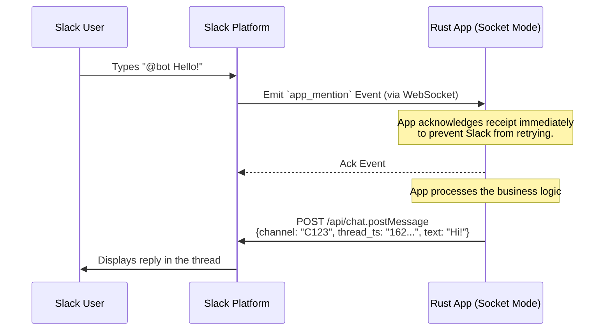

Integrating with Slack using Rust is a great choice. Rust’s strong type system and safety guarantees map very well to Slack’s heavily structured JSON payloads (especially Block Kit), and its async ecosystems are perfect for handling high-throughput event streams.

Here is a deep dive into the Slack messaging platform from a Rust developer's perspective.

---

## Slack APIs and Documentation

Slack provides several distinct APIs depending on your integration needs.

* **Web API:** A traditional HTTP RPC-style API used to query data and execute actions (like posting a message or creating a channel).
* **Events API:** A push-based API where Slack sends HTTP POST requests to your server whenever specific events occur (e.g., a user joins a channel or mentions your bot).
* **Socket Mode:** Allows your app to connect to Slack via WebSockets. This receives the same payloads as the Events API but doesn't require exposing a public HTTP endpoint, making it ideal for local development or behind-the-firewall deployments.
* **Incoming Webhooks:** A simple, one-way URL for posting messages into a specific channel without dealing with authentication headers.

### Formal Definitions and Documentation

* **API Documentation:** The central hub for all Slack developer docs is [api.slack.com](https://api.slack.com/).
* **OpenAPI Schema:** Slack actively maintains an OpenAPI v2 specification. You can find the raw JSON definition here:
[`https://raw.githubusercontent.com/slackapi/slack-api-specs/master/web-api/slack_web_openapi_v2.json`](https://www.google.com/search?q=%5Bhttps://raw.githubusercontent.com/slackapi/slack-api-specs/master/web-api/slack_web_openapi_v2.json%5D(https://raw.githubusercontent.com/slackapi/slack-api-specs/master/web-api/slack_web_openapi_v2.json))

---

## API Capabilities: Sending and Responding

Slack's API is bi-directional. Here is how you handle the flow of messages.

### Originating a Message

To send a message, you make a POST request to the Web API's `chat.postMessage` endpoint. You must provide a target (the `channel` ID) and the content (either plain `text` or rich `blocks`). If you are using an Incoming Webhook, you simply send a POST request with a JSON payload to the specific Webhook URL provided by Slack.

### Responding to Messages

To reply to a user, your application first needs to know a message was sent.

1. You subscribe to the Events API (or Socket Mode) for events like `app_mention` (when someone tags your bot) or `message.channels` (listening to all channel traffic).
2. Slack pushes an event payload to your app.
3. To reply directly in a thread to that specific message, you extract the `ts` (timestamp) value from the incoming event and pass it as the `thread_ts` argument in your outgoing `chat.postMessage` API call.

Here is a visualization of how an interactive response flow works using Socket Mode:



---

## Authentication and Authorization

Slack uses **OAuth 2.0** for authentication, utilizing specific token prefixes to clarify the token's execution context:

* **Bot Tokens (`xoxb-...`):** This is what you will use 95% of the time. It represents your app acting as a standalone bot user.
* **User Tokens (`xoxp-...`):** Represents your app acting *on behalf* of a specific human user (e.g., reading their private messages if they grant permission).
* **App-Level Tokens (`xapp-...`):** Used specifically for establishing WebSocket connections for Socket Mode.

**Authorization** is governed by **Scopes**. Slack has highly granular scopes. For instance, `chat:write` allows you to send messages, `channels:read` lets you see public channel lists, and `app_mentions:read` allows your bot to see when it is tagged.

---

## Recommended Rust Crates

The Rust ecosystem has several crates for Slack, ranging from massive comprehensive frameworks to simple webhook wrappers.

| Crate | Best Fit / Description |
| --- | --- |
| **`slack-morphism`** | **(Top Recommendation)** A modern, heavily maintained, async-first framework. It fully supports the Web API, Events API, Socket Mode, and provides strong typing for Block Kit. Use this if you are building a fully-fledged Slack App or Bot. |
| **`slack-hook`** | Best if you *only* need to push one-way alerts to Slack (e.g., sending server error logs to a channel). It wraps Incoming Webhooks nicely without the overhead of a full API client. |
| **`slack_api` / `slack**` | Older crates that map to the Web API and the legacy Real Time Messaging (RTM) API. They are useful if you want raw, lightweight access to endpoints without pulling in the massive architecture of `slack-morphism`, but they lack modern Socket Mode support. |

---

## Developer Gotchas and Workarounds

Slack’s API is incredibly powerful but carries a lot of historical baggage. Here are the most common traps developers fall into:

1. **The 3-Second Retry Rule (Events API):** * *The Gotcha:* If your app takes longer than 3 seconds to respond with an HTTP 200 OK to an incoming Events API payload, Slack assumes it failed and sends it again. This leads to your bot executing the same logic (and replying) multiple times.
* *The Workaround:* Always decouple acknowledgment from processing. In Rust, return a `200 OK` instantly in your HTTP handler (e.g., using Axum) and spawn a `tokio::task` or push the payload to a queue for actual processing. Alternatively, use caching to track the `event_id` and drop duplicate deliveries.


2. **Tiered Rate Limits:**
* *The Gotcha:* Slack rate limits different endpoints at different tiers (e.g., `chat.postMessage` is Tier 4, allowing 1 request per second, while listing users is Tier 2). Sending too fast results in HTTP 429 errors.
* *The Workaround:* Check the `Retry-After` HTTP header in 429 responses and implement an async exponential backoff in your HTTP client.


3. **Channel Names vs. Channel IDs:**
* *The Gotcha:* Attempting to send a message to `#general` will often fail if the channel was renamed.
* *The Workaround:* Always use the alphanumeric Channel ID (e.g., `C01234567`) in your API calls, not the human-readable string.


---

## Data Model: Representing a Slack Message

If we were to represent an outgoing Slack message in Rust, it would look something like this:

```rust
use serde::{Deserialize, Serialize};

#[derive(Debug, Serialize, Deserialize)]
pub struct SlackPostMessage {
    /// The alphanumeric ID of the target channel.
    pub channel: String,
    
    /// Optional timestamp of a parent message.
    #[serde(skip_serializing_if = "Option::is_none")]
    pub thread_ts: Option<String>,

    /// Fallback string representation of the message.
    #[serde(skip_serializing_if = "Option::is_none")]
    pub text: Option<String>,
    
    /// Rich UI components (Block Kit).
    /// Using `serde_json::Value` here for brevity, but in a real app, 
    /// this would be an Enum representing different Block types.
    #[serde(skip_serializing_if = "Option::is_none")]
    pub blocks: Option<serde_json::Value>, 
}

```

### WHY this format is correct:

1. **`channel` as a String (Not a strong type):** While we know it's an ID, Slack allows Direct Message IDs (`D...`), Group IDs (`G...`), and Channel IDs (`C...`). Using a raw `String` avoids complex parsing logic while safely holding any routing destination.
2. **The separation of `text` and `blocks`:** You might wonder why `text` is included if you are building a beautiful rich-media layout using `blocks`. **Slack heavily relies on the `text` field for push notifications.** If you send `blocks` without `text`, the user's phone notification will just say *"This app sent a message"*. The `text` field ensures lock-screens and accessibility tools (screen readers) have a concise summary of the rich content.
3. **`thread_ts` as the threading mechanism:** In Slack's database, a message does not have a standard UUID. Its unique identifier is simply the exact UNIX timestamp of when it was created (e.g., `"1614556800.000100"`). To reply to a message, you don't pass a "message ID"; you pass the parent message's timestamp into the `thread_ts` field.

## Example: Slack with `slack-morphism` crate

Here is a robust boilerplate to get your Slack App running in Socket Mode using the `slack-morphism` crate.

This setup listens for incoming events (like messages or app mentions), slash commands, and interactive components (like button clicks) over a WebSocket connection, meaning you won't need to expose a public web server or deal with webhooks.

### 1. Prerequisites (`Cargo.toml`)

First, you will need to add `slack-morphism` and a few supporting crates to your `Cargo.toml`. Since `slack-morphism` relies on `hyper` and `tokio`, we need to pull those in as well.

```toml
[dependencies]
# The main Slack framework
slack-morphism = { version = "2.1", features = ["hyper"] }
# The async runtime
tokio = { version = "1.0", features = ["macros", "rt-multi-thread"] }
# For environment variables and error handling
dotenvy = "0.15" # Optional, but recommended for local dev

```

### 2. The Application (`main.rs`)

This boilerplate initializes a client, sets up asynchronous event handlers for the three main types of Slack payloads, and starts the Socket Mode listener.

```rust
use slack_morphism::prelude::*;
use std::sync::Arc;

/// Handles push events from the Events API (e.g., messages, app mentions)
async fn handle_push_events(
    event: SlackPushEventCallback,
    _client: Arc<SlackHyperClient>,
    _states: SlackClientEventsUserState,
) -> Result<(), Box<dyn std::error::Error + Send + Sync>> {
    println!("Received push event: {:#?}", event.event);
    
    // Example: You would extract the thread_ts and channel here 
    // to send a reply using _client.
    
    Ok(())
}

/// Handles interaction payloads (e.g., a user clicking a button in a Block Kit message)
async fn handle_interaction_events(
    event: SlackInteractionEvent,
    _client: Arc<SlackHyperClient>,
    _states: SlackClientEventsUserState,
) -> Result<(), Box<dyn std::error::Error + Send + Sync>> {
    println!("Received interaction event: {:#?}", event);
    Ok(())
}

/// Handles Slash Commands (e.g., a user typing /my-command)
async fn handle_command_events(
    event: SlackCommandEvent,
    _client: Arc<SlackHyperClient>,
    _states: SlackClientEventsUserState,
) -> Result<SlackCommandEventResponse, Box<dyn std::error::Error + Send + Sync>> {
    println!("Received slash command: {:#?}", event.command);
    
    // Commands require an immediate response payload
    Ok(SlackCommandEventResponse::new(
        SlackMessageContent::new().with_text("Command received loudly and clearly!".into()),
    ))
}

#[tokio::main]
async fn main() -> Result<(), Box<dyn std::error::Error + Send + Sync>> {
    // 1. Fetch the App-Level Token (starts with xapp-...)
    // This token is strictly for opening the WebSocket connection.
    let app_token_value: SlackApiTokenValue = std::env::var("SLACK_APP_TOKEN")
        .expect("SLACK_APP_TOKEN environment variable must be set")
        .into();
    let app_token = SlackApiToken::new(app_token_value);

    // 2. Initialize the underlying HTTP client
    let client = Arc::new(SlackClient::new(SlackClientHyperConnector::new()?));

    // 3. Register our async callback functions
    let socket_mode_callbacks = SlackSocketModeListenerCallbacks::new()
        .with_push_events(handle_push_events)
        .with_interaction_events(handle_interaction_events)
        .with_command_events(handle_command_events);

    // 4. Create an environment for the listener (handles shared state and errors)
    let listener_environment = Arc::new(
        SlackClientEventsListenerEnvironment::new(client.clone())
            .with_error_handler(|err, _client, _states| {
                eprintln!("Background error in Slack listener: {:#?}", err);
                std::future::ready(())
            }),
    );

    // 5. Build and configure the Socket Mode listener
    let socket_mode_listener = SlackClientSocketModeListener::new(
        &SlackClientSocketModeConfig::new(),
        listener_environment,
        socket_mode_callbacks,
    );

    println!("Starting Slack Socket Mode listener...");
    
    // 6. Connect to Slack
    socket_mode_listener.listen_for(&app_token).await?;

    // 7. Keep the async runtime alive to process incoming WebSockets
    socket_mode_listener.serve().await;

    Ok(())
}
```

### Running the Code

To run this successfully, you need to configure your app in the [Slack Developer Console](https://api.slack.com/apps):

1. Enable **Socket Mode**.
2. Generate an **App-Level Token** with the `connections:write` scope.
3. Export that token to your terminal session:
`export SLACK_APP_TOKEN="xapp-1-..."`
4. Run `cargo run`.


## Example: handling an app mention


