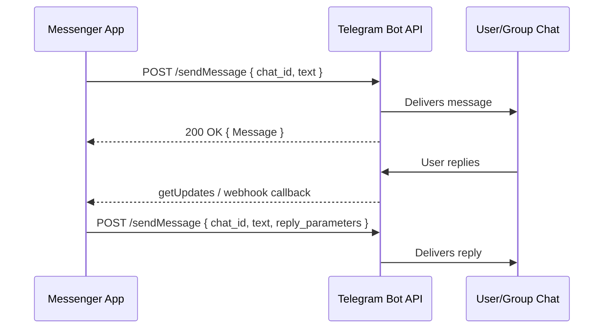

## Telegram Platform Deep Dive

### APIs Available

Telegram exposes two distinct APIs for programmatic interaction:

| API | Protocol | Primary Use Case |
|-----|----------|-----------------|
| **Bot API** | HTTPS/JSON | Bot accounts — send messages, respond to commands, manage groups |
| **Telegram API (MTProto)** | Binary/encrypted | User accounts — full client automation, userbot functionality |

For our messenger use case (originating and sending messages), the **Bot API** is the correct choice. It is simpler, well-documented, and designed for exactly this purpose.

The **MTProto API** is only needed when acting as a user account (e.g., scraping channels, automating a personal account). It requires phone-number authentication, 2FA handling, and session management — far more complexity than sending messages warrants.

#### API Documentation

- **Bot API docs**: <https://core.telegram.org/bots/api> (current version: **9.5**, March 2026)
- **Bot FAQ**: <https://core.telegram.org/bots/faq>

#### OpenAPI Schema

Telegram does not publish an official OpenAPI schema. Community-maintained schemas exist:

- [telegram-bot-api-spec](https://github.com/alserom/telegram-bot-api-spec) — OAS 3.1.0, kept up to date
- [telegram-bot-api-versions](https://github.com/sys-001/telegram-bot-api-versions) — versioned archive of schemas in YAML and JSON

### API Capabilities

The Bot API is a simple HTTPS interface. All requests go to:

```
https://api.telegram.org/bot<TOKEN>/<METHOD>
```



#### Originating a Message

Use the [`sendMessage`](https://core.telegram.org/bots/api#sendmessage) method:

| Parameter | Type | Required | Description |
|-----------|------|----------|-------------|
| `chat_id` | Integer or String | Yes | Target chat ID or `@channel_username` |
| `text` | String | Yes | Message text (1–4096 characters) |
| `parse_mode` | String | No | `HTML`, `MarkdownV2`, or `Markdown` (legacy) |
| `entities` | Array | No | Pre-parsed formatting entities (alternative to `parse_mode`) |
| `link_preview_options` | Object | No | Control URL preview behavior |
| `reply_markup` | Object | No | Inline keyboard, custom reply keyboard, etc. |
| `message_thread_id` | Integer | No | Forum topic ID (for supergroups with topics) |

Beyond text, the API supports sending rich media:

- `sendPhoto`, `sendVideo`, `sendDocument`, `sendAudio`, `sendVoice`
- `sendLocation`, `sendContact`, `sendPoll`
- `sendMediaGroup` — albums of up to 10 photos/videos

#### Replying to Messages

Use `reply_parameters` in any send method:

```rust
// Conceptual — using frankenstein's builder pattern
let params = SendMessageParams::builder()
    .chat_id(chat_id)
    .text("This is a reply!")
    .reply_parameters(
        ReplyParameters::builder()
            .message_id(original_message_id)
            .build()
    )
    .build();
```

The `ReplyParameters` object supports:

| Field | Description |
|-------|-------------|
| `message_id` | The message being replied to |
| `chat_id` | Cross-chat replies (reply to a message in a different chat) |
| `quote` | Partial quote of the original (0–1024 chars) |
| `allow_sending_without_reply` | Send even if the original was deleted |

Other message operations:

- **Edit**: `editMessageText` — update an already-sent message
- **Forward**: `forwardMessage` — copy a message to another chat (shows "Forwarded from")
- **Copy**: `copyMessage` — re-send without the "Forwarded" label
- **Delete**: `deleteMessage` — remove a message the bot sent

### Authentication and Authorization

Telegram Bot API authentication is token-based, with no OAuth or API key rotation:

1. **Create a bot** via [@BotFather](https://t.me/BotFather) on Telegram
2. Receive a **bot token** in the format: `123456789:ABCdefGhIJKlmNoPQRsTUVwxyz`
3. Include the token in every request URL: `https://api.telegram.org/bot<TOKEN>/sendMessage`

**Key security considerations:**

- The token is the **only** credential — anyone with it has full control of the bot
- There is no granular permission scoping; a token grants access to all bot methods
- Tokens can be revoked and regenerated via @BotFather
- All requests must use HTTPS (HTTP is rejected)
- For webhooks: valid SSL required, supported ports are 443, 80, 88, or 8443

**Authorization model for chats:**

- Bots can only message users who have `/start`-ed the bot first (or are in a shared group)
- Group admins control whether the bot can post via bot permissions
- Channel posting requires the bot to be added as a channel admin

### Rust Crates

| Crate | Version | Approach | Bot API Version | Downloads |
|-------|---------|----------|-----------------|-----------|
| [frankenstein](https://crates.io/crates/frankenstein) | 0.48.0 | Thin 1:1 API client | 9.5 | ~200K |
| [teloxide](https://crates.io/crates/teloxide) | 0.17.0 | Full framework | 9.1 | ~860K |
| [carapax](https://crates.io/crates/carapax) | 0.31.0 | Framework (teloxide alternative) | — | ~44K |
| [grammers](https://crates.io/crates/grammers-client) | 0.7.x | MTProto client (user API) | — | ~55K |

#### Recommendation: `frankenstein`

For our messenger use case, **frankenstein** is the best fit because:

1. **1:1 API mapping** — every Telegram Bot API type and method maps directly to a Rust struct/function, making the official docs directly applicable
2. **Minimal abstraction** — no framework opinions about update handling, dialogues, or dependency injection; we just need to send messages
3. **Up to date** — tracks Bot API 9.5 (the latest), while teloxide is on 9.1
4. **Sync and async** — offers both `client-ureq` (blocking) and `client-reqwest` (async)
5. **Builder pattern** — ergonomic struct construction without manual JSON

```rust
use frankenstein::api_params::SendMessageParams;
use frankenstein::AsyncTelegramApi;
use frankenstein::AsyncApi;

let api = AsyncApi::new("BOT_TOKEN");

let params = SendMessageParams::builder()
    .chat_id(12345678)
    .text("Hello from Rust!")
    .parse_mode("MarkdownV2".to_string())
    .build();

let response = api.send_message(&params).await?;
println!("Sent message ID: {}", response.result.message_id);
```

#### When to Choose the Others

**teloxide** — Best when building an **interactive bot** that needs to handle incoming commands, maintain conversation state (dialogues), and route updates through a handler tree. Its `dptree`-based dispatcher, Redis/SQLite dialogue storage, and filter-and-inject pattern make complex bots manageable. Overkill for fire-and-forget messaging.

**carapax** — An alternative to teloxide with a different handler model. Smaller community and ecosystem. Choose only if teloxide's API design doesn't suit your style and you still need a full bot framework.

**grammers** — The only option when you need to act as a **user account** (not a bot). Uses the MTProto protocol directly. Required for: reading channel history as a user, automating personal accounts, or accessing API methods unavailable to bots. Significantly more complex — requires phone auth, session persistence, and managing encryption state.

### Gotchas and Workarounds

#### 1. Rate Limits Are Undocumented and Dynamic

Telegram does not publish exact rate limits. Community-observed thresholds:

| Scope | Approximate Limit | Consequence |
|-------|-------------------|-------------|
| Private chat | ~1 msg/second | 429 error |
| Group chat | ~20 msgs/minute | 429 error |
| Bulk broadcast | ~30 msgs/second | 429 blocks **all** API calls |

**The trap**: When you hit a 429, the `retry_after` period (up to 35+ seconds) blocks **every** API call to your bot, not just the offending chat. A broadcast loop that's too fast will freeze your bot for all users.

**Workaround**: Implement a global rate limiter (e.g., `governor` crate) and respect `retry_after` headers. For broadcasts, send no faster than 25 msgs/second with jitter.

#### 2. MarkdownV2 Escaping Is Painful

MarkdownV2 requires escaping these characters outside entities: `_ * [ ] ( ) ~ ` > # + - = | { } . !`

Inside entities, you cannot escape — you must close and reopen:

```text
// WRONG: _snake\_case_
// RIGHT: _snake_\__case_
```

**Workaround**: Use `HTML` parse mode instead. It follows standard HTML rules (`<b>`, `<i>`, `<code>`) and requires only escaping `<`, `>`, and `&` — standard XML escaping that every language handles well. Alternatively, pass pre-parsed `entities` instead of relying on `parse_mode` at all.

#### 3. Bots Cannot See Other Bots' Messages

By design, bots are invisible to each other in groups. This prevents bot loops but means you cannot build a pipeline of bots that react to each other's messages.

**Workaround**: If you need bot-to-bot communication, use an external channel (Redis, HTTP webhook, message queue) rather than Telegram messages.

#### 4. File Size Limits

| Direction | Limit |
|-----------|-------|
| Upload (bot sends) | 50 MB |
| Download (`getFile`) | 20 MB |

**Workaround**: For larger files, host them externally and send a URL via `sendMessage` or use the [local Bot API server](https://core.telegram.org/bots/api#using-a-local-bot-api-server) which removes these limits.

#### 5. `chat_id` Is Not Always an Integer

For public channels/groups, `chat_id` can be a string like `"@channelname"`. Private chats always use numeric IDs. Group IDs are **negative** numbers (supergroups start with `-100`).

**Workaround**: Model `chat_id` as an enum or use frankenstein's built-in `ChatId` type which handles both variants.

#### 6. Messages Can Silently Fail to Deliver

If a user blocks the bot or hasn't `/start`-ed it, `sendMessage` returns a `403 Forbidden` error — not a silent failure, but easy to overlook in batch sends.

**Workaround**: Handle 403 responses by removing the user from your recipient list to avoid repeatedly hitting dead endpoints.

### Data Model

```rust
use serde::{Deserialize, Serialize};

/// A platform-agnostic message destined for Telegram.
///
/// This struct represents what our messenger needs to send a message,
/// not the full Telegram API response object.
#[derive(Debug, Clone, Serialize, Deserialize)]
pub struct TelegramMessage {
    /// Target chat — numeric ID or "@channel_username".
    pub chat_id: TelegramChatId,

    /// The message content to send.
    pub content: TelegramContent,

    /// How to format the text portion (if any).
    #[serde(default)]
    pub format: TelegramFormat,

    /// If set, this message is a reply to an existing message.
    pub reply_to: Option<TelegramReplyTarget>,

    /// Optional inline keyboard attached to the message.
    pub reply_markup: Option<Vec<Vec<InlineButton>>>,

    /// Send without link previews.
    #[serde(default)]
    pub disable_link_preview: bool,

    /// Send without notification sound.
    #[serde(default)]
    pub silent: bool,

    /// Protect message from forwarding/saving.
    #[serde(default)]
    pub protect_content: bool,

    /// Forum topic ID (for supergroups with topics enabled).
    pub thread_id: Option<i64>,
}

/// Chat identifier — either numeric or a channel username.
#[derive(Debug, Clone, Serialize, Deserialize)]
#[serde(untagged)]
pub enum TelegramChatId {
    /// Numeric chat ID (positive for users, negative for groups).
    Id(i64),
    /// Channel/supergroup username, e.g. "@mychannel".
    Username(String),
}

/// What the message contains.
#[derive(Debug, Clone, Serialize, Deserialize)]
#[serde(tag = "type")]
pub enum TelegramContent {
    /// Plain or formatted text message (up to 4096 chars).
    Text { body: String },
    /// Photo with optional caption (up to 1024 chars).
    Photo { file: FileSource, caption: Option<String> },
    /// Document/file with optional caption.
    Document { file: FileSource, caption: Option<String> },
    /// Video with optional caption.
    Video { file: FileSource, caption: Option<String> },
    /// Forward an existing message.
    Forward { from_chat_id: TelegramChatId, message_id: i64 },
}

/// Where a file comes from.
#[derive(Debug, Clone, Serialize, Deserialize)]
#[serde(tag = "source")]
pub enum FileSource {
    /// A Telegram file_id (previously uploaded file, no re-upload needed).
    FileId { id: String },
    /// A public URL that Telegram will fetch.
    Url { url: String },
    /// A local file path to upload.
    Path { path: String },
}

/// Text formatting mode.
#[derive(Debug, Clone, Default, Serialize, Deserialize)]
pub enum TelegramFormat {
    /// No formatting — plain text.
    #[default]
    Plain,
    /// HTML tags: <b>, <i>, <code>, <a href="...">, etc.
    Html,
    /// MarkdownV2 syntax (requires aggressive escaping).
    MarkdownV2,
}

/// Target for replying to an existing message.
#[derive(Debug, Clone, Serialize, Deserialize)]
pub struct TelegramReplyTarget {
    /// The message ID being replied to.
    pub message_id: i64,
    /// Optional cross-chat reply (reply to a message in a different chat).
    pub chat_id: Option<TelegramChatId>,
    /// Optional quoted excerpt from the original message.
    pub quote: Option<String>,
    /// If true, send even if the original message was deleted.
    #[serde(default)]
    pub allow_missing: bool,
}

/// A button in an inline keyboard row.
#[derive(Debug, Clone, Serialize, Deserialize)]
pub struct InlineButton {
    /// Button label text.
    pub text: String,
    /// Action when pressed.
    pub action: ButtonAction,
}

/// What happens when an inline button is pressed.
#[derive(Debug, Clone, Serialize, Deserialize)]
#[serde(tag = "type")]
pub enum ButtonAction {
    /// Open a URL in the user's browser.
    Url { url: String },
    /// Send callback data to the bot.
    Callback { data: String },
}
```

#### Why This Shape

**`TelegramChatId` is an enum, not a plain `i64`**. The Bot API accepts both numeric IDs and `@username` strings for public channels. Modeling this as an enum forces callers to be explicit and avoids runtime string-to-int conversion bugs. The `#[serde(untagged)]` attribute means JSON like `12345` and `"@channel"` both deserialize naturally.

**`TelegramContent` uses a tagged enum, not separate methods**. Telegram has distinct API methods for each content type (`sendMessage`, `sendPhoto`, `sendDocument`, etc.), but from our messenger's perspective, a message _is_ its content. The enum lets us serialize a message to storage or a queue and dispatch to the correct API method at send time, without losing type information.

**`FileSource` has three variants because Telegram accepts files three ways**. A `file_id` is a string referencing an already-uploaded file (no bandwidth cost to re-send), a URL tells Telegram to fetch it server-side, and a path means we upload bytes ourselves. The three-variant enum makes this choice explicit and prevents accidentally passing a URL where a file_id was expected.

**`TelegramFormat` defaults to `Plain`**. While `MarkdownV2` is more capable, it requires escaping 20+ special characters. Defaulting to `Plain` means messages "just work" without formatting surprises. The `Html` variant is the practical middle ground — it supports rich formatting with only standard XML escaping (`<`, `>`, `&`).

**`reply_markup` is `Option<Vec<Vec<InlineButton>>>`**. The outer `Vec` is rows, the inner `Vec` is buttons per row. This matches Telegram's actual keyboard layout model. We only model `InlineKeyboardMarkup` (not `ReplyKeyboardMarkup`) because inline keyboards are the standard for programmatic bots — reply keyboards replace the user's keyboard and are primarily for conversational bots.

**`silent` and `protect_content` are booleans, not part of an "options" struct**. These are the two most commonly used delivery modifiers. Keeping them flat avoids a nested builder for the 90% case where you just want `silent: true`.

**`Forward` is a content variant, not a separate operation**. Forwarding is semantically "sending a message whose content is another message." Modeling it inside `TelegramContent` keeps the `TelegramMessage` struct as the single unit of work, whether you're composing new text or forwarding existing content.

**`thread_id` exists for forum-enabled supergroups**. Telegram supergroups can have "topics" (like forum threads). Without the correct `message_thread_id`, messages to these groups land in the "General" topic or fail. This is easy to overlook since most groups don't use topics, but when they do, it's required.
