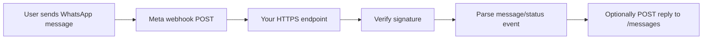

Using the `$research` and `$rust` skills.

# WhatsApp Messaging Platform Deep Dive

## Executive Summary

If you are building a Rust program that can send and receive WhatsApp messages, the API you almost certainly want is **Meta’s WhatsApp Business Platform Cloud API**. It is the current official API for business messaging on WhatsApp.

There are really three official surfaces worth knowing about:

| API | What it is for | Status |
|---|---|---|
| **WhatsApp Cloud API** | Send/receive messages, media, webhooks, message status, marking read, etc. | **Primary official API** |
| **WhatsApp Business Management API** | Manage WhatsApp Business Accounts (WABAs), phone numbers, templates, profiles, onboarding assets | **Official companion API** |
| **WhatsApp On-Premises API** | Self-hosted WhatsApp Business API | **Deprecated** |

Meta’s own Postman workspace explicitly labels the **Cloud API** as “the official WhatsApp API” and the **On-Premises API** as deprecated.  
Source: [Meta Postman workspace overview](https://www.postman.com/meta/whatsapp-business-platform/overview)

---

## Official APIs

### 1. WhatsApp Cloud API

This is the main API used to originate and receive messages.

**Official docs**

- [Cloud API overview](https://developers.facebook.com/docs/whatsapp/cloud-api/overview)
- [Cloud API Postman collection](https://www.postman.com/meta/whatsapp-business-platform/documentation/wlk6lh4/whatsapp-cloud-api)
- [Archived official Node SDK docs](https://whatsapp.github.io/WhatsApp-Nodejs-SDK/)

**OpenAPI schema**

- As of **March 9, 2026**, I did **not** find an official Meta-published OpenAPI schema URL for the WhatsApp Cloud API.
- What Meta does publish officially is:
    - developer docs pages
    - an official Postman workspace/collection
    - an archived official Node SDK and its generated docs

So the practical answer is: **official docs exist, official Postman collections exist, but I did not find a formal official OpenAPI document**.

### 2. WhatsApp Business Management API

This companion API is for the account/configuration side of the platform.

**Official docs**

- [Business Management API docs](https://developers.facebook.com/docs/whatsapp/business-management-api)
- [Business Management API Postman collection](https://www.postman.com/meta/whatsapp-business-platform/collection/13382743-2fd9b32d-f63c-4056-873e-4c398dde9d6d)

Use it for things like:

- WABA lookup
- phone number and asset management
- business profile management
- template management
- onboarding/setup flows

### 3. WhatsApp On-Premises API

This is Meta’s older self-hosted deployment model.

**Official docs**

- [On-Premises API docs](https://developers.facebook.com/docs/whatsapp/on-premises)
- [Meta Postman workspace overview](https://www.postman.com/meta/whatsapp-business-platform/overview)

Meta’s official Postman workspace says the **On-Premises API is being deprecated** and that you should use Cloud API instead.

---

## What the APIs Can Do

## Cloud API capabilities

The Cloud API supports, at minimum:

- text messages
- template messages
- media messages
- interactive messages
- location messages
- contact messages
- stickers
- reactions
- inbound webhook delivery
- message status updates
- marking messages as read
- media upload/download

The archived official Meta Node SDK docs also show typed operations for:

- text
- interactive
- image
- audio
- video
- document
- sticker
- template
- location
- contacts
- status/read handling

Source examples:

- [Text messages](https://whatsapp.github.io/WhatsApp-Nodejs-SDK/api-reference/messages/text/)
- [Interactive messages](https://whatsapp.github.io/WhatsApp-Nodejs-SDK/api-reference/messages/interactive/)
- [Templates](https://whatsapp.github.io/WhatsApp-Nodejs-SDK/api-reference/messages/template/)
- [Receiving messages](https://whatsapp.github.io/WhatsApp-Nodejs-SDK/receivingMessages/)

## How to originate a message

The core send endpoint is:

`POST https://graph.facebook.com/{version}/{phone-number-id}/messages`

A minimal Rust example using `reqwest` looks like this:

```rust
use reqwest::Client;
use serde::Serialize;

#[derive(Serialize)]
struct TextBody<'a> {
    body: &'a str,
}

#[derive(Serialize)]
struct SendTextRequest<'a> {
    messaging_product: &'a str,
    to: &'a str,
    r#type: &'a str,
    text: TextBody<'a>,
}

#[tokio::main]
async fn main() -> Result<(), Box<dyn std::error::Error>> {
    let token = std::env::var("WHATSAPP_ACCESS_TOKEN")?;
    let phone_number_id = std::env::var("WHATSAPP_PHONE_NUMBER_ID")?;

    let request = SendTextRequest {
        messaging_product: "whatsapp",
        to: "15551234567",
        r#type: "text",
        text: TextBody {
            body: "Hello from Rust",
        },
    };

    let url = format!(
        "https://graph.facebook.com/v23.0/{}/messages",
        phone_number_id
    );

    let response = Client::new()
        .post(url)
        .bearer_auth(token)
        .json(&request)
        .send()
        .await?
        .error_for_status()?
        .text()
        .await?;

    println!("{response}");
    Ok(())
}
```

### Important behavioral rule

A recurring official gotcha is the **24-hour customer-service window**. The archived official Meta SDK quickstart explicitly says that after a user replies, the conversation is in a user-initiated session for 24 hours; outside that window, a plain free-form message may not deliver, and you typically need an approved template message instead.

Source: [Meta archived quickstart](https://whatsapp.github.io/WhatsApp-Nodejs-SDK/)

## How to respond to another message

To send a reply, include a `context.message_id` that points at the inbound WhatsApp message ID.

```rust
use reqwest::Client;
use serde::Serialize;

#[derive(Serialize)]
struct Context<'a> {
    message_id: &'a str,
}

#[derive(Serialize)]
struct TextBody<'a> {
    body: &'a str,
}

#[derive(Serialize)]
struct ReplyRequest<'a> {
    messaging_product: &'a str,
    to: &'a str,
    context: Context<'a>,
    r#type: &'a str,
    text: TextBody<'a>,
}

#[tokio::main]
async fn main() -> Result<(), Box<dyn std::error::Error>> {
    let token = std::env::var("WHATSAPP_ACCESS_TOKEN")?;
    let phone_number_id = std::env::var("WHATSAPP_PHONE_NUMBER_ID")?;
    let inbound_message_id = "wamid.HBg...";
    let recipient = "15551234567";

    let request = ReplyRequest {
        messaging_product: "whatsapp",
        to: recipient,
        context: Context {
            message_id: inbound_message_id,
        },
        r#type: "text",
        text: TextBody {
            body: "Thanks, I got your message.",
        },
    };

    let url = format!(
        "https://graph.facebook.com/v23.0/{}/messages",
        phone_number_id
    );

    Client::new()
        .post(url)
        .bearer_auth(token)
        .json(&request)
        .send()
        .await?
        .error_for_status()?;

    Ok(())
}
```

Meta’s archived official SDK docs describe this reply mechanism as `replyMessageId` on message sends; that is the SDK-level abstraction over the same underlying concept.

Sources:

- [Text message API docs](https://whatsapp.github.io/WhatsApp-Nodejs-SDK/api-reference/messages/text/)
- [Interactive message API docs](https://whatsapp.github.io/WhatsApp-Nodejs-SDK/api-reference/messages/interactive/)
- [Template message API docs](https://whatsapp.github.io/WhatsApp-Nodejs-SDK/api-reference/messages/template/)

## How inbound messaging works

Inbound messages arrive through **webhooks**, not long polling.

Typical flow:



To actually receive events, your app must be subscribed to the WABA. Meta’s official Postman collection includes:

`POST /{WABA-ID}/subscribed_apps`

Source: [Cloud API Postman collection](https://www.postman.com/meta/whatsapp-business-platform/documentation/wlk6lh4/whatsapp-cloud-api)

---

## Authentication and Authorization

## Request auth

The APIs use **Bearer tokens**.

Meta’s official Postman docs say the API supports:

- **user access tokens**
- **system user access tokens**

Important details from Meta’s official collection:

- user tokens can expire after **24 hours**
- system user tokens can last **up to 60 days or permanently**, depending on setup
- the main permissions are:
    - `whatsapp_business_management`
    - `whatsapp_business_messaging`

For business-portfolio operations, `business_management` may also be needed.

Source: [Cloud API Postman collection](https://www.postman.com/meta/whatsapp-business-platform/documentation/wlk6lh4/whatsapp-cloud-api)

## Webhook auth/integrity

Webhook setup uses two distinct mechanisms:

| Mechanism | Purpose |
|---|---|
| **Verify token** | Used during webhook subscription verification GET |
| **App secret / `x-hub-signature-256`** | Used to verify POST webhook authenticity |

Meta’s archived official SDK docs explicitly describe:

- GET verification using the webhook verification token
- POST verification against `x-hub-signature-256` using the app secret

Source: [Webhook start docs](https://whatsapp.github.io/WhatsApp-Nodejs-SDK/api-reference/webhooks/start/)

---

## Recommended Rust Crates

There is **no official Meta Rust SDK** for WhatsApp. The Rust ecosystem is third-party and still relatively thin.

## Best recommendation: `whatsapp-business-rs`

- Crate: [`whatsapp-business-rs`](https://crates.io/crates/whatsapp-business-rs)
- Docs: [docs.rs/whatsapp-business-rs](https://docs.rs/whatsapp-business-rs)
- Repo: [GitHub](https://github.com/veecore/whatsapp-business-rs)

### Why I would recommend it

Among the dedicated crates I checked, this is the most complete package:

- message sending
- replies and reactions
- webhook server support
- signature validation
- batch support
- WABA/account management
- catalog support
- multi-tenant support
- active-looking documentation and examples

It is the strongest choice if you want a **single crate that covers both sending and receiving**.

### When it is the best fit

Use it when:

- you want a high-level SDK
- you need both outbound and inbound handling
- you want built-in webhook support
- you may serve multiple WABAs or tenants

## Other crates

### `whatsapp-cloud-api`

- Crate: [`whatsapp-cloud-api`](https://crates.io/crates/whatsapp-cloud-api)
- Docs: [docs.rs/whatsapp-cloud-api](https://docs.rs/whatsapp-cloud-api)
- Repo: [GitHub](https://github.com/sajuthankappan/whatsapp-cloud-api-rs)

This one is a thinner client focused on:

- sending messages
- media
- webhook models

Best fit when:

- you want a smaller abstraction
- you are comfortable owning your own webhook server
- you want less framework opinion

### `whatsapp_handler`

- Crate: [`whatsapp_handler`](https://crates.io/crates/whatsapp_handler)
- Docs: [docs.rs/whatsapp_handler](https://docs.rs/whatsapp_handler)
- Repo: [GitHub](https://github.com/bambby-plus/whatsapp_handler)

This crate appears more webhook-and-format-struct oriented.

Best fit when:

- your main need is webhook payload handling
- you want typed outgoing/incoming structs
- you are okay with a smaller ecosystem footprint

### `whatsapp`

- Crate: [`whatsapp`](https://crates.io/crates/whatsapp)

I would **not** recommend this today. Its published README says it is effectively reserving the crate for future work and does not yet provide a meaningful implementation.

## Practical recommendation beyond dedicated crates

For production systems, I would seriously consider:

- `reqwest`
- `serde`
- your own strongly-typed domain model
- optional thin wrappers over a small subset of WhatsApp endpoints

Reason: Meta’s Graph APIs version over time, and third-party SDKs can lag.

---

## Common Gotchas and Workarounds

## 1. The 24-hour messaging window

**Gotcha:** developers send a plain text message, get a `200`, and still do not see expected delivery behavior once the user-initiated service window has expired.

**Workaround:** treat outbound messaging as two modes:

- **session message** inside the 24-hour window
- **template message** outside it

Source: [Meta archived quickstart](https://whatsapp.github.io/WhatsApp-Nodejs-SDK/)

## 2. Webhooks are configured, but no inbound events arrive

**Gotcha:** having a webhook URL is not enough; your app also needs to be subscribed to the WABA.

**Workaround:** ensure you call the WABA subscription endpoint:

- `POST /{WABA-ID}/subscribed_apps`

Source: [Cloud API Postman collection](https://www.postman.com/meta/whatsapp-business-platform/documentation/wlk6lh4/whatsapp-cloud-api)

## 3. Signature verification breaks because the body was already parsed

**Gotcha:** many frameworks consume or reserialize the body before you verify `x-hub-signature-256`, causing signature mismatch.

**Workaround:** verify the signature against the **raw request bytes** before JSON parsing.

Source: [Webhook docs](https://whatsapp.github.io/WhatsApp-Nodejs-SDK/api-reference/webhooks/start/)

## 4. Temporary tokens work in testing, then suddenly fail

**Gotcha:** developers start with a dashboard token and forget it is short-lived.

**Workaround:** move early to a **system user access token** and explicitly monitor token lifecycle.

Source: [Cloud API Postman collection](https://www.postman.com/meta/whatsapp-business-platform/documentation/wlk6lh4/whatsapp-cloud-api)

## 5. Phone setup has hidden onboarding requirements

**Gotcha:** number registration is not just “add number and go.” Meta’s official collection notes:

- you must register the phone number
- you must set a 6-digit two-step verification PIN
- embedded-signup registrations have a time window

**Workaround:** model onboarding as a state machine in your system, not a single boolean.

Source: [Cloud API Postman collection](https://www.postman.com/meta/whatsapp-business-platform/documentation/wlk6lh4/whatsapp-cloud-api)

## 6. SDK/documentation drift

**Gotcha:** the official Meta Node SDK is archived; unofficial Rust crates may lag behind new Graph versions.

**Workaround:** pin the Graph API version explicitly and isolate your WhatsApp integration behind your own trait boundary.

Sources:

- [Archived official Node SDK repo](https://github.com/WhatsApp/WhatsApp-Nodejs-SDK)
- [whatsapp-business-rs](https://crates.io/crates/whatsapp-business-rs)

## 7. Treating WhatsApp messages like generic SMS

**Gotcha:** WhatsApp messages carry richer structure:

- quoted replies
- interactive responses
- media references
- contacts
- locations
- statuses
- conversation/session metadata

**Workaround:** do not model a WhatsApp message as just `{to, from, body}`.

---

## Suggested Rust Data Model

```rust
use chrono::{DateTime, Utc};
use serde::{Deserialize, Serialize};
use std::collections::BTreeMap;

#[derive(Debug, Clone, Serialize, Deserialize, PartialEq, Eq)]
pub enum WhatsAppDirection {
    Inbound,
    Outbound,
}

#[derive(Debug, Clone, Serialize, Deserialize, PartialEq, Eq)]
pub enum WhatsAppMessageKind {
    Text,
    Image,
    Audio,
    Video,
    Document,
    Sticker,
    Template,
    Interactive,
    Reaction,
    Location,
    Contact,
    Order,
    Unsupported,
}

#[derive(Debug, Clone, Serialize, Deserialize, PartialEq, Eq)]
pub enum WhatsAppDeliveryStatus {
    Accepted,
    Sent,
    Delivered,
    Read,
    Failed,
    Unknown,
}

#[derive(Debug, Clone, Serialize, Deserialize, PartialEq, Eq)]
pub struct WhatsAppAddress {
    pub wa_id: Option<String>,
    pub phone_e164: Option<String>,
    pub profile_name: Option<String>,
}

#[derive(Debug, Clone, Serialize, Deserialize, PartialEq)]
pub struct WhatsAppText {
    pub body: String,
    pub preview_url: bool,
}

#[derive(Debug, Clone, Serialize, Deserialize, PartialEq, Eq)]
pub struct WhatsAppMediaRef {
    pub media_id: Option<String>,
    pub mime_type: Option<String>,
    pub sha256: Option<String>,
    pub caption: Option<String>,
    pub filename: Option<String>,
}

#[derive(Debug, Clone, Serialize, Deserialize, PartialEq)]
pub struct WhatsAppLocation {
    pub latitude: f64,
    pub longitude: f64,
    pub name: Option<String>,
    pub address: Option<String>,
}

#[derive(Debug, Clone, Serialize, Deserialize, PartialEq, Eq)]
pub struct WhatsAppInteractiveReply {
    pub interaction_type: String,
    pub id: String,
    pub title: Option<String>,
    pub description: Option<String>,
}

#[derive(Debug, Clone, Serialize, Deserialize, PartialEq, Eq)]
pub struct WhatsAppReaction {
    pub emoji: String,
    pub target_message_id: String,
}

#[derive(Debug, Clone, Serialize, Deserialize, PartialEq)]
pub enum WhatsAppContent {
    Text(WhatsAppText),
    Media(WhatsAppMediaRef),
    Location(WhatsAppLocation),
    InteractiveReply(WhatsAppInteractiveReply),
    Reaction(WhatsAppReaction),
    ContactCard(String),
    Template {
        template_name: String,
        language_code: String,
        rendered_text: Option<String>,
    },
    Unsupported {
        raw_type: String,
    },
}

#[derive(Debug, Clone, Serialize, Deserialize, PartialEq, Eq)]
pub struct WhatsAppConversationRef {
    pub conversation_id: Option<String>,
    pub pricing_category: Option<String>,
    pub expires_at: Option<DateTime<Utc>>,
}

#[derive(Debug, Clone, Serialize, Deserialize, PartialEq)]
pub struct WhatsAppMessage {
    pub platform_message_id: String,
    pub direction: WhatsAppDirection,
    pub kind: WhatsAppMessageKind,

    pub sender: WhatsAppAddress,
    pub recipient: WhatsAppAddress,

    pub reply_to_message_id: Option<String>,
    pub forwarded: Option<bool>,

    pub content: WhatsAppContent,
    pub status: WhatsAppDeliveryStatus,

    pub sent_at: Option<DateTime<Utc>>,
    pub received_at: Option<DateTime<Utc>>,
    pub updated_at: DateTime<Utc>,

    pub phone_number_id: Option<String>,
    pub waba_id: Option<String>,
    pub conversation: Option<WhatsAppConversationRef>,

    pub raw_webhook: Option<serde_json::Value>,
    pub provider_metadata: BTreeMap<String, String>,
}
```

## WHY this is the right format

### 1. It separates **transport identity** from **message content**
A WhatsApp integration must preserve platform-native IDs like `wamid...`. Those IDs are required for:

- replies
- reactions
- deduplication
- correlating status updates

That is why `platform_message_id` is first-class.

### 2. `kind` and `content` are both needed
At first glance this may look redundant. It is intentional.

- `kind` is good for indexing, analytics, and filtering.
- `content` is good for strongly typed payload handling.

This keeps storage and application logic simpler.

### 3. Reply linkage must be explicit
WhatsApp supports true quoted replies. If you omit `reply_to_message_id`, you lose:

- threading
- “reply to inbound message” behavior
- clean bot state transitions

### 4. Delivery status is not the same thing as the message body
WhatsApp messages evolve over time:

- accepted
- sent
- delivered
- read
- failed

Those updates often arrive separately from the original send. That is why `status` and `updated_at` live on the message envelope, not inside content.

### 5. Conversation metadata matters operationally
WhatsApp is not just “send a message.” Conversation/session rules affect whether you may send free-form text or must use templates. So storing conversation metadata is operationally valuable, not optional bookkeeping.

### 6. Raw payload retention is worth it
`raw_webhook` is not elegant, but it is useful.
It helps with:

- auditability
- debugging unexpected payload variants
- surviving API drift
- backfilling your typed model when Meta adds new fields

### 7. Address objects should not just be strings
In WhatsApp, a human identity may surface as:

- `wa_id`
- normalized phone number
- profile/display name

Those fields should stay grouped.

---

## Recommendation for a Rust Implementation

If I were building this today, I would do one of these two:

| Approach | When I’d choose it |
|---|---|
| `whatsapp-business-rs` | I want the fastest path to a capable integration with webhook support |
| `reqwest` + `serde` + my own domain types | I want maximum control, low dependency risk, and easier long-term API-version management |

If you expect a lot of platform-specific behavior, I would still keep an **internal domain model** like `WhatsAppMessage` even if you use an SDK crate. Do not let external SDK types leak through your application.

---

## Sources

- [Meta WhatsApp Business Platform Postman workspace overview](https://www.postman.com/meta/whatsapp-business-platform/overview)
- [Meta WhatsApp Cloud API Postman collection](https://www.postman.com/meta/whatsapp-business-platform/documentation/wlk6lh4/whatsapp-cloud-api)
- [Meta WhatsApp Business Management API Postman collection](https://www.postman.com/meta/whatsapp-business-platform/collection/13382743-2fd9b32d-f63c-4056-873e-4c398dde9d6d)
- [Cloud API overview docs](https://developers.facebook.com/docs/whatsapp/cloud-api/overview)
- [Business Management API docs](https://developers.facebook.com/docs/whatsapp/business-management-api)
- [Archived official Meta Node SDK repo](https://github.com/WhatsApp/WhatsApp-Nodejs-SDK)
- [Archived official Meta SDK quickstart/docs](https://whatsapp.github.io/WhatsApp-Nodejs-SDK/)
- [Text message docs](https://whatsapp.github.io/WhatsApp-Nodejs-SDK/api-reference/messages/text/)
- [Interactive message docs](https://whatsapp.github.io/WhatsApp-Nodejs-SDK/api-reference/messages/interactive/)
- [Template message docs](https://whatsapp.github.io/WhatsApp-Nodejs-SDK/api-reference/messages/template/)
- [Webhook docs](https://whatsapp.github.io/WhatsApp-Nodejs-SDK/api-reference/webhooks/start/)
- [`whatsapp-business-rs`](https://crates.io/crates/whatsapp-business-rs)
- [`whatsapp-cloud-api`](https://crates.io/crates/whatsapp-cloud-api)
- [`whatsapp_handler`](https://crates.io/crates/whatsapp_handler)

If you want, I can turn this next into a provider adapter design for your Rust program, including a trait like `MessagingProvider` plus a concrete `WhatsAppProvider` implementation outline.
