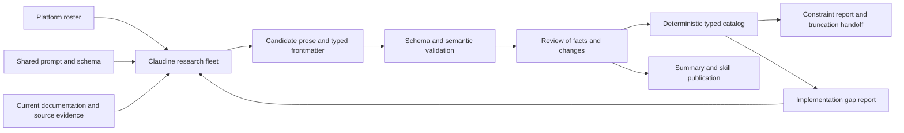

# Provider Research Metadata Pipeline

## Purpose

Turn Messenger's platform research into a repeatable, evidence-backed source of typed provider knowledge. Message length constraints are the first consumer, but the contract must also describe formatting, attachments, delivery capabilities, API errors, and operational restrictions that affect portable outbound messages, together with inbound and interactive capabilities needed for future conversations.

Adopt the pattern described in [Agentic Research as a Typed Knowledge Pipeline](docs/topics/agentic-research-as-a-typed-knowledge-pipeline.md): a shared roster, reusable fleet prompt, schema-validated research documents, deterministic consumers, reviewed refreshes, and a compact publication into the Messenger agent skill.

“Self-learning” means that refreshed evidence exposes changed facts, schema gaps, and implementation gaps, which feed subsequent research and reviewed changes. It does not mean that a research agent can silently change delivery behavior or promote its own claims into runtime policy.

This feature establishes that knowledge pipeline. The [Discord truncation fix](../../fixes/2026-09-06-truncation/spec.md) remains a separate behavior specification. Its eventual broadening should consume this feature's validated constraints instead of accumulating independent provider constants.

## Current State

The [platform research directory](../../docs/research/platforms/) contains prose documents for Discord, Slack, Telegram, WhatsApp, Signal, and email. The five chat documents carry provider-specific inline-compose prompts and `last_updated: 2026-03-09`. They cover APIs, authentication, capabilities, Rust clients, and integration pitfalls, but do not expose a shared typed contract for these facts.

The existing material is useful input, not an accepted metadata baseline:

- Discord's research describes individual embed limits and includes a truncation example. The truncation fix already identifies problems with that example and with treating a client-side validation failure as identical to an HTTP rejection.
- Telegram's research mentions text and caption lengths, formatting, file limits, and rate limits. These facts need separate fields, scopes, units, and evidence.
- Slack's research has useful API and threading context but does not provide the complete constraint inventory needed by a truncation consumer.
- WhatsApp and Signal require research specific to the transport Messenger actually uses. Consumer application behavior alone cannot establish an outbound API contract.

Messenger's [`CapabilitySet`](../../lib/src/capabilities.rs) describes implemented features with booleans and attachment kinds. It is not a catalog of everything a platform supports. In particular, [`SignalProvider`](../../lib/src/provider/signal.rs) uses signal-cli's JSON-RPC interface. Research into a separate REST wrapper must not be substituted for that interface.

Preserve the distinction between platform facts, adapter implementation, and Messenger policy throughout this feature.

## Scope and Deliverables

The first fleet covers Discord, Slack, Telegram, WhatsApp, and Signal. Discord bot and webhook adapters, and Slack Web API and incoming-webhook adapters, receive distinct interface records inside their platform documents. Telegram covers the Bot API, WhatsApp covers the Cloud API, and Signal covers signal-cli JSON-RPC plus relevant underlying service constraints.

Email remains existing research outside this fleet. Desktop, APNs, and FCM remain outside the initial contract. Adding them later requires explicit roster entries and any necessary schema changes; no consumer may interpret their absence as unrestricted support.

Deliver:

1. A roster and shared fleet prompt that preserve the existing research paths and useful prose.
2. A versioned SimplifiedSchema contract with typed metadata in each of the five documents.
3. A deterministic validator and catalog generator with explicit unknowns, evidence references, and implementation-gap reporting.
4. A reviewed initial research baseline, cross-provider summary, and skill publication workflow.
5. A handoff for broadening truncation, identifying enforceable constraints and unresolved research questions per adapter.
6. An endpoint-scoped error catalog and diagnostic handoff describing recognition, user remediation, delivery certainty, and recovery prerequisites.
7. A formatting and image-support matrix separating grammar, payload bindings, image roles, and transport, with canonical role mappings and explicit portability gaps.
8. An attribution and context matrix covering author identity/control, location semantics, and API-addressable expressive effects, including explicit unsupported and unknown results.
9. An interactivity matrix covering inbound text, structured questions/replies, and forms, scoped to integration interfaces and recipient-client conditions, with transport and lifecycle prerequisites for future implementation.
10. API-version findings and a known release chronology per interface, plus a delta phase that examines metadata changes and produces a report suitable for the CHANGELOG.

This feature does not implement truncation, splitting, attachment fallback, new provider capabilities, rate limiting, retries, runtime error translation, inbound listeners, interactive sessions, form execution, or delivery-policy changes. It does not run live message probes as part of ordinary research or tests. It does not introduce a generic research framework or copy Claudine's entire code-generation architecture.

## Architecture and Artifact Ownership

Proposed artifacts, relative to `messenger/`:

| Artifact | Authority and purpose |
|---|---|
| `docs/platforms.yaml` | Stable platform roster, interface identities, output filenames, provider identification URLs, curated research-source URLs, research status, refresh interval |
| `docs/research/platforms/_fleet.md` | Shared research instructions and Claudine sequence lifecycle |
| `docs/research/platforms/_schema.yaml` | Metadata shape and vocabulary, using Darkmatter SimplifiedSchema |
| `docs/research/platforms/{platform}.md` | Durable source artifact: evidence, typed facts, explanatory prose, changes, and gaps |
| `docs/research/platforms/_overrides.yaml` | Optional reviewed corrections; create only when a concrete correction needs one |
| `docs/research/platforms/catalog.json` | Deterministic generated snapshot of validated facts, including unknowns and provenance |
| `docs/research/summary/platforms.md` | Cross-provider comparison and implementation guidance derived from accepted research |
| `docs/research/CHANGELOG.md` | Concise accepted research changes, affected platforms/facts, evidence, uncertainty, and review conclusions |
| Separate review artifacts; paths chosen during implementation planning | Durable repository records needed to explain accepted changes; local candidate, rejected, failed, and routine-renewal records remain separate from accepted history |
| `.claude/skills/messenger/platform-metadata.md` at repository root | Published summary with links back to detailed research |

The roster owns identity and coverage; research owns external facts; Rust adapters own implemented behavior. Generated artifacts must identify their inputs and must not be edited manually.

Implement typed loading and deterministic projection in the existing `messenger` library, with maintenance commands in `messenger-cli`. Keep schema/orchestration dependencies outside the normal send path; use an opt-in maintenance feature if needed. Do not add Claudine as a runtime dependency of Messenger. Claudine is the external research orchestrator.

The first catalog serves offline reporting and future integration. Ordinary builds and sends require no network, research agent, research workspace, or automatic catalog refresh. Wiring selected constraints into delivery behavior belongs to the follow-up truncation work.

## Metadata Contract

### Identity, scope, and evidence

Every document declares `$schema: ./_schema.yaml`, `schema_version`, `platform_id`, `created`, `last_updated`, `agent`, `model`, `sources`, `interfaces`, `changes`, and `gaps`. Research identity fields are not Git attribution. Preserve `created` on refresh. Keep generation timestamps out of deterministic catalog content.

Each interface record has a stable `interface_id`, API or bridge identity, version applicability, official/community classification, and a list of mapped Messenger adapter identities. Endpoint templates contain no credentials. API version and SDK/bridge version are separate fields: a client validator and its server can impose different constraints.

Every fact has a stable ID, a knowledge state, evidence references, and an optional explanation. Knowledge states are:

| State | Meaning |
|---|---|
| `known` | Evidence supports the stated value within its scope |
| `unknown` | Research has not established a usable value; include the reason and next research question |
| `conflicting` | Applicable sources disagree; retain the competing claims and evidence |
| `not_applicable` | The fact does not apply to this interface or surface; explain why |

Unsupported is a known capability value, not a synonym for unknown. An undocumented bound is not unlimited. Omitted records and empty arrays must not imply absence of constraints: required coverage is checked separately.

Source records contain a stable source ID, URL or repository-relative evidence location, source kind (`official_docs`, `source_code`, `sdk_validator`, `observed_fixture`, or `secondary`), locator within the source, retrieval/observation date, and version or revision when available. Facts reference these IDs. Record source kind separately from confidence (`high`, `medium`, `low`); official documentation can still leave counting semantics ambiguous.

Prefer official documentation and versioned source. For Signal bridge behavior, the bridge project's source is primary evidence for that bridge. Existing research, generated summaries, and AI output are never independent corroboration. Secondary-only or inferred claims remain visible but cannot become executable constraints without additional evidence and review.

### API versions and known release chronology

For each interface, research the latest published stable API version and separately identify publicly documented preview versions. Keep provider API versions distinct from SDK and bridge releases, including signal-cli releases. A bridge release must not stand in for an underlying service API version.

Maintain a non-exhaustive chronology of known API versions using authoritative sources. Record version identifiers, release dates when available, supporting evidence, and other identifying information those sources establish. Missing dates remain explicitly unknown; a source retrieval date is not a release date. Distinguish an API established to be unversioned from one whose versioning has not yet been established by research.

Preserve previously recorded versions during refresh. Reconcile corrections against evidence rather than replacing the chronology with only the releases found in the latest run. Full historical backfilling is not required. Version identifiers and dates help interpret changes during the delta phase, but a new release does not by itself prove that a constraint or capability changed.

### Message constraints: more than a truncation length

A constraint is scoped to an interface, operation, and payload surface. The logical key is `(platform_id, interface_id, operation, constraint_id)`. Never collapse all message surfaces into a platform-wide scalar.

| Field | Required semantics |
|---|---|
| `surface` | Stable semantic field such as body, summary, caption, attachment description, or embed description; retain the provider-native field locator |
| `kind` | `hard_max`, `recommended_max`, `aggregate_max`, `item_count_max`, or `payload_bytes_max` |
| `value` | Nonnegative integer for a known numeric bound; absent for unknown, conflicting, or not-applicable records |
| `unit` | `utf8_bytes`, `unicode_scalars`, `utf16_code_units`, `grapheme_clusters`, `items`, or `unspecified_characters` |
| `measurement_stage` | `field_value`, `parsed_text`, `serialized_payload`, or `unknown` |
| `enforced_by` | `service`, `sdk`, or `bridge`; recommendations identify their recommending source rather than pretending to be enforced |
| `overflow_behavior` | `reject`, `truncate`, `split`, `transform`, or `unknown`, with observable error/warning details where available |
| `applies_when` | Typed applicability conditions for message form, account tier, API/bridge version, hosting mode, or media kind |
| `members` | For aggregate constraints, stable IDs of contributing surfaces, including repeated items and the aggregation scope |
| `evidence` | Source IDs supporting the value, units, stage, conditions, and overflow behavior; uncertainty may remain on individual dimensions |

Use typed condition records with a bounded vocabulary, not executable expressions or an arbitrary rule language. An unmodeled condition becomes a gap and makes the constraint ineligible for enforcement. Multiple simultaneously applicable bounds must all remain visible. Conflicting claims for the same scoped bound do not become “last entry wins.”

Separate field limits, aggregate limits, request byte limits, and collection counts. Record lower bounds or required-content combinations when they affect whether a shortened message remains valid. Count text in the documented representation: source Markdown, rendered markup, parsed text, and JSON-escaped bytes are different quantities.

Do not translate a documentation claim of “characters” into Rust `chars().count()` without evidence. UTF-8 boundary safety, grapheme-safe cutting, and a provider's measurement unit are separate concerns. Likewise, entity offset units do not establish message-length units.

Three documentation spot-checks illustrate why the richer model is necessary; they are design evidence, not the completed fleet baseline:

- Slack recommends 4,000 characters for `text` but describes truncation beyond 40,000, while block limits depend on block type. Store the recommendation separately from the service threshold. [Slack `chat.postMessage`](https://docs.slack.dev/reference/methods/chat.postMessage/#truncating-content), checked 2026-09-17.
- Discord documents a 6,000-character combined budget across specified fields in all embeds attached to a message. An individual description limit cannot represent this constraint. [Discord embed limits](https://docs.discord.com/developers/resources/message#embed-limits), checked 2026-09-17.
- Telegram describes caption limits after entity parsing and separately specifies UTF-16 code units for entity offsets and lengths. These are distinct pieces of metadata; the latter does not resolve every length-counting question. [Telegram Bot API](https://core.telegram.org/bots/api#messageentity), checked 2026-09-17.

The initial fleet must explicitly investigate these surfaces:

| Platform / interface | Required investigation |
|---|---|
| Discord bot and webhook | Content, summary-to-content mapping, embed description and other text fields, aggregate embeds, attachment description, attachment counts/sizes, SDK versus HTTP enforcement |
| Slack Web API and webhook | Top-level text, notification fallback, recommendations versus truncation, block-specific and aggregate limits, response warnings, interface differences |
| Telegram Bot API | Text and media captions, parse modes, parsed text versus markup, entity units/counts, media groups, hosted versus local Bot API differences |
| WhatsApp Cloud API | Free-form text, media captions, template components and interactive fields, API-version and conversation eligibility conditions |
| Signal via signal-cli JSON-RPC | Text and attachment behavior, bridge/version constraints, service versus client display limits, any long-text transformation, and evidence gaps |

A fact discovered for a surface Messenger does not emit is still useful research, but it must not be attached to the current adapter's send path by assumption.

### Other metadata and its consumers

All categories below belong in the initial research contract. Depth is driven by current outbound-message consumers; exhaustively cataloging unrelated APIs is out of scope. Required categories accept explicit unknowns with actionable gaps.

| Category | Typed attributes | Concrete consumer |
|---|---|---|
| Formatting grammar | Grammar family and dialect, per-construct support, escaping/nesting rules, entity offset unit | Renderer compatibility checks and future valid truncation |
| Text payload bindings | Plain/rich fields, parse-mode selectors, structured alternatives, coexistence/precedence rules, notification and accessibility fallbacks | Map portable message bodies to the correct API representation |
| Images | Canonical role, provider field/operation, placement, source mechanism, cardinality/grouping, captions, alt text, and transformations | Consistent image intent and explicit fallback planning across apps |
| Attachments | Supported media kinds, upload mechanisms, MIME restrictions, per-file and total size/count constraints, captions and alt text | Attachment preflight and fallback planning |
| Addressing and replies | Destination kinds, reply versus thread support, required reference fields, whether send returns an addressable identifier | `Target`, `MessageRef`, and receipt compatibility reporting |
| Attribution | Sender identity, displayed author fields, caller control, delegation/forwarding provenance, and configuration scope | Consistent author presentation without confusing display labels with authenticated identity |
| Location context | Author versus shared-place semantics, inclusion rules, provenance, static/live modes, field bindings, and display behavior | Correct mapping of location intent and clear disclosure of what a location represents |
| Expressive effects | Native effect identifiers, semantic intent, API availability, eligibility, presentation scope, and fallback fidelity | Discover portable expression where available and expose unsupported effects honestly |
| Interactivity | Inbound text visibility/transport, structured question and answer bindings, form composition, correlation, and acknowledgment lifecycle | Future conversational workflows without assuming all sending interfaces can receive or collect answers |
| Delivery controls | Silent delivery, link-preview control, mention control, edit/delete support | Compare researched capabilities with implemented `CapabilitySet` and adapter behavior |
| Delivery eligibility | Authentication scheme, required scopes, membership/registration requirements, business conversation windows, template prerequisites | Setup documentation and future preflight diagnostics |
| Rate limits and recovery | Operation/scope, fixed versus dynamic limits, documented rate/burst where known, retry-after location/unit, references to error records, idempotency support | Future throttling and retry design without assuming replay is safe |
| Errors and warnings | Response envelopes, native codes/subcodes, normalized categories, affected fields, delivery certainty, recovery prerequisites, and user remediation | Consistent diagnostics and future error handling across adapters |
| Receipt semantics | Accepted versus delivered/read state, synchronous identifiers, asynchronous status mechanisms, warning locations | Honest delivery reporting and future loss reporting |

Formatting rules and provider prerequisites should use typed categories plus prose explanations; do not invent a machine-executable grammar for every platform. Rate records must retain whether a value is documented, observed, or dynamic. Never turn a community throughput estimate into a hard service guarantee.

Capability values use `supported`, `conditional`, and `unsupported`, wrapped in the knowledge state above. Keep native support distinct from Messenger's text fallback. Research must not set implementation booleans merely because a platform supports a feature.

Implementation coverage is a separate projection from the checked-out adapter code, tests, and explicit mappings. Report `implemented`, `partial`, `missing`, or `unassessed`, along with the inspected revision and code/test references. A conditional or uncertain external capability cannot automatically rewrite `CapabilitySet`. Emit `requires_messenger_update` with structured gap records naming the affected adapter, fact IDs, reason, and proposed follow-up.

Store explicit reviewed mappings for each adapter from researched capabilities to implementing code and relevant tests. Humans or agents may propose these assessments; accepted mappings require human review. Record fingerprints of the relevant assessed inputs and reuse the assessment while they remain unchanged. When a relevant fingerprint changes, mark the affected assessment `unassessed` until reviewed again. The checkout revision provides provenance; an unrelated commit alone does not invalidate an assessment.

These mappings support reporting, not runtime capability changes. Their reliability depends on identifying the relevant inputs: an omitted dependency can leave an assessment stale. This feature does not promise complete static dependency analysis or automatic proof of implementation correctness.

### Formatting grammar and API representation

Research formatting per text surface and operation, not once per platform. A body, caption, embed description, and notification fallback can accept different grammars even inside one request. Use two linked record types: `format_profiles` describe syntax and `text_bindings` describe where and how that syntax is submitted. Apply the same knowledge states and evidence requirements as other facts.

Each format profile records:

- A stable profile ID and grammar family: `plain_text`, `markdown`, `markdown_subset`, `html`, or `provider_markup`. Record the named dialect/specification and version when known. Do not label a provider-specific language as full Markdown or HTML merely because some syntax looks familiar.
- Support for an explicit construct inventory: emphasis, strong emphasis, strikethrough, underline, inline code, fenced code/language hints, links, images, headings, lists, block quotes, tables, spoilers, and mentions. Each construct is supported, conditional, unsupported, or explicitly unknown through the shared knowledge model; include restrictions and native syntax examples.
- Escaping, nesting, newline behavior, automatic link/mention interpretation, and malformed/unsupported-syntax behavior (`reject`, `literal`, `strip`, `transform`, or `unknown`). Structured text entities are a separate representation with their own indexing units; they do not establish a markup grammar.
- Links to applicable length constraints and errors. Retain small input/expected-interpretation fixtures for formatting features that a deterministic consumer will use; documentation examples and observed fixtures remain distinguishable.

Each text binding records the interface, operation, semantic surface, native field locator, and representation (`text`, `markup`, `entities`, or `structured_blocks`). It references the accepted format profiles and any selector field with its exact allowed values and default. Identify whether plain and formatted content use the same field with a mode switch, different fields, a structured object/array, or separate operations.

Record field relationships explicitly: `mutually_exclusive`, `required_together`, `optional_companion`, or `fallback_for`, plus documented precedence if multiple representations are supplied. Distinguish the primary chat content from notification, accessibility, and compatibility fallback text. A plain fallback accompanying rich content is not necessarily a second visible message. Represent an absent plain-text mode or an unknown precedence rule honestly; do not assume that escaping Markdown disables all provider parsing.

Map each currently supported `MessageBody` variant to its actual adapter binding in the implementation projection. A platform's available HTML mode is not evidence that Messenger renders HTML for it. Future renderer selection must consider both external support and implemented bindings, and truncation must use the selected binding's measurement stage.

### Image roles, placement, and transport

An image's intended role, visual placement, source mechanism, and file format are separate dimensions. An uploaded image can serve several roles; a URL can identify a primary image, thumbnail, or automatic preview. MIME types such as PNG and JPEG belong to media constraints, not the canonical role enumeration.

Define a canonical `ImageRole` vocabulary for research and future portable intent:

| Role | Intended use |
|---|---|
| `inline_content` | Image anchored to a position among text/content nodes |
| `attachment` | Standalone message media without a specific embedded presentation role |
| `primary` | Main image in a rich message or card; also covers a provider's hero-image slot |
| `thumbnail` | Compact supporting image for a rich message or card |
| `accessory` | Image associated with a particular section or block beside its content |
| `author_icon` | Image identifying the author of a rich content object |
| `footer_icon` | Image decorating or identifying the footer of a rich content object |
| `link_preview` | Image associated with a URL preview/unfurl |

This is a proposed schema vocabulary to exercise in the pilot, not a claim that each provider supports each role. A role must have a precise provider mapping or an explicit unsupported/unknown result. Preserve newly discovered native roles as unmapped research gaps until the vocabulary is reviewed; do not silently force them into `attachment`.

Each `image_binding` identifies a native image slot and records:

- Stable binding ID, interface/operation, containing text/block/card surface, canonical role, native field locator, and evidence. A slot that can serve multiple roles needs explicit mappings and any conditions distinguishing them.
- Placement (`inline_anchor`, `standalone_media`, `card_main`, `card_thumbnail`, `section_accessory`, `author_area`, `footer_area`, or `preview`) and placement control (`explicit`, `provider_selected`, or `unknown`). Distinguish a URL rendered at a text anchor from a provider-generated preview elsewhere.
- Submission mechanism (`markup_reference`, `request_field`, `multipart_part`, `upload_then_reference`, or `separate_operation`) and accepted source kinds (`remote_url`, `upload_bytes`, or `provider_media_id`). Describe authentication, URL-fetch requirements, reference lifetime/reuse, and upload prerequisites where relevant.
- Minimum/maximum items per slot and per message, shared count/size budgets, mutual exclusions, and whether multiple images require repeated objects or multiple requests. Reference shared constraints rather than copying their numbers.
- Collection form (`single`, `ordered_list`, `album`, `gallery`, `carousel`, or `provider_selected`), ordering guarantees, grouping/atomicity, per-item versus shared captions, and whether multiple receipts result. A gallery is a collection arrangement, not an image role.
- Caption and alt-text fields with their own format-profile and constraint references. Alt text, visible captions, and filenames must not be treated as interchangeable.
- Accepted MIME types, dimensions/aspect ratios, byte limits, animation support, and documented resizing, compression, cropping, or format conversion. Requested dimensions do not imply guaranteed display dimensions.
- Whether the image is caller-supplied, provider-derived, or configurable only at account/application scope. A sender avatar is not a per-message `author_icon` unless the API actually permits that use. Preview suppression does not imply the caller can choose the preview image.

Require a role-coverage matrix per interface, alongside the concrete bindings: every canonical role is supported, conditional, unsupported, or explicitly unknown. A provider can map several native slots to one role. Selection must retain operation, conditions, and fidelity; never choose the first matching slot by catalog order. State whether the requested intent is preserved exactly, approximated, or unsupported.

For example, a future request for a primary image and two attachments can map to an exact primary slot plus media slots, an approximate ordered media collection, or an unsupported combination. These are conceptual alternatives for the mapper to report, not assertions about any particular provider. Research records the available choices; a later Messenger policy decides whether approximation is allowed. It must not quietly move an image intended for inline content into an attachment or identity slot.

The initial feature produces a comparison and mapping handoff, not new rendering or upload behavior. Include image-capable outbound operations even when Messenger has not implemented them yet, and mark that implementation gap. Keep existing attachment-kind metadata: `AttachmentKind::Image` describes media, while the proposed `ImageRole` describes intent. The follow-up API design decides how callers express roles without conflating these dimensions.

### Attribution and author identity

Research who the platform identifies as the sender and what the API caller can influence. Distinguish authenticated account/bot identity, displayed sender name/avatar, rich-content author labels, signatures, and forwarded/delegated authorship. A caller-supplied author label inside a card does not establish the identity of the sender.

Each `attribution_binding` records the interface/operation, semantic role (`sender_identity`, `sender_display_name`, `sender_avatar`, `content_author`, `signature`, `forwarded_origin`, or `delegated_author`), native fields, and evidence. Record:

- Ownership/control: `platform_derived`, `account_configured`, `application_configured`, `caller_supplied`, or `mixed`, with field-level records when control differs across properties.
- Configuration scope: account, application, webhook, conversation, or message. Distinguish defaults from per-message overrides, including precedence and whether an override is rejected, ignored, or conditionally honored.
- Inclusion: `always`, `optional`, `conditional`, or `unavailable`, with the applicable conditions. Separate fields that must be sent in a request from attribution that the platform supplies automatically.
- Allowed fields and constraints: name, identifier, URL, icon/avatar binding, signature text, and any required permissions or account types. Reference image bindings and formatting profiles instead of duplicating their contracts.
- Provenance presentation: whether recipients see bot/app labels, “on behalf of” information, original-author attribution, or other distinctions, and whether visibility depends on client or conversation type.

The initial research must answer both “can we describe the author?” and “does that change the attributed sender?” separately. Preserve known differences between caller input, accepted API values, and recipient display. An unsupported sender override may coexist with a supported rich-content author field; these must not collapse into one `supports_author` boolean.

### Location context and geolocation

Do not assume that a location attached to a message is the author's location. Research `author_location`, `shared_place`, and `live_location` as distinct semantic roles; the last describes a changing location stream whose subject must also be stated. A venue or map link is shared content unless evidence establishes a stronger meaning.

Each `location_binding` records:

- Subject: `author`, `device`, `place`, or `unspecified`, plus static versus live mode. Record whether the platform asserts the association or merely accepts caller-supplied coordinates.
- Origin: `caller_supplied`, `device_derived`, `account_derived`, or `platform_derived`. These describe provider behavior; researching them does not authorize Messenger to discover or transmit the host's location.
- Inclusion: `always`, `when_supplied`, `conditional`, or `unavailable`. Describe defaults, omission behavior, any automatic inclusion, and whether a caller can suppress it. Use an explicit unknown when sources do not establish the rule.
- API representation: structured location fields, dedicated operation, attachment/structured object, or text/link fallback. Include exact field locators and required/optional fields such as latitude, longitude, coordinate reference system, accuracy, label, address, timestamp, heading, and live duration where supported, with units and constraints.
- Delivery/display relationship: whether location accompanies the same message, replaces its text content, or creates a separate message/receipt; whether text, images, or captions may coexist; and whether presentation is a map, place card, link, or text.
- Live behavior where applicable: update/stop operations, expiration, update identity, eligibility, and visibility conditions. Keep live-location support separate from sending one coordinate pair.

Required coverage includes an explicit answer on whether author geolocation is automatically exposed, optionally supplied, unavailable, or unknown for each interface. An API's ability to send an arbitrary place does not answer that question. The implementation projection must separately describe Messenger's current native location and text-fallback behavior without upgrading either into an assertion about the author.

### Expressive effects and emotional intent

Research whether an outbound message can request a presentation effect, such as emphasis, celebration, or a particular animation. Distinguish client-app features from features available through the researched API and account type. A feature visible in a consumer app is a research lead, not evidence that a bot or webhook can request it. Record unsupported and unknown results even if the entire initial fleet lacks a usable equivalent.

Use `expression_bindings` to describe native mechanisms with stable IDs, interface/operation/version scope, API fields and native effect identifiers, evidence, eligibility conditions, and implementation coverage. Distinguish `message_effect`, `text_effect`, `reaction`, `emoji_content`, and `sticker_content`. A reaction targets a message; it is not a presentation effect on the original send. Emoji and stickers are content, not proof that animated message effects exist.

For actual effects, capture:

- Presentation scope: selected text, message bubble, whole conversation/screen, or provider-defined. Record the target fields or message reference and whether effects can coexist with text, images, or other effects.
- Control: explicitly chosen by the caller, automatically triggered by content, selected by the provider/client, or unknown. Automatic keyword effects are not a deterministic send capability.
- Native effect discovery: fixed documented identifiers versus a dynamic catalog, with the documented discovery mechanism and version applicability. Never invent IDs or assume an effect identifier is portable across providers.
- Rendering conditions: recipient client/version support, accessibility or reduced-motion behavior where documented, and behavior when the recipient cannot display the effect. API acceptance and recipient rendering are separate facts; unknown display behavior stays unknown.

Use a provisional semantic intent vocabulary of `emphasis`, `celebration`, `joy`, `affection`, `anger`, `sadness`, and `surprise` to compare researched mechanisms. This vocabulary describes caller intent, not an inferred emotional state of the author. Bind a native effect to an intent only when its meaning is supported by evidence; retain unclassifiable native effects as unmapped records. “Shout” may be emphasis without implying anger. A balloon-like animation may suggest celebration, but any approximate interpretation must be labeled as such.

Keep mapping fidelity (`exact`, `approximate`, or `unmapped`) separate from API support and implementation status. A proposed fallback to an emoji, sticker, or plain text changes the mechanism and sometimes the meaning. List such choices as future policy options; this feature must not silently inject them into user content. The attribution/context handoff should show native effects and available API controls first, with semantic mappings as a reviewed projection. Do not require a public Messenger emotion enum until the fleet establishes useful mappings.

### Interactivity: receiving, asking, and collecting answers

Interactivity is in research scope now, even though Messenger's implementation remains outbound in this feature. Model three independently answerable questions: can the integration receive text, can it ask a typed question and receive a typed answer, and can it collect several fields as a form? A single `supports_interactivity` flag cannot express these distinctions.

Scope support to the integration route and relevant recipient-client conditions. A platform, bot identity, outbound webhook, event subscription, and interaction callback endpoint are different concepts. Receiving a control-click callback does not establish permission to read arbitrary conversation text; accepting inbound callbacks does not make an outgoing webhook bidirectional.

When interactivity requires interfaces beyond the seven existing sending adapters, add research-only interface records under the existing platform roster. Give them explicit relationships such as `receives_events_for`, `responds_to_interactions_from`, or `requires_companion_interface`, including authorization and identity prerequisites. They do not count as implemented adapters or expand the five-platform roster. Record supported combinations explicitly; do not form an implied Cartesian product of individually supported send/receive mechanisms. Recipient client family/version and conversation/account type are applicability conditions, with unknowns retained.

#### Receiving text

Each `inbound_binding` records the interface, operation/event type, evidence, and:

- Receive mechanism: `push_webhook`, `persistent_connection`, `long_poll`, `poll`, `local_event_stream`, or `none`, with protocol details. Several mechanisms may be alternatives rather than simultaneously usable.
- Reach: direct conversations, groups/channels, mentions, replies to the integration, commands only, or another explicitly described scope. Record membership, installation, subscription, permission/intent, and privacy-mode conditions affecting visibility.
- Content availability: full text, partial/redacted text, metadata only, or unknown, including attachment/formatting availability and any retrieval operation needed to obtain the body. The ability to receive an event is not proof that its text is accessible.
- Payload bindings: text, sender identity, conversation/thread, message/reply reference, event ID, timestamp, and edits/deletions where available. Distinguish newly received text from history retrieval; history access must not imply a live subscription.
- Delivery contract: event authentication, acknowledgment deadline, retry/redelivery behavior, ordering guarantees, deduplication identifiers, reconnect/cursor/replay rules, and retention windows where documented. Reference scoped limits and errors.

State whether Messenger can reuse the current sending identity/configuration or needs an additional credential, endpoint, subscription, or process. Describe evidence-backed platform requirements without implementing a receiver or prescribing a deployment in this feature.

#### Structured questions and typed replies

Use an initial `QuestionKind` vocabulary of `confirmation`, `single_choice`, `multiple_choice`, and `text_input`. `text_input` is text captured in a field bound to a question, distinct from an arbitrary chat message. Record other native controls as unmapped candidates until there is a justified vocabulary extension.

Each `question_binding` describes:

| Attribute | Contract |
|---|---|
| Presentation mechanism | Buttons, select menu, native poll, text input, or another evidenced native control; retain exact payload fields and operation |
| Question semantics | Canonical kind, native support, applicability, and mapping fidelity; confirmation requires an explicit mapping from answer values to affirmative/negative |
| Choice model | Stable option IDs distinct from displayed labels, label/value limits, static versus dynamically loaded options, minimum/maximum selections, defaults, and disabled/required behavior |
| Answer binding | Callback/event type, field locators, native scalar/array/object types, responder identity when available, and mapping to the canonical answer type |
| Correlation | Question/control ID, originating message/form, conversation, responder, and application-owned opaque state support with size/lifetime constraints |
| Availability | Required integration identity, companion receive interface, permissions, recipient-client conditions, and conversation restrictions |
| Lifecycle | Trigger restrictions, acknowledgment/defer rules, response token lifetime, answer/update window, repeat submissions, cancellation, expiry, and controls to disable or close the question |
| Visibility | Public, private/ephemeral, or conditional question/answer visibility, permitted respondents, and anonymous/aggregate versus attributable responses |

Canonical answer values are a boolean for confirmation, an option ID for single choice, an array of option IDs for multiple choice, and a string for text input. Cancellation, dismissal, timeout, and no answer are separate outcomes, never implicit `false`, an empty selection, or an empty string. Preserve native payload provenance so normalization does not erase distinctions. Anonymous or aggregate-only results cannot become attributable per-user answers.

Separate native structured replies from application-managed interpretation. Asking “reply yes or no,” interpreting reactions, or correlating free text to the last prompt can be researched as an approximate alternative, but none establishes native structured-question support. A button that opens a URL is not an answer callback. A poll is not automatically a private choose-one question; its response identity, aggregation, visibility, and closure semantics must fit the requested intent.

Record where answer validation happens: provider-side, application-side, both, or unknown. Typed replies do not eliminate validation: a future consumer must validate option membership, cardinality, question version, responder eligibility, and session state. Document available evidence for each, without defining a session engine here.

#### Forms and multi-question workflows

Use `form_bindings` to describe native containers separately from atomic controls. Record whether controls can appear together in one message, whether the platform offers a modal/form surface, whether multiple fields share one submit action, and whether only sequential application-managed prompts are possible. Multiple visible controls are not necessarily a form with a single submission.

For each native container, capture supported question kinds and combinations, native field IDs, layout/field/option limits, required/default values, conditional-field support, validation/error presentation, and the operation or interaction that can open it. Include whether opening a form requires a prior user action, the relevant time window, and whether it can be initiated proactively.

Define submission semantics explicitly: one event carrying the field set, per-field events, or both; full versus partial updates; correlation of fields and form versions; edit/resubmit behavior; cancellation; and expiry. A canonical form answer maps stable field IDs to typed answers. An absent optional field is distinct from an unanswered required field, a deselected choice, and explicit cancellation. Record cross-field validation support separately from field-level validation.

Distinguish a native multi-page form from a sequence of questions managed by the application. Capture native navigation and state retention where they exist. Sequential prompting, aggregating several messages, or sending a link to an external form are future fallback options with different state, privacy, and user-experience implications; they are not native form support. Dynamic option loading or external data exchange requires its own receive/response binding and deadlines.

The interactivity handoff must present, per integration combination, inbound text scope, native question kinds, canonical reply shapes, form packaging/submission behavior, and the missing Messenger components required to use them. Preserve explicit unknown/unsupported results. This catalog supports a future receive/session API design; it does not add listeners, public interaction types, automatic conversations, or new dependencies merely to reserve that future design.

### API errors, warnings, and recovery evidence

Make errors a required research category for every interface and currently used operation. The initial inventory covers sending, uploads where implemented, reply/thread parameters, authentication, and rate limiting. Record documented asynchronous delivery failures as a separate phase even when Messenger does not yet receive them. Research need not enumerate unrelated administrative endpoints.

Use two related record types: an interface's response envelope describes where to read status, codes, warnings, and diagnostics; an error record describes the meaning of a particular scoped signal. This avoids repeating envelope details for every code and supports JSON bodies, plain-text responses, headers, and typed SDK/bridge failures.

| Attribute | Contract |
|---|---|
| Identity and scope | Stable `error_id`, interface, operations, API/SDK/bridge version conditions, knowledge state, and evidence references |
| Origin and phase | `service`, `sdk`, `bridge`, or `transport`; phase `before_submission`, `response`, or `delivery_event` |
| Envelope | Body format, success/failure discriminator, native code/subcode locators, message locator, structured field-error locations, warning locations, and correlation-ID locations; use JSON Pointers for fixed JSON fields |
| Match signature | Explicit conjunction of available HTTP status, typed native code/subcode, structured discriminator, or documented exact text token; distinguish numeric codes from string codes |
| Outcome | `failure` or `warning`; a successful response with a warning must remain distinguishable from a failed send |
| Category | `authentication`, `permission`, `invalid_destination`, `invalid_content`, `content_too_large`, `unsupported_feature`, `delivery_policy`, `rate_limited`, `quota_exhausted`, `conflict`, `service_unavailable`, `transport`, or `unknown` |
| Related facts | Constraint, capability, and eligibility fact IDs, plus affected field locators when the response identifies them |
| Delivery certainty | `not_submitted`, `rejected`, `accepted`, `partial`, or `unknown`; record only what the evidence establishes |
| Recovery evidence | `retry_candidate`, `after_correction`, `do_not_retry`, or `unknown`; conditions, rate-limit scope, retry-after contract reference, and deduplication/idempotency prerequisites |
| User remediation | Stable action such as `refresh_credentials`, `grant_permission`, `correct_destination`, `shorten_content`, `change_format`, `wait`, `check_service`, or `contact_operator`, with an evidence-backed explanation and documentation link |
| Diagnostic fields | Allowlisted details useful to the user or operator, including safe correlation IDs and field names; sensitive values must not be copied into fixtures or output |

HTTP status alone is insufficient to identify a cause. The contract must accommodate an application failure inside an HTTP success response, a plain-text webhook error, nested field errors, and a local SDK rejection before any request. These are required fixture shapes; the fleet establishes which shapes actually apply to each interface. Do not infer a length violation from every invalid-content response or an expired credential from every authorization failure.

Prefer structured identifiers over human-readable error messages. Free-form substring or regex matching is outside the initial executable contract. An exact text token may be eligible when evidence establishes it as the interface's stable error identifier. Store undocumented message examples as explanatory evidence, not executable match rules.

Match within the selected interface, operation, version, origin, and phase. A signature with additional satisfied predicates takes precedence over its otherwise identical general signature. Overlapping signatures that are not related this way must fail validation rather than depend on array order. A generic HTTP fallback can supply broad context but must not override a recognized native error or claim a specific remediation without evidence. Unknown codes retain an unknown classification and safe native diagnostic context.

Retry candidacy and replay safety are separate. A transient service failure or timeout does not prove the message was rejected. Recovery records must preserve ambiguous delivery and describe any mechanism for reconciling acceptance or deduplicating a repeated request. Research records provider facts; Messenger's eventual runtime policy owns automatic retry decisions, attempt budgets, backoff, and whether user confirmation is needed. Missing evidence never enables automatic replay.

User-facing text should explain what failed and an actionable next step while retaining safe provider codes and correlation IDs for diagnosis. Keep provider message text separate from Messenger's explanation. Future rendering must bound and sanitize external text, including terminal control sequences, and redact credentials, webhook secrets, recipient identifiers, and message contents. Raw response bodies are not user-facing messages or default logs.

Sanitized fixtures accompany executable signatures and envelope locators. Record whether each fixture is captured or constructed from documentation; a constructed example verifies interpretation but is not evidence of observed service behavior. Cover near misses and unknown codes as well as positive matches. A new observed error can become a research gap through an explicit, sanitized fixture submission; this feature adds no automatic collection of private messages or responses.

The diagnostic handoff maps researched errors to current adapter handling, identifying where native codes, field details, warnings, or correlation IDs are lost. It proposes future normalized error/reporting behavior without changing the runtime error API in this feature. Link content-limit errors to the truncation handoff so proactive validation and reactive explanations share the same constraint facts.

### Schema and semantic validation

Author `_schema.yaml` using Darkmatter's [SimplifiedSchema](../../../../darkmatter/docs/topics/schema-definition.md), with required arrays, explicit enums, and closed nested records. Reuse named types where they remove duplication; do not create a second schema engine. Runtime-independent Rust types must deserialize the same vocabulary and reject unsupported schema versions.

Schema validation proves structure. A separate deterministic semantic pass must enforce:

- Exact active-roster coverage, unique identities and fact IDs, valid adapter mappings, and no duplicate scoped facts.
- Required surface/category coverage for each interface; known absence or a recorded gap instead of silent omissions.
- Resolved source references, dates, version applicability, and evidence requirements for individual claims.
- Per-interface API-version coverage, stable versus preview classification, separation from SDK/bridge versions, and explicit unknown release dates. Version findings and chronology entries retain their evidence references.
- State/value consistency, sensible bounds, compatible aggregate units, valid members, and unambiguous applicability.
- Unknown top-level property rejection except an explicit allowlist for composition metadata such as `prompt`, `$schema`, and `hash`.
- Unknown enums, unsupported executable mappings, and unresolved conditions surfaced as errors or named gaps, never ignored.
- A reason whenever `requires_messenger_update` is true; field-level changes classified as added, changed, removed, or unresolved.
- Valid error-envelope locators and fact references, unambiguous match precedence, compatible origin/phase and delivery-certainty claims, and explicit replay-safety gaps. Replay each executable signature against sanitized positive and negative fixtures.
- Resolved format-profile/text-binding/image-binding references, complete construct and image-role coverage, consistent field relationships, and shared image-budget references. Conditional or provider-controlled placement cannot be projected as unconditional caller control.
- Complete attribution, author-geolocation, and expressive-effect coverage for each interface, including explicit unknowns/unsupported results. Validate configuration scopes, location subjects/units, native effect identifiers, and semantic mapping fidelity; app-only behavior cannot become API support.
- Valid interactivity companion-interface references, event/answer locators, question/control/form identities, typed option values, selection bounds, and lifecycle units. A callback-only integration cannot imply general text reception; grouped atomic controls cannot imply one form submission.

Use `md schema validate <document>` for shape validation. Load/validate content passively: validation must not run frontmatter expressions, spawn research, or fetch remote evidence. Source verification is a distinct research-stage operation.

Derive enforcement eligibility deterministically. Only known constraints with resolved units, stages, applicability, evidence, and supported consumer mappings qualify. `unspecified_characters`, unresolved SDK/service disagreements, and unsupported condition types remain non-executable. Keep them in the catalog and report; never coerce them to zero or infinity.

## Research and Refresh Lifecycle

Reuse Claudine's [fleet pattern](../../../../claudine/docs/research/skills/_fleet.md) and [schema sidecar pattern](../../../../claudine/docs/research/skills/_schema.yaml). Preserve single-document inline-compose usability by having its prompt delegate to the same research instructions and schema as the fleet. Do not maintain five independent copies of the contract.

1. **Select.** Read the roster and choose missing, expired, explicitly requested, or schema-invalid documents. Start with a configurable 30-day refresh interval. A changed prompt/schema or relevant API/bridge version invalidates the skip decision even when `last_updated` is recent.
2. **Research in three passes.** Use independent discovery, reconciliation with curated sources, and selective source-list maintenance as defined below. Existing prose enters reconciliation, not discovery. For the initial migration, classify old numeric claims as unverified until re-established from current sources.
3. **Write candidates.** Use isolated per-platform working documents so failed inline composition cannot overwrite the accepted baseline. Preserve stable IDs and `created`; record what evidence was actually checked. A timestamp bump alone is not a successful refresh.
4. **Validate.** Run schema and semantic checks and confirm the expected artifact and platform identity. A zero agent exit code is insufficient.
5. **Delta and challenge.** Compare the validated candidate with the accepted baseline and run the independent evidence review described below. Flag removed constraints, raised limits, support reversals, changed units, conflicting evidence, and new unmappable values. Ask for independent corroboration or preserve uncertainty. At most two recovery attempts per platform; stop that item with diagnostics when the budget is exhausted.
6. **Review and promote.** Present the prose, typed diff, and independent evidence review together. A human maintainer approves substantive changes; verified unchanged renewals may be accepted automatically under the rule below. Validation alone does not authorize accepting changed research. Accept platforms independently, using still-valid prior accepted documents for failed refreshes as described below.
7. **Publish.** Generate the complete catalog and comparison summary from the selected accepted documents, check their agreement, and publish the compact skill projection and accepted change summaries. Link every comparison back to source facts and retain visible gaps. Consistency checks for unchanged renewals may be deterministic and do not introduce an additional human approval requirement.

An unchanged factual result can be a successful refresh if the run records newly checked evidence. A revised document must not refresh the observation dates of sources it did not recheck. Failed items remain independently retryable; already accepted, current items can be skipped. No automatic scheduled job is required by this feature.

### Three research passes

1. **Independent discovery.** Start a fresh worker with the provider's main website, an optional API URL, the interface identification, and the shared research questions and schema. Do not provide previous prose or curated research links. The researcher must discover the sources needed to answer the questions, including developer discussions on social platforms. End this pass with suggested valuable source URLs and an explanation of what each contributed. Discovery suggestions are research leads, not automatically accepted evidence or curated sources.
2. **Curated-source review and reconciliation.** Provide the discovery output, the curated source URLs, and previous research. Document a review attempt for every curated source, review accessible sources thoroughly, and iteratively fill out and validate the prose and final metadata. Record inaccessible sources and the attempts made. Reconcile findings with prior history and stable identities, preserving useful explanations and recording evidence-backed changes or unresolved conflicts. The curated list is a research base, not a restriction on finding further sources or citing evidence.
3. **Source-list maintenance.** Evaluate the suggested URLs and propose selective changes to the curated list stored as an attribute of each platform's YAML roster entry. Use a configurable maximum of 10 URLs initially per platform, shared across its interfaces. This cap applies only to the Pass 2 starting list, not discovery or evidence citations. Every retained URL includes an explanation of its contribution. A human maintainer approves changes to the list.

Judge curated URLs qualitatively by source authority, relevance to the researched interfaces and versions, currency, accessibility, and distinct coverage. Community sources may be valuable leads, subject to the existing evidence restrictions. At capacity, adding a source requires replacing another and explaining the coverage gained and lost. Broken, obsolete, and redundant links are removal candidates; retaining a link requires a useful contribution, not merely its presence in an earlier roster.

The evidence rules apply in every pass. Developer discussions can identify gaps and changing behavior without turning secondary claims into authoritative API contracts. The orchestration must keep the inputs to independent discovery separate even when a refresh starts from an existing inline-compose document.

### Initial research completion

The initial baseline must cover all required categories and interfaces, complete the three-pass workflow, and deliver the required handoffs. Each required entry must contain an evidenced finding or an investigated gap. A gap records the question, searches performed, sources inspected, why the question remains unresolved, the decision it blocks, and the next useful investigation. A placeholder such as “unknown” without this investigation record does not satisfy completion.

An investigated unknown may pass research acceptance. Acceptance does not guarantee that every constraint is enforceable or that every downstream implementation decision can proceed. Keep blocked decisions and non-executable facts visible in the handoffs and reports.

### Approval and unchanged renewals

A human maintainer must approve substantive changes to facts, gaps, applicability, supporting evidence, evidence-source membership, schema, curated URLs, and explanatory prose. The initial baseline requires this approval. Passing validation is necessary but insufficient to accept such changes. An unchanged metadata value or source URL does not make changed supporting evidence or substantive prose eligible for automatic acceptance.

Automatic acceptance is preauthorized only for a verified unchanged renewal: all of those substantive elements remain unchanged, validation passes, and the same sources have been successfully rechecked with the checks documented. Observation dates and check records may change to reflect that work. A timestamp bump alone is insufficient, and unsuccessful source checks cannot qualify as an unchanged renewal. Adding or removing an evidence source requires human approval even if the reported fact value is unchanged.

Preserve accepted prose during an unchanged renewal. Proposed rewrites, substantive changes, and changes whose significance is uncertain follow human review; do not introduce an automatic editorial exception.

### Preparatory authorization and research access

For future implementation and operation within the configured limits, preauthorized work includes reading unauthenticated public sources, including public developer discussions; using existing configured agents; creating local candidates and sanitized fixtures; running validation; and installing necessary documented project dependencies. These authorizations do not initiate live research during specification clarification.

Authenticated source access, live probes, posting messages, creating accounts or credentials, adding external services, global installations, and purchases require separate approval. Source discovery must not silently cross those boundaries. Publication follows the approval and unchanged-renewal rules above.

An inaccessible source must be reported rather than counted as successfully rechecked. A failed source check prevents automatic unchanged renewal. A completed investigation with an accountable gap may still receive human acceptance under the completion criteria; a budget-exhausted run remains incomplete. Inaccessibility does not authorize authenticated access or create a requirement that every source must be fetched successfully before any human-reviewed result can be accepted.

### Research operating limits

Before live research starts, require configured per-platform limits for elapsed time and agent invocations. Count an invocation as an agent launch, not each internal model request. All three research passes, the independent evidence reviewer, and recovery attempts share the same platform budget. Process one platform at a time initially. The existing maximum of two recovery attempts remains in force and does not provide extra budget.

No numeric time or invocation defaults are established by this specification; values must be supplied before a live run. Optional token or spending limits may be used where the configured tooling can enforce them. Agent-invocation and elapsed-time limits do not guarantee a dollar ceiling. At exhaustion, stop dispatching further work and attempt to stop in-flight work; report any cancellation limitations or continuing charges rather than claiming that cancellation necessarily stops remote processing or billing.

Record the incomplete stage, consumed budget, and stop reason. Preserve the previous accepted baseline and a resumable candidate. Exhausted work cannot be relabeled as an acceptable investigated unknown, and resumption must not silently receive a new budget.

`messenger-cli` validates and reports run configuration; Claudine orchestrates the workers and enforces the shared execution limits. The `messenger` library independently validates completeness and eligibility for acceptance, without trusting an agent exit code. The feasibility of enforcing these controls with the existing orchestration tooling still needs verification during risk assessment and implementation planning.

### Independent platform publication

Successful platform updates can be published independently of failed refreshes. Build a complete catalog from newly accepted successful documents together with prior accepted documents for failed platforms, but only when those prior documents satisfy the current schema and required coverage. Preserve their actual freshness and observation dates; a failed attempt must not make old research appear newly verified.

Initial publication requires valid accepted documents for every required platform. If a required platform has neither a valid accepted update nor a prior accepted document compatible with the current schema and coverage, preserve the previous usable catalog instead of publishing an incomplete or incompatible mixture. Do not mix incompatible schema versions. Publication must preserve a usable, internally consistent accepted snapshot of documents, catalog, summary, skill publication, and accepted change history across failures and interruptions. Implementation planning selects the mechanism for satisfying this requirement.

### Delta phase

Run the delta phase after validation and before promotion. Produce a deterministic full before/after comparison and a fixed set of suspicious-change flags covering removed constraints, raised limits, support reversals, changed units, conflicting evidence, and new unmappable values. Retain the previous and candidate facts and evidence references. For an initial baseline, explicitly report that there is no previous accepted baseline rather than inventing one from unverified legacy prose.

Mechanical flags operate on validated structured metadata and mappings, including explicitly recorded conflicts. Detecting contradictions in arbitrary source prose belongs to the independent evidence reviewer, not an implied deterministic language-understanding algorithm.

A separate independent evidence-review agent checks changed claims against their supporting evidence and explains which changes are supported or unresolved. Keep mechanical comparisons and flags separate from the agent's assessment. Review changed supporting evidence even when its URL is unchanged, and meaningful changes in prose even when typed values are unchanged. API-version findings and the known release chronology provide context, but a new release cannot validate a changed fact by itself. Unexplained changes remain unresolved; the reviewer must not invent certainty.

The independent agent's assessment is evidence for review, not approval authority. Substantive changes still require human approval, while verified unchanged renewals retain their automatic-acceptance authorization.

### Accepted change history and review artifacts

Publish concise summaries of accepted research changes to `messenger/docs/research/CHANGELOG.md`, identifying affected platforms and facts, supporting evidence, remaining uncertainty, and review conclusions. Keep full machine comparisons and complete structured evidence reviews in separate review artifacts, with references from summaries where useful. Candidate and rejected results remain separate from the accepted change history.

Keep structured evidence reviews needed to explain accepted changes durably in the repository alongside the research CHANGELOG. Candidate, rejected, failed, and routine-renewal records remain local. Verified unchanged renewals update observation dates and maintenance records but do not add no-change entries to the CHANGELOG. Repository retention does not authorize automatically committing or pushing changes.

Store links, necessary attribution, concise findings, fingerprints, and structured review conclusions. Do not retain raw agent transcripts or wholesale social-platform threads; retain personal details only when necessary to the evidence. Full source snapshots are not required. Evidence needed by accepted documents and review conclusions must remain durably available rather than pointing only to local records eligible for cleanup.

Provide explicit cleanup of local records using a configurable age threshold, initially 30 days. Preview the exact proposed removals before deletion, protect active runs and candidates awaiting review, and perform no unattended deletion. Removing failed-run records may remove the ability to resume those attempts; make that consequence visible in the cleanup preview. Cleanup must not remove evidence necessary to explain accepted research.

The `messenger` library owns the structured records; `messenger-cli` owns storage-location reporting, inspection, and explicit cleanup; Claudine produces working records. Implementation planning chooses the concrete repository and local paths.

Corrections should normally update the prompt, schema, or research with stronger evidence. When a durable override is necessary, key it to a fact and scope, include evidence, reason, author, and an expiration/review date. Apply overrides explicitly after validation, expose both researched and effective values, and fail on expired, orphaned, or incompatible overrides. Never hide a correction in generated output.

Use Darkmatter for Markdown frontmatter/body hashes and `biscuit-hash` xxHash for other content fingerprints. Fingerprints detect input changes; they do not prove that facts are true. Resolve file references with `biscuit_file::FileReference` and use `biscuit-file` for JSON/YAML/TOML conversion.

## Deterministic Consumer and Commands

Add the following maintenance interface to `messenger-cli`; final argument spelling should follow existing CLI conventions, while these behaviors are required:

| Command | Behavior |
|---|---|
| `messenger research validate` | Offline validation of roster, schemas, documents, evidence references, overrides, and required coverage |
| `messenger research generate` | Deterministically produce the catalog and machine-derived comparison tables from valid inputs |
| `messenger research generate --check` | Read-only comparison with committed generated artifacts; fail on drift |
| `messenger research report` | Show constraints, formatting bindings, image-role mappings, attribution/location/effect controls, inbound/question/form capabilities, errors/warnings, recovery evidence, eligibility, freshness, capabilities, and implementation gaps; support platform/interface/operation filters and JSON output |

Expose package-area `just` recipes for those operations, the Claudine fleet, and summary publication. Keep agentic refresh separate from deterministic generation. Document single-platform refresh, full-fleet refresh, forced refresh, validation, and recovery from a failed candidate. Terminal reports use `TerminalRenderable` components; machine JSON has no presentation escapes.

Generation uses stable ordering and repository-relative provenance, with no host-specific absolute paths or wall-clock run timestamps. Equivalent inputs produce byte-identical output. Validate every required input before replacing output; use atomic replacement so an interrupted generation leaves a usable previous snapshot. A changed source hash/schema version must invalidate the old projection.

Freshness is reported separately from structural validity. An expired but accepted snapshot remains inspectable and is marked stale; offline builds do not fail merely because time passed. The next refresh must recheck it. The follow-up runtime integration must define its own stale-data policy explicitly.

## Truncation Handoff

The feature is useful only if the catalog answers a concrete planning question. Produce a report for all seven current chat adapters identifying:

- Which payload surfaces Messenger emits and which constraints apply to each.
- The measurement unit, rendering stage, aggregate budgets, and SDK/bridge restrictions.
- Whether each constraint is enforceable or which specific gap prevents enforcement.
- Where service-side truncation or transformation can lose content despite a successful response.
- Which richer platform surfaces are researched but not implemented by Messenger.

This becomes the input to a revised, cross-provider truncation design. That design must separately decide reject/truncate/split/attachment-fallback policy, markup preservation, location and marker reservations, aggregate-budget allocation, plan warnings, and receipt reporting. A platform's overflow behavior is not Messenger's chosen policy.

The current Discord fix's field mapping and SDK-validation findings are regression inputs. Its scalar-counting assumption, truncation markers, and location reservation policy must not be generalized to every platform without evidence. If a broad fix cannot resolve a provider's counting semantics, its spec must name the unresolved case and define explicit behavior rather than claiming universal coverage.

## Implementation Sequence

1. Inventory current emitted surfaces and interface identities. Establish the roster and draft contract using existing prose as a checklist.
2. Pilot Discord and Telegram to exercise multiple fields, aggregate limits, rendering stages, and counting ambiguity. Include contrasting text representations and image-slot/collection mappings, adding a Slack sample to exercise structured message surfaces. Add a Signal sample before freezing the schema to ensure explicit uncertainty and bridge applicability work.
3. Implement typed loading, semantic checks, and deterministic catalog/report commands. Prove unknown and contradictory inputs cannot become executable limits or error classifications. Pilot error records covering a structured service error, a webhook response, and a local validation failure.
4. Run and review the five-platform fleet; migrate existing documents in place without discarding useful explanations. Complete the adapter coverage, truncation, formatting/image mapping, attribution/context, interactivity, and diagnostic handoff reports. Exercise interactivity records for send-only and companion-receiver combinations, typed questions, and form-versus-atomic submission before freezing their schema.
5. Add refresh/recovery recipes, publish the summary and skill projection, and document the workflow in Messenger's README. Update dependency documentation if implementation adds crates.

Do not prescribe a separate generator crate until a demonstrated dependency boundary requires one. Changes to public runtime APIs or provider behavior need their own impact analysis and review.

## Verification and Acceptance Criteria

The implementation must work on macOS, Linux, native Windows, and WSL2. Use portable Rust orchestration for filesystem operations and argument handling; avoid relying on Unix-only shell utilities. Follow the repository's OS skill when designing path handling or planning environment-specific evidence.

1. The roster enumerates all five platforms and maps the seven implemented chat interfaces; research-only companion interfaces are explicitly distinguished from adapters. Paused and excluded subjects are explicit. Email and notification providers are not accidentally pulled into the first fleet.
2. Every active platform document passes both schema and semantic validation and retains useful prose, source citations, typed facts, explicit gaps, and a change history.
3. Every currently emitted text surface has a known bound, a supported claim of no applicable bound, or an actionable unknown/conflict. No missing field is interpreted as unlimited.
4. The contract represents a field bound, a recommendation, an aggregate bound, a byte limit, an item count, and a conditional bridge/version rule without free-form executable logic.
5. Fixtures distinguish UTF-8 bytes, Unicode scalars, UTF-16 units, combining sequences, and parsed text versus encoded markup. Measurement ambiguity remains non-executable.
6. Negative fixtures reject missing interfaces, duplicate facts, broken source references, unknown keys/enums, inconsistent state/value pairs, incompatible aggregates, ambiguous applicability, and stale overrides.
7. Two generations from identical inputs are byte-identical; `--check` detects drift. Invalid or interrupted generation preserves the prior catalog.
8. Fleet lifecycle tests cover missing output, unchanged/unverified output, malformed metadata, a contradictory result, bounded recovery, skipped current items, and resumption after partial failure. Use fake research providers and local fixtures; no credentials or live messages are required.
9. A refresh that changes a bound or capability produces a fact-level diff and implementation gap without changing adapter delivery behavior. A supported platform feature is not reported as implemented unless code evidence backs it.
10. The catalog and report retain unknowns, conflicts, freshness, and provenance. Schema-valid but unenforceable constraints cannot pass the executable projection gate.
11. The cross-provider summary and skill projection agree with accepted metadata and link to detailed evidence. The truncation handoff exposes unresolved questions per adapter.
12. Every interface has an error-envelope description and an inventory of errors/warnings for current operations, or explicit evidence gaps. Related content-limit errors resolve to constraint facts; researched diagnostic support is distinguished from current adapter handling.
13. Error fixtures cover application failure within HTTP success, plain-text errors, nested field errors, local validation failure, successful-send warnings, overlapping signatures, and unknown codes. An ambiguous timeout cannot become a known rejection or an automatic-retry authorization. Invalid, missing, or changed envelope fields cannot produce a false specific match.
14. Diagnostic fixtures contain no secrets or message contents. Proposed user-reporting examples retain useful safe codes, bound and sanitize external text, and provide remediation only when supported by the matched record.
15. Every emitted text surface maps to a format profile and native payload binding, or an explicit gap. Fixtures distinguish a mode switch from separate plain/rich fields, rich content plus fallback, structured entities, and mutually exclusive representations. Unsupported Markdown constructs cannot be reported as supported merely because the grammar family is Markdown.
16. Every interface has a canonical image-role coverage matrix and concrete supported bindings or explicit gaps. Fixtures cover inline versus separate media, multiple slots and shared budgets, ordered collections versus provider-selected arrangement, captions versus alt text, provider-derived previews, and exact versus approximate role mappings. An unimplemented image API remains visible without becoming implemented support.
17. Attribution fixtures distinguish platform-derived sender identity, configuration-level defaults, conditional per-message overrides, and content-author labels. A caller-supplied label cannot imply authenticated or delegated identity, and an account-level avatar cannot become a per-message image slot without evidence.
18. Location fixtures distinguish automatically included author location, optional caller-supplied coordinates, shared places, live location, and text fallbacks. The report answers who/what the coordinates describe, when they are included, and whether they create a separate message. Unknown origins or defaults remain explicit.
19. Expression fixtures distinguish API-addressable effects from app-only behavior, reactions, emoji/stickers, and automatic client effects. Conditional rendering and approximate semantic mappings remain visible. All-unsupported or all-unknown fleet results are valid when backed by coverage and evidence/gap records; no invented effect or automatic fallback is needed to complete the feature.
20. Every integration has explicit inbound-text scope, question-kind coverage, and form-packaging findings or gaps. Fixtures distinguish send-only interfaces, callback-only reception, conditional text visibility, and supported companion-interface combinations; no capability is inherited merely from a platform name.
21. Structured-question fixtures cover affirmative/negative versus cancellation, single versus multiple selections, unknown/stale option IDs, responder/correlation fields, anonymous aggregate results, and callbacks versus link buttons. Text interpretation cannot be projected as a native structured reply.
22. Form fixtures distinguish one multi-field submission, independent controls in one message, sequential questions, and external forms. They preserve absent/empty/canceled distinctions, field types, lifecycle deadlines, user-action prerequisites, and research-only implementation gaps. Lifecycle replay uses sanitized local fixtures and fake transports, with no live listener or recipient interaction.
23. Run `just test` and `just lint` in `messenger/` for implementation changes, plus checks enabling the maintenance feature and all affected chat providers because ordinary local recipes do not cover every feature combination. Use nextest through the repository recipes. Tests must not focus terminal/browser windows. This spec-only change does not require Rust tests.
24. Fake-worker lifecycle tests verify that independent discovery receives identification and shared questions/schema without previous prose or curated links; reconciliation receives discovery output, curated sources, and previous research. Discovery suggestions include what each source contributed, and their presence alone cannot make a claim authoritative or add the URL to the curated roster.
25. Version fixtures distinguish current stable and public preview versions, provider API and SDK/bridge releases, unknown dates, and established unversioned APIs versus unresearched versioning. Refresh fixtures preserve earlier chronology entries and require evidence for corrections without requiring exhaustive historical backfill.
26. Lifecycle fixtures place the delta phase after validation and before promotion. Before/after fixtures cover the fixed suspicious-change flags, initial research with no accepted baseline, changed supporting evidence at the same URL, and substantive prose changes with unchanged typed values. Mechanical comparisons and independent-agent conclusions remain distinguishable; a new API version alone cannot validate a changed constraint or capability, and unresolved evidence cannot become an approval.
27. Curated-list fixtures enforce the configured per-platform cap across shared interfaces, initially 10, without limiting discovery or citations. Retained sources explain their contributions; replacement proposals at capacity explain gained and lost coverage, and list changes require human approval.
28. Initial-baseline fixtures reject missing required categories/interfaces, incomplete handoffs, and placeholder unknowns. An investigated gap includes its question, searches, inspected sources, unresolved reason, blocked decision, and next investigation; accepting it does not make its facts executable. Lifecycle checks verify completion of all three research passes.
29. Approval fixtures allow automatic acceptance only when facts, gaps, applicability, supporting evidence, evidence-source membership, schema, curated URLs, and substantive prose are unchanged, validation passes, and the same sources were successfully rechecked with documented results. Substantive changes require human approval. Failed checks and timestamp-only renewals cannot qualify; deterministic publication consistency checks do not require new human approval for a qualifying unchanged renewal.
30. Partial-refresh fixtures publish successful accepted platform updates alongside compatible prior accepted documents for failed platforms, preserving the latter's actual freshness dates. Missing initial baselines, insufficient coverage, and incompatible schemas prevent publication of an incomplete catalog and preserve the previous usable snapshot where one exists.
31. Publication fixtures place accepted concise summaries in the dedicated research CHANGELOG and keep full comparisons and structured evidence reviews in separate review artifacts. Candidate/rejected outcomes cannot appear as accepted changes, and unchanged renewals produce maintenance records without no-change CHANGELOG entries. Stored review output contains safe findings and references, not raw agent transcripts.
32. Implementation-assessment fixtures reuse reviewed per-adapter mappings when relevant input fingerprints match, retain revision provenance without invalidating on unrelated commits, and mark affected mappings `unassessed` when assessed inputs change. Proposed assessments cannot become accepted implementation claims without review or change runtime capability values.
33. Run-configuration fixtures reject missing elapsed-time or invocation limits. Fake-agent lifecycle tests count every pass, reviewer, and recovery invocation against one per-platform budget, process only one platform at a time, and stop further dispatch at exhaustion. They preserve incomplete-stage diagnostics and resumable candidates without refreshing accepted data, treating incomplete work as a completed unknown, or silently resetting the budget.
34. Access-policy fixtures distinguish public unauthenticated research and documented project dependencies from actions requiring separate approval. Unchanged-renewal fixtures preserve accepted prose; proposed rewrites do not bypass review. Interrupted-publication checks demonstrate that a usable, internally consistent accepted snapshot remains available.
35. Retention fixtures keep accepted explanatory evidence durable while candidate, rejected, failed, and routine-renewal records remain local. Cleanup previews identify the exact removals under the configured age threshold, initially 30 days, and disclose lost resumability. Explicit cleanup protects active runs, awaiting-review candidates, and necessary accepted evidence; it performs neither unattended deletion nor automatic Git publication.
36. Source-access fixtures record attempts for every curated source and distinguish successful review from inaccessible sources. Failed checks prevent automatic renewal, completed accountable gaps remain eligible for human review, and exhaustion remains incomplete. Stored fixtures and review records contain only the necessary attribution and structured findings, without raw transcripts or wholesale social threads.

Keep deterministic research checks within existing test coverage unless a distinct CI question justifies a new cell. Live fleet research is an explicit maintenance operation, not a CI dependency. Implementation ends ready for review; the author owns moving this feature to `_completed`.

## Implementation Planning and Verification Items

No known human rulings remain from clarification; risk assessment and final review may identify additional questions. The following implementation choices and verification work remain:

- Verify that existing orchestration can isolate discovery inputs, account for all agent invocations, enforce shared time limits, and report cancellation limits accurately.
- Select a publication mechanism that preserves an internally consistent accepted snapshot across interruptions and supports compatible prior-platform reuse.
- Choose repository review-artifact paths and local working-record locations, including inspection and previewed cleanup that protects accepted evidence and pending review.
- Supply explicit time and invocation limits before any live research run; no such numeric values have been selected during clarification.
- Exercise the schema and reviewed implementation mappings against the planned provider pilots, including explicit uncertainty and relevant-input fingerprint invalidation.

These items do not authorize starting live research during this clarification task. The document remains awaiting risk assessment and finalization.
