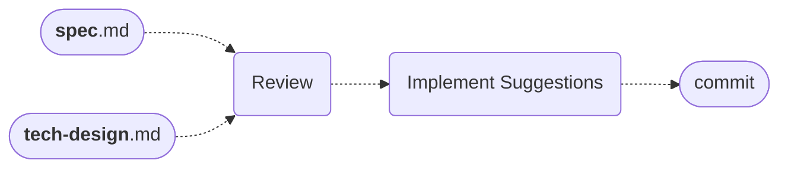
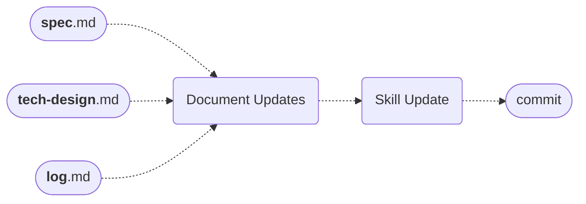

### Create

```mermaid
flowchart LR
Spec[Specification]
TechDesign(Tech Design)
Plan(Plan)
Implementation(Implementation)
Commit1([ commit ])

classDef completed fill:#fff,text:#000000,stroke-width:4px

Spec:::completed -.-> TechDesign -.-> Plan -.-> Implementation -.->Commit1
```

### Review

```mermaid
flowchart LR
Spec(["`**spec**.md`"])
Design(["`**tech-design**.md`"])
Review(Review)
ImpSuggest(Implement Suggestions)
Commit2([commit])

classDef completed fill:#fff,stroke:#111,stroke-width:4px

Spec -.-> Review
Design -.-> Review

Review -.-> ImpSuggest -.-> Commit2
```

### Fix Drift

```mermaid
flowchart LR
Spec(["`**spec**.md`"])
Design(["`**tech-design**.md`"])
Log(["`**log**.md`"])
Docs(Document Updates)

classDef completed fill:#fff,stroke:#111,stroke-width:4px

Spec -.-> Docs
Design -.-> Docs
Log -.-> Docs -.-> Skill(Skill Update) -.-> Commit([commit])
```
