# Tree Rendering

This is an introduction to the **IR-based rendering strategy** shared by the
`renderable`, `biscuit-terminal`, and `darkmatter` crates. It explains the
render tree (our intermediate representation), where trees come from, how they
become Terminal / Browser / Markdown output, and the design principles that hold
the whole thing together.

It is a conceptual overview. For the API surface, see the linked skill docs and
[`layout-and-style.md`](./layout-and-style.md); for the catalog of components and
their target support, see [`components.md`](./components.md).

## The core idea

A document can come from more than one place (parsed Markdown, a hand-built
component) and needs to render to more than one place (a terminal, a browser, a
Markdown file). Wiring every source directly to every target is an N×M tangle,
and each pairing tends to grow its own subtly different rendering rules.

The render tree breaks that tangle with a single intermediate representation:

> **Build one canonical tree, then walk it once per target.**

Everything that produces content lowers into the same owned, target-agnostic
tree, and every output format is produced by one renderer that walks that tree.
Producers never think about ANSI or HTML; renderers never think about where the
content came from.

```text
   producers                  the IR                    renderers
 ┌───────────────┐                                   ┌──────────────┐
 │ parsed Markdown│──┐                            ┌──▶│   Markdown   │
 │   (the fold)   │  │     ┌─────────────────┐    │   └──────────────┘
 └───────────────┘  ├────▶│ renderable::tree │────┤   ┌──────────────┐
 ┌───────────────┐  │     │    Document      │    ├──▶│   Browser    │
 │  components    │──┘     └─────────────────┘    │   └──────────────┘
 │(TreeRenderable)│                               │   ┌──────────────┐
 └───────────────┘                                └──▶│   Terminal   │
                                                      └──────────────┘
```

## The render tree — `renderable::tree`

The `renderable` crate owns the model so every other crate can depend on it
without a dependency cycle. The whole surface is `serde`-serializable to its own
documented JSON format (it is *our* IR, not the parser's AST — it is not
MDAST-compatible), which makes snapshotting, inspection, and tooling easy.

> **Serde contract: same-version only.** The render-tree JSON is debug,
> inspection, and same-process persistence output — not a promised cross-version
> durable format. Typed sparse attrs (`layout`, `style`, `text_layout`,
> `browser`, …) may add, rename, or re-shape fields between versions; default
> values are elided, so an alpha-less tree still serializes as it did before
> alpha paint existed. Round-trip a tree only with the version that wrote it.

Three types form the model:

- **`RenderNode { kind, span, attrs }`** — the node envelope.
  - `kind` is the payload (see `NodeKind` below).
  - `span` carries provenance — which source the node came from, and an optional
    byte range, so diagnostics and future transforms can point back at the
    original text.
  - `attrs` (`NodeAttrs`) carries identity (`id`) and semantic `classes`
    alongside **typed sparse fields** — `layout`, `style` (whose color slots are
    alpha-bearing `PaintColor`), `sequence_join`, `list_marker_policy`, the
    per-kind `component` hint group, `text_layout` (unresolved width-dependent
    text intent on link/image/list-item nodes), and `browser` (typed, validated
    browser-target attributes) — see
    [Layout and style](#layout-and-style-on-the-tree). Reads cost no serde
    round-trip. The `data` map is reserved for package-local extension
    namespaces (`darkmatter.*`); a stale `renderable.*` key in `data` is a
    validation error.
- **`NodeKind`** — the payload enum (~27 variants) covering document structure.
  Grouped by role:
  - *Block structure:* `Root`, `Section` (a heading grouped with its body),
    `Heading`, `Paragraph`, `BlockQuote`, `List`, `ListItem`, `Code`,
    `ThematicBreak`, `Table`, `TableRow`, `TableCell`, `FootnoteDefinition`.
  - *Inline content:* `Text`, `Emphasis`, `Strong`, `Delete`, `Span`,
    `InlineCode`, `Link`, `Image`, `FootnoteReference`, `SoftBreak`, `HardBreak`.
  - *Special:* `Html` (raw), `Extended` (a target-agnostic extension node — see
    [Extending the tree](#extending-the-tree)), and `Unsupported` (a real,
    visible placeholder — never a silent drop).
- **`Document { sources, metadata, root }`** — the full document: a
  `SourceRegistry` (provenance), a `DocumentMetadata` slot (frontmatter), and the
  `root` node.

### Crate ownership and dependency direction

`renderable` defines the tree and the Markdown and Browser renderers. The
**Terminal** renderer lives in `biscuit-terminal`, because a real terminal
renderer needs types `renderable` deliberately does not depend on (`Terminal`
capability detection, color depth, OSC8 hyperlinks). `renderable` gains **no**
`pulldown-cmark` or `biscuit-terminal` dependency. The direction is always:

```text
darkmatter ──▶ biscuit-terminal ──▶ renderable
```

## Producers: where trees come from

The design treats two producers symmetrically — both lower into the *same*
`RenderNode` vocabulary:

1. **The fold** (in `darkmatter`) turns parsed Markdown into a `Document`.
2. **`TreeRenderable` components** project themselves into a subtree:
   `fn render_tree(&self) -> RenderNode`.

The important architectural commitment is that these paths **converge at
`RenderNode`**, not at a per-target trait. Parsed Markdown does not render by
constructing component objects, and components do not render by emitting target
strings — both produce tree nodes, and the renderers do the rest.

### The fold (Markdown → tree)

`pulldown-cmark` remains the parser. It is fast, well tested, and event-oriented,
and the tree does **not** require swapping it for an AST parser — the tree is our
owned IR, layered *on top of* the parser's event stream.

```text
Markdown source ─▶ pulldown-cmark events ─▶ darkmatter fold ─▶ Document
                                                                  │
                              ┌───────────────┬───────────┬───────┘
                              ▼               ▼           ▼
                         Markdown /     Browser HTML   Terminal
                         MarkdownPlus
```

The fold is **span-aware**: it attaches source byte ranges to nodes, and it
preserves darkmatter's custom syntax — `==mark==` / dim inline styles (lowered to
`Extended` nodes) and `--- { … }` horizontal-rule attribute directives — with
their offsets intact, so provenance survives into the tree.

Because the fold produces an owned `Document`, the same parse can be rendered
many times:

```text
parse + fold once ─▶ render Terminal
                  ─▶ render Browser HTML
                  ─▶ render MarkdownPlus
                  ─▶ inspect / test / serialize
```

### Components (`TreeRenderable`)

A component implements `TreeRenderable::render_tree()` to project its structure
into the tree. Components share one private projection helper across their
render paths, so a component renders identically whether it is asked for its tree
directly or rendered to a specific target. When a component is nested *inside*
another component's tree, it projects its structural subtree rather than
degrading to "render to ANSI, strip, wrap in text."

Two small adapters bridge a `TreeRenderable` to a per-target trait without the
component author writing target code:

- **`TreeComponent<T>`** supplies a `TerminalRenderable` impl (project, then
  `render_terminal_node`).
- **`BrowserTreeComponent<T>`** supplies the same bridge for `BrowserRenderable`.

## Renderers: tree → output

Each target has a renderer that walks a `RenderNode` / `Document`:

| Target   | Entry points                                        | Crate              |
|----------|-----------------------------------------------------|--------------------|
| Markdown | `render_markdown_node` / `render_markdown_document` | `renderable`       |
| Browser  | `render_browser_node` / `render_browser_document`   | `renderable`       |
| Terminal | `render_terminal_node` / `render_terminal_document` | `biscuit-terminal` |

Every renderer dispatches with an **exhaustive `match`** over `NodeKind` — there
is no default-recursing visitor. Adding a new variant deliberately breaks every
renderer until each one makes an explicit decision about it. This is a guardrail:
the type system refuses to let a target silently ignore new structure.

The Browser target also offers `render_browser_document_html(doc, opts)`: a
direct `Document` → final HTML `String` path that streams the whole tree into one
buffer instead of building an intermediate fragment per node. Its bytes are
identical to composing through `render_browser_document`; reach for it when a
caller already owns a `Document` and only needs the final string.

### Markdown spellings

The Markdown renderer picks one spelling for constructs CommonMark can write
several ways, in both dialects:

| Node | Markdown | Inside a table cell |
|------|----------|---------------------|
| `HardBreak` | `first\` then a newline, then `second` (see [Breaks by position](#breaks-by-position)) | `first<br>second` |
| `SoftBreak` | a newline (see [Breaks by position](#breaks-by-position)) | a space |
| `InlineCode` | a code span with a safe backtick fence | the same, with each pipe escaped by a backslash before the fence is chosen |
| `Code` | a backtick fence of three, or one longer than the longest backtick run that starts a body line | a code span, with a diagnostic (see [Blocks in a table cell](#blocks-in-a-table-cell)) |

A hard break uses the visible backslash form; two trailing spaces are never
emitted. A code block whose body holds a line such as ```` ``` ```` is written
with a ```` ```` ```` fence, so a reader does not close the block at that line. An inline-code value is literal, so the renderer chooses a fence that
cannot be closed early by the value:

| Value | Markdown |
|-------|----------|
| `plain` | `` `plain` `` |
| ``a`b`` | ```` ``a`b`` ```` |
| `` `a` `` | ```` `` `a` `` ```` |
| `` a `` (space on both sides) | `` `  a  ` `` |

The rule is CommonMark's: the fence is one backtick longer than the longest
backtick run in the value, and one space of padding is added when the value
begins or ends with a backtick, or begins and ends with a space without being
all spaces. Two values cannot be spelled faithfully: a line ending becomes a
space, and an empty value renders as nothing. The same rule is public as
`renderable::markdown::code_span`, so any other producer of a code span
spells it identically.

Two code spans that would touch are separated by an empty HTML comment. A
fence is a backtick run with no backtick beside it, so two fences written
side by side merge into one longer run, and a reader finds a different code
span. This happens wherever nothing visible sits between two code values:
direct neighbors, an empty node between them, or a wrapper that writes no
Markdown of its own (a neutral span, an unknown extension, a class or style
that plain Markdown removes, a `mark`/`dim` wrapper written unstyled):

| Inline nodes | Markdown | A reader sees |
|--------------|----------|---------------|
| `InlineCode("a")`, `InlineCode("b")` | `` `a`<!-- -->`b` `` | code `a`, then code `b` |
| ``InlineCode("x`y")``, ``InlineCode("z``w")`` | ```` ``x`y``<!-- -->```z``w``` ```` | code ``x`y``, then code ````z``w```` |
| `InlineCode("a")`, `Text(" ")`, `InlineCode("b")` | `` `a` `b` `` | unchanged: the space separates them |
| `InlineCode("a")`, `Strong[InlineCode("b")]` | ``` `a`**`b`** ``` | unchanged: the delimiter separates them |

Without the comment, the first row would be `` `a``b` ``, the single value
```` a``b ````. Every visible separator would change the text, and the
comment is CommonMark's only empty inline construct, so both dialects write
it and no strictness mode reports a loss. It always follows a closing fence
on the same line, so it can never start an HTML block, and it holds no `|`,
so a table row is unaffected. An empty code value writes nothing, so it
neither separates two values nor needs a separator.

The comment is structure, not text, for every reader in this repository, so
the separator never shows:

| Reader | What it does with `` `a`<!-- -->`b` `` |
|--------|----------------------------------------|
| Darkmatter's Markdown fold | keeps the comment as an `Html` node between the two `InlineCode` nodes, so re-serializing writes the same bytes |
| Terminal renderer | writes nothing for a comment-only `Html` node, in every strictness, with no diagnostic |
| Browser renderer | writes nothing under `RawHtmlPolicy::Escape` (the default) and `Reject`, in every strictness, with no diagnostic; writes the comment itself under `Allow` |
| Markdown renderer | writes a comment-only `Html` node back as is; plain Markdown does not report it as unportable |
| `Prose` / `InlineProse` | read a comment as no content (see biscuit-terminal's Prose grammar) |

"Comment-only" (`renderable::tree::is_html_comment_only`) means the whole raw
HTML value is one or more CommonMark comments (`<!-->`, `<!--->`, or `<!--`
… `-->`) with only whitespace around them. Anything more is raw HTML under
the usual policy: `<!-- a --> b` and `<span title="<!-- -->">` are escaped
by default and rejected by a strict `Reject`, and a code value or text that
looks like a comment is content, shown as written.

A `Text` value is literal: formatting comes only from structural nodes
(`Strong`, `Link`, `Html`, …), so whatever characters a value holds, a
CommonMark/GFM reader sees exactly those characters. The renderer escapes a
character only where a reader could take it as syntax, so ordinary prose is
written unchanged:

| `Text` value | Markdown | A reader sees |
|--------------|----------|---------------|
| `**literal**` | `\*\*literal\*\*` | `**literal**`, not bold |
| `[docs](https://x.io)` | `\[docs\](https://x.io)` | the text, not a link |
| `<em>hi</em>` | `\<em>hi\</em>` | the tags as text |
| `&copy;` | `\&copy;` | `&copy;`, not `©` |
| `<3@example.com>` | `\<3@example.com>` | the text, not an email link |
| `snake_case, 2 * 3, a < b, I <3 you, AT&T rocks` | unchanged | the same |

The rules, character by character:

- `` ` ``, `[`, and `]` are always escaped (code spans, links, footnotes).
- `*`, `_`, and `~` are escaped where CommonMark's flanking rules would let
  them open or close emphasis or strikethrough; at either end of a value the
  neighbor comes from another node, so it is assumed to be anything.
  `snake_case` and `2 * 3` cannot act and stay as written.
- `<` is escaped before a letter, `/`, `!`, or `?` (an HTML tag or URI
  autolink), and before anything that could still complete an email
  autolink `<local@domain>`, whose local part may start with a digit or
  ``.!#$%&'*+/=?^_`{|}~-`` (`<3@example.com>`, `<+foo@example.com>`).
  `I <3 you` and `a <- b` cannot become one and stay as written. A `<` at
  the end of a value is escaped, since a neighbor could complete it.
- `&` is escaped where it could start an entity or numeric reference
  (`&copy;`, `&#169;`).
- A lone carriage return, which a reader takes as a line ending, is written
  as `&#13;`.
- `==` is escaped as `\==`, and an `=` at either end of a value, so
  darkmatter does not read a `mark`.
- A backslash is doubled where a reader would take it as an escape: before
  ASCII punctuation or a line ending, and at the end of the value, because
  the next character comes from a neighboring node (a break, a closing `**`,
  a table cell's `<br>`). `C:\dir` is unchanged.

| Tree | Markdown | A reader sees |
|------|----------|---------------|
| `Text("a\")`, `SoftBreak`, `Text("b")` | `a\\`, newline, `b` | `a\`, soft break, `b` |
| `Text("a\")`, `HardBreak`, `Text("b")` | `a\\\`, newline, `b` | `a\`, hard break, `b` |
| `Strong[Text("a*")]` | `**a\***` | bold `a*` |

A line that text starts (a paragraph's first line, or the line after a break
or a newline inside the value) is protected from block syntax: a leading
`#`, `>`, `-`/`+`/`*` list marker, `1.`/`1)`, setext underline, thematic
break, or GFM table delimiter row (`--|--`) is escaped (`\# not a heading`,
`1\. not a list`). The decision is made on the **whole line** the inline
content assembles, not on each value: adjacent `Text` values, the children
of a transparent span or unknown extended wrapper, and a styled span that
plain Markdown writes as its bare text all count as one line. A raw `Html`
value that ends with a carriage return ends its line, as a reader takes it,
so text after it is protected too; a line feed at the start of that text
completes the same CRLF rather than starting a blank line.

| Tree | Markdown | A reader sees |
|------|----------|---------------|
| `Text("1")`, `Span[Text(". literal")]` | `1\. literal` | `1. literal`, not a list |
| `Text(" ")`, `Text("# literal")` | `&#32;# literal` | ` # literal`, not a heading |
| `Html("<i>a</i>\r")`, `Text("# literal")` | `<i>a</i>`, CR, `\# literal` | the raw HTML, then `# literal` on the next line, not a heading |

The same holds for a table delimiter row: after a line `a | b`, the values
`|` and `-|-|` on the next line are written `|\-|-|`, which no reader takes
as the start of a table.

Leading and trailing whitespace on a line is written as a character
reference (`&#32;` for a space, `&#9;` for a tab), because a reader strips
it, reads four columns of indentation as a code block, and reads two
trailing spaces before a line ending as a hard break. Only the outermost
character is encoded; the rest stays as written.

| Tree | Markdown | A reader sees |
|------|----------|---------------|
| `Text("    literal")` | `&#32;   literal` | `    literal`, not code |
| `Text("a")`, `HardBreak`, `Text("\tb")` | `a\`, newline, `&#9;b` | `a`, hard break, a tab, `b` |
| `Text("a  ")`, `SoftBreak`, `Text("b")` | `a &#32;`, newline, `b` | `a  `, soft break, `b` |

A heading's text and a table cell's content are trimmed by a reader too, so
their edge whitespace is encoded the same way, and a line feed in a
heading's text is written as `&#10;` (a CRLF as `&#13;&#10;`) so the heading
stays one line. A
heading whose text ends in whitespace and `#` escapes that run, which would
otherwise be read as the closing sequence and dropped.

Each context applies the same encoding with its own additions:

| Context | Encoding |
|---------|----------|
| Paragraph, heading, quote, list item, footnote body, link label, emphasis body, sequence container, plain-Markdown disclosure summary | the rules above |
| Image alternative text | the rules above (a reader parses alt text as inline Markdown), with each line after the first protected like a line of text; in a heading a line ending is a reference, as in heading text |
| Table title | the rules above after trimming the title, which is deliberate: a title is written trimmed |
| Table cell | the rules above, then `\|` for a pipe and `<br>` for a line ending, and edge whitespace as references (every other field in a cell protects its pipes too: see [Pipes in a table cell](#pipes-in-a-table-cell)) |
| MarkdownPlus inline-HTML span body (color, underline, class) | `<`, `>`, `&` HTML-escaped; other punctuation escaped as above, because the body is still Markdown |
| MarkdownPlus disclosure summary, columns container | written as the browser's HTML, never Markdown: see [HTML-backed MarkdownPlus content](#html-backed-markdownplus-content) |
| MarkdownPlus progress label | the children's plain text, as the browser takes it; HTML-escaped in the `aria-label` with its line endings as references (see [Line endings in quoted fields](#line-endings-in-quoted-fields)), and escaped as above in the visible label element, whose body a reader parses as Markdown, with each line ending as a space |
| Link/image title | `"` and backslashes escaped, a reference-forming `&`, and each CR/LF as `&#13;`/`&#10;` in every context (see [Line endings in quoted fields](#line-endings-in-quoted-fields)); Markdown punctuation is literal there |
| Link/image destination | `(`, `)`, `\`, a leading `<`, and a reference-forming `&` escaped (`https://x.io/&copy;` stays exact); whitespace switches to the `<…>` form, in which a tab or line ending becomes a space |
| Inline code, code block, raw `Html` | never escaped |

The same text encoding is public as `renderable::markdown::escape_text`, for
code that writes Markdown by hand. It protects the start of every line of the
value and the end of every line but the last; whitespace at the very end is
left alone, since the caller decides what follows it.

A delimiter followed by whitespace or a line ending does not open emphasis,
and one preceded by them does not close it. So whitespace and soft or hard
breaks at the start or end of a delimiter wrapper (`Emphasis`, `Strong`,
`Delete`, and the `mark`/`dim` extensions) are written outside the
delimiters, including those at the edge of a nested wrapper:

| Tree | Markdown | A reader sees |
|------|----------|---------------|
| `Text("a")`, `Strong[Text(" b")]` | `a **b**` | `a `, bold `b` |
| `Strong[Text("a ")]`, `Text("b")` | `**a** b` | bold `a`, ` b` |
| `Text("a ")`, `Strong[SoftBreak, Text("b")]` | `a `, newline, `**b**` | `a`, soft break, bold `b` |
| `Strong[Text("b"), HardBreak]` in a table cell | `**b**<br>` | bold `b`, line break |
| `Strong[Text("b"), HardBreak]` ending a paragraph | `**b**<br>` | bold `b`, line break |
| `Strong[Text(" ")]` | ` ` | a space, no bold |

A break moved outside the delimiters is spelled for its new position (see
[Breaks by position](#breaks-by-position)). A wrapper that holds only
whitespace and breaks is written without delimiters. A wrapper without edge whitespace or breaks is written
unchanged: `Strong[Text("a")]` is `**a**`.

A delimiter run also has to *flank* the text it marks, judged from the
characters on both sides of each run. CommonMark does not let a run open
when punctuation follows it and a letter precedes it (`a**(b)**` is not
bold), and `_` never opens or closes inside a word (`a_b_c` is not
emphasis). A run next to the same unescaped character joins it and changes
its length. The renderer therefore checks each wrapper's spellings in order
and writes the first one a reader can open and close at that position:

| Wrapper | Spellings, in order |
|---------|---------------------|
| `Emphasis` | `_b_`, `*b*`, `<em>b</em>` |
| `Strong` | `**b**`, `__b__`, `<strong>b</strong>` |
| `Delete` | `~~b~~`, `<del>b</del>` |
| `mark` | `==b==`, then plain text |
| `dim` | `⌄b⌄`, then plain text |

| Tree | Markdown | A reader sees |
|------|----------|---------------|
| `Text("a")`, `Emphasis[Text("b")]`, `Text("c")` | `a*b*c` | `a`, emphasized `b`, `c` |
| `Text("a")`, `Strong[Text("b")]`, `Text("c")` | `a**b**c` | `a`, bold `b`, `c` |
| `Text("a")`, `Strong[Text("(b)")]`, `Text("c")` | `a<strong>(b)</strong>c` | `a`, bold `(b)`, `c` |
| `Text("x*")`, `Strong[Text("b")]` | `x\***b**` | `x*`, bold `b` |
| `Text("a")`, `dim[Text("b")]`, `Text("c")` | `abc` | `abc`, not dimmed |

The first spelling is used wherever it works, so typical output does not
change: `x **(b)** y` and `[**(a)**](u)` stay as they are. The inline HTML
fallback is used in both dialects, the same way a table cell's hard break
is written as `<br>`: CommonMark and GFM readers pass inline HTML through
and keep parsing the Markdown inside it, and no delimiter spelling exists
for these positions. It is not treated as lossy raw HTML. Darkmatter reads
`==`/`⌄` with their own rules (`==` pairs left to right; `⌄` does not open
or close between two letters or digits) and has no HTML form for them, so a
`mark` or `dim` wrapper with no working spelling is written as plain text:
a lossy diagnostic under `Warn`, an error under `Strict`, and silent under
`Lossy`.

A character that is neither ASCII nor alphanumeric (a symbol such as `→`)
counts as punctuation to some readers and not to others, so a spelling next
to one must work either way. The edge of an inline sequence (the start of a
paragraph, table cell, or link text, or the inside of a wrapper's
delimiters) counts as whitespace.

### Line endings inside block quotes, list items, footnotes, and code fences

A Markdown reader ends a line at a line feed (LF), a carriage return (CR),
or a CRLF, and treats the three alike. The writer reads the content of a
block quote, list item, or footnote definition the same way when it adds
the container's prefix: every line gets `> ` (a bare `>` on an empty line),
the list item's continuation indent, or the footnote's four-space indent,
and each line keeps the ending bytes it had. A raw
`Html` payload's CR therefore stays a CR and the line after it stays inside
the container, and a CRLF keeps its CR:

| Tree | Markdown | A reader sees |
|---|---|---|
| `BlockQuote[Html("<div>\r</div>")]` | `> <div>`, CR, `> </div>` | one HTML block inside the quote |
| `BlockQuote[Paragraph[Html("<i>a</i>\r\n<i>b</i>")]]` | `> <i>a</i>`, CRLF, `> <i>b</i>` | one paragraph inside the quote |
| `List[ListItem[Html("<div>\r</div>")]]` | `- <div>`, CR, `  </div>` | one HTML block inside the item |
| `List[ListItem[BlockQuote[Html("<div>\n</div>")]]]` | `- > <div>`, LF, `  > </div>` | one HTML block inside the quote inside the item |
| `BlockQuote[Paragraph[Text("a")], Paragraph[Text("b")]]` | `> a`, LF, `>`, LF, `> b` | two paragraphs inside the quote |
| `FootnoteDefinition("n", [Paragraph[Text("a")], Code("x\r\n")])` | `[^n]: a`, LF, LF, then the fence, `x` (ending CRLF), and closing fence, each after four spaces | one footnote holding the paragraph and the code block |

A GFM reader keeps a line in a footnote definition only when it is blank or
indented by four spaces, whatever the label's width, so every non-empty line
after `[^n]: ` is indented by four spaces. Without it, a second block, the
lines of a code block, list, or raw HTML block, and anything after them
would leave the footnote. A one-line definition stays `[^n]: text`; a
longer one reads:

```markdown
[^n]: First paragraph.

    Second paragraph.

    - item
```

A list item's or footnote's body loses only a final LF, since the
enclosing join writes one after it; a CR before it stays, and the joining
LF completes that CRLF.

A fenced code block's fence is one backtick longer than the longest run
that starts a line of its value, where a line starts after a CR as well as
an LF, so a value such as `a\r```\rb` gets a four-backtick fence.

> `pulldown-cmark` 0.13 does not end a line at a lone CR inside an HTML or
> code block (the commonmark.js reference parser does). Tests that read the
> writer's output with it to check where a container or fence ends spell
> each line ending as LF first.

### Raw HTML in a heading or table cell

An ATX heading and a GFM table row are each one Markdown line, so any line
ending (LF, CR, or CRLF) written inside them ends the heading or the row,
and a reader sees different structure. Text is safe there: a heading's
text writes a line ending as `&#10;` / `&#13;`, a cell's text writes it as
`<br>`. A raw `Html` payload, directly in the heading or cell or nested in
a `Strong`, `Link`, or span inside it, is the author's bytes, so a line
ending in it cannot be kept. The writer treats it as lossy content, in both
dialects:

| Strictness | Result |
|---|---|
| `Strict` | `RenderError::LossyRejected` |
| `Warn` | each CR is written as `&#13;` and each LF as `&#10;`, and a `Lossy` diagnostic names the node |
| `Lossy` | the same output, no diagnostic |

A payload without a line ending is written byte for byte (in a cell, apart
from its pipes: see [Pipes in a table cell](#pipes-in-a-table-cell)) and
reported only as plain Markdown reports any raw HTML (not portable). Each CR and LF is
encoded on its own, so a CRLF split across two adjacent payloads is written
the same as one payload holding it, with one diagnostic per payload.

| Tree | Markdown (`Warn`) | A reader sees |
|---|---|---|
| `Heading[Html("<span title=\"a\nb\">t</span>")]` | `## <span title="a&#10;b">t</span>` plus a diagnostic | one heading; the title holds a line feed |
| table cell `Html("<b>x</b>\r\n<i>y</i>")` | `\| <b>x</b>&#13;&#10;<i>y</i> \|` plus a diagnostic | one row |
| `Heading[Html("<span title=\"a b\">t</span>")]` | `## <span title="a b">t</span>` | the payload as written |

The cell uses a character reference rather than the `<br>` its text gets:
in element text and quoted attribute values an HTML reader decodes the
reference to the payload's own character, where `<br>` would add a line
break the payload does not have. Script and style source, comments, and
unquoted attributes do not decode it, so render such content under
`Strict` (or check for the diagnostic) when it must survive exactly.

### Pipes in a table cell

A GFM reader splits a table row into cells **before** it parses anything
inline, so a `|` is a cell delimiter wherever it sits in a cell: in text, in
a code span, inside a raw HTML tag, comment, or `<script>`, or in a footnote
identifier. An unprotected pipe stops a header row from being a table at
all, or shifts a body row's later cells and drops the last one.

While it splits, the reader removes one backslash in front of each pipe. The
writer protects every pipe it puts in a cell with one of two spellings:

| What is written | Spelling of a pipe | Why |
|---|---|---|
| Text, code span, link label/destination/title, image alt/destination/title, raw `Html` payload, footnote identifier, the `Warn` placeholder for unsupported content | a backslash before it, added once, after the field's own escaping | the reader removes it again, so the cell holds exactly what the field would hold outside a table, even inside a comment or script |
| A generated HTML attribute value (a MarkdownPlus span's `class`), a MarkdownPlus progress widget (its `aria-label` and glyph `data-*` attributes) | `&#124;` | an HTML reader decodes it in attribute values and element text |

Each example is one cell of a table; the second line is what the writer
emits:

```text
Html("<span title=\"a|b\">t</span>")
| <span title="a\|b">t</span> |          one cell; the tag <span title="a|b">

Html("<span>a\\|b</span>")                  a payload with its own \|
| <span>a\\|b</span> |                     reads as the payload outside a table

InlineCode("a\\|b")
| `a\\|b` |                                code a\|b

FootnoteReference("a|b")
| [^a\|b] |                                refers to the definition [^a|b]: …

Span(classes: ["a|b"])[Text("t")]          MarkdownPlus
| <span class="a&#124;b">t</span> |        class="a|b"

Html("<span>a&#124;b</span>")
| <span>a&#124;b</span> |                  unchanged: it holds no pipe
```

Generated attribute values take the reference rather than the backslash
because some readers (pulldown-cmark, markdown-rs) do not remove the
backslash inside an inline HTML tag or comment; there a raw payload's pipe
reads as `\|`, while the row and its cells are still correct. GitHub's
reader (cmark-gfm) removes it everywhere. Applying either spelling twice
would change the cell, so each field is protected exactly once.

Outside a table row a pipe means nothing to the reader, and every field,
including raw HTML and footnote identifiers in headings, is written as is.

The class attribute of a MarkdownPlus span is HTML-attribute-escaped in
every context (`&`, `<`, `"`, `'`), as the browser renderer writes it, so a
class value cannot end the attribute early.

### Line endings in quoted fields

A link or image title and a generated HTML attribute value are quoted
fields: their value is everything between the quotes, line endings
included. A literal line ending there still ends the Markdown line around
it, so a table row splits and a heading ends early; a blank line ends the
paragraph, and a generated tag left open by it becomes literal text. So in
every context the writer spells each CR as `&#13;` and each LF as `&#10;` (a
CRLF as both), which both readers decode back into the value:

| Field | Reader that decodes the reference |
|---|---|
| Link or image title | the CommonMark reader, which decodes character references in a title |
| MarkdownPlus span `class` | the HTML reader of the attribute value |
| MarkdownPlus progress `aria-label`, `data-fill-char`, `data-empty-char`, `data-left-bracket`, `data-right-bracket` | the HTML reader of the attribute value |

```text
Link("https://x.test", title: "a\nb")[Text("t")]
[t](https://x.test "a&#10;b")              title "a<LF>b", in a cell or heading too

Span(classes: ["a\r\nb"])[Text("t")]        MarkdownPlus
<span class="a&#13;&#10;b">t</span>        class "a<CR><LF>b", one line

Progress label "a\n\nb 60%"                 MarkdownPlus
<span class="progress" … aria-label="a&#10;&#10;b">…   one paragraph
```

The value reads back exactly, so no strictness mode reports a loss. A
title's `<br>` would be literal title text, which is why a title in a
table cell does not take the cell's text spelling. A `&` the author wrote
is still escaped first, so the writer's references are the only ones a
reader decodes.

Plain Markdown writes neither attribute: a classed span degrades to its
text, and a progress widget to its paragraph text, under the strictness
model. Raw `Html`, destinations, link labels, text, and code keep their own
policies above. HTML-backed MarkdownPlus content (disclosure summaries and
columns) is written by the browser's HTML lowering inside an HTML block,
where a line ending in an attribute is harmless and a blank line is kept
from ending the block.

### Blocks in a table cell

A GFM table cell is one line of inline content: there is no way to write a
code block, a list, a heading, a quote, a rule, or even a second paragraph
inside one. The tree allows any block under a `TableCell` (the browser and
terminal renderers can show them), so the Markdown writer has to decide what
to do with one. A cell holding only inline content, or exactly one
`Paragraph`, is written as before with no diagnostic. Any other block in a
cell, at any depth, follows the strictness model:

| Strictness | Result |
|---|---|
| `Strict` | `RenderError::LossyRejected` |
| `Warn` | the block is written on the cell's line, plus one `Diagnostic::lossy` for the cell (naming its first block) |
| `Lossy` | the same line, no diagnostic |

The one-line spelling keeps a block's text and drops its structure. Each
block is set off from the content before and after it by `<br>`, the line
break a cell already uses for a hard break:

| Block in the cell | Written as |
|---|---|
| `Paragraph`, `Heading`, `BlockQuote`, `FootnoteDefinition` | its inline content (heading level, quote, and definition label dropped) |
| `Section`, `Disclosure` | its heading or summary, `<br>`, then its body |
| `Code` | a code span, as `renderable::markdown::code_span` writes it: line endings become spaces, the language is dropped |
| `List` | each item on its own line, its marker (`- `, `3. `, `[x] `) written as text |
| `ThematicBreak` | nothing; its two `<br>` separators leave an empty line |
| `Table` | each of its cells on its own line |
| `BlockQuote` with `ColumnsHints` (both dialects) | the left column's blocks, then the right column's |

```text
TableCell[Paragraph("a"), Code("x || y\nz\n"), Paragraph("b")]
| a<br>`x \|\| y z`<br>b |                 one cell; a Warn diagnostic

TableCell[List(ordered, start 3)[Item[Paragraph("one")], Item[Paragraph("two")]]]
| 3. one<br>4. two |

TableCell[Paragraph("one")]
| one |                                     unchanged, no diagnostic
```

Everything written this way is still cell content, so the pipe and
line-ending protection of the previous section applies to it.

A heading is one line as well. Its direct children are inline by
validation, but an inline extension (`Extended`) can carry a block into it;
that block gets the same one-line spelling and the same strictness, with
the heading's escaping instead of the cell's (a pipe stays a pipe):

```text
Heading[Text("h"), Extended("custom")[Code("a\nb")]]
## h<br>`a b`                              one heading line; a Warn diagnostic
``` MarkdownPlus
writes columns and disclosures in a cell the same way rather than as HTML:
a cell is parsed as inline Markdown, so the raw HTML blocks those
constructs use elsewhere would not survive there.

### Footnote labels

A reference is written `[^label]` and its definition `[^label]: …`. A reader
matches a label without processing escapes, and normalizes its whitespace,
so some identifiers have no label that reads back as the same identifier.
The reference and the definition get the same degraded label, so they
still pair:

| Identifier | Problem | Label under `Warn` / `Lossy` |
|---|---|---|
| `a]b`, `a[b` | an unescaped bracket ends or breaks the label | `a\]b`, `a\[b` (the reader's identifier is then `a\]b`) |
| `a\` | the odd trailing backslash escapes the closing `]` | `a\\` |
| `a\nb`, `" a \t b "` | line endings, tabs, and space runs are collapsed and trimmed by the reader | `a b` |
| empty or whitespace only | not a label at all | `_` |

`Strict` rejects such an identifier with `RenderError::LossyRejected`;
`Warn` records one `Diagnostic::lossy` for the reference and one for the
definition. Identifiers a reader reads back exactly, such as `a\]b` (an
already-escaped bracket), `a\b`, or `a|b`, are written as they are (a pipe
in a cell takes the cell escape, `[^a\|b]`).

### The `Warn` placeholder for unsupported content

Under `Warn` an `Unsupported` node is written as the comment
`<!-- unsupported: {label} -->` (`Strict` fails, `Lossy` writes nothing). The
label is authored text, so it is made comment-safe first:

| Label | Written as | Why |
|---|---|---|
| `a-->b`, `a--!>b` | `a--&gt;b`, `a--!&gt;b` | `-->` ends the comment for every reader, `--!>` for an HTML reader; neither can appear once `>` is a reference |
| `a\nb` | `a b` | a line ending would end a table row or heading, and a blank line would end a paragraph |

A comment does not decode `&gt;`, so the placeholder shows the reference;
it is a lossy marker either way. A pipe in a cell gets the cell escape.


### Breaks by position

A `SoftBreak` shows as a space and a `HardBreak` as a line break, on every
target. In Markdown, the newline and backslash-newline spellings only mean
that where more content follows on the next line of the same block, so the
writer picks each break's spelling from its position:

| Where the break is | `SoftBreak` | `HardBreak` |
|---|---|---|
| Content before it on its line and after it in its block | a newline | `\`, newline |
| Nothing after it in its block (paragraph, quote, list item, footnote, disclosure summary or body, root sequence) | a space (`&#32;` at the line end) | `<br>` |
| Its line is blank so far: the start of a block, a link label, or a span body, or right after another break | a space (`&#32;` at a line start) | `\`, newline |
| Heading text (an ATX heading is one line) | a space | `<br>` |
| Table cell | a space | `<br>` |
| MarkdownPlus disclosure summary and columns (raw HTML, written by the browser renderer) | a space | `<br>` |
| MarkdownPlus progress label (plain text) | a space | a space, as the browser writes it |

Each fallback exists because a reader would otherwise change the meaning:

- A reader drops a newline at the end of a block and reads a backslash there
  literally, so `Paragraph[Text("a"), HardBreak]` is `a<br>`, not `a\`.
- A newline on a blank line ends the paragraph, so two soft breaks in a row
  are a newline and then `&#32;`.
- A line that holds only an HTML open tag starts a raw HTML block, in which
  Markdown is not parsed. A MarkdownPlus span whose body starts with a soft
  break is therefore `<span style="…"> **a**</span>`, not the opener alone
  on its line.
- A raw HTML block such as the MarkdownPlus `<summary>` never reads a
  backslash escape, so its breaks are the browser's: a space and `<br>`. A
  line feed in a MarkdownPlus progress label is written as a space, the
  same whitespace to a browser.

```mermaid
flowchart TD
    B[break] --> C{table cell, heading,<br/>or raw HTML?}
    C -- yes --> S1[soft: space<br/>hard: &lt;br&gt;]
    C -- no --> E{anything after it<br/>in its block?}
    E -- no --> S2[soft: &#38;#32;<br/>hard: &lt;br&gt;]
    E -- yes --> L{line blank so far?}
    L -- yes --> S3[soft: space<br/>hard: backslash, newline]
    L -- no --> S4[soft: newline<br/>hard: backslash, newline]
```



| Tree | Markdown | A reader sees |
|---|---|---|
| `Text("a")`, `SoftBreak`, `Text("b")` | `a`, newline, `b` | `a`, soft break, `b` |
| `Text("a")`, `HardBreak` | `a<br>` | `a`, line break |
| `SoftBreak`, `Text("a")` | `&#32;a` | ` a` |
| `Text("a")`, `SoftBreak`, `SoftBreak`, `Text("b")` | `a`, newline, `&#32;b` | `a`, soft break, ` b` |
| `Strong[Text("a"), HardBreak]` | `**a**<br>` | bold `a`, line break |
| MarkdownPlus `Span(color)[SoftBreak, Strong[Text("a")]]` | `<span style="…"> **a**</span>` | a space, bold `a`, in the span |
| `Heading[Text("a"), HardBreak, Text("b")]` | `## a<br>b` | heading `a`, line break, `b` |

A break that is a direct child of a block container (a `Root`, or a list
item holding bare phrasing) joins the phrasing nodes on either side of it
into one inline sequence. Other adjacent phrasing children of a block
container stay separate blocks.

`<br>` is inline HTML in both dialects, as in a table cell. A block whose
only content is one hard break has no Markdown paragraph spelling: it is
written `<br>`, which a reader takes as a raw HTML line break on its own
rather than a paragraph holding one. Inline code and raw `Html` values are
never treated as breaks.

Inside a link label or a span or delimiter body, a literal line feed in a
`Text` value on an otherwise blank line is also written as a space, for the
same reasons. In a block, a literal blank line is kept: it separates
paragraphs, and `Compose` relies on that between the paragraphs of a
`Prose`.
### HTML-backed MarkdownPlus content

MarkdownPlus writes three constructs as HTML because Markdown has no
spelling for them: a disclosure, a two-column layout, and a progress
widget (inside a table cell, a disclosure or columns block is written on the
cell's line instead: see [Blocks in a table cell](#blocks-in-a-table-cell)). Their content goes where a reader consumes HTML or plain text, not
Markdown, so the writer does not put Markdown there:

| Construct | Where the content goes | What the writer puts there |
|---|---|---|
| `Disclosure` | the `<summary>` on the `<details>` line, which opens a raw HTML block | the summary as the browser renderer writes it |
| `BlockQuote` with `ColumnsHints` | the `<div class="columns">` container, one raw HTML block | the whole container, column bodies included, as the browser renderer writes it |
| `Paragraph` with `ProgressHints` | the `aria-label` attribute and the label element | the children's plain text, as the browser takes it |

A reader passes a raw HTML block through without parsing it as Markdown, so
`**a**` would show its asterisks, and a code span holding `<em>x</em>` would
become an emphasis element. Written as HTML, inline code is a `<code>`
element with its value escaped, so `<em>x</em>` and `&copy;` stay literal;
emphasis, links, images, and footnote references are their elements;
`mark` is `<mark>` and `dim` a span with the dim opacity; a styled span is a
`<span>` with its CSS; and literal text is HTML-escaped (`&lt;`), never
backslash-escaped. Column bodies keep their block structure: paragraphs,
lists, and code blocks are `<p>`, `<ul>`, and `<pre><code>` inside the
column. A Mermaid block stays a code block, since Markdown output carries
no scripts.

A blank line (empty, or only spaces and tabs) ends a raw HTML block, so
the writer never leaves one inside the summary or the container. It
re-encodes only the HTML it generated, where an HTML reader decodes a
character reference: a line ending beside a blank line in a code block or
a text value is written as `&#10;`, and a carriage return as `&#13;`.

A raw `Html` node is the author's HTML, written byte for byte. Its
consumer may not decode references at all (script and style source,
comments, `xmp`, `iframe`, `noembed`, `noframes`) or may read whitespace as
syntax (between unquoted attributes), so the writer never re-encodes it
when it fits. A carriage return in it is kept: HTML reads one as a line
feed everywhere. When a raw payload and the text around it meet at a blank
line, the generated line ending beside it takes the reference instead.

Line endings are read from the HTML as a whole, the way a reader sees it,
not node by node. A CR and the LF right after it are one line ending even
when they come from two adjacent nodes, so splitting a payload anywhere
never changes the output:

| Summary children (MarkdownPlus) | Written | Why |
|---|---|---|
| `Html("<i>a</i>\r")`, `Html("\n<i>b</i>")` | `<i>a</i>`, CRLF, `<i>b</i>`, as the single node `Html("<i>a</i>\r\n<i>b</i>")` | one line ending, no blank line |
| `Html("<i>a</i>\r")`, `Text("\nb")` | `<i>a</i>`, CRLF, `b` | one line ending, part raw, part generated |
| `Text("a\r")`, `Html("\n<i>b</i>")` | `a&#13;`, LF, `<i>b</i>` | a generated CR is always `&#13;`, which keeps the text's character; the raw LF stays the line ending |
| `Html("<i>a</i>\r")`, `Text("\n\nb")` | `<i>a</i>`, CRLF, `&#10;b` | a real blank line; the generated LF after it takes the reference |

A line ending is re-encoded only when all of its bytes were generated. A
CRLF with a raw CR and a generated LF cannot be: encoding the LF alone
would leave the CR as a line ending. When neither line ending around a
blank line is wholly generated, the blank line is lossy, as below.

A raw payload that holds a blank line itself cannot be embedded unchanged.
The writer treats it as lossy content:

| Strictness | Result |
|---|---|
| `Strict` | `RenderError::LossyRejected` |
| `Warn` | the payload's line ending before the blank line is written as a character reference, and a `Lossy` diagnostic names the node |
| `Lossy` | the same output, no diagnostic |

That reference changes script and style source and unquoted attributes, so
render such content under `Strict` (or check for the diagnostic) when it
must survive exactly. Elsewhere — paragraphs, disclosure bodies, styled
spans, link labels, a raw node of its own, and every plain-Markdown route —
this check does not apply, and raw `Html` follows its own placement rules
(a heading or table cell has its own line-ending rule: see
[Raw HTML in a heading or table cell](#raw-html-in-a-heading-or-table-cell)).

| Tree (MarkdownPlus) | Markdown | A reader sees |
|---|---|---|
| `Disclosure[summary: InlineCode("<em>x</em>")]` | `<details><summary><code>&lt;em&gt;x&lt;/em&gt;</code></summary>`, blank line, body | a summary holding the code `<em>x</em>` |
| `Disclosure[summary: Text("License "), Emphasis[Text("terms")]]` | `<details><summary>License <em>terms</em></summary>`, … | a summary with `terms` in italics |
| Columns, left `Paragraph[InlineCode("&copy;")]` | `<div class="columns" …><div class="column" …><p><code>&amp;copy;</code></p></div>…</div>` | the code `&copy;` in the left column |
| Columns, left `Code("a\n\nb")` | `…<pre><code>a&#10;`, newline, `b</code></pre>…` | a code block with a blank line, inside the column |
| Disclosure, summary `Html("<script>a;\rb;</script>")` | `<details><summary><script>a;`, CR, `b;</script></summary>`, … | the script exactly as written |
| Disclosure, summary `Html("<script>a;\n\nb;</script>")` | `Strict`: an error. `Warn`: `<script>a;&#10;`, newline, `b;</script>` plus a diagnostic | a changed script, reported |
| Progress `Paragraph[Strong[Text("Load")], Text(" 60%")]` | `<span class="progress" … aria-label="Load"><span class="progress-label">Load</span>…` | the label `Load`, without asterisks |

The disclosure body after the summary's blank line, ordinary paragraphs,
and MarkdownPlus styled spans (`<span style="…">**a**</span>`) are read as
Markdown, so their content keeps the Markdown spellings above. Plain
Markdown writes a disclosure as the `::disclosure` directive, columns as
sequential blocks, and a progress widget as its paragraph text.

```mermaid
flowchart TD
    N[node in MarkdownPlus] --> K{kind}
    K -- disclosure summary --> H[browser renderer HTML]
    K -- columns --> H
    K -- progress --> P[plain text of children]
    K -- anything else --> M[Markdown spellings]
    H --> B{blank line<br/>inside?}
    B -- beside generated HTML --> E[that line ending is &#38;#10;]
    B -- only inside a raw Html payload --> L[lossy: Strict rejects,<br/>Warn reports]
```



### Choosing a paragraph's HTML element

A `Paragraph` renders as `<p>` in the browser unless its `BrowserAttrs`
names another element with `block_element`:

```rust
use renderable::tree::{BlockElement, RenderNode};

let mut para = RenderNode::paragraph(vec![RenderNode::text("x")]);
para.attrs.browser_mut_or_default().block_element = BlockElement::Div;
// browser: <div>x</div>   markdown: x   terminal: x
```

The choices are `P` (the default), `Div`, `Section`, `Article`, `Aside`,
`Header`, and `Footer`. The element is browser presentation only: Markdown and
terminal output are unchanged, and the validator rejects a non-default element
on any node other than a `Paragraph`. A default `P` is never serialized, so a
tree written before the field existed reads back unchanged.

### The rendering contract

Every renderer follows the same shape, which is the same shape across all three
targets:

- **Validate first.** A structural error fails the render regardless of
  strictness; non-fatal problems become diagnostics.
- **Honor a strictness mode** (`RenderStrictness`):
  - `Strict` — any loss of meaning is an error.
  - `Warn` — best-effort output plus diagnostics.
  - `Lossy` — a documented, intentional degrade.
- **Return `Result<Rendered<T>, RenderError>`**, where `Rendered<T>` bundles the
  output with any non-fatal `Diagnostic`s.

This gives target asymmetry a first-class home. Terminal can express ANSI and
image protocols; Browser can express CSS and richer structure; portable Markdown
can express the least. Strictness and diagnostics make those differences explicit
instead of hiding them inside each renderer.

## Page features — resolving CSS/JS dependencies

A browser render can carry more than markup: a component may declare that it
needs a shared CSS or JavaScript dependency to work. The `renderable` crate
models that as a **page feature** (`renderable::browser::feature`): a
`PageFeature` is a type-safe identity (`Popover`, `MermaidDiagram`, …) that a
component *requests*, and a `FeatureResolver` maps a requested feature to the
concrete `FeatureAssets` (inline CSS, a typed `FeatureScript`, and/or `<link>`
tags) that satisfy it.

### The flow

1. **Request.** A renderer emitting a feature-bearing node calls
   `add_feature(PageFeature::…)` (fragment path) or pushes onto the streaming
   writer's accumulator. Requests are collection-only — a Mermaid fence
   rendered as *code* or a link with no prompt requests nothing.
2. **Collect.** Requests ride the `Rendered<T>` side channel
   (`Rendered.features`, first-seen order) exactly like `diagnostics`.
   `Rendered::map` preserves them, so no renderer transform silently drops the
   channel. Both browser paths — recursive `BrowserFragment` collection and the
   streaming `StreamWriter` (which also merges features from code-renderer hook
   fragments at their document position) — surface the same feature set.
3. **Resolve + inject.** The outermost document assembler deduplicates the
   feature list by variant and resolves each through the installed
   `FeatureResolver`, then serializes the assets exactly once.

### Resolver installation

`HtmlPage` and `BrowserRenderOptions` each own an `Rc<dyn FeatureResolver>` plus
a `FeatureContext`, defaulting to `DefaultFeatureResolver`. A host installs its
own resolver on those entry points to own theme-aware or crate-specific
features (Darkmatter installs `DarkmatterFeatureResolver` on its full-page
browser path to own `MermaidDiagram`). Because the default is generic, a caller
constructing an `HtmlPage` directly gets only the shared assets and acquires no
dependency on the installing crate. `FeatureContext` carries only
renderable-owned values (resolved color mode, resolved semantic colors) so a
resolver in another crate can derive theme-aware assets while the dependency
direction stays `darkmatter → renderable`.

### Ordering

Feature assets are emitted in **first-seen feature order**; within one feature
the order is `<link>`, then `<style>`, then `<script>`. Page-authored
links/styles/scripts keep their existing relative order and feature assets
follow them, so a page requesting no feature is byte-for-byte unchanged and
feature code can rely on its own declarations landing after the page's.

### Targets and failures

- `RenderTarget::Markdown` and `RenderTarget::MarkdownPlus` (and Terminal)
  **bypass** feature collection and resolution entirely — their output is
  byte-for-byte neutral, and a resolver returns `Ok(None)` for them.
- On the Browser target, `Ok(None)` means a feature *intentionally* has no
  assets; a requested-but-unresolved Browser feature is a hard
  `FeatureResolveError::UnresolvedFeature` (naming the feature and target).
  Silently dropping a browser dependency is forbidden — an unowned feature
  fails the render rather than emitting an inert element.
- A **body-only** render (assets injected before the body, no document `<head>`)
  cannot host `<link>` dependencies; a feature that resolves to links there
  fails with `FeatureResolveError::HeadRequired`. V1's inline-only Mermaid and
  Popover assets never hit this.
- Both variants surface through `RenderError::FeatureResolution` at the fallible
  document entry points, so `HtmlPage::render()` itself stays infallible.

### Deduplication and divergent configuration (fieldless v1)

Deduplication identity is the `PageFeature` variant, preserved in first-seen
order. V1 features are fieldless (`PageFeature` is a `Copy` enum) and all
per-page configuration lives in the resolver/context pair, so two requests for
the same feature cannot diverge — a feature's assets are injected at most once.

The spec's rule that *divergent configuration for one feature on one page is a
hard error* is therefore **forward-looking**: it binds the first future feature
that gains per-request configuration. Activating it requires evolving the
identity to a comparable request type (for example `FeatureRequest { feature,
config }`) and failing the render on unequal configs. Because a fieldless enum
cannot represent divergent config, v1 deliberately ships no dead comparison
machinery.

## Layout and style on the tree

Block-level positioning (`Layout`: margins, alignment, max-width, wrapping) and
appearance (`Style`: color, emphasis, border, fill) are **target-agnostic
attributes carried on `NodeAttrs`**, not properties a component hand-codes per
target. A component declares them once; each renderer lowers them on its own
terms (CSS for Browser, cells and SGR for Terminal; Markdown ignores them). See
[`layout-and-style.md`](./layout-and-style.md) for the full model.

## Components and parsed Markdown coexist

Components and the fold are **separate producers that share one backend**. The
shared backend is the tree renderer, not a component-dispatch layer:

```text
Markdown source ─▶ pulldown-cmark ─▶ fold ─▶ RenderNode ─▶ tree renderer
Component        ─▶ TreeRenderable::render_tree   ─▶ RenderNode ─▶ tree renderer
```

So the fold never turns a parsed block quote into a `BlockQuote` *component*, and
the document renderer never instantiates a component per table or list. The
per-target component traits (`TerminalRenderable`, `MarkdownRenderable`,
`BrowserRenderable`) remain public convenience surfaces for component authors and
direct component consumers; the IR is the meeting point.

Most `biscuit-terminal` structural components project to the tree —
`BlockQuote`, `Compose`, `OrderedList`, `UnorderedList`, `Progress`, `Section`,
`StatusBlock`, `Table`, `TextBlock`, `Todo`, `TwoColumn`, plus `FileSystem` — as
do `Prose` and darkmatter's `YamlBlock`. A few components stay bespoke by design:
inherently visual ones (`TerminalImage`, `GraphExpression`) and simple
terminal-only helpers (`PadLeft`, `PadRight`, `InlineContent`, `HorizontalRule`,
`Status`) are out of scope for a structural tree. One component, `FileSystem`,
projects to the tree for Browser and Markdown but keeps a bespoke **terminal**
renderer, because its Nerd Font directory glyphs have no target-agnostic
equivalent yet. (`components.md` tracks each component's exact state.)

## Darkmatter's document pipeline

Darkmatter's public Markdown rendering runs on the tree. `Markdown::as_html`,
`Markdown::as_terminal`, and `DarkmatterPage::render` / `render_to_browser` all
build a **complete** `Document` — component policy, alpha-bearing `PaintColor`,
text layout, browser attributes, and HR defaults are baked onto the nodes during
construction by darkmatter's context-aware fold (`TreeBuildContext`) — and then
run **one target fold** over it. There is no post-fold decoration pass and no
output rewriting; the hand-written event-stream serializers darkmatter once used
have been removed.

A few responsibilities sit deliberately **outside** the fold:

- **The `DarkmatterPage` page frame** is the one documented exception to
  "everything is the tree." It is a slim **viewport-level assembler** that wraps
  the folded target output: terminal/page width, outer page margin/padding,
  full-page background, max-width centering, `PageBackground::Pronounced`
  code-theme contrast, and (for the browser) page-wrapper metadata and
  stylesheet assembly. The closeout audit signed this off as **Option A** — the
  frame carries **no** component policy, inspects **no** component node kinds,
  and mutates **no** component content; it operates on the already-folded output
  string / wrapper, never on the `RenderNode` tree. (See
  `renderable/features/_completed/2026-06-06-tree-closeout/traversal-inventory.md`.)
- **Frontmatter** is extracted by darkmatter and attached to the `Document`'s
  metadata above the fold — the fold does not re-parse YAML.
- **`style:` frontmatter** is a darkmatter policy layer that applies page and
  component settings (layout, color, HR defaults, stylesheet/meta/code-theme,
  hyperlink and image styling) to `DarkmatterPage` before rendering. It feeds the
  tree resolved policy rather than reinterpreting style keys inside the fold. See
  [`layout-and-style.md`](./layout-and-style.md).
- **The compose pipeline** (transclusion, interpolation, shell expansion, link
  normalization, conditional blocks) still transforms Markdown *source text*
  before the fold. Moving composition onto the tree is possible future work but
  needs its own design; source rewrites and minimal diffs have different
  requirements than rendering.
- **`as_ast`** (a `markdown`-crate MDAST export) remains an independent
  structural-export feature; it is not part of the render path.

## Performance characteristics

The tree is an *owned* representation, which is a real cost: strings are owned,
every node is allocated, the whole document is resident before rendering starts,
and rendering is at least two passes (parse/fold, then render). A streaming
serializer that writes one target string in a single pass is hard to beat for a
single render of a large document.

The tree earns that cost when one or more of these hold — which, in practice, is
most of the time:

- the same document renders to multiple targets,
- diagnostics, provenance, or structural inspection are needed,
- transformations want a stable document model,
- component-generated and Markdown-parsed content must share one renderer,
- testability and parity matter more than minimum allocations.

Design choices that keep the cost in check: `pulldown-cmark` stays the parse
frontend, and `RenderNode` stays owned and lifetime-free (no borrowed lifetimes
threaded through the tree) so the IR is easy to hold, pass around, and serialize.

## Extending the tree

New or experimental document features do not require a new `NodeKind` variant on
day one. The extension model has three tiers, in increasing order of commitment:

1. **`NodeAttrs` classes and namespaced `data`** — attach experimental,
   target-specific information to an existing node.
2. **The `Extended` node** — a target-agnostic extension identified by a `token`
   (for example `"mark"` or `"dim"`), carrying nested inline `children` and an
   optional scalar `payload`. Renderers dispatch on the token; a token a renderer
   does not recognize falls back to a neutral default that preserves the
   children, so an extension never silently erases content.
3. **A first-class `NodeKind` field or variant** — promote a feature here once it
   is load-bearing and stable, accepting the exhaustive-match cost across every
   renderer.

The guiding principle: keep target-specific lowering in the renderers, not in the
fold, and let MarkdownPlus and Browser preserve richer behavior when portable
Markdown cannot.

## Embedding a styled subtree in Markdown — `renderable::tree::embed`

A text-to-text Markdown pipeline (such as darkmatter's compose) cannot carry the
styling a `Style` expresses — color, dim, icon spans — because portable
CommonMark has no form for it. When a component's output must round-trip through
such a pipeline **losslessly**, embed its projected subtree instead of
serializing it to lossy Markdown:

- `encode_embedded_subtree(&node)` serializes the subtree into a Markdown-safe
  block: an HTML-comment marker carrying the hex-encoded subtree, a portable
  Markdown fallback, and a closing marker.
- A fold that recognizes the markers (`decode_embedded_open` / `is_embedded_close`)
  splices the **exact** decoded subtree back in and drops the fallback; a fold or
  consumer that does not recognize them simply renders the portable fallback.

Because the styling is carried structurally (not re-derived) and the component is
not re-run, the round-trip is both lossless and free of recomputation — no second
filesystem walk, no color-identity loss. This is the mechanism behind darkmatter's
`::file-links` directive, and it is reusable by any `TreeRenderable` component.

## See also

- [`components.md`](./components.md) — the component catalog and per-target
  support matrix.
- [`layout-and-style.md`](./layout-and-style.md) — the `Layout` and `Style`
  primitives that ride on the tree.
- `.claude/skills/renderable/tree.md` — the `renderable::tree` API.
- `.claude/skills/biscuit-terminal/render-tree.md` — terminal folding and layout
  application.
