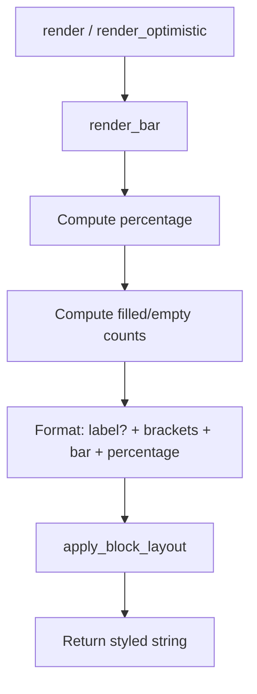

# Challenges of Migrating the `Progress` Component to the Tree Rendering Architecture

## Functional and Design Goals

### Why Progress Exists

The `Progress` component was created to provide a simple, reusable horizontal progress bar for terminal display. Unlike full TUI progress libraries (e.g., `indicatif`), the component fills a focused niche: a single-line, non-interactive progress indicator that integrates cleanly with the `TerminalRenderable` component ecosystem. It renders a fill/empty bar with brackets, an optional label, and a right-aligned percentage — all in one cohesive visual unit.

### Design Goals

1. **Completion visualization**: Render a horizontal bar showing completion from 0% to 100%, where a `value: f32` between 0.0 and 1.0 controls the fill ratio.
2. **Configurable bar dimensions**: Allow the bar width (in characters) to be set independently of the terminal width, defaulting to 20 characters.
3. **Customizable glyphs**: Allow the fill character, empty character, and bracket characters to be overridden for theming or ASCII-only environments.
4. **Optional label**: Support a label prefix displayed before the bar for context (e.g., "Loading", "Upload").
5. **Value clamping**: Clamp the input value to the 0.0..=1.0 range so callers never need to validate before constructing.
6. **Layout integration**: Participate fully in the `TerminalRenderable` ecosystem with margins, alignment, and block-level layout via the standard `Layout` struct.

### Where It Is Used Today

| Consumer | Crate | Usage |
|----------|-------|-------|
| `model limits` command | `unchained-ai/cli` | Renders per-cap usage bars for agentic platform limits (Claude Code, Codex) with labels like "Max Turns", "Max Output" and a bar width of 30 |

### Example Usage

**Basic 75% progress bar:**

```rust
use biscuit_terminal::prelude::*;

let bar = Progress::new(0.75);
let term = Terminal::default();
print!("{}", bar.display(&term));
// Output: [███████████████           ·····]  75%
```

**Labeled bar with custom width (unchained-ai usage):**

```rust
let bar = Progress::new(cap.usage)
    .with_label(format!("    {}", cap.label))
    .with_bar_width(30);
print!("{}", bar.display(&term));
// Output:     Max Turns [██████████████·..............]  48%
```

**Custom characters:**

```rust
let bar = Progress::new(0.5)
    .with_fill_char('#')
    .with_empty_char('-')
    .with_brackets('(', ')');
print!("{}", bar.display(&term));
// Output: (##########----------)  50%
```

## Technical Implementation (current)

### Architecture Overview

Progress is implemented in `biscuit-terminal/lib/src/components/progress.rs` as a struct that implements `TerminalRenderable`. It owns its rendering parameters and a `Layout`.

```
Progress
├── value: f32                 (0.0..=1.0, clamped on construction)
├── label: Option<String>      (optional prefix before the bar)
├── bar_width: u32             (default: 20)
├── fill_char: char            (default: '█' U+2588)
├── empty_char: char           (default: '·' U+00B7)
├── left_bracket: char         (default: '[')
├── right_bracket: char        (default: ']')
└── layout: Layout             (margins, alignment, row-fill)
```

### Key Responsibilities

1. **Value clamping**: The constructor `Progress::new(value)` clamps the value to 0.0..=1.0, so `Progress::new(1.5)` behaves identically to `Progress::new(1.0)`. This eliminates the need for callers to validate.

2. **Bar rendering** (`render_bar`): Computes the filled and empty character counts from `value * bar_width`, rounding to the nearest integer. The percentage is computed separately as `(value * 100).round()`, formatted as a right-aligned 3-character field (`{:3}%`) so "0%", "50%", and "100%" all align correctly.

3. **Label composition**: When a label is present, the output format is `{label} {left_bracket}{bar}{right_bracket} {percentage}`. Without a label, the format is `{left_bracket}{bar}{right_bracket} {percentage}`.

4. **Layout application**: The `TerminalRenderable::render` and `render_optimistic` methods delegate to `render_bar()` to produce the raw bar string, then pass it to `Layout::apply_block_layout()` which applies margins and alignment as a cohesive block (not per-line).

### Rendering Flow



## Implementation Challenges

The tree rendering architecture introduces a canonical `RenderNode` tree with 25 `NodeKind` variants and target-specific renderers that walk the tree exhaustively. Migrating Progress to this architecture surfaces several challenges.

### Challenge 1: No Native Progress Bar Node Kind

#### Description

The `NodeKind` enum has no variant for a progress bar or gauge. The closest analogs are `Code` (a fixed-width block of characters) and `Table` (structured cells). Progress is neither: it is a single-line inline composition of a label, brackets, filled/empty characters in a computed ratio, and a percentage suffix. None of these semantics map cleanly to any existing `NodeKind`.

#### Example

A `Progress::new(0.75)` with bar width 20 produces `[███████████████           ·····]  75%`. There is no `NodeKind::ProgressBar` to represent this, and projecting it as a `Paragraph` of `Text` would reduce it to a pre-rendered string, losing the structural distinction between the label, the bar, and the percentage.

#### Proposed Test

```rust
#[test]
fn progress_tree_projection_is_valid() {
    let bar = Progress::new(0.75).with_label("Loading");
    let tree = bar.render_tree();
    let report = validate(&tree, ValidationMode::Full);
    assert!(report.is_valid(), "Progress must produce a valid tree: {:?}", report);
}
```

### Challenge 2: Pre-Computed Character Layout vs. Semantic Structure

#### Description

Progress renders by computing exact character counts (`filled_count`, `empty_count`) from the `value` and `bar_width`, then concatenating the characters into a flat string. This is inherently a pixel-level (character-cell-level) rendering operation. The tree architecture separates structure from presentation: a `TreeRenderable::render_tree()` call should produce semantic structure, not a pre-rendered character buffer. But Progress has no useful semantic structure beyond "a progress indicator at 75% completion."

#### Example

A `Progress::new(0.33)` with bar width 10 produces `[███·....]  33%`. The "3 filled, 7 empty" character breakdown is a rendering decision, not a structural property. In the tree, the value `0.33` and the bar width `10` are the semantic data; the character layout is a terminal presentation concern. Other targets would render this differently:

- **HTML**: `<progress value="33" max="100">` or `<div class="progress-bar" style="width:33%">`
- **Markdown**: No native representation; could degrade to `[███.......] 33%` as a code block, or simply `33%`

#### Proposed Test

```rust
#[test]
fn progress_tree_carries_semantic_value_not_rendered_bar() {
    let bar = Progress::new(0.75).with_bar_width(20);
    let tree = bar.render_tree();
    // The tree should carry the value (0.75) and bar_width (20), not
    // a pre-rendered string of 15 fill chars and 5 empty chars.
    // Verify by rendering the same tree at different bar widths.
    let term_40 = Terminal::new_optimistic(40);
    let term_80 = Terminal::new_optimistic(80);
    let out_40 = render_terminal_node(&tree, &TerminalRenderOptions::new(&term_40, RenderStrictness::Warn)).unwrap().output;
    let out_80 = render_terminal_node(&tree, &TerminalRenderOptions::new(&term_80, RenderStrictness::Warn)).unwrap().output;
    assert!(strip_escape_codes(&out_40).contains("75%"));
    assert!(strip_escape_codes(&out_80).contains("75%"));
}
```

### Challenge 3: Loss of Glyph Configuration in Tree Projection

#### Description

Progress allows the fill character, empty character, and bracket characters to be customized (e.g., `with_fill_char('#')`, `with_brackets('(', ')')`). These are purely visual/presentational choices. The `NodeKind` vocabulary has no mechanism for encoding character-level glyph preferences, and `NodeAttrs` only supports `id`, `classes`, and arbitrary `data` (as `serde_json::Value`). Storing glyph preferences in `NodeAttrs.data` would work mechanically, but downstream renderers (Markdown, HTML) have no use for them.

#### Example

Two `Progress` bars with identical value (0.5) but different glyphs:

```rust
let a = Progress::new(0.5);                             // [████████··]  50%
let b = Progress::new(0.5).with_fill_char('#').with_empty_char('-'); // [########--]  50%
```

After tree projection, both would need to carry their glyph choices so the terminal renderer can reproduce the visual difference. But the Markdown and HTML renderers would ignore this data entirely.

#### Proposed Test

```rust
#[test]
fn progress_tree_preserves_glyph_configuration() {
    let bar = Progress::new(0.5)
        .with_fill_char('#')
        .with_empty_char('-')
        .with_brackets('(', ')');
    let tree = bar.render_tree();
    // The tree must carry glyph configuration (e.g., in attrs.data)
    // so the terminal renderer can reproduce the visual output.
    let rendered = render_terminal_node(&tree, &opts).unwrap().output;
    let plain = strip_escape_codes(&rendered);
    assert!(plain.contains('#'), "Custom fill char must survive roundtrip");
    assert!(plain.contains('-'), "Custom empty char must survive roundtrip");
    assert!(plain.contains('('), "Custom left bracket must survive roundtrip");
}
```

### Challenge 4: Bar Width is a Terminal Rendering Parameter, Not Structure

#### Description

The `bar_width` field controls how many characters the bar portion occupies. This is a terminal-specific rendering parameter — it has no meaning in HTML (where a progress bar's width is controlled by CSS) or in Markdown (where there is no native progress bar). In the tree architecture, `render_tree()` has no access to rendering parameters; it produces a single canonical tree. The bar width would either need to be encoded in `NodeAttrs.data` (and ignored by non-terminal renderers) or deferred entirely to the terminal renderer.

#### Example

```rust
let bar = Progress::new(0.75).with_bar_width(10);
// Terminal: [███████       ···]  75%   (10-char bar)
let bar = Progress::new(0.75).with_bar_width(30);
// Terminal: [█████████████████████           ·········]  75%   (30-char bar)
```

Both produce the same value (75%) but different visual output. The tree should capture the bar width hint for the terminal renderer while allowing other targets to ignore it.

#### Proposed Test

```rust
#[test]
fn progress_tree_bar_width_hint_affects_terminal_output() {
    let bar_narrow = Progress::new(0.75).with_bar_width(10);
    let bar_wide = Progress::new(0.75).with_bar_width(30);
    let tree_narrow = bar_narrow.render_tree();
    let tree_wide = bar_wide.render_tree();

    let term = Terminal::new_optimistic(80);
    let out_narrow = render_terminal_node(&tree_narrow, &TerminalRenderOptions::new(&term, RenderStrictness::Warn)).unwrap().output;
    let out_wide = render_terminal_node(&tree_wide, &TerminalRenderOptions::new(&term, RenderStrictness::Warn)).unwrap().output;

    assert_ne!(out_narrow, out_wide, "Different bar widths must produce different output");
}
```

### Challenge 5: Multi-Target Rendering Produces Fundamentally Different Output

#### Description

Progress is a terminal-centric visualization. Its output in HTML and Markdown is fundamentally different:

- **Terminal**: `[██████████..........]  50%`
- **HTML**: `<progress value="50" max="100"></progress>` or a styled `<div>` with CSS width
- **Markdown**: No native construct; could degrade to plain text `[█████.....] 50%`, a code block, or simply `50%`

The tree architecture aims to "parse once, build one tree, walk it per target." But Progress's output across targets is so divergent that the tree representation would need to carry all the information for each target, and each renderer would need bespoke logic for a node kind that only one component uses.

#### Example

A Markdown renderer encountering a progress bar tree node has no idiomatic Markdown to emit. The best it could do is a plain-text representation (`[█████.....] 50%`) or a simple percentage (`50%`). An HTML renderer would ideally emit a `<progress>` element, but the current browser renderer has no mechanism for emitting arbitrary HTML elements outside its `BlockTag` vocabulary.

#### Proposed Test

```rust
#[test]
fn progress_produces_meaningful_output_for_all_targets() {
    let bar = Progress::new(0.75).with_label("Upload");
    let tree = bar.render_tree();

    let term_out = render_terminal_node(&tree, &term_opts).unwrap().output;
    assert!(strip_escape_codes(&term_out).contains("75%"));

    let md_out = render_markdown_node(&tree, &md_opts).unwrap().output;
    assert!(md_out.contains("75%"), "Markdown should at least show percentage");
    assert!(md_out.contains("Upload"), "Markdown should show label");

    let html_out = render_browser_node(&tree, &html_opts).unwrap().output.render();
    assert!(html_out.contains("75%"), "HTML should show percentage");
}
```

### Challenge 6: Percentage Formatting is a Presentation Concern

#### Description

Progress formats the percentage as `{:3}%` — a right-aligned 3-character field. This produces `"  0%"`, `" 75%"`, and `"100%"`. This formatting choice is terminal-specific: HTML would render a numeric value and let CSS handle alignment, and Markdown has no alignment mechanism. The tree should carry the raw percentage value (e.g., 75) rather than a formatted string, forcing each renderer to decide how to present it.

#### Example

A `Progress::new(0.005)` rounds to `  0%` in the current implementation (0.5% rounds to 1% on display, but 0.005 * 100 = 0.5 rounds to 0% in the integer cast). This rounding behavior is a presentation decision that should arguably belong to the renderer, not the tree.

#### Proposed Test

```rust
#[test]
fn progress_percentage_rounding_is_consistent_across_targets() {
    let bar = Progress::new(0.005); // 0.5% → rounds to 1% or 0%?
    let tree = bar.render_tree();

    let term_out = render_terminal_node(&tree, &term_opts).unwrap().output;
    let plain = strip_escape_codes(&term_out);
    // The percentage should appear (whether "0%" or "1%" is a renderer decision)
    assert!(plain.contains('%'), "Must show a percentage symbol");
}
```

### Challenge 7: Block-Level Layout Application

#### Description

Progress applies `Layout::apply_block_layout()` to its rendered output, which treats the bar as a single cohesive block for margin and alignment purposes. In the tree architecture, layout application happens at the renderer level. The terminal renderer applies margins and alignment to block-level nodes, but it does so generically. Progress's block-level treatment (the bar is always a single line that should be aligned as a whole) would need to be preserved through the tree walk.

#### Example

```rust
let bar = Progress::new(0.5).left_margin(Margin::Chars(4));
let output = bar.render_optimistic(Some(80));
assert!(output.starts_with("    "), "Should have left margin of 4 spaces");
```

In the tree, this left margin would be part of the tree's `Layout` or `NodeAttrs`. The terminal renderer would need to apply it when encountering the progress bar node.

#### Proposed Test

```rust
#[test]
fn progress_tree_layout_survives_terminal_render() {
    let bar = Progress::new(0.5).left_margin(Margin::Chars(4));
    let tree = bar.render_tree();
    let term = Terminal::new_optimistic(80);
    let out = render_terminal_node(&tree, &TerminalRenderOptions::new(&term, RenderStrictness::Warn)).unwrap().output;
    assert!(out.starts_with("    "), "Left margin must be preserved through tree rendering");
}
```

### Challenge 8: Progress as a Candidate for "Inherently Visual" Classification

#### Description

The tree-rendering roadmap states: "inherently visual components (`TerminalImage`, `GraphExpression`) are intentionally **not** intended to route through the tree — they keep bespoke renderers permanently." Progress sits in a gray area: it is a visual indicator with character-cell-level rendering (fill/empty glyphs, brackets), but it also carries semantic data (a percentage value and a label) that is meaningful in all targets. Deciding whether Progress is "inherently visual" or "semantic" determines whether it should adopt `TreeRenderable` at all.

#### Example

A `Progress` bar in an HTML document could be a native `<progress>` element or a CSS-styled div. A `Progress` bar in a Markdown document could be a plain-text fallback or simply the percentage. Both are useful outputs, but the visual glyph configuration (fill char, empty char, brackets) is terminal-only. The question is: should the tree carry the semantic data (value, label) and let each target render it idiomatically, or should Progress remain a terminal-only component with a separate simplified tree projection for other targets?

#### Proposed Test

```rust
#[test]
fn progress_semantic_content_survives_tree_roundtrip() {
    let bar = Progress::new(0.75).with_label("Uploading");
    let tree = bar.render_tree();
    let rendered = render_terminal_node(&tree, &term_opts).unwrap().output;
    let plain = strip_escape_codes(&rendered);
    assert!(plain.contains("Uploading"), "Label must survive tree roundtrip");
    assert!(plain.contains("75%"), "Percentage must survive tree roundtrip");
}
```

## Solution Suggestions

### Solution 1: Add a `Progress` Node Kind to `NodeKind`

#### Description

Introduce a new `NodeKind::Progress` variant that carries the semantic data:

```
NodeKind::Progress {
    value: f32,              // 0.0..=1.0
    bar_width: Option<u32>,  // terminal hint; None = renderer default
    label: Option<String>,
}
```

Glyph configuration (fill char, empty char, brackets) would live in `NodeAttrs.data` as JSON values (e.g., `{"fillChar": "█", "emptyChar": "·", "leftBracket": "[", "rightBracket": "]"}`) so the terminal renderer can retrieve them while Markdown and HTML renderers ignore them.

#### Challenges Addressed

- **Challenge 1** (No native node kind): Directly provides a structural representation.
- **Challenge 2** (Pre-computed vs. semantic): Carries `value` and `bar_width` as data, deferring character layout to the renderer.
- **Challenge 3** (Glyph configuration): Stored in `NodeAttrs.data`, retrievable by terminal renderer.
- **Challenge 4** (Bar width as rendering parameter): Carried as an optional hint that non-terminal renderers ignore.

#### Variant Solutions

- Use `NodeKind::Unsupported` with a rich label, accepting that Progress degrades to plain text in non-terminal targets. This avoids growing the enum but loses all semantic structure.
- Use `NodeKind::Code` with a synthetic code block containing the pre-rendered bar. This avoids a new variant but loses all semantic data and produces nonsensical Markdown/HTML output.

### Solution 2: Dual-Path Rendering with Parity Gate

#### Description

Implement `TreeRenderable` on Progress for the semantic path (Markdown, HTML) while keeping the existing `TerminalRenderable` impl for the terminal path. The `TreeRenderable::render_tree()` projection produces a simplified representation — e.g., a `Paragraph` containing the label and percentage as `Text` nodes. A parity test (following the established `BlockQuote` pattern in `render_tree_component_parity.rs`) renders Progress both ways and asserts semantic equivalence on the terminal output.

This approach mirrors how `BlockQuote` already works: the bespoke `TerminalRenderable` runs on `bar.render(&term)`, while `TreeRenderable` provides a simplified projection for other targets.

#### Challenges Addressed

- **Challenge 5** (Multi-target divergence): Terminal keeps bespoke; Markdown/HTML get a simplified but meaningful representation.
- **Challenge 8** (Inherently visual classification): Acknowledged; only the semantic projection goes through the tree.

#### Variant Solutions

- Use `TreeComponent<Progress>` as the adapter, overriding `render()` to call the bespoke impl directly, and `render_tree()` to produce a simplified tree. This is the minimal-change option.
- Eventually migrate the terminal rendering to the tree once a `NodeKind::Progress` variant exists (Solution 1), using the parity gate to ensure no regression.

### Solution 3: Encode Progress as an Extended Span with Data Attributes

#### Description

Instead of a new `NodeKind` variant, project Progress as a `NodeKind::Span` with semantic classes and data attributes:

```
NodeKind::Span {
    children: [
        Text("Loading "),        // label
        Text("75%"),             // percentage
    ]
}
attrs: {
    classes: ["progress"],
    data: {
        "value": 0.75,
        "barWidth": 20,
        "fillChar": "█",
        "emptyChar": "·",
        "leftBracket": "[",
        "rightBracket": "]",
    }
}
```

The terminal renderer would recognize the `progress` class and render using the full glyph-based bar. The HTML renderer would emit a `<span class="progress" data-value="0.75">Loading 75%</span>` that could be styled with CSS. The Markdown renderer would emit the plain text `Loading 75%`.

#### Challenges Addressed

- **Challenge 1** (No native node kind): Reuses existing `Span` variant with convention-based interpretation.
- **Challenge 2** (Pre-computed vs. semantic): Carries `value` as data, deferring rendering.
- **Challenge 3** (Glyph configuration): Stored in `attrs.data`.
- **Challenge 7** (Block-level layout): The `Span` is treated as inline; the terminal renderer wraps it in a block-level container when it detects the `progress` class.

#### Variant Solutions

- Use `NodeKind::Paragraph` instead of `Span` for block-level semantics. This is more natural for a standalone progress bar but loses the ability to inline a progress bar within a paragraph of text.

### Solution 4: Introduce a "Widget" Node Kind for Visual Components

#### Description

Add a generalized `NodeKind::Widget` variant for components that are primarily visual but carry semantic data:

```
NodeKind::Widget {
    widget_type: String,     // e.g., "progress", "gauge", "sparkline"
    children: Vec<RenderNode>,
}
```

The semantic data lives in `NodeAttrs.data` and `attrs.classes`. Each target renderer handles known widget types idiomatically (terminal renders the progress bar, HTML emits `<progress>`, Markdown emits plain text) and degrades unknown widgets to `Unsupported`.

This approach scales to other visual components that might want tree representation in the future (e.g., sparklines, gauges, heat maps).

#### Challenges Addressed

- **Challenge 1** (No native node kind): Provides a generic structural hook.
- **Challenge 5** (Multi-target divergence): Each renderer handles known widget types idiomatically.
- **Challenge 8** (Inherently visual classification): Acknowledges the visual nature while still enabling tree representation.

#### Variant Solutions

- Use a closed `WidgetType` enum instead of a `String` for type safety and exhaustive matching. This prevents typos but requires updating the enum for each new widget.
- Use `NodeKind::Html` with generated HTML for the browser target and rely on the terminal renderer to intercept the widget. This overloads HTML semantics.

### Solution 5: Defer Layout Application to the Terminal Renderer

#### Description

Remove layout concerns from the `render_tree()` projection entirely. The tree carries only the semantic data (value, label, glyph hints). The terminal renderer is responsible for applying `Layout::apply_block_layout()` when it encounters the progress bar node. The `TerminalRenderOptions` already carry a `TerminalRenderContext` with a base `Layout`; the progress bar's own layout configuration (margins, alignment) would be encoded in `NodeAttrs.data` and applied by the renderer.

#### Challenges Addressed

- **Challenge 4** (Bar width as rendering parameter): The renderer reads bar width from `NodeAttrs.data` and applies it.
- **Challenge 7** (Block-level layout): The renderer applies block layout, just as the current bespoke impl does.

#### Variant Solutions

- Carry layout as a structured `NodeAttrs` field (e.g., `attrs.layout: Option<LayoutData>`) instead of opaque JSON. More type-safe but grows the `NodeAttrs` surface.
- Use the `TerminalRenderContext.layout` as the default and allow the progress bar to override via `attrs.data`. This is simpler but less explicit.
