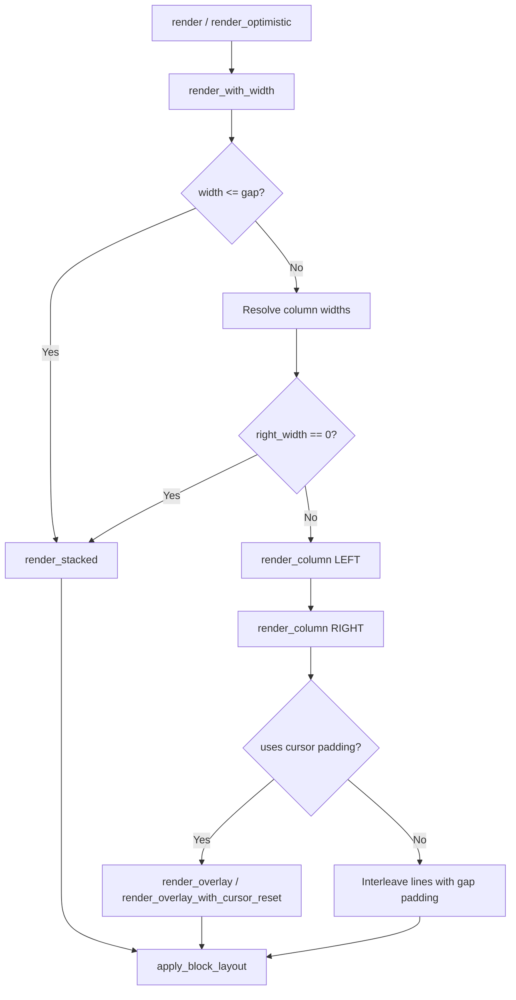

# Challenges of Migrating the `TwoColumn` Component to the Tree Rendering Architecture

## Functional and Design Goals

### Why TwoColumn Exists

The `TwoColumn` component was created to solve a fundamental terminal-layout problem: rendering two distinct pieces of content side by side within a single terminal viewport. Unlike HTML or GUI layouts where CSS flexbox and grid make columnar layouts trivial, terminals are character-grid devices with no native concept of horizontal partitioning. The component bridges this gap by computing column widths, managing per-column word wrapping, aligning rows, and handling the full lifecycle of terminal cursor positioning.

### Design Goals

1. **Side-by-side layout**: Render two independent content regions (left and right) as parallel columns within the available terminal width.
2. **Flexible column sizing**: Support both fixed-width (e.g., "30 characters") and percentage-based (e.g., "60% of available space") column widths, with a default 50/50 split.
3. **Gap control**: Allow a configurable number of space characters between columns (default: 3).
4. **Responsive fallback**: Automatically stack columns vertically when the terminal is too narrow to accommodate both columns, ensuring content remains readable.
5. **Inline image support**: Handle `TerminalImage` components (Kitty/iTerm2 protocol sequences) inside columns, which use cursor-based positioning rather than plain text.
6. **Layout integration**: Participate fully in the `TerminalRenderable` ecosystem with margins, alignment, word-wrap, and row-fill via the standard `Layout` struct.
7. **Terminal-specific cursor optimization**: Use tailored cursor movement strategies for capable terminals (WezTerm, Ghostty, Kitty, iTerm2) and fallback to generic save/restore for others.

### Where It Is Used Today

| Consumer | Crate | Usage |
|----------|-------|-------|
| `bt columns` CLI command | `biscuit-terminal/cli` | Direct CLI tool for rendering two text arguments side by side with configurable gap, width, and margins |
| Compose performance report | `darkmatter/cli` | `format_compose_perf_report` renders "Command Setup" (left) and "Compose Pipeline" (right) metrics side by side |
| `two-column-prose` example | `biscuit-terminal/lib/examples` | Demonstrates prose content in both columns with word-wrap |
| `two_column_with_image` example | `biscuit-terminal/lib/examples` | Demonstrates a `TerminalImage` on the left and `Prose` description on the right |

### Example Usage

**Simple key-value display via CLI:**

```bash
bt columns --gap 6 --left 40% "Title" "Description"
bt columns --margin-left 2 "Label" "Value"
```

**Prose content side by side (library):**

```rust
use biscuit_terminal::prelude::*;

let left = Prose::new("{{bold}}Summary{{reset}}\nShort overview.");
let right = Prose::new("{{bold}}Details{{reset}}\nFull description here.");

let columns = TwoColumn::new(left, right)
    .with_left_percent(0.45)
    .with_gap(4);

let term = Terminal::new();
let output = columns.render(&term);
print!("{}", output);
```

**Image + text (library):**

```rust
let image = TerminalImage::new("photo.png")?.with_width(ImageWidth::Fill);
let description = Prose::new("{{bold}}Photo{{reset}}\nA description.");

let columns = TwoColumn::new(image, description)
    .with_left_percent(0.35);
```

**Performance report (darkmatter):**

```rust
let columns = TwoColumn::new(
    Prose::new(left_metrics.trim_end()),
    Prose::new(right_metrics.trim_end()),
)
.with_left_percent(0.5)
.with_gap(2);

let body = columns.render_optimistic(None);
```

## Technical Implementation (current)

### Architecture Overview

TwoColumn is implemented in `biscuit-terminal/lib/src/components/two_column.rs` as a struct that implements `TerminalRenderable`. It owns two `RenderableTerminalContent` fields (left and right), a `ColumnWidth` for the left column, a gap size, and a `Layout`.

```
TwoColumn
├── left: RenderableTerminalContent   (String | Rc<dyn TerminalRenderable>)
├── right: RenderableTerminalContent  (String | Rc<dyn TerminalRenderable>)
├── left_width: ColumnWidth           (Fixed(u32) | Percent(f32))
├── gap: u32                          (default: 3)
└── layout: Layout                    (margins, alignment, word-wrap, row-fill)
```

### Key Responsibilities

1. **Column width resolution** (`render_columns`): Resolves `ColumnWidth::Fixed` and `ColumnWidth::Percent` into concrete character widths based on available terminal space (total width minus gap). Clamps both columns to at least 1 character.

2. **Per-column rendering** (`render_column`): Each column is rendered independently:
   - Plain strings are split and word-wrapped to the column width.
   - `TerminalRenderable` components are rendered with a `Terminal` that has `fixed_width` set to the column width, so nested components respect the column constraint.
   - `TerminalImage` is a special case: it attempts `render_inline()` which returns Kitty/iTerm2 protocol sequences and a pixel height. These sequences use cursor-based padding rather than spaces, so the `RenderedColumn` flag `uses_cursor_padding` is set to `true`.

3. **Row alignment**: After rendering both columns, the component iterates over the maximum line count, padding shorter lines with spaces so that the right column always starts at the same horizontal offset in every row.

4. **Cursor-based overlay for images** (`render_overlay` / `render_overlay_with_cursor_reset`): When either column contains a `TerminalImage`, plain text spacing breaks because image protocol bytes don't consume character cells predictably. Instead, the component uses ANSI cursor save/restore (`\x1b7\x1b[s` / `\x1b[u\x1b8`) and cursor movement (`\x1b[<n>C`, `\x1b[<n>A`, `\x1b[<n>B`) to position the right column content at the correct offset:
   - For WezTerm, Ghostty, Kitty, iTerm2: renders the left column, moves the cursor up by the left column's height, then renders the right column at the horizontal offset.
   - For other terminals: uses a save/restore pair to position each column independently.

5. **Responsive stacking** (`render_stacked`): When the available width is less than or equal to the gap, or when either column would be 0 characters wide, the component renders both columns as full-width stacked blocks instead.

6. **Layout application** (`render_with_width`): Delegates to `Layout::apply_block_layout()` which applies margins, alignment, and row-fill to the combined output as a cohesive block (not line-by-line).

### Rendering Flow (simplified)



## Implementation Challenges

The tree rendering architecture introduces a canonical `RenderNode` tree with 25 `NodeKind` variants and target-specific renderers that walk the tree exhaustively. Migrating TwoColumn to this architecture surfaces several significant challenges.

### Challenge 1: No Native Two-Column Node Kind

#### Description

The `NodeKind` enum has no variant for side-by-side column layout. The closest analogs are `Table` (which has rows and cells) and `Span` (a generic inline container). TwoColumn is fundamentally different from a table: it has exactly two "columns" with independent width sizing, independent word-wrapping, row-level alignment, and a configurable gap. None of these semantics map cleanly to any existing `NodeKind`.

#### Example

A `TwoColumn::new("Label:", "Value")` with a 30/70 split and gap of 2 has no natural `NodeKind` representation. Mapping it to a `Table` with one row and two cells would lose the percentage-based width hint, the gap configuration, and the responsive stacking behavior.

#### Proposed Test

```rust
#[test]
fn two_column_tree_projection_is_valid() {
    let columns = TwoColumn::new("Left", "Right")
        .with_left_percent(0.5)
        .with_gap(3);
    let tree = columns.render_tree();
    let report = validate(&tree, ValidationMode::Strict);
    assert!(report.is_valid(), "TwoColumn must produce a valid tree: {:?}", report);
}
```

### Challenge 2: Width-Dependent Content Rendering

#### Description

TwoColumn's per-column rendering is inherently width-dependent. It renders each column's content into a width-constrained space *before* combining the results. The tree architecture separates the tree structure from the rendering pass, so a `TreeRenderable::render_tree()` call has no knowledge of the terminal width. This means the tree cannot contain width-resolved, word-wrapped column content.

#### Example

A `Prose` component containing "The quick brown fox jumps over the lazy dog" renders as 4 lines in a 20-character column but as 2 lines in a 40-character column. The tree produced by `render_tree()` cannot make this determination because it does not receive a width parameter.

#### Proposed Test

```rust
#[test]
fn two_column_tree_content_is_width_independent() {
    let columns = TwoColumn::new(
        "The quick brown fox jumps over the lazy dog",
        "Short text",
    );
    let tree = columns.render_tree();
    // The tree must represent the content semantically, not with pre-wrapped lines.
    // Verify that wrapping is deferred to the renderer.
    let rendered_80 = render_terminal_node(&tree, &opts_80).unwrap().output;
    let rendered_40 = render_terminal_node(&tree, &opts_40).unwrap().output;
    assert_ne!(rendered_80, rendered_40, "Different widths must produce different layouts");
}
```

### Challenge 3: Cursor-Based Overlay for Inline Images

#### Description

When a column contains a `TerminalImage`, the component switches from text-based spacing to cursor save/restore sequences (`\x1b7\x1b[s` / `\x1b[u\x1b8`) and cursor movement (`\x1b[<n>A`, `\x1b[<n>B`, `\x1b[<n>C`). This is a terminal-specific rendering strategy that depends on the image protocol (Kitty vs iTerm2) and the terminal app. The tree architecture's terminal renderer walks `NodeKind` variants — there is no `NodeKind` for "position cursor at column offset N, then render."

#### Example

In `two_column_with_image.rs`, a `TerminalImage` is placed in the left column and a `Prose` description in the right. The rendered output contains `\x1b7\x1b[s` to save the cursor position, renders the image protocol bytes, then restores and moves the cursor to the right column offset. This interleaving of layout directives and content bytes has no tree representation.

#### Proposed Test

```rust
#[test]
fn two_column_with_image_produces_balanced_cursor_sequences() {
    let image = TerminalImage::new("fixtures/tiny.png").unwrap();
    let columns = TwoColumn::new(image, Prose::new("Description"));
    let term = Terminal::new_optimistic(80);
    let output = columns.render(&term);
    let saves = output.matches("\x1b7").count() + output.matches("\x1b[s").count();
    let restores = output.matches("\x1b8").count() + output.matches("\x1b[u").count();
    assert_eq!(saves, restores, "Cursor save/restore must be balanced");
}
```

### Challenge 4: Terminal-Specific Cursor Strategies

#### Description

TwoColumn selects between two cursor-movement strategies based on the detected terminal application:
- **WezTerm/Ghostty/Kitty/iTerm2**: Uses `render_overlay_with_cursor_reset`, which renders the left column, moves the cursor up, then renders the right column.
- **All other terminals**: Uses `render_overlay`, which wraps each column in a save/restore pair.

The tree's terminal renderer does not currently have a mechanism for conditional rendering strategies per terminal app at the `NodeKind` level.

#### Example

The same `TwoColumn` with an image renders differently on WezTerm vs Apple Terminal. On WezTerm, the output is: `left_block + cursor_up + right_block + cursor_down`. On Apple Terminal, it is: `save_cursor + left_block + restore_cursor + save_cursor + right_block + restore_cursor + cursor_down`.

#### Proposed Test

```rust
#[test]
fn two_column_cursor_strategy_differs_by_terminal_app() {
    let columns = TwoColumn::new(
        TerminalImage::new("fixtures/tiny.png").unwrap(),
        Prose::new("text"),
    );
    let wezterm = Terminal::default(); // assume WezTerm env
    let generic = Terminal::default(); // assume unknown env
    let wez_out = columns.render(&wezterm);
    let gen_out = columns.render(&generic);
    // The output sequences differ — one uses cursor-reset, the other save/restore.
    assert_ne!(wez_out, gen_out);
}
```

### Challenge 5: Responsive Stacking Threshold

#### Description

TwoColumn automatically switches from side-by-side to vertical stacking when the terminal is too narrow. The threshold depends on the gap and the resolved column widths. In the tree architecture, this decision would need to be made during the terminal rendering pass, but `NodeKind` has no concept of "render as columns if wide enough, otherwise stack vertically."

#### Example

`TwoColumn::new("Label", "Value")` with a gap of 3 and terminal width 80 renders side by side. At width 4 (gap is 3, leaving 1 char per column which is clamped), it stacks as `"Label\nValue"`. The tree would need to carry both layout possibilities or defer the decision entirely to the renderer.

#### Proposed Test

```rust
#[test]
fn two_column_stacks_below_threshold() {
    let columns = TwoColumn::new("Left", "Right").with_gap(3);
    let wide = columns.render_optimistic(Some(80));
    let narrow = columns.render_optimistic(Some(1));
    assert!(!wide.contains('\n') || wide.lines().all(|l| l.contains("Right")),
            "Wide: side by side");
    assert_eq!(narrow, "Left\nRight", "Narrow: stacked");
}
```

### Challenge 6: Per-Column Word Wrapping Before Combination

#### Description

Each column's content is word-wrapped independently to its resolved column width *before* the two columns are interleaved. This pre-wrapping step is critical for correct row alignment. In the tree model, word wrapping happens during the render pass, but TwoColumn needs wrapping to happen at a sub-component level (per column) with a width that is not the full terminal width.

#### Example

Left column (20 chars wide): "The quick brown fox" wraps to "The quick brown\nfox" (2 lines). Right column (20 chars wide): "Hello" stays as "Hello" (1 line). After interleaving, row 2 is "fox                + padding". The tree renderer would need to wrap each `NodeKind::TableCell` (or equivalent) independently before assembling rows.

#### Proposed Test

```rust
#[test]
fn two_column_wraps_each_column_independently() {
    let columns = TwoColumn::new(
        "The quick brown fox jumps",
        "Short",
    ).with_left_percent(0.5).with_gap(2);
    let output = columns.render_optimistic(Some(30));
    let lines: Vec<&str> = output.lines().collect();
    // Left column wraps to multiple lines, right stays on one line.
    // All rows must have the same visible width.
    let widths: Vec<usize> = lines.iter().map(|l| visible_width(l)).collect();
    assert!(widths.windows(2).all(|w| w[0] == w[1]),
            "All rows must have equal visible width: {:?}", widths);
}
```

### Challenge 7: Loss of `ColumnWidth` Metadata in Tree Projection

#### Description

TwoColumn's `ColumnWidth::Percent(0.7)` or `ColumnWidth::Fixed(30)` configuration is rendering metadata, not document structure. When projecting to a `RenderNode` tree, this information would need to live in `NodeAttrs` (as a class or data attribute) or be lost entirely. Downstream renderers (Markdown, HTML) would need to understand these attributes to produce meaningful output.

#### Example

A Markdown renderer encountering a two-column tree node could emit a Markdown table, but the percentage width hint (70/30 split) has no Markdown representation. An HTML renderer could emit a CSS grid with `grid-template-columns: 7fr 3fr`, but only if the percentage metadata survives the tree projection.

#### Proposed Test

```rust
#[test]
fn two_column_tree_preserves_width_configuration() {
    let columns = TwoColumn::new("A", "B")
        .with_left_width(ColumnWidth::Percent(0.7))
        .with_gap(4);
    let tree = columns.render_tree();
    // The tree must carry the width hint, e.g., in attrs.data or attrs.classes.
    let width_hint = &tree.attrs;
    assert!(!width_hint.classes.is_empty() || !width_hint.data.is_empty(),
            "Width configuration must survive tree projection");
}
```

### Challenge 8: Multi-Target Rendering Semantic Divergence

#### Description

TwoColumn has deeply terminal-specific behavior: cursor sequences, image protocol bytes, terminal-app-specific strategies. The tree architecture aims to serve three targets (terminal, Markdown, HTML). A `TwoColumn` projected to the tree would need each target renderer to independently solve the column-layout problem, and the semantics would diverge significantly across targets.

#### Example

- **Terminal**: Uses cursor save/restore and ANSI escape codes for positioning.
- **Markdown**: Could emit a pipe-delimited table (`| Left | Right |`) — but this loses percentage widths and responsive stacking.
- **HTML**: Could emit a CSS grid or flexbox — but this requires the renderer to generate CSS, which is outside the current scope of the browser renderer.

Each target would effectively need a bespoke column-layout implementation inside its renderer, which defeats the goal of shared tree structure.

#### Proposed Test

```rust
#[test]
fn two_column_produces_meaningful_output_for_all_targets() {
    let columns = TwoColumn::new("Key", "Value");
    let tree = columns.render_tree();

    let term_out = render_terminal_node(&tree, &term_opts).unwrap().output;
    assert!(strip_escape_codes(&term_out).contains("Key"));
    assert!(strip_escape_codes(&term_out).contains("Value"));

    let md_out = render_markdown_node(&tree, &md_opts).unwrap().output;
    assert!(md_out.contains("Key"));
    assert!(md_out.contains("Value"));
    // Column structure should be preserved in some form.
    assert!(md_out.contains('|') || md_out.contains("Key") && md_out.contains("Value"));

    let html_out = render_browser_node(&tree, &html_opts).unwrap().output;
    assert!(html_out.contains("Key"));
    assert!(html_out.contains("Value"));
}
```

### Challenge 9: Nesting TwoColumn Inside Other Components

#### Description

TwoColumn can be nested inside other `TerminalRenderable` components (e.g., inside a `BlockQuote` or `Compose`). The current implementation handles this via `with_parent_layout`, which adjusts margins based on the parent's layout. In the tree architecture, nesting is represented as parent-child `RenderNode` relationships, but TwoColumn's column-layout semantics (gap, width resolution, overlay) are not composable in the same way as simple block-level nesting.

#### Example

A `BlockQuote` containing a `TwoColumn` works today because the `BlockQuote` passes its layout constraints down via `with_parent_layout`. In the tree, this would be a `BlockQuote` node containing a two-column node. The terminal renderer would need to pass available width down through the tree walk, and the two-column node would need to receive this width to resolve its columns.

#### Proposed Test

```rust
#[test]
fn two_column_nested_in_block_quote_renders_correctly() {
    let inner = TwoColumn::new("Left", "Right").with_gap(2);
    let quote = BlockQuote::from(RenderableTerminalContent::Component(Rc::new(inner)));
    let term = Terminal::new_optimistic(80);
    let output = quote.render(&term);
    let plain = strip_escape_codes(&output);
    assert!(plain.contains("Left"));
    assert!(plain.contains("Right"));
    // Both columns should appear inside the block quote's border.
    assert!(plain.contains('│'));
}
```

### Challenge 10: TwoColumn as an Inherently Visual Component

#### Description

The tree-rendering roadmap explicitly calls out that "inherently visual components (`TerminalImage`, `GraphExpression`) are intentionally **not** intended to route through the tree — they keep bespoke renderers permanently." TwoColumn sits in a gray area: it is a layout primitive with heavy terminal-specific cursor logic, but it also carries semantic content that should ideally be representable in Markdown and HTML.

#### Example

A `TwoColumn` containing two `Prose` blocks has clear semantic content ("this text goes left, this text goes right"), but the rendering implementation is dominated by cursor positioning, image overlay, and terminal-specific strategies. Deciding whether TwoColumn is "inherently visual" (like `TerminalImage`) or "semantic" (like `BlockQuote`) determines whether it should adopt `TreeRenderable` at all.

#### Proposed Test

```rust
#[test]
fn two_column_content_survives_tree_roundtrip() {
    let columns = TwoColumn::new(
        Prose::new("{{bold}}Key{{reset}}"),
        Prose::new("Value with <em>emphasis</em>"),
    );
    let tree = columns.render_tree();
    let rendered = render_terminal_node(&tree, &term_opts).unwrap().output;
    let plain = strip_escape_codes(&rendered);
    assert!(plain.contains("Key"), "Bold text content survives");
    assert!(plain.contains("Value with emphasis"), "Plain text content survives");
}
```

## Solution Suggestions

### Solution 1: Add a `Columns` Node Kind to `NodeKind`

#### Description

Introduce a new `NodeKind::Columns` variant that carries column-level structure:

```
NodeKind::Columns {
    gap: u32,
    children: Vec<RenderNode>,  // exactly 2 children, one per column
}
```

Add a `NodeAttrs::data` entry for `ColumnWidth` metadata (e.g., `{"leftWidth": "percent:0.7"}`). This gives each target renderer a structural hook for column layout while preserving the configuration.

#### Challenges Addressed

- **Challenge 1** (No native node kind): Directly provides a structural representation.
- **Challenge 7** (Loss of width metadata): Stores width configuration in `NodeAttrs.data`.
- **Challenge 8** (Multi-target divergence): Each renderer can interpret `Columns` idiomatically for its target (table for Markdown, flexbox for HTML, cursor layout for terminal).

#### Variant Solutions

- Use `NodeKind::Table` with a single row and metadata attributes instead of a new variant. This avoids growing the enum but overloads table semantics.
- Use `NodeKind::Span` with a `columns` class and children. More generic but requires convention-based interpretation.

### Solution 2: Pass Available Width Through the Tree Walk

#### Description

Extend the terminal renderer's `TerminalRenderOptions` to carry a `column_width: Option<u32>` field that represents the width constraint for the current node. When the renderer encounters a `Columns` node, it partitions the available width, sets `column_width` on the options, and recurses into each child. This makes per-column word wrapping happen at render time rather than tree-projection time.

#### Challenges Addressed

- **Challenge 2** (Width-dependent content): Defers wrapping to the render pass where width is known.
- **Challenge 6** (Per-column wrapping): Each column child is rendered with its own width constraint.
- **Challenge 9** (Nesting): Parent layouts naturally propagate width through the tree walk.

#### Variant Solutions

- Use a "two-pass" approach: first pass measures each column's natural width, second pass renders with resolved widths. More complex but enables auto-sizing.
- Store unresolved width hints in the tree and resolve them in a dedicated layout pass before rendering.

### Solution 3: Render TwoColumn as a Bespoke Renderer for the Terminal Target

#### Description

Treat TwoColumn as an "inherently visual" component (like `TerminalImage`) that keeps its bespoke `TerminalRenderable` implementation permanently. For Markdown and HTML targets, project a simplified representation (e.g., a table) through `TreeRenderable`, but do not attempt to route the terminal rendering through the tree.

#### Challenges Addressed

- **Challenge 3** (Cursor overlay for images): No need to represent cursor sequences in the tree.
- **Challenge 4** (Terminal-specific strategies): The bespoke impl retains full control over terminal-specific behavior.
- **Challenge 5** (Responsive stacking): The bespoke impl retains the stacking threshold logic.
- **Challenge 10** (Inherently visual): Explicitly acknowledges TwoColumn's dual nature.

#### Variant Solutions

- Split TwoColumn into a "semantic" projection (for Markdown/HTML) and a "visual" rendering (for terminal), using `TreeRenderable` only for the semantic path.
- Keep TwoColumn entirely bespoke and provide a separate `TwoColumnMarkdown` / `TwoColumnHtml` utility for non-terminal targets.

### Solution 4: Introduce a `Columnar` Renderer Extension Point

#### Description

Add a renderer extension mechanism where the terminal renderer delegates rendering of certain `NodeKind` variants to registered handler functions. A `Columns` node would be handled by a closure that receives the `Terminal`, the resolved width, the gap, and the two child subtrees, and returns the rendered string. This keeps the column-layout logic outside the generic tree walk while still routing through the tree.

#### Challenges Addressed

- **Challenge 3** (Cursor overlay): The handler can use cursor sequences directly.
- **Challenge 4** (Terminal-specific strategies): The handler can inspect `Terminal::app`.
- **Challenge 5** (Responsive stacking): The handler makes the stacking decision at render time.
- **Challenge 8** (Multi-target divergence): Each target registers its own handler.

#### Variant Solutions

- Use a trait object (`Box<dyn ColumnarRenderer>`) instead of closures for more structured extensibility.
- Use `NodeAttrs.data` to carry renderer hints that the generic renderer can interpret without a handler.

### Solution 5: Dual-Path Rendering with Parity Gate

#### Description

Implement `TreeRenderable` on TwoColumn for the semantic path (Markdown, HTML) while keeping the existing `TerminalRenderable` impl for the terminal path. Add a parity test (following the established `BlockQuote` pattern in `render_tree_component_parity.rs`) that renders TwoColumn both ways and asserts semantic equivalence on the terminal output. This incremental approach does not require changing the `NodeKind` enum or the renderer.

#### Challenges Addressed

- **Challenge 8** (Multi-target divergence): Terminal keeps bespoke; Markdown/HTML get tree-based output.
- **Challenge 10** (Inherently visual): Acknowledged; only the semantic projection goes through the tree.

#### Variant Solutions

- Use `TreeComponent<TwoColumn>` as the adapter, overriding `render()` to call the bespoke impl directly, and `render_tree()` to produce a simplified tree. This is the minimal-change option.
- Eventually migrate the terminal rendering to the tree once Challenges 1-6 are solved, using the parity gate to ensure no regression.

### Solution 6: Introduce Width-Aware Tree Rendering Context

#### Description

Extend the rendering context passed through the tree walk to include a "layout constraint bag" containing available width, position offsets, and column configuration. This is similar to Solution 2 but more general: any node can read and modify the constraint bag, enabling not just columns but also margins, padding, and nested layouts to be resolved during the tree walk.

#### Challenges Addressed

- **Challenge 2** (Width-dependent content): The constraint bag carries width.
- **Challenge 6** (Per-column wrapping): Columns node partitions width into the bag.
- **Challenge 9** (Nesting): Parent nodes contribute to the constraint bag before recursing.
- **Challenge 5** (Responsive stacking): The columns handler reads available width from the bag and decides stacking.

#### Variant Solutions

- Use a stack-based approach where each renderable pushes/pops constraints, similar to CSS block formatting contexts.
- Use an immutable context that is forked for each child, avoiding mutation issues in recursive walks.
