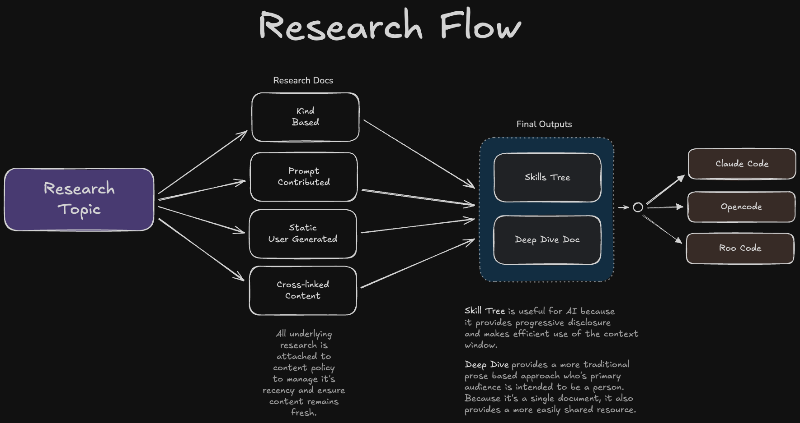
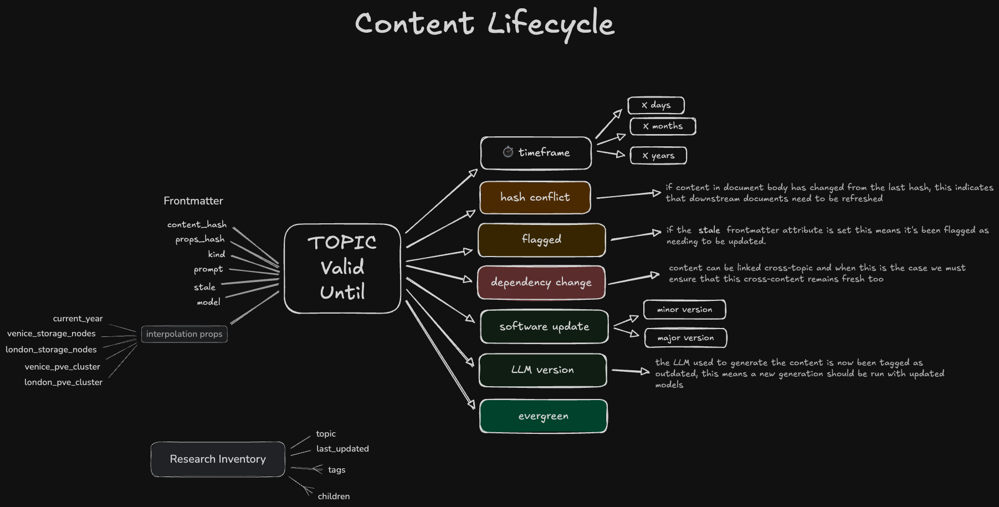

# Research

This plan will provide an upgrade to the research package.

- The primary focus is creating a data ecosystem which will support a "content lifecycle"
- as well as multiple topic types (today we only do research on software libraries)

## Content Lifecycle

Research that is done is rarely truly "evergreen" content (e.g., it never expires and always stays relevant) and rather than manually updating research periodically we want to establish a codified way to ensure content stays fresh.

### Research Flow

To do this let's first start with an understanding of the expected "research flow":




#### Final Deliverables

For any given research topic we start with a number of research documents which represent the "underlying research". These _underlying_ research documents will eventually become the foundation to build our two final deliverables:

1. **Skill Tree**

    With the advent of Agent Skills, our research process aims to provide a tree-structured knowledge structure which achieves the _progressive disclosure_ goals of an agentic skill platform.

2. **Deep Dive Document**

    The Deep Dive document is meant as a compliment to the skill tree and it provides all the content into a single large document of prose content. This content is meant to be "book like" and will always start with a table of contents to help the reader navigate it's large size.

These final deliverables will be created whenever:

1. an _underlying_ research document is added or changed
2. another topic is _linked_ or _de-linked_ to the given topic (in essence this will add that other topics deep dive as a "underlying" research document)
3. a _linked_ topic updates it's final deliverables
4. the "content policy" for the underlying research

For each topic, when an _underlying_ document is added or changed we will recreate the final deliverables.

#### Underlying Research

Underlying research is created through a variety of means:

1. **Kind Automated**

    All research topics are associated with a "kind" based categorization. Today we only have "software libraries" but in the future we'll add many more including:

     - "tech solution"
     - "homelab"
     - "person"
     - "organization"
     - "place"
     - "product"
     - etc.

    Each of these "kind" categories provides some context and for most of these topical areas this will automatically fire off an AI generation chain to do research. In some cases this may be the only underlying research needed to generate a useful final research product.

    **Example:** currently we only ask that the software libraries _name_ be given so that we may trigger this "kind based research" but we do optionally allow the user to add their own prompt based research.

    **Note:** it's worth noting that this "kind based" research will eventually be using agentic chains defined in the "ai-pipeline" package and that any prompts used during this chaining process will be preserved in the frontmatter of the underlying research.

2. **User Generated**

    A user may choose to write (or source) research information manually as a static document. There are two sub-variants of this process worth calling out:

    - 2a. **Static**

      In most cases we expect the document to be purely static, meaning that the body of the document represents the research all by itself.

    - 2b. **Template Interpolated**

      However, we will allow for the _interpolation_ of a dictionary of key/values to using a **Handlebars** syntax (e.g., `Hello {{person}}` would have the `person` variable interpolated into the content's body).

3. **Prompt Driven**

    Rather than have the user's participation be in providing the actual research content, it is more likely that a user will provide one or more additional "prompts" which will be handed off to an agentic process to be evaluated. These sorts of documents will retain the originating prompt in the frontmatter's `prompt` variable. This allows the body to be populated as a result of the

4. **Flow Driven**

    Rather than a single AI prompt, a **flow** driven document is generated via the ai-pipeline library and a serialized flow is saved to the `flow` property in frontmatter.

### Content Lifecycle

All underlying research will be tagged with a content policy which indicates how long it's content should be considered to be relevant for. The final deliverables do not have this explicit content policy assigned but are in effect the aggregate of the various underlying document's content.

A content policy will be a list of _conditions_ which invalidate the content. Therefore an "evergreen" piece of content (which should be quite rare), is an empty list of conditions. Technically this will be represented by the `policy` property in the frontmatter documents and will map to a serialized list of [`ContentExpiry`](./tech-design.md#content-expiry) enums in code.

Visually it might looks something like this:




## Document Types

Not to be confused with "kind" categorization (which is used to group a topic), _all_ research documents are assigned to a "type":

### Underlying Research

- `static` - a static document which was _not_ generated _nor_ does it use any interpolation
- `template` - a static document which _does_ use frontmatter interpolation
- `prompt` - a research document generated from a prompt; prompt is stored in `prompt` frontmatter, generation result is stored in the body of the document
- `kind-derived` - a document generated as a result of the "kind" of the topic

### Final Deliverables

- `skill` - given to the `SKILL.md` file and all other skill based documents in the skill tree
- `deep-dive` - given to the deep dive document for a topic

The content type is assigned to the `type` property of a document's frontmatter.


## Research Frontmatter

This section will detail out the properties in frontmatter which have a _special meaning_ in the research process. Other key/values can be added to a document (either statically or at generation time) to aid any _interpolated_ content generation.

1. `content_hash` - the xxHash of the documents body (after extraneous whitespace has been removed); whitespace removal is done to avoid any purely aesthetic but non-semantic changes showing change in the hash.
2. `interpolated_hash` - an xxHash of the key/value dictionary of interpolated values; this value is only generated when the body of the page USES interpolation to finalize it's content
3. `created` - an ISO datetime value indicating when this document came into existence for the first time
4. `last_updated` - an ISO datetime value indicating the last time this content was updated
5. `content_type` - the [content type](#document-types) of the document
6. `prompt` - all documents which use a prompt for generation will store the prompt used as frontmatter
7. `model` - all documents which use a prompt for generation will store the _actual_ model used as frontmatter
8. `model_capability` - all documents which use a prompt for generation will provide the "kind of model" they requested for this task (before it was resolved to an explicit model at generation time)
9. `flow` - if a document results from an agentic flow then the serialized flow will be saved to the frontmatter


## Research Inventory

The research library not only tracks metadata in the frontmatter of individual documents but we also keep a research inventory file `research-inventory.json`. This file is used to convey metadata about the topics included in the research library.

This is stored on disk as a JSON and is a dictionary/hashmap defined by the [`Topic` struct](./tech-design.md#topic-struct): `HashMap<String, Topic>`.

## Research Directory Structure

```txt
(Root Dir)
    ├── research-inventory.jsonl
    └── {kind}/
        ├── {topic}
        │   ├── skill
        │   │   └── SKILL.md
        │   └── deep-dive
        │       └── {topic}.md
        ├── {topic}
        │   ├── skill
        │   │   └── SKILL.md
        │   └── deep-dive
        │       └── {topic}.md
        └── {topic}
            ├── skill
            │   └── SKILL.md
            └── deep-dive
                └── {topic}.md
```

- by default the _root directory_ for research is `~/.research` but if we find the environment variable `RESEARCH_DIR` set we will use that instead
- as an organizational convenience we nest the various research topics under their "kind" category but we DO require that a `topic` name be unique across kind categories.

## Linking to Agentic CLI's

When we call the `research link` command we link the research skills to various agentic CLI providers.

- We do not COPY documents but instead use _symbolic links_ to the expected locations of the various Agentic CLI provider's "user scope"
    - For Claude Code that is: `~/.claude/skills`
    - For Opencode that is `~/.config/opencode/skill`
    - For Roo Code that is `~/.roo/skills`

### Localizing Skills to a Repo

You can localize a user-scoped skill to a repo with: `research pull <topic>`.

- while we prefer the ideal of a "single source of truth" via symbolic links (like we've done with the user scoped skills)
- for repo scope we must resort to making a COPY of the skill (as symbolic links within git are only allowed if they are relative to the repo)
- to avoid MULTIPLE copies in the repo, however, we will:
    - copy the skill to `{ROOT}/.claude/skill/{topic}`
    - link the skill to other Agentic frameworks's preferred location:
        - If we see an `AGENTS.md` file in the repo we will:
            - create a relative symbolic link to `{ROOT}/.opencode/skill/{topic}`
        - If we see a `{ROOT}/.roo` folder then we will create:
            - a relative symbolic link to `{ROOT/.roo/skills/{topic}`
- Localizing a skill does NOT remove it from user scope it just _copies_ it to the local repo for sharing purposes
    - now that we have a copy it is possible for **drift** to develop between the skill in the two scopes
    - you can always run `research pull <topic>` again to copy the user scope (including any new updates found there) back again to the repo's copy
- If you think you're going to want to manage/update a skill locally from a repo then you'll need to include the `--local` switch to the pull command: `research pull <topic> --local`
    - When you use the `--local` switch it will not only copy the skill but it will copy the underlying research to the local repo at `{ROOT}/.claude/research/{topic}`
    - Now when you run commands like `research update` from within the repo it will:
        - Warn if both local and user-scoped underlying research has changed
        - It will update BOTH the user and locally scoped research from the most up-to-date underlying content (and underlying content will be synced between user and local scopes)


