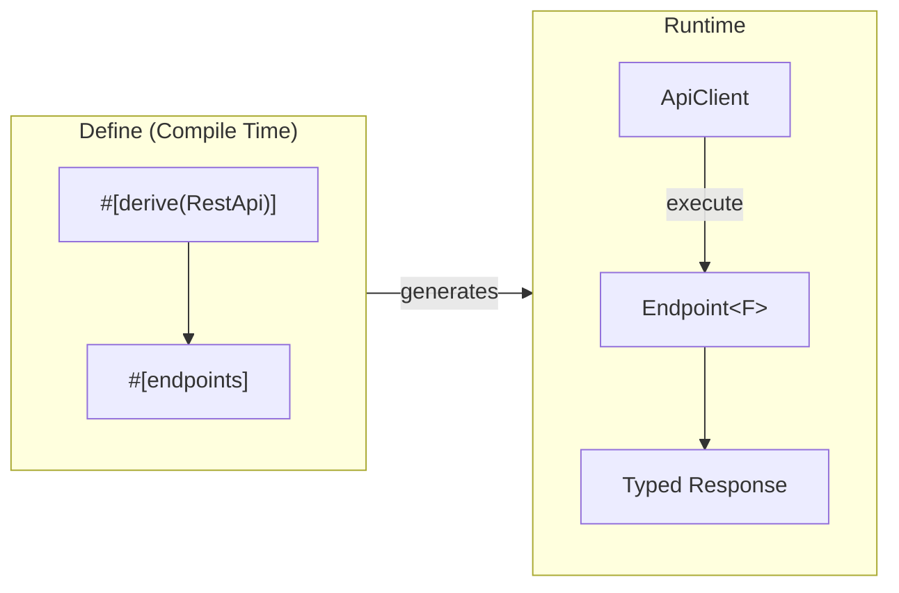

# Schematic Library

</img>


Type-safe REST API client library for Rust with proc-macro code generation.

## Overview

The `api` crate provides primitives for defining REST APIs with type-safe callable structs. It supports two approaches:

1. **Proc-macro approach** (recommended): Use `#[derive(RestApi)]` and `#[endpoints]` for compile-time code generation
2. **Manual approach**: Build endpoints and clients directly using the builder pattern



## Features

- **Type-safe endpoints**: Define endpoints with typed request/response bodies
- **Multiple response formats**: JSON, YAML, XML, HTML, CSV, PlainText, Binary
- **Async-first HTTP client**: Built on `reqwest` with `tokio`
- **Authentication methods**: Bearer token, API key header, query parameter
- **OpenAPI generation**: Auto-generate OpenAPI 3.x specs from definitions
- **Tracing instrumentation**: Full OpenTelemetry-compatible tracing

## Quick Start

### Using Proc Macros (Recommended)

```rust
use api_macros::{RestApi, endpoints};
use api::{ApiError, ApiAuthMethod};
use serde::Deserialize;

#[derive(Deserialize)]
struct Model {
    id: String,
    name: String,
}

#[derive(Deserialize)]
struct ModelsResponse {
    models: Vec<Model>,
}

#[derive(Deserialize)]
struct User {
    id: u64,
    name: String,
    email: String,
}

// Define the API client
#[derive(RestApi)]
#[api(base_url = "https://api.example.com")]
#[api(auth = bearer)]
#[api(docs = "https://docs.example.com")]
pub struct ExampleApi;

// Define endpoints
#[endpoints(api = ExampleApi)]
impl ExampleApi {
    /// List all available models
    #[endpoint(method = Get, path = "/models")]
    #[response(json)]
    pub async fn list_models(&self) -> Result<ModelsResponse, ApiError>;

    /// Get a user by ID
    #[endpoint(method = Get, path = "/users/{id}")]
    #[response(json)]
    pub async fn get_user(&self, id: String) -> Result<User, ApiError>;
}

// Usage
async fn example() -> Result<(), ApiError> {
    let api = ExampleApi::new("sk-your-api-key")?;

    // List models
    let models = api.list_models().await?;
    println!("Found {} models", models.models.len());

    // Get a specific user
    let user = api.get_user("123".to_string()).await?;
    println!("User: {}", user.name);

    Ok(())
}
```

### Manual Approach

```rust
use api::{ApiClient, Endpoint, RestMethod, ApiAuthMethod};
use api::response::JsonFormat;
use url::Url;
use serde::Deserialize;

#[derive(Deserialize)]
struct User {
    id: u64,
    name: String,
}

async fn example() -> Result<(), api::ApiError> {
    // Create the client
    let base_url = Url::parse("https://api.example.com")?;
    let client = ApiClient::builder(base_url)
        .auth(ApiAuthMethod::BearerToken, "sk-your-api-key")
        .build()?;

    // Define an endpoint
    let get_user: Endpoint<JsonFormat<User>> = Endpoint::builder()
        .id("get_user")
        .method(RestMethod::Get)
        .path("/users/{id}")
        .description("Retrieve a user by ID")
        .build();

    // Execute with path parameters
    let user = client
        .execute_with_params(&get_user, &[("id", "123")])
        .await?;

    println!("User: {}", user.name);
    Ok(())
}
```

## Response Formats

The library supports multiple response formats, each with its own parsing strategy:

| Format | Type | Output | Content-Type |
|--------|------|--------|--------------|
| JSON | `JsonFormat<T>` | `T` (deserialized) | `application/json` |
| YAML | `YamlFormat<T>` | `T` (deserialized) | `application/yaml` |
| XML | `XmlFormat<X>` | `X` (deserialized) | `application/xml` |
| Plain Text | `PlainTextFormat` | `String` | `text/plain` |
| HTML | `HtmlFormat` | `String` | `text/html` |
| CSV | `CsvFormat` | `String` | `text/csv` |
| Binary | `BinaryFormat` | `Vec<u8>` | `application/octet-stream` |

### JSON Example

```rust
use api::response::JsonFormat;

#[derive(serde::Deserialize)]
struct ApiResponse {
    data: Vec<Item>,
    total: usize,
}

let endpoint: Endpoint<JsonFormat<ApiResponse>> = Endpoint::builder()
    .id("list_items")
    .method(RestMethod::Get)
    .path("/items")
    .build();
```

### Binary Example

```rust
use api::response::BinaryFormat;

let endpoint: Endpoint<BinaryFormat> = Endpoint::builder()
    .id("download_file")
    .method(RestMethod::Get)
    .path("/files/{id}/download")
    .build();

let bytes: Vec<u8> = client.execute(&endpoint).await?;
```

## Authentication

Three authentication methods are supported:

```rust
use api::ApiAuthMethod;

// Bearer token (Authorization: Bearer <token>)
ApiAuthMethod::BearerToken

// API key in custom header (X-API-Key: <key>)
ApiAuthMethod::ApiKey("X-API-Key".to_string())

// API key as query parameter (?key=<key>)
ApiAuthMethod::QueryParam("key".to_string())

// No authentication
ApiAuthMethod::None
```

## Error Handling

Errors are structured in a layered hierarchy:

```rust
use api::{ApiError, ClientError, AuthError, ValidationError, ConfigError};

match result {
    Err(ApiError::Client(ClientError::HttpStatus { status, message })) => {
        eprintln!("HTTP {}: {}", status, message);
    }
    Err(ApiError::Auth(AuthError::AuthenticationFailed { message })) => {
        eprintln!("Auth failed: {}", message);
    }
    Err(ApiError::Validation(ValidationError::JsonParse(e))) => {
        eprintln!("Failed to parse JSON: {}", e);
    }
    Err(ApiError::Config(ConfigError::InvalidUrl(e))) => {
        eprintln!("Invalid URL: {}", e);
    }
    Ok(data) => {
        // Success
    }
}
```

### Error Types

| Error Type | Description |
|------------|-------------|
| `ClientError` | HTTP/network errors (status codes, timeouts, connection failures) |
| `AuthError` | Authentication failures (missing key, invalid format, 401/403) |
| `ValidationError` | Response parsing errors (JSON, YAML, XML, content type mismatch) |
| `ConfigError` | Configuration errors (invalid URL, missing fields, duplicate endpoints) |

## OpenAPI Generation

Generate OpenAPI 3.1.0 specifications from your API definitions:

```rust
use api::openapi::{OpenApiGenerator, OpenApiInfo, Server, EndpointSpec, OutputFormat};
use api::RestMethod;

let spec = OpenApiGenerator::new(OpenApiInfo::new("My API", "1.0.0"))
    .add_server(Server::new("https://api.example.com"))
    .add_endpoint(
        EndpointSpec::new("list_users", RestMethod::Get, "/users")
            .with_summary("List all users")
            .with_tag("users")
    )
    .add_endpoint(
        EndpointSpec::new("get_user", RestMethod::Get, "/users/{id}")
            .with_summary("Get user by ID")
            .with_tag("users")
    )
    .generate(OutputFormat::Yaml)?;

println!("{}", spec);
```

Output:

```yaml
openapi: 3.1.0
info:
  title: My API
  version: 1.0.0
servers:
  - url: https://api.example.com
paths:
  /users:
    get:
      operationId: list_users
      summary: List all users
      tags: [users]
      responses:
        '200':
          description: Successful response
  /users/{id}:
    get:
      operationId: get_user
      summary: Get user by ID
      tags: [users]
      parameters:
        - name: id
          in: path
          required: true
          schema:
            type: string
      responses:
        '200':
          description: Successful response
```

## Tracing

The client includes OpenTelemetry-compatible tracing instrumentation:

```rust
// Spans include:
// - http.method: GET, POST, etc.
// - http.url: Full request URL
// - http.status_code: Response status
// - otel.kind: "client"
// - otel.status_code: "OK" or "ERROR"
```

Enable tracing in your application:

```rust
use tracing_subscriber::{layer::SubscriberExt, util::SubscriberInitExt};

tracing_subscriber::registry()
    .with(tracing_subscriber::fmt::layer())
    .init();
```

## XML and XSD Validation

XML responses can optionally be validated against XSD schemas. By default, XML parsing uses quick-xml without schema validation.

```rust
use api::response::XmlSchema;
use std::borrow::Cow;

#[derive(serde::Deserialize)]
struct MyXmlResponse {
    data: String,
}

impl XmlSchema for MyXmlResponse {
    fn xsd_schema() -> Option<Cow<'static, str>> {
        // Return None for parse-only mode (default)
        // Return Some(schema) to enable XSD validation (requires xsd-validation feature)
        None
    }
}
```

> **Note**: Full XSD validation requires the optional `xsd-validation` feature which adds the `libxml` dependency.

## Crate Structure

```
api/
├── src/
│   ├── lib.rs          # Re-exports and crate documentation
│   ├── auth.rs         # ApiAuthMethod enum
│   ├── endpoint.rs     # Endpoint<F> with type-state builder
│   ├── endpoint_id.rs  # Validated EndpointId type
│   ├── method.rs       # RestMethod enum
│   ├── client/         # HTTP client
│   │   ├── mod.rs
│   │   └── executor.rs # ApiClient implementation
│   ├── error/          # Layered error types
│   │   ├── mod.rs
│   │   ├── api_error.rs
│   │   ├── auth_error.rs
│   │   ├── client_error.rs
│   │   ├── config_error.rs
│   │   └── validation_error.rs
│   ├── response/       # Response format handling
│   │   ├── mod.rs
│   │   ├── format.rs   # ResponseFormat trait + impls
│   │   └── value.rs    # ApiResponseValue enum
│   └── openapi/        # OpenAPI generation
│       ├── mod.rs
│       └── generator.rs

api-macros/
├── src/
│   ├── lib.rs          # Proc-macro entry points
│   ├── parse.rs        # Attribute parsing
│   ├── codegen.rs      # Code generation utilities
│   ├── derive_api.rs   # #[derive(RestApi)]
│   └── endpoints.rs    # #[endpoints] attribute macro
```

## Dependencies

| Crate | Purpose |
|-------|---------|
| `reqwest` | Async HTTP client |
| `tokio` | Async runtime |
| `serde` | Serialization/deserialization |
| `serde_json` | JSON parsing |
| `serde_yaml` | YAML parsing |
| `quick-xml` | XML parsing |
| `url` | URL parsing |
| `thiserror` | Error derive macros |
| `strum` | Enum utilities |
| `tracing` | Instrumentation |
| `utoipa` | OpenAPI generation |

## License

Licensed under the Parity-7.0.0 License.
