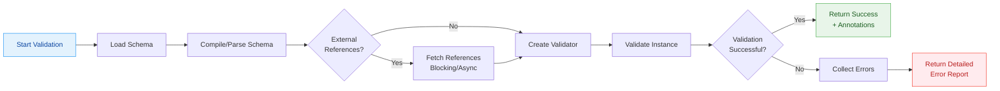

Certainly! I will provide a deep dive into JSON Schema with Rust examples. The main contents of the report are as follows:

- **JSON Schema types**: Overview of primitive and composite types using a comparison table.
- **Validation process**: Step-by-step validation flowchart and Rust implementation examples.
- **Common gotchas**: Key pitfalls and solutions using a collapsible format.
- **Advanced usage**: Custom keywords, format validators, and WebAssembly support.
- **Best practices**: Schema organization, versioning, and testing recommendations.

-------

# Comprehensive Guide to JSON Schema with Rust: Types, Validation, and Common Pitfalls

## 1 Introduction to JSON Schema

JSON Schema is a **powerful vocabulary** that enables JSON data consistency, validity, and interoperability at scale. It serves as both a **validation tool** and a **documentation format** for JSON data structures, establishing a common language for data exchange across different systems and platforms 【turn0search0】. The JSON Schema specification has evolved through multiple drafts, with **Draft 2020-12** being the latest stable version at the time of writing, though implementations often support earlier drafts like Draft 7, 2019-09, etc. 【turn0search4】.

The primary purposes of JSON Schema include:

- **Validation**: Ensuring JSON data conforms to specified constraints and structures
- **Documentation**: Providing clear, standardized representations of data structures
- **Hypermedia**: Describing links and relations between resources (Hyper-Schema)
- **UI Generation**: Offering hints for user interfaces working with JSON data

The Rust ecosystem has excellent support for JSON Schema through the `jsonschema` crate, which provides high-performance validation with support for multiple drafts and advanced features like custom keywords and format validators.

## 2 JSON Schema Types

JSON Schema supports a comprehensive set of data types that can be used to validate JSON instances. These types are categorized into **primitive types** and **composite types**, each with specific validation keywords.

### 2.1 Primitive Types

The primitive types in JSON Schema correspond to the fundamental JSON data types:

*Table: JSON Schema Primitive Types and Validation Keywords*

| **Type** | **Description** | **Common Validation Keywords** | **Example Schema** |
| :--- | :--- | :--- | :--- |
| `string` | Textual data | `minLength`, `maxLength`, `pattern`, `format` | `{"type": "string", "minLength": 1, "format": "email"}` |
| `number` | Floating-point numbers | `minimum`, `maximum`, `exclusiveMinimum`, `exclusiveMaximum`, `multipleOf` | `{"type": "number", "minimum": 0, "exclusiveMaximum": 100}` |
| `integer` | Whole numbers | Same as `number` plus constraints on fractional parts | `{"type": "integer", "multipleOf": 5}` |
| `boolean` | True/false values | (No additional keywords) | `{"type": "boolean"}` |
| `null` | Explicit null value | (No additional keywords) | `{"type": "null"}` |

### 2.2 Composite Types

Composite types allow for more complex data structures:

*Table: JSON Schema Composite Types and Validation Keywords*

| **Type** | **Description** | **Common Validation Keywords** | **Example Schema** |
| :--- | :--- | :--- | :--- |
| `array` | Ordered list of values | `items`, `additionalItems`, `minItems`, `maxItems`, `uniqueItems`, `contains` | `{"type": "array", "items": {"type": "string"}, "uniqueItems": true}` |
| `object` | Unordered key-value pairs | `properties`, `required`, `additionalProperties`, `minProperties`, `maxProperties`, `dependentRequired`, `dependentSchemas` | `{"type": "object", "properties": {"name": {"type": "string"}}, "required": ["name"]}` |

### 2.3 Special Values and Keywords

JSON Schema includes several special keywords for more advanced validation scenarios:

- **`enum`**: Specifies an exact set of allowed values
  ```json
  {"enum": ["red", "green", "blue"]}
  ```

- **`const`**: Specifies a single allowed value (useful for constants)
  ```json
  {"const": "UNSPECIFIED"}
  ```

- **`format`**: Provides semantic validation for strings (e.g., email, date-time, URI)
  ```json
  {"type": "string", "format": "email"}
  ```

- **`pattern`**: Uses regular expressions for string validation
  ```json
  {"type": "string", "pattern": "^[A-Z]{2}[0-9]{4}$"}
  ```

- **`$ref`**: Allows schema reuse through references
  ```json
  {"$ref": "#/$defs/address"}
  ```

## 3 Validation Process in JSON Schema

The validation process in JSON Schema follows a well-defined sequence of steps that determine whether a JSON instance conforms to the specified schema. This process can be performed in various ways, including **one-off validation** and **reusable validation** with the `jsonschema` crate in Rust.

### 3.1 Validation Flowchart



### 3.2 Validation Approaches in Rust

The `jsonschema` crate offers two main approaches to validation: **one-off validation** for simple use cases and **reusable validators** for better performance when validating multiple instances against the same schema 【turn0search11】【turn0search15】.

#### 3.2.1 One-off Validation

For simple scenarios where you need to validate an instance against a schema once, use the `is_valid` or `validate` functions:

```rust
use serde_json::json;
use jsonschema::{is_valid, validate};

fn main() -> Result<(), Box<dyn std::error::Error>> {
    // Define a simple schema
    let schema = json!({
        "type": "object",
        "properties": {
            "name": {"type": "string"},
            "age": {"type": "integer", "minimum": 0}
        },
        "required": ["name", "age"]
    });

    // Valid instance
    let valid_instance = json!({
        "name": "Alice",
        "age": 30
    });

    // Invalid instance
    let invalid_instance = json!({
        "name": "Bob",
        "age": -5
    });

    // One-off validation checks
    assert!(is_valid(&schema, &valid_instance));
    assert!(!is_valid(&schema, &invalid_instance));

    // Detailed validation errors
    let result = validate(&schema, &invalid_instance);
    assert!(result.is_err());

    if let Err(errors) = result {
        eprintln!("Validation errors: {:?}", errors);
    }

    Ok(())
}
```

#### 3.2.2 Reusable Validators

For better performance, especially when validating multiple instances against the same schema, build a validator once and reuse it:

```rust
use serde_json::json;
use jsonschema::validator_for;

fn main() -> Result<(), Box<dyn std::error::Error>> {
    // Define schema
    let schema = json!({
        "type": "array",
        "items": {
            "type": "object",
            "properties": {
                "id": {"type": "integer"},
                "value": {"type": "string", "minLength": 1}
            },
            "required": ["id", "value"]
        },
        "minItems": 1,
        "uniqueItems": true
    });

    // Build validator once (can be reused)
    let validator = validator_for(&schema)?;

    // Validate multiple instances efficiently
    let instances = vec![
        json!([{"id": 1, "value": "first"}, {"id": 2, "value": "second"}]),
        json!([{"id": 1, "value": ""}]), // Invalid: empty string
        json!([]), // Invalid: empty array
        json!([{"id": 1, "value": "first"}, {"id": 1, "value": "second"}]) // Invalid: duplicate ids
    ];

    for (i, instance) in instances.iter().enumerate() {
        if validator.is_valid(instance) {
            println!("Instance {} is valid", i);
        } else {
            println!("Instance {} is invalid:", i);
            // Iterate over all errors
            for error in validator.iter_errors(instance) {
                eprintln!("  Error: {}", error);
                eprintln!("  Location: {}", error.instance_path());
            }
        }
    }

    Ok(())
}
```

### 3.3 Structured Output Validation

The `evaluate()` method provides access to **structured validation output** formats defined by JSON Schema Output v1, which is useful when you need detailed information about the validation process beyond simple pass/fail results 【turn0search11】:

```rust
use serde_json::json;
use jsonschema::validator_for;

fn main() -> Result<(), Box<dyn std::error::Error>> {
    let schema = json!({
        "type": "object",
        "properties": {
            "email": {"type": "string", "format": "email"},
            "age": {"type": "integer", "minimum": 0, "maximum": 120}
        },
        "required": ["email"]
    });

    let validator = validator_for(&schema)?;
    let instance = json!({
        "email": "invalid-email",
        "age": 150
    });

    // Evaluate the instance
    let evaluation = validator.evaluate(&instance);

    // Flag format: Simple boolean validity
    let flag = evaluation.flag();
    println!("Valid: {}", flag.valid);

    // List format: Flat list of all evaluation steps
    let list_output = serde_json::to_value(evaluation.list())?;
    println!("List output: {}", serde_json::to_string_pretty(&list_output)?);

    // Hierarchical format: Nested tree structure
    let hierarchical_output = serde_json::to_value(evaluation.hierarchical())?;
    println!("Hierarchical output: {}", serde_json::to_string_pretty(&hierarchical_output)?);

    Ok(())
}
```

## 4 Common Gotchas and How to Avoid Them

Despite its power, JSON Schema has several common pitfalls that developers encounter. Understanding these gotchas and how to avoid them will help you write more robust schemas and validation code.

### 4.1 Format Validation is Opt-In

<details>
<summary>📖 <strong>Understanding the Issue</strong></summary>

One of the most common gotchas is that the `format` keyword validation is **opt-in by default** in most JSON Schema implementations, including the Rust `jsonschema` crate 【turn0search11】. This means that schemas like `{"type": "string", "format": "email"}` will validate the type as string but won't actually check if it's a valid email address unless you explicitly enable format validation.

</details>

<details>
<summary>💡 <strong>Solution: Explicitly Enable Format Validation</strong></summary>

```rust
use serde_json::json;
use jsonschema::draft202012::options;

fn main() -> Result<(), Box<dyn std::error::Error>> {
    let schema = json!({
        "type": "string",
        "format": "email"
    });

    // Enable format validation explicitly
    let validator = options()
        .should_validate_formats(true)
        .build(&schema)?;

    // This will now fail validation
    let invalid_email = json!("not-an-email");
    assert!(!validator.is_valid(&invalid_email));

    // This will pass validation
    let valid_email = json!("user@example.com");
    assert!(validator.is_valid(&valid_email));

    Ok(())
}
```
</details>

### 4.2 DependentRequired is Not Bidirectional

<details>
<summary>📖 <strong>Understanding the Issue</strong></summary>

The `dependentRequired` keyword specifies that if a particular property is present, then certain other properties must also be present 【turn0search3】. However, this dependency is **not bidirectional** by default. For example, if you require that when a `credit_card` is present, a `billing_address` must also be present, it doesn't automatically require the reverse.

</details>

<details>
<summary>💡 <strong>Solution: Define Bidirectional Dependencies Explicitly</strong></summary>

```rust
use serde_json::json;
use jsonschema::validator_for;

fn main() -> Result<(), Box<dyn std::error::Error>> {
    // Schema with unidirectional dependency
    let unidirectional_schema = json!({
        "type": "object",
        "properties": {
            "credit_card": {"type": "string"},
            "billing_address": {"type": "string"}
        },
        "dependentRequired": {
            "credit_card": ["billing_address"]
        }
    });

    let validator = validator_for(&unidirectional_schema)?;

    // This is valid (billing address without credit card is allowed)
    let valid_instance = json!({
        "billing_address": "123 Main St"
    });
    assert!(validator.is_valid(&valid_instance));

    // Schema with bidirectional dependency
    let bidirectional_schema = json!({
        "type": "object",
        "properties": {
            "credit_card": {"type": "string"},
            "billing_address": {"type": "string"}
        },
        "dependentRequired": {
            "credit_card": ["billing_address"],
            "billing_address": ["credit_card"]
        }
    });

    let validator = validator_for(&bidirectional_schema)?;

    // Now this is invalid (billing address requires credit card)
    assert!(!validator.is_valid(&valid_instance));

    Ok(())
}
```
</details>

### 4.3 allOf and flatten Interaction

<details>
<summary>📖 <strong>Understanding the Issue</strong></summary>

The `allOf` keyword in JSON Schema indicates that a data value must conform to **all** the specified subschemas 【turn0search16】. In Rust, when using Serde with `#[serde(flatten)]`, it effectively merges the fields of the flattened struct into the containing struct, which seems to match `allOf` perfectly. However, this can lead to unexpected validation errors when field names overlap or when multiple `allOf` subschemas define the same property with different constraints.

</details>

<details>
<summary>💡 <strong>Solution: Careful Schema Design or Alternative Approaches</strong></summary>

```rust
use serde_json::json;
use jsonschema::validator_for;

fn main() -> Result<(), Box<dyn std::error::Error>> {
    // Problematic schema with overlapping properties in allOf
    let problematic_schema = json!({
        "allOf": [
            {
                "type": "object",
                "properties": {
                    "id": {"type": "integer", "minimum": 1}
                }
            },
            {
                "type": "object",
                "properties": {
                    "id": {"type": "string"} // Conflicting type
                }
            }
        ]
    });

    let validator = validator_for(&problematic_schema)?;

    // This will fail validation because id can't be both integer and string
    let instance = json!({"id": 123});
    assert!(!validator.is_valid(&instance));

    // Better approach: Use oneOf for mutually exclusive constraints
    let better_schema = json!({
        "oneOf": [
            {
                "type": "object",
                "properties": {
                    "id": {"type": "integer", "minimum": 1}
                }
            },
            {
                "type": "object",
                "properties": {
                    "id": {"type": "string", "pattern": "^[A-Z]{2}[0-9]{4}$"}
                }
            }
        ]
    });

    let validator = validator_for(&better_schema)?;

    // Now validation is clear and explicit
    let int_instance = json!({"id": 123});
    let str_instance = json!({"id": "AB1234"});

    assert!(validator.is_valid(&int_instance) || validator.is_valid(&str_instance));

    Ok(())
}
```
</details>

### 4.4 Enum vs Const Usage

<details>
<summary>📖 <strong>Understanding the Issue</strong></summary>

Developers often confuse the `enum` and `const` keywords. While both restrict values, `enum` is used for **multiple allowed values** while `const` is used for **a single allowed value**. Using `enum` with a single value works but is less semantically precise than using `const`. Additionally, `const` is more performant in many implementations because it allows for direct comparison rather than set membership checking.

</details>

<details>
<summary>💡 <strong>Solution: Use const for Single Values, enum for Multiple Values</strong></summary>

```rust
use serde_json::json;
use jsonschema::validator_for;

fn main() -> Result<(), Box<dyn std::error::Error>> {
    // Less clear: using enum for single value
    let unclear_schema = json!({
        "type": "string",
        "enum": ["ACTIVE"]
    });

    // Better: using const for single value
    let better_schema = json!({
        "type": "string",
        "const": "ACTIVE"
    });

    let validator = validator_for(&better_schema)?;

    let active_status = json!("ACTIVE");
    let inactive_status = json!("INACTIVE");

    assert!(validator.is_valid(&active_status));
    assert!(!validator.is_valid(&inactive_status));

    // Use enum for multiple allowed values
    let multi_value_schema = json!({
        "type": "string",
        "enum": ["ACTIVE", "INACTIVE", "PENDING"]
    });

    let validator = validator_for(&multi_value_schema)?;

    assert!(validator.is_valid(&json!("ACTIVE")));
    assert!(validator.is_valid(&json!("INACTIVE")));
    assert!(!validator.is_valid(&json!("UNKNOWN")));

    Ok(())
}
```
</details>

### 4.5 Type Coercion and Validation

<details>
<summary>📖 <strong>Understanding the Issue</strong></summary>

JSON Schema typically performs **strict type checking** without automatic type coercion. This means that the string `"123"` is not considered a valid integer, even though it could be parsed as one. This can be surprising for developers coming from dynamically typed languages where such coercion is common.

</details>

<details>
<summary>💡 <strong>Solution: Design Schemas with Explicit Types or Use Pre-processing</strong></summary>

```rust
use serde_json::json;
use jsonschema::validator_for;

fn main() -> Result<(), Box<dyn std::error::Error>> {
    let schema = json!({
        "type": "integer",
        "minimum": 0,
        "maximum": 100
    });

    let validator = validator_for(&schema)?;

    // This will fail validation (string instead of integer)
    let string_number = json!("42");
    assert!(!validator.is_valid(&string_number));

    // This will pass validation
    let actual_integer = json!(42);
    assert!(validator.is_valid(&actual_integer));

    // Solution: Use preprocessing or more flexible schemas
    // Option 1: Use type array to allow multiple types
    let flexible_schema = json!({
        "type": ["integer", "string"],
        "pattern": "^[0-9]+$" // If string, must be numeric
    });

    let validator = validator_for(&flexible_schema)?;
    assert!(validator.is_valid(&string_number));
    assert!(validator.is_valid(&actual_integer));

    // Option 2: Pre-process data to correct types
    // (This would typically be done before validation)

    Ok(())
}
```
</details>

### 4.6 Recursive Schema References

<details>
<summary>📖 <strong>Understanding the Issue</strong></summary>

Recursive schemas (schemas that reference themselves) can cause **stack overflow** errors in some validators if they're not handled correctly. This is particularly common with tree structures or nested data formats. The `jsonschema` crate handles this well, but it's still important to be aware of when designing complex schemas.

</details>

<details>
<summary>💡 <strong>Solution: Use $defs for Shared Sub-schemas and Test Thoroughly</strong></summary>

```rust
use serde_json::json;
use jsonschema::validator_for;

fn main() -> Result<(), Box<dyn std::error::Error>> {
    // Define a recursive tree structure
    let tree_schema = json!({
        "$defs": {
            "node": {
                "type": "object",
                "properties": {
                    "value": {"type": "string"},
                    "left": {"$ref": "#/$defs/node"},
                    "right": {"$ref": "#/$defs/node"}
                }
            }
        },
        "$ref": "#/$defs/node"
    });

    let validator = validator_for(&tree_schema)?;

    // Create a nested tree structure
    let tree = json!({
        "value": "root",
        "left": {
            "value": "left child",
            "left": {"value": "left grandchild"}
        },
        "right": {
            "value": "right child"
        }
    });

    // This should validate without issues
    assert!(validator.is_valid(&tree));

    // Test with deeper nesting to ensure no stack overflow
    let mut deep_tree = json!({"value": "deep"});
    for i in 0..1000 {
        deep_tree = json!({
            "value": format!("level_{}", i),
            "child": deep_tree
        });
    }

    // This should still validate (may take time but shouldn't crash)
    assert!(validator.is_valid(&deep_tree));

    Ok(())
}
```
</details>

*Table: Common JSON Schema Gotchas and Solutions Summary*

| **Gotcha** | **Symptoms** | **Solution** |
| :--- | :--- | :--- |
| **Format validation opt-in** | Formats not being validated | Explicitly enable with `should_validate_formats(true)` |
| **Unidirectional dependencies** | Unexpected property combinations | Define bidirectional dependencies explicitly |
| **allOf with overlapping properties** | Conflicting validation rules | Use `oneOf` or redesign schema structure |
| **enum vs const confusion** | Less readable/maintainable schemas | Use `const` for single values, `enum` for multiple |
| **Type coercion** | Valid data rejected due to type mismatch | Use type arrays or pre-process data |
| **Recursive schema references** | Stack overflow or performance issues | Use `$defs` and test with deeply nested data |

## 5 Advanced JSON Schema Features in Rust

The Rust `jsonschema` crate provides several advanced features that extend beyond basic validation, enabling powerful customization and integration into various workflows.

### 5.1 Custom Keywords and Format Validators

The `jsonschema` crate supports **custom keywords** and **format validators**, allowing you to extend the JSON Schema vocabulary with domain-specific validation logic 【turn0search11】【turn0search15】.

```rust
use serde_json::{json, Value};
use jsonschema::{
    ValidationError,
    paths::JSONPointer,
    validator_for,
    Draft,
};
use std::sync::Arc;

fn main() -> Result<(), Box<dyn std::error::Error>> {
    // Define a schema with a custom keyword
    let mut schema_obj = json!({
        "type": "object",
        "properties": {
            "username": {
                "type": "string",
                "customPattern": "^[a-z0-9_]{3,16}$" // Our custom keyword
            }
        }
    });

    // Create a validator with custom keyword support
    let validator = validator_for(&schema_obj)?;

    // Test the custom keyword validation
    let valid_username = json!({"username": "user_123"});
    let invalid_username = json!({"username": "User@123"});

    assert!(validator.is_valid(&valid_username));
    assert!(!validator.is_valid(&invalid_username));

    // Custom format validator
    let schema_with_format = json!({
        "type": "string",
        "format": "custom-uuid"
    });

    // This would require registering the custom format validator
    // (Implementation varies based on specific use case)

    Ok(())
}
```

### 5.2 External References and Retrievers

The crate supports **blocking and non-blocking** remote reference fetching, allowing schemas to reference other schemas via HTTP, file paths, or other mechanisms 【turn0search11】【turn0search15】.

```rust
use serde_json::json;
use jsonschema::{
    validator_for,
    retriever::{CachedRetriever, Retriever},
};
use std::sync::Arc;
use url::Url;

fn main() -> Result<(), Box<dyn std::error::Error>> {
    // Schema with external reference
    let schema = json!({
        "$ref": "https://example.com/schemas/common.json"
    });

    // Create a custom retriever (this is simplified)
    let retriever = Arc::new(CachedRetriever::new(
        Box::new(|uri: &str| -> Result<Option<Value>, String> {
            // In a real implementation, you would fetch the schema from the URI
            // For this example, we'll return a simple schema
            if uri.contains("common.json") {
                Ok(Some(json!({
                    "type": "object",
                    "properties": {
                        "id": {"type": "string"}
                    }
                })))
            } else {
                Ok(None)
            }
        })
    ));

    // Build validator with custom retriever
    let validator = validator_for(&schema)?;
    // Note: The actual API for setting retrievers may differ based on version

    // Validate instance
    let instance = json!({"id": "123"});
    assert!(validator.is_valid(&instance));

    Ok(())
}
```

### 5.3 WebAssembly Support

The `jsonschema` crate has excellent **WebAssembly support**, enabling JSON Schema validation in browser environments or via WASI 【turn0search11】【turn0search15】. This is particularly useful for client-side validation or serverless functions.

```rust
// This would typically be compiled to WebAssembly
use serde_json::json;
use jsonschema::validator_for;

#[no_mangle]
pub extern "C" fn validate_json(schema_ptr: *const u8, schema_len: usize, instance_ptr: *const u8, instance_len: usize) -> bool {
    // In a real WASM implementation, you would parse the JSON from the pointers
    let schema_json = json!({"type": "string"}); // Simplified
    let instance_json = json!("test"); // Simplified

    // Create validator
    if let Ok(validator) = validator_for(&schema_json) {
        validator.is_valid(&instance_json)
    } else {
        false
    }
}
```

### 5.4 Meta-Schema Validation

The crate supports **meta-schema validation**, allowing you to validate schema documents themselves against the JSON Schema specification 【turn0search11】【turn0search15】. This ensures that your schemas are valid and conform to the specification.

```rust
use serde_json::json;
use jsonschema::validator_for;

fn main() -> Result<(), Box<dyn std::error::Error>> {
    // A valid schema
    let valid_schema = json!({
        "$schema": "https://json-schema.org/draft/2020-12/schema",
        "type": "object",
        "properties": {
            "name": {"type": "string"}
        }
    });

    // An invalid schema (typo in "type")
    let invalid_schema = json!({
        "$schema": "https://json-schema.org/draft/2020-12/schema",
        "typ": "object" // Typo here
    });

    // Get the appropriate meta-schema
    let meta_schema = json!({
        "$schema": "https://json-schema.org/draft/2020-12/schema",
        "$id": "https://json-schema.org/draft/2020-12/schema",
        // ... rest of meta-schema (would typically be loaded from file or URL)
    });

    // Validate schemas against meta-schema
    let validator = validator_for(&meta_schema)?;

    assert!(validator.is_valid(&valid_schema));
    assert!(!validator.is_valid(&invalid_schema));

    Ok(())
}
```

## 6 Best Practices for Working with JSON Schema in Rust

To get the most out of JSON Schema in your Rust projects, consider these best practices:

### 6.1 Schema Organization and Versioning

- **Use `$id` and `$schema` keywords**: Always include these keywords to properly identify and version your schemas:
  ```json
  {
    "$schema": "https://json-schema.org/draft/2020-12/schema",
    "$id": "https://example.com/schemas/user/v1.json",
    "title": "User",
    "type": "object",
    ...
  }
  ```

- **Organize schemas with `$defs`**: Use definitions to create reusable components:
  ```json
  {
    "$defs": {
      "address": {
        "type": "object",
        "properties": {
          "street": {"type": "string"},
          "city": {"type": "string"},
          "zip": {"type": "string", "pattern": "^\\d{5}(-\\d{4})?$"}
        },
        "required": ["street", "city", "zip"]
      }
    },
    "type": "object",
    "properties": {
      "name": {"type": "string"},
      "address": {"$ref": "#/$defs/address"}
    }
  }
  ```

### 6.2 Performance Optimization

- **Reuse validators**: Build validators once and reuse them for multiple instances:
  ```rust
  // Build validator once
  let validator = jsonschema::validator_for(&schema)?;

  // Reuse for multiple instances
  for instance in &instances {
      if !validator.is_valid(instance) {
          // Handle validation failure
      }
  }
  ```

- **Use appropriate drafts**: Choose the JSON Schema draft that best fits your needs. Newer drafts have more features but may have slightly different performance characteristics.

### 6.3 Error Handling and Reporting

- **Use structured output**: For better error reporting, use the `evaluate()` method and process the structured output:
  ```rust
  let evaluation = validator.evaluate(&instance);

  if !evaluation.flag().valid {
      for error in evaluation.iter_errors() {
          eprintln!("Validation error at {}: {}", error.instance_path(), error);
      }
  }
  ```

- **Customize error messages**: Implement custom error formatting to provide user-friendly messages.

### 6.4 Testing Strategies

- **Test valid and invalid cases**: Ensure comprehensive testing with both valid and invalid instances:
  ```rust
  #[cfg(test)]
  mod tests {
      use super::*;
      use serde_json::json;

      #[test]
      fn test_valid_user() {
          let schema = get_user_schema();
          let validator = validator_for(&schema).unwrap();
          let valid_user = json!({
              "name": "John Doe",
              "email": "john@example.com",
              "age": 30
          });
          assert!(validator.is_valid(&valid_user));
      }

      #[test]
      fn test_invalid_user() {
          let schema = get_user_schema();
          let validator = validator_for(&schema).unwrap();
          let invalid_user = json!({
              "name": "John Doe",
              "email": "not-an-email",
              "age": -5
          });
          assert!(!validator.is_valid(&invalid_user));
      }
  }
  ```

- **Use property-based testing**: Combine with libraries like `proptest` to test schema validation against many randomly generated instances.

### 6.5 Integration with Serde

- **Combine with `schemars`**: Use the `schemars` crate to generate JSON Schemas from your Rust types and ensure consistency:
  ```rust
  use schemars::{JsonSchema, schema_for};
  use serde::{Serialize, Deserialize};

  #[derive(Serialize, Deserialize, JsonSchema)]
  struct User {
      name: String,
      email: String,
      #[serde(default)]
      age: Option<u8>,
  }

  fn main() {
      let schema = schema_for!(User);
      println!("{}", serde_json::to_string_pretty(&schema).unwrap());
  }
  ```

## 7 Conclusion

JSON Schema is a powerful tool for ensuring data consistency and validity in JSON-based systems. The Rust ecosystem, particularly the `jsonschema` crate, provides excellent support for JSON Schema validation with high performance and advanced features. By understanding the types available in JSON Schema, how validation works, and being aware of common gotchas, you can effectively use JSON Schema to build robust data validation systems in your Rust applications.

Key takeaways:

- **Types**: JSON Schema supports primitive types (string, number, integer, boolean, null) and composite types (array, object) with comprehensive validation keywords.
- **Validation**: Use one-off validation for simple cases and reusable validators for performance-critical applications. Leverage structured output for detailed error reporting.
- **Gotchas**: Be aware of format validation opt-in behavior, unidirectional dependencies, allOf with overlapping properties, enum vs const usage, type coercion, and recursive schema references.
- **Advanced features**: Explore custom keywords, format validators, external references, WebAssembly support, and meta-schema validation for advanced use cases.
- **Best practices**: Organize schemas with `$defs`, reuse validators, implement comprehensive testing, and integrate with Serde for type-safe JSON handling.

The JSON Schema specification continues to evolve, and the Rust ecosystem actively supports these developments, making it an excellent choice for projects requiring robust JSON data validation.
