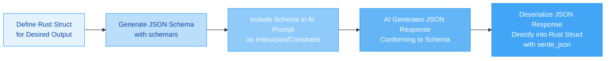

---
prompt:

---

Looking for Rust crates to ergonomically create JSON Schema definitions for AI-structured responses is a great pursuit! This approach can significantly improve the reliability of your AI integrations. Based on the search results and ecosystem knowledge, here's a comprehensive guide to the best options and how to use them.

### 🏆 Top Crate Recommendations

The Rust ecosystem offers several powerful crates for generating JSON Schemas, but for your specific use case—creating schemas from text inputs to feed to AI—**schemars** stands out as the most ergonomic and well-integrated solution.

Here's a comparison of the most relevant crates:

| Crate | Primary Use | Ergonomic Level | AI Integration | Key Feature |
| :--- | :--- | :--- | :--- | :--- |
| **[schemars](https://docs.rs/schemars/latest/schemars/)** | **Generate schemas from Rust types** | ⭐⭐⭐⭐⭐ | Excellent | Derive macro, Serde integration, customizable |
| **[jsonschema](https://docs.rs/jsonschema/latest/jsonschema/)** | **Validate JSON against schemas** | ⭐⭐⭐ | Good | High-performance validator, supports multiple drafts |
| **[serde_json](https://github.com/serde-rs/json)** | **Parse/serialize JSON** | ⭐⭐⭐⭐ | Essential | Foundation for most JSON handling in Rust |

### 🚀 Why Schemars is Your Best Choice

**schemars** is the most ergonomic and feature-rich option for generating JSON Schemas in Rust. Its primary strength lies in its **derive macro** that automatically generates schemas from your Rust struct and enum definitions, which it then serializes to JSON Schema format【turn0search0】.

#### ✨ Key Advantages for AI Use

1. **Derive Macro for Ergonomics**: Simply add `#[derive(JsonSchema)]` to your types, and `schemars` generates the schema. This is type-safe and reduces boilerplate significantly.

    ```rust
    use schemars::{JsonSchema, schema_for};
    use serde::{Serialize, Deserialize};

    #[derive(Serialize, Deserialize, JsonSchema)]
    struct StructuredResponse {
        /// The classification label (e.g., "spam", "not_spam")
        classification: String,
        /// Confidence score between 0 and 1
        confidence: f32,
        /// A short explanation for the classification
        reasoning: String,
    }

    // Generate the schema
    let schema = schema_for!(StructuredResponse);
    let schema_json = serde_json::to_string_pretty(&schema).unwrap();
    println!("{}", schema_json);
    ```

    The generated schema will include your doc comments as descriptions, which is fantastic for AI context【turn0search0】.

2. **Deep Serde Integration**: The generated schema **exactly matches** how `serde_json` would serialize your types. This is crucial because it ensures the schema you feed to the AI perfectly describes the data your Rust program will later deserialize. There's no impedance mismatch【turn0search1】.

3. **Customization via Attributes**: You can fine-tune the generated schema using attributes like `#[schemars(title = "...")]`, `#[schemars(description = "...")]`, `#[schemars(example = ...)]`, and even override Serde attributes with `#[schemars(rename = "...")]`【turn0search0】. This is perfect for providing rich hints to the AI.

4. **Support for Complex Types**: It handles enums, nested structs, option types, and collections with ease, making it suitable for defining intricate structured outputs.

#### ⚙️ Creating Schemas from "Text Inputs"

The search results and your question touch on creating schemas from text. While `schemars` excels at generating schemas from **Rust type definitions**, its most ergonomic workflow is to define your desired output structure as a Rust type first. The "text input" aspect comes into play when you:

1. **Define your schema as a Rust type** (the most ergonomic and maintainable approach).
2. **Generate the JSON Schema string** from that type using `schemars`.
3. **Use that schema string** in your prompt to the AI, instructing it to produce output that conforms to it.
4. **Deserialize the AI's JSON response** directly into your Rust type using `serde_json`.

This flow is illustrated below:



This approach is **highly ergonomic** because you define the schema once in a central, type-safe location (your Rust code), and it's used both to guide the AI and to validate/process its response.

### 🔧 Alternative: Dynamic Schema Building

If you have a truly dynamic need to build a schema from arbitrary text (e.g., a user-provided JSON Schema string), you can combine `serde_json` with `schemars`' `Schema` type:

```rust
use schemars::Schema;
use serde_json::Value;

fn build_schema_from_text(schema_text: &str) -> Result<Schema, Box<dyn std::error::Error>> {
    // Parse the text into a generic JSON Value
    let schema_value: Value = serde_json::from_str(schema_text)?;
    // Attempt to interpret it as a schemars::Schema
    let schema: Schema = serde_json::from_value(schema_value)?;
    Ok(schema)
}
```

However, this is **less ergonomic** and more error-prone than the derive macro approach, as you lose compile-time checks. It's generally better to define your schemas as Rust types whenever possible.

### 🤖 Integrating with AI Models

Once you have your schema, you need to effectively communicate it to the AI. The best practices for prompting are:

* **Use Natural Language**: Explain the structure you want in plain, human-like language in your system prompt, then provide the JSON Schema as a formal specification for the model to follow【turn0search13】.
* **Leverage Structured Output Features**: If using OpenAI's API, explore their **Structured Outputs** feature, which guarantees the model's response will adhere to your supplied JSON Schema【turn0search15】. You can pass the `schema_for!(T).into()` result directly to their API client.
* **Provide Examples**: Include `example` values in your schema via `#[schemars(example = ...)]` attributes to give the model a clearer idea of the desired output format.

### ⚠️ Important Considerations & Workarounds

1. **The `#[serde(with = "...")]` Caveat**: As noted in a GitHub issue, using `#[serde(with = "module")]` can sometimes cause compilation errors when also deriving `JsonSchema`【turn0search2】. The robust workaround is to split the attribute into separate `serialize_with` and `deserialize_with` attributes:

    ```rust
    #[derive(Serialize, Deserialize, JsonSchema)]
    pub struct MyStruct {
        #[serde(serialize_with = "module::serialize", deserialize_with = "module::deserialize")]
        pub field: ComplexType,
    }
    ```

    Alternatively, you can provide a custom schema implementation using `#[schemars(with = "CustomSchemaType")]` where `CustomSchemaType` implements `JsonSchema`【turn0search2】.

2. **Schema Draft Compliance**: `schemars` generates schemas compatible with JSON Schema Draft 7. Most AI platforms and validators support this draft or later. If you need specific features from newer drafts, you might need to post-process the generated schema or consider alternative libraries.

3. **Validation**: After receiving the AI's response, it's **crucial** to validate it against your schema. The **`jsonschema`** crate is a high-performance validator perfect for this【turn0search5】:

    ```rust
    use jsonschema::validator_for;

    // ... get schema_json from schemars and ai_response_json from the AI ...

    let validator = validator_for(&schema_json)?;
    let validation_result = validator.validate(&ai_response_json);

    if let Err(errors) = validation_result {
        eprintln!("AI response did not match schema!");
        for error in errors {
            eprintln!("Error: {}", error);
            eprintln!("Location: {}", error.instance_path());
        }
        // Handle the invalid response appropriately
    }
    ```

    This adds a critical layer of reliability to your AI integration.

### 📊 Summary: Recommended Workflow

Here is the step-by-step process I recommend for the most ergonomic and reliable AI integration:

```mermaid
flowchart LR
    A[1. Define Output Struct<br>with #[derive(JsonSchema)]<br>and serde attributes] --> B[2. Generate Schema String<br>with schema_for!]
    B --> C[3. Craft AI Prompt<br>Natural language description +<br>JSON Schema as constraint]
    C --> D[4. Call AI API<br>Prompt + Optional Structured Output feature]
    D --> E[5. Receive AI JSON Response]
    E --> F[6. Validate Response<br>with jsonschema crate]
    F -- Valid --> G[7. Deserialize to Rust Struct<br>with serde_json]
    F -- Invalid --> H[Handle Error / Retry]
```

### 💎 Final Recommendation

For a **highly ergonomic** way to create JSON Schemas to guide AI responses, **schemars** is the clear winner in the Rust ecosystem. Its derive macro provides a type-safe, low-boilerplate, and maintainable approach that integrates seamlessly with `serde_json`.

The most effective pattern is:

1. **Define** your desired output structure as a Rust `struct` or `enum`.
2. **Generate** the JSON Schema using `schemars::schema_for!`.
3. **Prompt** the AI with this schema.
4. **Validate** the AI's JSON response with `jsonschema`.
5. **Deserialize** the response into your original Rust type using `serde_json`.

This workflow gives you the best of all worlds: developer ergonomics, type safety, and reliable AI integration. The dynamic text-based schema building is possible but less ideal; start with the derive macro approach for the best experience.
