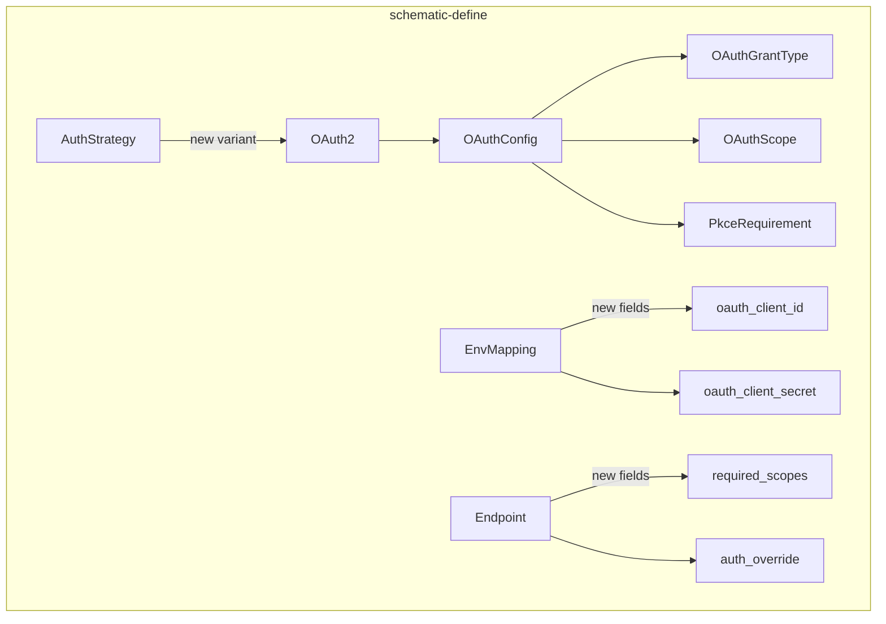
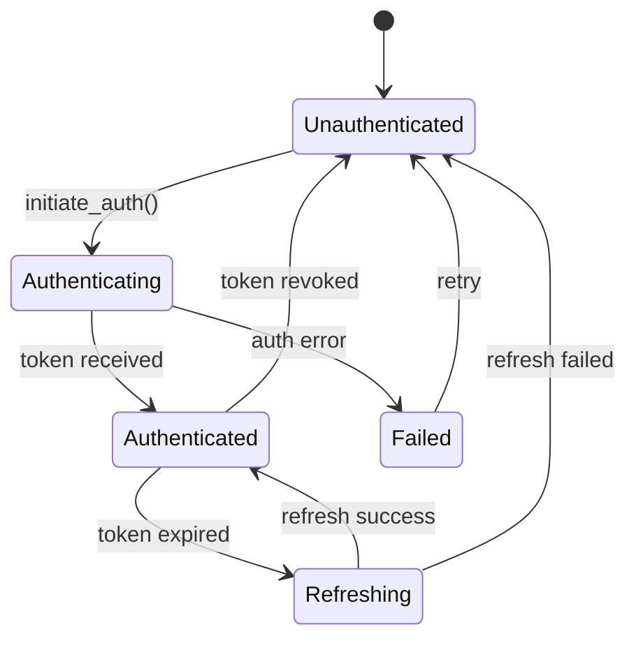
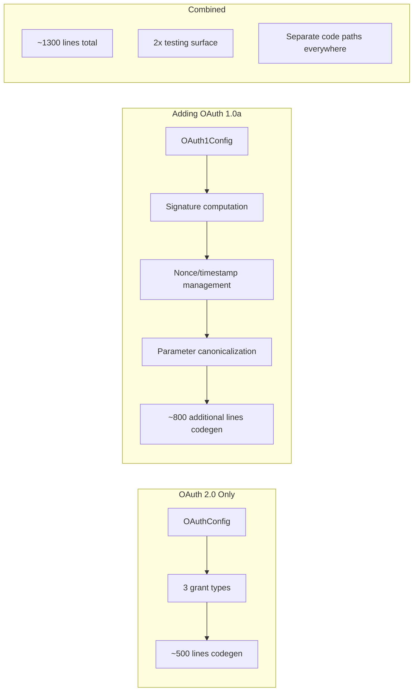

# OAuth Integration with Schematic

This document analyzes the integration points, definition patterns, code generation challenges, and version considerations for adding OAuth authentication support to the schematic ecosystem.

---

## Table of Contents

1. [Integration Points in schematic-define](#integration-points-in-schematic-define)
2. [Definition Example in schematic-definitions](#definition-example-in-schematic-definitions)
3. [Code Generation Challenges in schematic-gen](#code-generation-challenges-in-schematic-gen)
4. [OAuth 1.1 Considerations](#oauth-11-considerations)

---

## Integration Points in schematic-define

Adding OAuth to `schematic-define` touches four core areas: the `AuthStrategy` enum, a new `OAuthConfig` type, credential management via `EnvMapping`/`Headers`, and endpoint metadata.

### 1. Extending `AuthStrategy`

The existing `AuthStrategy` enum (`auth.rs`) supports static credential strategies — Bearer, ApiKey, Basic, and None. OAuth introduces a **multi-phase, stateful** authentication model that doesn't fit neatly into any of these. A new variant is needed:

```rust
#[non_exhaustive]
pub enum AuthStrategy {
    // ... existing variants ...

    /// OAuth 2.0 authentication with token lifecycle management.
    OAuth2 {
        /// Full OAuth configuration including endpoints and grant type.
        config: OAuthConfig,
    },
}
```

The key distinction: existing strategies apply credentials **per-request** with no state transitions. OAuth requires an initial token acquisition flow, followed by bearer-style requests, then periodic refresh — a three-phase lifecycle rather than a stateless credential injection.

### 2. New `OAuthConfig` Type

A dedicated configuration struct captures the OAuth-specific parameters that have no analogue in the current auth model:

```rust
#[derive(Debug, Clone, PartialEq, Eq, Serialize, Deserialize)]
pub struct OAuthConfig {
    /// The grant type determines the OAuth flow.
    pub grant_type: OAuthGrantType,

    /// Authorization endpoint URL (e.g., "https://accounts.google.com/o/oauth2/v2/auth").
    /// Required for Authorization Code and Implicit flows.
    pub authorization_url: Option<String>,

    /// Token endpoint URL (e.g., "https://oauth2.googleapis.com/token").
    /// Required for all flows except Implicit.
    pub token_url: String,

    /// Token refresh endpoint URL. Defaults to `token_url` if not specified.
    pub refresh_url: Option<String>,

    /// Scopes required by this API.
    pub scopes: Vec<OAuthScope>,

    /// Whether PKCE is required, optional, or unsupported.
    pub pkce: PkceRequirement,
}

#[derive(Debug, Clone, PartialEq, Eq, Serialize, Deserialize)]
pub enum OAuthGrantType {
    /// Server-side apps that can store secrets.
    AuthorizationCode,
    /// Machine-to-machine with no user interaction.
    ClientCredentials,
    /// Devices with limited input (smart TVs, CLIs).
    DeviceCode {
        /// Device authorization endpoint URL.
        device_authorization_url: String,
        /// Recommended polling interval in seconds.
        poll_interval: Option<u64>,
    },
}

#[derive(Debug, Clone, PartialEq, Eq, Serialize, Deserialize)]
pub struct OAuthScope {
    /// Scope identifier (e.g., "read:user", "repo").
    pub name: String,
    /// Human-readable description of what this scope grants.
    pub description: Option<String>,
}

#[derive(Debug, Clone, Copy, PartialEq, Eq, Serialize, Deserialize)]
pub enum PkceRequirement {
    /// PKCE is mandatory (OAuth 2.1 default).
    Required,
    /// Server supports PKCE but doesn't require it.
    Supported,
    /// Server does not support PKCE.
    Unsupported,
}
```

### 3. Credential Environment Mapping

The existing `EnvMapping` struct maps environment variables to credential fields (`bearer_token`, `basic_user`, `basic_pass`, `api_key`). OAuth introduces two new credential concepts: **client ID** and **client secret**.

```rust
pub struct EnvMapping {
    // ... existing fields ...

    /// Environment variable(s) for OAuth client ID.
    pub oauth_client_id: Option<EnvList>,
    /// Environment variable(s) for OAuth client secret.
    pub oauth_client_secret: Option<EnvList>,
}
```

This follows the existing pattern of sourcing credentials from environment variables with fallback chains, keeping the separation between **what credentials are needed** (defined in `OAuthConfig`) and **where they come from** (defined in `EnvMapping`).

### 4. Endpoint-Level Auth Overrides

Some APIs use OAuth for most endpoints but exempt certain public endpoints or use different scopes per endpoint. The existing `Endpoint` struct needs a way to express this:

```rust
pub struct Endpoint {
    // ... existing fields ...

    /// Scopes required specifically for this endpoint, overriding API-level scopes.
    pub required_scopes: Option<Vec<String>>,

    /// Whether this endpoint bypasses the API-level auth strategy.
    pub auth_override: Option<AuthStrategy>,
}
```

### Integration Point Summary



---

## Definition Example in schematic-definitions

The following example demonstrates how a Google Calendar API definition would use the OAuth primitives. This is a realistic scenario because Google APIs use OAuth 2.0 with Authorization Code flow, multiple scopes, and mandatory PKCE.

### Types Module

```rust
// schematic/definitions/src/google_calendar/types.rs
use schemars::JsonSchema;
use serde::{Deserialize, Serialize};

#[derive(Debug, Clone, Serialize, Deserialize, JsonSchema)]
pub struct CalendarList {
    pub kind: String,
    pub etag: String,
    pub items: Vec<CalendarListEntry>,
}

#[derive(Debug, Clone, Serialize, Deserialize, JsonSchema)]
pub struct CalendarListEntry {
    pub id: String,
    pub summary: String,
    pub description: Option<String>,
    pub time_zone: Option<String>,
    pub primary: Option<bool>,
}

#[derive(Debug, Clone, Serialize, Deserialize, JsonSchema)]
pub struct Event {
    pub id: String,
    pub summary: Option<String>,
    pub start: EventDateTime,
    pub end: EventDateTime,
    pub status: Option<String>,
}

#[derive(Debug, Clone, Serialize, Deserialize, JsonSchema)]
pub struct EventDateTime {
    pub date_time: Option<String>,
    pub date: Option<String>,
    pub time_zone: Option<String>,
}

#[derive(Debug, Clone, Serialize, Deserialize, JsonSchema)]
pub struct EventList {
    pub kind: String,
    pub items: Vec<Event>,
    pub next_page_token: Option<String>,
}

#[derive(Debug, Clone, Serialize, Deserialize, JsonSchema)]
pub struct CreateEventRequest {
    pub summary: String,
    pub start: EventDateTime,
    pub end: EventDateTime,
    pub description: Option<String>,
}
```

### Definition Module

```rust
// schematic/definitions/src/google_calendar/mod.rs
pub mod types;
pub use types::*;

use schematic_define::prelude::*;

pub fn define_google_calendar_api() -> RestApi {
    RestApi {
        name: "GoogleCalendar",
        base_url: "https://www.googleapis.com/calendar/v3",

        // OAuth 2.0 with Authorization Code flow
        auth: AuthStrategy::OAuth2 {
            config: OAuthConfig {
                grant_type: OAuthGrantType::AuthorizationCode,
                authorization_url: Some(
                    "https://accounts.google.com/o/oauth2/v2/auth".into()
                ),
                token_url: "https://oauth2.googleapis.com/token".into(),
                refresh_url: Some("https://oauth2.googleapis.com/token".into()),
                scopes: vec![
                    OAuthScope {
                        name: "https://www.googleapis.com/auth/calendar.readonly".into(),
                        description: Some("Read-only access to calendars".into()),
                    },
                    OAuthScope {
                        name: "https://www.googleapis.com/auth/calendar.events".into(),
                        description: Some("Read/write access to events".into()),
                    },
                ],
                pkce: PkceRequirement::Supported,
            },
        },

        // Client credentials from environment
        env_auth: EnvMapping {
            oauth_client_id: Some(EnvList::from(vec![
                "GOOGLE_CLIENT_ID",
            ])),
            oauth_client_secret: Some(EnvList::from(vec![
                "GOOGLE_CLIENT_SECRET",
            ])),
            ..Default::default()
        },

        headers: vec![],

        endpoints: vec![
            Endpoint {
                id: "ListCalendars",
                method: RestMethod::Get,
                path: "/users/me/calendarList",
                description: "List all calendars for the authenticated user",
                request: ApiRequest::None,
                response: ApiResponse::json_type("CalendarList"),
                params: EndpointParams::default(),
                // Uses API-level scopes (calendar.readonly suffices)
                required_scopes: Some(vec![
                    "https://www.googleapis.com/auth/calendar.readonly".into(),
                ]),
                auth_override: None,
            },
            Endpoint {
                id: "ListEvents",
                method: RestMethod::Get,
                path: "/calendars/{calendarId}/events",
                description: "List events in a calendar",
                request: ApiRequest::None,
                response: ApiResponse::json_type("EventList"),
                params: EndpointParams {
                    query: vec![
                        ParamDef::optional("timeMin", QueryParamType::String),
                        ParamDef::optional("timeMax", QueryParamType::String),
                        ParamDef::optional("maxResults", QueryParamType::Integer),
                        ParamDef::optional("pageToken", QueryParamType::String),
                    ],
                    ..Default::default()
                },
                required_scopes: Some(vec![
                    "https://www.googleapis.com/auth/calendar.readonly".into(),
                ]),
                auth_override: None,
            },
            Endpoint {
                id: "CreateEvent",
                method: RestMethod::Post,
                path: "/calendars/{calendarId}/events",
                description: "Create an event in a calendar",
                request: ApiRequest::json_type("CreateEventRequest"),
                response: ApiResponse::json_type("Event"),
                params: EndpointParams::default(),
                // Write endpoint needs the events scope
                required_scopes: Some(vec![
                    "https://www.googleapis.com/auth/calendar.events".into(),
                ]),
                auth_override: None,
            },
        ],

        models: None,
        module_path: None,
        request_suffix: None,
    }
}
```

### Key Differences from Existing Definitions

Compared to a definition like `define_openai_api()` which uses `AuthStrategy::BearerToken`:

| Aspect | BearerToken (OpenAI) | OAuth2 (Google Calendar) |
|--------|---------------------|--------------------------|
| **Credential source** | Single env var (`OPENAI_API_KEY`) | Client ID + Secret + token lifecycle |
| **Token acquisition** | User provides token directly | Generated client handles the OAuth flow |
| **Per-endpoint auth** | Uniform across all endpoints | Different scopes per endpoint |
| **Token refresh** | N/A — tokens are long-lived | Automatic refresh via refresh token |
| **First-time setup** | Set env var and go | Requires OAuth consent flow before first API call |

---

## Code Generation Challenges in schematic-gen

OAuth introduces several challenges that the current code generation pipeline (`schematic-gen`) has never needed to address. These fall into five categories: state management, token lifecycle, the authorization flow itself, error handling, and storage.

### 1. Token State Machine

Current generated clients are **stateless** — each request independently reads credentials from environment variables, constructs headers, and fires the request. OAuth clients must maintain **token state** across requests:



The generated client struct needs to hold mutable token state, likely behind an `Arc<RwLock<TokenState>>` to support concurrent requests:

```rust
// Generated output
pub struct GoogleCalendar {
    client: reqwest::Client,
    base_url: String,
    token_state: Arc<RwLock<TokenState>>,
    oauth_config: OAuthClientConfig,
}

enum TokenState {
    Unauthenticated,
    Authenticated {
        access_token: SensitiveString,
        refresh_token: Option<SensitiveString>,
        expires_at: Instant,
        scopes: Vec<String>,
    },
    Refreshing,
}
```

This is a significant departure from the current generation pattern where the client struct only holds `client: reqwest::Client` and `base_url: String`.

### 2. Authorization Flow Code Generation

For the Authorization Code grant, the generated client must orchestrate a multi-step browser-based flow. This requires generating:

- A method to construct the authorization URL with state, PKCE, and scope parameters
- A callback handler or polling mechanism to receive the authorization code
- A token exchange method that sends the code to the token endpoint

```rust
// Generated methods
impl GoogleCalendar {
    /// Generate the authorization URL for the user to visit.
    pub fn authorization_url(&self, scopes: &[&str]) -> AuthorizationUrl {
        // Returns URL + state + code_verifier for PKCE
    }

    /// Exchange an authorization code for tokens.
    pub async fn exchange_code(
        &self,
        code: &str,
        state: &str,
        code_verifier: &str,
    ) -> Result<TokenResponse, SchematicError> {
        // POST to token_url
    }
}
```

**Challenge**: The codegen currently generates a uniform `request()` method pattern. OAuth requires *prerequisite* methods that must be called before any API request can succeed. The generator needs a concept of "setup methods" distinct from "endpoint methods."

### 3. Automatic Token Refresh

Every generated endpoint method must check token validity and refresh transparently. This is middleware-like behavior that doesn't exist in the current generation:

```rust
// Current pattern (stateless)
pub async fn request<T: DeserializeOwned>(
    &self,
    req: impl Into<GoogleCalendarRequest>,
) -> Result<T, SchematicError> {
    let token = std::env::var("API_KEY")?;  // Read fresh each time
    // ... build and send request
}

// OAuth pattern (stateful, with refresh)
pub async fn request<T: DeserializeOwned>(
    &self,
    req: impl Into<GoogleCalendarRequest>,
) -> Result<T, SchematicError> {
    let token = self.ensure_valid_token().await?;  // May trigger refresh
    // ... build and send request with token
}
```

The `ensure_valid_token()` method needs to handle:
- Checking expiration with a buffer (e.g., refresh 30 seconds before expiry)
- Coordinating concurrent refresh attempts (only one refresh at a time)
- Falling back to re-authentication if refresh fails

### 4. Scope-Aware Request Validation

If endpoints declare `required_scopes`, the generated code can validate at request time whether the current token has sufficient scopes:

```rust
pub async fn create_event(&self, req: CreateEventRequest) -> Result<Event, SchematicError> {
    let token = self.ensure_valid_token().await?;

    // Compile-time or runtime scope check
    let required = &["https://www.googleapis.com/auth/calendar.events"];
    if !token.scopes_contain(required) {
        return Err(SchematicError::InsufficientScopes {
            required: required.to_vec(),
            granted: token.scopes.clone(),
        });
    }

    // ... proceed with request
}
```

This introduces a **new error variant** in the generated `SchematicError` that doesn't exist today.

### 5. Token Storage Interface

The generated client needs a way to persist tokens across process restarts. This is a new concern — current clients have no persistence layer. The generator could emit a trait that consumers implement:

```rust
/// Trait for persisting OAuth tokens between sessions.
#[async_trait]
pub trait TokenStore: Send + Sync {
    async fn load(&self) -> Result<Option<StoredTokens>, Box<dyn std::error::Error>>;
    async fn save(&self, tokens: &StoredTokens) -> Result<(), Box<dyn std::error::Error>>;
    async fn clear(&self) -> Result<(), Box<dyn std::error::Error>>;
}

/// In-memory token store (no persistence, for testing).
pub struct MemoryTokenStore { /* ... */ }

/// File-based token store (default for CLI applications).
pub struct FileTokenStore { /* ... */ }
```

**Challenge**: Should the generator emit these traits/impls, or should they live in a shared `schematic-runtime` crate? Creating a runtime crate avoids duplicating token management code across every generated OAuth client.

### Generation Impact Summary

| Component | Current | With OAuth |
|-----------|---------|------------|
| **Client struct** | 2 fields (client, base_url) | 4+ fields (+ token state, oauth config) |
| **Constructor** | `new()` reads env vars | `new()` reads env vars + loads stored tokens |
| **Request method** | Stateless credential injection | Token validation + auto-refresh wrapper |
| **Error enum** | 4 variants | 6+ variants (+ InsufficientScopes, TokenExpired, etc.) |
| **Generated files** | 1 per API | 1 per API + shared OAuth runtime |
| **Dependencies** | `reqwest`, `serde` | + `tokio::sync`, `chrono` or `std::time`, potentially `oauth2` crate |

---

## OAuth 1.1 Considerations

OAuth 1.0a (commonly referred to as "OAuth 1.1" in practice) is still used by several major APIs, notably the Twitter/X API (v1.1) and some enterprise APIs. Supporting it alongside OAuth 2.0 introduces significant additional complexity.

### Fundamental Architectural Differences

OAuth 1.0a and OAuth 2.0 are **fundamentally different protocols** despite sharing a name:

| Aspect | OAuth 1.0a | OAuth 2.0 |
|--------|-----------|-----------|
| **Security model** | Per-request cryptographic signatures | TLS + bearer tokens |
| **Request signing** | HMAC-SHA1 over canonicalized base string | None (token in header) |
| **Token types** | Request token + access token | Authorization code + access/refresh tokens |
| **Nonce tracking** | Required per request | Not required |
| **Timestamp** | Required, validated for clock skew | Not used in requests |
| **Token refresh** | Not defined — tokens may be long-lived | Explicit refresh token flow |

### Impact on schematic-define

Supporting OAuth 1.0a requires an entirely separate configuration type because the parameters don't overlap with OAuth 2.0:

```rust
pub enum AuthStrategy {
    // ... existing variants ...
    OAuth2 { config: OAuthConfig },
    OAuth1 { config: OAuth1Config },
}

#[derive(Debug, Clone, PartialEq, Eq, Serialize, Deserialize)]
pub struct OAuth1Config {
    /// Request token endpoint (Phase 1 of three-legged OAuth).
    pub request_token_url: String,
    /// User authorization endpoint.
    pub authorization_url: String,
    /// Access token endpoint (Phase 3).
    pub access_token_url: String,
    /// Signature method.
    pub signature_method: OAuth1SignatureMethod,
    /// OAuth realm parameter (optional).
    pub realm: Option<String>,
}

#[derive(Debug, Clone, Copy, PartialEq, Eq, Serialize, Deserialize)]
pub enum OAuth1SignatureMethod {
    HmacSha1,
    RsaSha1,
    Plaintext,
}
```

The `EnvMapping` would also need four credential fields for OAuth 1.0a:

- `oauth1_consumer_key` — the application's key
- `oauth1_consumer_secret` — the application's secret
- `oauth1_token` — the user's access token
- `oauth1_token_secret` — the user's token secret

### Impact on schematic-gen

OAuth 1.0a code generation is substantially harder than OAuth 2.0 because **every request** needs a cryptographic signature computed over:

1. The HTTP method (uppercase)
2. The base URL (scheme + host + path, normalized)
3. All parameters (query, body form fields, OAuth params) sorted and percent-encoded
4. A signature key derived from consumer secret + token secret

```rust
// Generated code must compute this for EVERY request
fn sign_request(
    method: &str,
    url: &str,
    params: &[(String, String)],
    consumer_secret: &str,
    token_secret: &str,
    nonce: &str,
    timestamp: u64,
) -> String {
    let base_string = format!(
        "{}&{}&{}",
        percent_encode(method),
        percent_encode(url),
        percent_encode(&normalize_params(params)),
    );
    let signing_key = format!(
        "{}&{}",
        percent_encode(consumer_secret),
        percent_encode(token_secret),
    );
    hmac_sha1(&signing_key, &base_string)
}
```

This means:
- **Every generated endpoint method** must construct and sign the OAuth 1.0a Authorization header
- The signing must account for query parameters, form body parameters, and the OAuth parameters themselves
- Nonce generation and timestamp handling are per-request concerns
- The generator needs to handle **percent encoding edge cases** that are notoriously tricky (RFC 5849 §3.6)

### Complexity Cost-Benefit Analysis



### Recommendation

**Start with OAuth 2.0 only.** The vast majority of modern APIs use OAuth 2.0, and the few remaining OAuth 1.0a APIs (primarily Twitter/X) are migrating or offering OAuth 2.0 alternatives. If OAuth 1.0a support becomes necessary:

1. **Isolate it completely** — separate `OAuth1Config`, separate codegen module, separate runtime handling
2. **Consider wrapping an existing crate** — the signature computation in OAuth 1.0a is complex enough that using the `oauth1-request` crate (which provides signing primitives) is safer than generating the signing logic from scratch
3. **Don't attempt a unified abstraction** — OAuth 1.0a and 2.0 share almost no mechanical similarities beyond the name, so a unified `OAuthConfig` would be a leaky abstraction

The incremental effort to add OAuth 1.0a later is manageable if the OAuth 2.0 implementation keeps its codegen cleanly separated from the existing `BearerToken`/`ApiKey` paths.

---

## Next Steps

1. **Prototype `OAuthConfig` in schematic-define** — add the types without modifying codegen, validate they serialize correctly
2. **Define one real OAuth 2.0 API** (e.g., Google Calendar or GitHub OAuth Apps) in schematic-definitions to stress-test the primitives
3. **Evaluate `oauth2` crate integration** — determine whether generated clients should depend on the `oauth2` crate for token exchange or implement it directly with `reqwest`
4. **Design the `TokenStore` trait** — decide whether it lives in a new `schematic-runtime` crate or is generated per-client
5. **Implement Client Credentials flow first** — it's the simplest OAuth 2.0 flow (no browser interaction) and validates the core token lifecycle

