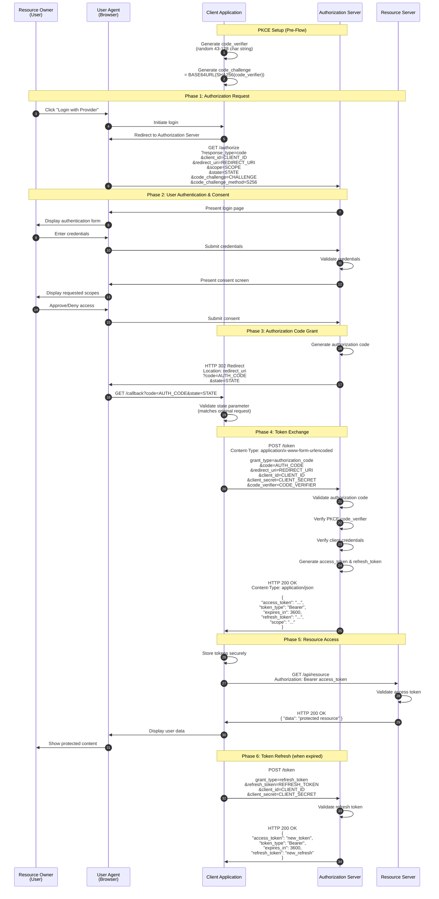

# OAuth Authentication: A Deep Dive

OAuth (Open Authorization) is an open standard for access delegation, commonly used as a way to grant websites or applications limited access to user information without exposing passwords. This document provides a comprehensive analysis of OAuth, covering its evolution, mechanics, terminology, and implementation challenges.

---

## Table of Contents

1. [OAuth Versions and Feature Distinctions](#oauth-versions-and-feature-distinctions)
2. [OAuth 2.0 Authorization Code Flow](#oauth-20-authorization-code-flow)
3. [OAuth Terminology and Vocabulary](#oauth-terminology-and-vocabulary)
4. [Common OAuth Gotchas and Solutions](#common-oauth-gotchas-and-solutions)

---

## OAuth Versions and Feature Distinctions

OAuth has evolved through several major versions, each introducing significant architectural and security improvements. Understanding these differences is crucial for developers implementing authentication systems or maintaining legacy applications.

### OAuth 1.0 (2007)

OAuth 1.0 was the initial version of the protocol, published in December 2007. It was designed to solve the problem of API access delegation without sharing user credentials. The protocol introduced the concept of "token-based delegation" which became foundational to modern authorization systems.

**Key Characteristics of OAuth 1.0:**

- **Cryptographic Signing**: Every API request required cryptographic signing using a combination of the consumer secret and token secret. This involved complex cryptographic operations including HMAC-SHA1 or RSA-SHA1 signatures, timestamp validation, and nonce tracking to prevent replay attacks.
- **Three-Legged Flow Only**: OAuth 1.0 exclusively supported the three-legged OAuth flow where a user (resource owner) explicitly authorizes a client application to access their resources. There was no concept of two-legged or client credentials flow in the original specification.
- **Web-Centric Design**: The protocol was designed primarily for web applications and did not adequately address the needs of native mobile applications, desktop clients, or devices with limited capabilities.
- **No Bearer Tokens**: OAuth 1.0 did not have the concept of bearer tokens. Each request needed to include the signature and related parameters, making implementation more complex but providing message-level security.
- **Complex Implementation**: Developers often found OAuth 1.0 challenging to implement correctly due to the intricate signature generation process, which required precise handling of parameter encoding, base string construction, and key derivation.

### OAuth 1.0a (2009)

OAuth 1.0a was a security patch released to address a session fixation vulnerability discovered in the original OAuth 1.0 protocol. While technically a minor revision, it represented an important security improvement.

**Key Improvements:**

- **Session Fixation Fix**: The verifier was changed to be returned to the client by the service provider, not passed through the user. This prevented attackers from injecting malicious request tokens into the authorization flow.
- **Callback URL Validation**: Added stricter validation of callback URLs to prevent open redirect vulnerabilities and ensure tokens were only sent to verified endpoints.
- **Enhanced Security Parameters**: Introduced additional security checks and parameter validation to strengthen the overall security posture of the protocol.

### OAuth 2.0 (2012)

OAuth 2.0 represented a complete redesign of the protocol, published as RFC 6749 in October 2012. While it retained the core concepts of OAuth 1.0, it introduced fundamental architectural changes that made it more flexible, easier to implement, and suitable for modern application architectures.

**Key Characteristics of OAuth 2.0:**

- **Transport Layer Security**: OAuth 2.0 delegates security to the transport layer (HTTPS/TLS) rather than requiring cryptographic signing of each request. This dramatically simplifies implementation but requires that all communications occur over secure channels.
- **Bearer Tokens**: Introduced the concept of bearer tokens, which function like cash—anyone who possesses the token can use it. This simplifies API calls but places greater emphasis on token protection and secure transmission.
- **Multiple Grant Types**: OAuth 2.0 defines several grant types (flows) optimized for different scenarios: Authorization Code for server-side applications, Implicit (now deprecated) for browser-based apps, Client Credentials for machine-to-machine communication, Resource Owner Password Credentials (legacy/deprecated), and Device Code for devices with limited input capabilities.
- **Refresh Tokens**: Introduced refresh tokens as a mechanism to obtain new access tokens without requiring user re-authorization, enabling long-term access with short-lived tokens.
- **Scope-Based Access**: Formalized the concept of scopes, allowing clients to request specific levels of access and authorization servers to grant limited permissions.
- **Extensibility Framework**: OAuth 2.0 was designed as a framework rather than a fixed protocol, allowing for extensions like OpenID Connect (for authentication), JWT assertions, and token binding.

### OAuth 2.1 (Draft/In Progress)

OAuth 2.1 is an ongoing effort to consolidate OAuth 2.0 best practices and security recommendations into a streamlined specification. It is not a new version but rather a refinement that removes deprecated features and mandates security best practices.

**Key Characteristics of OAuth 2.1:**

- **PKCE Required**: Proof Key for Code Exchange (PKCE) becomes mandatory for all OAuth clients, including confidential clients, providing protection against authorization code interception attacks.
- **Implicit Grant Removed**: The implicit grant flow is removed due to security concerns, with the Authorization Code Flow with PKCE being the recommended alternative for public clients.
- **Resource Owner Password Credentials Removed**: This grant type is removed as it exposes user credentials to the client application, violating the principle of credential sharing prevention.
- **Refresh Token Best Practices**: Refresh tokens must be sender-constrained or rotated on each use to prevent token theft and replay attacks.
- **Consolidated Security Requirements**: All security best practices from OAuth 2.0 Security BCP (RFC 6819) and OAuth 2.0 for Browser-Based Apps (BCP) are incorporated into the core specification.

### Comparison Table: OAuth Versions

| Feature                       | OAuth 1.0/1.0a           | OAuth 2.0            | OAuth 2.1                  |
| ----------------------------- | ------------------------ | -------------------- | -------------------------- |
| **Security Model**            | Message-level signatures | TLS + Bearer tokens  | TLS + Bearer tokens + PKCE |
| **Implementation Complexity** | High (signing required)  | Lower                | Moderate                   |
| **Mobile Support**            | Limited                  | Full                 | Full                       |
| **Grant Types**               | Single flow              | Multiple flows       | Streamlined flows          |
| **Refresh Tokens**            | Not defined              | Defined              | Defined with rotation      |
| **Bearer Tokens**             | No                       | Yes                  | Yes                        |
| **PKCE Support**              | N/A                      | Optional             | Mandatory                  |
| **Implicit Grant**            | N/A                      | Defined (deprecated) | Removed                    |
| **Password Grant**            | N/A                      | Defined (deprecated) | Removed                    |
| **Token Binding**             | N/A                      | Optional             | Recommended                |

---

## OAuth 2.0 Authorization Code Flow

The Authorization Code Flow is the most secure and widely-used OAuth 2.0 grant type. It is designed for confidential clients (server-side applications) that can securely store client secrets. This flow provides a robust mechanism for obtaining access tokens while protecting user credentials and authorization codes.

### Actors in the OAuth 2.0 Ecosystem

Before examining the flow, it is essential to understand the four primary actors defined in the OAuth 2.0 specification:

1. **Resource Owner**: The entity (typically a user) that owns the protected resources and can grant access to them. The resource owner interacts with the client application and the authorization server during the authorization process.

2. **Client**: The application making protected resource requests on behalf of the resource owner. The client can be a web application, native mobile app, or any software that needs to access protected resources.

3. **Authorization Server**: The server that issues access tokens to the client after successfully authenticating the resource owner and obtaining authorization. Popular examples include Auth0, Okta, Google Identity, and Azure AD.

4. **Resource Server**: The server hosting the protected resources. It accepts and responds to protected resource requests using access tokens. The resource server and authorization server may be the same entity or separate services.

### Authorization Code Flow Sequence Diagram

The following Mermaid sequence diagram illustrates the complete Authorization Code Flow with PKCE (Proof Key for Code Exchange), which is recommended for all modern OAuth 2.0 implementations:



### Flow Step Explanations

**Phase 1 - Authorization Request:**

The client application initiates the flow by redirecting the user's browser to the authorization server's authorization endpoint. This request includes several critical parameters: the `response_type` set to `code` indicating the Authorization Code flow, the `client_id` identifying the application, a `redirect_uri` where the authorization server will send the user after authorization, `scope` defining the requested permissions, a `state` parameter for CSRF protection, and PKCE parameters (`code_challenge` and `code_challenge_method`). The state parameter must be a random, unguessable value that the client stores to validate the callback.

**Phase 2 - User Authentication and Consent:**

The authorization server presents a login interface to the user. After successful authentication, the authorization server displays a consent screen showing the permissions being requested by the client application. The user can review these permissions and choose to approve or deny the authorization request. This step ensures that users are fully informed about what access they are granting.

**Phase 3 - Authorization Code Grant:**

Upon user approval, the authorization server generates a short-lived authorization code and redirects the user's browser back to the client's redirect URI. The authorization code is typically valid for only a few minutes and can only be used once. The state parameter is returned unchanged, allowing the client to verify that the callback matches an authorization request it initiated, preventing CSRF attacks.

**Phase 4 - Token Exchange:**

The client application exchanges the authorization code for tokens by making a direct server-to-server POST request to the authorization server's token endpoint. This request includes the authorization code, client credentials (client_id and client_secret for confidential clients), and the PKCE code_verifier. The authorization server validates all parameters, including that the code_verifier matches the code_challenge from the initial request (for PKCE). If validation succeeds, the server returns an access token, refresh token, and related metadata.

**Phase 5 - Resource Access:**

With the access token, the client can now make authenticated requests to the resource server. The access token is included in the Authorization header as a Bearer token. The resource server validates the token (typically by introspection or JWT signature verification) and, if valid, returns the requested protected resources.

**Phase 6 - Token Refresh:**

When the access token expires, the client can use the refresh token to obtain a new access token without requiring user interaction. This is done by making a POST request to the token endpoint with the grant_type set to `refresh_token`. The authorization server validates the refresh token and issues a new access token. For security, many implementations also rotate the refresh token, invalidating the previous one.

---

## OAuth Terminology and Vocabulary

OAuth introduces specific terminology that developers must understand to correctly implement and debug OAuth-based systems. The following comprehensive glossary defines all key terms in the OAuth ecosystem.

### Core Roles and Entities

| Term                     | Definition                                                   |
| ------------------------ | ------------------------------------------------------------ |
| **Resource Owner**       | An entity capable of granting access to a protected resource. When the resource owner is a person, it is referred to as an end-user. The resource owner has the authority to decide which clients may access their resources and with what scope of permissions. |
| **Client**               | An application making protected resource requests on behalf of the resource owner and with its authorization. The term "client" does not imply any particular implementation characteristics (e.g., whether the application executes on a server, a desktop, or other devices). Clients are classified as either confidential (can securely store secrets) or public (cannot securely store secrets). |
| **Authorization Server** | The server issuing access tokens to the client after successfully authenticating the resource owner and obtaining authorization. A single authorization server may issue tokens for multiple resource servers, and a resource server may accept tokens from multiple authorization servers. |
| **Resource Server**      | The server hosting the protected resources, capable of accepting and responding to protected resource requests using access tokens. The resource server validates tokens and enforces access control policies before serving protected resources. |

### Tokens

| Term                   | Definition                                                   |
| ---------------------- | ------------------------------------------------------------ |
| **Access Token**       | A credential used to access protected resources, representing an authorization granted by the resource owner to a client. Access tokens are typically short-lived (minutes to hours) and can be either opaque (random strings) or structured (JWT format). The token represents specific scopes and has associated metadata about the grant. |
| **Refresh Token**      | A credential used to obtain access tokens. Refresh tokens are issued to the client by the authorization server and are used to obtain a new access token when the current access token becomes invalid or expires. Refresh tokens are typically long-lived (days to months) and should be stored securely by the client. |
| **Authorization Code** | A short-lived, single-use credential that serves as an intermediary between the authorization request and the token exchange. The authorization code is returned to the client via the user's browser and is exchanged for tokens via a direct server-to-server request, providing security against token leakage through the browser. |
| **ID Token**           | A token (typically a JWT) that contains identity information about the user. ID Tokens are defined by OpenID Connect, not OAuth 2.0 core, but are commonly encountered in OAuth implementations that use OIDC for authentication. |
| **Bearer Token**       | A type of access token where possession of the token is sufficient proof of authorization. Anyone who possesses a bearer token can use it to access protected resources, making secure transmission and storage critical. Named by analogy to "bearer instruments" like cash or bearer bonds. |

### Grant Types (Flows)

| Term                                          | Definition                                                   |
| --------------------------------------------- | ------------------------------------------------------------ |
| **Authorization Code Grant**                  | The most secure OAuth 2.0 grant type, designed for confidential clients. The client directs the user to an authorization server, obtains an authorization code via the redirect, and exchanges the code for tokens via a direct server-to-server request. Recommended for server-side applications. |
| **Authorization Code with PKCE**              | An extension to the Authorization Code grant that adds a cryptographic challenge-response mechanism. The client generates a code_verifier and sends its hash (code_challenge) during authorization, then proves possession of the verifier during token exchange. Required in OAuth 2.1 and recommended for all clients including native and SPAs. |
| **Client Credentials Grant**                  | A grant type where the client authenticates directly with the authorization server using its own credentials (client_id and client_secret) to obtain an access token. Used for machine-to-machine communication where no user is involved. The token represents the client's own identity, not a user. |
| **Resource Owner Password Credentials Grant** | A grant type where the resource owner's username and password are exchanged directly for tokens. Deprecated in OAuth 2.1 due to security concerns about exposing credentials to the client application. Only appropriate for legacy migration scenarios where no other grant is feasible. |
| **Implicit Grant**                            | A grant type where access tokens are returned directly in the authorization redirect, without an authorization code exchange. Designed for browser-based applications but now deprecated due to token leakage risks and the inability to issue refresh tokens. Use Authorization Code with PKCE instead. |
| **Device Code Grant**                         | A grant type for devices with limited input capabilities (smart TVs, IoT devices, CLI tools). The device displays a code and URL, the user visits the URL on another device to authorize, and the device polls for token issuance. Defined in RFC 8628. |

### Security Concepts

| Term                                   | Definition                                                   |
| -------------------------------------- | ------------------------------------------------------------ |
| **Scope**                              | A string that defines the level of access requested by the client. Scopes are defined by the authorization server and resource server. Examples include "read:email", "write:files", or "openid profile". Multiple scopes are typically requested using space-delimited strings. Scopes allow for principle of least privilege access. |
| **State Parameter**                    | A parameter used to maintain state between the authorization request and callback, and to prevent CSRF attacks. The client generates a random, unguessable value for each authorization request and validates that the same value is returned in the callback. |
| **PKCE (Proof Key for Code Exchange)** | A security extension that protects authorization codes from interception attacks. Originally designed for native apps but now recommended for all OAuth clients. The client creates a code_verifier, sends its SHA256 hash (code_challenge) during authorization, and proves possession of the verifier during token exchange. Defined in RFC 7636. |
| **Nonce**                              | A random value used to prevent replay attacks. In OAuth/OpenID Connect, the nonce is included in the authorization request and returned in the ID token, allowing the client to verify freshness and prevent token replay. |
| **Client Secret**                      | A secret known only to the client and authorization server, used to authenticate the client during token requests. Only confidential clients can securely store client secrets. Public clients (SPAs, native apps) should use PKCE instead of client secrets. |
| **Token Introspection**                | An endpoint defined in RFC 7662 that allows resource servers to validate access tokens by querying the authorization server. The introspection response includes token metadata such as active status, scope, client_id, and expiration time. |
| **Token Revocation**                   | An endpoint defined in RFC 7009 that allows clients to invalidate tokens (both access tokens and refresh tokens) when they are no longer needed or suspected to be compromised. |

### Client Types

| Term                              | Definition                                                   |
| --------------------------------- | ------------------------------------------------------------ |
| **Confidential Client**           | A client capable of maintaining the confidentiality of its credentials (client secret). Typically server-side applications where the secret can be securely stored on a server. Confidential clients can use the client secret during token exchange for additional security. |
| **Public Client**                 | A client that cannot maintain the confidentiality of its credentials. This includes browser-based applications (SPAs), native mobile apps, and desktop applications where the code can be inspected or the binary can be decompiled. Public clients should use PKCE instead of client secrets. |
| **Native Application**            | A client installed and executed on the user's device (mobile apps, desktop apps). Native applications are considered public clients and must use PKCE. Custom URL schemes or claimed HTTPS schemes are used for redirect URIs. |
| **Single-Page Application (SPA)** | A JavaScript application running in a browser. SPAs are public clients and should use Authorization Code with PKCE. The Backend for Frontend (BFF) pattern is also a recommended approach for SPAs needing refresh tokens. |
| **User Agent**                    | The software used by the resource owner to interact with the client (typically a web browser). The user agent plays a role in redirect-based flows by facilitating communication between the client, authorization server, and user. |

### Endpoints

| Term                       | Definition                                                   |
| -------------------------- | ------------------------------------------------------------ |
| **Authorization Endpoint** | The endpoint used by the client to obtain authorization from the resource owner via user-agent redirection. The authorization server authenticates the user and obtains consent. Typically a GET endpoint returning an HTML page for login/consent. |
| **Token Endpoint**         | The endpoint used by the client to exchange an authorization grant (authorization code, refresh token, etc.) for an access token. This is typically a POST endpoint that requires client authentication for confidential clients. |
| **Redirect URI**           | The URI where the authorization server sends the user after authorization. The redirect URI must be pre-registered with the authorization server and must match exactly. The authorization code or error response is delivered via query parameters to this URI. |
| **JWKS Endpoint**          | The endpoint exposing the JSON Web Key Set (JWKS) containing public keys used to verify JWT signatures. Used by resource servers to validate JWT access tokens and ID tokens without needing to call the introspection endpoint. |
| **UserInfo Endpoint**      | An OpenID Connect endpoint that returns claims about the authenticated user. The client presents the access token to retrieve user profile information. Not part of core OAuth 2.0 but commonly encountered in OAuth/OIDC implementations. |

---

## Common OAuth Gotchas and Solutions

OAuth implementations are prone to security vulnerabilities and functional issues that arise from misunderstandings of the specification or inadequate attention to security details. This section identifies common pitfalls and provides practical solutions.

### 1. Authorization Code Interception and Injection

**The Problem:**

Authorization codes transmitted through the browser can be intercepted by malicious applications or through compromised redirect URIs. Attackers can inject authorization codes into victim sessions, causing the victim's client to exchange an attacker-controlled code, potentially linking the victim's account to an attacker-controlled resource owner account.

**Impact:**

- Account takeover through code injection
- Token theft through code interception
- Cross-site request forgery (CSRF) attacks

**Solutions:**

- **Implement PKCE for all clients**: PKCE (Proof Key for Code Exchange) should be mandatory for all OAuth clients, not just public clients. The code_verifier is never transmitted through the browser during the authorization phase, preventing code injection even if an attacker intercepts the authorization code.
- **Use state parameter correctly**: Generate a cryptographically random state value for each authorization request, store it in session storage, and validate it strictly on callback. The state must be unguessable and tied to the specific user session.
- **Validate redirect URIs strictly**: Authorization servers must validate that redirect URIs match pre-registered URIs exactly, including path, query parameters, and scheme. Wildcard or partial matches should be rejected.

```javascript
// Example: Correct state parameter handling
const state = crypto.randomBytes(32).toString('hex');
session.oauthState = state;

// On callback
if (req.query.state !== session.oauthState) {
  throw new Error('Invalid state parameter - possible CSRF attack');
}
```

### 2. Token Storage and Leakage

**The Problem:**

Tokens stored insecurely can be accessed by malicious scripts, browser extensions, or through XSS vulnerabilities. Bearer tokens are particularly dangerous because possession equals authorization.

**Impact:**

- Token theft leading to unauthorized resource access
- Long-lived compromise when refresh tokens are exposed
- Compliance violations (GDPR, HIPAA, etc.)

**Solutions:**

- **Never store tokens in localStorage**: localStorage is accessible to any JavaScript running on the page, making it vulnerable to XSS attacks. Use httpOnly cookies for token storage when possible.
- **Use the Backend for Frontend (BFF) pattern**: For SPAs, use a backend component that handles token exchange and storage. The SPA uses session cookies to communicate with the BFF, which holds the actual OAuth tokens.
- **Implement short token lifetimes**: Access tokens should have short lifetimes (15-60 minutes) to limit the window of opportunity if a token is compromised.
- **Use sender-constrained tokens**: Implement mechanisms like Mutual TLS (mTLS) or DPoP (Demonstrating Proof of Possession) to bind tokens to specific clients, making stolen tokens unusable by attackers.

```javascript
// Bad: Token in localStorage (vulnerable to XSS)
localStorage.setItem('access_token', token);

// Better: Use httpOnly cookies set by the server
// Server-side token exchange sets cookie:
res.cookie('access_token', accessToken, {
  httpOnly: true,
  secure: true,
  sameSite: 'strict',
  maxAge: 3600000 // 1 hour
});
```

### 3. Open Redirect Vulnerabilities

**The Problem:**

If redirect URI validation is lax, attackers can manipulate the redirect_uri parameter to redirect authorization codes or tokens to attacker-controlled URLs, especially when subdomain wildcards or permissive path matching are allowed.

**Impact:**

- Authorization code leakage to attackers
- Token leakage (in implicit flow)
- Phishing attacks using legitimate-looking OAuth flows

**Solutions:**

- **Exact redirect URI matching**: Require pre-registration of redirect URIs and validate them exactly, including scheme, host, port, path, and query parameters.
- **Avoid wildcard registrations**: Never allow wildcard characters in redirect URI registrations. Each redirect URI should be explicitly registered.
- **Use loopback addresses for native apps**: For native applications, use loopback addresses (127.0.0.1 with random ports) or claimed HTTPS schemes, not custom URL schemes that could be registered by malicious apps.

```javascript
// Authorization server redirect URI validation
function validateRedirectUri(clientId, requestedUri) {
  const registeredUris = getRegisteredUrisForClient(clientId);
  
  // Must match exactly - no partial or wildcard matching
  return registeredUris.some(uri => uri === requestedUri);
}
```

### 4. Confusing OAuth with Authentication

**The Problem:**

OAuth 2.0 is an authorization framework, not an authentication protocol. Using OAuth alone for authentication leads to security issues because access tokens don't necessarily prove identity, and different authorization servers may have different security policies.

**Impact:**

- Account impersonation through token substitution
- Lack of user identity verification
- Inconsistent identity claims across providers

**Solutions:**

- **Use OpenID Connect for authentication**: OpenID Connect (OIDC) is an identity layer built on OAuth 2.0 that provides ID tokens containing verified identity claims. OIDC adds standardized authentication flows,UserInfo endpoints, and session management.
- **Validate ID tokens properly**: Always validate the ID token signature, issuer, audience, and expiration. Never trust ID token claims without verification.
- **Don't rely on access tokens for identity**: An access token proves authorization, not identity. The user associated with an access token might not be the same user who originally authenticated.

```javascript
// Proper ID token validation
async function validateIdToken(idToken, clientId, issuer) {
  const decoded = await jwtVerify(idToken, getJwksKey);
  
  if (decoded.issuer !== issuer) {
    throw new Error('Invalid issuer');
  }
  if (!decoded.audience.includes(clientId)) {
    throw new Error('Invalid audience');
  }
  if (decoded.exp < Date.now() / 1000) {
    throw new Error('Token expired');
  }
  
  return decoded;
}
```

### 5. Refresh Token Mismanagement

**The Problem:**

Refresh tokens are long-lived credentials that, if compromised, allow attackers to obtain unlimited access tokens. Poor refresh token handling is a common security weakness in OAuth implementations.

**Impact:**

- Persistent access after initial token compromise
- No mechanism to detect or respond to token theft
- Difficulty revoking access

**Solutions:**

- **Implement refresh token rotation**: Issue a new refresh token with each access token refresh, and invalidate the previous refresh token. This detects potential token theft if a rotated token is used twice.
- **Use sender-constrained refresh tokens**: Bind refresh tokens to specific clients using mTLS client certificates or DPoP proofs.
- **Implement refresh token families**: Track refresh token families to detect and revoke all tokens in a family if theft is detected.
- **Set appropriate expirations**: Balance security and usability by setting reasonable refresh token lifetimes (days to weeks for web apps, hours for high-security applications).

```javascript
// Refresh token rotation implementation
async function refreshToken(refreshToken) {
  // Check if token is in rotation chain
  const tokenFamily = await getTokenFamily(refreshToken);
  
  if (tokenFamily.previouslyUsed) {
    // Token reuse detected - revoke entire family
    await revokeTokenFamily(tokenFamily.id);
    throw new Error('Security alert: Token reuse detected');
  }
  
  // Mark current token as used
  await markTokenAsUsed(refreshToken);
  
  // Issue new tokens
  const newAccessToken = generateAccessToken();
  const newRefreshToken = generateRefreshToken();
  
  // Link new refresh token to family
  await linkToTokenFamily(newRefreshToken, tokenFamily.id);
  
  return { accessToken: newAccessToken, refreshToken: newRefreshToken };
}
```

### 6. Inadequate Scope Validation

**The Problem:**

Clients and resource servers often fail to properly validate scopes, leading to over-privileged access or unauthorized resource access.

**Impact:**

- Privilege escalation attacks
- Unauthorized access to sensitive resources
- Non-compliance with data access policies

**Solutions:**

- **Validate scopes at resource server**: The resource server must validate that the access token includes the required scope for each operation. Never assume the client has been properly authorized.
- **Request minimal scopes**: Clients should request only the scopes needed for their immediate functionality, following the principle of least privilege.
- **Implement scope hierarchies carefully**: If implementing scope hierarchies or super-scopes, ensure the authorization server properly translates these to specific permissions.

```javascript
// Resource server scope validation
function requireScope(requiredScope) {
  return (req, res, next) => {
    const tokenScopes = req.token.scope.split(' ');
    
    if (!tokenScopes.includes(requiredScope)) {
      return res.status(403).json({
        error: 'insufficient_scope',
        error_description: `Token lacks required scope: ${requiredScope}`
      });
    }
    
    next();
  };
}
```

### 7. Missing or Insecure Token Revocation

**The Problem:**

Many OAuth implementations lack proper token revocation mechanisms, or implement them insecurely, making it difficult to respond to security incidents or user requests to revoke access.

**Impact:**

- Unable to respond to token compromise
- Unable to implement logout functionality properly
- Compliance and regulatory issues

**Solutions:**

- **Implement RFC 7009 (Token Revocation)**: Provide a revocation endpoint that accepts both access tokens and refresh tokens. The endpoint should invalidate the token and, for refresh tokens, all associated access tokens.
- **Clear tokens on logout**: When a user logs out, clear all tokens associated with their session, including calling the revocation endpoint.
- **Maintain token blacklists**: For JWT tokens that cannot be easily revoked, maintain a blacklist of revoked tokens until their natural expiration.
- **Support token introspection for revocation checking**: Use the introspection endpoint or maintain a token store that can be queried for revocation status.

### 8. CSRF in OAuth Flows

**The Problem:**

Cross-Site Request Forgery (CSRF) attacks can trick users into authorizing malicious applications or logging into attacker-controlled accounts through OAuth flows.

**Impact:**

- Account linking attacks
- Forced login to attacker accounts
- Authorization grant CSRF

**Solutions:**

- **Always use and validate state parameter**: The state parameter is the primary defense against OAuth CSRF. Generate a cryptographically random state for each request, bind it to the user's session, and validate it strictly on callback.
- **Use PKCE**: PKCE provides additional CSRF protection because the code_verifier is required to exchange the authorization code.
- **SameSite cookies**: Set SameSite=Strict or SameSite=Lax on session cookies to prevent CSRF in OAuth callbacks.

### 9. Mixing Token Types and Grant Types

**The Problem:**

Using inappropriate grant types or token types for specific application architectures leads to security vulnerabilities or functional issues.

**Impact:**

- Token leakage through inappropriate flows
- Refresh token issues in SPAs
- Scalability problems

**Solutions:**

- **Match grant type to client type**:
  - **Server-side web apps**: Authorization Code flow with client secret
  - **Single-page apps**: Authorization Code with PKCE, or BFF pattern
  - **Native/mobile apps**: Authorization Code with PKCE
  - **Machine-to-machine**: Client Credentials flow
  - **Devices with limited input**: Device Authorization flow

- **Don't use refresh tokens in browser-only SPAs**: The BFF pattern is preferred for SPAs needing refresh tokens. If tokens must be stored in the browser, consider not using refresh tokens and requiring re-authorization for long-term access.

### 10. Logging and Debugging OAuth Issues

**The Problem:**

OAuth issues can be difficult to debug due to the multiple actors and redirect-based flows. Developers often struggle to identify where problems occur.

**Impact:**

- Extended debugging sessions
- Security issues masked as configuration problems
- Poor incident response

**Solutions:**

- **Log token metadata, not tokens**: Log token IDs, expiration times, scopes, and client IDs, but never log actual token values.
- **Implement tracing**: Use correlation IDs that flow through the OAuth process to trace requests across the client, authorization server, and resource server.
- **Validate JWT claims**: For JWT tokens, decode and validate claims during debugging to understand what permissions the token carries.
- **Use OAuth debugging tools**: Tools like OAuth 2.0 Playground, JWT.io (for decoding), and authorization server logs can help identify issues.

```javascript
// Token debugging (server-side only)
function debugToken(token) {
  // Never log the actual token value
  const decoded = decodeJWT(token);
  
  console.log({
    tokenId: decoded.jti,
    subject: decoded.sub,
    audience: decoded.aud,
    issuer: decoded.iss,
    expiration: new Date(decoded.exp * 1000).toISOString(),
    issuedAt: new Date(decoded.iat * 1000).toISOString(),
    scopes: decoded.scope?.split(' ') || []
  });
}
```

---

## Summary

OAuth 2.0 has become the industry standard for API authorization, enabling secure delegated access across the modern web. While the protocol provides a robust foundation, successful implementation requires careful attention to:

1. **Version Selection**: OAuth 2.0 is the current standard, with OAuth 2.1 consolidating best practices. OAuth 1.0 is considered obsolete.

2. **Flow Selection**: The Authorization Code flow with PKCE is recommended for most scenarios, with specific flows available for machine-to-machine and device scenarios.

3. **Security Hygiene**: Implementing PKCE, proper state validation, secure token storage, and token rotation are essential for production security.

4. **Authentication vs Authorization**: Use OpenID Connect for authentication scenarios; OAuth alone is insufficient for identity verification.

5. **Ongoing Maintenance**: Regular security audits, monitoring for token anomalies, and staying current with security best practices are necessary for long-term security.

The OAuth ecosystem continues to evolve, with ongoing work on OAuth 2.1, token binding mechanisms, and new grant types for emerging use cases. Developers should monitor RFC publications and security advisories to maintain secure implementations.

---

## References and Further Reading

- [RFC 6749 - The OAuth 2.0 Authorization Framework](https://datatracker.ietf.org/doc/html/rfc6749)
- [RFC 6750 - The OAuth 2.0 Authorization Framework: Bearer Token Usage](https://datatracker.ietf.org/doc/html/rfc6750)
- [RFC 7636 - Proof Key for Code Exchange (PKCE)](https://datatracker.ietf.org/doc/html/rfc7636)
- [RFC 7009 - OAuth 2.0 Token Revocation](https://datatracker.ietf.org/doc/html/rfc7009)
- [RFC 7662 - OAuth 2.0 Token Introspection](https://datatracker.ietf.org/doc/html/rfc7662)
- [OAuth 2.0 Security Best Current Practice (BCP)](https://datatracker.ietf.org/doc/html/draft-ietf-oauth-security-topics)
- [OAuth 2.1 Draft Specification](https://datatracker.ietf.org/doc/html/draft-ietf-oauth-v2-1)
- [OpenID Connect Core Specification](https://openid.net/specs/openid-connect-core-1_0.html)
