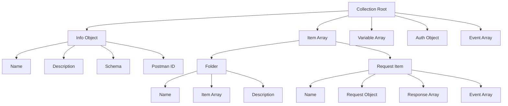
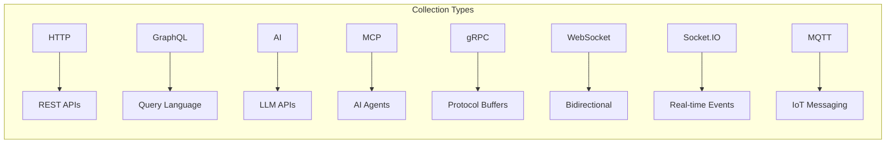
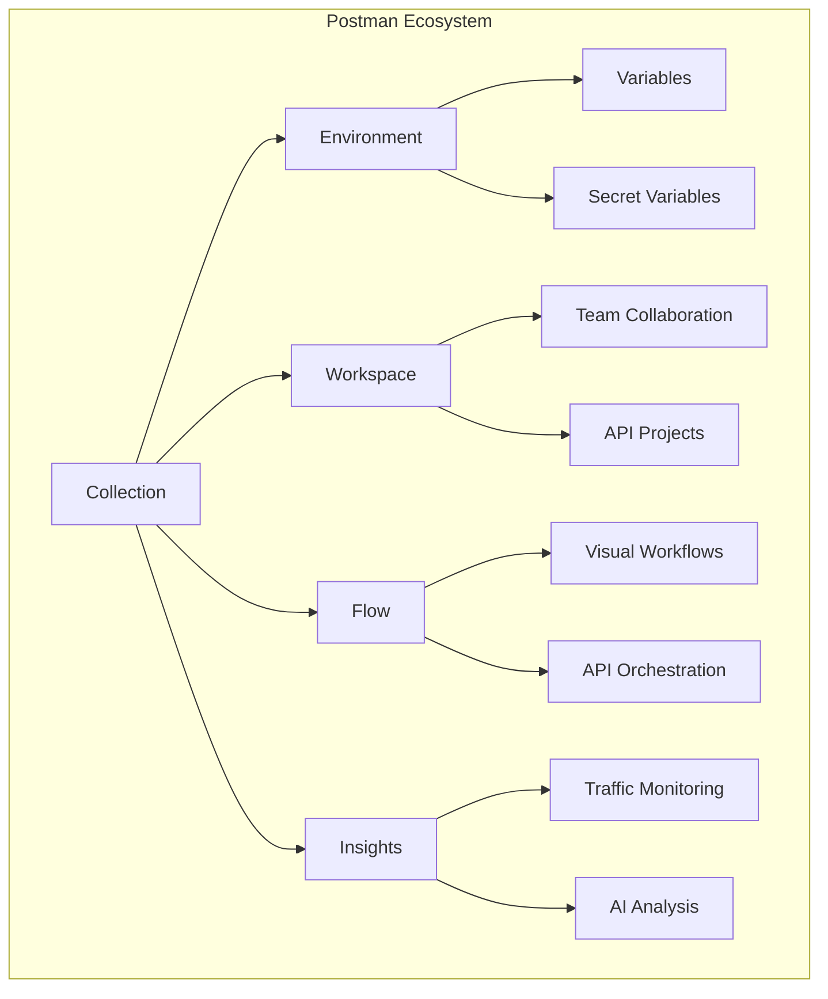
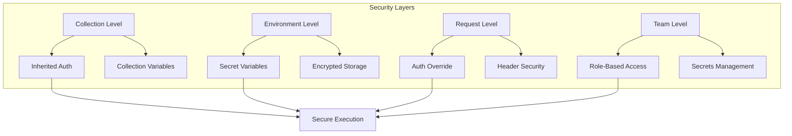
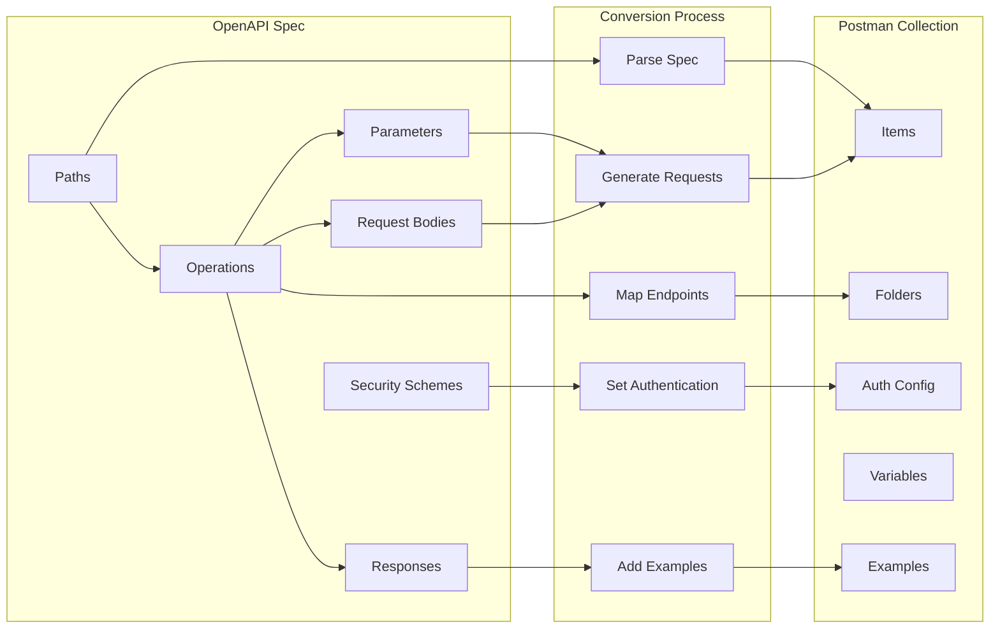
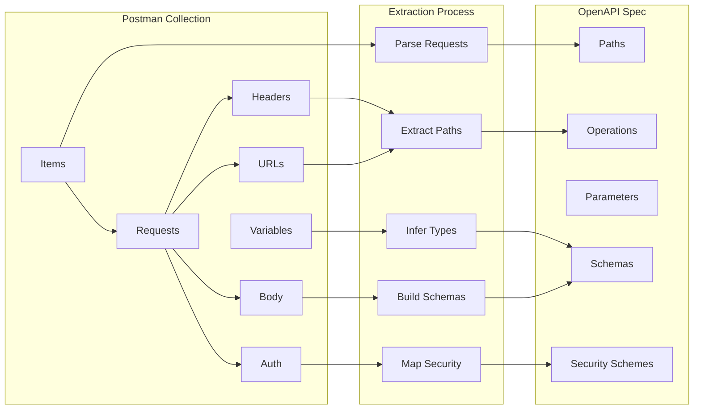

# Postman Collections: A Comprehensive Deep Dive

## Table of Contents

- [Postman Collections: A Comprehensive Deep Dive](#postman-collections-a-comprehensive-deep-dive)
  - [Table of Contents](#table-of-contents)
  - [Introduction](#introduction)
  - [Collection File Format](#collection-file-format)
    - [Schema Structure Overview](#schema-structure-overview)
    - [Core Collection Fields](#core-collection-fields)
    - [Items: The Building Blocks](#items-the-building-blocks)
    - [Request Object Structure](#request-object-structure)
    - [Complete Collection Parsing Example](#complete-collection-parsing-example)
  - [Collection Types](#collection-types)
    - [HTTP Collections](#http-collections)
    - [GraphQL Collections](#graphql-collections)
    - [AI Collections](#ai-collections)
    - [MCP Collections](#mcp-collections)
    - [gRPC Collections](#grpc-collections)
    - [WebSocket Collections](#websocket-collections)
    - [Socket.IO Collections](#socketio-collections)
    - [MQTT Collections](#mqtt-collections)
  - [Entity Interactions](#entity-interactions)
    - [Environments](#environments)
    - [Flows](#flows)
    - [Workspaces](#workspaces)
    - [Insights](#insights)
  - [Security Management](#security-management)
    - [Authentication Types](#authentication-types)
    - [Variable Security Best Practices](#variable-security-best-practices)
  - [OpenAPI to Collection Conversion](#openapi-to-collection-conversion)
    - [Conversion Process](#conversion-process)
    - [Rust Implementation](#rust-implementation)
  - [Collection to OpenAPI Conversion](#collection-to-openapi-conversion)
    - [Conversion Process](#conversion-process-1)
    - [Rust Implementation](#rust-implementation-1)
  - [Conclusion](#conclusion)
  - [References](#references)

---

## Introduction

Postman has evolved from a simple HTTP client into a comprehensive API development platform. At the heart of this platform lies the **Postman Collection**, a powerful mechanism for organizing, testing, documenting, and sharing API requests. Collections serve as the primary organizational unit within Postman, enabling developers to group related API endpoints together and manage them as a cohesive project unit. This document provides an exhaustive exploration of Postman Collections, covering their file format, the various protocol-specific collection types, their interactions with other Postman entities, security considerations, and bidirectional conversion with OpenAPI specifications.

The collection format is an open-source JSON format that enables developers to organize API requests and work seamlessly across the entire API lifecycle. From initial development through testing, documentation, and deployment, collections provide a consistent structure that can be version-controlled, shared across teams, and integrated into CI/CD pipelines. Understanding the nuances of this format is essential for any team looking to maximize their API development productivity.

---

## Collection File Format

The Postman Collection Format is defined using JSON Schema and follows a well-documented structure. The current stable version is **v2.1.0**, which is hosted at `https://schema.postman.com/json/collection/v2.1.0/collection.json`. This schema provides a comprehensive definition of how collections should be structured, including all supported fields, their types, and validation rules.

### Schema Structure Overview

A Postman collection is fundamentally a JSON object containing metadata about the collection and an array of items (requests or folders). The schema follows the Draft-07 JSON Schema specification and provides detailed documentation for each field. Understanding this structure is crucial for programmatically creating, modifying, or validating collections.



### Core Collection Fields

The collection root object contains several key fields that define the collection's identity and behavior. The `info` object provides essential metadata including the collection name, description, schema reference, and unique identifier. The `item` array contains the actual requests and folders, while the `variable` array defines collection-level variables. The `auth` object specifies default authentication settings, and the `event` array contains scripts that run at specific points in the request lifecycle.

```rust
use serde::{Deserialize, Serialize};
use serde_json::Value;

/// Represents a Postman Collection root object
#[derive(Debug, Serialize, Deserialize)]
pub struct PostmanCollection {
    /// Collection metadata
    pub info: CollectionInfo,
    /// Array of items (requests or folders)
    #[serde(default)]
    pub item: Vec<CollectionItem>,
    /// Collection-level variables
    #[serde(default, skip_serializing_if = "Vec::is_empty")]
    pub variable: Vec<Variable>,
    /// Default authentication for the collection
    #[serde(default, skip_serializing_if = "Option::is_none")]
    pub auth: Option<Auth>,
    /// Event handlers (pre-request, test scripts)
    #[serde(default, skip_serializing_if = "Vec::is_empty")]
    pub event: Vec<Event>,
}

/// Collection metadata object
#[derive(Debug, Serialize, Deserialize)]
pub struct CollectionInfo {
    /// Postman collection identifier
    #[serde(rename = "_postman_id")]
    pub postman_id: Option<String>,
    /// Collection name
    pub name: String,
    /// Collection description
    #[serde(default, skip_serializing_if = "Option::is_none")]
    pub description: Option<String>,
    /// Schema reference URL
    pub schema: String,
    /// Collection version information
    #[serde(default, skip_serializing_if = "Option::is_none")]
    pub version: Option<Version>,
}

/// Version information for collection
#[derive(Debug, Serialize, Deserialize)]
pub struct Version {
    pub major: u32,
    pub minor: u32,
    pub patch: u32,
    #[serde(default, skip_serializing_if = "Option::is_none")]
    pub identifier: Option<String>,
    #[serde(default, skip_serializing_if = "Option::is_none")]
    pub meta: Option<Value>,
}
```

### Items: The Building Blocks

Items are the fundamental unit of a Postman collection. Each item corresponds to a single API endpoint or a folder containing other items. The `item` array is recursive in nature, allowing for nested folder structures that can be organized according to logical groupings such as resource types, functional areas, or API versions.

```rust
/// Represents either a folder or a request item
#[derive(Debug, Serialize, Deserialize)]
#[serde(untagged)]
pub enum CollectionItem {
    /// A folder containing other items
    Folder(Folder),
    /// A single request item
    RequestItem(RequestItem),
}

/// A folder that can contain nested items
#[derive(Debug, Serialize, Deserialize)]
pub struct Folder {
    /// Folder name
    pub name: String,
    /// Folder description
    #[serde(default, skip_serializing_if = "Option::is_none")]
    pub description: Option<String>,
    /// Nested items (requests or sub-folders)
    #[serde(default, skip_serializing_if = "Vec::is_empty")]
    pub item: Vec<CollectionItem>,
    /// Folder-level authentication
    #[serde(default, skip_serializing_if = "Option::is_none")]
    pub auth: Option<Auth>,
    /// Folder-level events
    #[serde(default, skip_serializing_if = "Vec::is_empty")]
    pub event: Vec<Event>,
    /// Folder-level variables
    #[serde(default, skip_serializing_if = "Vec::is_empty")]
    pub variable: Vec<Variable>,
}

/// A single request item
#[derive(Debug, Serialize, Deserialize)]
pub struct RequestItem {
    /// Request name
    pub name: String,
    /// Request identifier
    #[serde(default, skip_serializing_if = "Option::is_none")]
    pub id: Option<String>,
    /// Request definition
    pub request: Request,
    /// Saved responses
    #[serde(default, skip_serializing_if = "Vec::is_empty")]
    pub response: Vec<Response>,
    /// Request-level events
    #[serde(default, skip_serializing_if = "Vec::is_empty")]
    pub event: Vec<Event>,
}
```

### Request Object Structure

The request object defines the actual API call being made. It includes the HTTP method, URL, headers, body, authentication settings, and other request parameters. The flexibility of this structure allows it to represent virtually any HTTP request, from simple GET calls to complex multipart uploads.

```rust
/// Request definition object
#[derive(Debug, Serialize, Deserialize)]
pub struct Request {
    /// HTTP method
    #[serde(default = "default_method")]
    pub method: Method,
    /// Request URL (can be string or object)
    #[serde(default, skip_serializing_if = "Option::is_none")]
    pub url: Option<Url>,
    /// Request description
    #[serde(default, skip_serializing_if = "Option::is_none")]
    pub description: Option<String>,
    /// Request headers
    #[serde(default, skip_serializing_if = "Vec::is_empty")]
    pub header: Vec<Header>,
    /// Request body
    #[serde(default, skip_serializing_if = "Option::is_none")]
    pub body: Option<Body>,
    /// Request authentication
    #[serde(default, skip_serializing_if = "Option::is_none")]
    pub auth: Option<Auth>,
    /// Query parameters
    #[serde(default, skip_serializing_if = "Option::is_none")]
    pub query: Option<Vec<QueryParam>>,
    /// Proxy settings
    #[serde(default, skip_serializing_if = "Option::is_none")]
    pub proxy: Option<Proxy>,
    /// Certificate settings
    #[serde(default, skip_serializing_if = "Option::is_none")]
    pub certificate: Option<Certificate>,
}

/// HTTP methods supported by Postman
#[derive(Debug, Serialize, Deserialize, Clone)]
#[serde(rename_all = "UPPERCASE")]
pub enum Method {
    Get,
    Post,
    Put,
    Patch,
    Delete,
    Copy,
    Head,
    Options,
    Link,
    Unlink,
    Purge,
    Lock,
    Unlock,
    Propfind,
    View,
}

fn default_method() -> Method {
    Method::Get
}
```

### Complete Collection Parsing Example

The following example demonstrates how to parse a Postman collection file and extract meaningful information from it. This Rust implementation uses serde for JSON deserialization and provides comprehensive error handling.

```rust
use std::fs;
use std::path::Path;
use serde_json;

/// Parser for Postman Collection files
pub struct CollectionParser {
    collection: PostmanCollection,
}

impl CollectionParser {
    /// Load a collection from a JSON file
    pub fn from_file<P: AsRef<Path>>(path: P) -> Result<Self, CollectionError> {
        let content = fs::read_to_string(path.as_ref())
            .map_err(|e| CollectionError::IoError(e.to_string()))?;
        
        let collection: PostmanCollection = serde_json::from_str(&content)
            .map_err(|e| CollectionError::ParseError(e.to_string()))?;
        
        Ok(Self { collection })
    }
    
    /// Load a collection from a JSON string
    pub fn from_json(json: &str) -> Result<Self, CollectionError> {
        let collection: PostmanCollection = serde_json::from_str(json)
            .map_err(|e| CollectionError::ParseError(e.to_string()))?;
        
        Ok(Self { collection })
    }
    
    /// Get collection name
    pub fn name(&self) -> &str {
        &self.collection.info.name
    }
    
    /// Get collection description
    pub fn description(&self) -> Option<&str> {
        self.collection.info.description.as_deref()
    }
    
    /// Get total count of requests in collection
    pub fn request_count(&self) -> usize {
        self.count_items(&self.collection.item)
    }
    
    /// Recursively count request items
    fn count_items(&self, items: &[CollectionItem]) -> usize {
        items.iter().map(|item| match item {
            CollectionItem::Folder(folder) => self.count_items(&folder.item),
            CollectionItem::RequestItem(_) => 1,
        }).sum()
    }
    
    /// Get all request names in the collection
    pub fn get_request_names(&self) -> Vec<String> {
        let mut names = Vec::new();
        self.collect_request_names(&self.collection.item, &mut names);
        names
    }
    
    /// Recursively collect request names
    fn collect_request_names(&self, items: &[CollectionItem], names: &mut Vec<String>) {
        for item in items {
            match item {
                CollectionItem::Folder(folder) => {
                    self.collect_request_names(&folder.item, names);
                }
                CollectionItem::RequestItem(req) => {
                    names.push(req.name.clone());
                }
            }
        }
    }
    
    /// Get collection-level variables
    pub fn variables(&self) -> &[Variable] {
        &self.collection.variable
    }
    
    /// Get collection authentication settings
    pub fn auth(&self) -> Option<&Auth> {
        self.collection.auth.as_ref()
    }
    
    /// Export collection to JSON string
    pub fn to_json(&self) -> Result<String, CollectionError> {
        serde_json::to_string_pretty(&self.collection)
            .map_err(|e| CollectionError::SerializationError(e.to_string()))
    }
    
    /// Export collection to file
    pub fn to_file<P: AsRef<Path>>(&self, path: P) -> Result<(), CollectionError> {
        let json = self.to_json()?;
        fs::write(path.as_ref(), json)
            .map_err(|e| CollectionError::IoError(e.to_string()))
    }
}

/// Error types for collection operations
#[derive(Debug)]
pub enum CollectionError {
    IoError(String),
    ParseError(String),
    SerializationError(String),
    ValidationError(String),
}

impl std::fmt::Display for CollectionError {
    fn fmt(&self, f: &mut std::fmt::Formatter<'_>) -> std::fmt::Result {
        match self {
            CollectionError::IoError(msg) => write!(f, "IO Error: {}", msg),
            CollectionError::ParseError(msg) => write!(f, "Parse Error: {}", msg),
            CollectionError::SerializationError(msg) => write!(f, "Serialization Error: {}", msg),
            CollectionError::ValidationError(msg) => write!(f, "Validation Error: {}", msg),
        }
    }
}

impl std::error::Error for CollectionError {}
```

---

## Collection Types

Postman supports multiple protocol-specific collection types, each designed to handle the unique characteristics of different API communication patterns. Understanding these variants is essential for working with diverse API architectures.



### HTTP Collections

HTTP collections represent the traditional and most widely used collection type in Postman. They are designed for testing RESTful APIs and support the full range of HTTP methods, headers, request bodies, and authentication mechanisms. HTTP collections excel at testing CRUD operations against REST endpoints and form the foundation of most API testing workflows.

**Focus and Capabilities:**

HTTP collections provide comprehensive support for REST API development and testing. They handle standard HTTP methods (GET, POST, PUT, PATCH, DELETE) with full control over request headers, query parameters, path variables, and request bodies in various formats including JSON, XML, form-data, and raw text. The collections support sophisticated authentication mechanisms including OAuth 2.0, API keys, Bearer tokens, Basic Auth, Digest Auth, and custom authentication schemes. Request chaining through variable extraction enables complex testing scenarios where subsequent requests depend on data from previous responses.

**Documentation URL:** `https://learning.postman.com/docs/sending-requests/requests/`

```rust
/// HTTP Request builder for Postman collections
pub struct HttpRequestBuilder {
    name: String,
    method: Method,
    url: Url,
    headers: Vec<Header>,
    body: Option<Body>,
    auth: Option<Auth>,
    description: Option<String>,
}

impl HttpRequestBuilder {
    /// Create a new HTTP request builder
    pub fn new(name: impl Into<String>, method: Method, url: impl Into<String>) -> Self {
        Self {
            name: name.into(),
            method,
            url: Url::String(url.into()),
            headers: Vec::new(),
            body: None,
            auth: None,
            description: None,
        }
    }
    
    /// Add a header to the request
    pub fn header(mut self, key: impl Into<String>, value: impl Into<String>) -> Self {
        self.headers.push(Header {
            key: key.into(),
            value: value.into(),
            disabled: None,
            description: None,
        });
        self
    }
    
    /// Set JSON body for the request
    pub fn json_body(mut self, json: Value) -> Self {
        self.body = Some(Body {
            mode: BodyMode::Raw,
            raw: Some(json.to_string()),
            options: Some(BodyOptions {
                raw: Some(RawOptions {
                    language: Some("json".to_string()),
                }),
            }),
            ..Default::default()
        });
        self
    }
    
    /// Set authentication for the request
    pub fn auth(mut self, auth: Auth) -> Self {
        self.auth = Some(auth);
        self
    }
    
    /// Set request description
    pub fn description(mut self, desc: impl Into<String>) -> Self {
        self.description = Some(desc.into());
        self
    }
    
    /// Build the request item
    pub fn build(self) -> RequestItem {
        RequestItem {
            name: self.name,
            id: None,
            request: Request {
                method: self.method,
                url: Some(self.url),
                description: self.description,
                header: self.headers,
                body: self.body,
                auth: self.auth,
                ..Default::default()
            },
            response: Vec::new(),
            event: Vec::new(),
        }
    }
}

/// URL representation supporting both string and structured formats
#[derive(Debug, Serialize, Deserialize, Clone)]
#[serde(untagged)]
pub enum Url {
    String(String),
    Object(UrlObject),
}

/// Structured URL object
#[derive(Debug, Serialize, Deserialize, Clone)]
pub struct UrlObject {
    #[serde(default, skip_serializing_if = "Option::is_none")]
    pub raw: Option<String>,
    #[serde(default, skip_serializing_if = "Option::is_none")]
    pub protocol: Option<String>,
    #[serde(default, skip_serializing_if = "Option::is_none")]
    pub host: Option<Vec<String>>,
    #[serde(default, skip_serializing_if = "Option::is_none")]
    pub port: Option<String>,
    #[serde(default, skip_serializing_if = "Option::is_none")]
    pub path: Option<Vec<String>>,
    #[serde(default, skip_serializing_if = "Option::is_none")]
    pub query: Option<Vec<QueryParam>>,
    #[serde(default, skip_serializing_if = "Option::is_none")]
    pub variable: Option<Vec<PathVariable>>,
}
```

### GraphQL Collections

GraphQL collections are specifically designed for testing GraphQL APIs, which use a query language for requesting exactly the data needed. Unlike REST APIs with multiple endpoints, GraphQL typically exposes a single endpoint where clients send queries and mutations.

**Focus and Capabilities:**

GraphQL collections provide specialized tooling for working with GraphQL APIs. They include a built-in GraphQL client with autocomplete support powered by schema introspection, allowing developers to explore the schema and construct queries with ease. The collections support GraphQL operations including queries for data fetching, mutations for data modification, and subscriptions for real-time data updates. Variable handling is streamlined with dedicated input sections for query variables, and the collections can automatically introspect schemas to generate documentation and type information.

**Documentation URL:** `https://learning.postman.com/docs/sending-requests/graphql/graphql-overview/`

```rust
/// GraphQL request representation
#[derive(Debug, Serialize, Deserialize)]
pub struct GraphQLRequest {
    /// The GraphQL query or mutation
    pub query: String,
    /// Operation name (for multi-operation documents)
    #[serde(default, skip_serializing_if = "Option::is_none")]
    pub operation_name: Option<String>,
    /// Query variables
    #[serde(default, skip_serializing_if = "Option::is_none")]
    pub variables: Option<Value>,
}

/// GraphQL request builder for Postman
pub struct GraphQLRequestBuilder {
    name: String,
    url: String,
    query: String,
    operation_name: Option<String>,
    variables: Option<Value>,
    headers: Vec<Header>,
}

impl GraphQLRequestBuilder {
    /// Create a new GraphQL request builder
    pub fn new(name: impl Into<String>, url: impl Into<String>) -> Self {
        Self {
            name: name.into(),
            url: url.into(),
            query: String::new(),
            operation_name: None,
            variables: None,
            headers: Vec::new(),
        }
    }
    
    /// Set the GraphQL query
    pub fn query(mut self, query: impl Into<String>) -> Self {
        self.query = query.into();
        self
    }
    
    /// Set operation name
    pub fn operation_name(mut self, name: impl Into<String>) -> Self {
        self.operation_name = Some(name.into());
        self
    }
    
    /// Set query variables
    pub fn variables(mut self, vars: Value) -> Self {
        self.variables = Some(vars);
        self
    }
    
    /// Add a header
    pub fn header(mut self, key: impl Into<String>, value: impl Into<String>) -> Self {
        self.headers.push(Header {
            key: key.into(),
            value: value.into(),
            disabled: None,
            description: None,
        });
        self
    }
    
    /// Build into a Postman request item
    pub fn build(self) -> RequestItem {
        let graphql_body = GraphQLRequest {
            query: self.query,
            operation_name: self.operation_name,
            variables: self.variables,
        };
        
        let body = Body {
            mode: BodyMode::GraphQL,
            graphql: Some(graphql_body),
            ..Default::default()
        };
        
        let mut headers = self.headers;
        headers.push(Header {
            key: "Content-Type".to_string(),
            value: "application/json".to_string(),
            disabled: None,
            description: None,
        });
        
        RequestItem {
            name: self.name,
            id: None,
            request: Request {
                method: Method::Post,
                url: Some(Url::String(self.url)),
                header: headers,
                body: Some(body),
                ..Default::default()
            },
            response: Vec::new(),
            event: Vec::new(),
        }
    }
}

/// Example usage of GraphQL request builder
pub fn create_graphql_collection_example() -> PostmanCollection {
    let query_request = GraphQLRequestBuilder::new("Get User", "https://api.example.com/graphql")
        .query(r#"
            query GetUser($id: ID!) {
                user(id: $id) {
                    id
                    name
                    email
                    posts {
                        title
                        createdAt
                    }
                }
            }
        "#)
        .variables(serde_json::json!({"id": "123"}))
        .build();
    
    let mutation_request = GraphQLRequestBuilder::new("Create User", "https://api.example.com/graphql")
        .query(r#"
            mutation CreateUser($input: CreateUserInput!) {
                createUser(input: $input) {
                    id
                    name
                    email
                }
            }
        "#)
        .operation_name("CreateUser")
        .variables(serde_json::json!({
            "input": {
                "name": "John Doe",
                "email": "john@example.com"
            }
        }))
        .build();
    
    PostmanCollection {
        info: CollectionInfo {
            postman_id: Some(uuid::Uuid::new_v4().to_string()),
            name: "GraphQL API Collection".to_string(),
            description: Some("Collection for GraphQL API testing".to_string()),
            schema: "https://schema.getpostman.com/json/collection/v2.1.0/collection.json".to_string(),
            version: None,
        },
        item: vec![
            CollectionItem::RequestItem(query_request),
            CollectionItem::RequestItem(mutation_request),
        ],
        variable: vec![],
        auth: None,
        event: vec![],
    }
}
```

### AI Collections

AI collections represent Postman's support for testing Large Language Model (LLM) APIs and AI-driven services. As AI integration becomes increasingly prevalent in applications, these collections provide specialized tooling for evaluating and testing AI model responses.

**Focus and Capabilities:**

AI collections are designed to test and evaluate LLM APIs from major providers including OpenAI, Anthropic, Google, and Cohere. They support structured prompt management, response evaluation, and comparison across different AI models. The collections enable systematic testing of AI behaviors including response quality, latency, token usage, and cost analysis. Model evaluation templates provide standardized benchmarks for comparing AI outputs, while support for streaming responses allows testing of real-time AI interactions.

**Documentation URL:** `https://learning.postman.com/docs/postman-ai/overview/`

```rust
/// AI/LLM Request representation
#[derive(Debug, Serialize, Deserialize)]
pub struct AIRequest {
    /// Model identifier
    pub model: String,
    /// Messages for chat completion
    pub messages: Vec<AIMessage>,
    /// Temperature parameter (0.0 - 2.0)
    #[serde(default, skip_serializing_if = "Option::is_none")]
    pub temperature: Option<f32>,
    /// Maximum tokens to generate
    #[serde(default, skip_serializing_if = "Option::is_none")]
    pub max_tokens: Option<u32>,
    /// Top-p sampling parameter
    #[serde(default, skip_serializing_if = "Option::is_none")]
    pub top_p: Option<f32>,
    /// Whether to stream responses
    #[serde(default, skip_serializing_if = "Option::is_none")]
    pub stream: Option<bool>,
}

/// Message in an AI conversation
#[derive(Debug, Serialize, Deserialize)]
pub struct AIMessage {
    /// Role: system, user, or assistant
    pub role: String,
    /// Message content
    pub content: String,
}

/// AI request builder for OpenAI-compatible APIs
pub struct AIRequestBuilder {
    name: String,
    provider: AIProvider,
    model: String,
    messages: Vec<AIMessage>,
    temperature: Option<f32>,
    max_tokens: Option<u32>,
    api_key: Option<String>,
}

/// Supported AI providers
#[derive(Debug, Clone)]
pub enum AIProvider {
    OpenAI,
    Anthropic,
    Google,
    Cohere,
    Custom(String),
}

impl AIProvider {
    pub fn base_url(&self) -> &str {
        match self {
            AIProvider::OpenAI => "https://api.openai.com/v1/chat/completions",
            AIProvider::Anthropic => "https://api.anthropic.com/v1/messages",
            AIProvider::Google => "https://generativelanguage.googleapis.com/v1/models",
            AIProvider::Cohere => "https://api.cohere.ai/v1/chat",
            AIProvider::Custom(url) => url,
        }
    }
    
    pub fn auth_header(&self) -> &str {
        match self {
            AIProvider::OpenAI => "Authorization",
            AIProvider::Anthropic => "x-api-key",
            AIProvider::Google => "key",
            AIProvider::Cohere => "Authorization",
            AIProvider::Custom(_) => "Authorization",
        }
    }
}

impl AIRequestBuilder {
    /// Create a new AI request builder
    pub fn new(name: impl Into<String>, provider: AIProvider, model: impl Into<String>) -> Self {
        Self {
            name: name.into(),
            provider,
            model: model.into(),
            messages: Vec::new(),
            temperature: None,
            max_tokens: None,
            api_key: None,
        }
    }
    
    /// Add a system message
    pub fn system_message(mut self, content: impl Into<String>) -> Self {
        self.messages.push(AIMessage {
            role: "system".to_string(),
            content: content.into(),
        });
        self
    }
    
    /// Add a user message
    pub fn user_message(mut self, content: impl Into<String>) -> Self {
        self.messages.push(AIMessage {
            role: "user".to_string(),
            content: content.into(),
        });
        self
    }
    
    /// Add an assistant message
    pub fn assistant_message(mut self, content: impl Into<String>) -> Self {
        self.messages.push(AIMessage {
            role: "assistant".to_string(),
            content: content.into(),
        });
        self
    }
    
    /// Set temperature
    pub fn temperature(mut self, temp: f32) -> Self {
        self.temperature = Some(temp);
        self
    }
    
    /// Set max tokens
    pub fn max_tokens(mut self, tokens: u32) -> Self {
        self.max_tokens = Some(tokens);
        self
    }
    
    /// Set API key
    pub fn api_key(mut self, key: impl Into<String>) -> Self {
        self.api_key = Some(key.into());
        self
    }
    
    /// Build into a Postman request item
    pub fn build(self) -> Result<RequestItem, CollectionError> {
        let api_key = self.api_key.ok_or_else(|| 
            CollectionError::ValidationError("API key is required".to_string())
        )?;
        
        let ai_request = AIRequest {
            model: self.model,
            messages: self.messages,
            temperature: self.temperature,
            max_tokens: self.max_tokens,
            top_p: None,
            stream: None,
        };
        
        let body = Body {
            mode: BodyMode::Raw,
            raw: Some(serde_json::to_string(&ai_request).unwrap()),
            options: Some(BodyOptions {
                raw: Some(RawOptions {
                    language: Some("json".to_string()),
                }),
            }),
            ..Default::default()
        };
        
        let auth_value = format!("Bearer {}", api_key);
        
        RequestItem {
            name: self.name,
            id: None,
            request: Request {
                method: Method::Post,
                url: Some(Url::String(self.provider.base_url().to_string())),
                header: vec![
                    Header {
                        key: "Content-Type".to_string(),
                        value: "application/json".to_string(),
                        disabled: None,
                        description: None,
                    },
                    Header {
                        key: self.provider.auth_header().to_string(),
                        value: auth_value,
                        disabled: None,
                        description: None,
                    },
                ],
                body: Some(body),
                ..Default::default()
            },
            response: Vec::new(),
            event: Vec::new(),
        }
    }
}
```

### MCP Collections

Model Context Protocol (MCP) collections represent Postman's support for the emerging MCP standard, which enables AI agents to interact with external tools and APIs in a standardized way. MCP is an open protocol that facilitates context sharing between LLMs and external systems.

**Focus and Capabilities:**

MCP collections enable testing of MCP server implementations and tool integrations. They support the MCP request/response pattern where AI agents can discover available tools, invoke them with appropriate parameters, and receive structured responses. The collections facilitate testing of tool discovery, tool invocation, resource access, and prompt handling according to the MCP specification. This is particularly valuable for teams building AI agents that need to interact with APIs through standardized interfaces.

**Documentation URL:** `https://learning.postman.com/docs/postman-ai/mcp-requests/overview/`

```rust
/// MCP Request representation
#[derive(Debug, Serialize, Deserialize)]
pub struct MCPRequest {
    /// JSON-RPC version
    pub jsonrpc: String,
    /// Request method
    pub method: String,
    /// Request parameters
    #[serde(default, skip_serializing_if = "Option::is_none")]
    pub params: Option<Value>,
    /// Request ID
    #[serde(default, skip_serializing_if = "Option::is_none")]
    pub id: Option<Value>,
}

/// MCP Tool definition
#[derive(Debug, Serialize, Deserialize)]
pub struct MCPTool {
    pub name: String,
    pub description: String,
    pub input_schema: Value,
}

/// MCP request builder
pub struct MCPRequestBuilder {
    name: String,
    server_url: String,
    method: MCPMethod,
    params: Option<Value>,
}

/// MCP method types
#[derive(Debug, Clone)]
pub enum MCPMethod {
    Initialize,
    ListTools,
    CallTool,
    ListResources,
    ReadResource,
    ListPrompts,
    GetPrompt,
    Custom(String),
}

impl MCPMethod {
    pub fn as_str(&self) -> &str {
        match self {
            MCPMethod::Initialize => "initialize",
            MCPMethod::ListTools => "tools/list",
            MCPMethod::CallTool => "tools/call",
            MCPMethod::ListResources => "resources/list",
            MCPMethod::ReadResource => "resources/read",
            MCPMethod::ListPrompts => "prompts/list",
            MCPMethod::GetPrompt => "prompts/get",
            MCPMethod::Custom(s) => s,
        }
    }
}

impl MCPRequestBuilder {
    /// Create a new MCP request builder
    pub fn new(name: impl Into<String>, server_url: impl Into<String>) -> Self {
        Self {
            name: name.into(),
            server_url: server_url.into(),
            method: MCPMethod::Initialize,
            params: None,
        }
    }
    
    /// Set the MCP method
    pub fn method(mut self, method: MCPMethod) -> Self {
        self.method = method;
        self
    }
    
    /// Set request parameters
    pub fn params(mut self, params: Value) -> Self {
        self.params = Some(params);
        self
    }
    
    /// Build into a Postman request item
    pub fn build(self) -> RequestItem {
        let mcp_request = MCPRequest {
            jsonrpc: "2.0".to_string(),
            method: self.method.as_str().to_string(),
            params: self.params,
            id: Some(Value::String(uuid::Uuid::new_v4().to_string())),
        };
        
        let body = Body {
            mode: BodyMode::Raw,
            raw: Some(serde_json::to_string(&mcp_request).unwrap()),
            options: Some(BodyOptions {
                raw: Some(RawOptions {
                    language: Some("json".to_string()),
                }),
            }),
            ..Default::default()
        };
        
        RequestItem {
            name: self.name,
            id: None,
            request: Request {
                method: Method::Post,
                url: Some(Url::String(self.server_url)),
                header: vec![
                    Header {
                        key: "Content-Type".to_string(),
                        value: "application/json".to_string(),
                        disabled: None,
                        description: None,
                    },
                ],
                body: Some(body),
                ..Default::default()
            },
            response: Vec::new(),
            event: Vec::new(),
        }
    }
}

/// Example: Create MCP collection for testing tools
pub fn create_mcp_collection_example() -> PostmanCollection {
    let init_request = MCPRequestBuilder::new("Initialize MCP", "http://localhost:3000/mcp")
        .method(MCPMethod::Initialize)
        .params(serde_json::json!({
            "protocolVersion": "2024-11-05",
            "capabilities": {},
            "clientInfo": {
                "name": "postman-mcp-client",
                "version": "1.0.0"
            }
        }))
        .build();
    
    let list_tools_request = MCPRequestBuilder::new("List Tools", "http://localhost:3000/mcp")
        .method(MCPMethod::ListTools)
        .build();
    
    let call_tool_request = MCPRequestBuilder::new("Call Tool", "http://localhost:3000/mcp")
        .method(MCPMethod::CallTool)
        .params(serde_json::json!({
            "name": "get_weather",
            "arguments": {
                "location": "San Francisco"
            }
        }))
        .build();
    
    PostmanCollection {
        info: CollectionInfo {
            postman_id: Some(uuid::Uuid::new_v4().to_string()),
            name: "MCP Server Collection".to_string(),
            description: Some("Collection for testing MCP server endpoints".to_string()),
            schema: "https://schema.getpostman.com/json/collection/v2.1.0/collection.json".to_string(),
            version: None,
        },
        item: vec![
            CollectionItem::RequestItem(init_request),
            CollectionItem::RequestItem(list_tools_request),
            CollectionItem::RequestItem(call_tool_request),
        ],
        variable: vec![],
        auth: None,
        event: vec![],
    }
}
```

### gRPC Collections

gRPC collections support testing of gRPC services, which use Protocol Buffers (protobuf) for efficient binary serialization and HTTP/2 for transport. gRPC is particularly popular in microservices architectures due to its performance characteristics.

**Focus and Capabilities:**

gRPC collections provide specialized tooling for gRPC API testing. They support loading and parsing .proto files to understand service definitions, including message types, service methods, and enum definitions. The collections handle all gRPC communication patterns: unary (single request/response), server streaming, client streaming, and bidirectional streaming. Reflection support enables automatic service discovery without requiring local proto files. JSON-to-protobuf conversion allows users to input data in familiar JSON format, which is then serialized to protobuf for transmission.

**Documentation URL:** `https://learning.postman.com/docs/sending-requests/grpc/grpc-request-interface/`

```rust
/// gRPC Request representation
#[derive(Debug, Serialize, Deserialize)]
pub struct GRPCRequest {
    /// Service URL
    pub url: String,
    /// Service name from proto definition
    pub service: String,
    /// Method name from proto definition
    pub method: String,
    /// Request message as JSON (converted to protobuf internally)
    pub body: Value,
    /// Whether to use TLS
    #[serde(default)]
    pub use_tls: bool,
    /// Proto file paths
    #[serde(default, skip_serializing_if = "Vec::is_empty")]
    pub proto_files: Vec<String>,
    /// Reflection enabled
    #[serde(default)]
    pub use_reflection: bool,
}

/// gRPC request builder
pub struct GRPCRequestBuilder {
    name: String,
    url: String,
    service: String,
    method: String,
    body: Value,
    use_tls: bool,
    proto_files: Vec<String>,
    use_reflection: bool,
    metadata: Vec<Header>,
}

impl GRPCRequestBuilder {
    /// Create a new gRPC request builder
    pub fn new(
        name: impl Into<String>,
        url: impl Into<String>,
        service: impl Into<String>,
        method: impl Into<String>,
    ) -> Self {
        Self {
            name: name.into(),
            url: url.into(),
            service: service.into(),
            method: method.into(),
            body: Value::Null,
            use_tls: false,
            proto_files: Vec::new(),
            use_reflection: false,
            metadata: Vec::new(),
        }
    }
    
    /// Set request body as JSON
    pub fn body(mut self, body: Value) -> Self {
        self.body = body;
        self
    }
    
    /// Enable TLS
    pub fn with_tls(mut self) -> Self {
        self.use_tls = true;
        self
    }
    
    /// Add proto file path
    pub fn proto_file(mut self, path: impl Into<String>) -> Self {
        self.proto_files.push(path.into());
        self
    }
    
    /// Enable server reflection
    pub fn with_reflection(mut self) -> Self {
        self.use_reflection = true;
        self
    }
    
    /// Add gRPC metadata (header)
    pub fn metadata(mut self, key: impl Into<String>, value: impl Into<String>) -> Self {
        self.metadata.push(Header {
            key: key.into(),
            value: value.into(),
            disabled: None,
            description: None,
        });
        self
    }
    
    /// Build into a Postman request item
    pub fn build(self) -> RequestItem {
        // Note: In actual Postman, gRPC requests have a different structure
        // This is a simplified representation
        let grpc_config = GRPCRequest {
            url: self.url,
            service: self.service,
            method: self.method,
            body: self.body,
            use_tls: self.use_tls,
            proto_files: self.proto_files,
            use_reflection: self.use_reflection,
        };
        
        let body = Body {
            mode: BodyMode::Raw,
            raw: Some(serde_json::to_string(&grpc_config).unwrap()),
            options: Some(BodyOptions {
                raw: Some(RawOptions {
                    language: Some("json".to_string()),
                }),
            }),
            ..Default::default()
        };
        
        RequestItem {
            name: self.name,
            id: None,
            request: Request {
                method: Method::Post, // Placeholder - gRPC uses HTTP/2
                url: Some(Url::String(grpc_config.url)),
                header: self.metadata,
                body: Some(body),
                ..Default::default()
            },
            response: Vec::new(),
            event: Vec::new(),
        }
    }
}

/// Example gRPC collection creation
pub fn create_grpc_collection_example() -> PostmanCollection {
    let get_user = GRPCRequestBuilder::new(
        "Get User",
        "grpc://api.example.com:9090",
        "UserService",
        "GetUser"
    )
    .body(serde_json::json!({
        "user_id": "123"
    }))
    .with_tls()
    .metadata("authorization", "Bearer token123")
    .build();
    
    let list_users = GRPCRequestBuilder::new(
        "List Users",
        "grpc://api.example.com:9090",
        "UserService",
        "ListUsers"
    )
    .body(serde_json::json!({
        "page_size": 10,
        "page_token": ""
    }))
    .with_tls()
    .with_reflection()
    .build();
    
    PostmanCollection {
        info: CollectionInfo {
            postman_id: Some(uuid::Uuid::new_v4().to_string()),
            name: "gRPC Service Collection".to_string(),
            description: Some("Collection for gRPC service testing".to_string()),
            schema: "https://schema.getpostman.com/json/collection/v2.1.0/collection.json".to_string(),
            version: None,
        },
        item: vec![
            CollectionItem::RequestItem(get_user),
            CollectionItem::RequestItem(list_users),
        ],
        variable: vec![],
        auth: None,
        event: vec![],
    }
}
```

### WebSocket Collections

WebSocket collections support testing of WebSocket APIs, which enable full-duplex communication channels over a single TCP connection. This is essential for real-time applications like chat, gaming, and live data feeds.

**Focus and Capabilities:**

WebSocket collections provide specialized tooling for testing persistent, bidirectional WebSocket connections. They support establishing connections with custom headers and subprotocols, sending and receiving messages in both text and binary formats, and managing connection lifecycle events. The collections allow saving message examples for documentation and testing purposes, enabling teams to document expected message patterns and validate server responses. Real-time message monitoring and filtering help debug complex WebSocket interactions.

**Documentation URL:** `https://learning.postman.com/docs/sending-requests/websocket/create-a-websocket-request/`

```rust
/// WebSocket request configuration
#[derive(Debug, Serialize, Deserialize)]
pub struct WebSocketConfig {
    /// WebSocket URL (ws:// or wss://)
    pub url: String,
    /// Connection headers
    #[serde(default, skip_serializing_if = "Vec::is_empty")]
    pub headers: Vec<Header>,
    /// Subprotocols
    #[serde(default, skip_serializing_if = "Vec::is_empty")]
    pub protocols: Vec<String>,
    /// Saved messages for testing
    #[serde(default, skip_serializing_if = "Vec::is_empty")]
    pub messages: Vec<WebSocketMessage>,
}

/// WebSocket message representation
#[derive(Debug, Serialize, Deserialize)]
pub struct WebSocketMessage {
    /// Message name/identifier
    pub name: String,
    /// Message content
    pub content: String,
    /// Message type: text or binary
    #[serde(rename = "type")]
    pub message_type: WebSocketMessageType,
    /// Direction: sent or received
    pub direction: MessageDirection,
}

#[derive(Debug, Serialize, Deserialize)]
#[serde(rename_all = "lowercase")]
pub enum WebSocketMessageType {
    Text,
    Binary,
}

#[derive(Debug, Serialize, Deserialize)]
#[serde(rename_all = "lowercase")]
pub enum MessageDirection {
    Sent,
    Received,
}

/// WebSocket request builder
pub struct WebSocketRequestBuilder {
    name: String,
    url: String,
    headers: Vec<Header>,
    protocols: Vec<String>,
    messages: Vec<WebSocketMessage>,
}

impl WebSocketRequestBuilder {
    /// Create a new WebSocket request builder
    pub fn new(name: impl Into<String>, url: impl Into<String>) -> Self {
        Self {
            name: name.into(),
            url: url.into(),
            headers: Vec::new(),
            protocols: Vec::new(),
            messages: Vec::new(),
        }
    }
    
    /// Add a connection header
    pub fn header(mut self, key: impl Into<String>, value: impl Into<String>) -> Self {
        self.headers.push(Header {
            key: key.into(),
            value: value.into(),
            disabled: None,
            description: None,
        });
        self
    }
    
    /// Add a subprotocol
    pub fn protocol(mut self, protocol: impl Into<String>) -> Self {
        self.protocols.push(protocol.into());
        self
    }
    
    /// Add a test message
    pub fn message(
        mut self,
        name: impl Into<String>,
        content: impl Into<String>,
        message_type: WebSocketMessageType,
        direction: MessageDirection,
    ) -> Self {
        self.messages.push(WebSocketMessage {
            name: name.into(),
            content: content.into(),
            message_type,
            direction,
        });
        self
    }
    
    /// Add a text message to send
    pub fn send_text(mut self, name: impl Into<String>, content: impl Into<String>) -> Self {
        self.message(name, content, WebSocketMessageType::Text, MessageDirection::Sent)
    }
    
    /// Build into a Postman request item
    pub fn build(self) -> RequestItem {
        let ws_config = WebSocketConfig {
            url: self.url,
            headers: self.headers,
            protocols: self.protocols,
            messages: self.messages,
        };
        
        RequestItem {
            name: self.name,
            id: None,
            request: Request {
                method: Method::Get, // Placeholder for WebSocket
                url: Some(Url::String(ws_config.url)),
                header: ws_config.headers,
                ..Default::default()
            },
            response: Vec::new(),
            event: Vec::new(),
        }
    }
}
```

### Socket.IO Collections

Socket.IO collections extend WebSocket capabilities with Socket.IO-specific features, including automatic reconnection, fallback transports, and event-based messaging.

**Focus and Capabilities:**

Socket.IO collections support testing Socket.IO servers with their event-based communication model. They handle Socket.IO's handshake process, namespace support, and room management. The collections support emitting events with data payloads, listening for specific events, and testing acknowledgment (ack) callbacks. Built-in support for Socket.IO's heartbeat mechanism ensures connection stability during testing. Multiple namespace support enables testing of complex Socket.IO server configurations.

**Documentation URL:** `https://learning.postman.com/docs/sending-requests/websocket/create-a-websocket-request/`

```rust
/// Socket.IO request configuration
#[derive(Debug, Serialize, Deserialize)]
pub struct SocketIOConfig {
    /// Socket.IO URL
    pub url: String,
    /// Namespace (default is "/")
    #[serde(default = "default_namespace")]
    pub namespace: String,
    /// Authentication payload
    #[serde(default, skip_serializing_if = "Option::is_none")]
    pub auth: Option<Value>,
    /// Events to emit
    #[serde(default, skip_serializing_if = "Vec::is_empty")]
    pub events: Vec<SocketIOEvent>,
}

fn default_namespace() -> String {
    "/".to_string()
}

/// Socket.IO event representation
#[derive(Debug, Serialize, Deserialize)]
pub struct SocketIOEvent {
    /// Event name
    pub name: String,
    /// Event data
    #[serde(default, skip_serializing_if = "Option::is_none")]
    pub data: Option<Value>,
    /// Whether to expect acknowledgment
    #[serde(default)]
    pub expect_ack: bool,
}

/// Socket.IO request builder
pub struct SocketIORequestBuilder {
    name: String,
    url: String,
    namespace: String,
    auth: Option<Value>,
    events: Vec<SocketIOEvent>,
}

impl SocketIORequestBuilder {
    /// Create a new Socket.IO request builder
    pub fn new(name: impl Into<String>, url: impl Into<String>) -> Self {
        Self {
            name: name.into(),
            url: url.into(),
            namespace: "/".to_string(),
            auth: None,
            events: Vec::new(),
        }
    }
    
    /// Set namespace
    pub fn namespace(mut self, ns: impl Into<String>) -> Self {
        self.namespace = ns.into();
        self
    }
    
    /// Set authentication payload
    pub fn auth(mut self, auth: Value) -> Self {
        self.auth = Some(auth);
        self
    }
    
    /// Add an event to emit
    pub fn emit(mut self, name: impl Into<String>, data: Value) -> Self {
        self.events.push(SocketIOEvent {
            name: name.into(),
            data: Some(data),
            expect_ack: false,
        });
        self
    }
    
    /// Add an event with acknowledgment expectation
    pub fn emit_with_ack(mut self, name: impl Into<String>, data: Value) -> Self {
        self.events.push(SocketIOEvent {
            name: name.into(),
            data: Some(data),
            expect_ack: true,
        });
        self
    }
    
    /// Build into a Postman request item
    pub fn build(self) -> RequestItem {
        let config = SocketIOConfig {
            url: self.url,
            namespace: self.namespace,
            auth: self.auth,
            events: self.events,
        };
        
        RequestItem {
            name: self.name,
            id: None,
            request: Request {
                method: Method::Get, // Placeholder
                url: Some(Url::String(config.url)),
                ..Default::default()
            },
            response: Vec::new(),
            event: Vec::new(),
        }
    }
}

/// Example Socket.IO collection
pub fn create_socketio_collection_example() -> PostmanCollection {
    let chat_connection = SocketIORequestBuilder::new(
        "Chat Connection",
        "http://localhost:3000"
    )
    .namespace("/chat")
    .auth(serde_json::json!({
        "token": "user-auth-token"
    }))
    .emit("join", serde_json::json!({
        "room": "general"
    }))
    .emit_with_ack("message", serde_json::json!({
        "text": "Hello, World!"
    }))
    .build();
    
    let notification_listener = SocketIORequestBuilder::new(
        "Notification Listener",
        "http://localhost:3000"
    )
    .namespace("/notifications")
    .build();
    
    PostmanCollection {
        info: CollectionInfo {
            postman_id: Some(uuid::Uuid::new_v4().to_string()),
            name: "Socket.IO Collection".to_string(),
            description: Some("Collection for Socket.IO testing".to_string()),
            schema: "https://schema.getpostman.com/json/collection/v2.1.0/collection.json".to_string(),
            version: None,
        },
        item: vec![
            CollectionItem::RequestItem(chat_connection),
            CollectionItem::RequestItem(notification_listener),
        ],
        variable: vec![],
        auth: None,
        event: vec![],
    }
}
```

### MQTT Collections

MQTT collections support testing of MQTT brokers, a lightweight publish/subscribe messaging protocol ideal for IoT devices and low-bandwidth environments.

**Focus and Capabilities:**

MQTT collections enable testing of MQTT brokers with support for all MQTT operations. They handle connection establishment with configurable QoS levels, keepalive settings, and clean session flags. The collections support subscribing to topics with wildcards, publishing messages with various QoS levels, and monitoring received messages. Testing features include validation of retained messages, last will and testament (LWT) configurations, and message ordering under different QoS settings. Support for MQTT 5.0 features includes user properties and reason codes.

**Documentation URL:** `https://learning.postman.com/docs/sending-requests/mqtt-client/mqtt-client-overview/`

```rust
/// MQTT request configuration
#[derive(Debug, Serialize, Deserialize)]
pub struct MQTTConfig {
    /// Broker URL
    pub url: String,
    /// Client ID
    #[serde(default, skip_serializing_if = "Option::is_none")]
    pub client_id: Option<String>,
    /// Username for authentication
    #[serde(default, skip_serializing_if = "Option::is_none")]
    pub username: Option<String>,
    /// Password for authentication
    #[serde(default, skip_serializing_if = "Option::is_none")]
    pub password: Option<String>,
    /// Keep alive interval in seconds
    #[serde(default = "default_keep_alive")]
    pub keep_alive: u16,
    /// Clean session flag
    #[serde(default = "default_true")]
    pub clean_session: bool,
    /// Subscriptions
    #[serde(default, skip_serializing_if = "Vec::is_empty")]
    pub subscriptions: Vec<MQTTSubscription>,
    /// Publications
    #[serde(default, skip_serializing_if = "Vec::is_empty")]
    pub publications: Vec<MQTTPublication>,
    /// Last Will and Testament
    #[serde(default, skip_serializing_if = "Option::is_none")]
    pub last_will: Option<MQTTLastWill>,
}

fn default_keep_alive() -> u16 { 60 }
fn default_true() -> bool { true }

/// MQTT subscription
#[derive(Debug, Serialize, Deserialize)]
pub struct MQTTSubscription {
    /// Topic to subscribe to (supports wildcards)
    pub topic: String,
    /// Quality of Service level
    #[serde(default)]
    pub qos: QoS,
}

/// MQTT publication
#[derive(Debug, Serialize, Deserialize)]
pub struct MQTTPublication {
    /// Topic to publish to
    pub topic: String,
    /// Message payload
    pub payload: String,
    /// Quality of Service level
    #[serde(default)]
    pub qos: QoS,
    /// Retain flag
    #[serde(default)]
    pub retain: bool,
}

/// MQTT Last Will and Testament
#[derive(Debug, Serialize, Deserialize)]
pub struct MQTTLastWill {
    pub topic: String,
    pub payload: String,
    pub qos: QoS,
    pub retain: bool,
}

/// Quality of Service levels
#[derive(Debug, Serialize, Deserialize, Clone, Copy, Default)]
#[serde(rename_all = "lowercase")]
pub enum QoS {
    #[default]
    AtMostOnce = 0,
    AtLeastOnce = 1,
    ExactlyOnce = 2,
}

/// MQTT request builder
pub struct MQTTRequestBuilder {
    name: String,
    url: String,
    client_id: Option<String>,
    username: Option<String>,
    password: Option<String>,
    subscriptions: Vec<MQTTSubscription>,
    publications: Vec<MQTTPublication>,
}

impl MQTTRequestBuilder {
    /// Create a new MQTT request builder
    pub fn new(name: impl Into<String>, url: impl Into<String>) -> Self {
        Self {
            name: name.into(),
            url: url.into(),
            client_id: None,
            username: None,
            password: None,
            subscriptions: Vec::new(),
            publications: Vec::new(),
        }
    }
    
    /// Set client ID
    pub fn client_id(mut self, id: impl Into<String>) -> Self {
        self.client_id = Some(id.into());
        self
    }
    
    /// Set credentials
    pub fn credentials(mut self, username: impl Into<String>, password: impl Into<String>) -> Self {
        self.username = Some(username.into());
        self.password = Some(password.into());
        self
    }
    
    /// Subscribe to a topic
    pub fn subscribe(mut self, topic: impl Into<String>, qos: QoS) -> Self {
        self.subscriptions.push(MQTTSubscription {
            topic: topic.into(),
            qos,
        });
        self
    }
    
    /// Publish a message
    pub fn publish(
        mut self,
        topic: impl Into<String>,
        payload: impl Into<String>,
        qos: QoS,
        retain: bool,
    ) -> Self {
        self.publications.push(MQTTPublication {
            topic: topic.into(),
            payload: payload.into(),
            qos,
            retain,
        });
        self
    }
    
    /// Build into a Postman request item
    pub fn build(self) -> RequestItem {
        let config = MQTTConfig {
            url: self.url,
            client_id: self.client_id,
            username: self.username,
            password: self.password,
            keep_alive: default_keep_alive(),
            clean_session: true,
            subscriptions: self.subscriptions,
            publications: self.publications,
            last_will: None,
        };
        
        RequestItem {
            name: self.name,
            id: None,
            request: Request {
                method: Method::Get, // Placeholder for MQTT
                url: Some(Url::String(config.url)),
                ..Default::default()
            },
            response: Vec::new(),
            event: Vec::new(),
        }
    }
}

/// Example MQTT collection
pub fn create_mqtt_collection_example() -> PostmanCollection {
    let sensor_subscriber = MQTTRequestBuilder::new(
        "Sensor Data Subscriber",
        "mqtt://broker.hivemq.com:1883"
    )
    .client_id("postman-test-client")
    .subscribe("sensors/+/temperature", QoS::AtLeastOnce)
    .subscribe("sensors/+/humidity", QoS::AtLeastOnce)
    .build();
    
    let sensor_publisher = MQTTRequestBuilder::new(
        "Sensor Data Publisher",
        "mqtt://broker.hivemq.com:1883"
    )
    .client_id("postman-publisher-client")
    .publish(
        "sensors/living-room/temperature",
        r#"{"value": 23.5, "unit": "celsius"}"#,
        QoS::AtLeastOnce,
        false
    )
    .build();
    
    PostmanCollection {
        info: CollectionInfo {
            postman_id: Some(uuid::Uuid::new_v4().to_string()),
            name: "MQTT IoT Collection".to_string(),
            description: Some("Collection for MQTT broker testing".to_string()),
            schema: "https://schema.getpostman.com/json/collection/v2.1.0/collection.json".to_string(),
            version: None,
        },
        item: vec![
            CollectionItem::RequestItem(sensor_subscriber),
            CollectionItem::RequestItem(sensor_publisher),
        ],
        variable: vec![],
        auth: None,
        event: vec![],
    }
}
```

---

## Entity Interactions

Postman Collections don't exist in isolation; they interact with several key entities within the Postman ecosystem. Understanding these interactions is crucial for building comprehensive API development workflows.



### Environments

Environments in Postman are sets of variables that allow you to customize requests based on different contexts such as development, staging, and production. Collections interact with environments through variable references, enabling dynamic request configuration without modifying the collection itself.

**Integration Points:**

Collections reference environment variables using the `{{variable_name}}` syntax within request URLs, headers, bodies, and authentication configurations. This enables the same collection to work across multiple environments by simply switching the active environment. Environment variables can be synced with collection runs, allowing tests to capture and update variables during execution. Collection-level variables can be defined that override or supplement environment variables, providing default values when environment-specific values aren't needed. Secret variables in environments provide secure storage for sensitive data like API keys, which are never exposed in exported collections.

```rust
/// Environment representation
#[derive(Debug, Serialize, Deserialize)]
pub struct Environment {
    /// Environment ID
    pub id: Option<String>,
    /// Environment name
    pub name: String,
    /// Environment values
    pub values: Vec<EnvironmentValue>,
    /// Postman sync ID
    #[serde(rename = "_postman_variable_scope", default, skip_serializing_if = "Option::is_none")]
    pub postman_variable_scope: Option<String>,
    /// Exported at timestamp
    #[serde(default, skip_serializing_if = "Option::is_none")]
    pub _exported_at: Option<String>,
}

/// Individual environment variable
#[derive(Debug, Serialize, Deserialize, Clone)]
pub struct EnvironmentValue {
    /// Variable key
    pub key: String,
    /// Variable value
    pub value: String,
    /// Whether the variable is enabled
    #[serde(default = "default_true")]
    pub enabled: bool,
    /// Variable type (for secrets)
    #[serde(default, skip_serializing_if = "Option::is_none")]
    pub type_: Option<String>,
}

/// Environment manager for working with environments
pub struct EnvironmentManager {
    environments: Vec<Environment>,
    active_environment: Option<usize>,
}

impl EnvironmentManager {
    /// Create a new environment manager
    pub fn new() -> Self {
        Self {
            environments: Vec::new(),
            active_environment: None,
        }
    }
    
    /// Add an environment
    pub fn add_environment(&mut self, env: Environment) {
        self.environments.push(env);
    }
    
    /// Set active environment by name
    pub fn set_active(&mut self, name: &str) -> Result<(), CollectionError> {
        for (idx, env) in self.environments.iter().enumerate() {
            if env.name == name {
                self.active_environment = Some(idx);
                return Ok(());
            }
        }
        Err(CollectionError::ValidationError(
            format!("Environment '{}' not found", name)
        ))
    }
    
    /// Get a variable value from active environment
    pub fn get_variable(&self, key: &str) -> Option<&str> {
        self.active_environment.and_then(|idx| {
            self.environments[idx]
                .values
                .iter()
                .find(|v| v.key == key && v.enabled)
                .map(|v| v.value.as_str())
        })
    }
    
    /// Resolve variables in a string
    pub fn resolve_variables(&self, input: &str) -> String {
        let mut result = input.to_string();
        
        if let Some(idx) = self.active_environment {
            for var in &self.environments[idx].values {
                if var.enabled {
                    let placeholder = format!("{{{{{}}}}}", var.key);
                    result = result.replace(&placeholder, &var.value);
                }
            }
        }
        
        result
    }
    
    /// Create a development environment
    pub fn create_dev_environment() -> Environment {
        Environment {
            id: None,
            name: "Development".to_string(),
            values: vec![
                EnvironmentValue {
                    key: "base_url".to_string(),
                    value: "http://localhost:3000".to_string(),
                    enabled: true,
                    type_: None,
                },
                EnvironmentValue {
                    key: "api_key".to_string(),
                    value: "dev-api-key".to_string(),
                    enabled: true,
                    type_: Some("secret".to_string()),
                },
            ],
            postman_variable_scope: Some("environment".to_string()),
            _exported_at: None,
        }
    }
    
    /// Create a production environment
    pub fn create_prod_environment() -> Environment {
        Environment {
            id: None,
            name: "Production".to_string(),
            values: vec![
                EnvironmentValue {
                    key: "base_url".to_string(),
                    value: "https://api.example.com".to_string(),
                    enabled: true,
                    type_: None,
                },
                EnvironmentValue {
                    key: "api_key".to_string(),
                    value: "prod-api-key".to_string(),
                    enabled: true,
                    type_: Some("secret".to_string()),
                },
            ],
            postman_variable_scope: Some("environment".to_string()),
            _exported_at: None,
        }
    }
}

/// Example: Create collection with environment variable references
pub fn create_environment_aware_collection() -> PostmanCollection {
    let get_users = HttpRequestBuilder::new(
        "Get Users",
        Method::Get,
        "{{base_url}}/users"
    )
    .header("Authorization", "Bearer {{api_key}}")
    .description("Retrieves all users from the API")
    .build();
    
    let create_user = HttpRequestBuilder::new(
        "Create User",
        Method::Post,
        "{{base_url}}/users"
    )
    .header("Authorization", "Bearer {{api_key}}")
    .header("Content-Type", "application/json")
    .json_body(serde_json::json!({
        "name": "John Doe",
        "email": "john@example.com"
    }))
    .build();
    
    PostmanCollection {
        info: CollectionInfo {
            postman_id: Some(uuid::Uuid::new_v4().to_string()),
            name: "User API Collection".to_string(),
            description: Some("Collection for User API - uses environment variables".to_string()),
            schema: "https://schema.getpostman.com/json/collection/v2.1.0/collection.json".to_string(),
            version: None,
        },
        item: vec![
            CollectionItem::RequestItem(get_users),
            CollectionItem::RequestItem(create_user),
        ],
        variable: vec![],
        auth: None,
        event: vec![],
    }
}
```

**Documentation URL:** `https://learning.postman.com/docs/sending-requests/variables/managing-environments/`

### Flows

Postman Flows is a visual tool for creating API workflows by connecting multiple requests together. Collections serve as the building blocks for flows, providing the requests that can be orchestrated into complex automation scenarios.

**Integration Points:**

Collections provide the request definitions that Flows uses as processing nodes. Each request in a collection can be added to a flow as a block, with the flow orchestrating the execution order and data passing between requests. Flows can use collection-level scripts for data transformation and validation. The output of one request can be mapped to inputs of subsequent requests, creating sophisticated data pipelines. Flows can be exported and shared alongside collections, enabling teams to distribute not just individual API calls but complete automated workflows.

```rust
/// Flow representation (simplified)
#[derive(Debug, Serialize, Deserialize)]
pub struct Flow {
    /// Flow ID
    pub id: String,
    /// Flow name
    pub name: String,
    /// Flow description
    #[serde(default, skip_serializing_if = "Option::is_none")]
    pub description: Option<String>,
    /// Flow blocks (nodes)
    pub blocks: Vec<FlowBlock>,
    /// Connections between blocks
    #[serde(default, skip_serializing_if = "Vec::is_empty")]
    pub links: Vec<FlowLink>,
}

/// A block in a flow
#[derive(Debug, Serialize, Deserialize)]
pub struct FlowBlock {
    /// Block ID
    pub id: String,
    /// Block type
    pub block_type: FlowBlockType,
    /// Block configuration
    pub config: Value,
    /// Position on canvas
    pub position: Position,
}

/// Types of flow blocks
#[derive(Debug, Serialize, Deserialize)]
#[serde(rename_all = "snake_case")]
pub enum FlowBlockType {
    Request,
    Condition,
    Transform,
    Loop,
    Output,
    Input,
}

/// Position on the flow canvas
#[derive(Debug, Serialize, Deserialize)]
pub struct Position {
    pub x: i32,
    pub y: i32,
}

/// Link between flow blocks
#[derive(Debug, Serialize, Deserialize)]
pub struct FlowLink {
    /// Source block ID
    pub source: String,
    /// Target block ID
    pub target: String,
    /// Source port
    pub source_port: String,
    /// Target port
    pub target_port: String,
}

/// Flow builder for creating visual workflows
pub struct FlowBuilder {
    name: String,
    blocks: Vec<FlowBlock>,
    links: Vec<FlowLink>,
}

impl FlowBuilder {
    /// Create a new flow builder
    pub fn new(name: impl Into<String>) -> Self {
        Self {
            name: name.into(),
            blocks: Vec::new(),
            links: Vec::new(),
        }
    }
    
    /// Add a request block
    pub fn add_request(
        mut self,
        id: impl Into<String>,
        request_name: &str,
        position: (i32, i32),
    ) -> Self {
        self.blocks.push(FlowBlock {
            id: id.into(),
            block_type: FlowBlockType::Request,
            config: serde_json::json!({
                "requestName": request_name
            }),
            position: Position { x: position.0, y: position.1 },
        });
        self
    }
    
    /// Add a condition block
    pub fn add_condition(
        mut self,
        id: impl Into<String>,
        condition: &str,
        position: (i32, i32),
    ) -> Self {
        self.blocks.push(FlowBlock {
            id: id.into(),
            block_type: FlowBlockType::Condition,
            config: serde_json::json!({
                "condition": condition
            }),
            position: Position { x: position.0, y: position.1 },
        });
        self
    }
    
    /// Link two blocks
    pub fn link(
        mut self,
        source: impl Into<String>,
        target: impl Into<String>,
    ) -> Self {
        self.links.push(FlowLink {
            source: source.into(),
            target: target.into(),
            source_port: "output".to_string(),
            target_port: "input".to_string(),
        });
        self
    }
    
    /// Build the flow
    pub fn build(self) -> Flow {
        Flow {
            id: uuid::Uuid::new_v4().to_string(),
            name: self.name,
            description: None,
            blocks: self.blocks,
            links: self.links,
        }
    }
}
```

**Documentation URL:** `https://learning.postman.com/docs/postman-flows/tutorials/video/create-first-flow/`

### Workspaces

Workspaces are collaborative spaces where teams can organize and share their API development work. Collections are one of the primary assets stored in workspaces, making them accessible to team members and enabling collaborative development.

**Integration Points:**

Collections in workspaces can be shared with team members, guests, or made public. Workspace permissions control who can view, edit, or manage collections. Collections can be forked within workspaces, enabling parallel development while maintaining links to the original. Version history is maintained for collections within workspaces, allowing teams to track changes and roll back if needed. Workspace-level integrations can sync collections with external systems like GitHub, GitLab, or CI/CD pipelines.

```rust
/// Workspace representation
#[derive(Debug, Serialize, Deserialize)]
pub struct Workspace {
    /// Workspace ID
    pub id: String,
    /// Workspace name
    pub name: String,
    /// Workspace type
    #[serde(rename = "type")]
    pub workspace_type: WorkspaceType,
    /// Workspace description
    #[serde(default, skip_serializing_if = "Option::is_none")]
    pub description: Option<String>,
    /// Collections in the workspace
    #[serde(default, skip_serializing_if = "Vec::is_empty")]
    pub collections: Vec<WorkspaceCollection>,
    /// Environments in the workspace
    #[serde(default, skip_serializing_if = "Vec::is_empty")]
    pub environments: Vec<WorkspaceEnvironment>,
    /// Team members
    #[serde(default, skip_serializing_if = "Vec::is_empty")]
    pub members: Vec<WorkspaceMember>,
}

/// Types of workspaces
#[derive(Debug, Serialize, Deserialize)]
#[serde(rename_all = "lowercase")]
pub enum WorkspaceType {
    Personal,
    Team,
    Public,
}

/// Collection reference in a workspace
#[derive(Debug, Serialize, Deserialize)]
pub struct WorkspaceCollection {
    pub id: String,
    pub name: String,
    pub uid: String,
}

/// Environment reference in a workspace
#[derive(Debug, Serialize, Deserialize)]
pub struct WorkspaceEnvironment {
    pub id: String,
    pub name: String,
}

/// Workspace member
#[derive(Debug, Serialize, Deserialize)]
pub struct WorkspaceMember {
    pub id: String,
    pub username: String,
    pub role: WorkspaceRole,
}

/// Member roles in a workspace
#[derive(Debug, Serialize, Deserialize)]
#[serde(rename_all = "lowercase")]
pub enum WorkspaceRole {
    Admin,
    Editor,
    Viewer,
    Guest,
}

/// Workspace manager
pub struct WorkspaceManager {
    current_workspace: Option<Workspace>,
}

impl WorkspaceManager {
    pub fn new() -> Self {
        Self { current_workspace: None }
    }
    
    /// Create a new team workspace
    pub fn create_team_workspace(
        name: impl Into<String>,
        description: impl Into<String>,
    ) -> Workspace {
        Workspace {
            id: uuid::Uuid::new_v4().to_string(),
            name: name.into(),
            workspace_type: WorkspaceType::Team,
            description: Some(description.into()),
            collections: Vec::new(),
            environments: Vec::new(),
            members: Vec::new(),
        }
    }
    
    /// Add a collection to workspace
    pub fn add_collection_to_workspace(
        workspace: &mut Workspace,
        collection: &PostmanCollection,
    ) {
        workspace.collections.push(WorkspaceCollection {
            id: collection.info.postman_id.clone().unwrap_or_default(),
            name: collection.info.name.clone(),
            uid: uuid::Uuid::new_v4().to_string(),
        });
    }
}
```

**Documentation URL:** `https://learning.postman.com/docs/collaborating-in-postman/using-workspaces/internal-workspaces/use-workspaces/`

### Insights

Postman Insights is an observability feature that monitors API traffic and provides analytics about API usage, performance, and errors. Collections can be connected to Insights to correlate test results with production behavior.

**Integration Points:**

Collections used in monitoring or testing can be linked to Insights data for comparison between test and production behavior. The Insights Agent captures API traffic and can suggest improvements to collections based on observed patterns. Performance anomalies detected by Insights can trigger collection runs for validation. Collections can include assertions based on Insights thresholds, enabling teams to set performance baselines for their APIs.

```rust
/// Insights configuration
#[derive(Debug, Serialize, Deserialize)]
pub struct InsightsConfig {
    /// Server URL for the Insights agent
    pub server_url: String,
    /// API being monitored
    pub api_name: String,
    /// Traffic capture settings
    pub capture_settings: CaptureSettings,
    /// Alert thresholds
    #[serde(default, skip_serializing_if = "Vec::is_empty")]
    pub alerts: Vec<AlertConfig>,
}

/// Traffic capture settings
#[derive(Debug, Serialize, Deserialize)]
pub struct CaptureSettings {
    /// Endpoints to monitor
    pub endpoints: Vec<String>,
    /// Sample rate (0.0 - 1.0)
    #[serde(default = "default_sample_rate")]
    pub sample_rate: f32,
    /// Capture request bodies
    #[serde(default)]
    pub capture_bodies: bool,
    /// Capture headers
    #[serde(default = "default_true")]
    pub capture_headers: bool,
}

fn default_sample_rate() -> f32 { 1.0 }

/// Alert configuration
#[derive(Debug, Serialize, Deserialize)]
pub struct AlertConfig {
    /// Alert name
    pub name: String,
    /// Metric to monitor
    pub metric: Metric,
    /// Threshold value
    pub threshold: f64,
    /// Comparison operator
    pub operator: ComparisonOperator,
    /// Actions to take when triggered
    #[serde(default, skip_serializing_if = "Vec::is_empty")]
    pub actions: Vec<AlertAction>,
}

/// Metrics available for monitoring
#[derive(Debug, Serialize, Deserialize)]
pub enum Metric {
    #[serde(rename = "latency_p95")]
    LatencyP95,
    #[serde(rename = "latency_p99")]
    LatencyP99,
    #[serde(rename = "error_rate")]
    ErrorRate,
    #[serde(rename = "request_count")]
    RequestCount,
}

/// Comparison operators
#[derive(Debug, Serialize, Deserialize)]
pub enum ComparisonOperator {
    #[serde(rename = ">")]
    GreaterThan,
    #[serde(rename = "<")]
    LessThan,
    #[serde(rename = ">=")]
    GreaterThanOrEqual,
    #[serde(rename = "<=")]
    LessThanOrEqual,
}

/// Alert actions
#[derive(Debug, Serialize, Deserialize)]
pub struct AlertAction {
    pub action_type: AlertActionType,
    pub config: Value,
}

#[derive(Debug, Serialize, Deserialize)]
pub enum AlertActionType {
    #[serde(rename = "run_collection")]
    RunCollection,
    #[serde(rename = "send_notification")]
    SendNotification,
    #[serde(rename = "create_issue")]
    CreateIssue,
}
```

**Documentation URL:** `https://learning.postman.com/docs/insights/get-started/overview/`

---

## Security Management

Security is a critical aspect of API collections, as they often contain sensitive information like API keys, tokens, and credentials. Postman provides multiple layers of security to protect this data.



### Authentication Types

Postman supports various authentication mechanisms that can be configured at the collection, folder, or request level. Authentication settings cascade from collection to folder to request, allowing for flexible security configurations.

```rust
/// Authentication configuration
#[derive(Debug, Serialize, Deserialize, Clone)]
pub struct Auth {
    /// Authentication type
    #[serde(rename = "type")]
    pub auth_type: AuthType,
    /// Authentication parameters
    #[serde(default, skip_serializing_if = "Vec::is_empty")]
    pub auth_data: Vec<AuthData>,
}

/// Supported authentication types
#[derive(Debug, Serialize, Deserialize, Clone)]
#[serde(rename_all = "kebab-case")]
pub enum AuthType {
    Noauth,
    ApiKey,
    BearerToken,
    Basic,
    Digest,
    OAuth1,
    OAuth2,
    Hawk,
    AwsSignature,
    Ntlm,
    Akamai,
    Custom,
}

/// Authentication data key-value pair
#[derive(Debug, Serialize, Deserialize, Clone)]
pub struct AuthData {
    pub key: String,
    pub value: String,
    #[serde(default)]
    pub enabled: bool,
}

/// API Key authentication builder
pub struct ApiKeyAuth {
    key_name: String,
    key_value: String,
    location: ApiKeyLocation,
}

#[derive(Debug, Clone)]
pub enum ApiKeyLocation {
    Header,
    Query,
}

impl ApiKeyAuth {
    pub fn new(key_name: impl Into<String>, key_value: impl Into<String>) -> Self {
        Self {
            key_name: key_name.into(),
            key_value: key_value.into(),
            location: ApiKeyLocation::Header,
        }
    }
    
    pub fn in_query(mut self) -> Self {
        self.location = ApiKeyLocation::Query;
        self
    }
    
    pub fn in_header(mut self) -> Self {
        self.location = ApiKeyLocation::Header;
        self
    }
    
    pub fn build(self) -> Auth {
        let location_key = match self.location {
            ApiKeyLocation::Header => "header",
            ApiKeyLocation::Query => "query",
        };
        
        Auth {
            auth_type: AuthType::ApiKey,
            auth_data: vec![
                AuthData {
                    key: "key".to_string(),
                    value: self.key_name,
                    enabled: true,
                },
                AuthData {
                    key: "value".to_string(),
                    value: self.key_value,
                    enabled: true,
                },
                AuthData {
                    key: "in".to_string(),
                    value: location_key.to_string(),
                    enabled: true,
                },
            ],
        }
    }
}

/// OAuth 2.0 authentication builder
pub struct OAuth2Auth {
    access_token: String,
    token_type: String,
    refresh_token: Option<String>,
    expires_in: Option<u32>,
}

impl OAuth2Auth {
    pub fn new(access_token: impl Into<String>) -> Self {
        Self {
            access_token: access_token.into(),
            token_type: "Bearer".to_string(),
            refresh_token: None,
            expires_in: None,
        }
    }
    
    pub fn with_refresh_token(mut self, token: impl Into<String>) -> Self {
        self.refresh_token = Some(token.into());
        self
    }
    
    pub fn with_expires_in(mut self, seconds: u32) -> Self {
        self.expires_in = Some(seconds);
        self
    }
    
    pub fn build(self) -> Auth {
        let mut auth_data = vec![
            AuthData {
                key: "accessToken".to_string(),
                value: self.access_token,
                enabled: true,
            },
            AuthData {
                key: "tokenType".to_string(),
                value: self.token_type,
                enabled: true,
            },
        ];
        
        if let Some(refresh) = self.refresh_token {
            auth_data.push(AuthData {
                key: "refreshToken".to_string(),
                value: refresh,
                enabled: true,
            });
        }
        
        if let Some(expires) = self.expires_in {
            auth_data.push(AuthData {
                key: "expiresIn".to_string(),
                value: expires.to_string(),
                enabled: true,
            });
        }
        
        Auth {
            auth_type: AuthType::OAuth2,
            auth_data,
        }
    }
}

/// Bearer Token authentication builder
pub struct BearerTokenAuth {
    token: String,
}

impl BearerTokenAuth {
    pub fn new(token: impl Into<String>) -> Self {
        Self { token: token.into() }
    }
    
    pub fn build(self) -> Auth {
        Auth {
            auth_type: AuthType::BearerToken,
            auth_data: vec![
                AuthData {
                    key: "token".to_string(),
                    value: self.token,
                    enabled: true,
                },
            ],
        }
    }
}

/// Basic authentication builder
pub struct BasicAuth {
    username: String,
    password: String,
}

impl BasicAuth {
    pub fn new(username: impl Into<String>, password: impl Into<String>) -> Self {
        Self {
            username: username.into(),
            password: password.into(),
        }
    }
    
    pub fn build(self) -> Auth {
        Auth {
            auth_type: AuthType::Basic,
            auth_data: vec![
                AuthData {
                    key: "username".to_string(),
                    value: self.username,
                    enabled: true,
                },
                AuthData {
                    key: "password".to_string(),
                    value: self.password,
                    enabled: true,
                },
            ],
        }
    }
}

/// Security manager for handling sensitive data
pub struct SecurityManager {
    secret_store: std::collections::HashMap<String, String>,
}

impl SecurityManager {
    pub fn new() -> Self {
        Self {
            secret_store: std::collections::HashMap::new(),
        }
    }
    
    /// Store a secret value
    pub fn store_secret(&mut self, key: &str, value: &str) {
        // In production, this would use secure storage
        self.secret_store.insert(key.to_string(), value.to_string());
    }
    
    /// Retrieve a secret value
    pub fn get_secret(&self, key: &str) -> Option<&str> {
        self.secret_store.get(key).map(|s| s.as_str())
    }
    
    /// Create auth with stored secret
    pub fn create_api_key_auth(&self, secret_key: &str, header_name: &str) -> Option<Auth> {
        self.get_secret(secret_key).map(|secret| {
            ApiKeyAuth::new(header_name, secret).build()
        })
    }
    
    /// Create bearer auth with stored token
    pub fn create_bearer_auth(&self, token_key: &str) -> Option<Auth> {
        self.get_secret(token_key).map(|token| {
            BearerTokenAuth::new(token).build()
        })
    }
    
    /// Sanitize collection for export (remove secrets)
    pub fn sanitize_collection(&self, collection: &mut PostmanCollection) {
        // Replace sensitive values with placeholders
        if let Some(ref mut auth) = collection.auth {
            for data in &mut auth.auth_data {
                if self.secret_store.contains_key(&data.value) {
                    data.value = format!("{{{{{}}}}}", data.value);
                }
            }
        }
        
        // Check variables
        for var in &mut collection.variable {
            if self.secret_store.contains_key(&var.key) {
                var.value = format!("{{{{{}}}}}", var.key);
            }
        }
    }
}
```

### Variable Security Best Practices

When working with collections, it's essential to follow security best practices to prevent accidental exposure of sensitive information. Secret variables should never be stored directly in collection files; instead, they should be stored in environments or Postman's secure vault.

```rust
/// Variable representation
#[derive(Debug, Serialize, Deserialize, Clone)]
pub struct Variable {
    /// Variable key
    pub key: String,
    /// Variable value
    pub value: String,
    /// Variable type
    #[serde(default, skip_serializing_if = "Option::is_none")]
    pub type_: Option<VariableType>,
    /// Whether the variable is enabled
    #[serde(default = "default_true")]
    pub enabled: bool,
    /// Variable description
    #[serde(default, skip_serializing_if = "Option::is_none")]
    pub description: Option<String>,
}

#[derive(Debug, Serialize, Deserialize, Clone)]
#[serde(rename_all = "lowercase")]
pub enum VariableType {
    String,
    Boolean,
    Number,
    Any,
    Secret,
}

/// Variable manager for secure variable handling
pub struct VariableManager {
    collection_variables: Vec<Variable>,
    sensitive_keys: Vec<String>,
}

impl VariableManager {
    pub fn new() -> Self {
        Self {
            collection_variables: Vec::new(),
            sensitive_keys: vec![
                "password".to_string(),
                "secret".to_string(),
                "api_key".to_string(),
                "apikey".to_string(),
                "token".to_string(),
                "access_token".to_string(),
                "refresh_token".to_string(),
                "private_key".to_string(),
            ],
        }
    }
    
    /// Add a variable
    pub fn add_variable(&mut self, key: impl Into<String>, value: impl Into<String>) {
        let key = key.into();
        let is_sensitive = self.is_sensitive_key(&key);
        
        self.collection_variables.push(Variable {
            key,
            value: value.into(),
            type_: if is_sensitive { Some(VariableType::Secret) } else { None },
            enabled: true,
            description: None,
        });
    }
    
    /// Check if a key is sensitive
    fn is_sensitive_key(&self, key: &str) -> bool {
        let lower_key = key.to_lowercase();
        self.sensitive_keys.iter().any(|sk| lower_key.contains(sk))
    }
    
    /// Validate collection for security issues
    pub fn validate_security(&self, collection: &PostmanCollection) -> Vec<SecurityWarning> {
        let mut warnings = Vec::new();
        
        // Check for hardcoded secrets in variables
        for var in &collection.variable {
            if self.looks_like_secret(&var.value) {
                warnings.push(SecurityWarning {
                    level: WarningLevel::Critical,
                    message: format!(
                        "Potential secret detected in collection variable '{}'",
                        var.key
                    ),
                    location: WarningLocation::Variable(var.key.clone()),
                });
            }
        }
        
        // Check for hardcoded secrets in auth
        if let Some(ref auth) = collection.auth {
            for data in &auth.auth_data {
                if self.looks_like_secret(&data.value) {
                    warnings.push(SecurityWarning {
                        level: WarningLevel::High,
                        message: format!(
                            "Potential secret in collection auth ('{}')",
                            data.key
                        ),
                        location: WarningLocation::Auth,
                    });
                }
            }
        }
        
        warnings
    }
    
    /// Check if a value looks like a secret
    fn looks_like_secret(&self, value: &str) -> bool {
        // Check for common secret patterns
        let secret_patterns = [
            "sk-",           // Stripe keys
            "pk_",           // Public keys
            "AKIA",          // AWS access keys
            "ghp_",          // GitHub personal access tokens
            "gho_",          // GitHub OAuth tokens
            "ghu_",          // GitHub user tokens
            "ghs_",          // GitHub server tokens
            "ghr_",          // GitHub refresh tokens
            "glpat-",        // GitLab tokens
            "xox",           // Slack tokens
        ];
        
        for pattern in &secret_patterns {
            if value.starts_with(pattern) {
                return true;
            }
        }
        
        // Check for base64-like strings that might be encoded secrets
        if value.len() > 20 && value.chars().all(|c| c.is_alphanumeric() || c == '+' || c == '/' || c == '=') {
            // Could be a secret, but also could be legitimate
            // Add as medium severity warning
        }
        
        false
    }
}

#[derive(Debug)]
pub struct SecurityWarning {
    pub level: WarningLevel,
    pub message: String,
    pub location: WarningLocation,
}

#[derive(Debug)]
pub enum WarningLevel {
    Low,
    Medium,
    High,
    Critical,
}

#[derive(Debug)]
pub enum WarningLocation {
    Variable(String),
    Auth,
    Request(String),
    Header(String),
}
```

**Documentation URL:** `https://learning.postman.com/docs/sending-requests/authorization/authorization/`

---

## OpenAPI to Collection Conversion

Converting an OpenAPI specification to a Postman Collection enables teams to quickly create test collections from their API definitions. Postman provides built-in support for this conversion, and the process can be automated using the `openapi-to-postmanv2` library.

### Conversion Process

The conversion process maps OpenAPI paths and operations to Postman requests, preserving as much information as possible including parameters, request bodies, and examples. The conversion handles OpenAPI 3.0, 3.1, and Swagger 2.0 specifications.



### Rust Implementation

```rust
use serde_json::Value;

/// OpenAPI Specification parser
#[derive(Debug, Serialize, Deserialize)]
pub struct OpenAPISpec {
    pub openapi: Option<String>,
    pub swagger: Option<String>,
    pub info: OpenAPIInfo,
    pub servers: Option<Vec<OpenAPIServer>>,
    pub host: Option<String>,
    pub base_path: Option<String>,
    pub paths: std::collections::HashMap<String, std::collections::HashMap<String, OpenAPIOperation>>,
    pub components: Option<OpenAPIComponents>,
    pub definitions: Option<std::collections::HashMap<String, Value>>,
    pub security: Option<Vec<Value>>,
}

#[derive(Debug, Serialize, Deserialize)]
pub struct OpenAPIInfo {
    pub title: String,
    pub version: String,
    #[serde(default, skip_serializing_if = "Option::is_none")]
    pub description: Option<String>,
}

#[derive(Debug, Serialize, Deserialize)]
pub struct OpenAPIServer {
    pub url: String,
    #[serde(default, skip_serializing_if = "Option::is_none")]
    pub description: Option<String>,
}

#[derive(Debug, Serialize, Deserialize)]
pub struct OpenAPIOperation {
    #[serde(default, skip_serializing_if = "Option::is_none")]
    pub summary: Option<String>,
    #[serde(default, skip_serializing_if = "Option::is_none")]
    pub description: Option<String>,
    #[serde(default, skip_serializing_if = "Option::is_none")]
    pub operation_id: Option<String>,
    #[serde(default, skip_serializing_if = "Vec::is_empty")]
    pub tags: Vec<String>,
    #[serde(default, skip_serializing_if = "Option::is_none")]
    pub parameters: Option<Vec<OpenAPIParameter>>,
    #[serde(default, skip_serializing_if = "Option::is_none")]
    pub request_body: Option<OpenAPIRequestBody>,
    pub responses: std::collections::HashMap<String, OpenAPIResponse>,
    #[serde(default, skip_serializing_if = "Option::is_none")]
    pub security: Option<Vec<Value>>,
}

#[derive(Debug, Serialize, Deserialize)]
pub struct OpenAPIParameter {
    pub name: String,
    #[serde(rename = "in")]
    pub location: String,
    #[serde(default, skip_serializing_if = "Option::is_none")]
    pub description: Option<String>,
    #[serde(default)]
    pub required: bool,
    #[serde(default, skip_serializing_if = "Option::is_none")]
    pub schema: Option<Value>,
}

#[derive(Debug, Serialize, Deserialize)]
pub struct OpenAPIRequestBody {
    #[serde(default, skip_serializing_if = "Option::is_none")]
    pub description: Option<String>,
    pub content: Option<std::collections::HashMap<String, OpenAPIMediaType>>,
    #[serde(default)]
    pub required: bool,
}

#[derive(Debug, Serialize, Deserialize)]
pub struct OpenAPIMediaType {
    #[serde(default, skip_serializing_if = "Option::is_none")]
    pub schema: Option<Value>,
    #[serde(default, skip_serializing_if = "Option::is_none")]
    pub example: Option<Value>,
    #[serde(default, skip_serializing_if = "Option::is_none")]
    pub examples: Option<Value>,
}

#[derive(Debug, Serialize, Deserialize)]
pub struct OpenAPIResponse {
    #[serde(default, skip_serializing_if = "Option::is_none")]
    pub description: Option<String>,
    #[serde(default, skip_serializing_if = "Option::is_none")]
    pub content: Option<std::collections::HashMap<String, OpenAPIMediaType>>,
}

#[derive(Debug, Serialize, Deserialize)]
pub struct OpenAPIComponents {
    #[serde(default, skip_serializing_if = "Option::is_none")]
    pub schemas: Option<std::collections::HashMap<String, Value>>,
    #[serde(default, skip_serializing_if = "Option::is_none")]
    pub security_schemes: Option<std::collections::HashMap<String, Value>>,
}

/// Converter from OpenAPI to Postman Collection
pub struct OpenAPIToPostmanConverter {
    options: ConverterOptions,
}

#[derive(Debug, Clone)]
pub struct ConverterOptions {
    /// Folder organization strategy
    pub folder_strategy: FolderStrategy,
    /// Include examples in requests
    pub include_examples: bool,
    /// Create collection variables for parameters
    pub parameterize: bool,
    /// Base URL for requests
    pub base_url: Option<String>,
}

#[derive(Debug, Clone)]
pub enum FolderStrategy {
    None,
    ByTag,
    ByPath,
}

impl Default for ConverterOptions {
    fn default() -> Self {
        Self {
            folder_strategy: FolderStrategy::ByTag,
            include_examples: true,
            parameterize: true,
            base_url: None,
        }
    }
}

impl OpenAPIToPostmanConverter {
    pub fn new(options: ConverterOptions) -> Self {
        Self { options }
    }
    
    /// Convert OpenAPI spec to Postman Collection
    pub fn convert(&self, spec: &OpenAPISpec) -> Result<PostmanCollection, CollectionError> {
        let mut collection = PostmanCollection {
            info: CollectionInfo {
                postman_id: Some(uuid::Uuid::new_v4().to_string()),
                name: spec.info.title.clone(),
                description: spec.info.description.clone(),
                schema: "https://schema.getpostman.com/json/collection/v2.1.0/collection.json".to_string(),
                version: Some(Version {
                    major: 1,
                    minor: 0,
                    patch: 0,
                    identifier: None,
                    meta: Some(serde_json::json!({
                        "openapi_version": spec.openapi.as_ref()
                            .or(spec.swagger.as_ref())
                            .unwrap_or(&"unknown".to_string())
                    })),
                }),
            },
            item: Vec::new(),
            variable: Vec::new(),
            auth: None,
            event: Vec::new(),
        };
        
        // Add base URL variable
        if let Some(ref base_url) = self.options.base_url {
            collection.variable.push(Variable {
                key: "base_url".to_string(),
                value: base_url.clone(),
                type_: None,
                enabled: true,
                description: Some("Base URL for API requests".to_string()),
            });
        } else if let Some(ref servers) = spec.servers {
            if let Some(first_server) = servers.first() {
                collection.variable.push(Variable {
                    key: "base_url".to_string(),
                    value: first_server.url.clone(),
                    type_: None,
                    enabled: true,
                    description: first_server.description.clone(),
                });
            }
        }
        
        // Convert paths to items
        let items = self.convert_paths(&spec.paths)?;
        
        // Organize into folders based on strategy
        collection.item = match self.options.folder_strategy {
            FolderStrategy::None => items,
            FolderStrategy::ByTag => self.organize_by_tag(items),
            FolderStrategy::ByPath => self.organize_by_path(items),
        };
        
        Ok(collection)
    }
    
    /// Convert OpenAPI paths to Postman items
    fn convert_paths(
        &self,
        paths: &std::collections::HashMap<String, std::collections::HashMap<String, OpenAPIOperation>>,
    ) -> Result<Vec<CollectionItem>, CollectionError> {
        let mut items = Vec::new();
        
        for (path, methods) in paths {
            for (method, operation) in methods {
                let item = self.convert_operation(path, method, operation)?;
                items.push(CollectionItem::RequestItem(item));
            }
        }
        
        Ok(items)
    }
    
    /// Convert a single OpenAPI operation to a Postman request
    fn convert_operation(
        &self,
        path: &str,
        method: &str,
        operation: &OpenAPIOperation,
    ) -> Result<RequestItem, CollectionError> {
        let method = self.parse_method(method)?;
        
        let name = operation.summary.clone()
            .or(operation.operation_id.clone())
            .unwrap_or_else(|| format!("{} {}", method.as_str(), path));
        
        let url = if self.options.parameterize {
            format!("{{{{base_url}}}}{}", self.parameterize_path(path))
        } else {
            format!("{{{{base_url}}}}{}", path)
        };
        
        let mut headers = Vec::new();
        let mut body: Option<Body> = None;
        
        // Process parameters
        if let Some(ref parameters) = operation.parameters {
            for param in parameters {
                match param.location.as_str() {
                    "header" => {
                        headers.push(Header {
                            key: param.name.clone(),
                            value: if self.options.parameterize {
                                format!("{{{{{}}}}}", param.name)
                            } else {
                                "".to_string()
                            },
                            disabled: None,
                            description: param.description.clone(),
                        });
                    }
                    "query" => {
                        // Query params are handled in URL object
                    }
                    "path" => {
                        // Path params are handled in URL
                    }
                    _ => {}
                }
            }
        }
        
        // Process request body
        if let Some(ref request_body) = operation.request_body {
            if let Some(ref content) = request_body.content {
                if let Some((content_type, media_type)) = content.iter().next() {
                    headers.push(Header {
                        key: "Content-Type".to_string(),
                        value: content_type.clone(),
                        disabled: None,
                        description: None,
                    });
                    
                    if self.options.include_examples {
                        if let Some(ref example) = media_type.example {
                            body = Some(Body {
                                mode: BodyMode::Raw,
                                raw: Some(serde_json::to_string_pretty(example).unwrap()),
                                options: Some(BodyOptions {
                                    raw: Some(RawOptions {
                                        language: Some("json".to_string()),
                                    }),
                                }),
                                ..Default::default()
                            });
                        }
                    }
                }
            }
        }
        
        // Add Content-Type header if body exists
        if body.is_some() && !headers.iter().any(|h| h.key == "Content-Type") {
            headers.push(Header {
                key: "Content-Type".to_string(),
                value: "application/json".to_string(),
                disabled: None,
                description: None,
            });
        }
        
        Ok(RequestItem {
            name,
            id: None,
            request: Request {
                method,
                url: Some(Url::String(url)),
                description: operation.description.clone(),
                header: headers,
                body,
                auth: None,
                ..Default::default()
            },
            response: Vec::new(),
            event: Vec::new(),
        })
    }
    
    /// Parse HTTP method from string
    fn parse_method(&self, method: &str) -> Result<Method, CollectionError> {
        match method.to_uppercase().as_str() {
            "GET" => Ok(Method::Get),
            "POST" => Ok(Method::Post),
            "PUT" => Ok(Method::Put),
            "PATCH" => Ok(Method::Patch),
            "DELETE" => Ok(Method::Delete),
            "HEAD" => Ok(Method::Head),
            "OPTIONS" => Ok(Method::Options),
            _ => Err(CollectionError::ValidationError(
                format!("Unsupported HTTP method: {}", method)
            )),
        }
    }
    
    /// Convert path parameters to Postman variables
    fn parameterize_path(&self, path: &str) -> String {
        let mut result = path.to_string();
        
        // Replace {param} with {{param}}
        let re = regex::Regex::new(r"\{([^}]+)\}").unwrap();
        result = re.replace_all(&result, "{{$1}}").to_string();
        
        result
    }
    
    /// Organize items by tags
    fn organize_by_tag(&self, items: Vec<CollectionItem>) -> Vec<CollectionItem> {
        // Group items by their first tag
        let mut folders: std::collections::HashMap<String, Vec<CollectionItem>> = 
            std::collections::HashMap::new();
        let mut untagged: Vec<CollectionItem> = Vec::new();
        
        for item in items {
            if let CollectionItem::RequestItem(ref request) = item {
                // For simplicity, we'd need to store tags during conversion
                untagged.push(item);
            } else {
                untagged.push(item);
            }
        }
        
        // Convert folders to collection items
        let mut result: Vec<CollectionItem> = folders
            .into_iter()
            .map(|(name, items)| {
                CollectionItem::Folder(Folder {
                    name,
                    description: None,
                    item: items,
                    auth: None,
                    event: Vec::new(),
                    variable: Vec::new(),
                })
            })
            .collect();
        
        result.extend(untagged);
        result
    }
    
    /// Organize items by path prefix
    fn organize_by_path(&self, items: Vec<CollectionItem>) -> Vec<CollectionItem> {
        // Group items by first path segment
        let mut folders: std::collections::HashMap<String, Vec<CollectionItem>> = 
            std::collections::HashMap::new();
        
        for item in items {
            if let CollectionItem::RequestItem(ref request) = item {
                if let Some(Url::String(ref url)) = request.request.url {
                    // Extract first path segment
                    let path = url.trim_start_matches("{{base_url}}");
                    let segments: Vec<&str> = path.split('/').filter(|s| !s.is_empty()).collect();
                    
                    let folder_name = if segments.is_empty() {
                        "Root".to_string()
                    } else {
                        segments[0].to_string()
                    };
                    
                    folders.entry(folder_name).or_default().push(item);
                } else {
                    folders.entry("Other".to_string()).or_default().push(item);
                }
            } else {
                folders.entry("Other".to_string()).or_default().push(item);
            }
        }
        
        folders
            .into_iter()
            .map(|(name, items)| {
                CollectionItem::Folder(Folder {
                    name,
                    description: None,
                    item: items,
                    auth: None,
                    event: Vec::new(),
                    variable: Vec::new(),
                })
            })
            .collect()
    }
}

/// Example usage
pub fn example_openapi_to_collection() -> Result<PostmanCollection, CollectionError> {
    let openapi_spec = r#"
    {
        "openapi": "3.0.0",
        "info": {
            "title": "Pet Store API",
            "version": "1.0.0",
            "description": "A sample Pet Store Server API"
        },
        "servers": [
            {
                "url": "https://petstore.example.com/v1",
                "description": "Production server"
            }
        ],
        "paths": {
            "/pets": {
                "get": {
                    "summary": "List all pets",
                    "operationId": "listPets",
                    "tags": ["pets"],
                    "parameters": [
                        {
                            "name": "limit",
                            "in": "query",
                            "description": "How many items to return",
                            "schema": {
                                "type": "integer"
                            }
                        }
                    ],
                    "responses": {
                        "200": {
                            "description": "A list of pets"
                        }
                    }
                },
                "post": {
                    "summary": "Create a pet",
                    "operationId": "createPet",
                    "tags": ["pets"],
                    "requestBody": {
                        "content": {
                            "application/json": {
                                "example": {
                                    "name": "Fluffy",
                                    "type": "dog"
                                }
                            }
                        }
                    },
                    "responses": {
                        "201": {
                            "description": "Pet created"
                        }
                    }
                }
            },
            "/pets/{id}": {
                "get": {
                    "summary": "Get a pet by ID",
                    "operationId": "getPet",
                    "tags": ["pets"],
                    "parameters": [
                        {
                            "name": "id",
                            "in": "path",
                            "required": true,
                            "schema": {
                                "type": "string"
                            }
                        }
                    ],
                    "responses": {
                        "200": {
                            "description": "A pet"
                        }
                    }
                }
            }
        }
    }
    "#;
    
    let spec: OpenAPISpec = serde_json::from_str(openapi_spec)
        .map_err(|e| CollectionError::ParseError(e.to_string()))?;
    
    let converter = OpenAPIToPostmanConverter::new(ConverterOptions {
        folder_strategy: FolderStrategy::ByTag,
        include_examples: true,
        parameterize: true,
        base_url: None,
    });
    
    converter.convert(&spec)
}
```

**Documentation URL:** `https://learning.postman.com/docs/developer/collection-conversion/`

---

## Collection to OpenAPI Conversion

Converting a Postman Collection to an OpenAPI specification enables teams to generate API documentation from their existing collections, or to create OpenAPI specs for APIs that were developed without formal specifications.

### Conversion Process

The reverse conversion extracts API structure from Postman requests, inferring schemas from request bodies and examples. This process is more challenging than OpenAPI-to-Collection because it requires inferring types and patterns from concrete examples rather than abstract definitions.



### Rust Implementation

```rust
/// Converter from Postman Collection to OpenAPI
pub struct PostmanToOpenAPIConverter {
    options: OpenAPIConverterOptions,
}

#[derive(Debug, Clone)]
pub struct OpenAPIConverterOptions {
    /// OpenAPI version to generate
    pub openapi_version: String,
    /// Include response examples
    pub include_responses: bool,
    /// Infer schemas from request bodies
    pub infer_schemas: bool,
    /// Default base URL
    pub base_url: Option<String>,
}

impl Default for OpenAPIConverterOptions {
    fn default() -> Self {
        Self {
            openapi_version: "3.0.0".to_string(),
            include_responses: true,
            infer_schemas: true,
            base_url: None,
        }
    }
}

impl PostmanToOpenAPIConverter {
    pub fn new(options: OpenAPIConverterOptions) -> Self {
        Self { options }
    }
    
    /// Convert Postman Collection to OpenAPI spec
    pub fn convert(&self, collection: &PostmanCollection) -> Result<OpenAPISpec, CollectionError> {
        let mut spec = OpenAPISpec {
            openapi: Some(self.options.openapi_version.clone()),
            swagger: None,
            info: OpenAPIInfo {
                title: collection.info.name.clone(),
                version: collection.info.version.as_ref()
                    .map(|v| format!("{}.{}.{}", v.major, v.minor, v.patch))
                    .unwrap_or_else(|| "1.0.0".to_string()),
                description: collection.info.description.clone(),
            },
            servers: Vec::new(),
            host: None,
            base_path: None,
            paths: std::collections::HashMap::new(),
            components: Some(OpenAPIComponents {
                schemas: Some(std::collections::HashMap::new()),
                security_schemes: Some(std::collections::HashMap::new()),
            }),
            definitions: None,
            security: None,
        };
        
        // Extract base URL from variables
        let base_url = self.extract_base_url(collection);
        
        // Convert items to paths
        self.convert_items(&collection.item, &mut spec, &base_url)?;
        
        // Extract security schemes from auth
        if let Some(ref auth) = collection.auth {
            self.extract_security_schemes(auth, &mut spec)?;
        }
        
        Ok(spec)
    }
    
    /// Extract base URL from collection variables
    fn extract_base_url(&self, collection: &PostmanCollection) -> String {
        collection.variable
            .iter()
            .find(|v| v.key == "base_url")
            .map(|v| v.value.clone())
            .or(self.options.base_url.clone())
            .unwrap_or_else(|| "https://api.example.com".to_string())
    }
    
    /// Convert collection items to OpenAPI paths
    fn convert_items(
        &self,
        items: &[CollectionItem],
        spec: &mut OpenAPISpec,
        base_url: &str,
    ) -> Result<(), CollectionError> {
        for item in items {
            match item {
                CollectionItem::Folder(folder) => {
                    self.convert_items(&folder.item, spec, base_url)?;
                }
                CollectionItem::RequestItem(request) => {
                    self.convert_request(request, spec, base_url)?;
                }
            }
        }
        Ok(())
    }
    
    /// Convert a single request to an OpenAPI operation
    fn convert_request(
        &self,
        request_item: &RequestItem,
        spec: &mut OpenAPISpec,
        base_url: &str,
    ) -> Result<(), CollectionError> {
        let request = &request_item.request;
        
        // Extract path from URL
        let (path, query_params) = self.extract_path_and_params(&request.url, base_url);
        
        // Get or create the path entry
        let path_entry = spec.paths.entry(path).or_default();
        
        // Create the operation
        let method_name = self.method_to_string(&request.method);
        let operation = OpenAPIOperation {
            summary: Some(request_item.name.clone()),
            description: request.description.clone(),
            operation_id: Some(self.generate_operation_id(&method_name, &request.url, base_url)),
            tags: Vec::new(),
            parameters: self.extract_parameters(&request.header, &query_params),
            request_body: self.extract_request_body(&request.body),
            responses: self.extract_responses(&request_item.response),
            security: None,
        };
        
        path_entry.insert(method_name.to_lowercase(), operation);
        
        Ok(())
    }
    
    /// Extract path and query parameters from URL
    fn extract_path_and_params(&self, url: &Option<Url>, base_url: &str) -> (String, Vec<QueryParam>) {
        match url {
            Some(Url::String(url_str)) => {
                // Remove base URL and extract query params
                let path = url_str
                    .replace(base_url, "")
                    .replace("{{base_url}}", "");
                
                // Check for query string
                if let Some(pos) = path.find('?') {
                    let (path_part, query_part) = path.split_at(pos);
                    let query_params = self.parse_query_string(query_part.trim_start_matches('?'));
                    (path_part.to_string(), query_params)
                } else {
                    (path, Vec::new())
                }
            }
            Some(Url::Object(url_obj)) => {
                let path = url_obj.path
                    .as_ref()
                    .map(|p| p.join("/"))
                    .unwrap_or_default();
                let path = format!("/{}", path);
                (path, url_obj.query.clone().unwrap_or_default())
            }
            None => ("/".to_string(), Vec::new()),
        }
    }
    
    /// Parse query string into parameters
    fn parse_query_string(&self, query: &str) -> Vec<QueryParam> {
        query
            .split('&')
            .filter_map(|pair| {
                let mut parts = pair.split('=');
                let key = parts.next()?.to_string();
                let value = parts.next().unwrap_or("").to_string();
                Some(QueryParam {
                    key,
                    value,
                    disabled: None,
                    description: None,
                })
            })
            .collect()
    }
    
    /// Extract parameters from headers and query
    fn extract_parameters(
        &self,
        headers: &[Header],
        query_params: &[QueryParam],
    ) -> Option<Vec<OpenAPIParameter>> {
        let mut params = Vec::new();
        
        // Add header parameters
        for header in headers {
            params.push(OpenAPIParameter {
                name: header.key.clone(),
                location: "header".to_string(),
                description: header.description.clone(),
                required: false,
                schema: Some(serde_json::json!({"type": "string"})),
            });
        }
        
        // Add query parameters
        for query in query_params {
            params.push(OpenAPIParameter {
                name: query.key.clone(),
                location: "query".to_string(),
                description: query.description.clone(),
                required: false,
                schema: Some(serde_json::json!({"type": "string"})),
            });
        }
        
        if params.is_empty() {
            None
        } else {
            Some(params)
        }
    }
    
    /// Extract request body schema
    fn extract_request_body(&self, body: &Option<Body>) -> Option<OpenAPIRequestBody> {
        body.as_ref().and_then(|b| {
            match b.mode {
                BodyMode::Raw => {
                    b.raw.as_ref().and_then(|raw| {
                        // Try to parse as JSON
                        if let Ok(json_value) = serde_json::from_str::<Value>(raw) {
                            let schema = if self.options.infer_schemas {
                                Some(self.infer_schema(&json_value))
                            } else {
                                None
                            };
                            
                            Some(OpenAPIRequestBody {
                                description: None,
                                content: Some({
                                    let mut content = std::collections::HashMap::new();
                                    content.insert("application/json".to_string(), OpenAPIMediaType {
                                        schema,
                                        example: Some(json_value),
                                        examples: None,
                                    });
                                    content
                                }),
                                required: true,
                            })
                        } else {
                            None
                        }
                    })
                }
                _ => None,
            }
        })
    }
    
    /// Infer JSON schema from a value
    fn infer_schema(&self, value: &Value) -> Value {
        match value {
            Value::Null => serde_json::json!({"type": "null"}),
            Value::Bool(_) => serde_json::json!({"type": "boolean"}),
            Value::Number(_) => serde_json::json!({"type": "number"}),
            Value::String(_) => serde_json::json!({"type": "string"}),
            Value::Array(arr) => {
                let items_schema = if arr.is_empty() {
                    serde_json::json!({})
                } else {
                    self.infer_schema(&arr[0])
                };
                serde_json::json!({
                    "type": "array",
                    "items": items_schema
                })
            }
            Value::Object(obj) => {
                let properties: std::collections::HashMap<String, Value> = obj
                    .iter()
                    .map(|(k, v)| (k.clone(), self.infer_schema(v)))
                    .collect();
                
                let required: Vec<&str> = obj.keys().map(String::as_str).collect();
                
                serde_json::json!({
                    "type": "object",
                    "properties": properties,
                    "required": required
                })
            }
        }
    }
    
    /// Extract responses from saved responses
    fn extract_responses(
        &self,
        responses: &[Response],
    ) -> std::collections::HashMap<String, OpenAPIResponse> {
        let mut openapi_responses = std::collections::HashMap::new();
        
        if responses.is_empty() {
            // Add default response
            openapi_responses.insert(
                "200".to_string(),
                OpenAPIResponse {
                    description: Some("Successful response".to_string()),
                    content: None,
                },
            );
        } else {
            for response in responses {
                let status_code = response.code.unwrap_or(200).to_string();
                
                openapi_responses.insert(
                    status_code,
                    OpenAPIResponse {
                        description: response.name.clone(),
                        content: response.body.as_ref().map(|body| {
                            let mut content = std::collections::HashMap::new();
                            if let Ok(json) = serde_json::from_str::<Value>(body) {
                                content.insert("application/json".to_string(), OpenAPIMediaType {
                                    schema: if self.options.infer_schemas {
                                        Some(self.infer_schema(&json))
                                    } else {
                                        None
                                    },
                                    example: Some(json),
                                    examples: None,
                                });
                            }
                            content
                        }),
                    },
                );
            }
        }
        
        openapi_responses
    }
    
    /// Extract security schemes from auth config
    fn extract_security_schemes(
        &self,
        auth: &Auth,
        spec: &mut OpenAPISpec,
    ) -> Result<(), CollectionError> {
        if let Some(ref mut components) = spec.components {
            if let Some(ref mut security_schemes) = components.security_schemes {
                match auth.auth_type {
                    AuthType::ApiKey => {
                        security_schemes.insert(
                            "ApiKeyAuth".to_string(),
                            serde_json::json!({
                                "type": "apiKey",
                                "in": "header",
                                "name": "X-API-Key"
                            }),
                        );
                    }
                    AuthType::BearerToken => {
                        security_schemes.insert(
                            "BearerAuth".to_string(),
                            serde_json::json!({
                                "type": "http",
                                "scheme": "bearer"
                            }),
                        );
                    }
                    AuthType::Basic => {
                        security_schemes.insert(
                            "BasicAuth".to_string(),
                            serde_json::json!({
                                "type": "http",
                                "scheme": "basic"
                            }),
                        );
                    }
                    AuthType::OAuth2 => {
                        security_schemes.insert(
                            "OAuth2".to_string(),
                            serde_json::json!({
                                "type": "oauth2",
                                "flows": {
                                    "authorizationCode": {
                                        "authorizationUrl": "https://example.com/oauth/authorize",
                                        "tokenUrl": "https://example.com/oauth/token",
                                        "scopes": {}
                                    }
                                }
                            }),
                        );
                    }
                    _ => {}
                }
            }
        }
        
        Ok(())
    }
    
    /// Convert method enum to string
    fn method_to_string(&self, method: &Method) -> String {
        match method {
            Method::Get => "get",
            Method::Post => "post",
            Method::Put => "put",
            Method::Patch => "patch",
            Method::Delete => "delete",
            Method::Head => "head",
            Method::Options => "options",
            _ => "get",
        }.to_string()
    }
    
    /// Generate operation ID from method and path
    fn generate_operation_id(&self, method: &str, url: &Option<Url>, base_url: &str) -> String {
        let (path, _) = self.extract_path_and_params(url, base_url);
        let sanitized_path = path
            .replace("/", "_")
            .replace("{", "")
            .replace("}", "")
            .replace("-", "_");
        
        format!("{}{}", method.to_lowercase(), sanitized_path)
    }
}

/// Response representation
#[derive(Debug, Serialize, Deserialize)]
pub struct Response {
    pub name: String,
    #[serde(default, skip_serializing_if = "Option::is_none")]
    pub code: Option<u16>,
    #[serde(default, skip_serializing_if = "Option::is_none")]
    pub body: Option<String>,
    #[serde(default, skip_serializing_if = "Vec::is_empty")]
    pub header: Vec<Header>,
}

/// Query parameter representation
#[derive(Debug, Serialize, Deserialize, Clone)]
pub struct QueryParam {
    pub key: String,
    pub value: String,
    #[serde(default, skip_serializing_if = "Option::is_none")]
    pub disabled: Option<bool>,
    #[serde(default, skip_serializing_if = "Option::is_none")]
    pub description: Option<String>,
}

/// Header representation
#[derive(Debug, Serialize, Deserialize, Clone)]
pub struct Header {
    pub key: String,
    pub value: String,
    #[serde(default, skip_serializing_if = "Option::is_none")]
    pub disabled: Option<bool>,
    #[serde(default, skip_serializing_if = "Option::is_none")]
    pub description: Option<String>,
}

/// Body representation
#[derive(Debug, Serialize, Deserialize, Default)]
pub struct Body {
    pub mode: BodyMode,
    #[serde(default, skip_serializing_if = "Option::is_none")]
    pub raw: Option<String>,
    #[serde(default, skip_serializing_if = "Option::is_none")]
    pub graphql: Option<GraphQLRequest>,
    #[serde(default, skip_serializing_if = "Option::is_none")]
    pub options: Option<BodyOptions>,
}

#[derive(Debug, Serialize, Deserialize, Default)]
#[serde(rename_all = "lowercase")]
pub enum BodyMode {
    #[default]
    Raw,
    Urlencoded,
    Formdata,
    File,
    GraphQL,
}

#[derive(Debug, Serialize, Deserialize)]
pub struct BodyOptions {
    pub raw: Option<RawOptions>,
}

#[derive(Debug, Serialize, Deserialize)]
pub struct RawOptions {
    pub language: Option<String>,
}

/// Path variable representation
#[derive(Debug, Serialize, Deserialize)]
pub struct PathVariable {
    pub key: String,
    pub value: String,
    #[serde(default, skip_serializing_if = "Option::is_none")]
    pub description: Option<String>,
}

/// Proxy settings
#[derive(Debug, Serialize, Deserialize)]
pub struct Proxy {
    #[serde(default, skip_serializing_if = "Option::is_none")]
    pub host: Option<String>,
    #[serde(default, skip_serializing_if = "Option::is_none")]
    pub port: Option<u16>,
}

/// Certificate settings
#[derive(Debug, Serialize, Deserialize)]
pub struct Certificate {
    #[serde(default, skip_serializing_if = "Option::is_none")]
    pub name: Option<String>,
}

/// Event representation (scripts)
#[derive(Debug, Serialize, Deserialize)]
pub struct Event {
    pub listen: String,
    pub script: Script,
}

#[derive(Debug, Serialize, Deserialize)]
pub struct Script {
    #[serde(rename = "type")]
    pub script_type: String,
    pub exec: Vec<String>,
}

/// Example usage
pub fn example_collection_to_openapi() -> Result<OpenAPISpec, CollectionError> {
    let collection = create_environment_aware_collection();
    
    let converter = PostmanToOpenAPIConverter::new(OpenAPIConverterOptions {
        openapi_version: "3.0.0".to_string(),
        include_responses: true,
        infer_schemas: true,
        base_url: Some("https://api.example.com".to_string()),
    });
    
    converter.convert(&collection)
}

fn create_environment_aware_collection() -> PostmanCollection {
    let get_users = RequestItem {
        name: "Get Users".to_string(),
        id: None,
        request: Request {
            method: Method::Get,
            url: Some(Url::String("{{base_url}}/users".to_string())),
            description: Some("Retrieves all users".to_string()),
            header: vec![
                Header {
                    key: "Authorization".to_string(),
                    value: "Bearer {{api_key}}".to_string(),
                    disabled: None,
                    description: None,
                },
            ],
            body: None,
            auth: None,
            ..Default::default()
        },
        response: vec![],
        event: vec![],
    };
    
    let create_user = RequestItem {
        name: "Create User".to_string(),
        id: None,
        request: Request {
            method: Method::Post,
            url: Some(Url::String("{{base_url}}/users".to_string())),
            description: Some("Creates a new user".to_string()),
            header: vec![
                Header {
                    key: "Authorization".to_string(),
                    value: "Bearer {{api_key}}".to_string(),
                    disabled: None,
                    description: None,
                },
                Header {
                    key: "Content-Type".to_string(),
                    value: "application/json".to_string(),
                    disabled: None,
                    description: None,
                },
            ],
            body: Some(Body {
                mode: BodyMode::Raw,
                raw: Some(r#"{"name": "John Doe", "email": "john@example.com"}"#.to_string()),
                options: Some(BodyOptions {
                    raw: Some(RawOptions {
                        language: Some("json".to_string()),
                    }),
                }),
                ..Default::default()
            }),
            auth: None,
            ..Default::default()
        },
        response: vec![],
        event: vec![],
    };
    
    PostmanCollection {
        info: CollectionInfo {
            postman_id: Some(uuid::Uuid::new_v4().to_string()),
            name: "User API Collection".to_string(),
            description: Some("Collection for User API".to_string()),
            schema: "https://schema.getpostman.com/json/collection/v2.1.0/collection.json".to_string(),
            version: None,
        },
        item: vec![
            CollectionItem::RequestItem(get_users),
            CollectionItem::RequestItem(create_user),
        ],
        variable: vec![
            Variable {
                key: "base_url".to_string(),
                value: "https://api.example.com".to_string(),
                type_: None,
                enabled: true,
                description: Some("Base URL for API".to_string()),
            },
        ],
        auth: None,
        event: vec![],
    }
}
```

**Documentation URL:** `https://github.com/postmanlabs/openapi-to-postman`

---

## Conclusion

Postman Collections represent a sophisticated and extensible system for organizing, testing, and documenting APIs across multiple protocols. The collection format's JSON Schema foundation provides a well-defined structure that can be programmatically created, modified, and validated using tools like the Rust implementations demonstrated throughout this document.

The diverse collection types—from traditional HTTP to modern protocols like gRPC, WebSocket, and MQTT—reflect Postman's commitment to supporting the full spectrum of API development needs. The addition of AI and MCP collection types positions Postman at the forefront of the emerging AI agent ecosystem, where standardized interfaces for LLM and tool interactions are becoming increasingly important.

Understanding how collections interact with environments, flows, workspaces, and insights enables teams to build comprehensive API development workflows. The security features built into collections, including secret variables and role-based access control, ensure that sensitive information is protected throughout the development lifecycle.

The bidirectional conversion capabilities between OpenAPI specifications and Postman Collections provide flexibility for teams working with different API documentation approaches. Whether starting from a formal specification or building collections from scratch, teams can maintain consistency between their documentation and testing artifacts.

As API development continues to evolve, Postman Collections remain a central tool for teams seeking to streamline their workflows, improve collaboration, and ensure API quality. The open nature of the collection format, combined with the extensive tooling available for manipulation and conversion, makes it a valuable foundation for any API development strategy.

---

## References

- Postman Collection Format v2.1.0 Schema: `https://schema.postman.com/json/collection/v2.1.0/collection.json`
- Postman Schema Documentation: `https://schema.postman.com/collection/json/v2.1.0/draft-07/docs/index.html`
- Postman Learning Center: `https://learning.postman.com/`
- Postman GitHub Schemas Repository: `https://github.com/postmanlabs/schemas`
- OpenAPI to Postman Converter: `https://github.com/postmanlabs/openapi-to-postman`
- Model Context Protocol: `https://www.postman.com/product/mcp-server`
