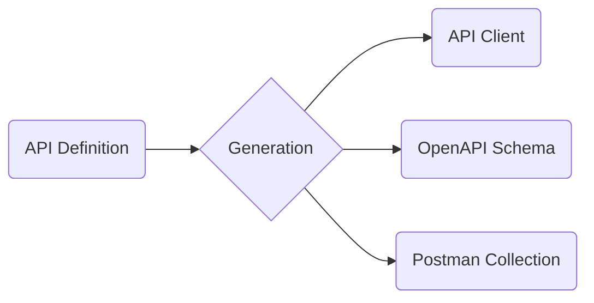

# Ergonomics and Postman Collections

## OpenAPI Schemas

We have had the ability for some time to produce not only a API Client from our API definitions in schematic-definitions but also valid OpenAPI schemas. Sadly this process was not implemented in a way that these API schemas are readily available!

During the _generation_ stage (with the schematic-gen package) we need to make sure we not only produce the API client but also the OpenAPI schemas. These schemas then need to be tested thoroughly to ensure they are correct.

## Postman Schemas

Read the @schematic/docs/postman.md file for a deep overview of Postman collections. Use this context to add rendering a Postman collection for each API as a part of the generation step.

