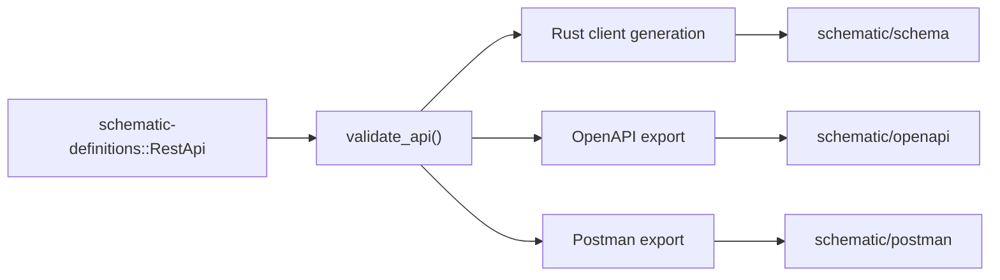

# Ergonomics And Postman Projects Technical Design

## Summary

This feature makes `schematic-gen` produce three first-class artifacts for every REST API definition:

1. Generated Rust client code in `schematic/schema`
2. OpenAPI documents in `schematic/openapi`
3. Postman HTTP collections in `schematic/postman`

The current codebase already has partial OpenAPI export support, but it is optional, incomplete across APIs, and not wired into the default generation workflow. This design turns artifact generation into a deliberate part of the Schematic pipeline while keeping the implementation incremental and compatible with the current architecture.

## Spec Review

The spec is directionally correct, but it leaves several decisions unstated. This design makes them explicit.

### What the spec gets right

- OpenAPI and Postman should be outputs of the generation pipeline, not ad hoc side jobs.
- OpenAPI availability is an ergonomics problem, not a pure export problem.
- Postman generation belongs next to Rust client generation because both derive from the same API definition source.

### Gaps that need technical decisions

- It does not say whether artifact generation is default-on or flag-gated.
- It does not define output directories or file naming.
- It does not define failure behavior when an API lacks a complete schema registry.
- It does not say which Postman collection type to target.
- It says schemas should be "tested thoroughly" but does not define the test matrix.

### Design decisions taken here

- Final target state: artifact generation is part of the default `generate` workflow.
- Transition state: artifact generation is implemented first, then made default after registry coverage reaches all supported REST APIs.
- Postman scope for this feature: HTTP collections only, using Postman Collection v2.1.0 JSON.
- Output layout:
  - `schematic/openapi/<module>.json|yaml`
  - `schematic/postman/<module>.postman_collection.json`
- Missing OpenAPI registry is a hard blocker in final state, but only a warned skip during the migration phase.

## Goals

- Make OpenAPI export a first-class, discoverable output of `schematic-gen`.
- Generate a Postman collection for every REST API definition.
- Keep generated artifacts deterministic and stable in git.
- Reuse existing Schematic metadata instead of introducing a parallel authoring system.
- Add validation that catches broken or incomplete artifacts before they land.

## Non-Goals

- Postman support for GraphQL, gRPC, WebSocket, Socket.IO, MQTT, AI, or MCP collections.
- AsyncAPI export changes.
- Automatic Postman environment generation.
- Importing Postman collections back into Schematic in this feature.
- Replacing the existing OpenAPI export AST or rewriting `schematic-define`.

## Current State

### Already implemented

- `schematic-gen` can optionally export OpenAPI via `--openapi-out`.
- `schematic_define::openapi::export(...)` already converts `RestApi` plus a schema registry into an OpenAPI document.
- `schematic_definitions::registry::get_registry(...)` provides registry lookup for a small subset of APIs.
- `schematic/justfile` already has a central `generate` workflow for schema code.

### Current problems

- OpenAPI export is not part of the default generation path.
- Only `openai` and `samsung-smart-tv` currently have complete schema registries.
- `run_generate_all()` exports OpenAPI opportunistically and silently skips most APIs.
- There is no Postman export path.
- There is no artifact drift detection in the current test workflow.

## High-Level Design

Add an artifact generation stage to `schematic-gen` that runs after validation and code generation.



The export system will stay REST-focused. WebSocket/AsyncAPI generation remains separate.

## Artifact Model

The implementation should introduce a small shared normalization layer for REST export inputs, without attempting a full new IR for the entire generator.

### New shared export helpers

Create a new module namespace under `schematic/gen/src`:

- `export/http.rs`
- `export/naming.rs`
- `export/path_params.rs`
- `export/auth.rs`
- `export/body.rs`

These helpers will normalize:

- module/file naming
- path parameters
- query parameters
- request body metadata
- static headers
- auth metadata

This avoids duplicating low-level mapping logic between OpenAPI and Postman writers while keeping each output format independent.

## OpenAPI Design

### Target behavior

Every REST API supported by `schematic-gen generate` should emit an OpenAPI document as part of generation.

### Output format

- Default format: JSON
- Supported formats: JSON and YAML
- File naming: `<module>.json` or `<module>.yaml`

The file should be named from the resolved module path, not directly from `api.name`, so shared-module APIs stay aligned with the generated Rust layout. For example:

- `OllamaNative` and `OllamaOpenAI` should contribute to `ollama.json`
- `EmqxBasic` and `EmqxBearer` should contribute to `emqx.json`

### Shared-module handling

This is the main OpenAPI design choice not addressed by the existing implementation.

For APIs that intentionally share a generated Rust module:

- We should emit one OpenAPI document per generated module, not one document per internal `RestApi`.
- The document should contain the union of operations for all `RestApi` definitions that resolve to that module.
- If the definitions have different auth strategies, they should be represented as multiple security schemes and per-operation security requirements.

This requires a new batch export path:

- group `RestApi` definitions by resolved module path
- merge grouped APIs into one export unit
- collect schema registries from all members
- export one document per group

### Registry completeness

Final behavior should be strict:

- if a grouped API references a JSON response schema that is not registered, generation fails
- the error must list missing type names and the owning API/module

Migration behavior can remain warn-and-skip until registry coverage is complete.

### Required code changes

- Extend `schematic_definitions::registry` with:
  - registry lookup for every REST API
  - grouped registry lookup for shared modules
- Add `write_openapi_group(...)` or an equivalent grouped writer in `schematic/gen/src/openapi_output.rs`
- Refactor `run_generate_all()` so OpenAPI export works by module group instead of one API at a time

### Versioning

The current hard-coded `1.0.0` should be replaced by a stable source of truth:

1. explicit CLI override if provided
2. package version from the definitions crate when available
3. fallback `"0.1.0"`

## Postman Design

### Target

Generate Postman HTTP collections using Collection Format v2.1.0:

- schema URL: `https://schema.getpostman.com/json/collection/v2.1.0/collection.json`
- output format: JSON only

### Why HTTP only

Schematic REST definitions map cleanly to Postman HTTP requests. The other Postman collection types described in `schematic/docs/postman.md` do not have equivalent source metadata in the current REST generator and should not be mixed into this feature.

### Collection structure

Each generated collection will contain:

- `info`
  - collection name
  - description
  - Postman schema URL
- `variable`
  - `baseUrl`
  - auth-related variables when applicable
- `auth`
  - collection-level auth when uniform for the whole API/module
- `item`
  - folders and requests

### Foldering strategy

Schematic definitions do not currently expose OpenAPI-style tags, so foldering must be deterministic and inferred.

Foldering algorithm:

1. strip leading `/`
2. ignore path variables like `{id}`
3. ignore obvious version prefixes like `v1`, `v2`
4. use the first remaining path segment as the folder key
5. if no stable segment exists, place the request at the collection root

Examples:

- `/models` -> folder `models`
- `/repos/{owner}/{repo}/issues` -> folder `repos`
- `/v1/audio/speech` -> folder `audio`

This can be improved later if `RestApi` gains tags.

### Request modeling

Each `Endpoint` becomes one Postman item:

- name: `Endpoint.id`
- request method: from `RestMethod`
- URL: `{{baseUrl}}` + path
- path params: represented as Postman URL variables
- query params: represented as Postman `query` entries
- static headers: included as request headers
- body: mapped from `ApiRequest`

### Auth mapping

Map Schematic auth strategies to Postman auth objects:

- `BearerToken { header: None }` -> `bearer`
- `BearerToken { header: Some(custom) }` -> header-based `apikey`
- `ApiKey { header }` -> `apikey`
- `Basic` -> `basic`
- `None` -> `noauth`

Generated auth should use collection variables, not literal secrets:

- `{{bearerToken}}`
- `{{apiKey}}`
- `{{username}}`
- `{{password}}`

If different operations in one grouped module require different auth, collection-level auth is omitted and each request gets request-level auth.

### Body mapping

Map `ApiRequest` as follows:

- `Json(Schema)` -> raw JSON mode with `Content-Type: application/json`
- `FormData` -> `formdata`
- `UrlEncoded` -> `urlencoded`
- `Text` -> raw text mode with declared content type
- `Binary` -> `file`

For JSON requests, Postman will receive a placeholder raw body rather than a fully synthesized example in the first pass. Example generation can be added later once schema-derived example support exists.

### Response examples

Do not generate saved Postman responses in the initial implementation. The source model does not yet contain examples, and placeholder responses add little value.

### Required code changes

Add a new writer:

- `schematic/gen/src/postman_output.rs`

Recommended internal shape:

- `PostmanCollection`
- `PostmanInfo`
- `PostmanItem`
- `PostmanRequest`
- `PostmanAuth`
- `PostmanVariable`

The writer should use strongly typed serde structs, not ad hoc `serde_json::Value`, so format regressions are easier to test.

## CLI And Justfile Design

### Final UX

Generation should eventually emit all artifacts by default:

```bash
schematic-gen generate --api openai --output schematic/schema/src
```

Expected side effects:

- Rust client written to `schematic/schema/src`
- OpenAPI written to `schematic/openapi/openai.json`
- Postman collection written to `schematic/postman/openai.postman_collection.json`

### CLI flags

Add these options to `generate`:

- `--openapi-out <DIR>`
- `--openapi-format <json|yaml>`
- `--postman-out <DIR>`
- `--no-openapi`
- `--no-postman`

Default resolution:

- if no output override is given and generation targets `schematic/schema/src`, use:
  - `schematic/openapi`
  - `schematic/postman`

### Justfile changes

Update `schematic/justfile`:

- `just generate` should generate Rust + OpenAPI + Postman
- `just generate-one <api>` should do the same for one API
- add optional helpers:
  - `just generate-openapi`
  - `just generate-postman`

## Failure Policy

### Final-state policy

`just generate` and `schematic-gen generate --api all` should fail when:

- a REST API lacks a required schema registry
- OpenAPI export cannot serialize
- Postman export cannot serialize

This keeps generated artifacts trustworthy.

### Migration policy

During rollout:

- OpenAPI may warn-and-skip for APIs without registries
- Postman should still generate for those APIs because it does not depend on response schema completeness

This lets the team land Postman support and improve ergonomics before every registry is complete.

## Testing Strategy

The spec calls for thorough testing. That should mean four layers.

### 1. Unit tests

For OpenAPI and Postman mappers:

- auth mapping
- path param extraction
- request body mapping
- foldering behavior
- shared-module grouping

### 2. Golden artifact tests

Add fixture-based tests under `schematic/gen/tests/fixtures/`:

- expected OpenAPI docs for selected APIs
- expected Postman collections for selected APIs

Use canonical serialization so diffs stay stable.

### 3. Structural validation tests

OpenAPI:

- parse emitted JSON/YAML back into `openapiv3::OpenAPI`
- assert required sections exist

Postman:

- validate emitted JSON against the vendored Postman v2.1.0 JSON Schema
- add a test fixture for the schema under `schematic/gen/tests/fixtures/postman/`

### 4. End-to-end generation tests

Extend the existing generator integration tests to cover:

- `--api openai`
- `--api all`
- grouped modules like `ollama` and `emqx`
- both dry-run and write modes

Assertions should verify:

- expected files are created
- files are parseable
- filenames are correct
- stale artifact cleanup works

## Documentation Updates

The implementation should update docs in the same change set:

- `schematic/README.md`
- `schematic/gen/README.md`
- `schematic/justfile`
- `schematic/docs/io/export-openapi.md`
- add `schematic/docs/io/export-postman.md`
- update feature references if `docs/postman.md` needs implementation notes

## File And Module Plan

Expected implementation touch points:

- `schematic/gen/src/main.rs`
- `schematic/gen/src/lib.rs`
- `schematic/gen/src/openapi_output.rs`
- `schematic/gen/src/postman_output.rs`
- `schematic/gen/src/export/`
- `schematic/definitions/src/registry.rs`
- per-API files in `schematic/definitions/src/*/mod.rs` for registry completeness
- `schematic/justfile`
- `schematic/gen/tests/*`

## Rollout Plan

### Phase 1: Postman exporter and artifact plumbing

- add Postman writer
- add CLI flags
- add output directories
- add tests for Postman generation
- keep OpenAPI behavior migration-friendly

### Phase 2: Complete OpenAPI registry coverage

- add `JsonSchema` derives and registry entries for each REST API
- add grouped registry handling for shared modules
- add all-artifacts tests for `--api all`

### Phase 3: Make artifacts default

- switch `just generate` and `generate-one` to always emit OpenAPI and Postman
- remove warn-and-skip behavior for missing registries
- make artifact drift part of the standard package verification workflow

## Risks

### Shared-module exports

The current OpenAPI path is API-centric, while the generated Rust layout is module-centric for some providers. If this is not handled carefully, artifact names will drift from Rust module names.

### Schema completeness work

The largest scope risk is not Postman generation. It is the amount of per-provider schema work needed to make OpenAPI strict and complete across the whole REST surface.

### Artifact churn

If serialization order is not made deterministic, generated JSON diffs will be noisy. All writers should use stable ordering and canonical serialization.

## Recommendation

Implement Postman generation and grouped artifact plumbing first, but do not immediately flip the whole system to strict default-on OpenAPI generation. The codebase is already close to a good solution; the real work is completing registry coverage and making the batch workflow deterministic, strict, and easy to discover.
