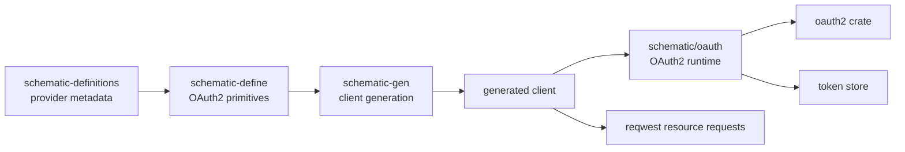

# OAuth2 Support Design for the Schematic Ecosystem

## Summary

This document proposes first-class OAuth2 support across the Schematic ecosystem. The core recommendation is:

1. Extend `schematic-define` with declarative OAuth2 primitives.
2. Add a new runtime crate at `schematic/oauth` to own token acquisition, refresh, caching, and PKCE support.
3. Update `schematic-gen` so generated clients integrate with that runtime instead of inlining OAuth state machines.
4. Keep OpenID Connect and OAuth 1.0a out of the initial scope.

The design is based on three constraints visible in the current codebase:

- `AuthStrategy` is currently a request-decoration choice, not a stateful authentication workflow.
- generated REST clients are intentionally stateless and mostly resolve credentials from `env_auth` / `env_username` at request time.
- OpenAPI import/export currently supports bearer, basic, and API key auth, but explicitly does not support OAuth2.

OAuth2 can fit cleanly, but only if token lifecycle management is treated as runtime infrastructure rather than generator output.

## Goals

- Add provider-neutral OAuth2 support for generated REST clients.
- Support the OAuth2 flows that make sense for Schematic-generated clients:
  - Authorization Code with PKCE
  - Client Credentials
  - Refresh Token
- Preserve Schematic’s current declarative model: definitions describe provider behavior, generated code exposes ergonomic client APIs, runtime code performs the flow.
- Keep existing bearer/basic/api-key behavior backwards compatible.
- Make OpenAPI import/export preserve OAuth2 information instead of degrading it to bearer token assumptions.

## Non-Goals

- OpenID Connect identity verification in the initial implementation.
- OAuth 1.0a / 1.1 request-signing support.
- Automatic browser launching as a hard requirement.
- Server-side OAuth provider functionality.
- Full support for every OAuth extension in v1, including DPoP, mTLS sender-constrained tokens, token introspection, and dynamic client registration.

## Recommendation on Rust Crates

The best fit for Schematic is the [`oauth2`](https://docs.rs/oauth2/latest/oauth2/) crate.

Why this crate fits best:

- It is a client-side library, which matches Schematic’s generated-client model.
- It is provider-neutral and works well for generic API definitions.
- It already supports Authorization Code, PKCE, Client Credentials, refresh tokens, revocation, and reqwest-based async usage.
- It is strongly typed without forcing an opinionated application framework.
- It does not pull Schematic into OpenID Connect semantics unless we explicitly choose to add them later.

Why not the alternatives:

- `openidconnect` is the right choice when identity, ID token verification, and discovery are required. That is future work, not the core Schematic use case.
- `oxide-auth` is for implementing OAuth servers, not consuming OAuth-protected APIs.
- `yup-oauth2` is too Google-shaped for a general code-generation ecosystem.
- smaller or framework-specific crates do not provide enough stability or portability for generated libraries.

## Current State of the Codebase

### What exists today

- `schematic_define::AuthStrategy` supports `None`, `BearerToken`, `ApiKey`, `Basic`, and `ApiKeyParam`.
- `RestApi` separates auth behavior (`auth`) from env-based credential sources (`env_auth`, `env_username`, `env_mapping`).
- `Headers` can inject auth programmatically and already acts as an override layer.
- generated clients in `schematic/gen/src/codegen/client.rs` still perform runtime auth matching directly against `self.auth_strategy`.
- OpenAPI import rejects OAuth2 security schemes.
- OpenAPI export only maps existing auth variants.

### Friction points that matter for OAuth2

- OAuth2 is stateful. Current auth handling is stateless.
- OAuth2 needs client ID, client secret, redirect URI, refresh token, scope, and PKCE semantics. Current env mapping does not model these.
- `generate_auth_setup()` currently matches auth variants inline and has a future-variant fallback. That is too weak for OAuth2 because silently doing nothing would be a serious behavior bug.
- OpenAPI import/export and Schematic doc extensions need richer auth metadata than the current model preserves.

## Design Principles

- Keep `schematic-define` declarative and serializable.
- Keep `schematic-gen` focused on code generation, not OAuth protocol implementation.
- Put token lifecycle logic in a reusable runtime crate.
- Make interactive auth explicit; do not hide browser or callback behavior behind an ordinary request method.
- Treat PKCE as the default for any user-delegated flow.
- Prefer typed provider metadata over ad hoc stringly-typed extensions.

## Proposed Architecture



The important boundary is between generated code and runtime code:

- generated code should know that an API uses OAuth2 and which provider metadata applies.
- generated code should not implement PKCE, authorization URL construction, token refresh, or caching itself.

## Package-by-Package Design

## `schematic-define`

### New auth variant

Add a new `AuthStrategy` variant:

```rust
pub enum AuthStrategy {
    None,
    BearerToken { header: Option<String> },
    ApiKey { header: String },
    Basic,
    ApiKeyParam { name: String, location: ApiKeyLocation },
    OAuth2(OAuth2Config),
}
```

This keeps OAuth2 in the same top-level auth model while making the protocol state explicit.

### New OAuth2 primitives

Recommended types:

```rust
pub struct OAuth2Config {
    pub grant_type: OAuth2GrantType,
    pub authorization_url: Option<String>,
    pub token_url: String,
    pub revocation_url: Option<String>,
    pub device_authorization_url: Option<String>,
    pub default_scopes: Vec<String>,
    pub pkce: PkceRequirement,
    pub client_auth: OAuth2ClientAuthMethod,
}

pub enum OAuth2GrantType {
    AuthorizationCodePkce,
    ClientCredentials,
    DeviceCode,
}

pub enum PkceRequirement {
    Required,
    Supported,
    NotUsed,
}

pub enum OAuth2ClientAuthMethod {
    ClientSecretBasic,
    ClientSecretPost,
    None,
}
```

Design notes:

- `AuthorizationCodePkce` should be a distinct variant instead of a generic `AuthorizationCode` plus a boolean flag. The secure path should be the obvious path.
- `DeviceCode` should be modeled now, but it can be implemented in phase 2 if we want a smaller first delivery.
- `authorization_url` is optional because `ClientCredentials` does not use it.
- `revocation_url` is optional because many providers omit it.

### Endpoint-level scope metadata

Add endpoint-level scope overrides:

```rust
pub struct Endpoint {
    pub id: String,
    pub method: RestMethod,
    pub path: String,
    pub description: String,
    pub request: Option<ApiRequest>,
    pub response: ApiResponse,
    pub headers: Vec<(String, String)>,
    pub params: Option<EndpointParams>,
    pub oauth_scopes: Option<Vec<String>>,
}
```

Why this matters:

- API-level scopes define the default contract.
- endpoint-level scopes let generated docs and runtime scope requests match the least-privilege requirement.
- this avoids over-requesting scopes for read-only endpoints.

### `EnvMapping` expansion

Extend `EnvMapping` for OAuth2 client configuration:

```rust
pub struct EnvMapping {
    pub bearer_token: Option<EnvList>,
    pub basic_user: Option<EnvList>,
    pub basic_pass: Option<EnvList>,
    pub api_key: Option<ApiKeyEnv>,
    pub oauth_client_id: Option<EnvList>,
    pub oauth_client_secret: Option<EnvList>,
    pub oauth_redirect_uri: Option<EnvList>,
}
```

Rationale:

- client ID, client secret, and redirect URI are consumer-specific and usually should not live in a checked-in API definition.
- the redirect URI must be configurable per consuming app.
- access and refresh tokens should not be modeled as ordinary env mapping fields. They belong in a token store, not in provider metadata.

### Backwards compatibility

- existing auth variants remain unchanged.
- `RestApi::default_env_mapping()` should continue to derive legacy mappings exactly as it does today for bearer/basic APIs.
- for `AuthStrategy::OAuth2`, `default_env_mapping()` should return an `EnvMapping` with the new OAuth fields only when explicitly configured.
- all current definitions should continue to generate identical clients until they opt into OAuth2.

## New Runtime Crate: `schematic/oauth`

### Why a separate runtime crate is necessary

If OAuth2 is emitted directly into generated files, every generated module will need:

- token state types
- expiry checks
- refresh logic
- PKCE helpers
- auth URL generation
- callback/code exchange logic
- token store handling

That would duplicate protocol logic, bloat generated output, and make fixes harder. A dedicated runtime crate avoids that.

### Proposed responsibilities

The new runtime crate should:

- wrap the `oauth2` crate with Schematic-oriented types
- expose a reusable `OAuth2Manager`
- store and refresh tokens
- build authorization URLs
- exchange authorization codes
- acquire client-credentials tokens
- optionally perform token revocation

### Proposed public surface

```rust
pub struct OAuth2Manager { ... }

pub struct OAuth2RuntimeConfig {
    pub provider: schematic_define::OAuth2Config,
    pub client_id: String,
    pub client_secret: Option<String>,
    pub redirect_uri: Option<String>,
    pub scopes: Vec<String>,
}

pub struct AuthorizationSession {
    pub authorization_url: String,
    pub csrf_state: String,
    pub pkce_verifier: Option<String>,
}

pub trait TokenStore: Send + Sync {
    fn load(&self) -> Result<Option<StoredTokens>, OAuthError>;
    fn save(&self, tokens: &StoredTokens) -> Result<(), OAuthError>;
    fn clear(&self) -> Result<(), OAuthError>;
}
```

Recommended built-in stores:

- `MemoryTokenStore` for tests and short-lived processes
- `FileTokenStore` for local CLI and desktop usage

### Runtime behavior

For `AuthorizationCodePkce`:

1. Build authorization URL and PKCE challenge.
2. Caller sends the user to the URL.
3. Caller receives the callback code.
4. Runtime exchanges code for tokens and stores them.
5. Generated requests use the stored access token and refresh it when needed.

For `ClientCredentials`:

1. Runtime lazily acquires an access token using client credentials.
2. Runtime caches the token until expiry.
3. Requests transparently reuse or refresh that token.

### Explicitly not automatic in v1

- auto-opening a browser
- running a local callback server
- provider discovery

Those are application choices. The runtime should expose hooks for them, not force them.

## `schematic-gen`

### Generator changes

`schematic-gen` should stop treating auth exclusively as inline request setup code.

The generated API struct should gain an OAuth runtime field:

```rust
pub struct GitHub {
    client: reqwest::Client,
    base_url: String,
    auth_strategy: schematic_define::AuthStrategy,
    env_auth: Vec<String>,
    env_username: Option<String>,
    headers: schematic_define::Headers,
    oauth: Option<schematic_oauth::OAuth2Manager>,
}
```

### Request pipeline changes

Current behavior:

- use `Headers` if present
- otherwise match `self.auth_strategy`
- resolve env vars inline

Proposed behavior:

1. build headers from `Headers`
2. if `Headers` already contains authorization, keep current override behavior
3. otherwise:
   - `None` => no auth
   - `BearerToken` / `ApiKey` / `Basic` / `ApiKeyParam` => current behavior
   - `OAuth2` => ask the runtime for a valid access token, then inject `Authorization: Bearer ...`

This keeps OAuth2 additive instead of rewriting existing auth behavior.

### Generated helper methods

For APIs that use OAuth2, generated clients should expose explicit helpers:

```rust
impl GitHub {
    pub fn begin_oauth_authorization(&self) -> Result<AuthorizationSession, SchematicError>;

    pub async fn complete_oauth_authorization(
        &self,
        code: &str,
        state: &str,
        pkce_verifier: Option<&str>,
    ) -> Result<(), SchematicError>;

    pub async fn clear_oauth_tokens(&self) -> Result<(), SchematicError>;
}
```

Why this is the right level:

- it gives consumers explicit control over user-facing flow handling
- it avoids generating provider-specific auth logic into every request method
- it works for CLI, desktop, and server-side consumers

### Variant builder changes

The variant builder should gain OAuth-specific configuration methods:

- `.oauth_client_id_env(...)`
- `.oauth_client_secret_env(...)`
- `.oauth_redirect_uri_env(...)`
- `.oauth_token_store(...)`
- `.oauth_scopes(...)`
- `.oauth_runtime_config(...)`

The builder should also allow replacing the default runtime entirely for advanced consumers.

### Error model updates

Add OAuth-aware generated errors:

- `OAuthConfiguration`
- `OAuthAuthenticationRequired`
- `OAuthStateMismatch`
- `OAuthTokenExchange`
- `OAuthRefresh`
- `OAuthTokenStore`

This should flow through the generated `SchematicError` type rather than leaking raw `oauth2` errors directly.

### Documentation generation

`module_docs.rs` and output summaries should describe:

- which OAuth2 flow the API expects
- which env vars configure client credentials
- whether PKCE is required
- how endpoint scopes differ from default scopes

Current auth docs only describe bearer/basic/api-key patterns. Those sections must become protocol-aware.

## `schematic-definitions`

Definitions should declare provider metadata, not application secrets.

Example shape:

```rust
auth: AuthStrategy::OAuth2(OAuth2Config {
    grant_type: OAuth2GrantType::AuthorizationCodePkce,
    authorization_url: Some("https://github.com/login/oauth/authorize".into()),
    token_url: "https://github.com/login/oauth/access_token".into(),
    revocation_url: None,
    device_authorization_url: None,
    default_scopes: vec!["repo".into(), "read:user".into()],
    pkce: PkceRequirement::Required,
    client_auth: OAuth2ClientAuthMethod::ClientSecretPost,
}),
env_mapping: Some(EnvMapping {
    oauth_client_id: Some(EnvList::single("GITHUB_CLIENT_ID")),
    oauth_client_secret: Some(EnvList::single("GITHUB_CLIENT_SECRET")),
    oauth_redirect_uri: Some(EnvList::single("GITHUB_REDIRECT_URI")),
    ..Default::default()
}),
```

That keeps `schematic-definitions` focused on provider contracts and leaves app registration details to the consumer.

## OpenAPI Import, Export, and Extensions

### Import

Current behavior in `schematic/define/src/openapi/import/mappings.rs` is to reject OAuth2.

That should change to:

- map OpenAPI OAuth2 security schemes into `AuthStrategy::OAuth2`
- preserve supported flows and scopes
- emit diagnostics when the spec describes flows we do not yet implement

Import behavior should be:

- `authorizationCode` => `AuthorizationCodePkce` with a warning if PKCE support is not described explicitly
- `clientCredentials` => `ClientCredentials`
- `implicit` => unsupported with warning
- `password` => unsupported with warning

### Export

OpenAPI export should emit `SecurityScheme::OAuth2` instead of flattening OAuth APIs to bearer assumptions.

The exported scopes should come from:

- `api.auth.default_scopes` for API-level defaults
- `endpoint.oauth_scopes` for operation-level requirements

### Schematic doc extensions

`AuthExtension` currently preserves `strategy`, `env_auth`, and `env_username`.

It should also preserve:

- OAuth env mapping fields
- endpoint scope overrides
- any Schematic-only metadata that OpenAPI cannot represent cleanly

That keeps round-tripping stable.

## Security Model

### Required security defaults

- PKCE required for authorization-code flows
- no implicit grant support
- no password grant support
- short-lived access tokens assumed
- refresh handled by runtime, not by caller code
- sensitive values wrapped or redacted in logs and debug output

### Token storage guidance

- in-memory store is safe for tests and ephemeral servers
- file-backed store should use restrictive file permissions
- generated clients should never print access tokens, refresh tokens, or client secrets
- users who already have a secure secret store should be able to provide a custom `TokenStore`

### Scope handling

The runtime should request:

- endpoint scopes when an endpoint declares them
- otherwise API default scopes

If a stored token does not satisfy required scopes, the runtime should return a clear error rather than silently attempting a request with insufficient permissions.

## Phased Rollout

### Phase 1

- add OAuth2 primitives to `schematic-define`
- add `schematic/oauth` runtime crate
- implement `ClientCredentials`
- implement `AuthorizationCodePkce`
- implement refresh-token persistence
- update `schematic-gen` REST generation
- update OpenAPI import/export

### Phase 2

- implement `DeviceCode`
- add revocation helpers
- add richer generated docs
- add first provider definitions that use OAuth2

### Phase 3

- optional OpenID Connect integration using `openidconnect`
- optional discovery support
- optional token introspection / revocation integrations where providers support them

## Testing Strategy

Use `wiremock` and existing test patterns in the monorepo.

### `schematic-define`

- serialization/deserialization of new OAuth2 types
- backward-compatibility tests for existing auth strategies
- `default_env_mapping()` tests for OAuth2 fields

### `schematic/oauth`

- authorization URL generation
- PKCE verifier/challenge handling
- code exchange
- refresh flow
- token expiry logic
- token store round-trip tests

### `schematic-gen`

- generated struct includes OAuth runtime when needed
- request pipeline injects bearer token from runtime
- generated helpers compile and validate
- non-OAuth APIs generate unchanged code

### OpenAPI

- import `authorizationCode` and `clientCredentials` schemes successfully
- reject `implicit` and `password` with diagnostics
- export OAuth2 flows and scopes correctly
- round-trip through extensions without losing Schematic-only metadata

## Migration and Compatibility

- existing APIs do not need to change.
- APIs that currently say `BearerToken` but are semantically OAuth-backed can remain as-is until upgraded.
- generated clients should preserve current `Headers` override behavior so callers can still inject tokens manually.
- adding `AuthStrategy::OAuth2` must not rely on wildcard fallbacks. All generator matches should become explicit enough that unsupported auth paths fail loudly.

## Alternatives Considered

### Alternative 1: Treat OAuth2 as just `BearerToken`

Rejected because it loses:

- grant-type information
- refresh behavior
- scope semantics
- PKCE requirements
- OpenAPI round-trip fidelity

This is the current limitation, and it is exactly what we want to remove.

### Alternative 2: Generate all OAuth logic inline

Rejected because it would:

- duplicate protocol code in every generated client
- make bug fixes harder
- inflate generated code substantially
- force `schematic-gen` to own runtime concerns

### Alternative 3: Require users to bring their own OAuth stack

Rejected for first-class support because it would make generated clients incomplete. It is still worth supporting as an escape hatch through runtime replacement and `Headers` overrides.

## OAuth 1.0a / 1.1 Complications

Supporting OAuth 1.0a would materially complicate the model:

- requests must be cryptographically signed, not just decorated with bearer tokens
- signature generation depends on method, URL, parameters, nonce, and timestamp
- token acquisition uses a different protocol shape from OAuth2
- request signing is per-request protocol logic, not a reusable token injection step
- OpenAPI generally does not model OAuth 1.0a with the same ergonomics as OAuth2 flows

In practice, OAuth 1.0a would likely require:

- a separate `AuthStrategy::OAuth1`
- a separate runtime implementation
- request-signing hooks deep inside request construction
- different env/config mapping for consumer key, consumer secret, token, and token secret

That is a different project. It should not shape the OAuth2 design beyond making sure the new auth modeling stays extensible.

## Final Recommendation

Implement OAuth2 as a first-class auth strategy, but keep the protocol machinery in a dedicated runtime crate under `schematic/oauth`.

That approach gives Schematic:

- correct OAuth2 semantics
- reusable token lifecycle handling
- minimal disruption to existing generated clients
- clean OpenAPI import/export support
- a path to future OIDC support without overcommitting now

The sharp edge to avoid is trying to shoehorn OAuth2 into the current bearer-token path. The codebase is already signaling that OAuth2 needs richer primitives and a runtime abstraction. The design above gives Schematic that richer model without turning `schematic-gen` into an OAuth framework.
