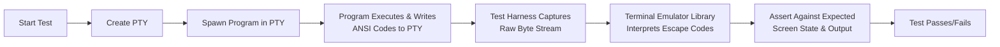

# Testing Terminal Output

Testing terminal output in Rust, especially when heavy with ANSI escape codes, requires a blend of understanding terminal behavior, using the right tools, and adopting strategic testing approaches. Let's dive deep into how to tackle this effectively.

## 🔍 Understanding the Challenges

Before diving into solutions, it's crucial to understand the inherent challenges:

1. **Escape Codes Opacity**: ANSI escape codes (e.g., `\x1b[31mRed Text\x1b[0m`) are non-printable sequences that control terminal formatting like color, cursor movement, and style. They make direct string comparison in tests nearly impossible because the expected output would be laden with these codes, making it unreadable and fragile 【turn0search6】【turn0search10】.
2. **Platform & Terminal Variability**:
    * **Windows vs. Unix**: Historically, Windows didn't support ANSI codes natively. While modern Windows 10+ does, it often requires enabling virtual terminal processing 【turn0search8】. Rust's `std::process::Command` can sometimes behave unexpectedly with ANSI codes across platforms 【turn0search22】.
    * **Terminal Emulators**: Different terminals (iTerm2, Alacritty, Windows Terminal, etc.) may render escape codes slightly differently, especially for advanced features like inline images or specific color palettes 【turn0search6】.
3. **TTY Detection**: Programs often check if they're outputting to a terminal (using `isatty`) to decide whether to emit colors. In CI environments, output is typically piped (not a TTY), so colors might be disabled, making tests pass in development but fail in CI if not handled correctly 【turn0search21】.
4. **Dynamic Output**: Output may include dynamic elements like file paths, timestamps, or process IDs, which need normalization during testing.

## 🧪 Effective Testing Strategies

### 1. Snapshot Testing (Golden Master)

This is the most robust and maintainable approach for complex, escape-code-heavy output.

* **How it Works**: Run your program once with a known set of inputs and capture the **actual output**, including all ANSI codes, into a file (the "snapshot"). Your test then compares the current output against this snapshot. If the output changes (intentionally or not), the test fails, and you can review the diff.
* **Why It's Powerful**:
    * You don't need to manually write expected strings full of escape codes.
    * You capture the exact visual behavior, including complex formatting and interactions.
    * Updates are deliberate and reviewed.
* **Tools**:
    * **[`insta`](https://docs.rs/insta/)**: A popular and highly ergonomic snapshot testing framework for Rust. It's perfect for this. It handles diffing, reviewing, and updating snapshots seamlessly.
    * **[`term-transcript`](https://docs.rs/term-transcript/)**: This crate is specifically designed for capturing terminal transcripts. It can record both the output text and the ANSI-compatible color information and save them in formats like SVG for visual inspection. This is incredibly powerful for debugging why a test failed 【turn0search19】.

```rust
// A conceptual example using insta
#[test]
fn test_colored_output() {
    let output = capture_terminal_output(|| {
        // Run the code that produces the complex output
        print_complex_ansi_art();
    });
    // The first run will create a snapshot file.
    // Subsequent runs will compare against it.
    insta::assert_debug_snapshot!(output);
}
```

### 2. String Normalization & Regex Parsing

When you need more granular assertions than snapshot testing provides, you can parse the captured output.

* **Strip ANSI Codes**: For tests where you only care about the *text* content and not the formatting, strip all ANSI escape codes before comparison.
    * **Tool**: The [`ansi-escape-sequences`](https://docs.rs/ansi-escape-sequences/) crate can help you find and remove or analyze escape sequences 【turn0search18】.
* **Assert Specific Patterns**: Use regular expressions to assert that specific escape codes are present or absent. For example, you might want to ensure that error messages are in red.
    * **Tool**: The [`ansi-escape-sequences`](https://docs.rs/ansi-escape-sequences/) crate provides `AnsiRegexOptions` to get detailed information about escape sequences found in the input, including their positions and content 【turn0search18】.

    ```rust
    use ansi_escape_sequences::AnsiRegexOptions;

    #[test]
    test_error_messages_are_red() {
        let output = run_program_with_error();
        let options = AnsiRegexOptions::default();
        let sequences = options.find_all_sequences(&output);
        // Assert that a red color escape code is present
        assert!(sequences.iter().any(|seq| seq.code == "[31m"));
    }
    ```

### 3. PTY-Based End-to-End Testing

For testing interactive Terminal User Interface (TUI) applications or programs that depend on a real terminal environment (e.g., to query screen size using `ioctl`), you need a Pseudo-TTY (PTY).

* **How It Works**: Your test creates a PTY, spawns your program within it, and then programmatically sends input (like key presses) and captures the raw byte stream output (including all ANSI codes) from the program's perspective. You then use a terminal emulator library to interpret these escape codes and assert against the rendered screen state.
* **Why It's Powerful**: It's the closest to real user interaction and tests the full integration of your program with terminal control sequences.
* **Tools**:
    * **[`portable-pty`](https://docs.rs/portable-pty/)**: A cross-platform Rust library for creating PTYs, which is essential for this approach 【turn0search6】.
    * **`kitty-test-harness`**: This crate enables automated testing by launching kitty terminal instances, sending input sequences, and extracting output. It's a powerful tool for end-to-end testing 【turn0search14】.
    * This approach is well-explained in the article "Testing terminal user interface apps" 【turn0search6】.



### 4. Conditional Formatting for Testability

The most fundamental strategy is to make your code itself testable.

* **Detect the Environment**: Your program should check if it's outputting to a TTY (using `isatty`) or if a `NO_COLOR` environment variable is set. It should only emit ANSI codes when appropriate.

    ```rust
    use std::io::IsTerminal;

    fn print_colored(text: &str) {
        if std::io::stdout().is_terminal() {
            println!("\x1b[31m{}\x1b[0m", text); // Red text
        } else {
            println!("{}", text); // Plain text
        }
    }
    ```

* **Force Colors in Tests**: In your tests, you can force color output by either:
    * Setting environment variables like `TERM=xterm-256color` or `FORCE_COLOR=1` before running your program in the test.
    * Writing your formatting functions to accept a boolean flag like `enable_color` that you can set to `true` in tests.
* **Use Output Capture**: Capture `stdout`/`stderr` during the test to assert against the string.
    * **Tool**: The [`xacli-testing`](https://docs.rs/xacli-testing/) crate provides an `OutputCapture` struct specifically for capturing terminal output in tests 【turn0search16】.

    ```rust
    // Conceptual example using a custom output capture
    #[test]
    fn test_forced_color_output() {
        let output = OutputCapture::new().unwrap();
        {
            let _guard = output.capture();
            // Set env var to force color
            std::env::set_var("FORCE_COLOR", "1");
            print_colored("Test Message");
        }
        let captured = output.get_captured_output();
        // Assert that the captured string contains ANSI codes
        assert!(captured.contains("\x1b[31m"));
    }
    ```

## 🛠️ Useful Tools & Crates

Here's a summary of the tools mentioned and others that can aid your testing journey:

| Category | Crate | Purpose | Key Feature |
| :--- | :--- | :--- | :--- |
| **Snapshot Testing** | [`insta`](https://docs.rs/insta/) | **Snapshot testing framework** | Ergonomic API, inline snapshots, review tools |
| | [`term-transcript`](https://docs.rs/term-transcript/) | **Record & visualize terminal transcripts** | Capture text & ANSI info, export to SVG |
| **PTY & Emulation** | [`portable-pty`](https://docs.rs/portable-pty/) | **Create cross-platform PTYs** | Essential for interactive TUI testing |
| | `kitty-test-harness` | **Automated terminal testing via kitty** | Launch kitty, send input, extract output |
| **Output Capture & Parsing** | [`xacli-testing`](https://docs.rs/xacli-testing/) | **Capture terminal output** | Simple `OutputCapture` struct |
| | [`ansi-escape-sequences`](https://docs.rs/ansi-escape-sequences/) | **Parse & analyze ANSI codes** | Find, remove, and inspect escape sequences |
| **Styling & Formatting** | [`colored`](https://docs.rs/colored/) | **Add colors to strings** | Simple API, conditionally disables colors |
| | [`termcolor`](https://docs.rs/termcolor/) | **Color output abstraction** | Handles cross-platform color support |
| **General CLI** | [`assert_cmd`](https://docs.rs/assert_cmd/) | **Test CLI commands** | Run binaries, assert exit codes, capture stdout/stderr |
| | [`predicates`](https://docs.rs/predicates/) | **Readable boolean-valued functions** | Create expressive assertions for strings |

## 🏗️ Building Custom Test Utilities

Should you build your own utilities? The answer is a nuanced **yes**, but often to wrap existing crates rather than reinvent them.

1. **When to Build Custom Utilities**:
    * **Encapsulate Repeated Logic**: If you find yourself writing the same setup code for capturing output or forcing colors in multiple tests, create a small helper function or a trait.
    * **Simplify Complex Workflows**: A PTY-based test has many moving parts. Creating a small, opinionated harness that handles PTY creation, program spawning, and basic assertion logic can make your tests much cleaner.
    * **Enforce Consistency**: A custom utility can ensure that all your tests handle TTY detection and environment variables in a uniform way.

2. **What to Build (Examples)**:
    * A `TestTerminal` struct that internally manages an `OutputCapture` and provides methods like `assert_output_contains_text()` or `assert_output_has_color()` that internally handle stripping codes or looking for specific ANSI patterns.
    * A macro `assert_ansi_snapshot!` that wraps `insta::assert_snapshot!` but first forces color output and then runs the snapshot assertion.
    * A simple `PTYHarness` that abstracts away the details of `portable-pty` for your specific application's needs.

```rust
// Conceptual example of a custom test utility
pub struct TestTerminal {
    output_capture: OutputCapture,
}

impl TestTerminal {
    pub fn new() -> Self {
        Self {
            output_capture: OutputCapture::new().expect("Failed to create OutputCapture"),
        }
    }

    pub fn run<F>(&self, test_code: F)
    where
        F: FnOnce(),
    {
        let _guard = self.output_capture.capture();
        // Force color for consistent test environment
        std::env::set_var("FORCE_COLOR", "1");
        test_code();
    }

    pub fn assert_output(&self, expected: &str) {
        let output = self.output_capture.get_captured_output();
        // Strip ANSI codes for text comparison
        let clean_output = strip_ansi_codes(&output);
        assert_eq!(clean_output, expected);
    }

    pub fn assert_has_color(&self, ansi_code: &str) {
        let output = self.output_capture.get_captured_output();
        assert!(output.contains(ansi_code), "Output should contain ANSI code: {}", ansi_code);
    }
}

// Usage in a test
#[test]
fn test_custom_utility() {
    let term = TestTerminal::new();
    term.run(|| {
        print_colored("Hello, World!");
    });
    term.assert_has_color("[31m"); // Assert red color is present
}
```

## 📋 Decision Guide: Choosing Your Testing Approach

To help you decide which strategy to use, refer to this flowchart:

```mermaid
flowchart LR
    A[Need to test terminal output?] --> B{Output is static?};
    
    B -- Yes --> C[Use Snapshot Testing<br>e.g., insta];
    
    B -- No/Interactive --> D{Need to test full<br>terminal behavior?};
    
    D -- Yes --> E[Use PTY-based Testing<br>e.g., portable-pty + kitty-test-harness];
    
    D -- No --> F{Need to assert<br>specific formatting?};
    
    F -- Yes --> G[Use String Normalization &<br>Regex Parsing<br>e.g., ansi-escape-sequences];
    
    F -- No --> H[Use Conditional Formatting<br>& Output Capture<br>e.g., xacli-testing + termcolor];
    
    C --> I[✅ Robust & Maintainable];
    E --> J[✅ Most Realistic];
    G --> K[✅ Precise Assertions];
    H --> L[✅ Simple & Unit-Level];
```



## 🎯 Best Practices & Recommendations

1. **Prevent ANSI Codes in CI by Default**: Most CI environments don't have a TTY. Design your program to **not** output ANSI codes when not connected to a terminal. This is the most common pitfall. Use `std::io::IsTerminal` or check `TERM` and `NO_COLOR` env vars.
2. **Layer Your Testing**:
    * **Unit Tests**: Test the logic that *generates* the strings, not the formatted output itself. Test that it produces "Error: [message]" not "\x1b[31mError: [message]\x1b[0m".
    * **Integration Tests**: Use `assert_cmd` to test your binary's behavior, capture output, and make assertions.
    * **End-to-End/Snapshot Tests**: Use `insta` for complex, formatted output or `portable-pty` for interactive TUI apps.
3. **Make Your Output Deterministic**: Avoid including dynamic data like timestamps, PIDs, or full file paths in the parts of the output you care about. If unavoidable, normalize them in your tests (e.g., replace all paths with `/path/to/file`).
4. **Visual Debugging is Your Friend**: When a snapshot test fails, use `term-transcript`'s SVG export or simply print the captured ANSI string to a terminal that supports them. Seeing the actual rendered output often makes the bug obvious.
5. **Consider Platform Differences**: For Windows testing, ensure your test environment (or CI runner) has virtual terminal processing enabled. Use crates like `termcolor` that abstract these differences away.
6. **Don't Overbuild**: Start with simple output capture and assertions using `assert_cmd` and `predicates`. Only reach for PTY-based testing or complex snapshotting when you have a clear need. `insta` is often the sweet spot.

By combining these strategies, tools, and best practices, you can effectively test even the most escape-code-heavy terminal output in Rust, ensuring your CLI applications are robust and reliable across different environments and platforms.
