# Markdown Highlighting


Certainly! I will provide a comprehensive deep dive into the Markdown "highlight" feature using `==` delimiters. The main contents of the report are as follows:

- **Introduction to Markdown highlighting**: Overview of text highlighting in Markdown and its ecosystem.
- **Syntax and implementation**: Detailed explanation of `==` delimiter syntax and editor-specific implementations.
- **Technical rendering process**: How highlighting is processed and rendered across different platforms.
- **Alternative approaches**: Comparison with other highlighting methods like HTML and Pandoc divs.
- **Editor support analysis**: Table comparing highlight support across major Markdown editors.
- **Standardization efforts**: Overview of CommonMark extension proposals for highlighting.
- **Practical applications**: Real-world use cases and advanced highlighting techniques.
- **Challenges and limitations**: Compatibility issues and technical constraints of the feature.

-------

# Comprehensive Deep Dive into Markdown Text Highlighting: The `==` Delimiter Feature

## 1 Introduction to Markdown Text Highlighting

Text **highlighting** in Markdown refers to the capability to visually emphasize specific portions of text by applying a distinctive **background color**, typically yellow or another high-contrast shade. This feature serves as an essential tool for drawing attention to critical information, creating study aids, or marking text for future reference within Markdown documents. While the core Markdown specification (as originally designed by John Gruber) does not include native support for text highlighting, various **Markdown extensions** and **flavored implementations** have emerged to address this limitation, with the double-equals (`==`) delimiter becoming one of the most widely adopted approaches in modern Markdown editors and note-taking applications.

The implementation of text highlighting through `==` delimiters represents a fascinating case study in the **evolution of Markdown** beyond its original design principles. It demonstrates how the community has extended Markdown's capabilities while maintaining its core philosophy of **readability in plain text**. Unlike HTML markup, which can make source documents difficult to read, the `==` syntax maintains the document's legibility while providing clear semantic meaning that translates well across different rendering engines and output formats 【turn0search4】【turn0search17】.

## 2 Syntax and Implementation Details

### 2.1 Core Syntax Structure

The fundamental syntax for text highlighting using the `==` delimiter follows a consistent pattern across implementations:

```markdown
This is ==highlighted text== that stands out from the surrounding content.
```

When rendered, this syntax produces visual emphasis through background coloration:

> This is **highlighted text** that stands out from the surrounding content.

The mechanics of this implementation involve several key components:

- **Delimiters**: The double equal signs (`==`) serve as both opening and closing tokens for the highlighted text span. These delimiters must appear immediately adjacent to the text they highlight without intervening whitespace.
- **Text content**: Any character sequence (except for the delimiter sequence itself) can be highlighted, including spaces, punctuation, and even other inline formatting elements in some implementations.
- **Rendering**: When processed by a supporting Markdown parser, the `==text==` sequence is converted to HTML markup using the `<mark>` element, which browsers then render with a default yellow background color 【turn0search15】【turn0search17】.

### 2.2 Implementation Variations Across Applications

While the basic syntax remains consistent, different applications have implemented this feature with varying degrees of sophistication and customization options:

*Table: Markdown Editor Highlight Implementation Comparison*

| **Application** | **Support Status** | **Configuration Required** | **Customization Options** | **HTML Output** |
|-----------------|--------------------|-----------------------------|---------------------------|-----------------|
| **Typora** | ✅ Native | Must enable in preferences (Markdown tab) | Highlight color can be customized | `<mark>text</mark>` |
| **Obsidian** | ✅ Native | Available by default | Customizable via CSS snippets | `<mark>text</mark>` |
| **iA Writer** | ✅ Native | Available by default | Limited customization options | `<mark>text</mark>` |
| **Quilt** | ✅ Native | Available by default | Unknown | Unknown |
| **Standard Markdown** | ❌ Not supported | N/A | N/A | N/A |
| **CommonMark** | ⚠️ Extension proposal | Requires extension support | Depends on implementation | `<mark>text</mark>` |

**Typora Implementation**: Typora provides robust support for text highlighting with the requirement that users must first enable the feature in the Markdown tab of the preference panel 【turn0search10】【turn0search12】. Once enabled, users can either manually type the `==` delimiters or use the Format menu/toolbar button to apply highlighting. Typora's implementation allows for **customizable highlight colors** through its theme system, making it particularly flexible for users who want to match their highlighting to specific color schemes or visual preferences.

**Obsidian Implementation**: Obsidian supports text highlighting as part of its **Basic formatting syntax** without requiring any additional configuration 【turn0search5】. The implementation seamlessly integrates with Obsidian's Live Preview and Reading views, providing immediate visual feedback. Users can further customize the highlight appearance through **CSS snippets** that override the default `<mark>` element styling, allowing for color variations, text color adjustments, and even gradient effects for more sophisticated visual designs 【turn0search5】【turn0search6】.

**iA Writer Implementation**: iA Writer has adopted this syntax as part of its extended Markdown support, focusing on **minimalist implementation** that maintains the application's clean aesthetic. The highlighting feature works consistently across both editing and preview modes, though customization options are more limited compared to Typora and Obsidian 【turn0search4】.

## 3 Technical Rendering Process

### 3.1 Parsing and Conversion Mechanism

The technical implementation of text highlighting involves a multi-stage process that transforms the Markdown source into rendered HTML output:

```mermaid
flowchart LR
    A[Markdown Input<br>==text==] --> B[Parser Recognition<br>Identifies delimiter pattern]
    B --> C[Token Generation<br>Creates highlight token]
    C --> D[HTML Conversion<br>Transforms to <mark> element]
    D --> E[CSS Application<br>Applies styling rules]
    E --> F[Final Rendered Output<br>Highlighted text display]

    style A fill:#e3f2fd,stroke:#2196f3,color:#0d47a1
    style B fill:#bbdefb,stroke:#2196f3,color:#0d47a1
    style C fill:#90caf9,stroke:#2196f3,color:#ffffff
    style D fill:#64b5f6,stroke:#2196f3,color:#ffffff
    style E fill:#42a5f5,stroke:#2196f3,color:#ffffff
    style F fill:#e3f2fd,stroke:#2196f3,color:#0d47a1
```



This rendering process begins with the **Markdown parser** recognizing the specific delimiter pattern `==text==`. Unlike standard Markdown parsing, which might misinterpret `==` as equality operators in mathematical contexts, these specialized parsers implement **specific pattern recognition** to distinguish highlighting delimiters from other uses of equal signs. Once identified, the parser generates a **token** representing the highlighted span, which is then converted to HTML using the semantic `<mark>` element 【turn0search15】【turn0search17】.

The HTML `<mark>` element was specifically chosen for this implementation because it provides **semantic meaning** (representing text marked or highlighted for reference purposes) rather than just presentational styling. This semantic markup ensures that the highlighted content maintains its meaning across different assistive technologies and user agents, making the feature more accessible than purely presentational solutions like `<span>` elements with inline styles.

### 3.2 CSS Styling and Customization

The visual appearance of highlighted text is controlled through CSS rules applied to the `<mark>` element. Default browser styles typically render `<mark>` elements with a **yellow background** (`background-color: #ff0;`) and black text. However, this can be extensively customized through:

- **Application-specific CSS**: Many Markdown applications allow users to override default styles through CSS snippets or theme customization files. For example, in Obsidian, users can add custom CSS to change the highlight color to other colors like pink, green, or blue:

```css
/* Obsidian CSS snippet for custom highlight color */
mark {
  background-color: #ffeb3b; /* Custom yellow */
  color: #000000; /* Black text */
  padding: 2px 4px;
  border-radius: 2px;
}
```

- **Theming systems**: Applications like Typora integrate highlight customization into their **theming architecture**, allowing theme designers to specify highlight colors that complement their overall color schemes 【turn0search10】【turn0search12】.

- **User preferences**: Some applications provide direct UI controls for customizing highlight appearance without requiring CSS editing, making the feature accessible to users with limited technical expertise.

The flexibility of CSS-based styling means that the `==` delimiter syntax can support **various highlighting styles** beyond simple background colors, including underlines, text color changes, and even animated effects, though such implementations may vary across different applications.

## 4 Alternative Approaches to Text Highlighting

### 4.1 HTML-Based Highlighting

Before the adoption of the `==` delimiter syntax, users primarily relied on **inline HTML** to achieve text highlighting effects in Markdown documents. This approach involved directly inserting HTML `<mark>` elements:

```markdown
This is <mark>highlighted text</mark> using HTML markup.
```

While this method provides **consistent rendering** across any Markdown parser that supports inline HTML, it has several significant disadvantages:

- **Reduced readability**: The HTML markup makes the source document more difficult to read and edit, particularly for users without HTML expertise.
- **Portability issues**: Not all Markdown applications support inline HTML, leading to inconsistent rendering across different platforms.
- **Maintenance complexity**: Making global changes to highlighting styles requires modifying each individual HTML element rather than applying CSS rules.

Despite these limitations, HTML-based highlighting remains a **fallback method** for applications that don't support the `==` delimiter syntax, ensuring that some form of text highlighting remains possible even in restrictive environments 【turn0search17】.

### 4.2 Pandoc Fenced Divs for Advanced Highlighting

For more complex highlighting needs, particularly in academic or technical writing contexts, the **Pandoc** document converter supports a more sophisticated approach through **fenced divs**. This syntax uses three colons (`:::`) to create div blocks with customizable attributes:

```markdown
::: highlight
This text will be highlighted according to the highlight class definition.
:::
```

Pandoc processes these fenced divs by converting them to HTML `<div>` elements with appropriate classes, allowing for **CSS-based styling** that can be customized through external style sheets. This approach provides several advantages over simple inline highlighting:

- **Block-level highlighting**: Can highlight entire paragraphs, code blocks, or other block-level content rather than just inline text.
- **Semantic variation**: Supports different highlight types (e.g., `warning`, `important`, `note`) through different class names.
- **Advanced styling**: Enables more complex styling effects like borders, padding, and background images through CSS.

However, this approach comes with **significantly increased complexity** and is primarily suited for document conversion pipelines rather than interactive note-taking or editing environments 【turn0search18】【turn0search20】【turn0search21】.

### 4.3 Comparison of Highlighting Approaches

*Table: Text Highlighting Method Comparison*

| **Method** | **Syntax Complexity** | **Flexibility** | **Portability** | **Use Case** |
|------------|----------------------|-----------------|-----------------|--------------|
| **`==` delimiter** | Low (simple) | Medium | Medium (app-specific) | Note-taking, basic emphasis |
| **HTML `<mark>`** | Medium (requires HTML) | Low | High (where HTML supported) | Universal compatibility |
| **Pandoc fenced divs** | High (complex) | High | Low (requires Pandoc) | Academic publishing, complex docs |
| **Custom CSS classes** | High (requires CSS) | Very High | Medium (where CSS supported) | Advanced styling, theming |

## 5 Editor Support and Compatibility Analysis

### 5.1 Major Editor Support Overview

The implementation of the `==` delimiter syntax varies significantly across the Markdown editor ecosystem, creating a **fragmented landscape** where document portability can be challenging:

- **Full Native Support**: Applications like Typora, Obsidian, and iA Writer have integrated this syntax into their core parsing engines, ensuring consistent rendering across both editing and preview modes. These applications typically provide additional features such as keyboard shortcuts, toolbar buttons, and customization options that enhance the user experience 【turn0search4】【turn0search5】【turn0search10】.

- **Plugin-Based Support**: Some editors like those based on the **CommonMark** specification require additional plugins or extensions to support text highlighting. For example, the `spatie/commonmark-highlighter` package provides highlight support for PHP-based CommonMark implementations, demonstrating how the feature can be added through extension mechanisms.

- **No Native Support**: Standard Markdown implementations and some minimalist editors do not support the `==` syntax at all, requiring users to either adopt alternative methods (like HTML) or switch to more feature-rich applications for their highlighting needs 【turn0search4】【turn0search17】.

### 5.2 Cross-Platform Compatibility Challenges

The lack of **standardization** around text highlighting creates several compatibility challenges for users who work across multiple platforms or collaborate with others:

- **Inconsistent rendering**: The same Markdown document may appear differently in various applications, with some rendering the highlighted text correctly and others displaying the raw `==` delimiters.
- **Feature discovery**: Users may not be aware that the highlighting feature is available or may need to enable it through settings, leading to inconsistent adoption even within supporting applications.
- **Export limitations**: When exporting to other formats (like PDF, Word, or HTML), highlighting may be lost or rendered differently depending on the export tool's capabilities.

These challenges have led to ongoing discussions within the Markdown community about **standardizing text highlighting** as part of a CommonMark extension, as seen in the various proposal discussions on the CommonMark talk forums 【turn0search0】【turn0search1】【turn0search2】.

## 6 Standardization Efforts and Community Proposals

### 6.1 CommonMark Extension Proposals

The growing popularity of the `==` delimiter syntax has prompted several **formal proposals** to include text highlighting as part of standardized Markdown extensions. The CommonMark community has discussed this feature extensively, with specific proposals outlining syntax specifications and implementation guidelines:

- **Initial proposal**: The earliest discussions proposed adding support for highlights alongside other text decorations like strikeout, underlines, and spoilers. The proposal suggested using `==text==` for highlights, `~~text~~` for strikethrough, and similar delimiter patterns for other text decorations 【turn0search2】.

- **Amended proposals**: Refinements to the initial proposal addressed edge cases and parser ambiguities, such as how to handle nested highlighting, interaction with other inline formatting, and proper handling of delimiter sequences within code spans or other contexts where they should be interpreted literally rather than as formatting instructions 【turn0search1】.

- **HTML equivalence**: The proposals consistently specified that the `==` syntax should map to the HTML `<mark>` element, ensuring semantic consistency across implementations and maintaining compatibility with existing HTML-based workflows 【turn0search0】【turn0search1】.

Despite these ongoing discussions, text highlighting remains **outside the core CommonMark specification**, though it is increasingly being adopted as part of various CommonMark-flavored implementations.

### 6.2 Implementation Challenges in Standardization

Several technical challenges have hindered the standardization of text highlighting in Markdown:

- **Delimiter ambiguity**: The `==` character sequence has other potential uses in Markdown contexts, particularly in mathematical notation or technical writing where equal signs are commonly used. Resolving these ambiguities without creating overly complex parsing rules has proven challenging.

- **Interaction with existing syntax**: The highlight syntax must coexist with existing Markdown inline formatting (like emphasis `*text*`, strong `**text**`, and code `` `text` ``) without creating conflicts or unexpected parsing behaviors.

- **Backward compatibility concerns**: Standardization must consider existing documents and implementations that may use `==` for other purposes or that have already implemented different highlighting syntaxes, requiring migration paths or compatibility modes.

These challenges have led to a situation where **de facto standardization** is emerging through widespread adoption in popular applications rather than through formal specification processes, creating a pragmatic but potentially unstable foundation for the feature's future development.

## 7 Practical Applications and Use Cases

### 7.1 Academic and Study Applications

Text highlighting serves numerous practical purposes across different domains and use cases:

- **Study materials**: Students and researchers can highlight key concepts, definitions, and important passages in lecture notes and research materials, creating effective study aids that focus attention on critical information.

- **Content curation**: When summarizing or curating information from various sources, highlighting helps distinguish the user's own insights from referenced material, making the attribution and synthesis process more transparent.

- **Task management**: In productivity contexts, highlighting can be used to mark action items, deadlines, or priority tasks within project notes and meeting agendas, improving information scanning and prioritization.

### 7.2 Advanced Highlighting Techniques

Power users have developed sophisticated approaches to leveraging the highlight feature beyond simple emphasis:

- **Color-coding systems**: By combining the `==` syntax with custom CSS, users can create **color-coded highlighting systems** where different colors represent different types of information (e.g., yellow for definitions, green for examples, red for warnings). This requires CSS snippets like:

```css
/* Color-coded highlighting system in Obsidian */
mark.important { background-color: #ff5252; color: white; }
mark.definition { background-color: #448aff; color: white; }
mark.example { background-color: #69f0ae; color: black; }
```

With corresponding Markdown syntax (though standard `==` doesn't support classes directly, this often requires HTML or Pandoc divs):

```markdown
This is ==<span class="important">critically important</span> text.
```

- **Interactive highlighting**: Some advanced implementations support **interactive highlighting** where clicking on highlighted text reveals additional notes or explanations, essentially creating expandable/collapsible annotations within the document.

- **Cross-referencing systems**: Power users have developed workflows where highlighted text automatically generates cross-references or indices, creating dynamic navigation systems within large Markdown document collections.

These advanced techniques typically require **CSS customization** and, in some cases, plugin support or manual HTML editing, demonstrating the flexibility of the basic highlighting concept when combined with other web technologies.

## 8 Challenges, Limitations, and Future Directions

### 8.1 Technical Limitations

Despite its utility, the `==` delimiter syntax faces several significant technical limitations:

- **Scope limitation**: The basic `==` syntax only supports **inline-level highlighting** and cannot highlight block-level content like paragraphs, lists, or code blocks without resorting to more complex solutions like Pandoc fenced divs or HTML divs.

- **Nesting restrictions**: Most implementations do not support **nested highlighting** or combining highlighting with other inline formatting in predictable ways. For example, trying to highlight text that is already italicized or formatted as code may produce unexpected results.

- **Accessibility concerns**: The visual emphasis provided by highlighting may not be sufficient for users with visual impairments or color vision deficiencies, requiring alternative accessibility strategies such as semantic markup or additional content descriptions.

- **Export complexity**: When exporting Markdown documents to other formats (like PDF, Word, or HTML), highlighting may be lost, inconsistently rendered, or require additional processing to preserve the visual emphasis effectively.

### 8.2 Future Development Directions

The future of Markdown text highlighting likely involves several evolutionary paths:

- **Standardization efforts**: Continued work within the CommonMark community to standardize the highlight syntax as part of an official extension, which would improve interoperability and reduce fragmentation across implementations.

- **Enhanced styling capabilities**: Development of more sophisticated styling options that allow for **multi-color highlighting**, gradients, borders, and other visual effects while maintaining the simplicity of the `==` delimiter syntax.

- **Semantic enrichment**: Evolution beyond pure visual emphasis to include **semantic meaning** (such as "important", "warning", "question") that could be leveraged by assistive technologies and automated processing tools.

- **Interactive capabilities**: Integration with JavaScript and web technologies to support **interactive highlighting** features such as hover effects, click-to-reveal notes, and dynamic content filtering based on highlight attributes.

These future developments will likely continue to balance the **core Markdown philosophy** of simplicity and readability with the growing demand for richer text formatting capabilities in modern note-taking and knowledge management applications.

## 9 Conclusion and Recommendations

The `==` delimiter-based text highlighting feature represents one of the most successful **community-driven extensions** to the core Markdown specification, addressing a genuine need for visual emphasis in plain text documents. While its implementation remains fragmented across different applications and it has not yet achieved formal standardization, its widespread adoption in popular platforms like Typora, Obsidian, and iA Writer demonstrates its value to users.

For maximum compatibility and functionality, users should:

1. **Verify support** in their primary Markdown application before relying heavily on highlighting features
2. **Consider fallback approaches** like HTML `<mark>` elements for documents that must render consistently across multiple platforms
3. **Explore customization options** through CSS to create personalized highlighting systems that match their specific workflows and visual preferences
4. **Stay informed** about standardization efforts in the CommonMark community that may eventually improve cross-platform compatibility

As the Markdown ecosystem continues to evolve, text highlighting serves as an excellent case study in how **user needs** can drive innovation beyond the original design of a technology, creating practical solutions that balance simplicity, functionality, and compatibility. The ongoing development of this feature reflects the dynamic nature of the Markdown community and its commitment to enhancing the capabilities of plain text writing environments.
