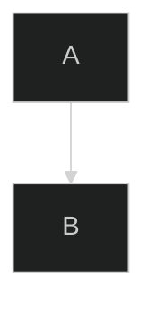

# Mermaid Theming

## Core Theming Architecture

Mermaid's theming system underwent a major overhaul in version 8.7.0, introducing dynamic and integrated theme configuration. The system operates at three distinct levels:

### 1. Built-in Theme Hierarchy

Mermaid provides five core themes, each serving specific use cases:

- **`default`**  : Standard theme with balanced contrast
- **`neutral`**  : Optimized for black-and-white printing
- **`dark`**  : Designed for dark interfaces and dark mode
- **`forest`**  : Green-hued theme for nature/aesthetic contexts
- **`base`**  : The *only* customizable theme—serves as a foundation for custom themes

**Critical constraint**: Only the `base` theme can be modified using `themeVariables`. Other themes are immutable.

### 2. Configuration Methods

Mermaid supports three configuration approaches, each with different scope and use cases:

#### **A. Site-wide Initialization (`mermaid.initialize()`)**
Sets default theme for all diagrams on the page:

```javascript
mermaid.initialize({
  theme: 'dark',
  startOnLoad: true
});
```

#### **B. Diagram-specific Frontmatter**
Overrides site-wide theme for individual diagrams using YAML:

```yaml
---
config:
  theme: forest
  look: handDrawn  # Visual style modifier (classic, neo, handDrawn)
---
flowchart TD
  A --> B
```

#### **C. Directives (Inline Configuration)**
Allows runtime reconfiguration using special syntax:



### 3. Theme Variable System

When using the `base` theme, you can customize 40+ visual properties:

```javascript
mermaid.initialize({
  theme: 'base',
  themeVariables: {
    primaryColor: '#4a5568',
    primaryTextColor: '#ffffff',
    lineColor: '#718096',
    fontFamily: 'Inter, sans-serif'
  }
});
```

**Color calculation engine**: Mermaid automatically derives related colors (borders, backgrounds) from primary variables using inversion, hue shifts, and 10% lightness adjustments.

---

## Adaptive Light/Dark Mode: The Fundamental Challenge

### The Rendering Destruction Problem

Mermaid's default behavior is **destructive**: it replaces `<pre class="mermaid">` elements containing diagram definitions with rendered SVGs, discarding the original source code. This means:

1. **Initial theme choice is permanent** - No built-in re-rendering mechanism
2. **Theme changes require manual intervention** - Must store definitions and re-render
3. **`mermaid.reinitialize()` doesn't work** - Confirmed by community (Issue #1945)

### Detection Strategies

#### **Method 1: OS Preference Detection (Static)**
Detects system theme at page load:

```javascript
const isDark = window.matchMedia('(prefers-color-scheme: dark)').matches;
const theme = isDark ? 'dark' : 'default';
mermaid.initialize({ theme });
```

**Limitation**: Static—doesn't respond to runtime theme switches.

#### **Method 2: LocalStorage-Based User Preference**
Stores explicit user choice across sessions:

```javascript
let theme = localStorage.getItem('pref-theme') === 'dark' ? 'dark' : 'default';
mermaid.initialize({ theme });
```

**Limitation**: Still requires page refresh when preference changes.

#### **Method 3: DOM Attribute Observation (Dynamic)**
Watches for theme changes via `MutationObserver`:

```javascript
const obs = new MutationObserver(() => renderDiagrams());
obs.observe(document.documentElement, {
  attributes: true,
  attributeFilter: ['data-theme']
});
```

This detects when frameworks (e.g., Astro Starlight, MkDocs Material) toggle themes by changing `data-theme` attributes.

---

## Implementation Patterns for Dynamic Theme Switching

### Pattern 1: The Manual Re-render Approach

**Concept**: Disable auto-rendering, store original definitions, and re-render on demand.

```javascript
// 1. Disable automatic rendering
mermaid.initialize({ startOnLoad: false });

// 2. Store original diagram sources (must run after DOM ready)
let diagrams = [];

function storeDiagramSources() {
  diagrams = [...document.querySelectorAll('pre.mermaid')];
  diagrams.forEach((diagram, index) => {
    diagram.dataset.original = diagram.textContent;
    diagram.id = `mermaid-src-${index}`;
  });
}

// 3. Custom render function with theme support
async function renderDiagrams() {
  const currentTheme = document.body.classList.contains('colorscheme-dark')
    ? 'dark' : 'default';

  // Reinitialize with new theme
  mermaid.initialize({
    startOnLoad: false,
    theme: currentTheme
  });

  for (const diagram of diagrams) {
    const definition = diagram.dataset.original;
    const id = `mermaid-${crypto.randomUUID()}`;

    // Render and replace SVG
    const { svg } = await mermaid.render(id, definition);
    diagram.innerHTML = svg;
    diagram.dataset.processed = 'true';
  }
}

// 4. Trigger on load and theme changes
document.addEventListener('DOMContentLoaded', () => {
  storeDiagramSources();
  renderDiagrams();
});
window.matchMedia('(prefers-color-scheme: dark)')
  .addEventListener('change', renderDiagrams);
```

**Advantages**: Full control, works with any theme switcher
**Trade-offs**: Manual DOM management, potential performance impact with many diagrams

### Pattern 2: The MkDocs Material Integration

MkDocs Material theme provides a sophisticated approach using its palette system:

```yaml
# mkdocs.yml
plugins:
  - mermaid2:
      arguments:
        theme: |
          ^(__md_get("__palette").index == 1) ? 'dark' : 'light'
```

**How it works**:

1. `__palette` contains Material's color scheme state
2. JavaScript expression dynamically evaluates theme on initialization
3. Requires custom JS to force reload when palette changes:

```javascript
// docs/extra/refresh_on_toggle_dark_light.js
document.addEventListener('DOMContentLoaded', function() {
  const paletteToggle = document.querySelector('[data-md-component="palette"]');
  if (paletteToggle) {
    paletteToggle.addEventListener('click', () => {
      setTimeout(() => location.reload(), 100);
    });
  }
});
```

**Advantages**: Leverages existing theme infrastructure
**Limitations**: Requires full page reload

### Pattern 3: The Cloudflare Docs Approach (Production-Ready)

Used by Cloudflare's developer documentation, this pattern uses `MutationObserver` for true dynamic switching without reloads:

```javascript
let init = false;
let diagrams = [];

async function render() {
  // Query diagrams on first run (after DOM ready)
  if (!init) {
    diagrams = [...document.querySelectorAll('pre.mermaid')];
    diagrams.forEach(d => d.setAttribute('data-diagram', d.textContent));
  }

  // Determine theme from data attribute
  const theme = document.documentElement.getAttribute('data-theme') === 'light'
    ? 'neutral' : 'dark';

  // Initialize once per render (outside loop)
  mermaid.initialize({ startOnLoad: false, theme });

  for (const diagram of diagrams) {
    const definition = diagram.getAttribute('data-diagram');
    const { svg } = await mermaid.render(`mermaid-${crypto.randomUUID()}`, definition);
    diagram.innerHTML = svg;
    diagram.setAttribute('data-processed', 'true');
  }

  init = true;
}

// Observe theme changes
const obs = new MutationObserver(() => render());
obs.observe(document.documentElement, {
  attributes: true,
  attributeFilter: ['data-theme']
});

// Wait for DOM before initial render
if (document.readyState === 'loading') {
  document.addEventListener('DOMContentLoaded', render);
} else {
  render();
}
```

**Key innovations**:

- Stores definitions in `data-diagram` attribute before first render
- Uses `MutationObserver` instead of manual event listeners
- Avoids FOUC (Flash of Unstyled Content) with `visibility: hidden`

---

## CSS Variable Integration (Modern Approach)

For frameworks like Quarto that expose CSS variables:

```scss
// Define CSS variables for both themes
:root {
  --mermaid-bg-color: #ffffff;
  --mermaid-fg-color: #1a202c;
}

[data-theme="dark"] {
  --mermaid-bg-color: #1a202c;
  --mermaid-fg-color: #ffffff;
}

// Apply to Mermaid containers
.mermaid {
  background-color: var(--mermaid-bg-color);
  color: var(--mermaid-fg-color);
}
```

**Integration with Mermaid** (conceptual—requires preprocessing):

```javascript
// ⚠️ This does NOT work directly—Mermaid requires hex colors
// Frameworks like Quarto resolve CSS variables at build time
mermaid.initialize({
  theme: 'base',
  themeVariables: {
    primaryColor: '#4a5568',      // Must be resolved hex value
    primaryTextColor: '#ffffff'   // Cannot use var(--...)
  }
});
```

**Important**: Mermaid's theming engine only accepts hex colors. CSS variable passthrough requires framework-level preprocessing that resolves variables to hex values before passing to Mermaid (as Quarto does).

---

## Production Considerations & Best Practices

### 1. **Performance Optimization**

- **Lazy-load Mermaid**: Only import when diagrams exist on page
- **Debounce rapid theme changes**: Prevents excessive re-renders
- **SVG caching**: Cache rendered SVGs if definitions are static

### 2. **Accessibility**

- **Preserve ARIA attributes**: Ensure screen readers can interpret diagrams
- **High contrast support**: Provide `neutral` theme option for accessibility
- **Focus management**: Maintain focus state during re-renders

### 3. **Framework-Specific Patterns**

**React/Next.js**:

```jsx
import { useEffect, useState, useId } from 'react';
import mermaid from 'mermaid';
import { useTheme } from './ThemeContext'; // Your theme context

// Initialize once at module level
mermaid.initialize({ startOnLoad: false });

const MermaidDiagram = ({ chart }) => {
  const [svg, setSvg] = useState('');
  const id = useId(); // Stable ID for SSR hydration
  const { theme } = useTheme();

  useEffect(() => {
    let cancelled = false;

    const renderChart = async () => {
      try {
        mermaid.initialize({ startOnLoad: false, theme });
        const { svg } = await mermaid.render(`mermaid-${id}`, chart);
        if (!cancelled) setSvg(svg);
      } catch (err) {
        console.error('Mermaid render failed:', err);
      }
    };

    renderChart();
    return () => { cancelled = true; };
  }, [chart, theme, id]);

  return <div dangerouslySetInnerHTML={{ __html: svg }} />;
};
```

**Vue**:

```vue
<template>
  <div v-html="svg"></div>
</template>

<script setup>
import { ref, watch } from 'vue';
import mermaid from 'mermaid';
import { useTheme } from '@/composables/useTheme'; // Your theme composable

const props = defineProps(['definition']);
const svg = ref('');
const { theme } = useTheme();
let renderCount = 0;

const render = async () => {
  try {
    mermaid.initialize({ startOnLoad: false, theme: theme.value });
    const { svg: rendered } = await mermaid.render(
      `mermaid-${++renderCount}`,
      props.definition
    );
    svg.value = rendered;
  } catch (err) {
    console.error('Mermaid render failed:', err);
  }
};

// Re-render on definition or theme change
watch([() => props.definition, theme], render, { immediate: true });
</script>
```

### 4. **Edge Cases & Failure Modes**

- **SSR/Static Generation**: Render SVGs at build time to avoid client-side JavaScript
- **Large diagrams**: Break into smaller components to prevent rendering lag
- **Memory leaks**: Clean up event listeners and observers on unmount
- **Browser compatibility**: Use `crypto.randomUUID()` polyfill if needed

---

## Summary: Decision Tree for Implementation

**Use static detection** (simplest):

- Single-page applications without theme switching
- Documentation sites that track OS preference only
- When full page reloads are acceptable

**Use dynamic re-rendering** (most flexible):

- Applications with live theme toggle buttons
- Frameworks that expose theme state via DOM attributes
- When preserving user preference across sessions

**Use CSS variables** (framework-integrated):

- When using Bootstrap/Quarto-like frameworks with CSS variable theming
- For consistent color palette across diagrams and UI
- Requires framework-level Mermaid integration

The core insight remains: Mermaid's theming is powerful but static-by-design. True dynamic adaptation requires manual DOM management and re-rendering, making it more complex than typical dark mode implementations.
