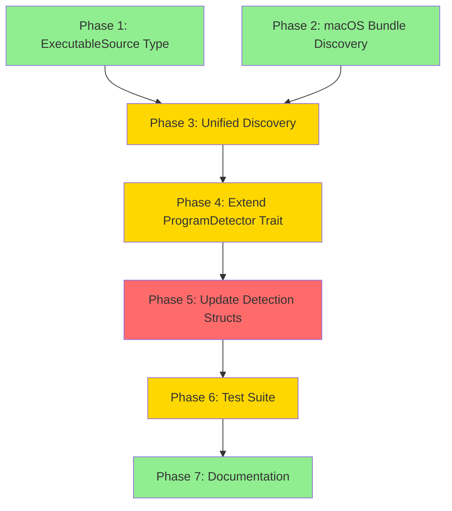

# Planning Process

- [x] Pre-flight Check [11:23am]
    - [x] Catalogs validated
    - [x] Directories ready
    - [x] Budget estimated: medium (~40%)
- [x] Prep Started [11:24am]
    - [x] Identified Skills: rust, rust-testing, rayon (required); which, thiserror, serde (suggested)
    - [x] Identified Subagents: Explore, Plan, concurrency-reviewer, correctness-reviewer, feature-tester-rust, completeness-reviewer
- [x] Prep complete [11:25am]
- [x] Clarify & Research [11:25am]
    - [x] Clarification agent returned
    - [x] User answered 3 questions: Priority=PATH first, Scope=/Applications+~/Applications, API=ExecutableSource enum
    - [x] Requirements updated with refined specification
    - [x] Package research not needed (no new packages)
- [x] Planning Subagent [agent: **Plan**] started [11:26am]
    - [x] subagent skills used: rust, rayon, thiserror, serde
    - [x] Planning completed - 7 phases designed
- [ ] Module Assessment - skipped (single module: sniff/lib)
- [x] All Pre-review Steps complete [11:27am]
- [x] Reviews Started [11:28am]
   - [x] Completeness Review - structure validated, minor Phase 7 skills gap
   - [x] Concurrency Review - Phases 1&2 parallel confirmed, 6&7 optional parallel
   - [x] Correctness Review - macOS bundle structure approach validated
   - [x] Risk Assessment - all risks LOW level, no blockers
- [x] Reviews Completed [11:29am]
- [x] Plan Finalization [11:30am]
    - [x] Review feedback incorporated (Phase 7 skills added, parallelization noted)
    - [x] Dependency graph validated
- [x] Plan finalized [11:30am]
- [x] Final Steps
    - [x] Lessons learned: none (reviews found existing plan context confusion but no skill/doc issues)
    - [x] Package research: not needed (no new dependencies)
- [x] Summary reported [11:30am]
    - Plan: `sniff/.ai/plans/2026-01-26.plan-for-macos-app-bundle-detection.md`
    - Phases: 7 (2 Low, 4 Medium, 1 High complexity)
    - Duration: 7 minutes
    - Risks: 3 LOW (no blockers)

## Plan

### Phase 1: Add ExecutableSource Type
**Agent:** `general-purpose` | **Skills:** rust, serde | **Complexity:** Low
**Deps:** None | **Parallel:** Yes (with Phase 2)

**Goal:** Define the `ExecutableSource` enum for distinguishing executable discovery methods.

**Deliver:**
- `ExecutableSource` enum in `sniff/lib/src/programs/types.rs`
- Re-export from `sniff/lib/src/programs/mod.rs`

**Pass when:**
- [ ] `ExecutableSource` enum compiles with `Serialize`/`Deserialize`
- [ ] Unit tests verify enum variants and serialization roundtrip
- [ ] Documentation includes `## Examples` section

---

### Phase 2: Implement macOS App Bundle Discovery
**Agent:** `general-purpose` | **Skills:** rust, rayon | **Complexity:** Medium
**Deps:** None | **Parallel:** Yes (with Phase 1)

**Goal:** Create macOS-specific functions to search for .app bundles.

**Deliver:**
- New file `sniff/lib/src/programs/macos_bundle.rs`
- `find_macos_app_bundle(program_name: &str) -> Option<PathBuf>` function
- App name mapping for common mismatches
- Stub for non-macOS platforms

**Pass when:**
- [ ] Function compiles on macOS with correct executable path returned
- [ ] Function compiles on Linux/Windows (returns `None`)
- [ ] App name mapping handles common cases

---

### Phase 3: Add Unified Discovery Function
**Agent:** `general-purpose` | **Skills:** rust | **Complexity:** Medium
**Deps:** Phase 1, Phase 2 | **Parallel:** No

**Goal:** Create `find_program_with_source()` combining PATH and app bundle lookup.

**Deliver:**
- `find_program_with_source()` in `find_program.rs`
- `find_programs_with_source_parallel()` for batch lookups
- PATH priority enforcement

**Pass when:**
- [ ] PATH executables return `ExecutableSource::Path`
- [ ] macOS-only apps return `ExecutableSource::MacOsAppBundle` when not in PATH
- [ ] Programs in PATH are NOT searched in app bundles

---

### Phase 4: Extend ProgramDetector Trait
**Agent:** `general-purpose` | **Skills:** rust | **Complexity:** Medium
**Deps:** Phase 3 | **Parallel:** No

**Goal:** Add `path_with_source()` method to `ProgramDetector` trait.

**Deliver:**
- New `path_with_source()` method with default implementation
- No changes to existing `path()` method (backward compatibility)

**Pass when:**
- [ ] Trait compiles with default implementation
- [ ] Existing implementors work without modification
- [ ] Default implementation returns `Path` source

---

### Phase 5: Update Detection Structs for Source Tracking
**Agent:** `general-purpose` | **Skills:** rust, rayon | **Complexity:** High
**Deps:** Phase 4 | **Parallel:** No

**Goal:** Update detection structs to use unified discovery and track sources.

**Deliver:**
- Updated storage in detection structs
- Override `path_with_source()` in each implementor

**Files:** `editors.rs`, `terminal_apps.rs`, `utilities.rs`, `pkg_mngrs.rs`, `tts_clients.rs`, `headless_audio.rs`

**Pass when:**
- [ ] All detection structs compile with new storage
- [ ] `path()` still returns just `Option<PathBuf>` (backward compatible)
- [ ] `path_with_source()` returns correct source for each program

---

### Phase 6: Add Comprehensive Test Suite
**Agent:** `feature-tester-rust` | **Skills:** rust, rust-testing | **Complexity:** Medium
**Deps:** Phase 5 | **Parallel:** No

**Goal:** Create thorough test coverage for the new functionality.

**Deliver:**
- Unit tests in `macos_bundle.rs` and `find_program.rs`
- Integration tests with platform guards
- Test fixtures for mock app bundle structure

**Pass when:**
- [ ] All unit tests pass
- [ ] Platform-specific tests run correctly on macOS
- [ ] Tests pass on Linux/Windows (stub behavior verified)

---

### Phase 7: Documentation and Module Re-exports
**Agent:** `general-purpose` | **Skills:** rust | **Complexity:** Low
**Deps:** Phase 6 | **Parallel:** No

**Goal:** Add comprehensive documentation and ensure public API is properly exported.

**Deliver:**
- Module documentation in `mod.rs`
- Re-exports for new public types
- Examples for macOS bundle detection

**Pass when:**
- [ ] `cargo doc` builds without warnings
- [ ] All new public types documented with examples

## Dependency Graph

## Risks

> Implementation risks identified during planning with mitigation strategies.

| Level | Category | Description | Affected | Mitigation |
|-------|----------|-------------|----------|------------|
| LOW | performance | Parallel filesystem scans may be slower than PATH lookup | Phase 2,3 | Only scan bundles as fallback when PATH fails |
| LOW | compatibility | Some apps have non-standard executable names | Phase 2 | Maintain explicit mapping table for known mismatches |
| LOW | testing | Cannot test real .app detection in CI without macOS runner | Phase 6 | Use platform guards, add fixture-based tests |

## Lessons Learned

> Discoveries about skills or memory resources that were inaccurate, incomplete, or missing.

## Package Changes

> Dependencies to be added, updated, or removed during implementation.

- None required (convention-based discovery avoids plist dependency)
