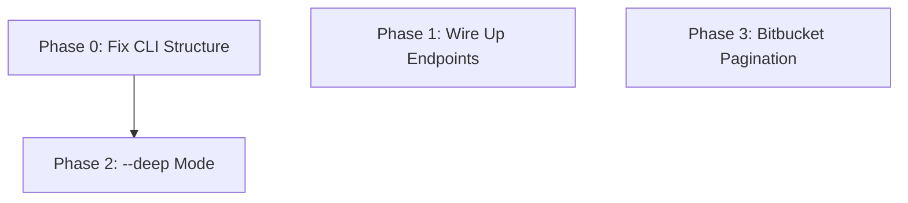

# Planning: Repo Remotes Feature Completion

## Current State Assessment

The repo remotes feature is **substantially complete** with working implementations for all four Stage 1 providers (GitHub, GitLab, Gitea, Bitbucket). All required schematic endpoints are now available. This plan documents remaining gaps and the work needed to finish.

### What's Implemented

| Component | Status | Notes |
|-----------|--------|-------|
| `RemoteRepoProvider` trait | ✅ Complete | All 11 methods defined |
| `GitRemote` enum | ✅ Complete | Provider dispatch + URL detection |
| `parse_remote_url()` | ✅ Complete | All URL formats supported |
| Normalized types | ✅ Complete | `RepoMetadata`, `PullRequestInfo`, `IssueInfo`, etc. |
| Error types | ✅ Complete | `RemoteInit`, `RemoteApi`, `RateLimited`, `MissingCredentials` |
| Feature flags | ✅ Complete | `network` and `remote` features |

**Schematic Endpoint Availability:**

All endpoints required by the tech design are now implemented in schematic-definitions:

| Provider | Endpoint | Request Struct | Status |
|----------|----------|----------------|--------|
| GitHub | `GET /repos/{owner}/{repo}/actions/runs` | `ListWorkflowRunsRequest` | ✅ Available |
| GitHub | `GET /orgs/{org}/repos` | `ListOrgReposRequest` | ✅ Available |
| GitLab | `GET /projects/{id}` | `GetProjectRequest` | ✅ Available |
| GitLab | `GET /projects/{id}/pipelines` | `ListProjectPipelinesRequest` | ✅ Available |
| GitLab | `GET /groups/{id}/projects` | `ListGroupProjectsRequest` | ✅ Available |
| Gitea | `GET /orgs/{org}/repos` | `ListOrgReposRequest` | ✅ Available |
| Bitbucket | `GET /repositories/{workspace}` | `ListWorkspaceReposRequest` | ✅ Available |

**Provider Implementations (trait methods):**

| Provider | `get_repo_metadata` | `list_documents` | `list_pull_requests` | `list_issues` | `get_tags_and_releases` | `detect_cicd` | `get_org_info` | `list_org_repos` |
|----------|---------------------|------------------|----------------------|---------------|-------------------------|---------------|----------------|------------------|
| GitHub | ✅ | ✅ | ✅ | ✅ | ✅ | ⚠️ file detection only | ❌ stub | ❌ stub |
| GitLab | ⚠️ workaround | ✅ | ✅ | ✅ | ✅ | ⚠️ file detection only | ❌ stub | ❌ stub |
| Gitea | ✅ | ✅ | ✅ | ✅ | ✅ | ✅ file detection | ❌ stub | ❌ stub |
| Bitbucket | ✅ | ✅ | ✅ | ✅ | ✅ | ⚠️ file detection only | ⚠️ basic | ❌ stub |

Key:
- ⚠️ **workaround** = GitLab uses `ListRepositoryTree` instead of `GetProject` (now available)
- ⚠️ **file detection only** = Detects CI config files but doesn't fetch actual pipeline runs
- ❌ **stub** = Returns empty `Vec` or `Err(501)` — schematic endpoints exist but not wired up

**CLI Integration:**

| Feature | Status | Notes |
|---------|--------|-------|
| `sniff remote <URL>` | ✅ | Standalone remote inspection |
| `sniff repo --remote <name>` | ⚠️ WRONG | Should be on `git` subcommand per design |
| `sniff repo --remote <URL>` | ⚠️ WRONG | Should be on `git` subcommand per design |
| Text output | ✅ | `print_remote_text()` |
| JSON output | ✅ | `print_remote_json()` |
| `--deep` local+remote | ❌ | Not implemented |

**CLI Design Discrepancy:**

The functional design specifies remote functionality on the `git` subcommand:
- `sniff git <remote-name>` - Query remote info (e.g., `sniff git origin`)
- `sniff git <URL>` - Query remote by URL
- `sniff git --deep` - Local + remote combined

But the current implementation incorrectly places `--remote` on the `repo` subcommand:
- `sniff repo --remote origin` - Current (incorrect)
- `sniff repo --remote https://...` - Current (incorrect)

This needs to be corrected in Phase 0 below.

**Testing:**

| Test Type | Status | Location |
|-----------|--------|----------|
| URL parser unit tests | ✅ 30+ tests | `url_parser.rs` |
| Document categorization tests | ✅ | Each provider file |
| Error mapping tests | ✅ | Each provider file |
| Wiremock integration tests | ✅ 42 tests | `tests/remote_providers.rs` |
| CLI parsing tests | ✅ | `main.rs` tests module |

### Remaining Gaps

1. **GitLab metadata**: `get_repo_metadata()` uses `ListRepositoryTree` workaround — `GetProject` endpoint now available and should be used
2. **Organization/Group methods**: `get_org_info()` and `list_org_repos()` return stubs — endpoints now exist in schematic
3. **CI/CD run status**: Only detects config files — `ListWorkflowRuns` (GitHub) and `ListProjectPipelines` (GitLab) now available
4. **Bitbucket pagination**: Only first page returned
5. **CLI structure**: Remote on wrong subcommand

---

## Remaining Work

### Phase 0: Fix CLI Command Structure (Required)
**Agent:** `general-purpose` | **Skills:** rust, sniff, clap | **Complexity:** Low
**Deps:** None | **Parallel:** No

**Goal:** Move remote functionality from `repo` subcommand to `git` subcommand per functional design.

**Current (incorrect):**
```bash
sniff repo --remote origin
sniff repo --remote https://github.com/owner/repo
```

**Target (per design):**
```bash
sniff git origin              # Positional arg for remote name or URL
sniff git https://...         # Positional arg for URL
sniff git rust-lang/cargo     # org/repo shorthand (queries all known providers)
sniff git --deep              # Local + remote combined
```

**Deliver:**
- [ ] Add optional positional `remote` arg to `Git` variant
- [ ] Move `repo_remote()` and `resolve_remote_name()` logic to git command handling
- [ ] Remove `--remote` flag from `Repo` variant
- [ ] Update help text and examples
- [ ] Update CLI tests

**Pass when:**
- [ ] `sniff git origin` fetches remote info for origin
- [ ] `sniff git https://github.com/owner/repo` fetches remote by URL
- [ ] `sniff repo` no longer accepts `--remote` flag
- [ ] `cargo test -p sniff-cli` passes
- [ ] CLI help matches functional design

**If failed:**
- Rollback: Restore `--remote` on repo command
- Retry: Check clap positional arg syntax

---

### Phase 1: Wire Up Available Schematic Endpoints
**Agent:** `general-purpose` | **Skills:** rust, sniff, wiremock | **Complexity:** Medium
**Deps:** None | **Parallel:** Yes (with Phase 0)

**Goal:** Replace all provider stubs with real API calls using the now-available schematic endpoints.

**Deliver:**

**1a. GitLab metadata upgrade:**
- [ ] Update `GitLabRemote::get_repo_metadata()` to use `GetProjectRequest` instead of `ListRepositoryTree` workaround
- [ ] Map `Project` response to `RepoMetadata` (stars, forks, description, language, topics, etc.)

**1b. Organization info (all providers):**
- [ ] GitHub: Wire `get_org_info()` — needs `GetOrganization` endpoint or extract from `ListOrgRepos` response
- [ ] GitLab: Wire `get_org_info()` — extract from `GetProject` group info or add `GetGroup` if available
- [ ] Gitea: Wire `get_org_info()` — needs `GetOrganization` endpoint
- [ ] Bitbucket: Already has basic implementation

**1c. Organization repos (all providers):**
- [ ] GitHub: Wire `list_org_repos()` using `ListOrgReposRequest`
- [ ] GitLab: Wire `list_org_repos()` using `ListGroupProjectsRequest`
- [ ] Gitea: Wire `list_org_repos()` using `ListOrgReposRequest`
- [ ] Bitbucket: Wire `list_org_repos()` using `ListWorkspaceReposRequest`

**1d. CI/CD run status (GitHub + GitLab):**
- [ ] GitHub: Update `detect_cicd()` to use `ListWorkflowRunsRequest` for actual run status
- [ ] GitLab: Update `detect_cicd()` to use `ListProjectPipelinesRequest` for pipeline status

**1e. Update wiremock tests:**
- [ ] Add fixtures and tests for each newly wired endpoint
- [ ] Update existing `get_repo_metadata` test for GitLab

**Pass when:**
- [ ] `GitLabRemote::get_repo_metadata()` returns full metadata (stars, description, etc.)
- [ ] `list_org_repos()` returns real data for all four providers
- [ ] `detect_cicd()` returns run status for GitHub and GitLab
- [ ] All 42+ wiremock integration tests pass (plus new ones)
- [ ] `cargo test -p sniff --features remote` passes

**If failed:**
- Rollback: Revert to stub implementations (they're correct, just incomplete)
- Retry: Check generated type names against schematic-schema source

---

### Phase 2: `--deep` Mode Integration
**Agent:** `general-purpose` | **Skills:** rust, sniff, clap | **Complexity:** Medium
**Deps:** Phase 0 | **Parallel:** No

**Goal:** When `sniff git --deep` is used, supplement local git info with remote data.

**Deliver:**
- [ ] Add `RemoteReport` field to `SniffResult` (feature-gated)
- [ ] Detect remote URL from local git repo origin
- [ ] Fetch remote report and merge into output
- [ ] Update text/JSON output formatters

**Pass when:**
- [ ] `sniff git --deep` shows remote info alongside local
- [ ] Remote failure degrades gracefully (warning, local-only output)
- [ ] `sniff git --deep --json` includes both local and remote data

**If failed:**
- Rollback: Remove --deep remote integration
- Retry: Ensure async runtime is available in CLI context

---

### Phase 3: Bitbucket Full Pagination
**Agent:** `general-purpose` | **Skills:** rust, sniff | **Complexity:** Low
**Deps:** None | **Parallel:** Yes

**Goal:** Follow pagination links to retrieve all results from Bitbucket API.

**Deliver:**
- [ ] Implement `fetch_all_pages()` helper
- [ ] Update `list_pull_requests()`, `list_issues()`, `list_documents()`
- [ ] Add pagination tests

**Pass when:**
- [ ] Bitbucket provider retrieves >10 results when available
- [ ] Pagination respects rate limits (no parallel page fetches)

**If failed:**
- Rollback: Keep first-page-only behavior
- Retry: Check Bitbucket API response `next` field format

---

## Risks

| Level | Category | Description | Affected | Mitigation |
|-------|----------|-------------|----------|------------|
| LOW | breaking | Moving --remote to git command changes CLI interface | Phase 0 | Not yet shipped publicly |
| LOW | scope | `--deep` mode adds complexity to CLI | Phase 2 | Graceful degradation on remote failure |
| LOW | external | API rate limits during testing | All phases | Use wiremock for all tests |

---

## Lessons Learned

_None yet._

---

## Package Changes

_None required — all dependencies are already in place._

---

## Dependency Graph



- **Phase 0** is required and should be done first
- Phase 0 → Phase 2 are sequential (--deep mode depends on correct git command structure)
- Phase 1 is independent and can run in parallel with Phase 0
- Phase 3 is independent

---

## Recommendation

The repo remotes feature is **functionally complete** but needs two corrections before shipping:

1. **Required**: Phase 0 moves remote functionality to `git` subcommand (per functional design)
2. **Required**: Phase 1 wires up now-available schematic endpoints to replace stubs

**Suggested execution order:**
1. **Phase 0 + Phase 1** in parallel — fix CLI structure while wiring up endpoints
2. **Phase 2** after Phase 0 — implement `--deep` mode
3. **Phase 3** any time — Bitbucket pagination is independent
