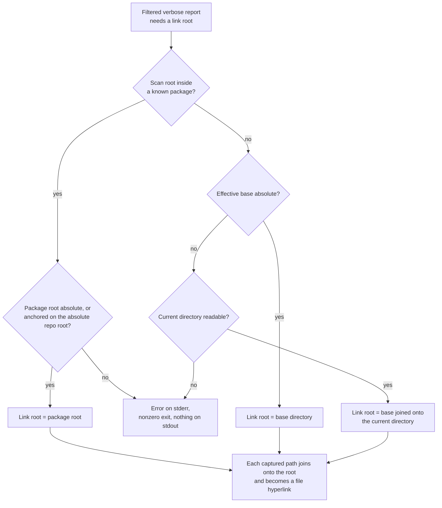

# File Association Reports

Use `sniff files` to count files by category, such as images, documentation,
or programming languages. Filter the displayed categories with `--association`:

```sh
sniff files
sniff files --association image
sniff files --association image -v
sniff files --association image --json
```

The percentage uses all classified files in the scan as its denominator. For
example, three images among twelve files appear as `3 (25.0%)`, including when
only the image category is displayed. Filtered JSON's `total_files` counts
matching files, while each category's percentage retains the denominator of
the full scan.

## Listing the matching files

Add `-v` to a **filtered** report to see which files matched, not just how
many:

```sh
sniff files --association image -v
```

```text
Association    Count
Image          2 (50.0%)

Files:
- assets/banner.png
- assets/logo.svg
```

The table styling shown above is illustrative; the terminal render keeps its
existing borders. The list appears directly after the summary table (and after
the incomplete-scan notice when a scan was capped), and before any language or
framework details. Rules the list follows:

- Every captured matching path is listed once, in native path order (the
  same order on every run for an unchanged tree; the order can differ
  between operating systems).
- Labels keep directory segments, so identical basenames in different
  directories stay distinguishable. Paths are shown relative to the scan's
  root — the same relative form JSON reports — never rebased onto your
  current directory.
- Each entry is a hyperlink to the actual file when the terminal supports
  hyperlinks; terminals without that support, including redirected or piped
  output, show the same label as plain text with no link syntax added, so
  `photo[x].png` stays `photo[x].png`. `--plain` prints the same paths with
  no color or hyperlink escape sequences.
- Filenames are rendered as literal text. Control characters appear as
  visible escapes (`\n`, `\t`), and a literal backslash doubles (`\\`), so a
  filename can never inject extra report lines or terminal sequences and an
  ordinary name that merely looks like an escape stays distinguishable from
  a real control character.
- Verbosity changes presentation only: the scan, its counts, percentages,
  and JSON output are identical with and without `-v`. An unfiltered
  `sniff files -v` adds language/framework details but gains no file list.

## Link roots

Relative list entries link against the same root the scan classified them
from — never the directory you launched from:

- when the scan root lies inside a known package, the link root is that
  package's root (so invoking from `pkg/src` still links `assets/logo.svg`
  to `pkg/assets/logo.svg`);
- otherwise the link root is the effective base directory, with a relative
  `--base` resolved against the invocation directory.



The root is derived from the scan's own package knowledge; files are never
probed or canonicalized per entry, so a file deleted after the scan still
appears in the list and the report still succeeds. When the root cannot be
established (an unusable current directory for a relative base, or a package
root with no absolute anchor), the command reports the error on stderr and
exits nonzero without printing a report — it never guesses a root. This
failure mode belongs to filtered verbose text only: JSON, unfiltered, and
non-verbose reports never resolve a root and never fail this way.

## Scan scope and `--base`

The default base directory is the current directory. If it belongs to a known
package, Sniff scans that package's root and excludes nested packages. Otherwise,
it scans the base directory and its descendants. Override the base with
`--base`:

```sh
sniff --base ./biscuit-terminal files --association image
sniff --base ./biscuit-terminal/lib/src files --association image
```

The first command scans the area directory, including its library and CLI. The
second scans the owning library package. Repository membership is discovered
without classifying unrelated repository files. Git ignore rules and Sniff's
generated-directory exclusions apply to the scan.

## Incomplete scans

Classification is capped at 10,000 files in the requested scope. A complete
scan has stable results for an unchanged tree. If the scope itself exceeds
the cap, parallel workers select a partial sample that can vary between runs.
Text output displays an **Incomplete scan** notice; JSON includes
`"truncated": true` and `"limit": 10000`. Counts and percentages then describe
the sample, so an empty filtered table does not prove the category is absent.
A verbose list under a capped scan lists only the captured sample, after the
notice. Use `--base` to select a smaller scope when you need a complete count.
