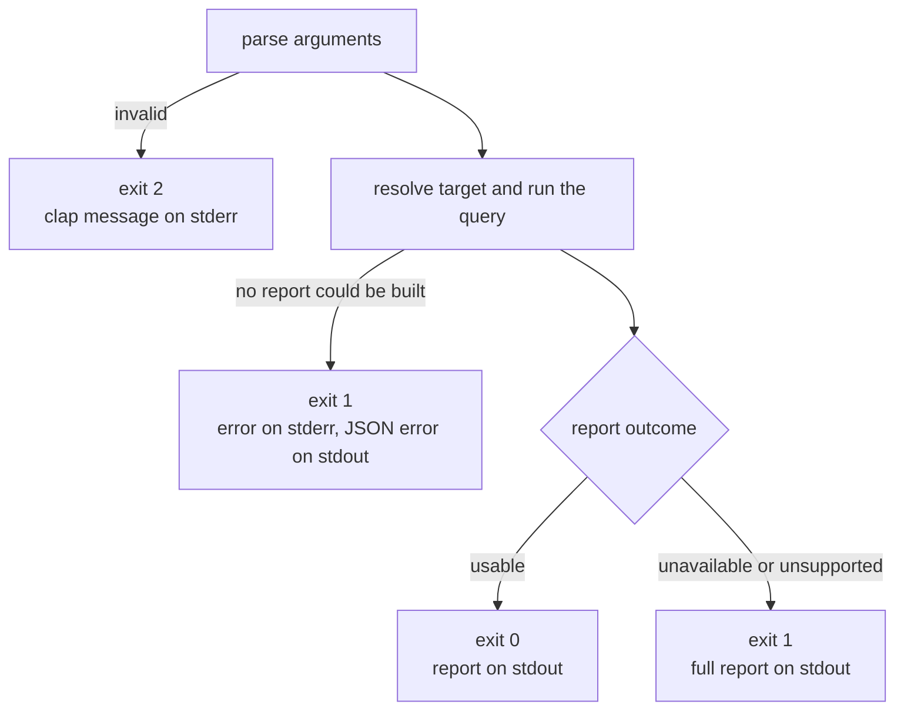

# `sniff filesystem query`

Show which processes are using a file or directory tree, and how much of the
system Sniff could inspect to find out:

```sh
sniff filesystem query ./checkout
sniff filesystem query ./checkout --json
sniff filesystem query ./checkout --plain
sniff filesystem query ./checkout --target-only --timeout 500
```

The command is a thin front end over the library query described in
[Filesystem process usage queries](../topics/filesystem-query.md). It runs
that query once and prints the captured report; it never stops processes or
changes anything on disk.

## Choosing the target

| Argument | What is queried |
| --- | --- |
| `./checkout`, `checkout`, `/abs/path` | That path. A relative path resolves against the directory you ran the command from; the global `--base` flag does not apply |
| `@name`, `&path`, `^path`, `~/path`, `vault:path` | The local file or directory the [file reference](../../../biscuit-file/README.md) resolves to. `&` and `^` anchor on the enclosing Git root only; the command never runs a repository inventory to resolve them |
| `https://…` | Rejected: only local targets can be queried |

A path that is not valid UTF-8 is passed to the query exactly as given, and
the JSON report keeps its raw bytes. A reference that matches nothing is an
error; the command never falls back to the current directory.

A directory query includes every descendant, hidden and Git-ignored files
included. `--target-only` inspects the named file or directory alone.

`--timeout <MS>` sets the shared work budget in milliseconds (default 2000).
When it runs out, Sniff **stops scheduling new work** and reports what it
found. A system call that is already running can take longer, so the budget
is not a limit on when the command returns. Zero, negative, fractional, or
overflowing values are usage errors.

## Reading the output

```text
Filesystem usage: /work/checkout
  Scope: directory and its descendants
  Budget: 2000 ms, used 63 ms

PID 8124  node
  Executable: /usr/local/bin/node
  user 501, started 2026-10-06 09:00:00 UTC
  Working directory: /work/checkout
  Open handle (read/write, descriptor 12): /work/checkout/.gitnexus/index.db

Coverage
  Process enumeration: complete (1108 of 1108 succeeded)
  Tree identity: complete (99 of 99 succeeded)
  Open handles: partial (856 of 1108 succeeded)
    - permission was denied for some processes (252 cases) e.g. PID 152
  Working directories: partial (856 of 1108 succeeded)
  FSEvents: unsupported. macOS offers no supported systemwide inventory of FSEvents subscriptions

Discovery is partial.
  Mechanisms marked unsupported cannot be inventoried on this system.
  A match shows usage; it does not prove that deleting the target will fail.
```

- **Processes** list the PID, the identity fields Sniff could read, and one
  line of evidence per open handle, working directory, watch registration, or
  loaded module. A hard-linked file lists every in-scope path; a handle opened
  through a path outside the tree shows that spelling as `observed as`.
- **Coverage** has one line per discovery mechanism, including mechanisms this
  OS cannot inventory at all. `partial`, `failed`, and `not attempted` mean
  some processes or entries were not inspected; the indented lines say why.
- **An empty result is not proof.** "No processes were found" only covers what
  the coverage section says was inspected.

The text view shows at most 50 processes and 20 evidence lines per process,
and states how many it left out. `--json` always carries everything.

Coverage and limitations are part of the report, so they are on stdout in
every mode, including `--plain`. File names and process names are shown
literally: markup is not interpreted, and control characters (terminal
escape sequences, newlines) are shown as `\u{1b}`, `\n`, and so on. When
stdout is not a terminal, lines are not wrapped, so a path is never split.

## JSON

`--json` prints the library report as one JSON object, unfiltered, with the
original values (for example an exact non-UTF-8 path) intact. `--json` wins
over `--plain`. With `--perf`, the object gains a `performance` field holding
timings and work counters, and a rendered summary goes to stderr.

A failure that leaves no report prints this on stdout, with a diagnostic on
stderr:

```json
{ "error": { "kind": "missing_target", "message": "target does not exist: /work/nope" } }
```

`kind` is one of the library's typed errors (`invalid_option`,
`missing_target`, `unsupported_target_kind`, `root_validation_timeout`,
`root_identity`) or a resolution error (`invalid_reference`,
`nonlocal_reference`, `reference_not_found`, `reference_context_missing`,
`reference_io`, `reference_repository`, `current_directory`). Scripts should
check the exit code and the `error` field before reading report fields.

## Exit codes



| Result | Exit code |
| --- | --- |
| `usable` report, including partial coverage or no matches | 0 |
| `unavailable` report (no mechanism could inspect a process) or `unsupported` report (nothing can be inventoried here) | 1 |
| Target or option error with no report | 1 |
| Invalid arguments, including `--refresh-remotes` or `--latest-versions` combined with `query` | 2 |

Finding matches never changes the exit code: discovery is not a removal
policy. The bare `sniff filesystem` report and its `--refresh-remotes` and
`--latest-versions` flags are unchanged.

## Testing seam

Setting `SNIFF_FILESYSTEM_QUERY_REPLAY` to a file containing a serialized
report makes the command render that report instead of querying the host. It
exists so tests can compare the text and JSON views of one observation and
produce outcomes a live host cannot produce on demand; it is not a supported
interface.
